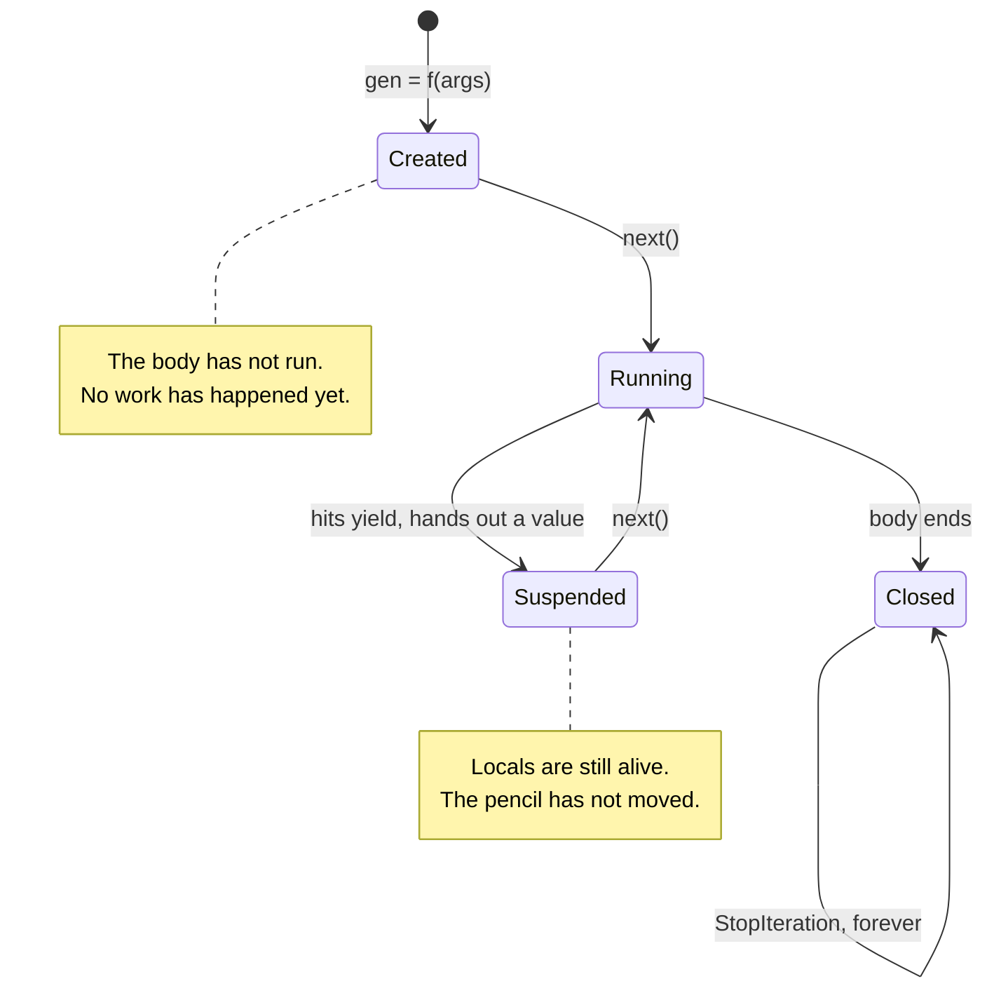

# 2.1 — `yield`: the function that pauses

## One-line answer

A function containing `yield` does not run when you call it — it hands you a reader, and each item
you ask for runs the body up to the next `yield` and then stops there, with every local variable
still exactly where it was.

---

## The story

The person at the deli's back counter has a helper now, and the helper works differently from
everybody else.

Ask the helper for an order and they read one line off the sheet, hand it to you, and **stop
mid-sentence**. They do not carry on to the next line. They stand there, pencil still resting on the
line they just read, waiting.

Ask again, and they carry on from exactly that spot: move the pencil down, read the next line, hand
it over, stop again.

The sheet still says:

```text
milk
  Milk
eggs
Eggs.
```

Two things about this are worth pausing on, because they are unusual and they are the whole idea.

The first is that the helper does no work at all until asked. Say "start on the sheet" and they pick
it up and stand there. Nothing has been read. The first line comes out only when somebody actually
asks for it.

The second is that between one request and the next, the helper is **paused, not finished**. They
have not put the sheet down, they have not forgotten what they were in the middle of, and they have
not gone back to the top. Everything about where they are is still true. They are simply not moving.

Most people, described this way, find it strange. Most *functions* work the other way: you call them,
they run all the way through, and they are done. This helper is a function that can stop halfway and
be started again.

---

## The idea in plain language

A **generator function** is an ordinary function with the word `yield` in its body. That one word
changes everything about how the function behaves.

When you call an ordinary function, its body runs. When you call a generator function, **the body
does not run at all**. What you get back is a **generator** — a reader, the same kind of object
section 1 built by hand, with `__iter__` and `__next__` already written for you.

Each time something asks that reader for an item:

1. The body runs, from wherever it last stopped.
2. It runs until it reaches a `yield`.
3. The value after `yield` is handed out, and the function **pauses on that line**.
4. Every local variable keeps its value, ready for next time.

When the body eventually reaches its end — or a bare `return` — the reader raises `StopIteration`,
and a `for` loop around it ends quietly. That is the same signal as
[1.1](../01-iterators/1.1-iterable-and-iterator.md), produced for you.

Two words for this. The function is **lazy**: it computes each item at the moment it is asked for,
not before. And the pause point is where its **state** lives — the local variables, the position in
any loop it is inside, everything — which is why nothing has to be stored on an object by hand the
way [1.2](../01-iterators/1.2-writing-next-by-hand.md) had to.

The difference from `return` is worth stating plainly, because it is the whole distinction:

- `return` ends the function. Nothing after it runs, and calling the function again starts from the
  top.
- `yield` pauses the function. Everything after it runs next time, starting from that exact line.

Generators arrived in Python through *PEP 255 — Simple Generators* (2001,
<https://peps.python.org/pep-0255/>), which introduced `yield` so that a function could hand back
values one at a time while keeping its local state between resumptions. That is a fair one-sentence
description of everything in this document.

You have already used one of these without the keyword. A generator expression
([Day 9, 2.3](../../../day-09-comprehensions/parts/02-dict-set-gen/2.3-the-generator-expression.md))
is the same object, written in a single line of brackets. A generator *function* is what you reach
for when the logic does not fit in one expression.

---

## Why Setu needs it

- **It replaces every line of section 1.** The class in
  [1.2](../01-iterators/1.2-writing-next-by-hand.md) is nine lines of position-keeping and one
  off-by-one waiting to happen. The generator version is three lines and cannot get the order wrong.
  Section 1 exists so that you know what those three lines stand in for.
- **[2.3](2.3-streaming-a-file.md) reads a file too large to hold**, which is the plan's named example
  for `PY-11` — streaming a log line by line without loading it. That reader is a generator, and it
  cannot be written any other way without going back to section 1's class.
- **Day 16 writes a 50 000-line JSONL file without a memory spike**, and the shape it uses is a
  generator producing one line at a time into a writer that consumes them.
- **Day 185's LangGraph streaming and Day 197's human-in-the-loop pause** are both this idea at a much
  larger scale: a computation that stops in the middle, keeps everything it knows, and continues when
  something on the outside says go. A graph that pauses for a human approval is a generator with a
  checkpoint behind it.

---

## The mechanism

The smallest generator that does something, next to the ordinary function it replaces:

```python
"""One word changes what calling the function does."""


def eager_slips(sheet):
    """An ordinary function: does all the work, hands back a list."""
    out = []
    for line in sheet:
        print("  ...working on", repr(line))
        out.append(line.strip())
    return out


def lazy_slips(sheet):
    """A generator function: does one line's work per request."""
    for line in sheet:
        print("  ...working on", repr(line))
        yield line.strip()


slips = ["milk", "  Milk", "eggs", "Eggs."]

print("calling eager_slips:")
eager = eager_slips(slips)
print("got:", type(eager).__name__)

print()
print("calling lazy_slips:")
lazy = lazy_slips(slips)
print("got:", type(lazy).__name__)

print()
print("now asking for one item:")
print("first:", next(lazy))
```

**Line by line:**

- `def eager_slips(sheet):` — no `yield` anywhere in the body, so this is a normal function. Calling
  it runs the whole loop.
- `print("  ...working on", ...)` inside both bodies — this is the instrument. It shows *when* work
  happens, which is the only difference between the two functions and is otherwise invisible.
- `yield line.strip()` — **the one word.** Nothing else about `lazy_slips` differs from a version that
  appended to a list and returned it.
- `eager = eager_slips(slips)` prints all four "working on" lines **before** the next statement runs,
  and `type(eager).__name__` is `list`. The work is finished and the result is a container.
- `lazy = lazy_slips(slips)` prints **nothing at all**, and `type(lazy).__name__` is `generator`. The
  body has not started. This is the line people misread most often: the call did not run the
  function.
- `next(lazy)` prints exactly one "working on" line and then `first: milk`. One request, one line of
  work. The function is now paused on the `yield`, inside the loop, with `line` still bound to
  `"milk"`.

Now watch the pausing directly:

```python
"""Where the function is between requests."""


def counted_slips(sheet):
    print("A: body starts")
    for index, line in enumerate(sheet):
        print(f"B: about to yield #{index}")
        yield line.strip()
        print(f"C: woke up after #{index}")
    print("D: body ends")


gen = counted_slips(["milk", "  Milk"])

print("--- created, nothing has run ---")
print("got:", next(gen))
print("--- paused ---")
print("got:", next(gen))
print("--- paused ---")
try:
    next(gen)
except StopIteration:
    print("E: StopIteration, as promised")
```

**Line by line:**

- `print("A: body starts")` sits **before** the loop and does not run at creation time. It appears
  only after the first `next`, which proves the body had not begun.
- `enumerate(sheet)` — index and value together
  ([Day 6, 1.3](../../../day-06-loops/parts/01-iteration/1.3-enumerate-and-zip.md)), used here purely
  to number the messages.
- `yield line.strip()` with a `print` on the line above and the line below — the pair that makes the
  pause visible. `B` prints, then the value comes out, then **nothing more happens** until the next
  request, at which point `C` prints.
- The output order is `A`, `B#0`, `milk`, then `C#0`, `B#1`, `Milk`, then `C#1`, `D`, then
  `StopIteration`. Read that sequence twice: **`C: woke up after #0` prints during the second
  `next` call**, not during the first. The function really did stop in the middle of a loop body.
- `print("D: body ends")` runs on the third request, as the body falls off the end. Reaching the end
  of a generator body is what produces `StopIteration`; you do not raise it yourself.
- `try: ... except StopIteration:` — catching it by hand because there is no `for` loop here to catch
  it. In real code the `for` does this and you never see it.

And the class from [1.2](../01-iterators/1.2-writing-next-by-hand.md), rewritten:

```python
"""Nine lines of class, replaced by three lines of generator."""


def sheet_reader(sheet):
    """Hand back one line of `sheet` at a time."""
    for line in sheet:
        yield line


slips = ["milk", "  Milk", "eggs", "Eggs."]

reader = sheet_reader(slips)
print("has __iter__ :", hasattr(reader, "__iter__"))
print("has __next__ :", hasattr(reader, "__next__"))
print("is itself    :", iter(reader) is reader)
print(list(sheet_reader(slips)))
```

**Line by line:**

- Three lines of body, against nine in the class, and there is no `position` anywhere. The `for`
  loop's own position **is** the state, kept for you across the pauses.
- `hasattr(reader, "__iter__")` and `hasattr(reader, "__next__")` both print `True`. **You did not
  write either method**; a generator object has them because it is a generator.
- `iter(reader) is reader` prints `True` — the rule from
  [1.1](../01-iterators/1.1-iterable-and-iterator.md), obeyed automatically.
- `list(sheet_reader(slips))` prints all four slips. Note the fresh call inside `list(...)`: `reader`
  above has not been consumed, and reusing it here would be the exhaustion bug from
  [1.3](../01-iterators/1.3-exhaustion.md).
- The off-by-one from [1.2](../01-iterators/1.2-writing-next-by-hand.md) is not merely avoided here;
  **there is nowhere for it to live.** That is the real argument for generators, and it is stronger
  than the line count.



---

## When it breaks

**A `return` above the `yield`, and a generator that yields nothing:**

```text
$ uv run python -c "
def f():
    return 1
    yield 2
print(f())
print(list(f()))
"
<generator object f at 0x000002CBDB424BF0>
[]
```

**What it means.** Two surprises in three lines. `f()` returns a generator rather than `1`, because
**the presence of `yield` anywhere in the body makes the whole function a generator function** —
even on a line that never runs. And `list(f())` is empty, because `return 1` ends the generator
immediately; the `1` is not yielded, it becomes the generator's stop value and is thrown away by
`list`. If you meant to return a value, there must be no `yield` in the function at all.

**Expecting the body to run when you call it:**

```text
>>> def check(rows):
...     if not rows:
...         raise ValueError("no rows")
...     for row in rows:
...         yield row
...
>>> gen = check([])
>>> print("no error yet:", gen)
no error yet: <generator object check at 0x0000021ADA0A2960>
```

**What it means.** The validation did not happen. `check([])` created a generator and ran nothing, so
the `ValueError` is still waiting inside, and it will not be raised until somebody asks for the first
item — which may be in a completely different function, minutes later, with a traceback that points
at the consumer rather than the caller. This is the most common real problem with generator
functions. The professional fix is in the *In production* section below.

**Calling `next` on the function instead of the generator:**

```text
$ uv run python -c "
def f():
    yield 1
next(f)
"
Traceback (most recent call last):
  File "<string>", line 4, in <module>
TypeError: 'function' object is not an iterator
```

**What it means.** `f` is the generator *function*; `f()` is the generator. The missing brackets give
you the recipe instead of the meal. This is the same class of mistake as
[Day 10, 1.1](../../../day-10-functions/parts/01-the-signature/1.1-a-function-is-a-promise.md)'s
missing brackets, and Python's error is the same wording as
[1.1](../01-iterators/1.1-iterable-and-iterator.md)'s "not an iterator", with `function` in place of
`list`.

---

## In production

**The professional shape splits a generator function in two whenever it has anything to validate.**
Because the body does not run until the first request, any argument checking inside a generator is
deferred to a place you did not choose. The standard answer is a plain function that checks its
arguments and then returns the generator produced by a private inner one:

```python
def read_rows(path):
    """Validate now; stream later."""
    if not path.exists():
        raise FileNotFoundError(path)
    return _read_rows(path)


def _read_rows(path):
    with path.open(encoding="utf-8") as handle:
        for line in handle:
            yield line.rstrip("\n")
```

**Line by line:**

- `def read_rows(path):` has **no `yield`**, so it is an ordinary function and its body runs the
  moment it is called. That is the entire trick.
- `raise FileNotFoundError(path)` — raised at the call site, in the caller's traceback, where somebody
  can act on it.
- `return _read_rows(path)` — hands back the generator without starting it. The caller gets a reader
  and cannot tell that two functions were involved.
- The leading underscore on `_read_rows` is the convention for "not part of this module's public
  surface" ([Day 13, 3.1](../../../day-13-inheritance-and-abstraction/parts/03-encapsulation/3.1-public-protected-private.md)
  is where that convention is defined properly).
- `with path.open(...)` inside the generator — the file stays open for as long as the generator is
  alive, which is a real cost discussed in [2.5](2.5-when-a-generator-is-wrong.md).

**What changes at scale is that laziness becomes the reason the program runs at all.** At four slips,
eager and lazy differ only in the order of some print statements. At a file with a hundred million
lines, the eager version needs the whole file in memory and the lazy version needs one line —
[2.2](2.2-a-list-against-a-generator.md) measures exactly that. Every data pipeline in the second
half of this plan is built out of lazy stages for this reason, and the one place a list appears is
the place somebody decided the data was small enough.

**The failure that only shows with real data is a generator held open too long.** A generator that
opens a file, a socket or a database cursor keeps it open until the generator is exhausted or garbage
collected. Break out of the loop half way, keep a reference to the generator in a list, and the file
handle stays open — on a long-running service, until the process runs out of file descriptors. The
error, when it finally comes, is `OSError: [Errno 24] Too many open files`, and it names a completely
innocent line.

**The review comment a senior engineer leaves.** On a generator function with an `if not path:
raise ValueError` at the top: *"That check never runs at the call site — this is a generator, so the
body is deferred to the first `next()`. Split it: a plain wrapper that validates and returns the
private generator. Otherwise the bad-path traceback points at whoever consumes it, and that is
usually three layers away."*

**The interview question.** *"What happens when you call a function containing `yield`?"* The answer
that lands is: nothing in the body runs, you get a generator object, and the body advances only when
something asks for an item — pausing at each `yield` with all its locals intact. If you can add that
this makes argument validation inside a generator fire at the wrong place and time, and that the fix
is a non-generator wrapper, you have been bitten by it.

---

## Check yourself

```bash
uv run python -c "
def counted(sheet):
    print('A: body starts')
    for i, line in enumerate(sheet):
        print(f'B: about to yield #{i}')
        yield line.strip()
        print(f'C: woke up after #{i}')
    print('D: body ends')

g = counted(['milk', '  Milk'])
print('--- created, nothing has run ---')
print('got:', next(g))
print('--- paused ---')
print('got:', next(g))
"
```

`C: woke up after #0` appears **after** `--- paused ---`. Say which call caused it to print, and where
the function was sitting in the meantime.

**Answer out loud, without scrolling up:**

> Say what calling a generator function returns and how much of the body has run at that point. Then
> give the difference between `return` and `yield` in one sentence each.

---

**Next:** [2.2 — a list against a generator, measured](2.2-a-list-against-a-generator.md), where the
laziness stops being a curiosity and becomes 38 megabytes.
