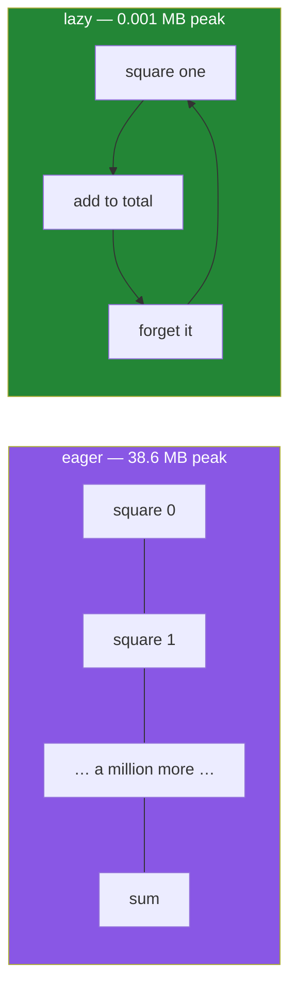

# 2.2 — A list against a generator, measured

## One-line answer

The same total, computed two ways, costs 38.6 megabytes as a list and 0.001 megabytes as a
generator — and the number is not a detail, it is the entire reason generators exist.

---

## The story

The deli's owner wants to know how many items were ordered across the whole of last year.

There are two ways to find out, and one of them is what a person would actually do.

The first way: get every slip out of the archive, spread them across the floor of the back room,
and then count. There is a real problem with this before any counting starts — the back room is not
big enough. The slips fill it, then they fill the corridor, and then you have to stop.

The second way: open the archive box, take one slip, add its number to a running total, put the slip
in the recycling, take the next. At no point is more than one slip in your hand. The back room stays
empty. The total at the end is exactly the same total.

Nobody would seriously choose the first way. Yet the first way is what
`total = sum([slip.count for slip in archive])` does, and people write that line every day without
noticing that they have just asked for the floor of the back room.

Today's four slips fit in one hand:

```text
milk
  Milk
eggs
Eggs.
```

A year of them does not. This document is about the exact size of the difference.

---

## The idea in plain language

Two ways of producing a sequence of values:

- **Eager.** Compute every value, store them all, hand back the container. A list comprehension does
  this ([Day 9, 1.1](../../../day-09-comprehensions/parts/01-list-comprehensions/1.1-the-loop-and-the-comprehension.md)).
  The cost is one slot of memory per item, all held at the same time.
- **Lazy.** Compute one value when it is asked for, hand it over, forget it. A generator does this
  ([2.1](2.1-yield-the-function-that-pauses.md)). The cost is one item's worth of memory, whatever
  the length of the sequence.

The words for the two costs are worth having. **Peak memory** is the largest amount your program held
at any one moment; it is what decides whether the program finishes or is killed. **Total work** is how
many operations it did; both approaches do the same amount here, because both square a million
numbers.

The important consequence: for a sequence you walk through exactly once and then throw away, the list
is pure cost. It buys you the ability to look again, and you never look again.

The measuring tool is `tracemalloc`, which is in the standard library and tracks how much memory
Python itself has allocated. `tracemalloc.get_traced_memory()` returns a pair — current and peak —
and it is the **peak** that matters here, because the list exists and then is thrown away, so the
current figure at the end would hide the whole problem.

One thing this document is careful about, and you should be too: **a generator does not always win.**
It wins when the sequence is walked once. When something needs to be looked at twice, sorted, or
indexed, the list is the correct answer and the generator is a false economy.
[2.5](2.5-when-a-generator-is-wrong.md) is the full list of those cases.

---

## Why Setu needs it

- **Principle 5 says the currency of this project is rate limits and RAM, not dollars.** Free-tier
  machines have a few gigabytes. This is the measurement that decides what fits, and it is the reason
  every later pipeline in the plan streams.
- **Day 9 already told you the parenthesis changes everything**
  ([Day 9, 3.3](../../../day-09-comprehensions/parts/03-when-not-to/3.3-the-list-you-never-needed.md)).
  This part supplies the number that makes it more than advice.
- **Day 20 measures a list of a million floats against a NumPy array**, and the shape of that
  measurement is the shape of this one. Meeting `tracemalloc` here means that day can be about NumPy
  rather than about how to measure.
- **Day 34 turns an 8 GB pandas column into 300 MB.** By then you need to already believe that memory
  is a thing you measure rather than assume, and that belief is built by running the block below on
  your own machine and reading your own number.

---

## The mechanism

The two ways, measured, on this machine on the day this was written:

```python
"""The same total, computed twice, with the peak memory of each."""

import tracemalloc

tracemalloc.start()
total_eager = sum([n * n for n in range(1_000_000)])
peak_eager = tracemalloc.get_traced_memory()[1]
tracemalloc.stop()

tracemalloc.start()
total_lazy = sum(n * n for n in range(1_000_000))
peak_lazy = tracemalloc.get_traced_memory()[1]
tracemalloc.stop()

print("eager total :", total_eager)
print("lazy  total :", total_lazy)
print("same answer :", total_eager == total_lazy)
print()
print("eager peak MB:", round(peak_eager / 1048576, 3))
print("lazy  peak MB:", round(peak_lazy / 1048576, 3))
```

Run on Python 3.12.12 on 2026-09-01:

```
eager total : 333332833333500000
lazy  total : 333332833333500000
same answer : True

eager peak MB: 38.574
lazy  peak MB: 0.001
```

**Line by line:**

- `tracemalloc.start()` — begins recording. It must be started before the allocation you care about,
  because it cannot see backwards.
- `sum([n * n for n in range(1_000_000)])` — **the square brackets are the whole difference.** They
  build a list of a million integers, hold all of them, and then hand the finished list to `sum`.
- `1_000_000` with underscores — Python ignores them in numbers, and they make the magnitude readable
  at a glance. A million and ten million differ by one character otherwise.
- `tracemalloc.get_traced_memory()[1]` — index `1` is the **peak**, index `0` is the current. Reading
  the current figure here would report almost nothing, because the list is already unreachable by the
  time the line runs.
- `tracemalloc.stop()` between the two measurements, then `start()` again — this resets the peak. Two
  measurements in one session without the reset would report the larger of the two twice, which is a
  real and easy mistake to make when writing your own benchmark.
- `sum(n * n for n in range(1_000_000))` — **no brackets at all.** A generator expression passed as
  the only argument to a function does not need its own parentheses
  ([Day 9, 2.3](../../../day-09-comprehensions/parts/02-dict-set-gen/2.3-the-generator-expression.md)).
  `sum` pulls one square at a time and adds it.
- `total_eager == total_lazy` prints `True`. **The answers are identical**, which is the point:
  nothing was traded away for the memory saving on this workload.
- `round(peak / 1048576, 3)` — bytes to mebibytes. `1048576` is `1024 * 1024`, and writing it out
  rather than using `1e6` keeps the unit honest.

Where the 38 megabytes actually go:

```python
"""What each object weighs, and why the generator's size never changes."""

import sys

small = [n * n for n in range(1_000_000)]
gen = (n * n for n in range(1_000_000))

print("list object bytes      :", sys.getsizeof(small))
print("generator object bytes :", sys.getsizeof(gen))
print("one int inside the list:", sys.getsizeof(small[500_000]))
```

```
list object bytes      : 8448728
generator object bytes : 200
one int inside the list: 32
```

**Line by line:**

- `sys.getsizeof(small)` gives about 8.4 MB — that is the **list's own array of pointers**, eight
  bytes per item plus the growth slack a dynamic array keeps
  ([Day 8, 1.1](../../../day-08-containers/parts/01-sequences/1.1-a-list-is-a-dynamic-array.md)).
- `sys.getsizeof(gen)` is `200` bytes, and it would be `200` bytes for a billion items too. **The
  generator's size does not depend on the length of the sequence**, because it does not contain the
  sequence.
- `sys.getsizeof(small[500_000])` is 32 bytes — one Python integer object. The list holds pointers to
  a million of these, so the real total is the 8.4 MB of pointers plus roughly 30 MB of integers,
  which is the 38.6 MB `tracemalloc` reported.
- `sys.getsizeof` measures **only the object itself**, never what it points at. That is why the list's
  8.4 MB looks too small until you add the integers, and it is the reason `tracemalloc` is the
  honest instrument for this question.



---

## When it breaks

**The measurement that reports the wrong number:**

```text
>>> import tracemalloc
>>> tracemalloc.start()
>>> data = [n * n for n in range(1_000_000)]
>>> tracemalloc.reset_peak()
>>> total = sum(n * n for n in range(1_000_000))
>>> round(tracemalloc.get_traced_memory()[1] / 1048576, 3)
38.575
```

**What it means.** The generator was supposed to measure at nearly zero and it reported 38.575 MB.
Nothing is wrong with the generator. `data` is **still alive**, so the peak includes it, and
`reset_peak` resets the high-water mark to the *current* usage rather than to zero. This is the most
common way a home-made memory benchmark lies. The fix is to measure each case in its own
`start()`/`stop()` pair, as the mechanism above does, and to make sure nothing from the previous case
is still referenced.

**The generator that was materialised again two lines later:**

```text
>>> import tracemalloc
>>> tracemalloc.start()
>>> total = sum(list(n * n for n in range(1_000_000)))
>>> round(tracemalloc.get_traced_memory()[1] / 1048576, 3)
38.573
>>> tracemalloc.stop()
```

**What it means.** The generator expression is there, and the saving is not, because `list(...)`
walked it to the end and built exactly the list it was avoiding. This appears in real code as
`sorted(...)`, `len(list(...))` or a `json.dumps` around a generator, and it is invisible unless you
measure. A generator only saves memory if **nothing downstream collects it**.

**The one that actually stops the program:**

```text
$ uv run python -c "data = [n * n for n in range(2_000_000_000)]"
Killed
```

**What it means.** On a machine with a few gigabytes of RAM, this is what running out looks like:
one word, no traceback, exit code 137, and nothing in your program's own logs. `MemoryError` is what
Python raises when *it* cannot allocate; `Killed` is what the operating system does when the machine
cannot, and the difference is that you get no chance to handle it. This is the failure the whole
document exists to prevent, and on a free-tier machine it is the one you will actually meet.

---

## In production

**The professional habit is to keep everything lazy until one named line decides otherwise.** A
pipeline written as generator stages — read, clean, filter, key — costs one row of memory no matter
how long the file is, and the single `list(...)` or `.to_list()` at the end is a decision somebody
made on purpose and can point at in review. The anti-pattern is a chain where each stage returns a
list, because then peak memory is the sum of every stage rather than the size of one row.

**What changes at scale is that the eager version stops failing loudly and starts failing slowly.**
Before it is killed outright, a process near its memory limit spends its time in the garbage
collector and, on a machine with swap, moving pages to disk. The job does not crash; it takes six
hours instead of four minutes, and the CPU graph looks idle. Anybody who has chased that once
recognises it immediately, and the fix is nearly always a list that should have been a generator.

**The failure that only appears with real data is the small file that trained your intuition.** A
loader tested on a 5 MB sample builds a list and nobody notices. The same code meets the 5 GB export
and dies. The number in this document is the reason the sample size in a test is a design decision:
a test on ten rows proves correctness and proves nothing at all about memory, so the memory claim
needs either a `tracemalloc` assertion or an honest note in the docstring saying it is untested at
scale.

**The review comment a senior engineer leaves.** On `return [clean(row) for row in rows]` in a
loader: *"This materialises the whole file. Every caller I can find loops over the result once and
throws it away, so make it a generator and let the one caller that needs a list say `list(...)` for
itself. If you keep the list, put the expected peak memory in the docstring so the next person knows
what they are agreeing to."*

**The interview question.** *"When would you use a generator instead of a list?"* The weak answer is
"when the data is big". The answer that lands puts a number on it: a list of a million squares peaks
around 38 MB and a generator around a kilobyte, because the list holds every value at once and the
generator holds one — so a generator is right whenever the sequence is consumed once, and wrong the
moment anything needs to sort it, index it, count it or walk it twice. Being able to say *and* the
generator loses is what shows judgement rather than a preference.

---

## Check yourself

```bash
uv run python -c "
import tracemalloc

tracemalloc.start()
eager = sum([n * n for n in range(1_000_000)])
peak_e = tracemalloc.get_traced_memory()[1]
tracemalloc.stop()

tracemalloc.start()
lazy = sum(n * n for n in range(1_000_000))
peak_l = tracemalloc.get_traced_memory()[1]
tracemalloc.stop()

print('same answer:', eager == lazy)
print('eager MB   :', round(peak_e / 1048576, 3))
print('lazy  MB   :', round(peak_l / 1048576, 3))
"
```

Write your own two numbers down; they will not match this page exactly and they should be the same
order of magnitude apart. Then say which two characters you would delete to turn the fast one into
the slow one.

**Answer out loud, without scrolling up:**

> Say what "peak memory" means and why it is the figure that decides whether a job finishes. Then name
> two operations that quietly undo a generator's saving.

---

**Next:** [2.3 — streaming a file line by line](2.3-streaming-a-file.md), which is the plan's named
example for `PY-11` and the first time this saving is doing real work.
