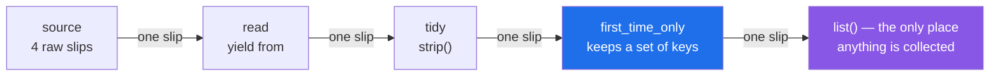

# 2.4 — `yield from`, and generators as a pipeline

## One-line answer

`yield from` hands the caller straight through to another reader instead of copying its items one by
one, and once you have it, a whole chain of small generators becomes a pipeline where every stage
holds exactly one item.

---

## The story

The deli has three people behind the counter now, standing in a line.

The first opens the box and takes out one slip. The second takes that slip, tidies the handwriting,
and passes it on. The third takes the tidy slip and decides whether it is a duplicate of one they
have already seen; if it is new, it goes to the front.

Nobody puts anything down. There is no tray of half-tidied slips between the first person and the
second, and no pile of tidy ones waiting for the third. Each person holds one slip, does their bit,
and hands it along. The counter stays clear.

The four slips that came through this morning:

```text
milk
  Milk
eggs
Eggs.
```

Three went to the front — `milk`, `eggs`, `Eggs.` — because the second slip tidied down to something
the third person had already seen.

The important thing about the line is not that each person is doing less work. It is that **nothing
accumulates between them.** Add a fourth job and the counter is still clear. Run a year of slips
through and the counter is still clear.

---

## The idea in plain language

A **pipeline** is a chain of steps where each step takes items one at a time from the step before and
hands them one at a time to the step after. Because generators are lazy
([2.1](2.1-yield-the-function-that-pauses.md)), a chain of generators is a pipeline for free: the
last stage pulls, and the pull travels back up the chain, one item at a time.

Building one needs two things. The first is a generator that reads from another iterable, which you
can already write:

```
for item in source:
    yield item
```

The second is a shorter and better way to write exactly that, which is `yield from`:

```
yield from source
```

`yield from source` means "hand my caller every item `source` produces, as if I had produced them".
It is not merely shorter. For a plain loop over a plain iterable the two are equivalent, but
`yield from` also passes along the things a manual loop drops: the value a delegated generator
returns, and anything `send`, `throw` or `close` is doing to it. Those matter the moment generators
are being used as coroutines, which is the road that ends at `async def` on Day 19.

The word for what `yield from` does is **delegation**: this generator stops producing items itself and
lets another one produce them for a while.

Two shapes come up constantly, and it is worth naming them apart:

- **Chaining.** Several sources, one after another: `yield from first`, then `yield from second`. The
  caller sees one continuous stream.
- **Flattening.** A generator that calls *itself* on nested structure, so a tree comes out as a flat
  sequence. This is where `yield from` stops being a convenience and starts being the only readable
  way to write the thing.

One caution, because it catches everybody once: `yield from` does **not** run the sub-generator to
completion and collect it. Nothing is collected anywhere. If the caller stops after two items, the
sub-generator is left paused after two items, exactly as it would be in a `for` loop.

---

## Why Setu needs it

- **[4.2](../04-the-gate/4.2-the-streaming-reader.md) builds the day's reader**, and the cleanest
  version of "read every title from every file in this folder" is one `yield from` per file inside a
  loop over the folder.
- **Day 19's RAG chunker splits documents into chunks**, and a chunker that walks paragraphs inside
  documents inside a folder is a two-level `yield from` — the flattening shape, at production size.
- **Day 162's retrieval pipeline** is exactly the line of three people: load, chunk, embed. Each
  stage is a generator, and the memory cost of the whole chain is one chunk. Building the habit here
  is why that day can be about retrieval quality rather than about memory.
- **Day 185's LangGraph streaming** re-emits events from a sub-graph into the parent stream, which is
  delegation with a network in the middle. The mental model is this one.

---

## The mechanism

The two spellings, side by side:

```python
"""The long way and the short way to pass a reader through."""


def passthrough_loop(source):
    """Hand on every item, written out."""
    for item in source:
        yield item


def passthrough_from(source):
    """Hand on every item, delegated."""
    yield from source


slips = ["milk", "  Milk", "eggs", "Eggs."]

print(list(passthrough_loop(slips)))
print(list(passthrough_from(slips)))
```

**Line by line:**

- `for item in source: yield item` — three tokens of ceremony around one idea. Correct, and the shape
  everybody writes first.
- `yield from source` — the same behaviour in one line. Read it aloud as "yield from this source",
  and it says what it does.
- Both print `['milk', '  Milk', 'eggs', 'Eggs.']`. On a plain list there is no observable difference
  at all, which is why the argument for `yield from` here is readability rather than behaviour.

Chaining several sources into one stream:

```python
"""Two boxes, one queue, and nothing collected in between."""


def morning():
    yield "milk"
    yield "  Milk"


def afternoon():
    yield "eggs"
    yield "Eggs."


def whole_day():
    """Every slip from both halves of the day, in order."""
    yield from morning()
    yield from afternoon()


for slip in whole_day():
    print(repr(slip))
```

**Line by line:**

- `def morning():` with two bare `yield` statements — a generator does not need a loop. Each `yield`
  is a pause point, and the function hands out two items and ends.
- `yield from morning()` — **note the brackets.** `morning` is the generator function; `morning()` is
  the generator. Leaving the brackets off would try to delegate to a function object and raise
  `TypeError: 'function' object is not iterable`.
- Two `yield from` lines, one after the other — the caller sees four items in one continuous stream
  and cannot tell there were two sources. That is the point of chaining.
- Nothing here builds a list. If `morning()` read a 2 GB file and `afternoon()` read another,
  `whole_day()` would still cost one line of memory
  ([2.3](2.3-streaming-a-file.md)).
- The standard library's `itertools.chain(morning(), afternoon())` does the same job. `yield from` is
  what you write when the chaining is conditional or interleaved with other work; `chain` is what you
  write when it is not.

Flattening, which is where it earns its keep:

```python
"""A folder of boxes of slips, flattened to one stream of slips."""

boxes = [
    ["milk", ["  Milk", "eggs"]],
    "Eggs.",
    [[["extra milk"]]],
]


def flatten(item):
    """Yield every string inside `item`, however deeply it is nested."""
    if isinstance(item, str):
        yield item
        return
    for inner in item:
        yield from flatten(inner)


print(list(flatten(boxes)))
```

**Line by line:**

- `boxes` — three levels of nesting, on purpose, because two levels can be flattened by a nested
  comprehension and three cannot
  ([Day 9, 1.4](../../../day-09-comprehensions/parts/01-list-comprehensions/1.4-nested-comprehensions.md)).
- `if isinstance(item, str):` — the **base case**, and it must come first. A string is itself
  iterable, so without this check the function would recurse into a string, then into each of its
  characters, then into each one-character string, forever.
- `yield item` then `return` — a bare `return` inside a generator means "stop", not "give back a
  value". It ends this generator without yielding anything more.
- `for inner in item: yield from flatten(inner)` — **the recursive step, in one line.** Written with
  a manual loop it would be `for x in flatten(inner): yield x`, and the nesting of two loops on
  adjacent lines is exactly the code people misread.
- `list(flatten(boxes))` prints `['milk', '  Milk', 'eggs', 'Eggs.', 'extra milk']`. Five strings,
  flat, in the order they appear.
- Nothing intermediate is built. Each string is produced, passed up through however many levels of
  `yield from` are between it and the caller, and forgotten.

The three-person counter, as a pipeline:

```python
"""Read, tidy, deduplicate: three stages, one slip in flight at a time."""

from collections.abc import Iterable, Iterator


def read(source: Iterable[str]) -> Iterator[str]:
    """Stage 1: hand on each raw slip."""
    yield from source


def tidy(source: Iterable[str]) -> Iterator[str]:
    """Stage 2: strip the whitespace off each slip."""
    for slip in source:
        yield slip.strip()


def first_time_only(source: Iterable[str]) -> Iterator[str]:
    """Stage 3: hand on a slip only the first time its key is seen."""
    seen: set[str] = set()
    for slip in source:
        key = slip.casefold()
        if key not in seen:
            seen.add(key)
            yield slip


raw = ["milk", "  Milk", "eggs", "Eggs."]

pipeline = first_time_only(tidy(read(raw)))
print(type(pipeline).__name__)
print(list(pipeline))
```

**Line by line:**

- `Iterable[str]` in, `Iterator[str]` out — the honest annotation. Each stage accepts anything
  walkable and promises a reader
  ([1.1](../01-iterators/1.1-iterable-and-iterator.md)).
- `read` is a one-line `yield from`. It looks pointless, and it is the seam: swapping it for the file
  reader from [2.3](2.3-streaming-a-file.md) changes nothing downstream.
- `tidy` uses a loop rather than `yield from`, **because it changes each item.** `yield from` passes
  items through untouched; the moment a stage transforms, it needs its own loop.
- `seen: set[str] = set()` in `first_time_only` — this is the one stage that accumulates, and it
  accumulates keys rather than slips. That is a real memory cost, proportional to the number of
  *distinct* items, and it is the honest exception to "nothing accumulates"
  ([Day 8, 3.2](../../../day-08-containers/parts/03-dedup/3.2-order-preserving-dedup.md) is the
  same technique on a list).
- `key = slip.casefold()` — `casefold`, not `lower`, for the reason
  [Day 7, 2.1](../../../day-07-strings/parts/02-methods/2.1-normalising-strip-and-case.md) gives.
- `first_time_only(tidy(read(raw)))` — the whole pipeline, assembled inside out. `type(pipeline).__name__`
  prints `generator`, and **not one item has moved yet**; the assembly built three paused generators
  and nothing else.
- `list(pipeline)` prints `['milk', 'eggs', 'Eggs.']`. The second slip tidied to `Milk`, whose key
  `milk` was already seen, so it never reached the front. Three of four, exactly as at the counter.



---

## When it breaks

**`StopIteration` raised inside a generator:**

```text
$ uv run python -c "
def g(src):
    it = iter(src)
    while True:
        yield next(it)
print(list(g([1,2])))
"
  File "<string>", line 5, in g
StopIteration

The above exception was the direct cause of the following exception:

Traceback (most recent call last):
  File "<string>", line 6, in <module>
RuntimeError: generator raised StopIteration
```

**What it means.** The generator ran `next(it)` on an exhausted reader, which raised `StopIteration`,
and Python turned that into a `RuntimeError` on the way out. This is deliberate: before the change, a
stray `StopIteration` from anywhere inside a generator body would silently end the generator, and a
bug that lost half your data looked exactly like a stream that had finished. *PEP 479 — Change
StopIteration handling inside generators* (2014, <https://peps.python.org/pep-0479/>) made the
replacement automatic, and it has been the default since Python 3.7. The fix here is
`next(it, None)` with an explicit `if value is None: return`, or simply `yield from src`.

**Delegating to the function instead of the generator:**

```text
$ uv run python -c "
def inner():
    yield 1
def outer():
    yield from inner
print(list(outer()))
"
Traceback (most recent call last):
  File "<string>", line 6, in <module>
  File "<string>", line 5, in outer
TypeError: 'function' object is not iterable
```

**What it means.** One missing pair of brackets. `yield from` needs something iterable, and a
generator function is not iterable until it is called. Note that the traceback appears at
`list(outer())` rather than at the `yield from` line, because the body did not run until then
([2.1](2.1-yield-the-function-that-pauses.md)) — so the reported line and the responsible line are
both shown, and it is the second one that matters.

**Flattening that never stops:**

```text
$ uv run python -c "
def bad_flatten(item):
    for inner in item:
        yield from bad_flatten(inner)
print(list(bad_flatten(['milk'])))
"
  File "<string>", line 4, in bad_flatten
  File "<string>", line 4, in bad_flatten
  [Previous line repeated 996 more times]
RecursionError: maximum recursion depth exceeded
```

**What it means.** No base case. `"milk"` is iterable, so the function recurses into it, gets
`"m"`, recurses into that, gets `"m"` again, and so on forever. The `[Previous line repeated 996 more
times]` is the giveaway that this is a missing base case rather than genuinely deep data. Every
recursive generator needs the `isinstance` check — or an equivalent — as its **first** statement.

---

## In production

**The professional shape is stages that each do one thing, assembled at one place.** The reason is not
elegance; it is that each stage is separately testable with a list of three items and no file, and the
assembly line is the only part that knows about the real source. When a pipeline produces wrong
output, you find the stage by feeding each one a literal list — which is
[Day 10, 3.3](../../../day-10-functions/parts/03-the-module/3.3-pure-functions-and-the-seam.md)'s
argument applied to streams.

**What changes at scale is that one stage in the chain quietly stops being lazy, and nobody notices
until the memory graph does.** A stage that sorts, or that groups, or that keeps a `seen` set, has to
hold something — sorting holds everything. The rule teams settle on is that any stage which
accumulates says so in its docstring and in its name, so `first_time_only` is honest and a
`clean_all` that secretly sorts is not. A pipeline's real peak memory is the largest single stage,
and you should be able to point at which one that is.

**The failure that only appears with real data is the exception thrown three stages down.** When the
last stage raises, the traceback runs back up through every `yield from` in the chain, and the
frames look nearly identical. Worse, the *cause* is usually a bad row that the first stage read and
the third stage choked on, and the first stage's frame shows no sign of which row it was. The
professional answer is to number the items in the first stage — `for index, line in enumerate(handle,
start=1)` — and to include that number in whatever the failing stage raises, because at ten million
rows "some row was malformed" is not a debuggable statement.

**The review comment a senior engineer leaves.** On a stage written as `for x in inner(): yield x`:
*"`yield from inner()` — same thing, and it also forwards `close()`, which matters here because
`inner` holds a file handle. With the manual loop, closing the outer generator does not reliably
close the inner one, and on a long-running service that leaks file descriptors."*

**The interview question.** *"What does `yield from` do that a `for` loop with a `yield` in it does
not?"* The answer that lands: for plain iteration they are the same, but `yield from` also forwards
the sub-generator's return value and forwards `send`, `throw` and `close` to it — so it is the correct
choice whenever the delegated generator holds a resource or is being driven as a coroutine. Adding
that the readable win is in recursive flattening, where the manual version needs two nested loops, is
what shows you have written one.

---

## Check yourself

```bash
uv run python -c "
def flatten(item):
    if isinstance(item, str):
        yield item
        return
    for inner in item:
        yield from flatten(inner)

boxes = [['milk', ['  Milk', 'eggs']], 'Eggs.', [[['extra milk']]]]
print(list(flatten(boxes)))

def read(src):
    yield from src
def tidy(src):
    for s in src:
        yield s.strip()
def first_time_only(src):
    seen = set()
    for s in src:
        if s.casefold() not in seen:
            seen.add(s.casefold())
            yield s

p = first_time_only(tidy(read(['milk', '  Milk', 'eggs', 'Eggs.'])))
print(type(p).__name__, '->', list(p))
"
```

`type(p).__name__` prints `generator` before any item has moved. Say how many slips exist in memory at
that moment, and how many exist while the pipeline is running.

**Answer out loud, without scrolling up:**

> Say what `yield from` forwards that a manual loop does not. Then explain why a recursive flattener
> must check for a string before it loops, and what happens if it does not.

---

**Next:** [2.5 — when a generator is the wrong tool](2.5-when-a-generator-is-wrong.md), because four
documents of enthusiasm need one of judgement.
