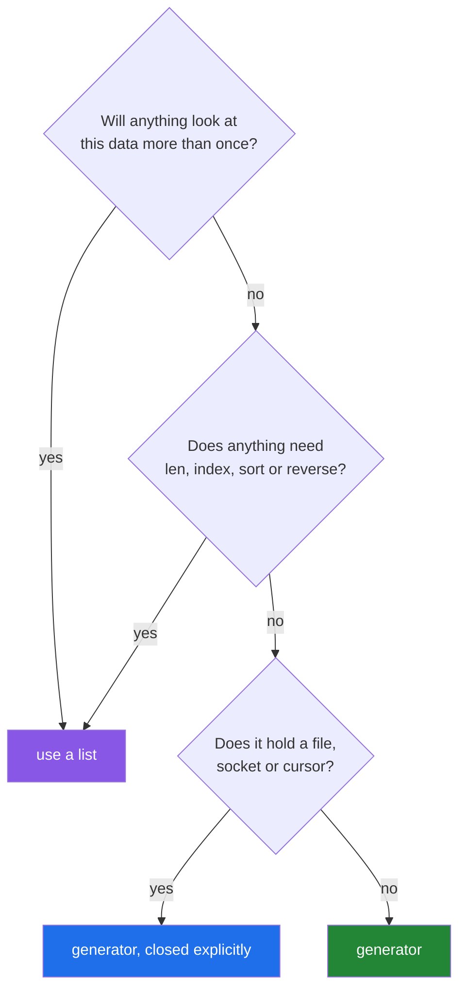

# 2.5 — When a generator is the wrong tool

## One-line answer

A generator is the wrong choice whenever something needs to look at the data twice, know how much
there is, reach a particular item, or hold a resource for a controlled length of time — and choosing
one anyway buys you a memory saving you did not need and a bug you did not expect.

---

## The story

The person who worked out that you can count the year's slips one at a time is pleased with
themselves, and quite right too. So the next week they use the same method for a different job.

The owner asks: *"What were our three most common orders?"*

You cannot answer that one slip at a time and then throw the slip away. To find the most common you
have to have seen them all, which means keeping a tally as you go — and a tally of every distinct
order is not one slip in your hand any more.

Then the owner asks: *"What was the middle order of the day?"*

For that you need to know how many there were before you can say which one was in the middle, and by
the time you know how many there were you have thrown them all away. So you go through the drawer
twice — once to count, once to fetch — and the drawer takes four hours to walk.

Then somebody asks to see the fifth slip. There is no way to get the fifth slip except to take out
four and drop them.

The method was not wrong. It was right for one question and wrong for the next three, and nobody said
so out loud.

Today's four slips, one last time:

```text
milk
  Milk
eggs
Eggs.
```

---

## The idea in plain language

Everything a generator gives up, it gives up for the same reason: **it does not keep what it has
already handed out.** That single property produces every limitation in this document, and none of
them is a defect.

Here is the honest list of what a generator cannot do:

- **It cannot be walked twice.** Once exhausted, it stays exhausted
  ([1.3](../01-iterators/1.3-exhaustion.md)).
- **It has no length.** `len()` refuses, because knowing would mean walking to the end and destroying
  it.
- **It has no indexing.** `gen[0]` and `gen[-1]` are meaningless, because there is no stored sequence
  to index into.
- **It cannot be reversed.** `reversed()` needs to start at the end, and there is no end until you
  have walked there.
- **It cannot be sliced.** `gen[2:5]` fails; `itertools.islice(gen, 2, 5)` is the replacement, and it
  works by walking and discarding.
- **It cannot be pickled or sent to another process.** A paused function's state is not something
  Python can serialise, which matters the moment you reach for `multiprocessing`.
- **It gives a useless `repr`.** `<generator object f at 0x...>` tells you nothing about the contents,
  so a debugger and a log line both show you nothing.

And here is the list of operations that *look* fine on a generator and quietly undo the whole point,
because each one has to collect everything before it can answer:

- `sorted(gen)` — builds a list of everything, then sorts it.
- `max(gen)`, `min(gen)` — walk to the end. Cheap in memory, but they exhaust it.
- `"".join(gen)` — builds the whole string.
- `random.choice(...)` — needs a sequence, so a list has to exist first.
- Anything that needs the *count* before it can act: a progress bar, a percentage, a median.

There is one more cost that has nothing to do with any of these, and it is the one that bites in
long-running programs. **A paused generator holds everything its frame holds.** If it opened a file
([2.3](2.3-streaming-a-file.md)), that file is open for as long as the generator is alive and
unfinished. If it captured a large object, that object cannot be freed. A generator that is created,
partly consumed and then kept in a list is a resource leak with no error message.

The rule that comes out of all this is short: **a generator is right when the data is walked once,
forwards, and thrown away.** For anything else, either materialise deliberately — `rows = list(rows)`,
on a line with a name — or keep the container you already had.

---

## Why Setu needs it

- **Principle 3 says one concept, one day, one demo, and Principle 16 says depth over density.**
  Four documents of enthusiasm about generators, with no document about when not to use one, would be
  exactly the failure Part 11.8 calls *stopping at the toy example*.
- **[4.1](../04-the-gate/4.1-ten-functions-fully-tested.md) is today's gate**, and the module it
  measures has functions of both kinds: `clean_titles` returns a list on purpose, and the new reader
  is a generator on purpose. Being able to say which and why is the acceptance criterion.
- **Day 29 measures `iterrows` against vectorised pandas**, and one of the reasons `iterrows` is slow
  is that it produces a fresh object per row, which is a lazy pattern used where an eager one belongs.
- **Day 217's multi-agent work uses processes**, and the first time somebody tries to hand a generator
  across a process boundary they get `TypeError: cannot pickle 'generator' object`. Knowing that in
  advance is worth an evening.

---

## The mechanism

Everything a generator refuses, in one block:

```python
"""Six reasonable questions, all of which a generator declines to answer."""

slips = ["milk", "  Milk", "eggs", "Eggs."]


def stream():
    yield from slips


for label, attempt in [
    ("len", lambda: len(stream())),
    ("index", lambda: stream()[0]),
    ("slice", lambda: stream()[1:3]),
    ("reversed", lambda: list(reversed(stream()))),
    ("in twice", lambda: (lambda g: (list(g), list(g)))(stream())),
]:
    try:
        print(f"{label:9}:", attempt())
    except TypeError as error:
        print(f"{label:9}: TypeError - {error}")
```

Run on Python 3.12.12 on 2026-09-01:

```
len      : TypeError - object of type 'generator' has no len()
index    : TypeError - 'generator' object is not subscriptable
slice    : TypeError - 'generator' object is not subscriptable
reversed : TypeError - 'generator' object is not reversible
in twice : (['milk', '  Milk', 'eggs', 'Eggs.'], [])
```

**Line by line:**

- `def stream(): yield from slips` — one generator function, called fresh for each attempt, so no
  attempt is contaminated by the one before ([1.3](../01-iterators/1.3-exhaustion.md)).
- The list of `(label, lambda)` pairs — each lambda defers the call so that the `try` can catch it.
  This is a legitimate use of a lambda: a one-expression body, used immediately, never named
  ([3.1](../03-lambda-and-map/3.1-lambda-a-function-with-no-name.md)).
- `f"{label:9}"` — pad the label to nine characters so the results line up
  ([Day 7, 3.2](../../../day-07-strings/parts/03-formatting/3.2-the-format-spec.md)).
- `except TypeError as error:` — every one of the first four failures is a `TypeError`, which is
  Python saying "this kind of object cannot do that", not "something went wrong".
- **The last row is the important one, and it does not raise.** Two `list()` calls on one generator
  give the four slips and then nothing at all. No error, no warning, and a perfectly ordinary empty
  list to carry the bug forward.
- `reversed()` gives a different message from the other three — *"'generator' object is not
  reversible"* — because reversing needs a length and an index rather than merely subscripting, and
  Python has a separate word for objects that can supply both.

The two operations that work and cost you everything:

```python
"""These succeed, and each one builds the list you were avoiding."""

import tracemalloc


def squares():
    for n in range(1_000_000):
        yield n * n


tracemalloc.start()
biggest = max(squares())
peak_max = tracemalloc.get_traced_memory()[1]
tracemalloc.stop()

tracemalloc.start()
top_three = sorted(squares(), reverse=True)[:3]
peak_sorted = tracemalloc.get_traced_memory()[1]
tracemalloc.stop()

print("max     :", biggest, "peak MB:", round(peak_max / 1048576, 4))
print("sorted  :", top_three, "peak MB:", round(peak_sorted / 1048576, 2))
```

Run on Python 3.12.12 on 2026-09-01:

```
max     : 999998000001 peak MB: 0.0003
sorted  : [999998000001, 999996000004, 999994000009] peak MB: 38.57
```

**Line by line:**

- `max(squares())` — walks to the end and keeps one number. **Memory stays flat**, and the generator
  is a genuine win here even though the whole sequence was consumed. Laziness is about what is *held*,
  not about how much is *read*.
- `sorted(squares(), reverse=True)[:3]` — walks to the end and keeps **everything**, because sorting
  cannot begin until the last item has arrived. 38.62 MB, which is the same figure
  [2.2](2.2-a-list-against-a-generator.md) measured for the list it was avoiding.
- `[:3]` at the end — the slice happens *after* the sort, so it saves nothing. This is the exact shape
  of the mistake: the code reads as "take the top three", and it costs as much as "hold everything".
- The honest fix for a top-k is `heapq.nlargest(3, squares())`, which keeps three items rather than a
  million; Day 23 does the same job with `argsort` on an array. The point here is only that `sorted`
  on a generator is not a streaming operation, whatever it looks like.

The resource that stays open:

```python
"""A generator that opened a file, and never got to close it."""

from pathlib import Path

path = Path("data/slips.txt")
path.parent.mkdir(parents=True, exist_ok=True)
path.write_text("milk\n  Milk\neggs\nEggs.\n", encoding="utf-8")


def read_slips(target):
    with target.open(encoding="utf-8") as handle:
        for line in handle:
            yield line.rstrip("\n")


gen = read_slips(path)
print("first:", next(gen))
print("file closed?", gen.gi_frame.f_locals["handle"].closed)

gen.close()
print("after close(), generator is finished:", gen.gi_frame is None)
```

**Line by line:**

- `next(gen)` — one line read, and the generator is now paused **inside** the `with` block, which is
  what keeps the next line readable.
- `gen.gi_frame` — the paused function's frame, which exists precisely because the generator is
  suspended. `f_locals["handle"]` reaches into it to look at the file object. This is a debugging
  move, not something to write in real code, and it is here to make the invisible visible.
- `.closed` prints `False`. **The file is open**, and it stays open for as long as `gen` is alive and
  unfinished. Store `gen` in a list of a thousand and you hold a thousand open files.
- `gen.close()` — the deliberate shutdown. It raises `GeneratorExit` inside the paused generator at
  the `yield`, which unwinds the `with` block and closes the file.
- `gen.gi_frame is None` prints `True` after closing — the frame is gone, so the locals are gone, so
  the handle has been released. That is the mechanical answer to "when does a generator let go".
- If you never call `close()`, the garbage collector does it when the generator is collected. That is
  usually fine and occasionally far too late, which is why long-running services close explicitly.



---

## When it breaks

**The progress bar that has nothing to divide by:**

```text
$ uv run python -c "
def rows():
    yield from ['milk', '  Milk']
total = len(rows())
"
Traceback (most recent call last):
  File "<string>", line 4, in <module>
TypeError: object of type 'generator' has no len()
```

**What it means.** A percentage needs a denominator, and a stream does not have one. There is no fix
that keeps both properties: either you count first — which means two passes, or materialising — or
you show a spinner and a running count instead of a percentage. Real tools choose the second. This is
worth deciding before you build the interface rather than after.

**The generator handed to another process:**

```text
$ uv run python -c "
import pickle
def rows():
    yield 1
pickle.dumps(rows())
"
Traceback (most recent call last):
  File "<string>", line 5, in <module>
TypeError: cannot pickle 'generator' object
```

**What it means.** `multiprocessing` moves arguments between processes by pickling them, and a paused
function's frame cannot be pickled. The fix is to send the *inputs* — a path, a range, a list of
identifiers — and let the worker build its own generator on the other side. This is the standard
shape of every parallel data job, and the error above is how most people discover it.

**The empty result that came from a helper looking first:**

```text
>>> def loud(rows):
...     print("count:", sum(1 for _ in rows))
...     return [r.strip() for r in rows]
...
>>> loud(iter(["milk", "  Milk"]))
count: 2
[]
```

**What it means.** The `print` consumed the reader, and the `return` found nothing. The function is
correct on a list and broken on a generator, and the only sign is an empty result. This is
[1.3](../01-iterators/1.3-exhaustion.md)'s bug, and it belongs here too, because the decision that
caused it was upstream: somebody chose a generator for data that two things needed to see.

---

## In production

**The professional habit is to make the choice explicit at the boundary and to write it into the
return type.** A function returning `list[str]` has promised a container and may be walked, counted
and sorted. A function returning `Iterator[str]` has promised one pass. Teams that annotate this
stop having the argument, because the caller can see which they were given without reading the body.
The corresponding rule for parameters is that a function which needs two passes should take
`Sequence`, not `Iterable`, so the type checker refuses the generator instead of silently returning
nothing.

**The failure that only appears in a long-running service is the held resource.** In a script,
generators are collected when the process exits and nobody notices. In a web service or a worker that
runs for weeks, a generator that opened a database cursor and was abandoned half way through holds
that cursor until garbage collection, and under load the connection pool empties. The symptom is
timeouts on unrelated requests; the cause is a `break` inside a `for` over a generator, three files
away. The defensive shape is `with contextlib.closing(gen):` or a `try/finally` that calls
`gen.close()`.

**What changes at scale is that materialising stops being a rescue and starts being a design.** At
four slips, "just make it a list" is free. At ten million rows it is the thing you built the pipeline
to avoid, so the answer to "I need the count as well" becomes a single pass that computes both — the
running-counter shape from [1.3](../01-iterators/1.3-exhaustion.md) — or a second, cheap pass over an
index rather than over the data. Teams that skip this end up with a job that works on the sample and
is killed on the real export.

**The review comment a senior engineer leaves.** On a function that returns a generator and is called
in three places: *"Two of these callers do `len()` on the result and one sorts it, so every caller is
materialising it anyway. Return a list, say so in the annotation, and delete the three `list(...)`
calls. Keep the generator only if you also change the callers — a lazy function whose every caller
collects it is strictly worse than an eager one, because it also has to be explained."*

**The interview question.** *"When would you *not* use a generator?"* The answer that lands lists the
capabilities you give up — a second pass, `len`, indexing, sorting, reversing, pickling — and then
gives the underlying reason: the generator does not keep what it handed out, so anything needing to
look back has to store it somewhere, and if something is going to store it, storing it once in a list
is cheaper and clearer. Adding the resource point — that a suspended generator holds its open files
until it is closed or collected — moves the answer from textbook to lived.

---

## Check yourself

```bash
uv run python -c "
def stream():
    yield from ['milk', '  Milk', 'eggs', 'Eggs.']

for label, attempt in [
    ('len', lambda: len(stream())),
    ('index', lambda: stream()[0]),
    ('reversed', lambda: list(reversed(stream()))),
]:
    try:
        print(f'{label:9}:', attempt())
    except TypeError as error:
        print(f'{label:9}: TypeError - {error}')

g = stream()
print('twice    :', list(g), list(g))
"
```

Three lines raise and one does not. Say which one is the dangerous one, and why the one that raises is
the safer failure.

**Answer out loud, without scrolling up:**

> Give three things a list can do that a generator cannot, and the single property that explains all
> three. Then say what a suspended generator is holding onto, and what releases it.

---

**Next:** [3.1 — `lambda`, a function with no name](../03-lambda-and-map/3.1-lambda-a-function-with-no-name.md).
Section 2 was `PY-11`; section 3 is `PY-12`, and it starts with the smallest function Python can
write.
