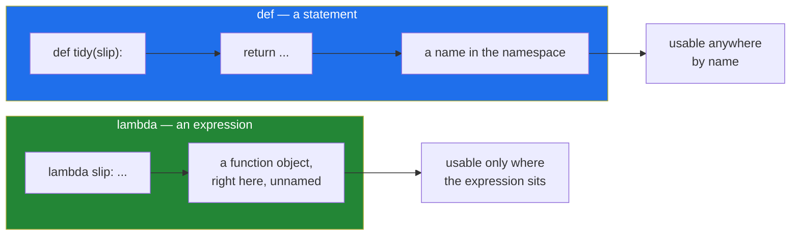

# 3.1 — `lambda`: a function with no name

## One-line answer

`lambda` builds a function out of a single expression and hands it straight back, without giving it a
name — which is useful exactly when the function is so small and so local that naming it would be
noise.

---

## The story

The deli's owner has a stack of index cards by the till with standing instructions on them. Each card
has a title at the top and the instruction underneath:

> **CLOSING UP** — turn the sign, count the float, bin the leftover bread.

Somebody new starts, and mid-morning the owner needs them to do one small thing: *"take the top slip
off each pile."* That is a whole instruction, and it is going to be needed exactly once, in the next
thirty seconds, for the four piles on the counter.

Nobody writes a card for it. You do not give it a title, you do not add it to the stack, and you
certainly do not file it. You say the sentence, it gets done, and it is gone.

That is the difference between a card and a spoken instruction, and both are instructions. The card
earns its title because it will be needed again, by somebody who was not there, who will look it up
by name. The spoken sentence does not, because by the time anyone could look it up, it is over.

The four piles today, as always:

```text
milk
  Milk
eggs
Eggs.
```

---

## The idea in plain language

A **lambda** is a function written as a single expression, with no name.

The grammar is small enough to write in one line:

```
lambda parameters: expression
```

Everything before the colon is the parameter list, exactly as it would be inside `def f(...)`.
Everything after the colon is a **single expression**, and its value is what the function returns.
There is no `return` keyword, because there is nothing else it could do with the value.

Two things are true at once, and both matter.

The first: **a lambda produces exactly the same kind of object a `def` produces.** It is not a special
lightweight thing. `type(lambda x: x)` and `type(some_function)` are the same type, `function`. Every
capability is the same: default values, `*args`, closures, being passed around, being stored.

The second: **a lambda is limited to one expression.** No statements. No `if x: ... else: ...` as a
statement, no `for`, no `try`, no assignment, no `return`, no docstring. A conditional *expression* is
allowed, because it is an expression
([Day 5, 2.5](../../../day-05-operators-and-conditionals/parts/02-conditionals/2.5-the-conditional-expression.md)),
and that is where a lambda starts to become unreadable.

So the difference between `lambda` and `def` is not power. It is that a lambda **is an expression**,
which means it can be written in the middle of another expression, where a `def` statement cannot go.
That is the entire reason the keyword exists. When you want a small function *as an argument to
something else*, a lambda puts it at the place it is used rather than four lines above.

The word for a function with no name is **anonymous**. The name matters more than it sounds like it
should, because a name is what appears in a traceback, and losing it has a cost that
[3.3](3.3-where-a-lambda-hurts.md) is about.

---

## Why Setu needs it

- **[1.4](../01-iterators/1.4-iter-with-a-sentinel.md) already needed one.**
  `iter(lambda: handle.read(8), b"")` requires a callable of no arguments, and the thing you actually
  want to call takes a size. The lambda carries the size. That is a lambda doing the one job it is
  best at.
- **`sorted(..., key=...)` takes a function**
  ([Day 8, 1.5](../../../day-08-containers/parts/01-sequences/1.5-sort-sorted-and-key.md)), and
  `key=lambda slip: slip.strip().casefold()` is shorter and clearer at the call site than a named
  function defined above it and used once.
- **Day 37's Matplotlib formatters, Day 76's `FunctionTransformer` and Day 172's LangChain chains all
  take callables**, and every one of those places is somewhere a two-token function is passed inline.
- **The plan's own example for `PY-12` is "where a lambda helps and where it hurts readability"**,
  which is a judgement rather than a technique. You cannot make the judgement without first knowing
  exactly what the tool is, which is this document.

---

## The mechanism

The same function, twice:

```python
"""A named function and an anonymous one, doing the same job."""


def tidy(slip):
    return slip.strip().casefold()


print("named    :", tidy("  Milk"))
print("anonymous:", (lambda slip: slip.strip().casefold())("  Milk"))

print()
print("same type          :", type(tidy) is type(lambda slip: slip))
print("named function name:", tidy.__name__)
print("lambda's name      :", (lambda slip: slip).__name__)
```

Run on Python 3.12.12 on 2026-09-01:

```
named    : milk
anonymous: milk

same type          : True
named function name: tidy
lambda's name      : <lambda>
```

**Line by line:**

- `def tidy(slip): return slip.strip().casefold()` — the ordinary version, and the one this file would
  keep if the function were used more than once.
- `(lambda slip: slip.strip().casefold())("  Milk")` — the lambda in brackets, then called
  immediately. The outer brackets are needed: without them Python reads the whole thing as a lambda
  whose body is `slip.strip().casefold()("  Milk")`, which is a different program.
- No `return` after the colon. **The expression is the return value**, and adding `return` is a
  `SyntaxError` rather than a redundancy.
- `type(tidy) is type(lambda slip: slip)` prints `True`. **There is no separate lambda type.** Both
  are `function` objects, and everything you know about functions from Day 10 applies to both.
- `tidy.__name__` is `tidy`; the lambda's is `<lambda>`. That string is what appears in a traceback,
  and it is the same string for every lambda in your program — which is the cost of anonymity, and
  the subject of [3.3](3.3-where-a-lambda-hurts.md).

Where a lambda is genuinely the right tool — passed as an argument, used once, never named:

```python
"""Three call sites where the function is smaller than a name would be."""

slips = ["milk", "  Milk", "eggs", "Eggs."]

print(sorted(slips, key=lambda slip: slip.strip().casefold()))
print(sorted(slips, key=len))
print(max(slips, key=lambda slip: len(slip.strip())))
```

**Line by line:**

- `key=lambda slip: slip.strip().casefold()` — `sorted` calls this once per item and sorts by what
  comes back ([Day 8, 1.5](../../../day-08-containers/parts/01-sequences/1.5-sort-sorted-and-key.md)).
  Written as a `def` above, the reader would have to look up four lines to find out what the sort
  order is; here the sort order is on the same line as the sort.
- The result is `['eggs', 'Eggs.', 'milk', '  Milk']` — `eggs` before `Eggs.` because the keys are
  `eggs` and `eggs.`, and `.` sorts after nothing. Sorting is **stable**, so items with equal keys keep
  their original order, which is the same part's rule.
- `key=len` — **no lambda at all.** `len` is already a function that takes one argument and returns
  the key, so wrapping it in `lambda slip: len(slip)` adds a layer that does nothing. Writing the
  wrapper anyway is the most common lambda mistake there is.
- `max(slips, key=lambda slip: len(slip.strip()))` — here the lambda is doing real work, because there
  is no existing function that means "length after stripping". This is the line that shows the
  difference from `key=len` above.

A lambda is a closure like any other function, which is where the famous trap lives:

```python
"""Lambdas capture names, not values - the same rule as any other function."""

makers = [lambda: slip for slip in ["milk", "eggs"]]
print("built in a comprehension:", [make() for make in makers])

fixed = [lambda bound=slip: bound for slip in ["milk", "eggs"]]
print("bound at definition     :", [make() for make in fixed])
```

**Line by line:**

- `[lambda: slip for slip in [...]]` — two lambdas, each with an empty parameter list, each returning
  `slip`. **They print `['eggs', 'eggs']`**, not `['milk', 'eggs']`, because each lambda looks up
  `slip` when it is *called*, and by then the loop has finished
  ([Day 10, 2.4](../../../day-10-functions/parts/02-scope/2.4-closures-and-late-binding.md)).
- `lambda bound=slip: bound` — the fix. A default value is evaluated **once, when the lambda is
  created** ([Day 10, 1.3](../../../day-10-functions/parts/01-the-signature/1.3-defaults-and-when-they-run.md)),
  so each lambda captures the value of `slip` at that moment. This prints `['milk', 'eggs']`.
- Note that this is **not a lambda problem.** The identical bug happens with `def` inside a loop, and
  the identical fix works. It shows up in lambda examples more often only because lambdas are the
  thing people build in loops.
- ruff's `B023` catches this: *function definition does not bind loop variable*. It was selected on
  [Day 2](../../../day-02-quality-gate/parts/01-linting/1.2-choosing-rule-families.md), so the linter
  in this project already refuses the first line.



---

## When it breaks

**Trying to put a statement in a lambda:**

```text
$ uv run python -c "
f = lambda x: x = 1
"
  File "<string>", line 2
    f = lambda x: x = 1
        ^^^^^^^^^^^
SyntaxError: cannot assign to lambda
```

**What it means.** The body after the colon must be an expression, and `x = 1` is a statement. The
caret span is worth reading: Python has parsed `lambda x: x` as the whole lambda and is now looking
at `= 1`, so it reports the confusing "cannot assign to lambda" rather than "no assignments allowed
in here". Once you know that, the message is a reliable signal that you have tried to put a statement
in an expression. The fix is a `def`.

**A `return` inside a lambda:**

```text
$ uv run python -c "
f = lambda x: return x
"
  File "<string>", line 2
    f = lambda x: return x
                  ^^^^^^
SyntaxError: invalid syntax
```

**What it means.** `return` is a statement too. The lambda already returns its expression, so there
is nothing for `return` to add. This one is almost always a sign that the function is about to grow
past one expression, at which point it wants to be a `def` anyway.

**The traceback with no name in it:**

```text
$ uv run python -c "
f = lambda x: x / 0
f(1)
"
Traceback (most recent call last):
  File "<string>", line 3, in <module>
  File "<string>", line 2, in <lambda>
ZeroDivisionError: division by zero
```

**What it means.** The middle frame says `<lambda>`. In a two-line script that is fine, because there
is only one. In a module with fifteen lambdas passed to fifteen different call sites, every frame
says `<lambda>` and the only thing distinguishing them is the line number. This is the real cost of
anonymity, and it is why ruff's `E731` refuses `f = lambda ...`: a lambda that is being given a name
anyway should be a `def`, so that the traceback says `tidy` and you can find it.

---

## In production

**The professional rule is short: a lambda goes where it is used, and never on the left of an
`=`.** PEP 8's wording is that you should always use a `def` statement instead of an assignment that
binds a lambda directly to a name (*PEP 8 — Style Guide for Python Code*, 2001,
<https://peps.python.org/pep-0008/>). ruff enforces it as `E731`, which is in the `E` family this
project selected on Day 2, so the linter will refuse it before review does. The reason is exactly the
traceback above: the assignment throws away the only advantage a lambda has — being an expression —
and keeps the only disadvantage.

**What a senior engineer looks for is whether the lambda is doing work or wrapping something.**
`key=lambda row: row.year` is doing work. `key=lambda row: len(row)` is wrapping `len` and should be
`key=len`. `sorted(rows, key=lambda r: r["year"])` is doing work, and
`operator.itemgetter("year")` is the standard-library version that is both faster and named. Knowing
`operator.itemgetter`, `operator.attrgetter` and `operator.methodcaller` exist is what separates
"knows lambda" from "has maintained code full of them".

**What changes at scale is the profiler's output.** A lambda in the `key=` of a sort over ten million
rows is called ten million times, and in a profile it appears as `<lambda>` with a line number rather
than a name — so the expensive one and the cheap one look the same in the report until you go and
read the source. Teams working on hot paths often name these functions purely so that the profile is
readable, which is a legitimate reason to write a `def` for a one-expression function.

**The review comment a senior engineer leaves.** On `apply = lambda rows: [clean(r) for r in rows]`:
*"E731 will fail on this. Make it a `def` — you get a name in tracebacks and profiles, a docstring,
and a place to put the type annotations. There is no benefit to the lambda here, because you have
named it anyway, and the name is the thing a lambda gives up."*

**The interview question.** *"What can a `def` do that a `lambda` cannot?"* The answer that lands is:
statements. Assignments, loops, `try`, multiple returns, a docstring and annotations — a lambda holds
one expression and nothing else. And then the more interesting half, unprompted: the reason to reach
for a lambda is never that it is shorter, it is that it is an *expression*, so it can be written
inside another expression at the point of use — which is also why naming one is a code smell rather
than a style preference.

---

## Check yourself

```bash
uv run python -c "
slips = ['milk', '  Milk', 'eggs', 'Eggs.']
print(sorted(slips, key=lambda s: s.strip().casefold()))
print(sorted(slips, key=len))
print((lambda s: s.strip().casefold())('  Milk'))
print('name of a lambda:', (lambda s: s).__name__)
makers = [lambda: s for s in ['milk', 'eggs']]
print('late binding:', [m() for m in makers])
"
```

The last line prints `['eggs', 'eggs']`. Say which earlier day explains it, and write the one-word
change that fixes it.

**Answer out loud, without scrolling up:**

> Say what a lambda's body is allowed to contain and what it is not. Then give the one real reason to
> choose a lambda over a `def`, and the one situation where using a lambda is always wrong.

---

**Next:** [3.2 — `map`, `filter`, and the iterator you printed by mistake](3.2-map-and-filter-are-lazy.md),
where section 2's laziness meets section 3's small functions.
