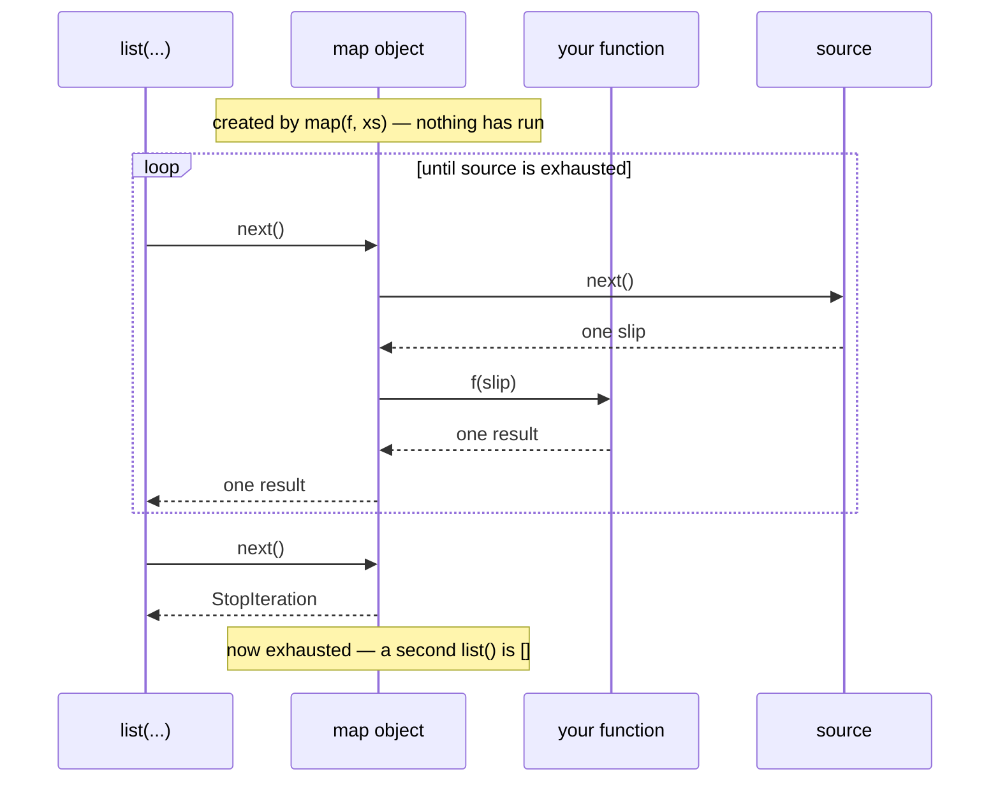

# 3.2 — `map`, `filter`, and the iterator you printed by mistake

## One-line answer

`map` and `filter` do not do any work when you call them — each hands back a lazy reader, which is
why printing one shows you an address instead of your data and why the second loop over it is empty.

---

## The story

You leave a note for the person opening the deli tomorrow: *"tidy every slip in the box."*

You come back later and ask whether it is done. They say: *"I have the note."*

Both of you are right, and you were talking about different things. You asked about the slips. They
answered about the instruction, which is the only thing that exists yet. Nothing has been tidied,
because nobody has started; the note is a plan, and a plan is not a result.

This is not a silly misunderstanding. It is the most useful arrangement, because the note costs
nothing to hand over and the tidying costs an hour. If you change your mind at eight o'clock and only
want the milk orders, the note has cost you nothing.

But there is a moment where it goes wrong, and everybody has had it. You look at the note, expecting
to see tidy slips, and see a note.

The four slips are where they always were:

```text
milk
  Milk
eggs
Eggs.
```

---

## The idea in plain language

`map(function, iterable)` means: apply `function` to each item of `iterable`. `filter(function,
iterable)` means: keep the items for which `function` returns something truthy
([Day 5, 2.2](../../../day-05-operators-and-conditionals/parts/02-conditionals/2.2-truthiness.md)).

Both of them are **lazy**. Calling `map(...)` does not call your function even once. It builds a
`map` object — a reader, in the sense of
[1.1](../01-iterators/1.1-iterable-and-iterator.md) — and hands it back. Your function runs one item
at a time, when something asks the reader for an item.

That laziness gives them the same three properties as every other reader in this day:

- Printing one shows `<map object at 0x...>`, because that is what the object's `repr` says. It is
  not a mistake; it is the honest description of a plan.
- It has no length and no indexing ([2.5](../02-generators/2.5-when-a-generator-is-wrong.md)).
- **It can be walked once.** The second walk is empty
  ([1.3](../01-iterators/1.3-exhaustion.md)).

Turning the plan into a result takes one word: `list(...)`, `tuple(...)`, `set(...)`, or a `for` loop.
That word is the point at which the work happens.

There is a second thing to say about `map`, because it is the thing that decides whether you should
use it at all. In this language, `map(f, xs)` and `(f(x) for x in xs)` produce equivalent readers, and
the comprehension version is usually clearer — Day 9 spent a whole day on why. So `map` is not the
recommended default here. It earns its place in three specific cases:

1. **The function already exists and takes exactly one argument.** `map(str.strip, slips)` is cleaner
   than `(slip.strip() for slip in slips)`, because there is no throwaway loop variable.
2. **Several iterables at once.** `map(func, a, b)` calls `func(a_item, b_item)` in step, stopping at
   the shorter — the same truncation rule as `zip`
   ([Day 6, 1.3](../../../day-06-loops/parts/01-iteration/1.3-enumerate-and-zip.md)).
3. **You are reading somebody else's code**, and a great deal of Python written before comprehensions
   became idiomatic uses `map` and `filter` everywhere.

`map(lambda slip: slip.strip(), slips)` is none of those three, and it is the version to avoid: it is
longer than the comprehension, slower than `map(str.strip, ...)`, and harder to read than either.

---

## Why Setu needs it

- **The `<map object at 0x...>` line is one of the top few confusions people hit in their first
  months**, and it is not really about `map` at all. It is the laziness from section 2 appearing in a
  place where nobody expected it, which is why this document sits after
  [2.2](../02-generators/2.2-a-list-against-a-generator.md) rather than before.
- **`map(str.strip, ...)` is the shape [4.2](../04-the-gate/4.2-the-streaming-reader.md) uses**, so
  the gate's reader can hand cleaned lines to `first_time_only` without materialising anything.
- **Day 33's `.str` accessor and Day 76's `FunctionTransformer` both apply a function across a
  column**, and both are the same idea with the loop pushed down into a library. Recognising `map`'s
  shape is what makes those feel like the same thing rather than three unrelated tools.
- **Day 217's parallel work uses `executor.map`**, which is `map` with the calls farmed out to
  threads or processes. It has the same signature, the same laziness question and the same
  "materialise to make it happen" behaviour.

---

## The mechanism

Nothing happens until something asks:

```python
"""map builds a plan. The work happens when the plan is walked."""

slips = ["milk", "  Milk", "eggs", "Eggs."]


def tidy(slip):
    print("   ...tidying", repr(slip))
    return slip.strip()


print("calling map:")
plan = map(tidy, slips)
print("got:", plan)

print()
print("now walking it:")
print("result:", list(plan))

print()
print("walking it again:")
print("result:", list(plan))
```

Run on Python 3.12.12 on 2026-09-01:

```
calling map:
got: <map object at 0x000001C6E1AE8DC0>

now walking it:
   ...tidying 'milk'
   ...tidying '  Milk'
   ...tidying 'eggs'
   ...tidying 'Eggs.'
result: ['milk', 'Milk', 'eggs', 'Eggs.']

walking it again:
result: []
```

**Line by line:**

- `print("   ...tidying", ...)` inside `tidy` — the instrument again, as in
  [2.1](../02-generators/2.1-yield-the-function-that-pauses.md). It shows *when* the function runs,
  which is the only thing this block is about.
- `plan = map(tidy, slips)` — **not one "tidying" line appears.** The function has not been called.
  `map` stored it and stored the source, and that is all.
- `print("got:", plan)` prints `<map object at 0x...>`. The hexadecimal number is the object's address
  in memory ([Day 4, 1.1](../../../day-04-objects/parts/01-objects/1.1-identity-type-value.md)); it
  changes every run and carries no information about your data.
- `list(plan)` — the four "tidying" lines appear **now**, in order, followed by the result. This is
  the moment the work happens.
- The second `list(plan)` prints `[]` and **no "tidying" lines at all**. The reader is exhausted
  ([1.3](../01-iterators/1.3-exhaustion.md)), so there was nothing to apply the function to. The
  absence of the print lines is the proof that this is exhaustion rather than a caching problem.

The three spellings, and which to reach for:

```python
"""One transformation, three ways, and the reason to prefer each."""

slips = ["milk", "  Milk", "eggs", "Eggs."]

print("existing function :", list(map(str.strip, slips)))
print("comprehension     :", [slip.strip() for slip in slips])
print("lambda in map     :", list(map(lambda slip: slip.strip(), slips)))

print()
print("two sources       :", list(map(lambda a, b: f"{a}+{b}", ["milk", "eggs"], ["1L", "6"])))
print("uneven sources    :", list(map(lambda a, b: f"{a}+{b}", ["milk", "eggs"], ["1L"])))
```

Run on Python 3.12.12 on 2026-09-01:

```
existing function : ['milk', 'Milk', 'eggs', 'Eggs.']
comprehension     : ['milk', 'Milk', 'eggs', 'Eggs.']
lambda in map     : ['milk', 'Milk', 'eggs', 'Eggs.']

two sources       : ['milk+1L', 'eggs+6']
uneven sources    : ['milk+1L']
```

**Line by line:**

- `map(str.strip, slips)` — `str.strip` is the **unbound** method: a plain function that takes the
  string as its first argument, so `str.strip("  Milk")` is exactly `"  Milk".strip()`. There is no
  lambda and no loop variable, which is why this spelling is the one worth knowing.
- `[slip.strip() for slip in slips]` — the comprehension, and the default choice in this language
  ([Day 9, 1.1](../../../day-09-comprehensions/parts/01-list-comprehensions/1.1-the-loop-and-the-comprehension.md)).
  Note that it is a **list**, not a reader; the lazy version is
  `(slip.strip() for slip in slips)`.
- `map(lambda slip: slip.strip(), slips)` — the same answer, more characters, and an extra function
  call per item. **This is the line to delete when you see it**, either for `map(str.strip, ...)` or
  for the comprehension.
- `map(lambda a, b: ..., ["milk", "eggs"], ["1L", "6"])` — **two iterables, so the function takes two
  arguments.** `map` walks both in step. This is the case with no comprehension equivalent that is
  any shorter, and it is why `map` is still worth having.
- The uneven pair prints one item. `map` stops at the shorter source **silently**, exactly like `zip`
  ([Day 6, 1.3](../../../day-06-loops/parts/01-iteration/1.3-enumerate-and-zip.md)). There is no
  warning and no error, so a mismatch in the lengths of two columns disappears without trace. `zip`
  has `strict=True` for this; `map` does not, which is a real reason to prefer
  `[f(a, b) for a, b in zip(xs, ys, strict=True)]` when the lengths are supposed to match.

`filter`, and the two things people get wrong about it:

```python
"""filter keeps what the function calls true - and None means something specific."""

slips = ["milk", "", "  Milk", "   ", "eggs"]

print("non-empty after strip:", list(filter(lambda slip: slip.strip(), slips)))
print("filter(None, ...)    :", list(filter(None, slips)))
print("comprehension        :", [slip for slip in slips if slip.strip()])
```

Run on Python 3.12.12 on 2026-09-01:

```
non-empty after strip: ['milk', '  Milk', 'eggs']
filter(None, ...)    : ['milk', '  Milk', '   ', 'eggs']
comprehension        : ['milk', '  Milk', 'eggs']
```

**Line by line:**

- `filter(lambda slip: slip.strip(), slips)` — the function returns the stripped string, and `filter`
  keeps the item when that is **truthy**. An empty string is falsy, so both `""` and `"   "` are
  dropped. Note that the *original* item is kept, not the stripped one: `'  Milk'` comes out with its
  spaces.
- `filter(None, slips)` — passing `None` as the function is a special case meaning "keep the truthy
  items themselves". It drops `""` but **keeps `"   "`**, because a string of three spaces is truthy.
  That difference between rows one and two is the whole reason to be careful here.
- The comprehension gives the same answer as row one and says out loud which item it keeps and which
  condition it tests. For a filter with any thought in it, this is the version to write.
- All three of these are one-liners, and the argument between them is entirely about which one a
  tired reader parses correctly at midnight. That is not a small consideration; it is Principle 20.



---

## When it breaks

**Printing the plan:**

```text
$ uv run python -c "
slips = ['milk', '  Milk', 'eggs', 'Eggs.']
print(map(str.strip, slips))
"
<map object at 0x00000204006E8DC0>
```

**What it means.** There is no error, and this is the single most common confusion with `map`. The
object printed itself honestly: it is a plan, and it has no idea what its results will be because it
has not produced any. The fix is `print(list(map(...)))`. The habit that prevents it is to remember
that in Python 3 every one of `map`, `filter`, `zip`, `enumerate`, `reversed` and `range` returns a
lazy object rather than a list.

**The second walk that is empty:**

```text
>>> results = map(str.strip, ["milk", "  Milk"])
>>> list(results)
['milk', 'Milk']
>>> list(results)
[]
```

**What it means.** [1.3](../01-iterators/1.3-exhaustion.md)'s bug, wearing `map`'s clothes. The
common real version is a function that returns `map(...)` and two callers that each loop over the
result — the second one gets nothing, silently. A function that returns a `map` object should either
say so in its return annotation (`Iterator[str]`) or wrap it in `list(...)` before returning.

**Passing the function and the data the wrong way round:**

```text
$ uv run python -c "
slips = ['milk', '  Milk']
print(list(map(slips, str.strip)))
"
Traceback (most recent call last):
  File "<string>", line 3, in <module>
TypeError: 'method_descriptor' object is not iterable
```

**What it means.** `map` takes the function first, then the data. Swapping them makes `map` check
whether `str.strip` is something it can walk, and it is not. The message names `method_descriptor`,
which is what an unbound method is called internally, and it says nothing at all about argument
order — so the first read is usually "what is a method descriptor?" rather than "I swapped my
arguments". The `filter(None, ...)` special case makes the order harder to remember still, which is
one more small reason comprehensions win by default.

**Mismatched lengths, silently truncated:**

```text
>>> names = ["milk", "eggs", "bread"]
>>> sizes = ["1L", "6"]
>>> list(map(lambda n, s: f"{n} {s}", names, sizes))
['milk 1L', 'eggs 6']
```

**What it means.** Three names, two sizes, two results, no complaint. `bread` was dropped and nothing
recorded it. On two lists you can see the problem; on two database columns of eighty thousand rows
you cannot. Use `zip(..., strict=True)` and a comprehension when the two sources are supposed to be
the same length, and let it raise.

---

## In production

**The professional default in this language is the comprehension, and `map` is kept for the two cases
where it reads better.** Those are an existing single-argument function (`map(str.strip, lines)`,
`map(int, fields)`, `map(Path, names)`) and several iterables walked in step. Everything else — and
especially `map(lambda x: ..., xs)` — is written as a comprehension or a generator expression,
because it puts the transformation and the loop variable in the same visual place.

**What changes at scale is that the laziness stops being a curiosity and becomes the design.**
`map(clean, million_lines)` costs one line of memory; `[clean(line) for line in million_lines]` costs
a million. Because the lazy version reads almost identically to the eager one, teams that care about
memory tend to standardise on generator expressions rather than `map`, precisely so that the
laziness is visible in the brackets rather than in which function was called
([Day 9, 2.3](../../../day-09-comprehensions/parts/02-dict-set-gen/2.3-the-generator-expression.md)).

**The failure that only appears with real data is the exception raised in the middle of a walk.**
Because the function runs during iteration rather than at the `map` call, a bad row a million items
in raises inside the `for` loop or inside `list()` — so the traceback names the consumer, not the
`map` line, and everything before that row has already been processed and possibly written out. The
professional shape is to handle the error inside the mapped function and yield a marker value, or to
number the items so the failure can name the row. A bare `map` over untrusted data is a job that will
one day die half way through with no record of where.

**The review comment a senior engineer leaves.** On `return map(clean, rows)`: *"This returns a
one-shot iterator, and two of the three call sites loop over it twice — the second loop is silently
empty. Either return `list(...)`, or keep it lazy and change the annotation to `Iterator[str]` so the
callers know what they are holding. Right now the signature says `map` and the callers are reading it
as `list`."*

**The interview question.** *"What does `map` return in Python 3?"* The short answer is an iterator,
and the follow-up that matters is *"why does that matter?"* — because nothing runs until it is
consumed, because printing it shows an object rather than data, because it can only be walked once,
and because it costs one item of memory instead of all of them. Adding that you would usually write a
comprehension anyway, and reserve `map` for an existing single-argument function or for two sources
in step, turns a definition into a judgement.

---

## Check yourself

```bash
uv run python -c "
slips = ['milk', '  Milk', 'eggs', 'Eggs.']

def tidy(s):
    print('   ...tidying', repr(s))
    return s.strip()

plan = map(tidy, slips)
print('the object:', plan)
print('walked    :', list(plan))
print('again     :', list(plan))
print('filter None:', list(filter(None, ['milk', '', '   ', 'eggs'])))
"
```

No "tidying" line appears until `walked`, and none appears for `again`. Say what that absence proves,
and why `filter(None, ...)` kept the three spaces.

**Answer out loud, without scrolling up:**

> Say what `map(f, xs)` returns and how many times `f` has been called at that moment. Then give the
> two situations where `map` reads better than a comprehension.

---

**Next:** [3.3 — where a lambda helps and where it hurts](3.3-where-a-lambda-hurts.md), which is the
plan's own wording for `PY-12` and the judgement this section has been building towards.
