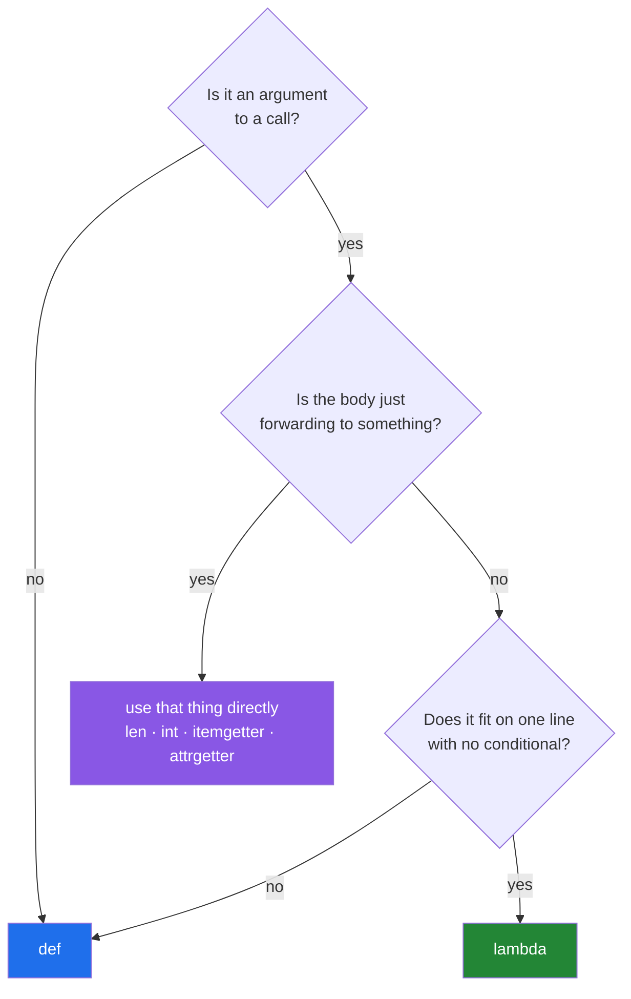

# 3.3 — Where a lambda helps and where it hurts

## One-line answer

A lambda helps when it is small, passed straight into something else, and never needed again — and it
hurts the moment it acquires a name, a second clause, or a bug, because every one of those wants the
thing a lambda gave up.

---

## The story

The deli's new person is quick, and by the end of the first week they have picked up the habit of
saying instructions rather than writing cards. This works well for "take the top slip off each pile".

Then a customer complains that their order came out wrong, and the owner asks what happened. The
answer is: *"I did the thing I was told."*

Which thing? Nobody knows. There were nine spoken instructions that morning, none of them written
down, and the only way to find out which one went wrong is to stand in the shop and watch until it
happens again.

The cards on the wall have titles. When a card is wrong you can point at it, argue about it, change
it, and tell everybody the change. A spoken instruction has none of that, and for a thirty-second job
that is exactly right — you do not want a card for "take the top slip off each pile", because filing
it would cost more than doing it.

The judgement is not "cards good, speech bad". It is knowing which jobs are thirty seconds long.

The four slips are still the four slips:

```text
milk
  Milk
eggs
Eggs.
```

---

## The idea in plain language

The plan's named example for `PY-12` is *where a lambda helps and where it hurts readability*, so
this document is a judgement rather than a mechanism. Here is the judgement, stated as plainly as it
can be.

**A lambda gives up four things** that a `def` provides:

1. **A name.** The traceback says `<lambda>`, the profiler says `<lambda>`, and a log line that
   mentions the function says `<lambda>` ([3.1](3.1-lambda-a-function-with-no-name.md)).
2. **A docstring.** There is nowhere to put one, so there is nowhere to say what it means or what it
   assumes.
3. **Annotations.** A lambda's parameter list accepts no type hints, and there is no place for a
   return annotation either. A type checker has to infer everything, and a reader has to guess.
4. **Room to grow.** One expression. The moment it needs a second statement, the whole thing has to
   be rewritten as a `def`, and whoever does that has to re-read every call site.

**In exchange, it gives one thing**, and it is genuinely valuable: **it is an expression**, so it can
be written at the point of use, inside another call, without a definition four lines above.

So the trade is: *lose the name, gain the position*. And that trade is worth making exactly when the
position is more helpful than the name — which is when the function is small enough to read at a
glance and local enough that nobody will ever look for it by name.

That gives a short test, which is the whole of this document:

> **Use a lambda when it is an argument to a call, fits comfortably on one line, and contains no
> conditional. Use a `def` otherwise.**

Three named traps follow from it, and each has a standard-library answer that is better than either:

- **The wrapper lambda.** `key=lambda s: len(s)` is `key=len`. `map(lambda x: int(x), xs)` is
  `map(int, xs)`. Adding a lambda that only forwards its argument is pure cost.
- **The getter lambda.** `key=lambda row: row["year"]` is `key=operator.itemgetter("year")`, and
  `key=lambda p: p.year` is `key=operator.attrgetter("year")`. Both of those are named, and both are
  faster because they do not build a Python frame per item.
- **The named lambda.** `tidy = lambda s: s.strip()` is a `def` with the name moved to the wrong side
  of the `=`. ruff's `E731` refuses it, and PEP 8's wording is that you should always use a `def`
  statement instead of an assignment binding a lambda to an identifier (*PEP 8 — Style Guide for
  Python Code*, 2001, <https://peps.python.org/pep-0008/>).

---

## Why Setu needs it

- **Principle 20 says a sentence the reader has to read twice is a bug in the document.** The same
  standard applies to code. A `sorted(rows, key=lambda r: (r["field"], -r["citations"], r["title"].casefold()))`
  is a sentence read twice, and the fix is a named function with a name that says what the order is.
- **Every framework day after this one takes callables.** Day 76's `FunctionTransformer`, Day 172's
  LangChain, Day 185's LangGraph nodes: each is a place where you will be tempted to inline a lambda,
  and in two of the three the function is big enough that you should not.
- **Day 14 is decorators**, which are functions taking functions. A codebase where every small
  function is anonymous is a codebase where a decorator has nothing to attach a useful name to, and
  `@timed` reports timings for `<lambda>`.
- **`./m check` runs `ruff check .` with the `E` family selected**
  ([Day 2, 1.2](../../../day-02-quality-gate/parts/01-linting/1.2-choosing-rule-families.md)), so
  `E731` is already a gate in this project. This document is why the gate is there rather than an
  annoyance.

---

## The mechanism

The three traps and their replacements, run side by side:

```python
"""Each pair does the same job. The second of each pair is the one to write."""

import operator

slips = ["milk", "  Milk", "eggs", "Eggs."]
orders = [
    {"item": "milk", "qty": 2},
    {"item": "eggs", "qty": 6},
    {"item": "bread", "qty": 1},
]

print("wrapper, lambda :", sorted(slips, key=lambda slip: len(slip)))
print("wrapper, direct :", sorted(slips, key=len))

print("getter, lambda  :", sorted(orders, key=lambda order: order["qty"]))
print("getter, operator:", sorted(orders, key=operator.itemgetter("qty")))

print("real work       :", sorted(slips, key=lambda slip: slip.strip().casefold()))
```

Run on Python 3.12.12 on 2026-09-01:

```
wrapper, lambda : ['milk', 'eggs', 'Eggs.', '  Milk']
wrapper, direct : ['milk', 'eggs', 'Eggs.', '  Milk']
getter, lambda  : [{'item': 'bread', 'qty': 1}, {'item': 'milk', 'qty': 2}, {'item': 'eggs', 'qty': 6}]
getter, operator: [{'item': 'bread', 'qty': 1}, {'item': 'milk', 'qty': 2}, {'item': 'eggs', 'qty': 6}]
real work       : ['eggs', 'Eggs.', 'milk', '  Milk']
```

**Line by line:**

- `key=lambda slip: len(slip)` and `key=len` — identical results. The lambda adds a function call per
  item and a `<lambda>` frame in every traceback, and buys nothing. **If the lambda's body is a single
  call whose only argument is the parameter, delete the lambda.**
- `key=lambda order: order["qty"]` and `key=operator.itemgetter("qty")` — identical again.
  `itemgetter` is a named object built for this, so a traceback says `itemgetter` and a profile can
  tell you it was the sort key. `operator.attrgetter("qty")` is the version for `order.qty`.
- `key=lambda slip: slip.strip().casefold()` — **this one stays.** There is no built-in that means
  "strip then casefold", the expression is short, and it is at the place the sort order is decided.
  This is the lambda the rule is protecting.
- `'milk'` and `'eggs'` both have length four and `'milk'` comes first in both length sorts, because
  `sorted` is stable and `'milk'` was first in the input
  ([Day 8, 1.5](../../../day-08-containers/parts/01-sequences/1.5-sort-sorted-and-key.md)).

The lambda that has outgrown itself, and the `def` it wants to be:

```python
"""A conditional inside a lambda, and the same logic as a function."""

orders = [
    {"item": "milk", "qty": 2, "note": None},
    {"item": "eggs", "qty": 6, "note": "  Large "},
    {"item": "bread", "qty": 1, "note": ""},
]

print(
    "as a lambda:",
    sorted(
        orders,
        key=lambda o: (o["note"].strip().casefold() if o["note"] else "", -o["qty"]),
    ),
)


def sort_key(order):
    """Order by the cleaned note (blank notes first), then by largest quantity."""
    note = order["note"] or ""
    return (note.strip().casefold(), -order["qty"])


print("as a def   :", sorted(orders, key=sort_key))
```

**Line by line:**

- `key=lambda o: (... if o["note"] else "", -o["qty"])` — one line, and it holds a tuple, a
  conditional expression, a chained method call and a negation. It is **correct**, and it is a
  sentence read twice, which Principle 20 calls a defect.
- `o` as a parameter name — a lambda squeezed into a `key=` tends to get a one-letter parameter,
  because a longer one would push the line over the limit. That is the line length making a naming
  decision, which is backwards.
- `def sort_key(order):` with a docstring — **the docstring is the thing the lambda could not have**,
  and it is the only place the ordering rule is stated in words rather than in punctuation. Anybody
  arguing about the sort order argues with that sentence.
- `note = order["note"] or ""` — the `None` case handled on its own line
  ([Day 5, 3.1](../../../day-05-operators-and-conditionals/parts/03-the-or-trap/3.1-the-or-default-and-falsy-zero.md)
  explains why `or` is safe here: the alternative to a string is another string, and the falsy-zero
  trap needs a number).
- `-order["qty"]` — negating to sort descending on the second key while the first stays ascending.
  This trick has no `reverse=` equivalent when only one key should be reversed, which is worth a
  comment in real code.
- Both calls produce the same order. **The difference is entirely readability**, which is the only
  thing this document is about.

What the traceback looks like when the lambda is the one that fails:

```python
"""Two identical bugs, and the two tracebacks they produce."""

orders = [{"item": "milk", "qty": 2}, {"item": "eggs"}]

try:
    sorted(orders, key=lambda order: order["qty"])
except KeyError as error:
    print("lambda :", type(error).__name__, error)


def by_quantity(order):
    return order["qty"]


try:
    sorted(orders, key=by_quantity)
except KeyError as error:
    print("def    :", type(error).__name__, error)
```

**Line by line:**

- Both raise `KeyError: 'qty'` on the second order, which has no `qty`. The printed messages are
  identical, because a `KeyError` carries only the missing key.
- The **traceback** is where they differ, and it is not visible in the printed message: the lambda's
  frame is named `<lambda>` and the function's frame is named `by_quantity`. With one sort in a file
  that costs nothing. With six lambdas passed to six different calls, the traceback tells you the
  file and the line and nothing about which sort it was.
- `type(error).__name__` — prints the exception class name without its module, which is the tidy way
  to show what was caught.
- The lesson is not "lambdas cause errors". It is that **a lambda makes an error harder to place**,
  and that cost lands at the worst moment: when something has already gone wrong.



---

## When it breaks

**The linter refuses the named lambda:**

```text
$ printf 'tidy = lambda slip: slip.strip()
' | uv run ruff check --isolated --select E731 -
E731 Do not assign a `lambda` expression, use a `def`
 --> -:1:1
  |
1 | tidy = lambda slip: slip.strip()
  | ^^^^^^^^^^^^^^^^^^^^^^^^^^^^^^^^
help: Rewrite `tidy` as a `def`

Found 1 error.
No fixes available (1 hidden fix can be enabled with the `--unsafe-fixes` option).
```

**What it means.** ruff's own explanation of the rule is worth reading in full with
`uv run ruff rule E731`: *"Using a `def` statement leads to better tracebacks, and the assignment
itself negates the primary benefit of using a `lambda` expression (i.e., that it can be embedded
inside another expression)."* That is the argument of this whole document in two clauses, from the
linter this project already runs.

**The lambda that cannot hold what you need to put in it:**

```text
$ uv run python -c "
f = lambda slip: cleaned = slip.strip()
"
  File "<string>", line 2
    f = lambda slip: cleaned = slip.strip()
        ^^^^^^^^^^^^^^^^^^^^
SyntaxError: cannot assign to lambda
```

**What it means.** The function has grown a local variable, which is the clearest possible signal
that it is no longer one expression. There is a workaround — the walrus operator, `:=`, makes an
assignment into an expression
([Day 9, 3.2](../../../day-09-comprehensions/parts/03-when-not-to/3.2-comprehension-scope.md)) — and
using it here is exactly the wrong lesson. When a lambda needs a local, write the `def`.

**The stack trace with six identical frames:**

```text
Traceback (most recent call last):
  File "pipeline.py", line 44, in run
    ranked = sorted(rows, key=lambda r: r["score"] / r["count"])
  File "pipeline.py", line 44, in <lambda>
    ranked = sorted(rows, key=lambda r: r["score"] / r["count"])
ZeroDivisionError: division by zero
```

**What it means.** The same line appears twice, once as the caller and once as `<lambda>`, and the
frame name carries no information. In this small example you can read the expression and see the
division. In a file where `pipeline.py` line 44 is one of several sorts, or where the lambda was
built inside a loop, the only distinguishing information is a line number that a refactor will move.
A named `def score_ratio(row)` puts the answer in the frame name, where a log aggregator can also see
it.

---

## In production

**The professional standard that most teams converge on is a length rule plus a nesting rule:** a
lambda may be used as an argument, must fit on the line it is written on, and must contain no
conditional and no second lambda. Anything else becomes a `def` directly above the call. This is not
an aesthetic preference; it is that a lambda's cost is paid during an incident, and its benefit is
paid while writing, so the trade is worse than it feels at the moment you make it.

**What changes at scale is that `<lambda>` stops being findable.** In a profile of a job over ten
million rows, the top three entries by cumulative time might all be `<lambda>`, distinguishable only
by file and line — and the line numbers were recorded before this morning's refactor. Teams working
on hot paths name their key functions purely so the profile is readable. The same applies to error
aggregation: a service that groups exceptions by function name groups every lambda in the codebase
into one bucket.

**The failure that only appears with real data is the lambda in a loop.** `handlers = [lambda: run(name)
for name in names]` captures the *name*, not the value
([Day 10, 2.4](../../../day-10-functions/parts/02-scope/2.4-closures-and-late-binding.md)), so every
handler uses the last one. It is caught by ruff's `B023` when the lambda is written inline, and it is
missed entirely when the same closure is built through two layers of helper functions. The habit that
prevents it is to pass the value as an argument rather than closing over it — which is the seam
argument from
[Day 10, 3.3](../../../day-10-functions/parts/03-the-module/3.3-pure-functions-and-the-seam.md) once
more.

**The review comment a senior engineer leaves.** On a five-part `key=` lambda: *"I had to read this
twice to work out the ordering, and I still am not sure whether the reverse applies to the whole key
or just the count. Make it a `def` with a docstring that says the order in words. The lambda is not
saving us anything here — it is the only thing on the line anyway."*

**The interview question.** *"When would you avoid a lambda?"* The answer that lands is a rule rather
than a feeling: when it needs a name, a docstring, annotations, a statement, or a conditional — and
when its body is only forwarding to something that already exists, in which case pass that thing
directly. Adding that the real cost is the `<lambda>` frame in tracebacks and profiles, which is paid
during an incident rather than while writing, is what makes it sound like experience.

---

## Check yourself

```bash
uv run python -c "
import operator
orders = [{'item': 'milk', 'qty': 2}, {'item': 'eggs', 'qty': 6}]
print(sorted(['milk', '  Milk', 'eggs'], key=len))
print(sorted(orders, key=operator.itemgetter('qty')))
"
uv run ruff rule E731 | head -20
```

The first two lines were written without a single lambda. Read ruff's own two-clause reason for
`E731` and say which of the two clauses applies to `tidy = lambda s: s.strip()`.

**Answer out loud, without scrolling up:**

> Give the one-sentence rule for when a lambda is the right choice. Then name the four things a lambda
> gives up, and say which of them you notice first when something goes wrong at three in the morning.

---

**Next:** [3.4 — `reduce`, `any`, `all`, and the short circuit](3.4-reduce-any-and-all.md), the last
of the functional tools and the one with the most surprising failure mode.
