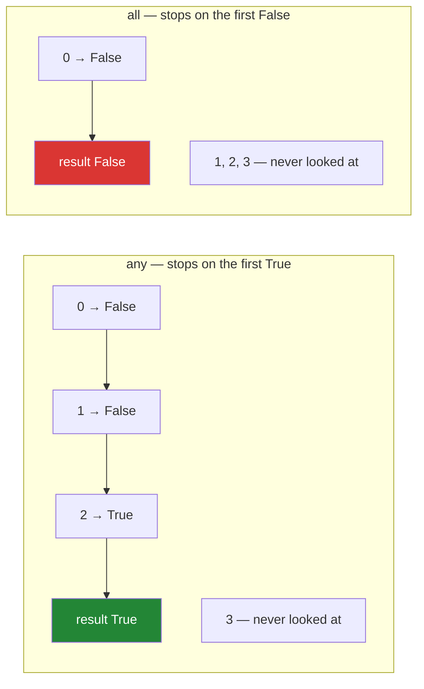

# 3.4 — `reduce`, `any`, `all`, and the short circuit

## One-line answer

`reduce` folds a whole sequence down to one value and is almost always worse than the loop or the
built-in that already does the job; `any` and `all` are the two folds worth knowing, and they stop
reading the moment the answer is decided.

---

## The story

The owner wants three things checked before locking up.

**"Add up today's takings."** You start with zero, add the first slip's total, then the next, then the
next. One running number, one slip at a time, and the number at the end is the answer.

**"Was there anything unusual today?"** You start looking through the slips. The second one is a
special order for a wedding cake. You stop. You do not look at the other two hundred, because the
question was *"anything"*, and you have found one.

**"Were all the orders paid for?"** You start looking. The first one is unpaid. You stop again — one
unpaid order is enough to answer *"all"* with no.

Three questions, three folds of the same pile into one answer. The first has to see everything. The
second and third stop as soon as they can, and on a big pile that is the difference between a minute
and an hour.

Today's four:

```text
milk
  Milk
eggs
Eggs.
```

---

## The idea in plain language

A **fold** is the operation of walking a sequence while carrying one running value, and returning that
value at the end. Adding up is a fold. Finding the longest is a fold. Building one big string out of
many is a fold.

`functools.reduce(function, iterable, initial)` is the general version. It takes a function of two
arguments — the running value and the next item — and calls it once per item:

```text
reduce(f, [a, b, c], start)  ==  f(f(f(start, a), b), c)
```

Read that inside out and it is exactly the running total. The `initial` argument is optional, and
leaving it out has a consequence that is the subject of the failure section below.

The honest position on `reduce` in this language is that **you rarely want it.** Python moved it out
of the built-ins and into `functools`, and for almost every real fold there is either a built-in that
says what it means or a two-line loop that reads better:

| Fold | `reduce` version | What to write instead |
|---|---|---|
| add up | `reduce(operator.add, xs)` | `sum(xs)` |
| largest | `reduce(max, xs)` | `max(xs)` |
| join strings | `reduce(operator.add, parts)` | `"".join(parts)` |
| merge dicts | `reduce(operator.or_, dicts)` | a loop, or `dict(ChainMap(*dicts))` |
| anything custom | `reduce(f, xs, start)` | a `for` loop with a running variable |

The last row is the important one. A custom fold written as a loop has a named running variable, a
place to put a comment, and a debugger breakpoint that works. The `reduce` version has a lambda and
an argument order you have to reconstruct every time you read it.

`any` and `all` are the two folds that *are* worth reaching for, and they are built in:

- `any(iterable)` — `True` if at least one item is truthy. **Stops at the first true one.**
- `all(iterable)` — `True` only if every item is truthy. **Stops at the first false one.**

Stopping early is called **short-circuiting**, and it is the same idea as `and` and `or` not
evaluating their right-hand side when the left already decides the answer
([Day 5, 2.4](../../../day-05-operators-and-conditionals/parts/02-conditionals/2.4-and-or-return-operands.md)).
Combined with a generator expression it means `any(is_bad(row) for row in million_rows)` can finish
after two rows.

Two edge cases catch everybody once, and both are correct rather than quirky:

- `any([])` is `False`. There is no true item, because there are no items.
- `all([])` is `True`. There is no false item, because there are no items. This is called *vacuous
  truth*, and it is the source of a real class of bug: a validation that says "all rows are valid"
  passes when there are no rows at all.

---

## Why Setu needs it

- **`any` over a generator is the cheapest possible data-quality check**, and Day 34 reads
  `df.describe()` as a data-quality report for the same reason. A check that can stop at the first bad
  row is a check you can afford to run on every load.
- **`all([])` being `True` is the shape of a real production incident**: an empty import file passes
  every validation and the pipeline reports success on zero rows. Day 84's EDA and Day 90's data
  checks both have to guard against it explicitly.
- **[4.1](../04-the-gate/4.1-ten-functions-fully-tested.md) is today's gate**, and one of its tests
  asserts that the module's own reader produces every non-empty line. `all(...)` over a generator is
  how that is written in one line.
- **Day 216's agent workflows ask "did any tool fail?" and "did all approvals come back?"**, which
  are these two functions over lists of results. The short-circuit matters there because each item
  may be an expensive call.

---

## The mechanism

A fold, three ways:

```python
"""One running total, written as a loop, as reduce, and as the built-in."""

import operator
from functools import reduce

quantities = [2, 6, 1, 3]

total = 0
for quantity in quantities:
    total = total + quantity
print("loop   :", total)

print("reduce :", reduce(operator.add, quantities))
print("builtin:", sum(quantities))

print("reduce with a start:", reduce(operator.add, quantities, 100))
print("reduce over nothing:", reduce(operator.add, [], 0))
```

Run on Python 3.12.12 on 2026-09-01:

```
loop   : 12
reduce : 12
builtin: 12
reduce with a start: 112
reduce over nothing: 0
```

**Line by line:**

- `total = 0` then `total = total + quantity` — the loop version, and the running variable has a name.
  That name is what a debugger shows you and what a comment can refer to.
- `reduce(operator.add, quantities)` — the same thing, with the running variable hidden inside
  `reduce`. `operator.add` is the function form of `+`, and it is preferable to `lambda a, b: a + b`
  for the reason [3.3](3.3-where-a-lambda-hurts.md) gives.
- `sum(quantities)` — **the version to write.** Shorter than both, faster than both, and it says what
  it means in three letters.
- `reduce(operator.add, quantities, 100)` — the third argument is the starting value, so the answer
  is `112`. Note that it goes **last**, which is the opposite of how the operation reads.
- `reduce(operator.add, [], 0)` — an empty sequence with a start value returns the start value. With
  no start value it raises, which is the first failure below.

The two folds worth having, and the stopping:

```python
"""any and all stop as soon as the answer is decided."""

quantities = [0, 1, 2, 3]


def looks_at(value):
    print("   ...looking at", value)
    return value > 1


print("any:")
print("result:", any(looks_at(value) for value in quantities))

print()
print("all:")
print("result:", all(looks_at(value) for value in quantities))

print()
print("any over nothing:", any([]))
print("all over nothing:", all([]))
```

Run on Python 3.12.12 on 2026-09-01:

```
any:
   ...looking at 0
   ...looking at 1
   ...looking at 2
result: True

all:
   ...looking at 0
result: False

any over nothing: False
all over nothing: True
```

**Line by line:**

- `looks_at` prints before it answers, so the output shows exactly how many items each function
  examined. That is the only thing this block measures.
- `any(...)` looked at three of four and stopped at `2`, the first value greater than one. **The
  fourth was never examined**, and on a million rows the fourth through millionth would never be
  examined either.
- `all(...)` looked at **one**. `0 > 1` is false, so the answer is already decided and nothing else
  matters. This is the cheapest possible check on a well-ordered stream, and it is why a validator
  should put its most likely failure first.
- `any([])` is `False` and `all([])` is `True`. Read them as "is there one that passes?" — no, there
  is nothing — and "is there one that fails?" — no, there is nothing. Both answers are consistent;
  the second is the one that surprises people.
- A generator expression rather than a list comprehension inside both calls. With a list, all four
  `looks_at` calls would happen before `any` saw anything, and the short circuit would be worth
  nothing ([3.2](3.2-map-and-filter-are-lazy.md)).

The short circuit leaves the reader parked, which is worth seeing:

```python
"""Short-circuiting stops mid-stream, and the stream remembers."""

quantities = (value for value in [0, 1, 2, 3])

print("any said:", any(value > 1 for value in quantities))
print("what is left:", list(quantities))
```

Run on Python 3.12.12 on 2026-09-01:

```
any said: True
what is left: [3]
```

**Line by line:**

- `quantities` is a generator expression, made once and shared by both lines.
- `any(value > 1 for value in quantities)` stopped at `2`, so `0`, `1` and `2` have been consumed and
  `3` has not.
- `list(quantities)` prints `[3]` — **not `[]` and not the whole sequence.** The reader is parked
  exactly where `any` stopped ([1.3](../01-iterators/1.3-exhaustion.md)).
- This is occasionally useful and more often a bug. A function that runs a validation with `any` and
  then processes the same iterator has silently skipped everything up to and including the row that
  triggered the check.



---

## When it breaks

**`reduce` over an empty sequence with no starting value:**

```text
$ uv run python -c "
from functools import reduce
print(reduce(lambda a, b: a + b, []))
"
Traceback (most recent call last):
  File "<string>", line 3, in <module>
TypeError: reduce() of empty iterable with no initial value
```

**What it means.** Without a start value, `reduce` uses the first item as the running value — and
there is no first item. The message is unusually clear about the cause. The fix is always to pass the
initial value: `reduce(f, xs, 0)`. This is a real production failure rather than a curiosity, because
the empty case is the one that only happens after a bad upstream day, and the traceback then appears
in a job that has worked for months. `sum([])` returns `0` and never has this problem, which is one
more reason to prefer the built-in.

**The validation that passed because there was nothing to validate:**

```text
>>> rows = []
>>> all(row["qty"] > 0 for row in rows)
True
>>> print("import valid:", all(row["qty"] > 0 for row in rows))
import valid: True
```

**What it means.** An empty import file passed every check and the pipeline reported success. Nothing
is wrong with `all`; the code asked "is any row invalid?" and there were none. The bug is that
"valid" was defined without saying how many rows were expected. The fix is an explicit guard —
`if not rows: raise ValueError("no rows to validate")` — written *before* the `all`, and it belongs
in every loader in this plan.

**Short-circuiting that ate the rows:**

```text
>>> rows = iter([0, 1, 2, 3])
>>> any(value > 1 for value in rows)
True
>>> list(rows)
[3]
```

**What it means.** Three of the four are gone. The real version of this is a function that checks its
input with `any(...)` and then loops over the same iterator to process it — the processing loop
starts at row four, and three rows have vanished with no error. It is
[1.3](../01-iterators/1.3-exhaustion.md)'s bug again, and it is worth meeting a third time because
`any` is the one that hides it best: the check *succeeded*, so nobody suspects the check.

**A `reduce` whose argument order is wrong:**

```text
>>> from functools import reduce
>>> reduce(lambda item, total: total + item, [2, 6, 1], 0)
9
>>> reduce(lambda item, total: total - item, [2, 6, 1], 0)
-3
```

**What it means.** The first result is right by accident, because addition does not care about order.
The second is wrong: it should be `-9`, and it is `-3`, because the parameters are named backwards —
`reduce` always passes the **running value first** and the item second. Addition hid the mistake and
subtraction revealed it. This is the single strongest argument for the plain loop, where the running
variable has a name and the direction is visible.

---

## In production

**The professional position is that `reduce` is a code smell in Python, and `any`/`all` over a
generator expression are among the most useful lines in the language.** The reason for the asymmetry
is readability: `any(is_expired(token) for token in tokens)` is a sentence, and
`reduce(lambda acc, t: acc or is_expired(t), tokens, False)` is a puzzle that also loses the short
circuit. When a fold genuinely has no built-in, teams write the loop and give the accumulator a name.

**What changes at scale is that the short circuit becomes a cost decision rather than a nicety.** A
check written as `any(check(row) for row in rows)` over ten million rows may finish in microseconds
or may read everything, depending entirely on where the first hit is. That makes the *order* of the
data part of the performance characteristics, which is worth writing down: a validator that is fast
in testing because the sample was sorted can be slow in production because the export is not.

**The failure that only appears with real data is vacuous truth.** Every `all(...)` in a codebase is
a latent "and it is fine if there is nothing", and that is right about half the time. The habit that
prevents the incident is to write the count assertion next to the quality assertion — first
`assert rows`, then `assert all(...)` — so that "zero rows" and "all rows good" cannot be confused.
This is Principle 7's *test that can go red* applied to data rather than to code.

**The review comment a senior engineer leaves.** On `if all(r["ok"] for r in results): mark_success()`:
*"If `results` is empty this marks success. That is exactly what happened last month when the
upstream job produced no file. Add `if not results: raise` above it, or make the condition
`results and all(...)` — and put a test in with an empty list, because the current suite would not
catch it."*

**The interview question.** *"What does `all([])` return, and why?"* The answer is `True`, and the
reason is that `all` asks whether any item fails and there are none. The follow-up worth volunteering
is what that costs in practice — an empty input passing validation silently — and the fix, which is a
separate emptiness check rather than a cleverer condition. If you can also say that `any` and `all`
short-circuit and therefore leave a generator parked mid-stream, you have hit the two things that
actually go wrong with them.

---

## Check yourself

```bash
uv run python -c "
def looks_at(v):
    print('   ...looking at', v)
    return v > 1

print('any:', any(looks_at(v) for v in [0, 1, 2, 3]))
print('all:', all(looks_at(v) for v in [0, 1, 2, 3]))
print('any([]):', any([]), '| all([]):', all([]))

rows = iter([0, 1, 2, 3])
print('any said:', any(v > 1 for v in rows), '| left:', list(rows))
"
```

`any` looked at three values and `all` looked at one. Say which of the two would be the more expensive
check if the bad rows were always at the end of the file.

**Answer out loud, without scrolling up:**

> Say what `all([])` returns and why that answer is correct. Then explain what a short circuit leaves
> behind when the sequence being checked is a generator.

---

**Next:** [4.1 — ten functions, fully tested](../04-the-gate/4.1-ten-functions-fully-tested.md).
Section 3 finishes `PY-12`; section 4 is the gate this whole phase has been building towards.
