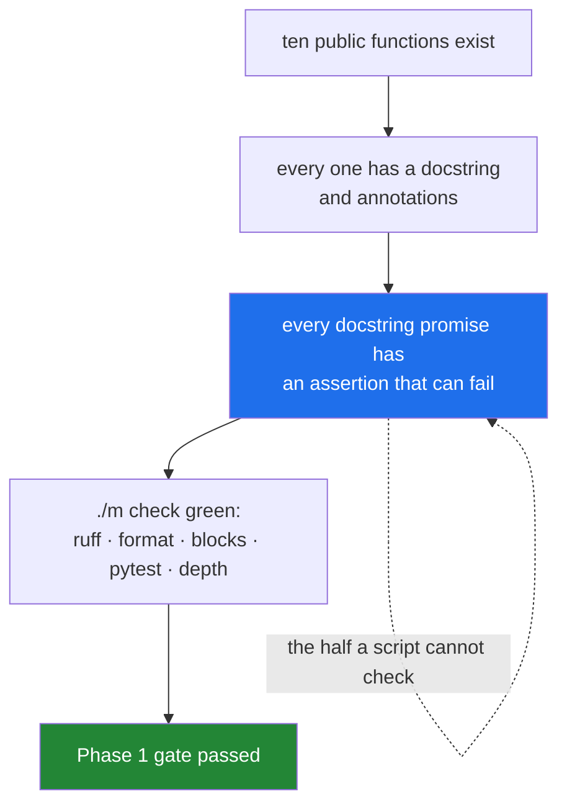

# 4.1 — Ten functions, fully tested: the phase gate read as a list

## One-line answer

Phase 1's deliverable is a ten-function `src/setu/textutils.py` with a test for every promise each
function makes, and "fully tested" means every docstring sentence has an assertion that can go red —
not that the file has ten `def`s and a green run.

---

## The story

The deli's owner has a sheet taped inside the stockroom door. It says what has to be true before the
shop opens:

> Float counted. Fridge between 1 and 4. Bread in. Sign turned. Card machine answers.

Five lines, and every one of them is checkable in the next thirty seconds by somebody who was not
there when they were written. Nobody has to remember the list, argue about what "ready" means, or
take anybody's word for it.

What makes the sheet work is not that it is a list. It is that each line names something you can go
and look at. Compare a version that said *"stockroom in good order"* — everyone would agree they had
done it, and nobody would be able to check.

The other thing about the sheet: it does not say *how long* opening takes. It has never said that, in
years. It says what has to be true. Some mornings that is ten minutes and some mornings the fridge is
at 9 degrees and it is an hour, and either way the shop does not open until the sheet is true.

Today's four slips, one last time, because they are what the module is for:

```text
milk
  Milk
eggs
Eggs.
```

---

## The idea in plain language

A **phase gate** is a written statement of what must be true before the next phase starts. Phase 1 of
this plan — Days 4 to 11, Module 1 — has exactly one, and the plan states it in four words plus a
path:

> **10-function `src/setu/textutils.py`, fully tested.**

Three of those words carry weight, and they are worth taking apart.

**Ten functions.** Not "about ten" and not "ten lines". Day 10 designed seven
([Day 10, 3.2](../../../day-10-functions/parts/03-the-module/3.2-designing-clean-title.md)); today
adds three that only make sense once iterators and generators exist. The count is a floor rather than
a target: the point is a module with enough surface that the tests have something to disagree with.

**Fully tested.** This is the phrase that does the work, and the definition this plan uses is
Principle 7's: **a behaviour is not done until a test can go red when it regresses.** So "fully
tested" is not a coverage percentage. It is a per-promise rule:

> Every sentence in a function's docstring that claims something is a promise, and every promise has
> an assertion that fails when the promise is broken.

That standard is checkable by reading. Open `textutils.py`, read one docstring, and ask which test
would fail if that sentence stopped being true. If the answer is "none", the function is not fully
tested however many tests exist.

**`src/setu/`.** Not a notebook. Principle 6 says the notebook is a scratchpad and anything worth
keeping graduates to a module with a test on the same day
([Day 10, 3.1](../../../day-10-functions/parts/03-the-module/3.1-from-notebook-to-module.md)).

Here is the whole surface, with today's three at the bottom:

| # | Function | Returns | Day | Why it is that shape |
|---|---|---|---|---|
| 1 | `clean_title` | `str` | 10 | eager: one string in, one string out |
| 2 | `clean_titles` | `list[str]` | 10 | eager on purpose — the caller compares lengths |
| 3 | `title_key` | `str` | 10 | the comparison form, never for display |
| 4 | `same_title` | `bool` | 10 | one definition of sameness, in one place |
| 5 | `count_titles` | `int` | 10 | pure: takes text, not a path |
| 6 | `summarise_years` | `str` | 10 | takes `today`, so the test can fix the date |
| 7 | `make_prefixer` | a function | 10 | a deliberate closure |
| 8 | `iter_titles` | `Iterator[str]` | 11 | lazy: takes an open handle, holds one line |
| 9 | `unique_titles` | `Iterator[str]` | 11 | lazy, but keeps a set of keys — the honest exception |
| 10 | `titles_matching` | `Iterator[str]` | 11 | lazy, and takes the caller's test as a function |

Read the *Returns* column downwards. Seven eager, three lazy, and each one chosen rather than
defaulted. That column is the acceptance criterion this document is really about: **you can say, for
every function in the module, why it returns the kind of thing it returns.**

---

## Why Setu needs it

- **Because Phase 2 starts tomorrow and builds on this module.** Day 12's `Paper` object holds a
  title, and Day 13's loaders produce them. If `title_key` is wrong, everything downstream compares
  the wrong things, and it will be wrong quietly.
- **Because Principle 1 says no commit, no day.** A gate that can be passed by agreeing that you did
  it is not a gate ([Day 0, 3.3](../../../day-00-setup/parts/03-m-script/3.3-the-done-gate.md)), so
  this one is defined entirely in terms of files that exist and tests that run.
- **Because Principle 17 says a day is a unit of subject.** Phase 1 is finished when the sheet is
  true, not when eight days have gone by. If `clean_title` is still not right, Phase 1 is not
  finished, and that is a normal outcome rather than a failure.
- **Because the interview answer for Module 1 is this module.** "I wrote a tested text-utilities
  module and here is why each function returns what it returns" is a portfolio artefact
  (Principle 10). "I did a Python course" is not.

---

## The mechanism

The three functions today adds, as signatures with their promises written out. **The bodies are yours
to write** (Principle 6 — the reps are not done for you):

```python
"""The three functions Day 11 adds to src/setu/textutils.py."""

from __future__ import annotations

from collections.abc import Callable, Iterable, Iterator
from typing import TextIO


def iter_titles(handle: TextIO) -> Iterator[str]:
    """Yield each non-empty line of `handle`, cleaned, one at a time.

    Takes an already-open text handle rather than a path, so a test can pass
    io.StringIO and never touch a disk (day 10, part 3.3).

    Holds one line at a time: peak memory does not grow with the file.
    Blank lines and whitespace-only lines are skipped, never yielded as "".
    """
    # TODO(me): a for loop over `handle`, clean_title on each, skip the empties.
    # Part 2.3 has the shape. Decide - and write in a comment - whether you strip
    # the newline yourself or let clean_title's collapse step do it, because those
    # two choices differ on a line that is only "\n".
    raise NotImplementedError


def unique_titles(titles: Iterable[str]) -> Iterator[str]:
    """Yield each title the first time its `title_key` is seen, in input order.

    Lazy in its input and its output: nothing is materialised. The set of keys
    grows with the number of DISTINCT titles, which is the one thing this
    function holds and the docstring says so on purpose (part 2.5).
    """
    # TODO(me): the shape is day 8, part 3.2, rewritten as a generator. The
    # decision that matters is which value goes in the set - the title or the
    # key - and one of those two makes "milk" and "  Milk" different.
    raise NotImplementedError


def titles_matching(
    titles: Iterable[str],
    predicate: Callable[[str], bool],
) -> Iterator[str]:
    """Yield the titles for which `predicate` returns True, in input order.

    `predicate` is called once per title, lazily. It is NOT called at all for
    titles after the caller stops reading.
    """
    # TODO(me): one loop, one if, one yield. Then write the test that proves the
    # laziness claim in the docstring - a predicate that counts its calls, a
    # caller that takes only two, and an assertion on the count. That test is the
    # only reason the last sentence of this docstring is allowed to be there.
    raise NotImplementedError
```

**Line by line:**

- `from __future__ import annotations` — makes every annotation a string at runtime, so `Iterator[str]`
  costs nothing and forward references work
  ([Day 10, 1.6](../../../day-10-functions/parts/01-the-signature/1.6-the-signature-is-the-contract.md)).
- `TextIO` — the type of an open text-mode file. Annotating the parameter as `TextIO` rather than
  `Path` is the whole seam: it says "give me something already open", which `io.StringIO` satisfies.
- `Callable[[str], bool]` — "a function taking one `str` and returning a `bool`". This is the
  annotation that makes `titles_matching(titles, lambda t: "milk" in t)` legible to a type checker,
  and it is where [3.1](../03-lambda-and-map/3.1-lambda-a-function-with-no-name.md)'s lambda has its
  proper home: an argument, one expression, never named.
- `-> Iterator[str]` on all three — **the promise that these are readers.** A caller that needs to
  loop twice now knows to call `list(...)` itself
  ([2.5](../02-generators/2.5-when-a-generator-is-wrong.md)).
- Each docstring states the memory behaviour explicitly. That sentence is not decoration: it is the
  thing a reviewer checks, and for `unique_titles` it is an honest admission rather than a boast.
- `raise NotImplementedError` under every `TODO(me)` — the function exists, imports work, and the
  tests fail loudly rather than passing on a stub that returns `None`.

The gate, as five commands that either pass or do not:

```python
"""The acceptance check, as a script rather than as a feeling."""

import inspect

import setu.textutils as textutils

EXPECTED = [
    "clean_title",
    "clean_titles",
    "title_key",
    "same_title",
    "count_titles",
    "summarise_years",
    "make_prefixer",
    "iter_titles",
    "unique_titles",
    "titles_matching",
]

found = [
    name
    for name, value in vars(textutils).items()
    if inspect.isfunction(value) and not name.startswith("_")
]

print("expected:", len(EXPECTED))
print("found   :", len(found))
print("missing :", sorted(set(EXPECTED) - set(found)))
print("extra   :", sorted(set(found) - set(EXPECTED)))

for name in EXPECTED:
    function = getattr(textutils, name, None)
    if function is None:
        continue
    doc = inspect.getdoc(function) or ""
    print(f"{name:17} annotated={bool(function.__annotations__)} docstring={len(doc) > 0}")
```

**Line by line:**

- `vars(textutils)` — the module's namespace as a dictionary. `inspect.isfunction` filters out
  imported classes and constants, so the count is of functions this module defines and imports alike.
- `not name.startswith("_")` — private helpers do not count towards ten
  ([Day 13, 3.1](../../../day-13-inheritance-and-abstraction/parts/03-encapsulation/3.1-public-protected-private.md)
  defines that convention). If you split `iter_titles` into a validating wrapper and a private
  generator as [2.1](../02-generators/2.1-yield-the-function-that-pauses.md)'s production section
  suggests, the private half correctly does not count.
- `set(EXPECTED) - set(found)` — set difference
  ([Day 8, 2.2](../../../day-08-containers/parts/02-sets-and-dicts/2.2-set-algebra.md)), which
  answers "what is missing" and "what is extra" in one line each. `sorted` because a set has no
  order and a reproducible printout matters (Principle 4).
- `inspect.getdoc(function) or ""` — `getdoc` returns `None` for an undocumented function, and `or ""`
  turns that into something `len()` can measure.
- `function.__annotations__` — a dictionary, empty when nothing is annotated, so `bool(...)` is the
  question "is anything annotated at all". **This is a weak check on purpose**: it catches the
  function nobody annotated, and it cannot tell you whether the annotation is honest. Only reading
  can do that.
- **This script is not the gate.** It checks the countable half. The half that matters — does every
  promise have a test that can go red — is the checklist, and it is checked by a person.



---

## When it breaks

**The module that imports but is not finished:**

```text
$ uv run python -m pytest tests/test_textutils.py -q
E       NotImplementedError

tests/test_textutils.py:22: NotImplementedError
10 failed, 0 passed
```

**What it means. This is the correct state at the start of the day**, and it is what Principle 7
asks for: the tests exist and are red before the code exists. A run that says `0 failed, 0 passed`
would be the actual problem, because it means no test was collected and nothing is being claimed.

**The gate that passed because nothing was collected:**

```text
$ uv run python -m pytest -q -m "not live"
no tests ran in 0.03s
$ echo $?
5
```

**What it means.** Exit code 5 is pytest's "collected nothing". `./m check` treats it as a warning
rather than an error, deliberately and with a printed message, because early in the project it was
the honest state
([Day 2, 3.3](../../../day-02-quality-gate/parts/03-pytest/3.3-markers-and-exit-code-five.md)). On
this day it is no longer honest: Phase 1's gate is a tested module, so a `WARN pytest collected no
tests yet` line on Day 11 means the gate has not been met, whatever the rest of the output says.

**The test suite that is green and proves nothing:**

```text
>>> def test_clean_title_works():
...     assert clean_title("  Milk  ") == clean_title("  Milk  ")
...
```

**What it means.** It passes. It will always pass. It would pass if `clean_title` returned its input
unchanged, or returned `""`, or returned the current time — because the expected value is computed by
the thing being tested. This is the most common way a suite reaches a hundred tests and catches
nothing, and the rule that prevents it is in
[Day 2, 3.1](../../../day-02-quality-gate/parts/03-pytest/3.1-the-test-that-can-go-red.md): **write
the expected value out in full, by hand.** A test whose expectation is computed is a test that
asserts the code equals itself.

**The count that was met by splitting:**

There is no error for this one, which is why it is worth naming. Ten functions can be reached by
cutting `clean_title` into `strip_it`, `collapse_it`, `dot_it` and `year_it` and calling that four.
The file then has ten `def`s, the script above prints `found: 10`, and the module is worse than it
was: four names nobody calls directly, four docstrings restating their own bodies, and the same
single behaviour to test. **The gate is ten functions somebody would want to call**, and the check
for it is whether each one appears in a test *by name* because a caller needed it, rather than
because the count needed it.

---

## In production

**The professional version of this gate is a definition-of-done in the repository, not in somebody's
head.** Every team that ships reliably has one, and the ones that work share the property the
stockroom sheet has: each line names something you can go and look at. "Tests pass" is checkable.
"Code is clean" is not. This plan writes it as `CHECKLIST.md` plus `./m check`, and the reason
`./m done N` refuses to commit while a box is unticked is that a checklist you can skip is
decoration.

**What changes at scale is that "fully tested" becomes a conversation about which promises are worth
an assertion.** Ten functions can have every sentence tested. Ten thousand cannot, so teams tier it:
public interfaces get a test per promise, internal helpers get tested through their callers, and the
tier a function is in is decided when it is written rather than argued about later. The version of
this you can already do is smaller and just as useful: know which of your ten functions other days
will import, and hold those to the higher standard.

**The failure that only appears with real data is the untested docstring sentence.** `unique_titles`
promises "in input order", and a body written with a set and no list would satisfy every test that
checks *which* titles come back while quietly getting the order wrong. Order-sensitive promises need
an assertion on a sequence, not on a set, and an input where the wrong order is visible — which means
at least three items, with the duplicate in the middle. Two-item tests pass both implementations.

**The review comment a senior engineer leaves.** On a pull request adding `iter_titles`: *"The
docstring says peak memory does not grow with the file, and nothing tests it. Either drop the
sentence or add a test that feeds it a hundred thousand lines through `io.StringIO` and asserts on
`tracemalloc`'s peak. An untested promise in a docstring is worse than no promise, because the next
person will build on it."*

**The interview question.** *"What does 'fully tested' mean to you?"* The answer that lands is not a
coverage number. It is: every behaviour the code promises has an assertion that fails when the
promise is broken — so I read the docstring, and for each sentence I ask which test goes red. Adding
that coverage measures which lines ran rather than which promises are held, and that a suite can be
at ninety per cent and still assert nothing, is what separates a considered answer from a memorised
one.

---

## Check yourself

```bash
uv run python -c "
import inspect
import setu.textutils as t

expected = ['clean_title', 'clean_titles', 'title_key', 'same_title', 'count_titles',
            'summarise_years', 'make_prefixer', 'iter_titles', 'unique_titles', 'titles_matching']
found = [n for n, v in vars(t).items() if inspect.isfunction(v) and not n.startswith('_')]
print('found:', len(found), 'of', len(expected))
print('missing:', sorted(set(expected) - set(found)))
"
```

Run it now, before you have written anything: it will report the missing ones. Then pick one
docstring sentence from any of the ten and say out loud which test would go red if that sentence
stopped being true.

**Answer out loud, without scrolling up:**

> Give this plan's definition of "fully tested" in one sentence. Then say why a test whose expected
> value is computed by the function under test is worse than having no test at all.

---

**Next:** [4.2 — the streaming reader `textutils` needed](4.2-the-streaming-reader.md), which is the
second half of the gate: the module has to work on a file it cannot hold.
