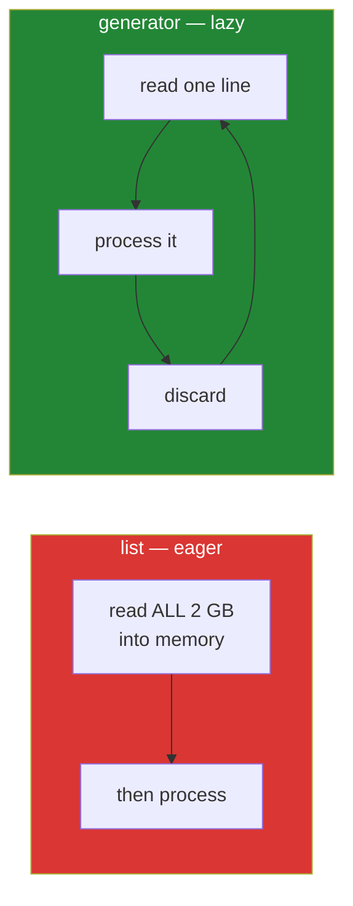

# Day 11 — Iterators, generators, `lambda` and `map`

**Phase 1 gate** · IDs: **PY-11** (iterators and generator functions), **PY-12** (lambda, map, functional style)

> **Yesterday:** functions, parameters, scope.
> **Today:** how `for` actually works, and how to process something larger than your RAM. Then
> Phase 1 closes with a tested module you will still be importing on Day 229.
> **Tomorrow:** Phase 2 — classes, and `Paper` becomes an object.

```bash
./m start 11 && ./m scaffold 11
```

**Time:** 100 minutes (this is a gate day). **Request budget:** 0 model calls.

---

## §1 The story

`for x in things:` has looked like magic for ten days. It is not. It is two method calls:

1. Python calls `iter(things)` to get an **iterator**.
2. It calls `next()` on that iterator over and over, until `next()` raises `StopIteration`, which
   `for` catches silently and turns into "stop".

That is the entire protocol. Anything that implements it can go on the right of a `for`.

The reason this matters is memory. A list holds every item at once. An **iterator** holds a position
and a rule for producing the next item — so it can represent something that does not fit in RAM, or
that has no end at all.

A **generator** is the easy way to write one. Put `yield` in a function instead of `return`, and
Python builds the whole iterator machinery for you. When execution reaches `yield`, the function
**pauses**, hands a value out, and — crucially — resumes exactly where it left off next time.



This is not a micro-optimisation. On Day 227 you ingest a corpus that will not fit in your laptop's
memory; on Day 164 you stream chunks into an embedder; on Day 197 you stream tokens from a model to a
UI. All three are today's `yield`.

`lambda` and `map` close out the day. Both exist, both have narrow legitimate uses, and both are
overused. The honest position — which is the one to say in an interview — is: `lambda` is for a
throwaway key function, and `map`/`filter` lose to a comprehension almost every time in readability.

---

## §2 Setup — run this

```bash
mkdir -p days/day-11/lab
touch days/day-11/lab/lazy.py
touch src/setu/streams.py
touch tests/test_streams.py
```

No new packages. `itertools` is standard library.

---

## §3 PY-11 — the iterator protocol, then generators

`days/day-11/lab/lazy.py`:

```python
"""PY-11 / PY-12: the iterator protocol, generators, and the honest case for lambda."""

from __future__ import annotations

import itertools
import sys


def the_protocol() -> None:
    things = [10, 20, 30]
    it = iter(things)
    print(f"\n{type(it).__name__=}")
    print(f"{next(it)=} {next(it)=} {next(it)=}")
    try:
        next(it)
    except StopIteration:
        print("  StopIteration - this is what `for` catches for you")

    print(f"\n{iter(things) is things=}   <- a list is iterable but is NOT an iterator")
    print(f"{iter(it) is it=}             <- an iterator returns itself")


def a_generator() -> None:
    def countdown(n: int):
        print(f"    [start, n={n}]")
        while n > 0:
            yield n
            n -= 1
        print("    [exhausted]")

    gen = countdown(3)
    print(f"\n{gen=}   <- nothing has run yet")
    print(f"  first next() -> {next(gen)}")
    print(f"  rest         -> {list(gen)}")
    print(f"  again        -> {list(gen)}   <- empty; consumed once")


def memory() -> None:
    eager = [i * i for i in range(200_000)]
    lazy = (i * i for i in range(200_000))
    print(f"\nlist      : {sys.getsizeof(eager):>9,} bytes")
    print(f"generator : {sys.getsizeof(lazy):>9,} bytes")
    print(f"sum(lazy) : {sum(lazy):,}   <- never materialised")


def infinite_and_itertools() -> None:
    def naturals():
        n = 0
        while True:
            yield n
            n += 1

    print(f"\nfirst 5 of an infinite stream: {list(itertools.islice(naturals(), 5))}")
    print(f"{list(itertools.islice(naturals(), 10, 15))=}")

    rows = [("a", 1), ("a", 2), ("b", 3)]
    for key, group in itertools.groupby(rows, key=lambda r: r[0]):
        print(f"  {key}: {[g[1] for g in group]}")


def lambda_and_map() -> None:
    papers = [("bert", 2018), ("attention", 2017), ("gpt", 2018)]

    print(f"\n{sorted(papers, key=lambda p: p[1])=}   <- the good use of lambda")
    print(f"{sorted(papers, key=lambda p: (-p[1], p[0]))=}   <- year desc, title asc")

    values = [1, 2, 3]
    print(f"\nmap:           {list(map(lambda v: v * 2, values))}")
    print(f"comprehension: {[v * 2 for v in values]}   <- prefer this")
    print(f"map + builtin: {list(map(str, values))}    <- fine: no lambda needed")


if __name__ == "__main__":
    the_protocol()
    a_generator()
    memory()
    infinite_and_itertools()
    lambda_and_map()
```

**Line by line:**

- `iter(things)` returns a `list_iterator`, a **separate** object holding a position. `iter(things) is
  things` is `False` — a list is *iterable* but is not itself an *iterator*. That distinction is why
  you can loop over a list twice and over a generator only once.
- `iter(it) is it` is `True` — an iterator's `__iter__` returns itself. That is what lets you pass a
  generator straight to a `for`.
- `next(it)` past the end raises `StopIteration`. `for` catches it. If you call `next()` yourself,
  you handle it — or pass a default: `next(it, None)`.
- `gen = countdown(3)` prints **nothing**. Calling a generator function does not run its body; it
  builds the generator. The `[start, n=3]` line appears on the first `next()`. That deferral surprises
  people, and it means a bad argument raises at first-iteration time rather than at call time.
- `yield n` — pause, emit `n`, and resume **here** next time, with `n` and every other local intact.
- `list(gen)` twice — the second is empty. **Consumed once.** Same rule as the generator expression
  on Day 9.
- `sys.getsizeof` — the generator is a fixed few hundred bytes whatever the range. `sum(lazy)` never
  builds a list.
- `while True: yield n` — an infinite generator. Legal, useful, and impossible with a list.
- `itertools.islice(naturals(), 5)` — take the first five of something endless. `islice(gen, 10, 15)`
  skips then takes. This is how you sample a stream without loading it.
- `itertools.groupby(rows, key=...)` — groups **consecutive** equal keys. **It does not sort first.**
  Unsorted input gives fragmented groups, and this is the single most common `groupby` bug in Python.
- `sorted(papers, key=lambda p: p[1])` — **the good use of `lambda`**: a tiny throwaway key function.
- `key=lambda p: (-p[1], p[0])` — a tuple key sorts by the first element, then the second. Negating a
  number reverses that field only. This exact idiom is Day 10's `newest` tie-break.
- `map(lambda v: v * 2, values)` versus `[v * 2 for v in values]` — same result; the comprehension
  reads better. `map(str, values)` with an existing function and **no lambda** is the case where
  `map` genuinely wins.

---

## §4 Build brief — `src/setu/streams.py`

The streaming helpers Phase 19 reuses. Every one of these returns a generator.

```python
"""Lazy stream helpers. Nothing here materialises its input."""

from __future__ import annotations

from collections.abc import Iterable, Iterator
from typing import TypeVar

T = TypeVar("T")


def read_lines(path) -> Iterator[str]:
    """TODO(me): yield stripped, non-blank lines from a text file.

    Must be lazy: a 2 GB file must not be loaded into memory.
    Must close the file even if the caller stops early (hint: `with`).
    Skip lines starting with '#'.
    """
    raise NotImplementedError


def batched(items: Iterable[T], size: int) -> Iterator[list[T]]:
    """TODO(me): yield consecutive lists of at most `size`, lazily.

    Unlike Day 8's `chunked`, the input may be an ITERATOR of unknown length,
    so you cannot index or call len(). Raise ValueError if size < 1.
    """
    raise NotImplementedError


def take(items: Iterable[T], n: int) -> list[T]:
    """TODO(me): the first n items, without consuming more than n. Must work on infinite input."""
    raise NotImplementedError


def sliding(items: Iterable[T], size: int, step: int) -> Iterator[list[T]]:
    """TODO(me): overlapping windows. sliding([1,2,3,4,5], 3, 2) -> [1,2,3], [3,4,5].

    This IS the Day-164 document chunker with overlap. Same function, different unit.
    """
    raise NotImplementedError
```

- `read_lines` must close the file even on early exit. A generator with a `with` block does the right
  thing when it is garbage-collected or closed, and that subtlety is the reason this is an exercise.
- `batched` cannot use `len()` or slicing — the input may be a generator. That constraint is the point.
- `take` must not consume more than `n`: on an infinite generator, `list(items)[:n]` never returns.
- `sliding` is literally Day 164's chunker. Get it right now and that day is a rename.

---

## §5 The eval that must be able to fail

`tests/test_streams.py`:

```python
import pytest

from setu.streams import batched, read_lines, sliding, take


def naturals():
    n = 0
    while True:
        yield n
        n += 1


def test_read_lines_skips_blanks_and_comments(tmp_path):
    f = tmp_path / "data.txt"
    f.write_text("# header\n\n  alpha  \nbeta\n\n# tail\n", encoding="utf-8")
    assert list(read_lines(f)) == ["alpha", "beta"]


def test_read_lines_is_lazy(tmp_path):
    f = tmp_path / "data.txt"
    f.write_text("\n".join(str(i) for i in range(10_000)), encoding="utf-8")
    stream = read_lines(f)
    assert next(stream) == "0"  # returns before reading the whole file


def test_batched_is_lazy_on_infinite_input():
    first_two = take(batched(naturals(), 3), 2)
    assert first_two == [[0, 1, 2], [3, 4, 5]]


def test_batched_final_batch_is_ragged():
    assert list(batched(iter([1, 2, 3, 4, 5]), 2)) == [[1, 2], [3, 4], [5]]


def test_batched_on_empty_yields_nothing():
    assert list(batched(iter([]), 3) ) == []


def test_batched_rejects_zero_size():
    with pytest.raises(ValueError):
        list(batched(iter([1, 2]), 0))


def test_take_does_not_over_consume():
    stream = naturals()
    assert take(stream, 3) == [0, 1, 2]
    assert next(stream) == 3, "take() consumed more items than it returned"


def test_take_more_than_available():
    assert take(iter([1, 2]), 5) == [1, 2]


def test_sliding_windows_overlap():
    assert list(sliding([1, 2, 3, 4, 5], size=3, step=2)) == [[1, 2, 3], [3, 4, 5]]


def test_sliding_is_lazy():
    assert take(sliding(naturals(), size=2, step=1), 3) == [[0, 1], [1, 2], [2, 3]]
```

**Line by line:**

- `naturals()` at module level — an infinite generator used as the laziness probe. **If any function
  under test is secretly eager, the test hangs forever rather than failing.** A hanging test is an
  unmistakable signal; that is deliberate.
- `test_read_lines_is_lazy` — asserts the first line arrives without reading 10 000. An
  implementation returning `f.readlines()` still passes the content test and fails the spirit; this
  one catches it.
- `test_batched_is_lazy_on_infinite_input` — an eager `batched` never returns here.
- `test_take_does_not_over_consume` — the sharpest test in the file. `list(islice(items, n))` passes;
  `list(items)[:n]` hangs; a version that reads `n + 1` items to check for the end returns `4` on that
  final assert and fails with a message naming the fault.
- `test_batched_final_batch_is_ragged` and `test_batched_on_empty_yields_nothing` — the two edges
  every batcher gets wrong.

```bash
uv run python -m pytest tests/test_streams.py -v --timeout=10 2>/dev/null || uv run python -m pytest tests/test_streams.py -v
```

(If you have not installed `pytest-timeout`, the plain command is fine — just notice if it hangs.)

---

## §6 Request budget

| Resource | Spent today |
|---|---|
| LLM calls | **0** |

---

## §7 Traps

- **Iterating a generator twice.** Empty the second time. `list()` it if you need it twice.
- **`itertools.groupby` on unsorted input.** It groups *consecutive* keys only. Sort first.
- **`list(items)[:n]` on an infinite stream.** Hangs forever.
- **Reading `n + 1` items in `take`.** Over-consumes, and the caller loses an item.
- **A generator that opens a file without `with`.** The handle leaks if the caller stops early.
- **`return` inside a generator.** It ends the generator; it does not return a value to `next()`.
- **Assuming calling a generator function runs its body.** It does not. Errors surface at first `next()`.
- **`map`/`filter` with a `lambda`.** A comprehension is clearer. `map` with a named function is fine.
- **A multi-statement `lambda`.** Not possible, and wanting one means you wanted `def`.

---

## §8 Verify before you code

Written **2026-08-21**:

- <https://docs.python.org/3/library/stdtypes.html#iterator-types> — the protocol.
- <https://docs.python.org/3/reference/expressions.html#yield-expressions> — `yield` semantics.
- <https://docs.python.org/3/library/itertools.html> — `islice`, `groupby`, `batched` (3.12 added
  `itertools.batched`; **build yours first**, then compare — Principle 2).

---

## §9 Say it in an interview

> "A `for` loop is `iter()` then `next()` until `StopIteration`, and a generator is the cheap way to
> implement that protocol — `yield` pauses the function and resumes it with all its locals intact. The
> reason I reach for them is memory: my ingestion helpers all return generators, so a two-gigabyte
> corpus streams through a fixed footprint instead of being read into a list. I test laziness by
> running the helpers against an infinite generator — if something is secretly eager, the test hangs
> rather than passing, which is a signal you can't miss. And the sliding-window helper is the same
> function as my RAG chunker; only the unit changes."

---

## §10 Done when — **Phase 1 gate**

Tick [`CHECKLIST.md`](CHECKLIST.md), then:

```bash
./m check
./m done 11
./m status
```

**Gate criteria:** `src/setu/` contains `textutils`, `collections`, `papers`, `streams`, `retry`,
`config`, `models`, `paths` — every one tested, none doing work at import time, and every function
whose contract involves mutation saying so in its docstring.

Phase 2 starts tomorrow: `Paper` stops being a dict and becomes a class.
