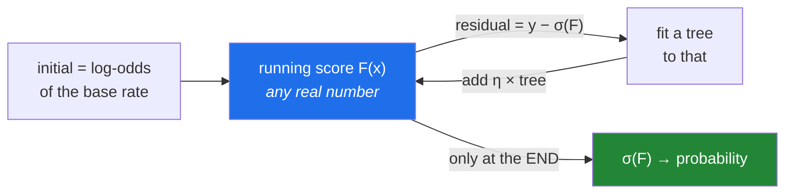

# Day 111 — Gradient Boosting classifier and regressor

**Phase 13 · Module 13** · ID: **ML-22** (the library implementations, losses, and what they actually predict)

> **Yesterday:** boosting built by hand, and the identity that residuals are the negative gradient.
> **Today:** the library versions, and the details a from-scratch loop skips. The one that surprises
> people: **a gradient boosting classifier does not predict probabilities.** It sums raw scores and
> squashes them at the end — and whether those come out calibrated is a real question, not an
> assumption.
> **Tomorrow:** XGBoost and early stopping.

```bash
./m start 111 && ./m scaffold 111
```

**Time:** 110 minutes. **Request budget:** 0 model calls.

---

## §1 The story

Day 110 built the regressor: predict the mean, fit residuals, add `η` times each. The classifier uses
**the same loop** — the only change is what "residual" means.



**The trees live in log-odds space, not probability space.** Each tree's output is added to a running
score `F(x)`, which is unbounded, and only the final sigmoid turns it into a probability. Three
consequences follow, and all three catch people:

- **`predict_proba` is a transformation of a sum**, so the individual trees are uninterpretable on
  their own — a leaf value of `+0.4` is 0.4 log-odds, not 40%.
- **The initial prediction is the log-odds of the base rate**, not 0.5. Starting at 0 wastes rounds
  climbing to the base rate, which matters on imbalanced data (Day 78).
- **Calibration is not guaranteed.** Day 101's question applies with force: boosting optimises log
  loss, which *should* calibrate, but early stopping and regularisation both distort it.

Then the practical half, which is where sklearn's two implementations diverge:

**`GradientBoostingRegressor` is exact and slow.** It considers every split point in every feature.
**`HistGradientBoostingRegressor` bins features into 256 buckets first**, which turns split-finding
from `O(n log n)` per feature into `O(bins)`. It is often 10–50× faster with essentially the same
accuracy, and it handles missing values natively. It is what XGBoost and LightGBM also do, so
understanding the binning today makes Day 112 mostly review.

And one loss worth meeting because it changes what you can promise: **quantile loss** predicts a
percentile rather than a mean, which is how you produce a prediction *interval* from a boosted model.

---

## §2 Setup — run this

```bash
mkdir -p days/day-111/lab
touch days/day-111/lab/gbm.py
```

`src/setu/ensembles.py` grows today. No new packages.

---

## §3 ML-22 — the library versions

`days/day-111/lab/gbm.py`:

```python
"""ML-22: the classifier, the histogram trick, and what boosting actually outputs."""

from __future__ import annotations

import time

import numpy as np
from sklearn.calibration import calibration_curve
from sklearn.ensemble import (
    GradientBoostingClassifier,
    GradientBoostingRegressor,
    HistGradientBoostingClassifier,
    HistGradientBoostingRegressor,
)
from sklearn.metrics import brier_score_loss, log_loss
from sklearn.model_selection import train_test_split
from sklearn.tree import DecisionTreeRegressor

from setu.arrays import make_rng


def classification_data(n=6_000, p=8, *, rate=0.5, seed=0):
    rng = make_rng(seed)
    x = rng.normal(0, 1, (n, p))
    z = np.log(rate / (1 - rate)) + x @ np.array([1.3, -1.0, 0.7, 0.4, 0, 0, 0, 0][:p])
    z += 0.8 * x[:, 0] * x[:, 1]
    return x, (rng.random(n) < 1 / (1 + np.exp(-z))).astype(int)


def the_classifier_is_the_same_loop() -> None:
    x, y = classification_data(n=3_000)
    x_test, y_test = classification_data(n=3_000, seed=99)

    base_rate = y.mean()
    score = np.full(len(y), np.log(base_rate / (1 - base_rate)))   # log-odds, not 0.5
    test_score = np.full(len(y_test), np.log(base_rate / (1 - base_rate)))
    eta = 0.1

    print(f"\n  base rate {base_rate:.4f} -> initial score "
          f"{np.log(base_rate / (1 - base_rate)):.4f} (log-odds)")
    print(f"\n  {'round':>6} {'train log loss':>16} {'score range':>22}")

    for round_number in range(1, 201):
        probability = 1 / (1 + np.exp(-score))
        residual = y - probability                    # the log-loss gradient (Day 110)
        tree = DecisionTreeRegressor(max_depth=3).fit(x, residual)
        score += eta * tree.predict(x)
        test_score += eta * tree.predict(x_test)

        if round_number in (1, 10, 50, 200):
            p = np.clip(1 / (1 + np.exp(-score)), 1e-15, 1 - 1e-15)
            loss = -(y * np.log(p) + (1 - y) * np.log(1 - p)).mean()
            print(f"  {round_number:>6} {loss:>16.5f} "
                  f"[{score.min():>8.3f}, {score.max():>7.3f}]")

    library = GradientBoostingClassifier(n_estimators=200, learning_rate=0.1,
                                         max_depth=3, random_state=0).fit(x, y)
    mine = 1 / (1 + np.exp(-test_score))
    print(f"\n  mine    test log loss: {log_loss(y_test, mine):.5f}")
    print(f"  sklearn test log loss: {log_loss(y_test, library.predict_proba(x_test)[:, 1]):.5f}")

    print("\n  Identical loop to Day 110's regressor. Only the residual changed:")
    print("    regressor  : y − prediction")
    print("    classifier : y − sigmoid(score)")
    print("\n  ⚠️ Note the score range: it grows well outside [0,1]. The trees live in")
    print("     LOG-ODDS space and only the final sigmoid makes a probability.")


def the_initial_prediction_matters() -> None:
    x, y = classification_data(n=4_000, rate=0.03)
    print(f"\n  imbalanced data: {y.mean():.1%} positive")

    for label, start in (("log-odds of base rate", np.log(0.03 / 0.97)), ("zero", 0.0)):
        score = np.full(len(y), start)
        losses = []
        for _ in range(30):
            probability = 1 / (1 + np.exp(-score))
            tree = DecisionTreeRegressor(max_depth=3).fit(x, y - probability)
            score += 0.1 * tree.predict(x)
            p = np.clip(1 / (1 + np.exp(-score)), 1e-15, 1 - 1e-15)
            losses.append(-(y * np.log(p) + (1 - y) * np.log(1 - p)).mean())
        print(f"    start at {label:<24} loss after 5: {losses[4]:.5f}  "
              f"after 30: {losses[29]:.5f}")

    print("\n  Starting at 0 means starting at p = 0.5 on data that is 3% positive.")
    print("  The first several rounds are spent climbing to the base rate — wasted")
    print("  capacity that should have gone on the actual signal.")
    print("\n  ⚠️ Every library does this correctly. A from-scratch loop is where it")
    print("     gets forgotten, and on imbalanced data it costs real rounds.")


def leaf_values_are_log_odds() -> None:
    x, y = classification_data(n=3_000)
    model = GradientBoostingClassifier(n_estimators=50, max_depth=2,
                                       random_state=0).fit(x, y)

    first_tree = model.estimators_[0, 0]
    leaves = first_tree.tree_.value.ravel()
    leaves = leaves[first_tree.tree_.children_left == -1]

    print(f"\n  first tree's leaf values: {np.round(leaves, 4).tolist()}")
    print(f"  these are LOG-ODDS adjustments, not probabilities")

    row = x[:1]
    raw = model.decision_function(row)[0]
    probability = model.predict_proba(row)[0, 1]
    print(f"\n  for one row:")
    print(f"    decision_function (raw score) = {raw:>8.4f}")
    print(f"    sigmoid of it                 = {1 / (1 + np.exp(-raw)):>8.4f}")
    print(f"    predict_proba                 = {probability:>8.4f}")

    print("\n  ⚠️ A leaf value of +0.4 means '+0.4 log-odds', which is a 1.49x change in")
    print("     the ODDS — not a 40% change in probability. Reading leaf values as")
    print("     probabilities is a real and common misreading (Day 99).")


def is_it_calibrated() -> None:
    x, y = classification_data(n=12_000)
    x_train, x_test, y_train, y_test = train_test_split(
        x, y, test_size=0.35, stratify=y, random_state=0
    )

    print(f"\n  {'model':<34} {'log loss':>10} {'Brier':>9} {'max |gap|':>11}")
    for label, model in (
        ("GB, 100 rounds", GradientBoostingClassifier(n_estimators=100, random_state=0)),
        ("GB, 1500 rounds (overfit)", GradientBoostingClassifier(n_estimators=1_500,
                                                                 random_state=0)),
        ("GB, depth 8", GradientBoostingClassifier(n_estimators=300, max_depth=8,
                                                   random_state=0)),
    ):
        model.fit(x_train, y_train)
        probability = model.predict_proba(x_test)[:, 1]
        observed, predicted = calibration_curve(y_test, probability, n_bins=10,
                                                strategy="quantile")
        gap = np.abs(observed - predicted).max()
        print(f"  {label:<34} {log_loss(y_test, probability):>10.4f} "
              f"{brier_score_loss(y_test, probability):>9.4f} {gap:>11.4f}")

    print("\n  Boosting optimises log loss, so a well-stopped model is usually well")
    print("  calibrated. But an OVERFITTED one is not — it becomes over-confident,")
    print("  pushing probabilities toward 0 and 1 that the data does not support.")
    print("\n  ⚠️ Day 101's rule stands: if you will use the probabilities (for a cost-based")
    print("     threshold, or for a decision), CHECK the calibration. Do not assume it.")


def the_histogram_trick() -> None:
    rng = make_rng(1)
    n, p = 60_000, 25
    x = rng.normal(0, 1, (n, p))
    y = x @ rng.normal(0, 1, p) + rng.normal(0, 1, n)

    print(f"\n  {n:,} rows x {p} features:")
    print(f"  {'implementation':<30} {'fit time':>10} {'test MSE':>10}")

    x_train, x_test, y_train, y_test = train_test_split(x, y, test_size=0.25,
                                                        random_state=0)
    for label, model in (
        ("GradientBoostingRegressor", GradientBoostingRegressor(n_estimators=100,
                                                                max_depth=3,
                                                                random_state=0)),
        ("HistGradientBoostingRegressor", HistGradientBoostingRegressor(max_iter=100,
                                                                        max_depth=3,
                                                                        random_state=0)),
    ):
        start = time.perf_counter()
        model.fit(x_train, y_train)
        elapsed = time.perf_counter() - start
        mse = ((model.predict(x_test) - y_test) ** 2).mean()
        print(f"  {label:<30} {elapsed:>9.2f}s {mse:>10.4f}")

    print("\n  Same accuracy, a fraction of the time. The trick: bin each feature into")
    print("  256 buckets ONCE, then split-finding is O(256) instead of O(n log n).")
    print("\n  The binning loses a little precision at split points and gains an enormous")
    print("  amount of speed — and acts as mild regularisation, because a split can only")
    print("  land on a bin edge.")
    print("\n  ⚠️ XGBoost and LightGBM (Days 112–113) do exactly this. Today's binning is")
    print("     most of what makes them fast; the rest is engineering.")


def missing_values_natively() -> None:
    rng = make_rng(2)
    n = 8_000
    x = rng.normal(0, 1, (n, 4))
    y = (x @ np.array([1.4, -1.0, 0.6, 0.0]) + rng.normal(0, 1, n) > 0).astype(int)

    x_missing = x.copy()
    x_missing[rng.random((n, 4)) < 0.15] = np.nan

    x_train, x_test, y_train, y_test = train_test_split(
        x_missing, y, test_size=0.3, stratify=y, random_state=0
    )

    hist = HistGradientBoostingClassifier(max_iter=150, random_state=0).fit(x_train, y_train)
    print(f"\n  15% missing, HistGradientBoosting handles it natively:")
    print(f"    accuracy = {hist.score(x_test, y_test):.4f}")

    try:
        GradientBoostingClassifier(n_estimators=50).fit(x_train, y_train)
    except ValueError as error:
        print(f"\n  GradientBoostingClassifier: {type(error).__name__} — "
              f"{str(error)[:60]}...")

    print("\n  The histogram version puts NaN in its own bin and LEARNS which side of")
    print("  each split it belongs on — per split, so a feature can send missing left")
    print("  in one tree and right in another.")
    print("\n  ⚠️ That is genuinely better than imputation when the missingness is")
    print("     informative (Day 76's MNAR). But it also means the model depends on")
    print("     the missingness PATTERN, so a change in your pipeline that fills NaNs")
    print("     upstream will silently change predictions.")


def quantile_loss_gives_an_interval() -> None:
    rng = make_rng(3)
    n = 4_000
    x = rng.uniform(-3, 3, n).reshape(-1, 1)
    spread = 0.3 + 0.5 * np.abs(x.ravel())              # heteroscedastic on purpose
    y = np.sin(1.5 * x.ravel()) + rng.normal(0, spread)

    x_train, x_test, y_train, y_test = train_test_split(x, y, test_size=0.3,
                                                        random_state=0)

    models = {}
    for quantile in (0.05, 0.5, 0.95):
        models[quantile] = GradientBoostingRegressor(
            loss="quantile", alpha=quantile, n_estimators=200, max_depth=3, random_state=0
        ).fit(x_train, y_train)

    low = models[0.05].predict(x_test)
    high = models[0.95].predict(x_test)
    coverage = ((y_test >= low) & (y_test <= high)).mean()

    print(f"\n  three models at quantiles 0.05, 0.5, 0.95:")
    print(f"    empirical coverage of the 5–95 band: {coverage:.4f}   (target 0.90)")
    print(f"    mean band width: {np.mean(high - low):.4f}")

    narrow = np.abs(x_test.ravel()) < 1
    print(f"    width where |x| < 1 : {np.mean((high - low)[narrow]):.4f}")
    print(f"    width where |x| >= 1: {np.mean((high - low)[~narrow]):.4f}")

    print("\n  The band WIDENS where the noise widens — a mean-predicting model cannot")
    print("  tell you that. This is how you get a prediction interval from a boosted model.")
    print("\n  ⚠️ Quantile crossing is possible: three independently fitted models can")
    print("     produce a 5th percentile above the 95th for some rows. Check for it.")


def what_boosting_still_cannot_do() -> None:
    rng = make_rng(4)
    x_train = rng.uniform(-2, 2, (2_000, 1))
    y_train = 3.0 * x_train.ravel() + rng.normal(0, 0.3, 2_000)

    model = GradientBoostingRegressor(n_estimators=300, random_state=0).fit(x_train, y_train)

    print(f"\n  trained on x in [−2, 2]:")
    print(f"    {'x':>6} {'truth':>8} {'boosted':>10}")
    for value in (2.0, 5.0, 20.0):
        prediction = model.predict([[value]])[0]
        print(f"    {value:>6.1f} {3.0 * value:>8.1f} {prediction:>10.3f}")

    print("\n  🚨 Flat beyond the training range, exactly like a Random Forest (Day 108).")
    print("     Boosting sums TREES, and a tree cannot extrapolate. The sequential")
    print("     mechanism changes nothing about that.")
    print("\n  If you need extrapolation, you need a model with a functional form —")
    print("  linear regression, or a tree ensemble on top of a linear baseline.")


if __name__ == "__main__":
    the_classifier_is_the_same_loop()
    the_initial_prediction_matters()
    leaf_values_are_log_odds()
    is_it_calibrated()
    the_histogram_trick()
    missing_values_natively()
    quantile_loss_gives_an_interval()
    what_boosting_still_cannot_do()
```

**Line by line:**

- `the_classifier_is_the_same_loop` — **the only change from Day 110 is the residual.** Regressor:
  `y − prediction`. Classifier: `y − sigmoid(score)`. And note the printed score range: it grows well
  outside `[0,1]`, because **the trees live in log-odds space** and only the final sigmoid makes a
  probability.
- `the_initial_prediction_matters` — starting at 0 means starting at `p = 0.5` on data that is 3%
  positive. **The first several rounds are spent climbing to the base rate**, which is capacity that
  should have gone on signal. Every library does this correctly; a from-scratch loop is where it gets
  forgotten.
- `leaf_values_are_log_odds` — **a leaf value of `+0.4` is 0.4 log-odds**, a 1.49× change in the odds,
  not a 40% change in probability. `decision_function` gives the raw score and `predict_proba` is its
  sigmoid; printing both makes the relationship concrete.
- `is_it_calibrated` — a well-stopped model is usually calibrated because boosting optimises log loss,
  but **an overfitted one becomes over-confident**, pushing probabilities toward 0 and 1 that the data
  does not support. Day 101's rule stands: **if you will use the probabilities, check.**
- `the_histogram_trick` — **bin each feature into 256 buckets once**, and split-finding becomes
  `O(256)` instead of `O(n log n)`. Same accuracy, a fraction of the time, plus mild regularisation
  because splits can only land on bin edges. **This is most of what makes XGBoost and LightGBM fast.**
- `missing_values_natively` — the histogram version puts NaN in its own bin and **learns which side of
  each split it belongs on, per split**. Genuinely better than imputation when missingness is
  informative (Day 76's MNAR) — but the model then **depends on the missingness pattern**, so an
  upstream change that fills NaNs will silently change predictions.
- `quantile_loss_gives_an_interval` — **the band widens where the noise widens**, which a
  mean-predicting model cannot tell you. That is how you get a prediction interval from a boosted
  model. And the caveat is real: three independently fitted quantile models can **cross**.
- `what_boosting_still_cannot_do` — flat beyond the training range, exactly like Day 108's forest.
  **Boosting sums trees, and a tree cannot extrapolate**; the sequential mechanism changes nothing
  about that.

---

## §4 Build brief

Extend `src/setu/ensembles.py`:

```python
def initial_score(y, *, loss: str = "squared") -> float:
    """TODO(me): the round-0 prediction, matched to the loss. PURE.

    - squared  -> mean(y)
    - absolute -> median(y)
    - log      -> log(p / (1 - p)) where p = mean(y), i.e. the base-rate LOG-ODDS
    - the log case must be clipped away from 0 and 1 (a single-class y is degenerate)
    - raise DataError if loss='log' and y is not binary, naming what was found
    - raise DataError on an empty y
    - the docstring must state that a wrong start costs rounds on imbalanced data (§3.2)
    """
    raise NotImplementedError


def boosted_scores_to_proba(scores):
    """TODO(me): sigmoid the raw score. PURE.

    - reuse Day 99's sigmoid; do NOT reimplement it (it is the stable version)
    - the docstring must say the input is LOG-ODDS, not a probability, and that a
      leaf value of 0.4 is an odds multiplier of exp(0.4), not 40% (§3.3)
    """
    raise NotImplementedError


def check_boosting_calibration(y_true, probability, *, n_bins: int = 10,
                               tolerance: float = 0.05) -> dict:
    """TODO(me): §3.4 — is this model's probability usable for a decision?

    {"max_gap", "mean_gap", "brier", "log_loss", "is_calibrated",
     "direction": "over-confident" | "under-confident" | "well calibrated",
     "warning": str | None}
    - use quantile-strategy bins so each bin has comparable support
    - direction: over-confident when predicted probabilities are further from the
      base rate than observed frequencies — that is the OVERFITTING signature (§3.4)
    - reuse Day 101's calibration_report rather than reimplementing the binning
    - the warning must say that a cost-based threshold (Day 100) REQUIRES calibration
    - raise DataError if probability is outside [0, 1]
    """
    raise NotImplementedError


def binning_summary(x, *, max_bins: int = 256) -> dict:
    """TODO(me): what the histogram trick does to your features. PURE-ish.

    {"n_features", "distinct_values": [...], "bins_used": [...],
     "features_unaffected": [...], "resolution_lost": [...], "note": str}
    - features_unaffected are those with fewer distinct values than max_bins — binning
      changes nothing for them
    - resolution_lost lists features where binning merges values that a split could
      otherwise have separated; report the ratio, not just a flag
    - the note must say binning also acts as MILD REGULARISATION (§3.5)
    - raise DataError if max_bins < 2
    """
    raise NotImplementedError


def quantile_band(models: dict, x, *, low: float = 0.05, high: float = 0.95) -> dict:
    """TODO(me): a prediction interval from quantile-loss models.

    {"low": ndarray, "median": ndarray, "high": ndarray, "width": ndarray,
     "n_crossings": int, "warnings": [...]}
    - models maps a quantile to a fitted model
    - n_crossings counts rows where low > high — independently fitted quantile models
      CAN cross, and silently returning a negative-width interval is worse than saying so
    - WARN when n_crossings > 0, naming the count and suggesting isotonic sorting
    - raise DataError if the required quantiles are missing from `models`
    """
    raise NotImplementedError


def band_coverage(y_true, low, high, *, nominal: float) -> dict:
    """TODO(me): does the band contain the truth as often as claimed? (Day 68's rule)

    {"nominal", "actual", "shortfall", "mean_width", "width_by_tercile": [...]}
    - width_by_tercile splits rows by predicted median and reports mean width in each,
      so a caller can SEE whether the band adapts to heteroscedasticity (§3.7)
    - shortfall is positive when actual < nominal — over-confident, the dangerous
      direction, exactly as on Day 68
    - raise DataError on a length mismatch, naming all three
    """
    raise NotImplementedError
```

- `initial_score` for the **log case being the base-rate log-odds** is §3.2 encoded. It is a one-line
  detail that costs real rounds on imbalanced data and is exactly what a hand-rolled loop omits.
- `quantile_band` **counting crossings** is the honest handling: independently fitted quantile models
  genuinely can produce `low > high`, and returning a negative-width interval silently is worse than
  reporting it.
- `check_boosting_calibration` reusing **Day 101's** binning keeps one implementation of the
  calibration curve, and the `direction` field is what distinguishes an overfitted booster from an
  underfitted one.

---

## §5 The eval that must be able to fail

Add to `tests/test_ensembles.py`:

```python
from setu.ensembles import (
    band_coverage,
    binning_summary,
    boosted_scores_to_proba,
    check_boosting_calibration,
    initial_score,
    quantile_band,
)


def test_the_squared_loss_starts_at_the_mean():
    y = np.array([1.0, 2.0, 3.0, 10.0])
    assert initial_score(y, loss="squared") == pytest.approx(4.0)


def test_the_absolute_loss_starts_at_the_median():
    """Robust to the outlier the mean chases."""
    y = np.array([1.0, 2.0, 3.0, 10.0])
    assert initial_score(y, loss="absolute") == pytest.approx(2.5)


def test_the_log_loss_starts_at_the_base_rate_log_odds():
    """Not zero — starting at p=0.5 on 3% data wastes rounds."""
    y = np.concatenate([np.ones(30), np.zeros(970)])
    assert initial_score(y, loss="log") == pytest.approx(np.log(0.03 / 0.97), abs=1e-6)


def test_the_log_start_recovers_the_base_rate():
    from setu.models import sigmoid

    y = np.concatenate([np.ones(120), np.zeros(880)])
    assert sigmoid(initial_score(y, loss="log")) == pytest.approx(y.mean(), abs=1e-9)


def test_a_single_class_target_does_not_produce_infinity():
    value = initial_score(np.ones(50), loss="log")
    assert np.isfinite(value)


def test_the_log_start_rejects_a_non_binary_target():
    with pytest.raises(DataError) as info:
        initial_score(np.array([0.0, 1.0, 2.0]), loss="log")
    assert "2" in str(info.value)


def test_initial_score_rejects_an_empty_target():
    with pytest.raises(DataError):
        initial_score(np.array([]), loss="squared")


def test_the_docstring_warns_about_imbalanced_starts():
    assert "imbalanc" in initial_score.__doc__.lower() or "round" in initial_score.__doc__.lower()


def test_scores_are_log_odds_not_probabilities():
    """A leaf value of 0.4 is an odds multiplier, not 40%."""
    scores = np.array([-3.0, 0.0, 0.4, 3.0])
    probability = boosted_scores_to_proba(scores)
    assert probability[1] == pytest.approx(0.5)
    assert probability[2] == pytest.approx(1 / (1 + np.exp(-0.4)))
    assert probability[2] != pytest.approx(0.4), "0.4 log-odds is not 0.4 probability"


def test_the_conversion_reuses_day_99s_sigmoid(monkeypatch):
    import setu.models as models

    calls = []
    original = models.sigmoid
    monkeypatch.setattr(models, "sigmoid",
                        lambda z: calls.append(1) or original(z))
    boosted_scores_to_proba(np.array([0.0, 1.0]))
    assert calls, "boosted_scores_to_proba reimplemented the sigmoid"


def test_the_conversion_docstring_says_log_odds():
    text = boosted_scores_to_proba.__doc__.lower()
    assert "log-odds" in text or "log odds" in text


def test_extreme_scores_do_not_overflow():
    values = boosted_scores_to_proba(np.array([-900.0, 900.0]))
    assert np.all(np.isfinite(values))


@pytest.fixture(scope="module")
def calibration_data():
    rng = make_rng(0)
    n = 12_000
    x = rng.normal(0, 1, (n, 6))
    z = x @ np.array([1.3, -1.0, 0.7, 0.4, 0.0, 0.0])
    return x, (rng.random(n) < 1 / (1 + np.exp(-z))).astype(int)


def test_a_well_stopped_booster_is_calibrated(calibration_data):
    from sklearn.ensemble import GradientBoostingClassifier
    from sklearn.model_selection import train_test_split

    x, y = calibration_data
    x_train, x_test, y_train, y_test = train_test_split(
        x, y, test_size=0.35, stratify=y, random_state=0
    )
    model = GradientBoostingClassifier(n_estimators=100, random_state=0).fit(x_train, y_train)
    result = check_boosting_calibration(y_test, model.predict_proba(x_test)[:, 1])
    assert result["is_calibrated"] is True
    assert result["direction"] == "well calibrated"


def test_an_overfitted_booster_becomes_over_confident(calibration_data):
    """The signature: probabilities pushed toward 0 and 1."""
    from sklearn.ensemble import GradientBoostingClassifier
    from sklearn.model_selection import train_test_split

    x, y = calibration_data
    x_train, x_test, y_train, y_test = train_test_split(
        x[:2_000], y[:2_000], test_size=0.4, stratify=y[:2_000], random_state=0
    )
    model = GradientBoostingClassifier(n_estimators=2_000, max_depth=6,
                                       random_state=0).fit(x_train, y_train)
    result = check_boosting_calibration(y_test, model.predict_proba(x_test)[:, 1])
    assert result["direction"] == "over-confident"
    assert result["warning"]


def test_the_calibration_warning_mentions_cost_based_thresholds(calibration_data):
    """Day 100's threshold arithmetic assumes calibrated probabilities."""
    from sklearn.ensemble import GradientBoostingClassifier
    from sklearn.model_selection import train_test_split

    x, y = calibration_data
    x_train, x_test, y_train, y_test = train_test_split(
        x[:2_000], y[:2_000], test_size=0.4, stratify=y[:2_000], random_state=0
    )
    model = GradientBoostingClassifier(n_estimators=2_000, max_depth=6,
                                       random_state=0).fit(x_train, y_train)
    warning = check_boosting_calibration(
        y_test, model.predict_proba(x_test)[:, 1]
    )["warning"].lower()
    assert "threshold" in warning or "cost" in warning


def test_calibration_reuses_day_101(monkeypatch, calibration_data):
    import setu.models as models

    calls = []
    original = models.calibration_report
    monkeypatch.setattr(models, "calibration_report",
                        lambda *a, **k: calls.append(1) or original(*a, **k))
    rng = make_rng(1)
    check_boosting_calibration((rng.random(500) < 0.5).astype(int),
                               rng.uniform(0.05, 0.95, 500))
    assert calls, "check_boosting_calibration reimplemented the calibration curve"


def test_calibration_rejects_impossible_probabilities():
    with pytest.raises(DataError):
        check_boosting_calibration(np.array([0, 1]), np.array([0.5, 1.4]))


def test_binning_leaves_low_cardinality_features_alone():
    """Binning changes nothing when there are fewer values than bins."""
    rng = make_rng(2)
    x = np.column_stack([rng.integers(0, 5, 2_000).astype(float),
                         rng.normal(0, 1, 2_000)])
    result = binning_summary(x, max_bins=256)
    assert 0 in result["features_unaffected"]
    assert 1 not in result["features_unaffected"]


def test_binning_reports_lost_resolution():
    rng = make_rng(3)
    x = rng.normal(0, 1, (50_000, 2))
    result = binning_summary(x, max_bins=64)
    assert result["resolution_lost"]
    assert all(bins <= 64 for bins in result["bins_used"])


def test_the_binning_note_mentions_regularisation():
    """Splits can only land on bin edges."""
    rng = make_rng(4)
    note = binning_summary(rng.normal(0, 1, (1_000, 2)))["note"].lower()
    assert "regularis" in note or "regulariz" in note


def test_binning_rejects_too_few_bins():
    rng = make_rng(5)
    with pytest.raises(DataError):
        binning_summary(rng.normal(0, 1, (100, 2)), max_bins=1)


def test_the_histogram_implementation_is_faster():
    """Same accuracy, a fraction of the time."""
    import time

    from sklearn.ensemble import (
        GradientBoostingRegressor,
        HistGradientBoostingRegressor,
    )

    rng = make_rng(6)
    n, p = 30_000, 20
    x = rng.normal(0, 1, (n, p))
    y = x @ rng.normal(0, 1, p) + rng.normal(0, 1, n)

    start = time.perf_counter()
    GradientBoostingRegressor(n_estimators=50, max_depth=3, random_state=0).fit(x, y)
    exact = time.perf_counter() - start

    start = time.perf_counter()
    HistGradientBoostingRegressor(max_iter=50, max_depth=3, random_state=0).fit(x, y)
    histogram = time.perf_counter() - start

    assert histogram < exact, "the histogram version should be faster at this size"


@pytest.fixture(scope="module")
def heteroscedastic():
    rng = make_rng(7)
    n = 3_000
    x = rng.uniform(-3, 3, n).reshape(-1, 1)
    spread = 0.3 + 0.5 * np.abs(x.ravel())
    return x, np.sin(1.5 * x.ravel()) + rng.normal(0, spread)


def _quantile_models(x, y):
    from sklearn.ensemble import GradientBoostingRegressor

    return {
        q: GradientBoostingRegressor(loss="quantile", alpha=q, n_estimators=150,
                                     max_depth=3, random_state=0).fit(x, y)
        for q in (0.05, 0.5, 0.95)
    }


def test_the_band_covers_the_truth_about_as_often_as_claimed(heteroscedastic):
    from sklearn.model_selection import train_test_split

    x, y = heteroscedastic
    x_train, x_test, y_train, y_test = train_test_split(x, y, test_size=0.3, random_state=0)
    band = quantile_band(_quantile_models(x_train, y_train), x_test)
    coverage = band_coverage(y_test, band["low"], band["high"], nominal=0.90)
    assert coverage["actual"] == pytest.approx(0.90, abs=0.06)


def test_the_band_widens_where_the_noise_widens(heteroscedastic):
    """A mean-predicting model cannot tell you this."""
    from sklearn.model_selection import train_test_split

    x, y = heteroscedastic
    x_train, x_test, y_train, y_test = train_test_split(x, y, test_size=0.3, random_state=0)
    band = quantile_band(_quantile_models(x_train, y_train), x_test)

    quiet = np.abs(x_test.ravel()) < 1
    assert band["width"][~quiet].mean() > band["width"][quiet].mean() * 1.3


def test_quantile_crossings_are_counted_not_hidden():
    """Independently fitted quantile models can cross."""
    class Fake:
        def __init__(self, values):
            self.values = values

        def predict(self, x):
            return self.values

    models = {0.05: Fake(np.array([1.0, 5.0])),
              0.5: Fake(np.array([2.0, 3.0])),
              0.95: Fake(np.array([3.0, 2.0]))}
    band = quantile_band(models, np.zeros((2, 1)))
    assert band["n_crossings"] == 1
    assert band["warnings"]


def test_a_clean_band_reports_no_crossings(heteroscedastic):
    from sklearn.model_selection import train_test_split

    x, y = heteroscedastic
    x_train, x_test, _, y_train = *train_test_split(x, y, test_size=0.3, random_state=0)[:2], None, None
    models = _quantile_models(x[:2_000], y[:2_000])
    band = quantile_band(models, x[2_000:])
    assert band["n_crossings"] == 0


def test_the_band_needs_the_requested_quantiles():
    class Fake:
        def predict(self, x):
            return np.zeros(len(x))

    with pytest.raises(DataError):
        quantile_band({0.5: Fake()}, np.zeros((3, 1)), low=0.05, high=0.95)


def test_coverage_reports_width_by_tercile(heteroscedastic):
    from sklearn.model_selection import train_test_split

    x, y = heteroscedastic
    x_train, x_test, y_train, y_test = train_test_split(x, y, test_size=0.3, random_state=0)
    band = quantile_band(_quantile_models(x_train, y_train), x_test)
    coverage = band_coverage(y_test, band["low"], band["high"], nominal=0.90)
    assert len(coverage["width_by_tercile"]) == 3


def test_under_coverage_is_reported_as_a_positive_shortfall():
    """Over-confidence is the dangerous direction (Day 68)."""
    rng = make_rng(8)
    y = rng.normal(0, 1, 2_000)
    result = band_coverage(y, np.full(2_000, -0.2), np.full(2_000, 0.2), nominal=0.90)
    assert result["actual"] < 0.90
    assert result["shortfall"] > 0


def test_coverage_rejects_a_length_mismatch():
    with pytest.raises(DataError):
        band_coverage(np.zeros(10), np.zeros(9), np.zeros(10), nominal=0.9)
```

**Line by line:**

- `test_the_log_loss_starts_at_the_base_rate_log_odds` with `test_the_log_start_recovers_the_base_rate`
  — **the day's real assessment**, and the pair is the point. The initial score must be the log-odds,
  and sigmoiding it must return the base rate exactly. Starting at zero is the omission a hand-rolled
  loop makes, and on 3%-positive data it burns rounds climbing to the base rate.
- `test_scores_are_log_odds_not_probabilities` — asserts `0.4` in score space is **not** `0.4` in
  probability space. That is the misreading §3.3 exists to prevent.
- `test_an_overfitted_booster_becomes_over_confident` — the direction matters, not just the gap. **An
  overfitted booster pushes probabilities toward 0 and 1** the data does not support, and detecting
  the *direction* is what tells you it is overfitting rather than underfitting.
- `test_the_calibration_warning_mentions_cost_based_thresholds` — connects to Day 100: the cost-optimal
  threshold formula **assumes calibrated probabilities**, so an uncalibrated model makes that
  arithmetic wrong in a way that looks fine.
- `test_quantile_crossings_are_counted_not_hidden` — a hand-built case where the 5th percentile exceeds
  the 95th. **Returning a negative-width interval silently is worse than reporting it**, and this uses
  fakes so the failure is guaranteed rather than hoped for.
- `test_the_band_widens_where_the_noise_widens` — asserts a 1.3× ratio between noisy and quiet regions.
  **That adaptivity is the whole reason to fit quantiles** rather than a mean plus a constant band.
- `test_the_conversion_reuses_day_99s_sigmoid` and `test_calibration_reuses_day_101` — two architecture
  tests. The stable sigmoid and the calibration binning each exist once, and a second copy would drift.
- `test_binning_leaves_low_cardinality_features_alone` — binning changes nothing for a feature with 5
  distinct values, and knowing which features are unaffected tells you where the speedup comes from.

```bash
uv run python -m pytest tests/test_ensembles.py -v
```

---

## §6 Request budget

| Resource | Spent today |
|---|---|
| LLM calls | **0** |
| Compute | ~60,000-row fits; the histogram comparison takes the longest |

---

## §7 Traps

- **Reading leaf values as probabilities.** They are log-odds adjustments.
- **Starting a classifier at 0 instead of the base-rate log-odds.** Wastes rounds.
- **Assuming a booster is calibrated.** Overfitting makes it over-confident.
- **A cost-based threshold on uncalibrated probabilities.** Day 100's arithmetic breaks.
- **`GradientBoosting*` on large data.** Use the histogram version.
- **Forgetting binning is mild regularisation.** It changes the model, not just the speed.
- **Filling NaNs upstream of a histogram model.** It learned the missingness pattern.
- **Independently fitted quantile models without a crossing check.** Negative widths.
- **A quantile band without a coverage check.** Day 68's rule applies unchanged.
- **Expecting boosting to extrapolate.** It sums trees; Day 108's limit is unchanged.
- **`GradientBoostingClassifier` with NaN input.** It raises; only the hist version handles it.

---

## §8 Verify before you code

Written **2026-08-21**:

- <https://scikit-learn.org/stable/modules/generated/sklearn.ensemble.HistGradientBoostingClassifier.html> —
  `max_bins`, native NaN handling, and `categorical_features`.
- <https://scikit-learn.org/stable/modules/ensemble.html#histogram-based-gradient-boosting> — the
  binning explanation from §3.5.
- <https://scikit-learn.org/stable/auto_examples/ensemble/plot_gradient_boosting_quantile.html> — the
  quantile band, including its own note on crossing.
- <https://scikit-learn.org/stable/modules/calibration.html> — and Day 101's material, which applies
  unchanged here.

---

## §9 Say it in an interview

> "The classifier is the same loop as the regressor — only the residual changes, from y-minus-
> prediction to y-minus-sigmoid-of-the-score. The detail that catches people is that the trees live in
> *log-odds* space: each tree's leaf value is added to an unbounded running score, and only the final
> sigmoid makes a probability. So a leaf value of 0.4 is an odds multiplier of about one-and-a-half,
> not forty per cent. Two practical things. The initial prediction has to be the log-odds of the base
> rate, not zero — on data that's three per cent positive, starting at p equals 0.5 burns your first
> several rounds just climbing to the base rate. And calibration isn't automatic: boosting optimises
> log loss so a well-stopped model usually is calibrated, but an overfitted one becomes over-confident
> and pushes probabilities toward zero and one, which quietly breaks any cost-based threshold you built
> on top. On speed, the histogram implementations bin each feature into 256 buckets once, so
> split-finding is constant-time per feature instead of n-log-n — that's most of what makes XGBoost and
> LightGBM fast, and it also acts as mild regularisation because splits can only land on bin edges."

---

## §10 Done when

Tick [`CHECKLIST.md`](CHECKLIST.md), then `./m check && ./m done 111`.
