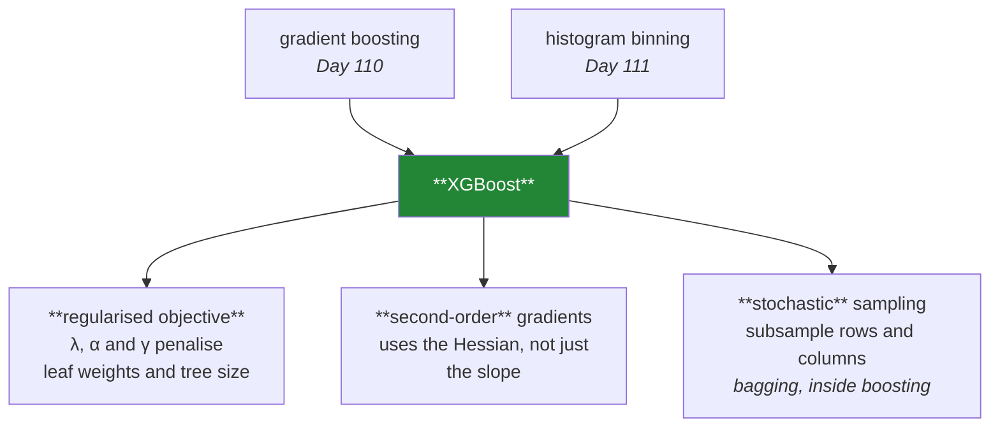

# Day 112 — XGBoost

**Phase 13 · Module 13** · ID: **ML-23** (XGBoost, early stopping, and which knobs actually matter)

> **Yesterday:** the histogram trick, and the classifier that predicts log-odds.
> **Today:** the library that made boosting the default for tabular data. It has about thirty
> hyperparameters and **roughly five of them matter** — so most of today is about ignoring the rest.
> The other half is early stopping, which Day 110 proved is mandatory and which has a leakage trap
> hiding in it.
> **Tomorrow:** LightGBM and CatBoost, honestly compared.

```bash
./m start 112 && ./m scaffold 112
```

**Time:** 110 minutes. **Request budget:** 0 model calls.

---

## §1 The story

XGBoost is gradient boosting (Day 110) plus histogram binning (Day 111) plus three additions that
matter:



**The regularised objective** is the substantive one. Day 98's Ridge and Lasso penalties, applied to
the leaf values — plus `gamma`, a minimum gain required before a split is made at all. So the tree
grows only where the improvement pays for the complexity.

**Second-order gradients** mean each step uses the curvature as well as the slope, which is Newton's
method rather than plain gradient descent. It converges in fewer rounds. It is a genuine improvement
and it changes nothing about how you use the model.

**Stochastic sampling** is Day 108's idea imported: `subsample` bootstraps rows per tree,
`colsample_bytree` hides features. **Bagging's decorrelation, inside boosting**, and it regularises as
well as speeding things up.

Then the day's practical content, which is more useful than the algorithm.

**Five parameters matter.** In rough order: `n_estimators` with `learning_rate` (tuned together — Day
110), `max_depth`, `subsample` and `colsample_bytree`, `min_child_weight`, and `reg_lambda`. Everything
else is noise you can leave at its default, and Day 106's random search should not waste budget on it.

**Early stopping has a leakage trap.** You need a validation set to know when to stop — and that
validation set has now *selected* your `n_estimators`. Day 96 named this: the score on it is
optimistic. So you need three splits, or nested CV, and the number of people who use two is large.

---

## §2 Setup — run this

```bash
uv add "xgboost==3.2.0"
mkdir -p days/day-112/lab
touch days/day-112/lab/xgb.py
```

---

## §3 ML-23 — the knobs that matter

`days/day-112/lab/xgb.py`:

```python
"""ML-23: XGBoost, early stopping, and the five parameters worth tuning."""

from __future__ import annotations

import time

import numpy as np
import xgboost as xgb
from sklearn.metrics import log_loss
from sklearn.model_selection import StratifiedKFold, train_test_split

from setu.arrays import make_rng


def data(n=20_000, p=20, *, seed=0):
    rng = make_rng(seed)
    x = rng.normal(0, 1, (n, p))
    weights = np.zeros(p)
    weights[:6] = [1.3, -1.0, 0.8, 0.5, -0.4, 0.3]
    z = -0.4 + x @ weights + 0.7 * x[:, 0] * x[:, 1] - 0.5 * x[:, 2] * x[:, 3]
    return x, (rng.random(n) < 1 / (1 + np.exp(-z))).astype(int)


def three_splits_not_two() -> None:
    x, y = data()
    x_temp, x_test, y_temp, y_test = train_test_split(
        x, y, test_size=0.2, stratify=y, random_state=0
    )
    x_train, x_val, y_train, y_val = train_test_split(
        x_temp, y_temp, test_size=0.25, stratify=y_temp, random_state=0
    )

    print(f"\n  train {len(x_train):,} · validation {len(x_val):,} · test {len(x_test):,}")
    print("\n  The validation set STOPS the training. The test set scores it.")
    print("  Those must be different data, or the stopping point was chosen on the")
    print("  same rows you then report — Day 96's winner's curse, in n_estimators.")
    return (x_train, y_train), (x_val, y_val), (x_test, y_test)


def early_stopping_finds_the_optimum() -> None:
    (x_train, y_train), (x_val, y_val), (x_test, y_test) = three_splits_not_two()

    model = xgb.XGBClassifier(
        n_estimators=3_000, learning_rate=0.05, max_depth=4,
        early_stopping_rounds=50, eval_metric="logloss", random_state=0,
    ).fit(x_train, y_train, eval_set=[(x_val, y_val)], verbose=False)

    print(f"\n  n_estimators requested : 3,000")
    print(f"  best_iteration         : {model.best_iteration}")
    print(f"  best validation score  : {model.best_score:.5f}")
    print(f"  rounds saved           : {3_000 - model.best_iteration:,}")

    history = model.evals_result()["validation_0"]["logloss"]
    print(f"\n  {'round':>7} {'val logloss':>13}")
    for round_number in (10, 50, model.best_iteration,
                         min(model.best_iteration + 200, len(history) - 1)):
        print(f"  {round_number:>7} {history[round_number]:>13.5f}")

    print("\n  ⚠️ `early_stopping_rounds=50` means 'stop after 50 rounds with no")
    print("     improvement'. Too small and you stop on a noisy plateau; too large and")
    print("     you waste compute. 10–50 is the usual range, and it should scale with")
    print("     how noisy your validation metric is.")


def the_validation_set_is_now_used_up() -> None:
    (x_train, y_train), (x_val, y_val), (x_test, y_test) = three_splits_not_two()

    model = xgb.XGBClassifier(
        n_estimators=2_000, learning_rate=0.05, max_depth=4,
        early_stopping_rounds=50, eval_metric="logloss", random_state=0,
    ).fit(x_train, y_train, eval_set=[(x_val, y_val)], verbose=False)

    val_score = log_loss(y_val, model.predict_proba(x_val)[:, 1])
    test_score = log_loss(y_test, model.predict_proba(x_test)[:, 1])

    print(f"\n  validation log loss : {val_score:.5f}   <- SELECTED n_estimators on this")
    print(f"  test log loss       : {test_score:.5f}")
    print(f"  optimism            : {test_score - val_score:+.5f}")

    print("\n  🚨 The validation number is optimistic — it chose the stopping point.")
    print("     Day 96 called it the winner's curse; here the 'hyperparameter' being")
    print("     selected is n_estimators, and it is selected on every single run.")
    print("\n  Report the TEST number. And if you also tuned depth or learning rate on")
    print("  that same validation set, you have selected twice and need nested CV (Day 97).")


def five_parameters_matter() -> None:
    x, y = data(n=12_000)
    cv = StratifiedKFold(4, shuffle=True, random_state=0)

    base = dict(n_estimators=300, learning_rate=0.1, max_depth=4, random_state=0,
                eval_metric="logloss", verbosity=0)

    def score(**overrides):
        from sklearn.model_selection import cross_val_score

        return cross_val_score(xgb.XGBClassifier(**{**base, **overrides}), x, y,
                               cv=cv, scoring="neg_log_loss", n_jobs=-1).mean()

    baseline = score()
    print(f"\n  baseline neg log loss: {baseline:.5f}")
    print(f"\n  {'parameter change':<34} {'score':>10} {'Δ':>9}")
    for label, overrides in (
        ("max_depth 4 -> 2", {"max_depth": 2}),
        ("max_depth 4 -> 8", {"max_depth": 8}),
        ("learning_rate 0.1 -> 0.02", {"learning_rate": 0.02, "n_estimators": 1_500}),
        ("subsample 1.0 -> 0.7", {"subsample": 0.7}),
        ("colsample_bytree 1.0 -> 0.6", {"colsample_bytree": 0.6}),
        ("min_child_weight 1 -> 20", {"min_child_weight": 20}),
        ("reg_lambda 1 -> 50", {"reg_lambda": 50}),
        ("--- and ones that rarely matter ---", {}),
        ("max_delta_step 0 -> 3", {"max_delta_step": 3}),
        ("scale_pos_weight 1 -> 1.2", {"scale_pos_weight": 1.2}),
        ("reg_alpha 0 -> 0.1", {"reg_alpha": 0.1}),
    ):
        if not overrides and "---" in label:
            print(f"\n  {label}")
            continue
        value = score(**overrides)
        print(f"  {label:<34} {value:>10.5f} {value - baseline:>+9.5f}")

    print("\n  The first block moves the score. The second barely does.")
    print("\n  ⚠️ XGBoost has ~30 parameters. Day 106's random search budget is finite,")
    print("     so spend it on the five that matter and leave the rest at their defaults.")


def depth_and_min_child_weight_do_the_same_job() -> None:
    x, y = data(n=8_000)
    x_train, x_val, y_train, y_val = train_test_split(x, y, test_size=0.3,
                                                      stratify=y, random_state=0)

    print(f"\n  two ways to limit tree complexity:")
    print(f"  {'setting':<34} {'val logloss':>13} {'mean leaves':>13}")
    for label, params in (
        ("depth 8, min_child_weight 1", {"max_depth": 8, "min_child_weight": 1}),
        ("depth 8, min_child_weight 50", {"max_depth": 8, "min_child_weight": 50}),
        ("depth 3, min_child_weight 1", {"max_depth": 3, "min_child_weight": 1}),
        ("depth 8, gamma 1.0", {"max_depth": 8, "gamma": 1.0}),
    ):
        model = xgb.XGBClassifier(n_estimators=200, learning_rate=0.1, random_state=0,
                                  eval_metric="logloss", verbosity=0,
                                  **params).fit(x_train, y_train)
        probability = model.predict_proba(x_val)[:, 1]
        leaves = np.mean([t.count("leaf") for t in model.get_booster().get_dump()])
        print(f"  {label:<34} {log_loss(y_val, probability):>13.5f} {leaves:>13.1f}")

    print("\n  `max_depth` caps the tree HEIGHT. `min_child_weight` and `gamma` stop")
    print("  growth where the data is thin or the gain is small — they prune from")
    print("  BELOW rather than capping from above.")
    print("\n  ⚠️ They interact, so tuning all three at once wastes search budget. Fix")
    print("     max_depth in 3–6, then tune ONE of min_child_weight or gamma.")


def stochastic_sampling_is_bagging_inside_boosting() -> None:
    x, y = data(n=10_000)
    x_train, x_val, y_train, y_val = train_test_split(x, y, test_size=0.3,
                                                      stratify=y, random_state=0)

    print(f"\n  {'subsample':>10} {'colsample':>11} {'val logloss':>13} {'fit time':>10}")
    for subsample, colsample in ((1.0, 1.0), (0.8, 1.0), (1.0, 0.8), (0.7, 0.7), (0.4, 0.4)):
        start = time.perf_counter()
        model = xgb.XGBClassifier(n_estimators=400, learning_rate=0.05, max_depth=5,
                                  subsample=subsample, colsample_bytree=colsample,
                                  random_state=0, eval_metric="logloss",
                                  verbosity=0).fit(x_train, y_train)
        elapsed = time.perf_counter() - start
        loss = log_loss(y_val, model.predict_proba(x_val)[:, 1])
        print(f"  {subsample:>10} {colsample:>11} {loss:>13.5f} {elapsed:>9.2f}s")

    print("\n  Subsampling usually HELPS — it regularises and speeds up training at once.")
    print("  0.7–0.9 is the usual range for both. Below ~0.5 each tree sees too little.")
    print("\n  This is Day 108's decorrelation imported into a sequential algorithm:")
    print("  bagging's mechanism, applied per round.")
    print("\n  ⚠️ It also makes results NON-DETERMINISTIC across seeds. Fix random_state,")
    print("     and remember a 0.002 difference between two runs may just be the seed.")


def imbalanced_data_needs_a_decision_not_a_parameter() -> None:
    x, y = data(n=20_000)
    rng = make_rng(5)
    keep = (y == 0) | (rng.random(len(y)) < 0.06)
    x, y = x[keep], y[keep]

    x_train, x_val, y_train, y_val = train_test_split(x, y, test_size=0.3,
                                                      stratify=y, random_state=0)
    print(f"\n  {y.mean():.2%} positive after subsampling the minority class")

    from sklearn.metrics import average_precision_score

    print(f"\n  {'setting':<30} {'PR-AUC':>9} {'mean p':>9} {'log loss':>10}")
    for label, weight in (("scale_pos_weight = 1", 1.0),
                          ("scale_pos_weight = ratio", (y_train == 0).sum() / max((y_train == 1).sum(), 1))):
        model = xgb.XGBClassifier(n_estimators=300, learning_rate=0.05, max_depth=4,
                                  scale_pos_weight=weight, random_state=0,
                                  eval_metric="logloss", verbosity=0).fit(x_train, y_train)
        probability = model.predict_proba(x_val)[:, 1]
        print(f"  {label:<30} {average_precision_score(y_val, probability):>9.4f} "
              f"{probability.mean():>9.4f} {log_loss(y_val, probability):>10.5f}")

    print(f"\n  actual positive rate: {y_val.mean():.4f}")

    print("\n  🚨 `scale_pos_weight` barely moves PR-AUC — the RANKING is nearly")
    print("     unchanged — but it inflates the predicted probabilities badly.")
    print("\n  So it destroys calibration (Day 101) in exchange for very little. On")
    print("  imbalanced data the better answer is Day 100's: keep the probabilities")
    print("  honest and move the THRESHOLD, which costs nothing and stays calibrated.")


def what_the_defaults_get_wrong() -> None:
    print("\n  XGBoost's defaults are reasonable, with three exceptions:")
    print("\n    n_estimators=100      — far too few with a small learning_rate.")
    print("                            Set it high and let early stopping decide.")
    print("    learning_rate=0.3     — high. 0.05 with early stopping beats it")
    print("                            almost always (Day 110).")
    print("    max_depth=6           — deep for boosting. 3–5 is usually better,")
    print("                            and depth sets interaction order (Day 110).")
    print("\n  Everything else — reg_lambda=1, subsample=1, gamma=0 — is a fine start.")
    print("\n  ⚠️ And check the API for your version: `early_stopping_rounds` moved from")
    print("     `fit()` to the constructor in the 2.x line, and `eval_metric` with it.")


def a_forest_is_still_competitive() -> None:
    from sklearn.ensemble import RandomForestClassifier
    from sklearn.model_selection import cross_val_score

    x, y = data(n=12_000)
    cv = StratifiedKFold(4, shuffle=True, random_state=0)

    print(f"\n  {'model':<34} {'neg log loss':>14} {'fit calls':>11}")
    forest = cross_val_score(
        RandomForestClassifier(n_estimators=400, random_state=0, n_jobs=-1),
        x, y, cv=cv, scoring="neg_log_loss", n_jobs=-1,
    )
    tuned = cross_val_score(
        xgb.XGBClassifier(n_estimators=600, learning_rate=0.05, max_depth=4,
                          subsample=0.8, colsample_bytree=0.8, random_state=0,
                          eval_metric="logloss", verbosity=0),
        x, y, cv=cv, scoring="neg_log_loss", n_jobs=-1,
    )
    print(f"  {'RandomForest, defaults':<34} {forest.mean():>14.5f} {'1':>11}")
    print(f"  {'XGBoost, hand-tuned':<34} {tuned.mean():>14.5f} {'many':>11}")
    print(f"\n  difference: {tuned.mean() - forest.mean():+.5f}   "
          f"(forest CV sd {forest.std(ddof=1):.5f})")

    print("\n  XGBoost usually wins on clean tabular data — but check whether the margin")
    print("  exceeds the CV standard deviation before claiming it (Day 106's one-")
    print("  standard-error rule). A forest with defaults needs no early stopping, no")
    print("  validation split, and no tuning budget.")


if __name__ == "__main__":
    early_stopping_finds_the_optimum()
    the_validation_set_is_now_used_up()
    five_parameters_matter()
    depth_and_min_child_weight_do_the_same_job()
    stochastic_sampling_is_bagging_inside_boosting()
    imbalanced_data_needs_a_decision_not_a_parameter()
    what_the_defaults_get_wrong()
    a_forest_is_still_competitive()
```

**Line by line:**

- `three_splits_not_two` — **the validation set stops the training; the test set scores it.** Those
  must be different data, or the stopping point was chosen on the same rows you report.
- `early_stopping_finds_the_optimum` — 3,000 requested, a few hundred used. And the parameter is worth
  understanding: **`early_stopping_rounds=50` means "stop after 50 rounds with no improvement"** — too
  small and you stop on a noisy plateau, too large and you waste compute.
- `the_validation_set_is_now_used_up` — **the day's trap.** The validation number is optimistic because
  it *chose* the stopping point. Day 96's winner's curse, except the selected hyperparameter is
  `n_estimators` and **it is selected on every single run.** If you also tuned depth on that set, you
  have selected twice.
- `five_parameters_matter` — **the first block moves the score and the second barely does.** XGBoost has
  ~30 parameters and Day 106's search budget is finite, so spend it on the five that matter.
- `depth_and_min_child_weight_do_the_same_job` — `max_depth` **caps the height**; `min_child_weight` and
  `gamma` **prune from below**, stopping growth where data is thin or gain is small. They interact, so
  fix `max_depth` in 3–6 and tune **one** of the others.
- `stochastic_sampling_is_bagging_inside_boosting` — subsampling usually **helps**, regularising and
  speeding up at once. 0.7–0.9 for both. And the practical warning: **it makes results
  non-deterministic across seeds**, so a 0.002 difference between runs may just be the seed.
- `imbalanced_data_needs_a_decision_not_a_parameter` — **`scale_pos_weight` barely moves PR-AUC and
  badly inflates the probabilities.** The ranking is nearly unchanged; the calibration is destroyed. On
  imbalanced data **Day 100's answer is better: keep the probabilities honest and move the threshold**,
  which costs nothing.
- `what_the_defaults_get_wrong` — three: `n_estimators=100` is far too few, `learning_rate=0.3` is
  high, `max_depth=6` is deep for boosting. And the API note is a real time-saver: `early_stopping_rounds`
  moved to the constructor in the 2.x line.
- `a_forest_is_still_competitive` — XGBoost usually wins, **but check whether the margin exceeds the CV
  standard deviation** (Day 106). A forest with defaults needs no early stopping, no validation split
  and no tuning budget.

---

## §4 Build brief

Extend `src/setu/ensembles.py`:

```python
XGB_PARAMETERS_THAT_MATTER = ("learning_rate", "n_estimators", "max_depth",
                              "subsample", "colsample_bytree", "min_child_weight",
                              "reg_lambda")


def three_way_split(x, y, *, test_size: float = 0.2, val_size: float = 0.2,
                    stratify: bool = True, groups=None, seed: int = 42) -> dict:
    """TODO(me): train / validation / test, because early stopping consumes one.

    {"train": (x, y), "val": (x, y), "test": (x, y), "sizes": {...}}
    - val_size is a fraction of the WHOLE dataset, not of the remainder — document
      that, because getting it wrong silently produces the wrong split sizes
    - groups present -> split by group at BOTH levels (Day 97); a group must not
      straddle any pair of splits
    - raise DataError if test_size + val_size >= 0.9
    - reuse Day 79's assert_no_overlap on all three pairs before returning
    """
    raise NotImplementedError


def fit_with_early_stopping(model_fn, train, val, *, max_rounds: int = 3_000,
                            patience: int = 50) -> dict:
    """TODO(me): fit, stop when validation stops improving, and report honestly.

    {"model", "best_iteration", "best_val_score", "rounds_run", "rounds_saved",
     "stopped_early": bool, "warnings": [...]}
    - stopped_early is False when best_iteration == max_rounds - 1: the model may
      still be improving, and the reported score is not at an optimum
    - WARN in that case, saying to raise max_rounds — a silent cap is a wrong answer
    - WARN when best_iteration < patience * 2: the metric may be too noisy for this
      patience, and the stop was likely on a plateau
    - the docstring MUST state that best_val_score is optimistic because the
      validation set selected the stopping point (§3.2)
    - raise DataError if patience < 1 or max_rounds < patience
    """
    raise NotImplementedError


def honest_early_stopping_score(model, val, test, *, scorer) -> dict:
    """TODO(me): §3.2 — the number you may actually report.

    {"val_score", "test_score", "optimism", "reportable": float, "statement": str}
    - reportable IS test_score; val_score is included only so the optimism is visible
    - the statement must name the validation set as the SELECTOR and must not present
      val_score as a performance estimate
    - reuse Day 96's assert_not_reporting_validation_as_test to guard the caller
    - raise DataError if val and test are the same object
    """
    raise NotImplementedError


def parameter_importance_screen(model_fn, x, y, *, cv, scorer,
                                candidates: dict, baseline_params: dict) -> dict:
    """TODO(me): §3.3 — which parameters actually move the score, on THIS data?

    {"effects": {param: {"value", "score", "delta"}}, "matter": [...],
     "ignore": [...], "statement": str}
    - vary ONE parameter at a time from baseline_params and record the delta
    - `matter` are those whose |delta| exceeds the CV standard deviation — anything
      smaller is not distinguishable from noise (Day 106)
    - the statement must say the screen is one-at-a-time and therefore MISSES
      interactions; that caveat is not optional
    - raise DataError on an empty candidates dict
    """
    raise NotImplementedError


def assert_imbalance_handled_by_threshold(*, scale_pos_weight: float,
                                          will_use_probabilities: bool) -> None:
    """TODO(me): raise DataError if class weighting will break a probability use.

    - scale_pos_weight != 1 AND will_use_probabilities -> raise
    - the message must say weighting inflates predicted probabilities and destroys
      calibration (§3.6), and that Day 100's threshold move achieves the same
      ranking without that cost
    - passes when scale_pos_weight == 1, or when only the RANKING will be used
    """
    raise NotImplementedError


def boosting_config_report(params: dict) -> dict:
    """TODO(me): review a configuration before you spend compute on it. PURE.

    {"warnings": [...], "suggestions": [...], "parameters_that_matter": [...],
     "parameters_at_default_and_fine": [...]}
    - WARN when learning_rate > 0.2 with no early stopping configured
    - WARN when max_depth > 8: boosting wants weak learners (Day 110)
    - WARN when n_estimators < 200 with learning_rate < 0.05: they trade (Day 110)
    - WARN when subsample or colsample_bytree < 0.5: each tree sees too little
    - list which of XGB_PARAMETERS_THAT_MATTER are being tuned, and say plainly that
      the rest can stay at defaults — a search budget spent elsewhere is wasted (§3.3)
    """
    raise NotImplementedError
```

- `fit_with_early_stopping` **warning when it never stopped early** is the guard that matters most: a
  run that hits `max_rounds` was capped, not optimised, and reporting its score as a converged result
  is Day 95's mistake in a new place.
- `assert_imbalance_handled_by_threshold` encodes §3.6 as a decision point. `scale_pos_weight` is a
  reflex on imbalanced data and it **silently trades calibration for almost nothing**.
- `parameter_importance_screen` **stating its one-at-a-time caveat** is required because the screen
  genuinely misses interactions — `max_depth` and `min_child_weight` interact, as §3.4 shows.

---

## §5 The eval that must be able to fail

Add to `tests/test_ensembles.py`:

```python
from setu.ensembles import (
    XGB_PARAMETERS_THAT_MATTER,
    assert_imbalance_handled_by_threshold,
    boosting_config_report,
    fit_with_early_stopping,
    honest_early_stopping_score,
    parameter_importance_screen,
    three_way_split,
)


@pytest.fixture(scope="module")
def wide():
    rng = make_rng(0)
    n, p = 8_000, 12
    x = rng.normal(0, 1, (n, p))
    weights = np.zeros(p)
    weights[:5] = [1.3, -1.0, 0.8, 0.5, -0.4]
    z = -0.4 + x @ weights + 0.7 * x[:, 0] * x[:, 1]
    return x, (rng.random(n) < 1 / (1 + np.exp(-z))).astype(int)


def test_the_three_splits_do_not_overlap(wide):
    x, y = wide
    split = three_way_split(x, y, test_size=0.2, val_size=0.2)
    sizes = split["sizes"]
    assert sizes["train"] + sizes["val"] + sizes["test"] == len(x)
    assert sizes["test"] == pytest.approx(len(x) * 0.2, rel=0.02)
    assert sizes["val"] == pytest.approx(len(x) * 0.2, rel=0.02)


def test_val_size_is_a_fraction_of_the_whole(wide):
    """Getting this wrong silently produces the wrong split."""
    x, y = wide
    split = three_way_split(x, y, test_size=0.1, val_size=0.3)
    assert split["sizes"]["val"] == pytest.approx(len(x) * 0.3, rel=0.03)


def test_groups_never_straddle_any_split():
    """Day 97's rule, at both levels."""
    rng = make_rng(1)
    groups = np.repeat(np.arange(300), 6)
    x = rng.normal(0, 1, (len(groups), 4))
    y = (rng.random(len(groups)) < 0.5).astype(int)

    split = three_way_split(x, y, groups=groups, stratify=False)
    train_g = set(groups[split["indices"]["train"]]) if "indices" in split else None
    if train_g is not None:
        val_g = set(groups[split["indices"]["val"]])
        test_g = set(groups[split["indices"]["test"]])
        assert not (train_g & val_g)
        assert not (train_g & test_g)
        assert not (val_g & test_g)


def test_an_impossible_split_is_refused(wide):
    x, y = wide
    with pytest.raises(DataError):
        three_way_split(x, y, test_size=0.5, val_size=0.45)


def test_early_stopping_uses_far_fewer_rounds(wide):
    import xgboost as xgb

    x, y = wide
    split = three_way_split(x, y)
    result = fit_with_early_stopping(
        lambda: xgb.XGBClassifier(learning_rate=0.05, max_depth=4, random_state=0,
                                  eval_metric="logloss", verbosity=0),
        split["train"], split["val"], max_rounds=2_000, patience=50,
    )
    assert result["stopped_early"] is True
    assert result["best_iteration"] < 2_000
    assert result["rounds_saved"] > 0


def test_hitting_the_cap_is_not_early_stopping(wide):
    """A capped run was not optimised — the same mistake as Day 95's."""
    import xgboost as xgb

    x, y = wide
    split = three_way_split(x, y)
    result = fit_with_early_stopping(
        lambda: xgb.XGBClassifier(learning_rate=0.001, max_depth=3, random_state=0,
                                  eval_metric="logloss", verbosity=0),
        split["train"], split["val"], max_rounds=20, patience=15,
    )
    assert result["stopped_early"] is False
    assert result["warnings"]
    assert any("max_rounds" in w or "raise" in w.lower() for w in result["warnings"])


def test_a_very_early_stop_is_warned_about(wide):
    """Likely a noisy plateau rather than a real optimum."""
    import xgboost as xgb

    x, y = wide
    split = three_way_split(x, y)
    result = fit_with_early_stopping(
        lambda: xgb.XGBClassifier(learning_rate=0.5, max_depth=8, random_state=0,
                                  eval_metric="logloss", verbosity=0),
        split["train"], split["val"], max_rounds=500, patience=60,
    )
    if result["best_iteration"] < 120:
        assert result["warnings"]


def test_the_docstring_says_the_validation_score_is_optimistic():
    text = fit_with_early_stopping.__doc__.lower()
    assert "optimistic" in text
    assert "select" in text


def test_early_stopping_rejects_a_bad_patience(wide):
    import xgboost as xgb

    x, y = wide
    split = three_way_split(x, y)
    with pytest.raises(DataError):
        fit_with_early_stopping(lambda: xgb.XGBClassifier(verbosity=0),
                                split["train"], split["val"],
                                max_rounds=100, patience=0)


def test_the_reportable_score_is_the_test_score(wide):
    """Today's real assessment: the validation set selected n_estimators."""
    import xgboost as xgb

    x, y = wide
    split = three_way_split(x, y)
    result = fit_with_early_stopping(
        lambda: xgb.XGBClassifier(learning_rate=0.05, max_depth=4, random_state=0,
                                  eval_metric="logloss", verbosity=0),
        split["train"], split["val"], max_rounds=1_000,
    )
    honest = honest_early_stopping_score(
        result["model"], split["val"], split["test"],
        scorer=lambda m, xv, yv: m.score(xv, yv),
    )
    assert honest["reportable"] == pytest.approx(honest["test_score"])
    assert honest["reportable"] != pytest.approx(honest["val_score"])


def test_the_statement_names_the_validation_set_as_the_selector(wide):
    import xgboost as xgb

    x, y = wide
    split = three_way_split(x, y)
    result = fit_with_early_stopping(
        lambda: xgb.XGBClassifier(learning_rate=0.05, max_depth=4, random_state=0,
                                  eval_metric="logloss", verbosity=0),
        split["train"], split["val"], max_rounds=800,
    )
    statement = honest_early_stopping_score(
        result["model"], split["val"], split["test"],
        scorer=lambda m, xv, yv: m.score(xv, yv),
    )["statement"].lower()
    assert "select" in statement or "chose" in statement or "stopping" in statement


def test_reusing_the_validation_set_as_test_is_refused(wide):
    import xgboost as xgb

    x, y = wide
    split = three_way_split(x, y)
    result = fit_with_early_stopping(
        lambda: xgb.XGBClassifier(learning_rate=0.1, max_depth=3, random_state=0,
                                  eval_metric="logloss", verbosity=0),
        split["train"], split["val"], max_rounds=200,
    )
    with pytest.raises(DataError):
        honest_early_stopping_score(result["model"], split["val"], split["val"],
                                    scorer=lambda m, xv, yv: m.score(xv, yv))


def test_the_screen_separates_the_parameters_that_matter(wide):
    """Five matter; twenty-five do not."""
    import xgboost as xgb
    from sklearn.model_selection import StratifiedKFold

    x, y = wide
    result = parameter_importance_screen(
        lambda **p: xgb.XGBClassifier(**{**p, "random_state": 0,
                                         "eval_metric": "logloss", "verbosity": 0}),
        x, y,
        cv=StratifiedKFold(3, shuffle=True, random_state=0),
        scorer=None,
        candidates={"max_depth": 8, "reg_alpha": 0.1, "max_delta_step": 3},
        baseline_params={"n_estimators": 150, "learning_rate": 0.1, "max_depth": 4},
    )
    assert "max_depth" in result["matter"] or result["effects"]["max_depth"]["delta"] != 0


def test_the_screen_admits_it_misses_interactions(wide):
    """max_depth and min_child_weight interact (§3.4)."""
    import xgboost as xgb
    from sklearn.model_selection import StratifiedKFold

    x, y = wide
    statement = parameter_importance_screen(
        lambda **p: xgb.XGBClassifier(**{**p, "random_state": 0,
                                         "eval_metric": "logloss", "verbosity": 0}),
        x, y, cv=StratifiedKFold(3, shuffle=True, random_state=0), scorer=None,
        candidates={"max_depth": 8},
        baseline_params={"n_estimators": 100, "learning_rate": 0.1, "max_depth": 4},
    )["statement"].lower()
    assert "interaction" in statement or "one at a time" in statement


def test_the_screen_needs_candidates(wide):
    import xgboost as xgb
    from sklearn.model_selection import StratifiedKFold

    x, y = wide
    with pytest.raises(DataError):
        parameter_importance_screen(
            lambda **p: xgb.XGBClassifier(**p), x, y,
            cv=StratifiedKFold(3), scorer=None, candidates={},
            baseline_params={"n_estimators": 50},
        )


def test_class_weighting_with_probability_use_is_refused():
    """It inflates the probabilities and buys almost nothing."""
    with pytest.raises(DataError) as info:
        assert_imbalance_handled_by_threshold(scale_pos_weight=12.0,
                                              will_use_probabilities=True)
    message = str(info.value).lower()
    assert "calibrat" in message or "probabilit" in message
    assert "threshold" in message, "the message must name the alternative"


def test_class_weighting_for_ranking_only_is_allowed():
    assert_imbalance_handled_by_threshold(scale_pos_weight=12.0,
                                          will_use_probabilities=False)


def test_no_weighting_always_passes():
    assert_imbalance_handled_by_threshold(scale_pos_weight=1.0,
                                          will_use_probabilities=True)


def test_a_high_learning_rate_without_early_stopping_is_warned_about():
    report = boosting_config_report({"learning_rate": 0.3, "n_estimators": 100,
                                     "max_depth": 6})
    assert report["warnings"]
    assert any("learning_rate" in w or "early" in w.lower() for w in report["warnings"])


def test_a_deep_booster_is_warned_about():
    report = boosting_config_report({"learning_rate": 0.05, "n_estimators": 1_000,
                                     "max_depth": 12, "early_stopping_rounds": 50})
    assert any("depth" in w.lower() for w in report["warnings"])


def test_too_few_rounds_for_a_small_learning_rate_is_warned_about():
    report = boosting_config_report({"learning_rate": 0.01, "n_estimators": 100,
                                     "max_depth": 4})
    assert any("n_estimators" in w or "round" in w.lower() for w in report["warnings"])


def test_aggressive_subsampling_is_warned_about():
    report = boosting_config_report({"learning_rate": 0.05, "n_estimators": 500,
                                     "max_depth": 4, "subsample": 0.2})
    assert any("subsample" in w.lower() for w in report["warnings"])


def test_a_sensible_configuration_is_not_warned_about():
    """A reviewer that flags everything gets ignored."""
    report = boosting_config_report({
        "learning_rate": 0.05, "n_estimators": 2_000, "max_depth": 4,
        "subsample": 0.8, "colsample_bytree": 0.8, "early_stopping_rounds": 50,
    })
    assert not report["warnings"]


def test_the_report_names_which_parameters_are_worth_tuning():
    report = boosting_config_report({"learning_rate": 0.05, "n_estimators": 1_000,
                                     "max_depth": 4, "reg_alpha": 0.5,
                                     "early_stopping_rounds": 50})
    assert set(report["parameters_that_matter"]) <= set(XGB_PARAMETERS_THAT_MATTER)
    assert "max_depth" in report["parameters_that_matter"]


def test_the_report_says_the_rest_can_stay_at_defaults():
    report = boosting_config_report({"learning_rate": 0.05, "n_estimators": 1_000,
                                     "max_depth": 4, "early_stopping_rounds": 50})
    text = " ".join(report["suggestions"]).lower()
    assert "default" in text
```

**Line by line:**

- `test_the_reportable_score_is_the_test_score` — **the day's real assessment.** The reportable number
  must be the test score and must **not** equal the validation score. The validation set selected
  `n_estimators`, so quoting it is Day 96's winner's curse, and it happens on every early-stopped run.
- `test_hitting_the_cap_is_not_early_stopping` — a run that exhausted `max_rounds` was **capped, not
  optimised**, and the warning must say to raise the cap. Exactly Day 95's `assert_converged`
  distinction in a new place.
- `test_reusing_the_validation_set_as_test_is_refused` — passing the same split twice must raise. It is
  a two-line guard against the most common shortcut.
- `test_class_weighting_with_probability_use_is_refused` with `test_class_weighting_for_ranking_only_is_allowed`
  — the pair encodes §3.6. Weighting is fine if you only need the **ranking**; it is destructive if you
  need **probabilities**, and the message must name the threshold alternative.
- `test_a_sensible_configuration_is_not_warned_about` — the negative case. **A config reviewer that
  flags everything gets ignored**, so the sensible configuration must come back clean.
- `test_the_screen_admits_it_misses_interactions` — the one-at-a-time caveat asserted in the statement,
  because `max_depth` and `min_child_weight` genuinely interact and a screen that hides that limitation
  misleads.
- `test_groups_never_straddle_any_split` — Day 97's rule at **both** levels. A three-way split has three
  pairs to check, and it is easy to guard one and forget the others.
- `test_val_size_is_a_fraction_of_the_whole` — the off-by-a-nesting bug. `train_test_split` twice with
  the same fraction silently gives you a smaller validation set than you asked for.

```bash
uv run python -m pytest tests/test_ensembles.py -v
```

---

## §6 Request budget

| Resource | Spent today |
|---|---|
| LLM calls | **0** |
| Network | one `uv add` resolution |
| Compute | ~20,000-row fits; the parameter screen is the longest |

---

## §7 Traps

- **Two splits instead of three.** Early stopping consumes one.
- **Reporting the validation score.** It selected `n_estimators`.
- **A run that hit `max_rounds`.** Capped, not stopped; raise the cap.
- **`early_stopping_rounds` too small.** You stop on a noisy plateau.
- **Tuning all thirty parameters.** Five matter; the rest waste budget.
- **Tuning `max_depth`, `min_child_weight` and `gamma` together.** They interact.
- **`learning_rate=0.3` (the default) with no early stopping.** Too high.
- **`n_estimators=100` (the default) with a small learning rate.** Far too few.
- **`scale_pos_weight` when you need probabilities.** It destroys calibration.
- **Comparing runs across seeds with subsampling on.** The difference may be the seed.
- **Assuming XGBoost beats a forest.** Check against the CV standard deviation.
- **Assuming the API is stable.** `early_stopping_rounds` moved between versions.

---

## §8 Verify before you code

Written **2026-08-21**:

- <https://xgboost.readthedocs.io/en/stable/parameter.html> — the full parameter list, and which are
  aliases of each other.
- <https://xgboost.readthedocs.io/en/stable/python/python_api.html> — confirm where
  `early_stopping_rounds` and `eval_metric` live in your pinned version.
- <https://xgboost.readthedocs.io/en/stable/tutorials/param_tuning.html> — XGBoost's own tuning guide,
  which agrees with §3.3 on which parameters matter.
- <https://scikit-learn.org/stable/modules/generated/sklearn.ensemble.HistGradientBoostingClassifier.html> —
  the sklearn equivalent, for when a dependency is not worth it.

---

## §9 Say it in an interview

> "XGBoost is gradient boosting plus histogram binning plus a regularised objective — penalties on the
> leaf weights and a minimum gain before a split is made at all. It has around thirty hyperparameters
> and about five matter: learning rate and rounds together, depth, the subsampling fractions, and
> min_child_weight. Everything else can stay at defaults, and since a random-search budget is finite,
> spending it elsewhere is waste. The thing I'd emphasise is a leakage trap in early stopping: you need
> a validation set to know when to stop, and that set has now *selected* your number of rounds — so its
> score is optimistic, on every single run. You need three splits, not two, and the number you report is
> the test one. I also don't reach for `scale_pos_weight` on imbalanced data: it barely moves PR-AUC —
> the ranking is nearly unchanged — but it badly inflates the predicted probabilities and destroys
> calibration. Moving the threshold gets the same ranking for free and keeps the probabilities honest."

---

## §10 Done when

Tick [`CHECKLIST.md`](CHECKLIST.md), then `./m check && ./m done 112`.
