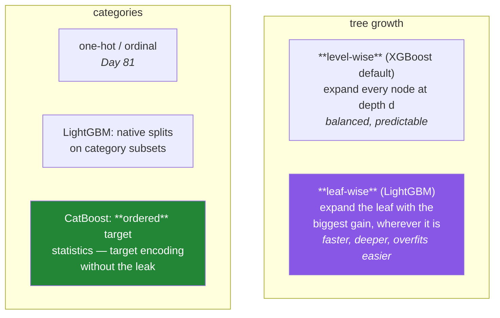

# Day 113 — LightGBM and CatBoost

**Phase 13 · Module 13** · ID: **ML-24** (leaf-wise growth, ordered target statistics, and how to compare fairly)

> **Yesterday:** XGBoost, and the five parameters that matter.
> **Today:** the two libraries that compete with it — and the more valuable skill, which is **running
> a comparison you would defend.** Most published boosting benchmarks are unfair in one of three
> specific ways, and today you build a harness that avoids all three.
> **Tomorrow:** SHAP, and ADR-008.

```bash
./m start 113 && ./m scaffold 113
```

**Time:** 110 minutes. **Request budget:** 0 model calls.

---

## §1 The story

Three libraries, one algorithm. What differs is how the tree grows and how categories are handled.



**Leaf-wise growth** is LightGBM's main idea. Instead of expanding a whole level, expand whichever
leaf promises the largest gain. For a fixed number of leaves that finds a lower loss faster — and it
produces deep, unbalanced trees, so `num_leaves` becomes the capacity parameter and `max_depth`
becomes almost decorative. **Tuning it like XGBoost is the most common LightGBM mistake.**

**Ordered target statistics** is CatBoost's, and it is the more interesting idea. Day 81 established
that target encoding leaks: using a category's mean target includes the current row's own target.
CatBoost's answer is to compute each row's encoding using **only rows that came before it** in a
random permutation — so no row ever sees its own target. It is target encoding made safe, built into
the algorithm.

Then the day's real content. **A boosting comparison is unfair in three standard ways:**

1. **Unequal tuning budget.** Tuning one library and using another's defaults measures your effort,
   not the libraries.
2. **Different early-stopping treatment.** One stopped optimally, the other ran a fixed 100 rounds.
3. **Reporting a selected score.** Day 112's trap, applied to whichever library got luckier on the
   validation split.

And there is a fourth that is specific to today: **timing without controlling threads.** One library
defaulting to all cores and another to one makes the speed comparison meaningless.

---

## §2 Setup — run this

```bash
uv add "lightgbm==4.9.0" "catboost==1.2.9"
mkdir -p days/day-113/lab reports
touch days/day-113/lab/compare.py
```

---

## §3 ML-24 — comparing fairly

`days/day-113/lab/compare.py`:

```python
"""ML-24: leaf-wise growth, ordered encoding, and a comparison you would defend."""

from __future__ import annotations

import time

import numpy as np
import pandas as pd
from sklearn.metrics import log_loss
from sklearn.model_selection import train_test_split

from setu.arrays import make_rng

THREADS = 4          # fixed for EVERY library — see §3.6


def data(n=30_000, *, seed=0, with_categories=True):
    rng = make_rng(seed)
    numeric = rng.normal(0, 1, (n, 10))
    weights = np.zeros(10)
    weights[:5] = [1.2, -0.9, 0.7, 0.5, -0.4]
    z = -0.3 + numeric @ weights + 0.6 * numeric[:, 0] * numeric[:, 1]

    frame = pd.DataFrame(numeric, columns=[f"num_{i}" for i in range(10)])
    if with_categories:
        # a high-cardinality category with real signal — the CatBoost case
        category = rng.integers(0, 400, n)
        effect = rng.normal(0, 0.8, 400)[category]
        z += effect
        frame["cat_high"] = pd.Categorical(category)
        frame["cat_low"] = pd.Categorical(rng.integers(0, 5, n))
    return frame, (rng.random(n) < 1 / (1 + np.exp(-z))).astype(int)


def leaf_wise_versus_level_wise() -> None:
    import lightgbm as lgb
    import xgboost as xgb

    frame, y = data(with_categories=False)
    x_train, x_val, y_train, y_val = train_test_split(frame, y, test_size=0.3,
                                                      stratify=y, random_state=0)

    print(f"\n  same leaf budget, two growth strategies:")
    print(f"  {'library':<28} {'max_depth':>10} {'num_leaves':>11} {'val logloss':>13}")

    for depth in (3, 6, 10):
        model = xgb.XGBClassifier(n_estimators=200, learning_rate=0.05, max_depth=depth,
                                  n_jobs=THREADS, random_state=0, eval_metric="logloss",
                                  verbosity=0).fit(x_train, y_train)
        loss = log_loss(y_val, model.predict_proba(x_val)[:, 1])
        print(f"  {'XGBoost (level-wise)':<28} {depth:>10} {2 ** depth:>11} {loss:>13.5f}")

    for leaves in (8, 64, 1_024):
        model = lgb.LGBMClassifier(n_estimators=200, learning_rate=0.05,
                                   num_leaves=leaves, n_jobs=THREADS, random_state=0,
                                   verbose=-1).fit(x_train, y_train)
        loss = log_loss(y_val, model.predict_proba(x_val)[:, 1])
        print(f"  {'LightGBM (leaf-wise)':<28} {'—':>10} {leaves:>11} {loss:>13.5f}")

    print("\n  Level-wise expands EVERY node at depth d, so a depth-6 tree has up to 64")
    print("  leaves spread evenly. Leaf-wise expands whichever leaf promises the most")
    print("  gain, so 64 leaves may sit 20 levels deep along one branch.")
    print("\n  🚨 Therefore `num_leaves` is LightGBM's capacity parameter, and max_depth")
    print("     is almost decorative. Setting num_leaves=1024 'because max_depth was 10")
    print("     in XGBoost' is the most common LightGBM mistake — that tree is far")
    print("     deeper and far more prone to overfitting than the XGBoost one was.")
    print("\n  Rule of thumb: num_leaves < 2^max_depth, and start around 31 (the default).")


def leaf_wise_overfits_on_small_data() -> None:
    import lightgbm as lgb

    frame, y = data(n=1_200, with_categories=False)
    x_train, x_val, y_train, y_val = train_test_split(frame, y, test_size=0.35,
                                                      stratify=y, random_state=0)

    print(f"\n  only {len(x_train)} training rows:")
    print(f"  {'num_leaves':>11} {'min_child_samples':>19} {'train':>9} {'val':>9}")
    for leaves, min_samples in ((31, 20), (255, 20), (255, 5), (255, 100)):
        model = lgb.LGBMClassifier(n_estimators=200, learning_rate=0.05,
                                   num_leaves=leaves, min_child_samples=min_samples,
                                   n_jobs=THREADS, random_state=0,
                                   verbose=-1).fit(x_train, y_train)
        train = log_loss(y_train, model.predict_proba(x_train)[:, 1])
        val = log_loss(y_val, model.predict_proba(x_val)[:, 1])
        print(f"  {leaves:>11} {min_samples:>19} {train:>9.5f} {val:>9.5f}")

    print("\n  Leaf-wise growth chases the largest gain, which on small data means")
    print("  chasing noise into a deep narrow branch.")
    print("\n  ⚠️ `min_child_samples` is the brake that matters — it stops a leaf being")
    print("     created from a handful of rows. On small data raise it before you")
    print("     lower num_leaves.")


def native_categorical_handling() -> None:
    import lightgbm as lgb

    frame, y = data(n=20_000)
    x_train, x_val, y_train, y_val = train_test_split(frame, y, test_size=0.3,
                                                      stratify=y, random_state=0)

    print(f"\n  `cat_high` has {frame['cat_high'].nunique()} levels with real signal:")

    one_hot_train = pd.get_dummies(x_train, columns=["cat_high", "cat_low"])
    one_hot_val = pd.get_dummies(x_val, columns=["cat_high", "cat_low"])
    one_hot_val = one_hot_val.reindex(columns=one_hot_train.columns, fill_value=0)

    print(f"    one-hot widens {x_train.shape[1]} columns to {one_hot_train.shape[1]}")

    start = time.perf_counter()
    wide = lgb.LGBMClassifier(n_estimators=200, learning_rate=0.05, n_jobs=THREADS,
                              random_state=0, verbose=-1).fit(one_hot_train, y_train)
    wide_time = time.perf_counter() - start

    start = time.perf_counter()
    native = lgb.LGBMClassifier(n_estimators=200, learning_rate=0.05, n_jobs=THREADS,
                                random_state=0, verbose=-1).fit(x_train, y_train)
    native_time = time.perf_counter() - start

    print(f"\n  {'encoding':<20} {'columns':>9} {'val logloss':>13} {'fit time':>10}")
    print(f"  {'one-hot':<20} {one_hot_train.shape[1]:>9} "
          f"{log_loss(y_val, wide.predict_proba(one_hot_val)[:, 1]):>13.5f} "
          f"{wide_time:>9.2f}s")
    print(f"  {'native categorical':<20} {x_train.shape[1]:>9} "
          f"{log_loss(y_val, native.predict_proba(x_val)[:, 1]):>13.5f} "
          f"{native_time:>9.2f}s")

    print("\n  A one-hot split can only ask 'is it category 37?'. A native categorical")
    print("  split can ask 'is it in {3, 17, 88, 204}?' — one split does the work of many.")
    print("\n  ⚠️ It requires a pandas `category` dtype (Day 34), and the categories must")
    print("     match between train and predict. A level unseen in training is handled,")
    print("     but a DIFFERENT dtype silently falls back to numeric — check it.")


def catboost_ordered_encoding() -> None:
    print("\n  Day 81 established the target-encoding leak:")
    print("    encode category c as mean(y | c) — but that mean INCLUDES this row's y.")
    print("    On a category with one row, the encoding IS the target.")

    rng = make_rng(3)
    n = 4_000
    category = rng.integers(0, 1_500, n)          # many near-unique categories
    y = (rng.random(n) < 0.5).astype(int)          # NO real signal

    naive = np.array([y[category == c].mean() for c in category])
    print(f"\n  naive target encoding on PURE NOISE:")
    print(f"    correlation of the encoding with y: {np.corrcoef(naive, y)[0, 1]:.4f}")
    print("    🚨 a feature perfectly correlated with the target, built from noise")

    order = rng.permutation(n)
    ordered = np.full(n, y.mean())
    seen_sum, seen_count = {}, {}
    for position in order:
        c = category[position]
        if c in seen_count and seen_count[c] > 0:
            ordered[position] = seen_sum[c] / seen_count[c]
        seen_sum[c] = seen_sum.get(c, 0.0) + y[position]
        seen_count[c] = seen_count.get(c, 0) + 1

    print(f"\n  ORDERED encoding — each row uses only rows BEFORE it in a permutation:")
    print(f"    correlation of the encoding with y: {np.corrcoef(ordered, y)[0, 1]:.4f}")
    print("    ✅ near zero, which is correct — there was no signal to find")

    print("\n  That is CatBoost's central idea: target encoding where no row can ever")
    print("  see its own target. It averages over several permutations to reduce the")
    print("  variance that a single ordering introduces.")
    print("\n  ⚠️ It is not magic — with genuinely predictive high-cardinality categories")
    print("     it helps a lot; with none, it correctly finds nothing.")


def three_ways_a_comparison_goes_wrong() -> None:
    print("\n  most published boosting benchmarks are unfair in one of these ways:")
    print("\n  1. UNEQUAL TUNING BUDGET")
    print("     Tuning library A for 200 trials and running B at defaults measures")
    print("     your effort, not the libraries. Give each the SAME number of trials.")
    print("\n  2. DIFFERENT EARLY-STOPPING TREATMENT")
    print("     A stopped optimally on a validation set; B ran a fixed n_estimators.")
    print("     Either both stop early or neither does.")
    print("\n  3. REPORTING A SELECTED SCORE")
    print("     Day 112: the validation set chose the stopping point, so its score is")
    print("     optimistic — and by a different amount for each library.")
    print("     Report the TEST score, from a split neither library touched.")
    print("\n  and a fourth, specific to speed claims:")
    print("\n  4. UNCONTROLLED THREADS")
    print("     One library defaulting to all cores and another to one makes any")
    print("     timing meaningless. Fix n_jobs / thread_count for every library.")


def a_fair_comparison() -> None:
    import catboost as cb
    import lightgbm as lgb
    import xgboost as xgb

    frame, y = data(n=25_000)
    x_temp, x_test, y_temp, y_test = train_test_split(frame, y, test_size=0.2,
                                                      stratify=y, random_state=0)
    x_train, x_val, y_train, y_val = train_test_split(x_temp, y_temp, test_size=0.25,
                                                      stratify=y_temp, random_state=0)

    categorical = [c for c in frame.columns if str(frame[c].dtype) == "category"]
    print(f"\n  train {len(x_train):,} · val {len(x_val):,} · test {len(x_test):,}")
    print(f"  categorical columns: {categorical}")
    print(f"  threads fixed at {THREADS} for every library")

    results = {}

    start = time.perf_counter()
    x_model = xgb.XGBClassifier(n_estimators=3_000, learning_rate=0.05, max_depth=4,
                                early_stopping_rounds=50, eval_metric="logloss",
                                enable_categorical=True, tree_method="hist",
                                n_jobs=THREADS, random_state=0, verbosity=0)
    x_model.fit(x_train, y_train, eval_set=[(x_val, y_val)], verbose=False)
    results["XGBoost"] = (time.perf_counter() - start, x_model.best_iteration,
                          log_loss(y_test, x_model.predict_proba(x_test)[:, 1]))

    start = time.perf_counter()
    l_model = lgb.LGBMClassifier(n_estimators=3_000, learning_rate=0.05, num_leaves=31,
                                 n_jobs=THREADS, random_state=0, verbose=-1)
    l_model.fit(x_train, y_train, eval_set=[(x_val, y_val)], eval_metric="binary_logloss",
                callbacks=[lgb.early_stopping(50, verbose=False)])
    results["LightGBM"] = (time.perf_counter() - start, l_model.best_iteration_,
                           log_loss(y_test, l_model.predict_proba(x_test)[:, 1]))

    start = time.perf_counter()
    c_model = cb.CatBoostClassifier(iterations=3_000, learning_rate=0.05, depth=4,
                                    early_stopping_rounds=50, cat_features=categorical,
                                    thread_count=THREADS, random_seed=0, verbose=False)
    c_model.fit(x_train, y_train, eval_set=(x_val, y_val))
    results["CatBoost"] = (time.perf_counter() - start, c_model.get_best_iteration(),
                           log_loss(y_test, c_model.predict_proba(x_test)[:, 1]))

    print(f"\n  {'library':<12} {'fit time':>10} {'best round':>12} {'TEST logloss':>14}")
    for name, (elapsed, rounds, score) in results.items():
        print(f"  {name:<12} {elapsed:>9.2f}s {rounds:>12} {score:>14.5f}")

    best = min(results, key=lambda k: results[k][2])
    spread = max(v[2] for v in results.values()) - min(v[2] for v in results.values())
    print(f"\n  best test log loss: {best}")
    print(f"  spread across libraries: {spread:.5f}")

    print("\n  ⚠️ Compare that spread against your CV standard deviation (Day 106). On")
    print("     most tabular problems the three land within noise of each other, and")
    print("     the honest conclusion is 'indistinguishable — pick on other grounds'.")


def picking_on_other_grounds() -> None:
    rows = [
        ("large n, numeric", "LightGBM", "leaf-wise is fastest at scale"),
        ("high-cardinality categories", "CatBoost", "ordered encoding, no leak (§3.4)"),
        ("small n (< ~10k rows)", "XGBoost or CatBoost", "leaf-wise overfits small data"),
        ("already a sklearn pipeline", "HistGradientBoosting", "no new dependency (Day 111)"),
        ("must explain a prediction", "any + SHAP", "Day 114 — none is interpretable alone"),
        ("GPU available", "XGBoost or LightGBM", "mature GPU support"),
        ("team knows one already", "that one", "genuinely — the margins are small"),
    ]
    print(f"\n  {'situation':<32} {'choose':<24} {'because'}")
    for situation, choice, because in rows:
        print(f"  {situation:<32} {choice:<24} {because}")

    print("\n  Read the last row seriously. When three libraries land within CV noise,")
    print("  the deciding factors are dependency weight, team familiarity, deployment")
    print("  story and API stability — not a 0.001 difference in log loss.")


if __name__ == "__main__":
    leaf_wise_versus_level_wise()
    leaf_wise_overfits_on_small_data()
    native_categorical_handling()
    catboost_ordered_encoding()
    three_ways_a_comparison_goes_wrong()
    a_fair_comparison()
    picking_on_other_grounds()
```

**Line by line:**

- `THREADS = 4` at module level — **fixed for every library**, because §3.5's fourth unfairness is the
  one people forget and it silently invalidates every timing number.
- `leaf_wise_versus_level_wise` — level-wise expands **every** node at depth `d`; leaf-wise expands
  whichever leaf promises the most gain, so 64 leaves may sit 20 levels deep along one branch.
  **Therefore `num_leaves` is LightGBM's capacity parameter and `max_depth` is almost decorative.**
  Setting `num_leaves=1024` because `max_depth` was 10 in XGBoost is the most common LightGBM mistake.
- `leaf_wise_overfits_on_small_data` — **`min_child_samples` is the brake that matters.** It stops a
  leaf being created from a handful of rows, and on small data you raise it *before* lowering
  `num_leaves`.
- `native_categorical_handling` — a one-hot split can only ask *"is it category 37?"*; a native
  categorical split asks *"is it in {3, 17, 88, 204}?"*, so **one split does the work of many**. And the
  practical warning: it requires a pandas `category` dtype (Day 34), and a different dtype **silently
  falls back to numeric**.
- `catboost_ordered_encoding` — **the day's most interesting demonstration.** Naive target encoding on
  *pure noise* produces a feature almost perfectly correlated with the target. Ordered encoding — each
  row using only rows before it in a permutation — gives near zero, **which is correct, because there
  was no signal to find.** That is Day 81's leak, solved inside the algorithm.
- `three_ways_a_comparison_goes_wrong` — unequal tuning budget, different early-stopping treatment,
  reporting a selected score, and uncontrolled threads. **Each one alone invalidates a benchmark.**
- `a_fair_comparison` — three splits, early stopping for all three, **test** scores reported, threads
  fixed. And the closing note is the finding: **compare the spread against your CV standard deviation**
  (Day 106), because on most tabular problems the three land within noise of each other.
- `picking_on_other_grounds` — **read the last row seriously.** When three libraries land within CV
  noise, the deciding factors are dependency weight, team familiarity and deployment story, not a
  0.001 difference in log loss.

---

## §4 Build brief

Extend `src/setu/ensembles.py`:

```python
BOOSTING_LIBRARIES = {"xgboost", "lightgbm", "catboost", "sklearn-hist"}


def ordered_target_encoding(categories, y, *, n_permutations: int = 4,
                            prior_weight: float = 10.0, seed: int = 42) -> dict:
    """TODO(me): §3.4 — target encoding where no row sees its own target.

    {"encoding": ndarray, "n_permutations", "leak_correlation": float,
     "naive_correlation": float, "warnings": [...]}
    - for each permutation, walk the rows in order and encode row i using only the
      rows already seen; average the encodings across permutations
    - smooth toward the global mean with prior_weight (a category's first appearance
      has no history at all, and the global mean is the honest fallback)
    - ALSO compute the naive encoding and report both correlations, so the caller can
      see the leak this avoids — that comparison is the point of the function
    - WARN when naive_correlation exceeds leak_correlation by more than 0.3: the
      naive version would have leaked badly here
    - raise DataError if y is not binary or numeric, or on a length mismatch
    """
    raise NotImplementedError


def assert_no_target_encoding_leak(encoding, y, *, threshold: float = 0.9) -> None:
    """TODO(me): raise DataError if an encoding is suspiciously correlated with y.

    - a correlation above `threshold` on a HIGH-CARDINALITY column almost always
      means the encoding included the row's own target (Day 81, §3.4)
    - the message must name the correlation AND suggest ordered encoding
    - this is a screen, not a verdict: a genuinely predictive category can be highly
      correlated, so the message must say to check the encoding's construction
    """
    raise NotImplementedError


def leaf_capacity(*, library: str, max_depth: int | None = None,
                  num_leaves: int | None = None) -> dict:
    """TODO(me): translate capacity between growth strategies. PURE.

    {"library", "effective_leaves", "equivalent_num_leaves", "equivalent_max_depth",
     "warnings": [...]}
    - level-wise: effective_leaves = 2 ** max_depth
    - leaf-wise: effective_leaves = num_leaves, and depth is unbounded
    - WARN when a leaf-wise num_leaves >= 2 ** max_depth of the level-wise equivalent:
      that tree is FAR deeper than the depth suggests (§3.1), and this is the most
      common LightGBM mistake
    - raise DataError when the parameter given does not match the library's strategy,
      naming which one that library actually uses
    """
    raise NotImplementedError


def fair_comparison_spec(libraries: list[str], *, tuning_trials: int,
                         early_stopping: bool, threads: int,
                         report_split: str) -> dict:
    """TODO(me): §3.5 — validate a comparison BEFORE you run it. PURE.

    {"is_fair": bool, "violations": [...], "spec": {...}}
    - violations must name each of the four unfairnesses that applies:
      unequal budget, mixed early stopping, reporting a selected split, free threads
    - report_split must be 'test'; 'validation' is a violation when early_stopping
      is True, because that split chose the stopping point (Day 112)
    - threads must be a fixed number; None means uncontrolled and is a violation
    - raise DataError on an unknown library, listing BOOSTING_LIBRARIES
    - raise DataError on fewer than 2 libraries — there is nothing to compare
    """
    raise NotImplementedError


def compare_libraries(results: dict, *, cv_sd: float) -> dict:
    """TODO(me): are these libraries actually distinguishable?

    {"best", "ranking": [...], "spread", "distinguishable": bool,
     "within_noise": [...], "recommendation", "reason"}
    - results maps a library name to {"test_score", "fit_seconds", "best_iteration"}
    - distinguishable is False when the spread is below cv_sd — then the honest
      answer is 'pick on other grounds' (§3.7) and the recommendation must say so
    - when indistinguishable, the recommendation must NOT be the best-scoring library;
      it must name the non-performance criteria instead
    - raise DataError on fewer than 2 results, or a missing test_score
    """
    raise NotImplementedError


def library_choice(*, n_rows: int, n_high_cardinality: int = 0,
                   needs_gpu: bool = False, team_knows: str | None = None,
                   already_using_sklearn: bool = False) -> dict:
    """TODO(me): §3.7's table, as a decision. PURE.

    {"choice", "reason", "alternatives": [...], "note"}
    - n_rows < 10_000 -> avoid leaf-wise as the default (§3.2)
    - n_high_cardinality > 0 -> CatBoost's ordered encoding is the differentiator
    - already_using_sklearn and no strong reason -> HistGradientBoosting, no new dep
    - team_knows given and no strong technical reason -> that one, and the reason
      must say plainly that the margins are small
    - the note must say the choice should be revisited only if a measured gap
      exceeds the CV noise
    """
    raise NotImplementedError
```

- `ordered_target_encoding` **reporting both correlations** is what makes it teach rather than just
  work: the naive number beside the ordered one *is* the demonstration, and it belongs in the output.
- `fair_comparison_spec` being **checked before you run** is deliberate — discovering the benchmark was
  unfair after spending an hour of compute is the common failure, and the four violations are
  mechanical to check up front.
- `compare_libraries` **refusing to recommend the best-scoring library when indistinguishable** is the
  day's design decision. Day 106's one-standard-error rule, applied across libraries rather than
  hyperparameters.

---

## §5 The eval that must be able to fail

Add to `tests/test_ensembles.py`:

```python
from setu.ensembles import (
    BOOSTING_LIBRARIES,
    assert_no_target_encoding_leak,
    compare_libraries,
    fair_comparison_spec,
    leaf_capacity,
    library_choice,
    ordered_target_encoding,
)


def test_naive_target_encoding_leaks_on_pure_noise():
    """Day 81's leak, reproduced: a perfect feature built from nothing."""
    rng = make_rng(0)
    n = 3_000
    category = rng.integers(0, 1_200, n)
    y = (rng.random(n) < 0.5).astype(int)

    naive = np.array([y[category == c].mean() for c in category])
    assert abs(np.corrcoef(naive, y)[0, 1]) > 0.7, (
        "with near-unique categories the naive encoding IS the target"
    )


def test_ordered_encoding_finds_no_signal_where_there_is_none():
    """Today's real assessment."""
    rng = make_rng(1)
    n = 3_000
    category = rng.integers(0, 1_200, n)
    y = (rng.random(n) < 0.5).astype(int)

    result = ordered_target_encoding(category, y, n_permutations=4)
    assert abs(result["leak_correlation"]) < 0.2
    assert abs(result["naive_correlation"]) > abs(result["leak_correlation"]) * 3


def test_the_leak_avoided_is_reported(): 
    """The comparison IS the point of the function."""
    rng = make_rng(2)
    category = rng.integers(0, 1_000, 2_500)
    y = (rng.random(2_500) < 0.5).astype(int)
    result = ordered_target_encoding(category, y)
    assert "naive_correlation" in result
    assert result["warnings"], "a badly-leaking naive encoding should be flagged"


def test_ordered_encoding_still_finds_real_signal():
    """Not magic — it correctly finds signal when there is some."""
    rng = make_rng(3)
    n = 6_000
    category = rng.integers(0, 40, n)
    effect = rng.normal(0, 1.5, 40)[category]
    y = (rng.random(n) < 1 / (1 + np.exp(-effect))).astype(int)

    result = ordered_target_encoding(category, y, n_permutations=4)
    assert abs(result["leak_correlation"]) > 0.25


def test_the_first_appearance_falls_back_to_the_global_mean():
    """A category's first row has no history at all."""
    category = np.array([0, 1, 2, 3, 4])
    y = np.array([1, 0, 1, 0, 1])
    result = ordered_target_encoding(category, y, n_permutations=1, prior_weight=1e9)
    assert np.allclose(result["encoding"], y.mean(), atol=0.05)


def test_more_permutations_reduce_the_variance():
    rng = make_rng(4)
    category = rng.integers(0, 50, 2_000)
    y = (rng.random(2_000) < 0.4).astype(int)
    few = ordered_target_encoding(category, y, n_permutations=1, seed=7)["encoding"]
    many = ordered_target_encoding(category, y, n_permutations=12, seed=7)["encoding"]
    assert many.std(ddof=1) <= few.std(ddof=1) * 1.05


def test_ordered_encoding_rejects_a_length_mismatch():
    with pytest.raises(DataError):
        ordered_target_encoding(np.array([1, 2, 3]), np.array([0, 1]))


def test_a_leaking_encoding_is_refused():
    rng = make_rng(5)
    y = (rng.random(1_000) < 0.5).astype(int)
    with pytest.raises(DataError) as info:
        assert_no_target_encoding_leak(y.astype(float), y)
    message = str(info.value).lower()
    assert "ordered" in message
    assert "0.9" in message or "correlat" in message


def test_a_clean_encoding_passes():
    rng = make_rng(6)
    y = (rng.random(1_000) < 0.5).astype(int)
    assert_no_target_encoding_leak(rng.normal(0, 1, 1_000), y)


def test_the_leak_screen_says_it_is_a_screen():
    """A genuinely predictive category can be highly correlated."""
    text = assert_no_target_encoding_leak.__doc__.lower()
    assert "screen" in text or "check" in text


def test_level_wise_capacity_is_two_to_the_depth():
    result = leaf_capacity(library="xgboost", max_depth=6)
    assert result["effective_leaves"] == 64


def test_leaf_wise_capacity_is_num_leaves():
    result = leaf_capacity(library="lightgbm", num_leaves=31)
    assert result["effective_leaves"] == 31


def test_translating_depth_to_leaves_naively_is_warned_about():
    """The most common LightGBM mistake."""
    result = leaf_capacity(library="lightgbm", num_leaves=1_024)
    assert result["warnings"]
    warning = " ".join(result["warnings"]).lower()
    assert "deep" in warning or "overfit" in warning or "depth" in warning


def test_a_modest_leaf_count_is_not_warned_about():
    assert not leaf_capacity(library="lightgbm", num_leaves=31)["warnings"]


def test_the_wrong_parameter_for_the_library_is_refused():
    with pytest.raises(DataError) as info:
        leaf_capacity(library="lightgbm", max_depth=6)
    assert "num_leaves" in str(info.value)


def test_a_fair_spec_passes():
    result = fair_comparison_spec(["xgboost", "lightgbm", "catboost"],
                                  tuning_trials=50, early_stopping=True,
                                  threads=4, report_split="test")
    assert result["is_fair"] is True
    assert result["violations"] == []


def test_reporting_the_validation_split_is_a_violation():
    """It chose the stopping point (Day 112)."""
    result = fair_comparison_spec(["xgboost", "lightgbm"], tuning_trials=50,
                                  early_stopping=True, threads=4,
                                  report_split="validation")
    assert result["is_fair"] is False
    assert any("select" in v.lower() or "validation" in v.lower()
               for v in result["violations"])


def test_uncontrolled_threads_are_a_violation():
    """One library on all cores and another on one makes timing meaningless."""
    result = fair_comparison_spec(["xgboost", "lightgbm"], tuning_trials=50,
                                  early_stopping=True, threads=None,
                                  report_split="test")
    assert result["is_fair"] is False
    assert any("thread" in v.lower() for v in result["violations"])


def test_a_zero_tuning_budget_is_a_violation():
    result = fair_comparison_spec(["xgboost", "lightgbm"], tuning_trials=0,
                                  early_stopping=True, threads=4, report_split="test")
    assert result["is_fair"] is False


def test_an_unknown_library_lists_the_known_ones():
    with pytest.raises(DataError) as info:
        fair_comparison_spec(["xgboost", "my-booster"], tuning_trials=10,
                             early_stopping=True, threads=4, report_split="test")
    assert any(name in str(info.value) for name in BOOSTING_LIBRARIES)


def test_a_comparison_needs_two_libraries():
    with pytest.raises(DataError):
        fair_comparison_spec(["xgboost"], tuning_trials=10, early_stopping=True,
                             threads=4, report_split="test")


def test_libraries_within_cv_noise_are_indistinguishable():
    """The honest conclusion on most tabular problems."""
    results = {
        "xgboost": {"test_score": 0.4210, "fit_seconds": 12.0, "best_iteration": 400},
        "lightgbm": {"test_score": 0.4204, "fit_seconds": 4.0, "best_iteration": 380},
        "catboost": {"test_score": 0.4219, "fit_seconds": 30.0, "best_iteration": 600},
    }
    result = compare_libraries(results, cv_sd=0.004)
    assert result["distinguishable"] is False
    assert len(result["within_noise"]) == 3


def test_an_indistinguishable_comparison_does_not_recommend_the_winner():
    """Day 106's rule, across libraries."""
    results = {
        "xgboost": {"test_score": 0.4210, "fit_seconds": 12.0, "best_iteration": 400},
        "lightgbm": {"test_score": 0.4204, "fit_seconds": 4.0, "best_iteration": 380},
    }
    result = compare_libraries(results, cv_sd=0.01)
    reason = result["reason"].lower()
    assert "noise" in reason or "indistinguish" in reason or "other grounds" in reason


def test_a_real_gap_is_recognised():
    """A rule that never picks a winner is not a rule."""
    results = {
        "xgboost": {"test_score": 0.520, "fit_seconds": 12.0, "best_iteration": 400},
        "lightgbm": {"test_score": 0.421, "fit_seconds": 4.0, "best_iteration": 380},
    }
    result = compare_libraries(results, cv_sd=0.004)
    assert result["distinguishable"] is True
    assert result["best"] == "lightgbm"


def test_comparison_rejects_a_missing_score():
    with pytest.raises(DataError):
        compare_libraries({"a": {"fit_seconds": 1.0}, "b": {"test_score": 0.4}},
                          cv_sd=0.01)


def test_small_data_avoids_leaf_wise():
    """Leaf-wise chases noise into a deep narrow branch."""
    result = library_choice(n_rows=3_000)
    assert "lightgbm" not in result["choice"].lower()


def test_high_cardinality_categories_favour_catboost():
    result = library_choice(n_rows=100_000, n_high_cardinality=3)
    assert "catboost" in result["choice"].lower()
    assert "encod" in result["reason"].lower() or "categor" in result["reason"].lower()


def test_an_existing_sklearn_pipeline_avoids_a_new_dependency():
    result = library_choice(n_rows=50_000, already_using_sklearn=True)
    assert "hist" in result["choice"].lower() or "sklearn" in result["choice"].lower()


def test_team_familiarity_counts_when_nothing_else_decides():
    result = library_choice(n_rows=50_000, team_knows="xgboost")
    assert "xgboost" in result["choice"].lower()
    assert "margin" in result["reason"].lower() or "small" in result["reason"].lower()


def test_the_note_says_to_revisit_only_on_a_measured_gap():
    note = library_choice(n_rows=50_000, team_knows="lightgbm")["note"].lower()
    assert "noise" in note or "measured" in note or "cv" in note
```

**Line by line:**

- `test_ordered_encoding_finds_no_signal_where_there_is_none` — **the day's real assessment.** On pure
  noise the ordered encoding must come back near zero while the naive one is strongly correlated.
  **That is Day 81's leak solved**, and the paired
  `test_naive_target_encoding_leaks_on_pure_noise` establishes the failure it fixes.
- `test_ordered_encoding_still_finds_real_signal` — the negative case. An encoding that always returns
  the global mean would pass the noise test trivially, so this one forces it to work.
- `test_translating_depth_to_leaves_naively_is_warned_about` — `num_leaves=1024` triggers the warning,
  because **it is the most common LightGBM mistake**: carrying `max_depth=10` across from XGBoost gives
  a tree far deeper than the depth suggests.
- `test_an_indistinguishable_comparison_does_not_recommend_the_winner` with
  `test_a_real_gap_is_recognised` — the pair pins Day 106's rule across libraries. When the spread is
  below the CV noise the recommendation must **not** be the best score; when there is a genuine gap it
  must be.
- `test_reporting_the_validation_split_is_a_violation` — Day 112's trap, checked **before** the
  benchmark runs rather than discovered after.
- `test_uncontrolled_threads_are_a_violation` — the unfairness people forget, and it invalidates every
  timing number in the comparison.
- `test_the_first_appearance_falls_back_to_the_global_mean` — a category's first row has **no history
  at all**, and the global mean is the honest fallback rather than a zero or a NaN.
- `test_the_leak_screen_says_it_is_a_screen` — a genuinely predictive high-cardinality category *can*
  be highly correlated, so the docstring must not present the check as a verdict.

```bash
uv run python -m pytest tests/test_ensembles.py -v
```

---

## §6 Request budget

| Resource | Spent today |
|---|---|
| LLM calls | **0** |
| Network | one `uv add` resolution (two packages) |
| Compute | ~25,000-row fits across three libraries |

---

## §7 Traps

- **Carrying `max_depth` across to `num_leaves`.** Leaf-wise trees are far deeper.
- **Leaf-wise on small data.** It chases noise; raise `min_child_samples` first.
- **Native categoricals without the `category` dtype.** Silently falls back to numeric.
- **Naive target encoding.** Day 81's leak; it can build a perfect feature from noise.
- **Unequal tuning budgets in a comparison.** You measured your effort.
- **Early stopping for one library and not another.** Not a comparison.
- **Reporting the validation score.** It chose the stopping point (Day 112).
- **Timing without fixing threads.** Meaningless.
- **Claiming a winner within CV noise.** Day 106's rule applies across libraries.
- **Adding a dependency for a 0.001 log-loss gain.** Weigh the deployment cost.
- **Assuming CatBoost is always better on categories.** With no signal it finds none.

---

## §8 Verify before you code

Written **2026-08-21**:

- <https://lightgbm.readthedocs.io/en/stable/Parameters-Tuning.html> — LightGBM's own guidance on
  `num_leaves` versus `max_depth`, which is §3.1.
- <https://lightgbm.readthedocs.io/en/stable/Advanced-Topics.html#categorical-feature-support> — the
  dtype requirement.
- <https://catboost.ai/docs/en/concepts/algorithm-main-stages_cat-to-numberic> — ordered target
  statistics, in CatBoost's own words.
- <https://xgboost.readthedocs.io/en/stable/tutorials/categorical.html> — `enable_categorical`, and
  which `tree_method` values support it.

---

## §9 Say it in an interview

> "The libraries differ in two real ways. LightGBM grows leaf-wise — it expands whichever leaf promises
> the biggest gain rather than a whole level — so it's faster but produces deep unbalanced trees, and
> `num_leaves` becomes the capacity parameter while `max_depth` is nearly decorative. Carrying a depth
> setting across from XGBoost into `num_leaves` is the classic mistake, because that tree is far deeper
> than the number suggests. CatBoost's contribution is ordered target statistics: target encoding leaks
> because a category's mean includes the current row's own target, and CatBoost computes each row's
> encoding using only rows earlier in a random permutation, so no row can see itself. I demonstrated
> it on pure noise — naive encoding produces a feature almost perfectly correlated with the target;
> ordered encoding correctly finds nothing. But the more useful thing is running a comparison you'd
> defend: equal tuning budget, early stopping for all or none, test scores from a split none of them
> touched, and fixed thread counts. And then check the spread against your CV standard deviation —
> on most tabular problems the three land within noise, and the honest answer is to pick on dependency
> weight and team familiarity instead."

---

## §10 Done when

Tick [`CHECKLIST.md`](CHECKLIST.md), then `./m check && ./m done 113`.
