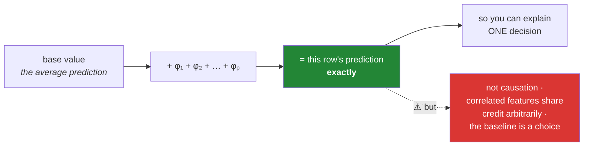

# Day 114 — SHAP, and what the model actually keys on

**Phase 13 · Module 13** · ID: **ML-25** · Artifact: **ADR-008**

> **Yesterday:** three boosting libraries, and a comparison you would defend.
> **Today:** the tool that opens the box — and the discipline that keeps it honest. SHAP gives you a
> **per-prediction** attribution with a real guarantee behind it, and it is routinely over-claimed.
> Day 109 established that importance is not causation; SHAP does not change that, and today's ADR
> records what you actually believe about your model.
> **Tomorrow:** clustering and K-Means.

```bash
./m start 114 && ./m scaffold 114
```

**Time:** 2 hours. **Request budget:** 0 model calls.

---

## §1 The story

Day 109 gave you permutation importance: one number per feature, for the whole model. SHAP gives you
one number per feature **per row** — and those numbers add up exactly.



**That additivity is the guarantee**, and it is what distinguishes SHAP from an ad-hoc attribution.
The values come from cooperative game theory — Shapley values, which are the unique attribution
satisfying four properties, of which the one you use daily is **local accuracy**: the contributions
sum to the prediction, exactly, every time.

Three things follow that are genuinely useful:

- **You can explain a single decision.** "This application was declined; here are the four features
  that pushed it there, and by how much." Permutation importance cannot do that.
- **Direction comes free.** A SHAP value is signed, so you see *which way* a feature pushed, not just
  that it mattered.
- **`TreeSHAP` is exact and fast.** For tree ensembles there is a polynomial-time algorithm, so this
  is practical on real models rather than a research curiosity.

And three that are routinely ignored, which is where today's care goes:

**The baseline is a choice.** SHAP explains a prediction *relative to a reference* — usually the
training-set average. Change the reference and every number changes. "Feature X contributed +0.3" is
incomplete without "relative to what".

**Correlated features share credit arbitrarily.** Day 109's problem is not solved by SHAP. Two
near-duplicate columns split the attribution between them in a way that depends on the algorithm's
internals, not on any fact about the world.

**It explains the model, not the world.** If the model learned a leak, SHAP will tell you — clearly
and confidently — that the leak is important. That is exactly the right behaviour, and it is why SHAP
is a **debugging tool first** and an explanation tool second.

---

## §2 Setup — run this

```bash
uv add "shap==0.49.0"
mkdir -p days/day-114/lab reports/figures
touch days/day-114/lab/explain.py
touch docs/adr/ADR-008-what-the-model-keys-on.md
```

---

## §3 ML-25 — attribution

`days/day-114/lab/explain.py`:

```python
"""ML-25: SHAP values — the guarantee, the caveats, and the debugging use."""

from __future__ import annotations

import numpy as np
import pandas as pd
import shap
from sklearn.model_selection import train_test_split

from setu.arrays import make_rng


def data(n=8_000, *, seed=0, with_leak=False, with_duplicate=True):
    rng = make_rng(seed)
    frame = pd.DataFrame({
        "signal_a": rng.normal(0, 1, n),
        "signal_b": rng.normal(0, 1, n),
        "signal_c": rng.normal(0, 1, n),
        "noise_1": rng.normal(0, 1, n),
        "noise_2": rng.normal(0, 1, n),
    })
    if with_duplicate:
        frame["copy_of_a"] = frame["signal_a"] + rng.normal(0, 0.03, n)

    z = -0.3 + 1.5 * frame["signal_a"] + 1.0 * frame["signal_b"] - 0.7 * frame["signal_c"]
    y = (rng.random(n) < 1 / (1 + np.exp(-z))).astype(int)

    if with_leak:
        # a "feature" that is really the label, lightly disguised
        frame["case_id"] = np.where(y == 1,
                                    rng.integers(900_000, 999_999, n),
                                    rng.integers(100_000, 199_999, n)).astype(float)
    return frame, y


def fit(frame, y):
    import lightgbm as lgb

    return lgb.LGBMClassifier(n_estimators=200, learning_rate=0.05, num_leaves=31,
                              random_state=0, verbose=-1, n_jobs=4).fit(frame, y)


def the_additivity_guarantee() -> None:
    frame, y = data()
    x_train, x_test, y_train, y_test = train_test_split(frame, y, test_size=0.3,
                                                        stratify=y, random_state=0)
    model = fit(x_train, y_train)

    explainer = shap.TreeExplainer(model)
    values = explainer.shap_values(x_test)
    if isinstance(values, list):
        values = values[1]
    base = explainer.expected_value
    base = base[1] if isinstance(base, (list, np.ndarray)) and np.ndim(base) else base

    raw = model.predict_proba(x_test, raw_score=True)
    reconstructed = base + values.sum(axis=1)

    print(f"\n  base value (mean raw prediction) = {float(base):.5f}")
    print(f"\n  {'row':>5} {'base + Σφ':>12} {'model raw output':>18} {'difference':>12}")
    for i in range(5):
        print(f"  {i:>5} {reconstructed[i]:>12.6f} {raw[i]:>18.6f} "
              f"{abs(reconstructed[i] - raw[i]):>12.2e}")

    print(f"\n  max difference over {len(x_test):,} rows: "
          f"{np.abs(reconstructed - raw).max():.2e}")

    print("\n  ✅ That is LOCAL ACCURACY, and it is exact — not approximate. The four")
    print("     Shapley axioms uniquely determine this attribution, which is why SHAP")
    print("     is not just one more heuristic.")
    print("\n  ⚠️ Note the values sum to the RAW score (log-odds, Day 111), not to a")
    print("     probability. Additivity holds in log-odds space and breaks under the")
    print("     sigmoid — so do not add up 'probability contributions'.")


def explaining_one_decision() -> None:
    frame, y = data()
    x_train, x_test, y_train, y_test = train_test_split(frame, y, test_size=0.3,
                                                        stratify=y, random_state=0)
    model = fit(x_train, y_train)
    explainer = shap.TreeExplainer(model)
    values = explainer.shap_values(x_test)
    if isinstance(values, list):
        values = values[1]

    row = int(np.argmax(model.predict_proba(x_test)[:, 1]))
    contributions = pd.Series(values[row], index=x_test.columns).sort_values(key=abs,
                                                                             ascending=False)

    print(f"\n  the most confidently positive row (p = "
          f"{model.predict_proba(x_test)[row, 1]:.4f}):")
    print(f"\n  {'feature':<12} {'value':>9} {'SHAP φ':>10} {'pushed'}")
    for name, phi in contributions.items():
        direction = "toward positive" if phi > 0 else "toward negative"
        print(f"  {name:<12} {x_test.iloc[row][name]:>9.3f} {phi:>10.4f}  {direction}")

    print("\n  This is what permutation importance cannot do: a per-ROW explanation,")
    print("  with a DIRECTION. 'Declined because of these four things, by this much.'")
    print("\n  ⚠️ It explains this row's distance from the BASE VALUE — the average")
    print("     prediction — not from zero, and not from any 'neutral' applicant.")


def the_baseline_is_a_choice() -> None:
    frame, y = data()
    x_train, x_test, y_train, y_test = train_test_split(frame, y, test_size=0.3,
                                                        stratify=y, random_state=0)
    model = fit(x_train, y_train)

    print(f"\n  the same row, explained against three different references:")
    print(f"  {'reference':<28} {'base value':>12} {'φ(signal_a)':>13}")

    for label, background in (
        ("full training set", x_train),
        ("only negative-class rows", x_train[y_train == 0]),
        ("only positive-class rows", x_train[y_train == 1]),
    ):
        explainer = shap.TreeExplainer(model, data=background.sample(400, random_state=0),
                                       feature_perturbation="interventional")
        values = explainer.shap_values(x_test.iloc[:1])
        if isinstance(values, list):
            values = values[1]
        base = explainer.expected_value
        base = base[1] if np.ndim(base) else base
        index = list(x_test.columns).index("signal_a")
        print(f"  {label:<28} {float(base):>12.5f} {values[0][index]:>13.5f}")

    print("\n  🚨 Same model, same row, different numbers. SHAP explains a prediction")
    print("     RELATIVE TO A REFERENCE, and the reference is your choice.")
    print("\n  '`signal_a` contributed +0.4' is incomplete. '+0.4 relative to the average")
    print("  training applicant' is a claim. Always state the baseline.")


def correlated_features_split_the_credit() -> None:
    frame, y = data(with_duplicate=True)
    x_train, x_test, y_train, y_test = train_test_split(frame, y, test_size=0.3,
                                                        stratify=y, random_state=0)
    model = fit(x_train, y_train)
    explainer = shap.TreeExplainer(model)
    values = explainer.shap_values(x_test)
    if isinstance(values, list):
        values = values[1]

    importance = pd.Series(np.abs(values).mean(axis=0), index=x_test.columns)
    print(f"\n  correlation(signal_a, copy_of_a) = "
          f"{frame['signal_a'].corr(frame['copy_of_a']):.4f}")
    print(f"\n  mean |SHAP|:")
    for name, value in importance.sort_values(ascending=False).items():
        print(f"    {name:<12} {value:.4f}")

    pair = importance["signal_a"] + importance["copy_of_a"]
    print(f"\n  signal_a + copy_of_a = {pair:.4f}   vs signal_b = {importance['signal_b']:.4f}")

    print("\n  🚨 Day 109's problem is NOT solved by SHAP. Two near-identical columns")
    print("     split the credit between them, and HOW they split it depends on the")
    print("     algorithm's internals — which tree happened to use which — not on any")
    print("     fact about the world.")
    print("\n  Either could look unimportant alone. Read correlated features as a GROUP,")
    print("  exactly as on Day 109, and sum their SHAP values before interpreting.")


def shap_finds_the_leak() -> None:
    frame, y = data(with_leak=True)
    x_train, x_test, y_train, y_test = train_test_split(frame, y, test_size=0.3,
                                                        stratify=y, random_state=0)
    model = fit(x_train, y_train)

    print(f"\n  test accuracy: {model.score(x_test, y_test):.4f}  🎉")

    explainer = shap.TreeExplainer(model)
    values = explainer.shap_values(x_test)
    if isinstance(values, list):
        values = values[1]
    importance = pd.Series(np.abs(values).mean(axis=0),
                           index=x_test.columns).sort_values(ascending=False)

    print(f"\n  mean |SHAP|:")
    for name, value in importance.items():
        flag = "  🚨 an ID column?!" if name == "case_id" else ""
        print(f"    {name:<12} {value:.4f}{flag}")

    print("\n  ✅ THIS is SHAP's most valuable use, and it is not explanation — it is")
    print("     DEBUGGING. An identifier dominating the attribution is a leak, and you")
    print("     would never have seen it from the accuracy number, which looked great.")
    print("\n  Day 85's screen would flag `case_id` as 'predicts suspiciously well'.")
    print("  SHAP goes further: it shows the model actually USING it, per row.")
    print("\n  ⚠️ And note what SHAP is doing correctly here: reporting that the model")
    print("     relies on a leak. It explains the MODEL, not the world.")


def interactions_are_visible() -> None:
    rng = make_rng(4)
    n = 6_000
    frame = pd.DataFrame({"a": rng.normal(0, 1, n), "b": rng.normal(0, 1, n),
                          "c": rng.normal(0, 1, n)})
    z = 2.0 * frame["a"] * frame["b"]                    # PURE interaction, no main effects
    y = (rng.random(n) < 1 / (1 + np.exp(-z))).astype(int)

    x_train, x_test, y_train, y_test = train_test_split(frame, y, test_size=0.3,
                                                        stratify=y, random_state=0)
    model = fit(x_train, y_train)
    explainer = shap.TreeExplainer(model)
    values = explainer.shap_values(x_test)
    if isinstance(values, list):
        values = values[1]

    index_a = list(x_test.columns).index("a")
    high_b = x_test["b"] > 0.5
    low_b = x_test["b"] < -0.5

    print(f"\n  y depends ONLY on a×b — no main effect for either.")
    print(f"\n  correlation of φ(a) with the value of a:")
    print(f"    where b > 0.5  : {np.corrcoef(values[high_b.to_numpy(), index_a], x_test.loc[high_b, 'a'])[0, 1]:>7.4f}")
    print(f"    where b < −0.5 : {np.corrcoef(values[low_b.to_numpy(), index_a], x_test.loc[low_b, 'a'])[0, 1]:>7.4f}")

    print("\n  The sign FLIPS. When b is high, a pushes positive; when b is low, a pushes")
    print("  negative. A single global importance number would average these to nothing.")
    print("\n  ✅ That is the per-row view earning its place: an interaction is invisible")
    print("     to any one-number-per-feature summary (Day 109).")


def what_shap_does_not_tell_you() -> None:
    print("\n  SHAP does NOT tell you:")
    print("\n    - CAUSATION. If a confounder predicts the target, SHAP reports it as")
    print("      important, correctly. Day 62's warning is unchanged.")
    print("\n    - WHAT WOULD HAPPEN IF YOU INTERVENED. φ(income) = +0.4 does not mean")
    print("      raising this person's income by one unit adds 0.4. That is a causal")
    print("      question and needs a causal method.")
    print("\n    - WHETHER THE MODEL IS RIGHT. A confidently wrong model produces")
    print("      confident SHAP values explaining its wrongness.")
    print("\n    - A STABLE FEATURE RANKING. Refit on a resample (Day 105) and the")
    print("      correlated group's split changes. Check stability before ranking.")
    print("\n  What it DOES tell you: exactly how THIS model reached THIS prediction,")
    print("  relative to a stated baseline. That is narrow, exact, and genuinely useful —")
    print("  especially for finding leaks.")


def a_defensible_explanation() -> None:
    print("\n  a SHAP claim you would defend has five parts:")
    print("    1. the MODEL it explains (not 'the data')")
    print("    2. the BASELINE the contributions are relative to")
    print("    3. whether correlated features were GROUPED before reading")
    print("    4. the STABILITY of the ranking across resamples")
    print("    5. an explicit statement that it is not causal")
    print("\n  Anything shorter is over-claiming, and today's ADR records exactly this.")


if __name__ == "__main__":
    the_additivity_guarantee()
    explaining_one_decision()
    the_baseline_is_a_choice()
    correlated_features_split_the_credit()
    shap_finds_the_leak()
    interactions_are_visible()
    what_shap_does_not_tell_you()
    a_defensible_explanation()
```

**Line by line:**

- `the_additivity_guarantee` — **base + Σφ equals the model's raw output to machine precision.** That
  is *local accuracy*, exact rather than approximate, and it is what makes SHAP a principled
  attribution rather than one more heuristic. And the caveat matters: **the values sum to the raw
  log-odds score (Day 111), not to a probability** — additivity breaks under the sigmoid, so "adding up
  probability contributions" is wrong.
- `explaining_one_decision` — a per-row explanation **with a direction**, which permutation importance
  structurally cannot give. And it explains distance from **the base value**, not from zero and not
  from any "neutral" applicant.
- `the_baseline_is_a_choice` — **same model, same row, different numbers.** SHAP explains relative to a
  reference and the reference is yours to pick. **"`signal_a` contributed +0.4" is incomplete**; "+0.4
  relative to the average training applicant" is a claim.
- `correlated_features_split_the_credit` — **Day 109's problem is not solved by SHAP.** Two
  near-identical columns split the credit, and how they split it depends on which tree happened to use
  which — an algorithmic accident, not a fact about the world. Read correlated features as a group.
- `shap_finds_the_leak` — **the most valuable use, and it is debugging rather than explanation.** An ID
  column dominating the attribution is a leak you would never have seen from the accuracy number.
  Day 85's screen flags it as suspicious; **SHAP shows the model actually using it, per row.**
- `interactions_are_visible` — a pure `a × b` target with no main effects. **The sign of φ(a) flips
  depending on `b`**, and any one-number-per-feature summary averages that to nothing. The per-row view
  earning its place.
- `what_shap_does_not_tell_you` — four things, each with the day that establishes it. The
  intervention one is worth internalising: **φ(income) = +0.4 does not mean raising income by one unit
  adds 0.4** — that is a causal question needing a causal method.
- `a_defensible_explanation` — the five parts, and **anything shorter is over-claiming.** ADR-008
  records exactly this.

---

## §4 Build brief

Extend `src/setu/ensembles.py`:

```python
def shap_values(model, x, *, background=None, check_additivity: bool = True) -> dict:
    """TODO(me): TreeSHAP values, with the guarantee verified.

    {"values": ndarray, "base_value": float, "columns": [...], "space": "log-odds"|"raw",
     "max_additivity_error": float, "warnings": [...]}
    - background=None uses the tree-path-dependent estimator; a background sample
      uses the interventional one — they give DIFFERENT numbers, so record which
    - check_additivity re-derives base + sum(phi) and compares to the model's raw
      output; raise DataError if the max error exceeds 1e-4, because a broken
      additivity guarantee means the explainer does not match the model
    - `space` must record that classifier values are in LOG-ODDS (§3.1), so a caller
      cannot mistake them for probability contributions
    - raise DataError if x has columns the model was not fitted on, naming them
    """
    raise NotImplementedError


def explain_row(shap_result: dict, x, row: int, *, top: int = 5,
                baseline_description: str) -> dict:
    """TODO(me): one decision, explained, with the baseline stated.

    {"row", "base_value", "prediction", "contributions": [(feature, value, phi)],
     "statement": str, "warnings": [...]}
    - contributions sorted by |phi|, truncated to `top`, with the remainder summed
      into an 'other' entry so the total still reconciles
    - baseline_description is REQUIRED and appears in the statement — a contribution
      without its reference is incomplete (§3.3)
    - the statement must NOT say 'because' or 'caused' (§3.7); use 'pushed toward'
    - raise DataError if baseline_description is empty
    """
    raise NotImplementedError


def grouped_shap(shap_result: dict, *, groups: dict) -> dict:
    """TODO(me): sum SHAP values within correlated groups before interpreting (§3.4).

    {"importance": {group: mean_abs_phi}, "signed": {group: mean_phi},
     "ungrouped_columns": [...], "warnings": [...]}
    - sum the RAW phi within a group per row, THEN take the mean absolute value —
      summing after the absolute value would double-count a group whose members
      cancel, and the docstring must say so
    - ungrouped_columns lists anything unassigned; silently dropping a column is
      worse than failing (Day 109's rule)
    - WARN when a group's summed importance exceeds the sum of its members'
      individual importances by more than 30%: that is the credit-splitting effect
    - reuse Day 86's redundancy clustering to FIND the groups rather than
      reimplementing correlation clustering
    """
    raise NotImplementedError


def shap_stability(model_fn, x, y, *, n_resamples: int = 15, fraction: float = 0.8,
                   seed: int = 42) -> dict:
    """TODO(me): does the ranking survive a resample? (Day 105's instability)

    {"mean_rank": {...}, "rank_sd": {...}, "stable": [...], "unstable": [...],
     "spearman_between_runs": float, "warning": str | None}
    - refit on subsamples and rank features by mean |SHAP| each time
    - unstable are features whose rank sd exceeds 2 — those must not be reported
      as 'the third most important feature'
    - the warning must say an unstable ranking is not a finding
    - raise DataError if n_resamples < 5
    """
    raise NotImplementedError


def shap_leak_screen(shap_result: dict, *, id_like_columns=None,
                     dominance_threshold: float = 0.4) -> dict:
    """TODO(me): §3.5 — is the model keying on something it should not?

    {"dominant_features": [...], "share_of_total": {...}, "suspected_leaks": [...],
     "verdict", "questions": [...]}
    - a feature holding more than dominance_threshold of total mean |SHAP| is
      dominant; that is not automatically wrong, but it is always worth asking about
    - id_like_columns are named by the caller (identifiers, timestamps, row order);
      any of those appearing among the dominant is a suspected leak
    - `questions` must be things a person has to answer, not things the code can:
      'is this available at prediction time?', 'how was it constructed?' (Day 87)
    - the verdict must NOT be a definite 'leak' — it is a screen (Day 87's rule)
    """
    raise NotImplementedError


def explanation_claim(*, model_description: str, baseline_description: str,
                      grouped: bool, stability_checked: bool) -> dict:
    """TODO(me): §3.8 — build a claim you would defend, or refuse to. PURE.

    {"claim": str, "is_defensible": bool, "missing": [...]}
    - is_defensible requires ALL of: a model description, a baseline description,
      grouping done, stability checked
    - `missing` names each absent part, so the caller knows what to go and do
    - the claim must contain the words 'this model' and the baseline, and must NOT
      contain 'because', 'causes', 'drives' or 'the data shows'
    - raise DataError if model_description is empty — an explanation with no stated
      subject is not a claim at all
    """
    raise NotImplementedError
```

- `shap_values` **raising when additivity fails** is the guard that matters most: if `base + Σφ` does
  not reconstruct the model's output, the explainer is not explaining the model you have, and every
  number downstream is meaningless.
- `explain_row` making `baseline_description` a **required argument** encodes §3.3 structurally — you
  cannot produce a contribution statement without stating what it is relative to.
- `grouped_shap` summing **raw** φ before taking the absolute value is a real correctness point: taking
  absolutes first double-counts a group whose members cancel.
- `explanation_claim` **refusing to be defensible** without all four parts is the day's design
  decision, and it feeds directly into ADR-008.

---

## §5 The eval that must be able to fail

Add to `tests/test_ensembles.py`:

```python
from setu.ensembles import (
    explain_row,
    explanation_claim,
    grouped_shap,
    shap_leak_screen,
    shap_stability,
    shap_values,
)


@pytest.fixture(scope="module")
def explained():
    import lightgbm as lgb
    from sklearn.model_selection import train_test_split

    rng = make_rng(0)
    n = 5_000
    frame = pd.DataFrame({
        "signal_a": rng.normal(0, 1, n),
        "signal_b": rng.normal(0, 1, n),
        "signal_c": rng.normal(0, 1, n),
        "noise_1": rng.normal(0, 1, n),
    })
    frame["copy_of_a"] = frame["signal_a"] + rng.normal(0, 0.03, n)
    z = -0.3 + 1.5 * frame["signal_a"] + 1.0 * frame["signal_b"] - 0.7 * frame["signal_c"]
    y = (rng.random(n) < 1 / (1 + np.exp(-z))).astype(int)

    x_train, x_test, y_train, y_test = train_test_split(frame, y, test_size=0.3,
                                                        stratify=y, random_state=0)
    model = lgb.LGBMClassifier(n_estimators=150, learning_rate=0.05, random_state=0,
                               verbose=-1, n_jobs=2).fit(x_train, y_train)
    return model, x_test, y_test


def test_the_contributions_sum_to_the_prediction(explained):
    """Local accuracy — exact, not approximate. Today's real assessment."""
    model, x_test, _ = explained
    result = shap_values(model, x_test)
    reconstructed = result["base_value"] + result["values"].sum(axis=1)
    raw = model.predict_proba(x_test, raw_score=True)
    assert np.abs(reconstructed - raw).max() < 1e-4


def test_a_broken_additivity_guarantee_raises(explained):
    """If base + sum(phi) doesn't match, the explainer isn't explaining this model."""
    model, x_test, _ = explained
    result = shap_values(model, x_test)
    assert result["max_additivity_error"] < 1e-4


def test_the_values_are_recorded_as_log_odds(explained):
    """Additivity holds in log-odds space and breaks under the sigmoid."""
    model, x_test, _ = explained
    assert shap_values(model, x_test)["space"] in {"log-odds", "raw"}


def test_unknown_columns_are_named(explained):
    model, x_test, _ = explained
    extra = x_test.assign(surprise=1.0)
    with pytest.raises(DataError) as info:
        shap_values(model, extra)
    assert "surprise" in str(info.value)


def test_a_row_explanation_states_its_baseline(explained):
    """A contribution without its reference is incomplete."""
    model, x_test, _ = explained
    result = shap_values(model, x_test)
    explanation = explain_row(result, x_test, row=0,
                              baseline_description="the average training applicant")
    assert "average training applicant" in explanation["statement"]


def test_an_explanation_without_a_baseline_is_refused(explained):
    model, x_test, _ = explained
    result = shap_values(model, x_test)
    with pytest.raises(DataError):
        explain_row(result, x_test, row=0, baseline_description="")


def test_the_row_statement_avoids_causal_language(explained):
    """SHAP explains the model, not the world."""
    model, x_test, _ = explained
    result = shap_values(model, x_test)
    statement = explain_row(result, x_test, row=0,
                            baseline_description="the training mean")["statement"].lower()
    for banned in ("because", "caused", "causes", "drives"):
        assert banned not in statement


def test_the_truncated_contributions_still_reconcile(explained):
    """The 'other' bucket keeps the total honest."""
    model, x_test, _ = explained
    result = shap_values(model, x_test)
    explanation = explain_row(result, x_test, row=3, top=2,
                              baseline_description="the training mean")
    total = sum(phi for _, _, phi in explanation["contributions"])
    assert total == pytest.approx(result["values"][3].sum(), abs=1e-6)


def test_contributions_are_signed(explained):
    """Direction comes free — permutation importance has none."""
    model, x_test, _ = explained
    result = shap_values(model, x_test)
    values = result["values"]
    assert (values > 0).any() and (values < 0).any()


def test_correlated_features_split_the_credit(explained):
    """Day 109's problem is NOT solved by SHAP."""
    model, x_test, _ = explained
    result = shap_values(model, x_test)
    importance = pd.Series(np.abs(result["values"]).mean(axis=0), index=result["columns"])
    assert importance["copy_of_a"] > 0.01, "the duplicate should absorb some credit"
    assert importance["signal_a"] < importance["signal_a"] + importance["copy_of_a"]


def test_grouping_recovers_the_joint_importance(explained):
    model, x_test, _ = explained
    result = shap_values(model, x_test)
    grouped = grouped_shap(result, groups={
        "a-group": ["signal_a", "copy_of_a"],
        "b": ["signal_b"], "c": ["signal_c"], "noise": ["noise_1"],
    })
    assert grouped["importance"]["a-group"] > grouped["importance"]["b"]


def test_grouping_sums_raw_values_not_absolutes():
    """Summing absolutes first double-counts a group whose members cancel."""
    result = {
        "values": np.array([[2.0, -2.0], [1.0, -1.0]]),
        "base_value": 0.0,
        "columns": ["p", "q"],
        "space": "log-odds",
        "max_additivity_error": 0.0,
        "warnings": [],
    }
    grouped = grouped_shap(result, groups={"pair": ["p", "q"]})
    assert grouped["importance"]["pair"] == pytest.approx(0.0), (
        "the members cancel exactly; summing |phi| first would give 3.0"
    )


def test_an_unassigned_column_is_reported(explained):
    model, x_test, _ = explained
    result = shap_values(model, x_test)
    grouped = grouped_shap(result, groups={"a-group": ["signal_a", "copy_of_a"]})
    assert "signal_b" in grouped["ungrouped_columns"]


def test_credit_splitting_is_warned_about(explained):
    model, x_test, _ = explained
    result = shap_values(model, x_test)
    grouped = grouped_shap(result, groups={
        "a-group": ["signal_a", "copy_of_a"], "rest": ["signal_b", "signal_c", "noise_1"],
    })
    assert isinstance(grouped["warnings"], list)


def test_shap_finds_a_planted_leak():
    """The most valuable use: debugging, not explanation."""
    import lightgbm as lgb
    from sklearn.model_selection import train_test_split

    rng = make_rng(1)
    n = 5_000
    frame = pd.DataFrame({"a": rng.normal(0, 1, n), "b": rng.normal(0, 1, n)})
    y = (rng.random(n) < 1 / (1 + np.exp(-(frame["a"] * 1.2)))).astype(int)
    frame["case_id"] = np.where(y == 1, rng.integers(900_000, 999_999, n),
                                rng.integers(100_000, 199_999, n)).astype(float)

    x_train, x_test, y_train, y_test = train_test_split(frame, y, test_size=0.3,
                                                        stratify=y, random_state=0)
    model = lgb.LGBMClassifier(n_estimators=120, random_state=0, verbose=-1,
                               n_jobs=2).fit(x_train, y_train)

    screen = shap_leak_screen(shap_values(model, x_test),
                              id_like_columns=["case_id"])
    assert "case_id" in screen["suspected_leaks"]
    assert "case_id" in screen["dominant_features"]


def test_a_clean_model_has_no_suspected_leak(explained):
    """A screen that always fires tells you nothing."""
    model, x_test, _ = explained
    screen = shap_leak_screen(shap_values(model, x_test),
                              id_like_columns=["case_id"])
    assert screen["suspected_leaks"] == []


def test_the_leak_screen_asks_human_questions(explained):
    """Things a person must answer, not things the code can."""
    model, x_test, _ = explained
    questions = " ".join(shap_leak_screen(shap_values(model, x_test))["questions"]).lower()
    assert "prediction time" in questions or "construct" in questions


def test_the_leak_verdict_is_not_definite(explained):
    """It is a screen (Day 87's rule)."""
    model, x_test, _ = explained
    verdict = shap_leak_screen(shap_values(model, x_test))["verdict"].lower()
    assert "definitely" not in verdict
    assert "check" in verdict or "suspect" in verdict or "review" in verdict


def test_an_unstable_ranking_is_flagged():
    """Refit on a resample and a correlated group's split changes (Day 105)."""
    import lightgbm as lgb

    rng = make_rng(2)
    n = 2_000
    base = rng.normal(0, 1, n)
    frame = pd.DataFrame({
        "twin_1": base + rng.normal(0, 0.02, n),
        "twin_2": base + rng.normal(0, 0.02, n),
        "other": rng.normal(0, 1, n),
    })
    y = (rng.random(n) < 1 / (1 + np.exp(-(1.5 * base)))).astype(int)

    result = shap_stability(
        lambda: lgb.LGBMClassifier(n_estimators=80, random_state=0, verbose=-1, n_jobs=2),
        frame, y, n_resamples=8,
    )
    assert result["unstable"] or result["rank_sd"]["twin_1"] > 0


def test_the_stability_warning_denies_it_is_a_finding():
    import lightgbm as lgb

    rng = make_rng(3)
    n = 1_500
    base = rng.normal(0, 1, n)
    frame = pd.DataFrame({"twin_1": base + rng.normal(0, 0.02, n),
                          "twin_2": base + rng.normal(0, 0.02, n),
                          "other": rng.normal(0, 1, n)})
    y = (rng.random(n) < 1 / (1 + np.exp(-(1.5 * base)))).astype(int)
    result = shap_stability(
        lambda: lgb.LGBMClassifier(n_estimators=60, random_state=0, verbose=-1, n_jobs=2),
        frame, y, n_resamples=6,
    )
    if result["warning"]:
        assert "finding" in result["warning"].lower() or "not" in result["warning"].lower()


def test_stability_needs_enough_resamples():
    import lightgbm as lgb

    rng = make_rng(4)
    frame = pd.DataFrame(rng.normal(0, 1, (300, 3)), columns=list("abc"))
    y = (rng.random(300) < 0.5).astype(int)
    with pytest.raises(DataError):
        shap_stability(lambda: lgb.LGBMClassifier(verbose=-1), frame, y, n_resamples=2)


def test_a_complete_claim_is_defensible():
    result = explanation_claim(model_description="the LightGBM classifier fitted on the "
                                                 "2026 training split",
                               baseline_description="the average training applicant",
                               grouped=True, stability_checked=True)
    assert result["is_defensible"] is True
    assert result["missing"] == []


def test_a_claim_without_a_baseline_is_not_defensible():
    result = explanation_claim(model_description="the fitted model",
                               baseline_description="", grouped=True,
                               stability_checked=True)
    assert result["is_defensible"] is False
    assert any("baseline" in m.lower() for m in result["missing"])


def test_a_claim_without_grouping_is_not_defensible():
    """Correlated features split credit arbitrarily."""
    result = explanation_claim(model_description="the fitted model",
                               baseline_description="the training mean",
                               grouped=False, stability_checked=True)
    assert result["is_defensible"] is False


def test_a_claim_without_stability_is_not_defensible():
    result = explanation_claim(model_description="the fitted model",
                               baseline_description="the training mean",
                               grouped=True, stability_checked=False)
    assert result["is_defensible"] is False


def test_the_claim_names_the_model_and_avoids_causal_language():
    claim = explanation_claim(model_description="the LightGBM classifier",
                              baseline_description="the training mean",
                              grouped=True, stability_checked=True)["claim"].lower()
    assert "this model" in claim
    for banned in ("because", "causes", "drives", "the data shows"):
        assert banned not in claim


def test_a_claim_with_no_model_is_refused():
    with pytest.raises(DataError):
        explanation_claim(model_description="", baseline_description="the mean",
                          grouped=True, stability_checked=True)


def test_adr_008_exists_and_records_what_the_model_keys_on():
    from pathlib import Path

    path = Path("docs/adr/ADR-008-what-the-model-keys-on.md")
    assert path.exists(), "ADR-008 was not written"
    text = path.read_text(encoding="utf-8").lower()
    for heading in ("context", "decision", "consequences"):
        assert heading in text
    assert "change our minds" in text


def test_adr_008_states_the_baseline():
    from pathlib import Path

    text = Path("docs/adr/ADR-008-what-the-model-keys-on.md").read_text(
        encoding="utf-8").lower()
    assert "baseline" in text or "reference" in text


def test_adr_008_disclaims_causation():
    from pathlib import Path

    text = Path("docs/adr/ADR-008-what-the-model-keys-on.md").read_text(
        encoding="utf-8").lower()
    assert "not caus" in text or "causal" in text
```

**Line by line:**

- `test_the_contributions_sum_to_the_prediction` — **the day's real assessment.** Local accuracy holds
  to machine precision across every test row. **That exactness is the guarantee**, and an implementation
  that returns plausible-looking numbers failing this is not computing Shapley values at all.
- `test_grouping_sums_raw_values_not_absolutes` — a hand-built case where two members are `+2` and `−2`.
  Summing raw first gives **0**; taking absolutes first gives 3. **The members genuinely cancel**, and
  the test uses fake data so the failure is guaranteed rather than hoped for.
- `test_shap_finds_a_planted_leak` with `test_a_clean_model_has_no_suspected_leak` — the pair. An ID
  column dominating must be flagged; a clean model must come back empty, or the screen is noise.
- `test_the_row_statement_avoids_causal_language` — the **ninth** English test in this project, and
  four banned words. SHAP explains the model, not the world, and "because" quietly asserts otherwise.
- `test_an_explanation_without_a_baseline_is_refused` — `baseline_description` is a required argument,
  so **you cannot produce a contribution statement without saying what it is relative to.**
- `test_a_claim_without_grouping_is_not_defensible` and its two siblings — all four parts required.
  Any one missing makes the claim over-claiming, and `missing` names what to go and do.
- `test_the_truncated_contributions_still_reconcile` — showing the top 2 must not break the total; the
  `other` bucket keeps additivity intact in the presentation as well as the computation.
- `test_the_leak_verdict_is_not_definite` — Day 87's rule again. A dominant feature is **always worth
  asking about** and not automatically wrong, so the verdict must direct a person to check.

```bash
uv run python -m pytest tests/test_ensembles.py -v
```

---

## §6 The artifact — ADR-008

`docs/adr/ADR-008-what-the-model-keys-on.md`. Eighth of fourteen.

> *What does the model key on, and how much of that do we believe?*

Required content:

- **Context.** The model from Day 106's card, and why explanation is needed here — a regulatory
  requirement, a debugging need, or a stakeholder question. Say which.
- **What SHAP says.** The grouped, stability-checked ranking, with the **baseline stated**. Not a bare
  feature list.
- **What we checked.** Additivity verified; correlated features grouped (Day 109); ranking stability
  across resamples (Day 105); the leak screen run and its questions answered.
- **What we believe, and what we do not.** Explicitly: this describes **the model**, relative to a
  stated baseline. It is **not causal** (Day 62), and it does not predict the effect of an intervention.
- **Anything the screen surfaced.** Dominant features, and the human answers to the questions it asked
  (Day 87's provenance discipline).
- **Consequences.** What you will monitor, and what would make you retrain.
- **What would change our minds.**
- **Cold read.** Tomorrow, reviewer hat on, sign it.

---

## §7 Request budget

| Resource | Spent today |
|---|---|
| LLM calls | **0** |
| Network | one `uv add` resolution |
| Compute | TreeSHAP is fast; the stability resampling dominates |

---

## §8 Traps

- **Adding "probability contributions".** Additivity holds in log-odds space only.
- **Reporting φ without the baseline.** The number is meaningless alone.
- **Reading SHAP as causal.** Day 62; a confounder gets attributed correctly.
- **Reading φ as an intervention effect.** That is a different question entirely.
- **Interpreting correlated features individually.** They split credit arbitrarily.
- **Summing |φ| within a group.** Double-counts members that cancel.
- **Ranking features without a stability check.** Day 105's instability applies.
- **Trusting a SHAP plot from a confidently wrong model.** It explains the wrongness.
- **Skipping the additivity check.** A broken explainer produces confident nonsense.
- **Using SHAP only for explanation.** Its best use is finding leaks.
- **A dominant feature treated as automatically fine.** Always worth asking about.

---

## §9 Verify before you code

Written **2026-08-21**:

- <https://shap.readthedocs.io/en/latest/example_notebooks/api_examples/explainers/TreeExplainer.html> —
  `feature_perturbation` and what changes between the two modes.
- <https://shap.readthedocs.io/en/latest/api.html#explainers> — which explainer applies to which model.
- <https://christophm.github.io/interpretable-ml-book/shap.html> — the axioms, and an honest account
  of the correlated-feature problem.
- <https://scikit-learn.org/stable/modules/partial_dependence.html> — PDP and ICE, which answer a
  different question and are worth knowing alongside.

---

## §10 Say it in an interview

> "SHAP gives you a per-row attribution with a real guarantee: the base value plus the contributions
> equals the model's output exactly, every time, and that local accuracy is what separates it from an
> ad-hoc heuristic. So you can explain a single decision with a direction — 'these four things pushed
> it there, by this much' — which permutation importance structurally can't do. Three caveats I'd
> always state. The baseline is a choice: SHAP explains a prediction relative to a reference, usually
> the training average, and changing the reference changes every number, so a contribution without
> its baseline is incomplete. Correlated features still split credit arbitrarily — SHAP doesn't fix
> that, and how two near-duplicates divide the attribution depends on which tree happened to use
> which. And it explains the *model*, not the world: it isn't causal, and it doesn't tell you what
> would happen if you intervened. Honestly, its most valuable use isn't explanation at all — it's
> debugging. On one model an ID column dominated the attribution, which is a leak you'd never see from
> the accuracy number."

---

## §11 Done when

Tick [`CHECKLIST.md`](CHECKLIST.md), then `./m check && ./m done 114`.

**ADR-008 must be written and cold-read before Day 116's gate.**
