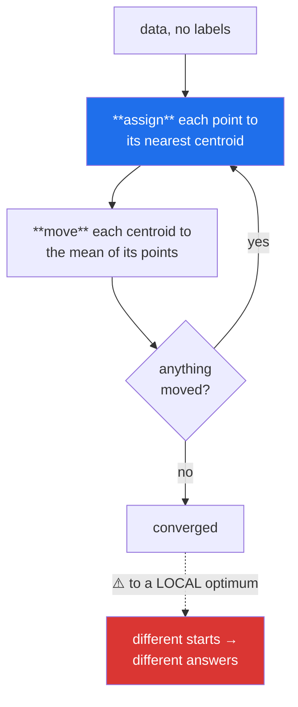

# Day 115 — Clustering and K-Means

**Phase 13 · Module 13** · IDs: **ML-26** (unsupervised learning), **ML-27** (distance metrics), **ML-28** (K-Means from scratch)

> **Yesterday:** SHAP, and the discipline that keeps an explanation honest.
> **Today:** the first genuinely unsupervised method in this plan — and the difficulty is not the
> algorithm, it is that **there is no right answer to check against.** Every metric you have used since
> Day 94 needed a target. Today you have none, and the honest handling of that is the day's real
> content.
> **Tomorrow:** MLflow and the Phase 13 gate.

```bash
./m start 115 && ./m scaffold 115
```

**Time:** 110 minutes. **Request budget:** 0 model calls.

---

## §1 The story

Every model since Day 91 was **supervised**: you had `y`, so you could measure whether you were right.
Clustering has no `y`. It partitions the data, and nothing tells you whether the partition means
anything.



**K-Means is that loop and nothing more.** Assign, move, repeat. It provably converges — the objective
falls every step and cannot fall forever — but **it converges to a local optimum**, so different
starting centroids give different clusterings. That is why `n_init` exists and why one run is not an
answer.

Three things decide whether the result means anything, and all three sit outside the algorithm.

**The distance metric is a modelling assumption.** Euclidean says "close in every dimension equally".
Manhattan is more robust to one large coordinate difference. Cosine ignores magnitude entirely and
compares only direction — which is what you want for text (Day 87) and wrong for physical
measurements. Choosing Euclidean by default is choosing an assumption silently.

**Scaling decides the outcome.** Day 103 established this for KNN and it is the same here: an
unscaled feature in thousands dominates every distance, so **K-Means on unscaled data clusters by
whichever column has the largest units.** Day 98 gave a third reason to scale; this is a fourth.

**K-Means always returns k clusters**, whether or not the data has any. Run it on uniform noise and it
partitions the noise confidently. **The algorithm cannot tell you there is no structure** — that is
your job, and §3 shows how.

And the metric problem. Without labels you have **internal** measures — silhouette, inertia — which
score the geometry of the partition rather than its truth. A high silhouette means "compact and
separated", not "correct". They are useful, and they are not validation.

---

## §2 Setup — run this

```bash
mkdir -p days/day-115/lab
touch days/day-115/lab/clustering.py
touch src/setu/clustering.py
touch tests/test_clustering.py
```

---

## §3 ML-26 / ML-27 / ML-28 — partitioning

`days/day-115/lab/clustering.py`:

```python
"""ML-26/27/28: K-Means from scratch, distance metrics, and how to know if it meant anything."""

from __future__ import annotations

import numpy as np
from sklearn.cluster import KMeans
from sklearn.metrics import adjusted_rand_score, silhouette_score

from setu.arrays import make_rng


def blobs(n=1_200, *, k=3, spread=0.8, seed=0):
    rng = make_rng(seed)
    centres = np.array([[0.0, 0.0], [6.0, 6.0], [0.0, 7.0], [7.0, 0.0], [3.5, 3.5]])[:k]
    labels = rng.integers(0, k, n)
    return centres[labels] + rng.normal(0, spread, (n, 2)), labels


def kmeans_from_scratch() -> None:
    x, truth = blobs()
    rng = make_rng(1)
    k = 3

    centroids = x[rng.choice(len(x), k, replace=False)]     # naive random init

    print(f"\n  {'step':>5} {'inertia':>12} {'points moved':>14}")
    previous = None
    for step in range(1, 51):
        distances = ((x[:, None, :] - centroids[None, :, :]) ** 2).sum(axis=2)
        assignment = distances.argmin(axis=1)

        moved = len(x) if previous is None else int((assignment != previous).sum())
        inertia = distances[np.arange(len(x)), assignment].sum()
        if step <= 3 or moved == 0:
            print(f"  {step:>5} {inertia:>12.2f} {moved:>14,}")
        if moved == 0:
            print(f"  converged after {step} steps")
            break
        previous = assignment

        for cluster in range(k):
            members = x[assignment == cluster]
            if len(members):
                centroids[cluster] = members.mean(axis=0)

    library = KMeans(n_clusters=k, n_init=10, random_state=0).fit(x)
    print(f"\n  mine    inertia: {inertia:.2f}")
    print(f"  sklearn inertia: {library.inertia_:.2f}")
    print(f"\n  agreement with the true blobs (ARI): "
          f"{adjusted_rand_score(truth, assignment):.4f}")

    print("\n  Two steps, repeated: ASSIGN each point to its nearest centroid, then MOVE")
    print("  each centroid to the mean of its points. That is the whole algorithm.")
    print("\n  Inertia falls every step and cannot fall below zero, so it must converge.")
    print("  ⚠️ But only to a LOCAL optimum — see §3.3.")


def local_optima_are_real() -> None:
    x, truth = blobs(k=4, spread=0.9, seed=2)
    rng = make_rng(3)

    print(f"\n  20 runs of K-Means with k=4, single random init each:")
    inertias, aris = [], []
    for seed in range(20):
        model = KMeans(n_clusters=4, n_init=1, init="random",
                       random_state=seed).fit(x)
        inertias.append(model.inertia_)
        aris.append(adjusted_rand_score(truth, model.labels_))

    inertias = np.array(inertias)
    print(f"    best  inertia: {inertias.min():>10.2f}   ARI {aris[int(inertias.argmin())]:.4f}")
    print(f"    worst inertia: {inertias.max():>10.2f}   ARI {aris[int(inertias.argmax())]:.4f}")
    print(f"    distinct solutions: {len(np.unique(np.round(inertias, 2)))} of 20")

    print("\n  🚨 Same data, same k, different answers. One run is not a result.")
    print("\n  `n_init=10` runs it ten times and keeps the lowest inertia — that is what")
    print("  makes the default usable. And `init='k-means++'` picks starting centroids")
    print("  spread apart rather than uniformly at random, which converges faster and")
    print("  to better optima. Both defaults exist because of this table.")

    best = KMeans(n_clusters=4, n_init=10, random_state=0).fit(x)
    print(f"\n  with n_init=10 and k-means++: inertia {best.inertia_:.2f}, "
          f"ARI {adjusted_rand_score(truth, best.labels_):.4f}")


def scaling_decides_the_clusters() -> None:
    rng = make_rng(4)
    n = 900
    group = rng.integers(0, 3, n)
    x = np.column_stack([
        np.array([0.0, 3.0, 6.0])[group] + rng.normal(0, 0.5, n),     # the REAL structure
        rng.normal(500, 900, n),                                       # noise, huge units
    ])

    print(f"\n  column standard deviations: {x.std(axis=0, ddof=1).round(1).tolist()}")
    print(f"  the real structure is in column 0; column 1 is pure noise")

    raw = KMeans(n_clusters=3, n_init=10, random_state=0).fit(x)
    scaled_x = (x - x.mean(axis=0)) / x.std(axis=0, ddof=1)
    scaled = KMeans(n_clusters=3, n_init=10, random_state=0).fit(scaled_x)

    print(f"\n  {'input':<16} {'ARI vs the real groups':>24}")
    print(f"  {'raw':<16} {adjusted_rand_score(group, raw.labels_):>24.4f}")
    print(f"  {'standardised':<16} {adjusted_rand_score(group, scaled.labels_):>24.4f}")

    print("\n  🚨 On raw data K-Means clusters the NOISE, because the noise column has")
    print("     900x the spread and therefore dominates every distance.")
    print("\n  Day 103 said this for KNN; Day 98 gave a different reason again. This is")
    print("  the fourth distinct reason to scale, and here it does not degrade the")
    print("  result — it produces an entirely different, meaningless one.")


def the_metric_is_an_assumption() -> None:
    rng = make_rng(5)
    a = np.array([1.0, 2.0, 3.0])
    b = np.array([2.0, 4.0, 6.0])          # same DIRECTION, twice the magnitude
    c = np.array([3.0, 2.0, 1.0])          # same magnitude, different direction

    def euclidean(p, q):
        return np.sqrt(((p - q) ** 2).sum())

    def manhattan(p, q):
        return np.abs(p - q).sum()

    def cosine(p, q):
        return 1 - (p @ q) / (np.linalg.norm(p) * np.linalg.norm(q))

    print(f"\n  a = {a.tolist()}   b = {b.tolist()} (2x a)   c = {c.tolist()}")
    print(f"\n  {'metric':<12} {'d(a,b)':>9} {'d(a,c)':>9} {'closer to a'}")
    for name, metric in (("euclidean", euclidean), ("manhattan", manhattan),
                         ("cosine", cosine)):
        ab, ac = metric(a, b), metric(a, c)
        print(f"  {name:<12} {ab:>9.4f} {ac:>9.4f}  {'b' if ab < ac else 'c'}")

    print("\n  Euclidean and Manhattan say c is closer; cosine says b is — because b")
    print("  points in exactly the same direction and cosine ignores magnitude entirely.")
    print("\n  ⚠️ For TEXT (Day 87), magnitude is document length, so cosine is right:")
    print("     a long and a short review about the same thing should be close.")
    print("     For physical measurements magnitude IS the signal, and cosine discards it.")
    print("\n  Choosing euclidean by default is choosing an assumption without saying so.")

    print(f"\n  and one more: euclidean distances CONCENTRATE in high dimensions (Day 103)")
    for p in (2, 10, 100, 1_000):
        points = rng.normal(0, 1, (400, p))
        distances = np.sqrt(((points[:200, None] - points[None, 200:]) ** 2).sum(axis=2))
        print(f"    p={p:>5}: (max−min)/min = "
              f"{(distances.max() - distances.min()) / distances.min():.4f}")
    print("  ^ nearest and furthest become indistinguishable. Reduce dimensions first")
    print("    (Day 86) or use a metric that degrades more gracefully.")


def k_means_always_returns_k_clusters() -> None:
    rng = make_rng(6)
    uniform = rng.uniform(0, 10, (900, 2))          # NO structure whatsoever

    print(f"\n  K-Means on uniform noise — there are no clusters here at all:")
    print(f"  {'k':>4} {'inertia':>12} {'silhouette':>12}")
    for k in (2, 3, 4, 5, 8):
        model = KMeans(n_clusters=k, n_init=10, random_state=0).fit(uniform)
        print(f"  {k:>4} {model.inertia_:>12.2f} "
              f"{silhouette_score(uniform, model.labels_):>12.4f}")

    structured, _ = blobs(n=900, k=3, spread=0.6, seed=7)
    print(f"\n  the same numbers on data that DOES have three blobs:")
    print(f"  {'k':>4} {'inertia':>12} {'silhouette':>12}")
    for k in (2, 3, 4, 5, 8):
        model = KMeans(n_clusters=k, n_init=10, random_state=0).fit(structured)
        print(f"  {k:>4} {model.inertia_:>12.2f} "
              f"{silhouette_score(structured, model.labels_):>12.4f}")

    print("\n  🚨 The noise data produces confident clusters and a silhouette around 0.35.")
    print("     The algorithm CANNOT tell you there is no structure — it returns k")
    print("     clusters because you asked for k clusters.")
    print("\n  Compare the two tables: real structure gives a clear silhouette PEAK at the")
    print("  true k and a much higher value. Noise gives a flat, mediocre curve.")
    print("  The SHAPE of the curve is the signal, not any single number.")


def choosing_k_honestly() -> None:
    x, truth = blobs(n=1_500, k=4, spread=0.7, seed=8)

    print(f"\n  {'k':>4} {'inertia':>12} {'Δ inertia':>12} {'silhouette':>12} {'ARI':>8}")
    previous = None
    for k in range(2, 9):
        model = KMeans(n_clusters=k, n_init=10, random_state=0).fit(x)
        change = "" if previous is None else f"{previous - model.inertia_:>12.1f}"
        print(f"  {k:>4} {model.inertia_:>12.1f} {change:>12} "
              f"{silhouette_score(x, model.labels_):>12.4f} "
              f"{adjusted_rand_score(truth, model.labels_):>8.4f}")
        previous = model.inertia_

    print("\n  Inertia ALWAYS falls as k rises — at k=n it is zero. So 'lowest inertia'")
    print("  is never the criterion; the ELBOW is, and elbows are a judgement call.")
    print("\n  Silhouette peaks at the true k here, which is what you hope for.")
    print("\n  ⚠️ The ARI column is only available because this is synthetic data with")
    print("     known labels. On real data you do NOT have it — which is precisely the")
    print("     problem, and why the silhouette curve's shape has to carry the argument.")


def internal_metrics_score_geometry_not_truth() -> None:
    rng = make_rng(9)
    n = 900
    theta = rng.uniform(0, 2 * np.pi, n)
    inner = np.column_stack([np.cos(theta), np.sin(theta)]) * 2 + rng.normal(0, 0.15, (n, 2))
    outer = np.column_stack([np.cos(theta), np.sin(theta)]) * 6 + rng.normal(0, 0.15, (n, 2))
    x = np.vstack([inner, outer])
    truth = np.r_[np.zeros(n), np.ones(n)]

    model = KMeans(n_clusters=2, n_init=10, random_state=0).fit(x)

    print(f"\n  two concentric rings — obviously two groups to a human:")
    print(f"    silhouette of the K-Means partition : {silhouette_score(x, model.labels_):.4f}")
    print(f"    ARI vs the true rings               : {adjusted_rand_score(truth, model.labels_):.4f}")

    print("\n  🚨 A respectable silhouette and an ARI near zero. K-Means split the rings")
    print("     down the middle, because it can only produce CONVEX, roughly spherical")
    print("     clusters — every point goes to the nearest centroid, so the boundary")
    print("     between two clusters is always a straight line.")
    print("\n  The silhouette is measuring COMPACTNESS AND SEPARATION, which the wrong")
    print("  answer has plenty of. An internal metric scores the GEOMETRY of a partition,")
    print("  never its truth.")
    print("\n  For this shape you need a density-based method (DBSCAN) or a kernel.")


def what_makes_a_clustering_useful() -> None:
    print("\n  a clustering result is worth something when:")
    print("    - the clusters DIFFER on variables you did not cluster on")
    print("      (segment by behaviour, then check they differ in revenue — Day 85)")
    print("    - they are STABLE across resamples and seeds")
    print("    - someone can NAME them, and the names survive a second look")
    print("    - a DECISION changes because of them (Day 90)")
    print("\n  it is worth nothing when:")
    print("    - the only evidence is a silhouette score")
    print("    - k was chosen after seeing which k gave the nicest story")
    print("    - the clusters are the scaling, or the largest-variance feature")
    print("\n  ⚠️ Clustering is EXPLORATORY (Day 85). A cluster is a hypothesis about")
    print("     structure, and hypotheses need confirmation on data you did not use.")


if __name__ == "__main__":
    kmeans_from_scratch()
    local_optima_are_real()
    scaling_decides_the_clusters()
    the_metric_is_an_assumption()
    k_means_always_returns_k_clusters()
    choosing_k_honestly()
    internal_metrics_score_geometry_not_truth()
    what_makes_a_clustering_useful()
```

**Line by line:**

- `kmeans_from_scratch` — **assign, move, repeat.** Inertia falls every step and cannot go below zero,
  so convergence is guaranteed — but only to a **local** optimum.
- `local_optima_are_real` — **20 runs, several distinct solutions, different ARIs.** Same data, same
  `k`, different answers. `n_init=10` keeps the lowest inertia of ten tries and `k-means++` spreads the
  starting centroids apart; **both defaults exist because of this table.**
- `scaling_decides_the_clusters` — the real structure is in column 0 and the noise column has 900× the
  spread. **On raw data K-Means clusters the noise.** Day 103 said this for KNN and Day 98 gave a
  different reason; this is the **fourth distinct reason to scale**, and note it does not merely degrade
  the result — it produces an entirely different, meaningless one.
- `the_metric_is_an_assumption` — Euclidean and Manhattan say `c` is closer to `a`; **cosine says `b`
  is**, because `b` points in exactly the same direction. For text, magnitude is document length so
  cosine is right; for physical measurements magnitude **is** the signal. And the concentration table
  is Day 103's curse: at `p = 1000` nearest and furthest are nearly indistinguishable.
- `k_means_always_returns_k_clusters` — **uniform noise produces confident clusters and a silhouette
  around 0.35.** The algorithm cannot tell you there is no structure. Compare the two tables: real
  structure gives a **clear peak** at the true `k` and a much higher value; noise gives a flat mediocre
  curve. **The shape of the curve is the signal, not any single number.**
- `choosing_k_honestly` — **inertia always falls as `k` rises** and is zero at `k = n`, so "lowest
  inertia" is never a criterion. And the ARI column carries a warning: it exists only because this is
  synthetic data with known labels. **On real data you do not have it**, which is the whole problem.
- `internal_metrics_score_geometry_not_truth` — **two concentric rings: a respectable silhouette and an
  ARI near zero.** K-Means split them down the middle because every point goes to the nearest centroid,
  so cluster boundaries are always straight lines. **An internal metric scores the geometry of a
  partition, never its truth.**
- `what_makes_a_clustering_useful` — four things that make it worth something and three that make it
  worthless, and the closing rule: **clustering is exploratory (Day 85), and a cluster is a hypothesis.**

---

## §4 Build brief — `src/setu/clustering.py`

New module. Layer 2.

```python
"""Clustering for Setu. Layer 2."""

from __future__ import annotations

import numpy as np

from setu.errors import DataError

METRICS = {"euclidean", "manhattan", "cosine"}


def pairwise_distance(a, b, *, metric: str = "euclidean"):
    """TODO(me): the distance matrix, from scratch. PURE.

    Returns (len(a), len(b)).
    - euclidean and manhattan are elementwise; cosine is 1 − cos(angle)
    - cosine must raise DataError on a zero-norm row, naming its index — the angle
      is undefined and returning nan silently poisons every downstream cluster
    - vectorise; a Python loop over pairs is unusable at n = 10,000
    - raise DataError on an unknown metric, listing METRICS
    - raise DataError if a and b differ in their number of columns, naming both
    """
    raise NotImplementedError


def choose_metric(*, data_kind: str, magnitude_is_signal: bool = True,
                  n_features: int | None = None) -> dict:
    """TODO(me): the metric is a modelling assumption — make it explicit. PURE.

    {"metric", "assumption": str, "reason": str, "warnings": [...]}
    - data_kind='text' or magnitude_is_signal=False -> cosine
    - many outlying coordinates -> manhattan (more robust than euclidean)
    - otherwise euclidean
    - `assumption` must state WHAT choosing this metric assumes, in words a reader
      could disagree with — that is the point of the function (§3.4)
    - WARN when n_features > 50 and the metric is euclidean: distances concentrate
      (Day 103), and the message must suggest reducing dimensions first (Day 86)
    - raise DataError on an unknown data_kind
    """
    raise NotImplementedError


def fit_kmeans(x, *, k: int, n_init: int = 10, max_iter: int = 300,
               tolerance: float = 1e-6, require_scaled: bool = True,
               seed: int = 42) -> dict:
    """TODO(me): §3.1's loop, with k-means++ init and honest bookkeeping.

    {"labels", "centroids", "inertia", "n_iter", "converged", "n_init",
     "inertia_spread", "warnings": [...]}
    - k-means++ init: first centroid uniform, each subsequent one chosen with
      probability proportional to its squared distance from the nearest chosen
      centroid — that spreading is why the default converges better (§3.2)
    - run n_init times and KEEP THE LOWEST inertia; inertia_spread is the range
      across restarts, and a large spread means the solution is unstable
    - WARN when inertia_spread exceeds 5% of the best inertia (§3.2)
    - require_scaled=True raises when feature sds differ by more than 10x, naming
      the columns — on unscaled data K-Means clusters the largest-variance column,
      and the message must say that (§3.3), not repeat Day 95's or Day 98's reason
    - an EMPTY cluster must be reseeded to the point furthest from its centroid,
      not silently dropped; record how many times that happened
    - raise DataError if k < 2 or k >= len(x)
    """
    raise NotImplementedError


def k_selection_curve(x, *, k_values=range(2, 11), n_init: int = 10,
                      seed: int = 42) -> dict:
    """TODO(me): §3.6 — inertia and silhouette across k, with the shape assessed.

    {"k_values": [...], "inertia": [...], "silhouette": [...],
     "elbow_k": int | None, "silhouette_k": int, "agree": bool,
     "curve_is_flat": bool, "recommendation": str, "warnings": [...]}
    - elbow_k from the largest second difference in inertia; None when no clear elbow
    - curve_is_flat is True when the silhouette range across k is under 0.1 — that
      is the NO-STRUCTURE signature (§3.5), and the recommendation must then say the
      data may have no cluster structure rather than naming a k
    - WARN when elbow_k and silhouette_k disagree — that disagreement is information
    - the docstring must state that inertia always falls with k, so it can never be
      minimised (§3.6)
    """
    raise NotImplementedError


def has_cluster_structure(x, *, k_values=range(2, 9), n_reference: int = 10,
                          seed: int = 42) -> dict:
    """TODO(me): §3.5 — is there anything here, or would noise look the same?

    {"observed_silhouette": {...}, "reference_silhouette": {...},
     "gap": {...}, "best_k": int | None, "has_structure": bool, "statement": str}
    - generate n_reference uniform datasets over the SAME bounding box as x, cluster
      each, and compare silhouettes — this is the gap-statistic idea
    - has_structure is True only when the observed silhouette exceeds the reference
      mean by more than 2 reference standard deviations at some k
    - best_k is None when has_structure is False — refusing to name a k is the
      correct output for structureless data
    - the statement must say plainly that K-Means returns k clusters regardless
    - raise DataError if n_reference < 5
    """
    raise NotImplementedError


def cluster_stability(x, *, k: int, n_resamples: int = 20, fraction: float = 0.8,
                      seed: int = 42) -> dict:
    """TODO(me): do the same points cluster together across resamples?

    {"mean_agreement", "sd_agreement", "stable": bool, "n_resamples", "warning"}
    - for each pair of resamples, compare the co-assignment of the points they share
      (adjusted Rand on the overlap), not the cluster LABELS — label numbering is
      arbitrary and comparing it directly is a real bug
    - stable when mean_agreement > 0.75
    - the warning must say an unstable clustering is not a finding (Day 85)
    - raise DataError if fraction is outside (0.5, 1.0)
    """
    raise NotImplementedError


def profile_clusters(x, labels, *, feature_names=None, external=None) -> dict:
    """TODO(me): §3.8 — what distinguishes these clusters, and do they differ elsewhere?

    {"sizes": {...}, "means": {...}, "distinguishing": {cluster: [(feature, z)]},
     "external_differences": {...} | None, "warnings": [...]}
    - distinguishing ranks features by how far a cluster's mean sits from the global
      mean in standard deviations — that is what lets a person NAME a cluster
    - `external` holds variables NOT used for clustering; reporting that clusters
      differ on those is the only evidence here that is not circular (§3.8)
    - WARN when any cluster holds under 2% of the points — it may be an artefact
    - WARN when external is None, saying the profile is circular without it
    """
    raise NotImplementedError
```

- `fit_kmeans` **reseeding empty clusters rather than dropping them** is a real correctness point: a
  dropped cluster silently returns `k−1` groups while reporting `k`.
- `has_cluster_structure` **returning `best_k = None`** for structureless data is the day's design
  decision. §3.5 showed K-Means partitioning uniform noise confidently, and **refusing to name a `k` is
  the correct output.**
- `cluster_stability` comparing **co-assignment rather than labels** matters — cluster numbering is
  arbitrary across runs, and comparing label arrays directly is a bug that looks like instability.

---

## §5 The eval that must be able to fail

`tests/test_clustering.py`:

```python
import numpy as np
import pytest

from setu.arrays import make_rng
from setu.clustering import (
    METRICS,
    choose_metric,
    cluster_stability,
    fit_kmeans,
    has_cluster_structure,
    k_selection_curve,
    pairwise_distance,
    profile_clusters,
)
from setu.errors import DataError


def _blobs(n=900, k=3, spread=0.6, seed=0):
    rng = make_rng(seed)
    centres = np.array([[0.0, 0.0], [6.0, 6.0], [0.0, 7.0], [7.0, 0.0]])[:k]
    labels = rng.integers(0, k, n)
    return centres[labels] + rng.normal(0, spread, (n, 2)), labels


def test_euclidean_matches_the_definition():
    a = np.array([[0.0, 0.0], [3.0, 4.0]])
    b = np.array([[3.0, 4.0]])
    distances = pairwise_distance(a, b, metric="euclidean")
    assert distances[0, 0] == pytest.approx(5.0)
    assert distances[1, 0] == pytest.approx(0.0)


def test_manhattan_differs_from_euclidean():
    a = np.array([[0.0, 0.0]])
    b = np.array([[3.0, 4.0]])
    assert pairwise_distance(a, b, metric="manhattan")[0, 0] == pytest.approx(7.0)


def test_cosine_ignores_magnitude():
    """The whole reason it exists."""
    a = np.array([[1.0, 2.0, 3.0]])
    b = np.array([[2.0, 4.0, 6.0]])          # same direction, twice the size
    assert pairwise_distance(a, b, metric="cosine")[0, 0] == pytest.approx(0.0, abs=1e-9)


def test_cosine_and_euclidean_disagree_about_which_is_closer():
    a = np.array([[1.0, 2.0, 3.0]])
    others = np.array([[2.0, 4.0, 6.0], [3.0, 2.0, 1.0]])
    euclidean = pairwise_distance(a, others, metric="euclidean")[0]
    cosine = pairwise_distance(a, others, metric="cosine")[0]
    assert euclidean.argmin() != cosine.argmin()


def test_a_zero_norm_row_is_named_not_returned_as_nan():
    """Silently returning nan poisons every downstream cluster."""
    a = np.array([[1.0, 1.0], [0.0, 0.0]])
    with pytest.raises(DataError) as info:
        pairwise_distance(a, a, metric="cosine")
    assert "1" in str(info.value)


def test_distances_are_vectorised():
    """A Python loop over pairs is unusable at scale."""
    import time

    rng = make_rng(1)
    a, b = rng.normal(size=(2_000, 20)), rng.normal(size=(2_000, 20))
    start = time.perf_counter()
    pairwise_distance(a, b)
    assert time.perf_counter() - start < 3.0, "are you looping over pairs?"


def test_an_unknown_metric_lists_the_known_ones():
    with pytest.raises(DataError) as info:
        pairwise_distance(np.zeros((2, 2)), np.zeros((2, 2)), metric="mahalanobis-ish")
    assert any(name in str(info.value) for name in METRICS)


def test_mismatched_dimensions_name_both():
    with pytest.raises(DataError) as info:
        pairwise_distance(np.zeros((3, 2)), np.zeros((3, 5)))
    assert "2" in str(info.value) and "5" in str(info.value)


def test_text_data_gets_cosine():
    result = choose_metric(data_kind="text")
    assert result["metric"] == "cosine"


def test_the_assumption_is_stated_in_words():
    """Choosing a metric is choosing an assumption."""
    for kind in ("text", "numeric"):
        result = choose_metric(data_kind=kind)
        assert len(result["assumption"]) > 25
        assert result["assumption"] != result["reason"]


def test_high_dimensional_euclidean_is_warned_about():
    """Distances concentrate (Day 103)."""
    result = choose_metric(data_kind="numeric", n_features=500)
    assert result["warnings"]
    warning = " ".join(result["warnings"]).lower()
    assert "concentrat" in warning or "dimension" in warning


def test_low_dimensional_euclidean_is_not_warned_about():
    assert not choose_metric(data_kind="numeric", n_features=8)["warnings"]


def test_kmeans_recovers_well_separated_blobs():
    from sklearn.metrics import adjusted_rand_score

    x, truth = _blobs(k=3, spread=0.5)
    result = fit_kmeans(x, k=3, n_init=10)
    assert adjusted_rand_score(truth, result["labels"]) > 0.9


def test_the_inertia_matches_sklearn():
    from sklearn.cluster import KMeans

    x, _ = _blobs(k=3)
    mine = fit_kmeans(x, k=3, n_init=10, seed=0)["inertia"]
    theirs = KMeans(n_clusters=3, n_init=10, random_state=0).fit(x).inertia_
    assert mine == pytest.approx(theirs, rel=0.05)


def test_inertia_falls_every_iteration():
    """It cannot go below zero, so convergence is guaranteed."""
    x, _ = _blobs(k=3)
    result = fit_kmeans(x, k=3, n_init=1)
    assert result["converged"] is True


def test_more_restarts_never_give_a_worse_solution():
    x, _ = _blobs(k=4, spread=0.9, seed=2)
    one = fit_kmeans(x, k=4, n_init=1, seed=5)["inertia"]
    many = fit_kmeans(x, k=4, n_init=20, seed=5)["inertia"]
    assert many <= one + 1e-9


def test_an_unstable_solution_is_warned_about():
    """Same data, same k, different answers (§3.2)."""
    rng = make_rng(3)
    x = rng.uniform(0, 10, (600, 2))
    result = fit_kmeans(x, k=6, n_init=15)
    if result["inertia_spread"] > 0.05 * result["inertia"]:
        assert result["warnings"]


def test_unscaled_data_is_refused_with_a_clustering_specific_reason():
    """Not Day 95's reason, and not Day 98's."""
    rng = make_rng(4)
    n = 600
    x = np.column_stack([rng.normal(0, 1, n), rng.normal(500, 900, n)])
    with pytest.raises(DataError) as info:
        fit_kmeans(x, k=3)
    message = str(info.value).lower()
    assert "scal" in message
    assert "distance" in message or "varianc" in message or "dominat" in message


def test_the_scaling_guard_can_be_overridden():
    rng = make_rng(5)
    n = 400
    x = np.column_stack([rng.normal(0, 1, n), rng.normal(0, 40, n)])
    result = fit_kmeans(x, k=2, require_scaled=False)
    assert "labels" in result


def test_scaling_changes_which_structure_is_found():
    """On raw data K-Means clusters the noise."""
    from sklearn.metrics import adjusted_rand_score

    rng = make_rng(6)
    n = 900
    group = rng.integers(0, 3, n)
    x = np.column_stack([
        np.array([0.0, 3.0, 6.0])[group] + rng.normal(0, 0.4, n),
        rng.normal(500, 900, n),
    ])
    raw = fit_kmeans(x, k=3, require_scaled=False)["labels"]
    scaled = fit_kmeans((x - x.mean(axis=0)) / x.std(axis=0, ddof=1), k=3)["labels"]

    assert adjusted_rand_score(group, scaled) > adjusted_rand_score(group, raw) + 0.3


def test_an_empty_cluster_is_reseeded_not_dropped():
    """Otherwise you get k-1 groups while reporting k."""
    x = np.vstack([np.zeros((200, 2)), np.ones((200, 2)) * 50])
    result = fit_kmeans(x, k=5, n_init=3, require_scaled=False)
    assert len(np.unique(result["labels"])) == 5


def test_kmeans_rejects_an_impossible_k():
    x, _ = _blobs(n=50)
    with pytest.raises(DataError):
        fit_kmeans(x, k=1)
    with pytest.raises(DataError):
        fit_kmeans(x, k=50)


def test_inertia_always_falls_as_k_rises():
    """So it can never be minimised — the elbow is the criterion."""
    x, _ = _blobs(n=800, k=3)
    curve = k_selection_curve(x, k_values=range(2, 9))
    assert curve["inertia"] == sorted(curve["inertia"], reverse=True)


def test_the_docstring_says_inertia_cannot_be_minimised():
    text = k_selection_curve.__doc__.lower()
    assert "always falls" in text or "never" in text


def test_the_silhouette_peaks_at_the_true_k():
    x, _ = _blobs(n=1_200, k=4, spread=0.5, seed=8)
    curve = k_selection_curve(x, k_values=range(2, 9))
    assert curve["silhouette_k"] == 4


def test_disagreement_between_elbow_and_silhouette_is_reported():
    rng = make_rng(9)
    x = rng.uniform(0, 10, (700, 3))
    curve = k_selection_curve(x, k_values=range(2, 9))
    if curve["elbow_k"] is not None and curve["elbow_k"] != curve["silhouette_k"]:
        assert curve["warnings"]


def test_a_flat_curve_refuses_to_name_a_k():
    """The no-structure signature."""
    rng = make_rng(10)
    curve = k_selection_curve(rng.uniform(0, 10, (900, 2)), k_values=range(2, 9))
    if curve["curve_is_flat"]:
        recommendation = curve["recommendation"].lower()
        assert "no" in recommendation or "structure" in recommendation


def test_uniform_noise_has_no_structure():
    """Today's real assessment: K-Means partitions it confidently anyway."""
    rng = make_rng(11)
    result = has_cluster_structure(rng.uniform(0, 10, (800, 2)), n_reference=10)
    assert result["has_structure"] is False
    assert result["best_k"] is None


def test_real_blobs_do_have_structure():
    """A detector that always says 'no structure' is useless."""
    x, _ = _blobs(n=900, k=3, spread=0.5, seed=12)
    result = has_cluster_structure(x, n_reference=10)
    assert result["has_structure"] is True
    assert result["best_k"] == 3


def test_the_statement_says_kmeans_returns_k_regardless():
    rng = make_rng(13)
    statement = has_cluster_structure(rng.uniform(0, 10, (600, 2)),
                                      n_reference=6)["statement"].lower()
    assert "regardless" in statement or "always" in statement or "any k" in statement


def test_structure_detection_needs_enough_references():
    rng = make_rng(14)
    with pytest.raises(DataError):
        has_cluster_structure(rng.uniform(0, 10, (300, 2)), n_reference=2)


def test_well_separated_clusters_are_stable():
    x, _ = _blobs(n=900, k=3, spread=0.4, seed=15)
    result = cluster_stability(x, k=3, n_resamples=12)
    assert result["stable"] is True
    assert result["mean_agreement"] > 0.75


def test_clusters_in_noise_are_unstable():
    rng = make_rng(16)
    result = cluster_stability(rng.uniform(0, 10, (700, 2)), k=5, n_resamples=12)
    assert result["stable"] is False
    assert result["warning"]


def test_stability_compares_co_assignment_not_labels():
    """Cluster numbering is arbitrary across runs."""
    x, _ = _blobs(n=600, k=3, spread=0.4, seed=17)
    result = cluster_stability(x, k=3, n_resamples=10, seed=1)
    assert result["mean_agreement"] > 0.75, (
        "comparing raw label arrays would report near-zero agreement here"
    )


def test_stability_rejects_a_bad_fraction():
    x, _ = _blobs(n=300)
    with pytest.raises(DataError):
        cluster_stability(x, k=3, fraction=0.3)


def test_the_profile_names_what_distinguishes_each_cluster():
    x, truth = _blobs(n=900, k=3, spread=0.5, seed=18)
    result = fit_kmeans(x, k=3, require_scaled=False)
    profile = profile_clusters(x, result["labels"], feature_names=["f0", "f1"])
    assert set(profile["sizes"]) == {0, 1, 2}
    assert all(profile["distinguishing"][c] for c in profile["distinguishing"])


def test_a_tiny_cluster_is_flagged():
    x = np.vstack([np.zeros((500, 2)), np.ones((500, 2)) * 10,
                   np.ones((5, 2)) * 100])
    result = fit_kmeans(x, k=3, require_scaled=False)
    profile = profile_clusters(x, result["labels"])
    assert profile["warnings"]


def test_a_profile_without_external_variables_is_called_circular():
    """The only non-circular evidence is that clusters differ on unused variables."""
    x, _ = _blobs(n=600, k=3)
    result = fit_kmeans(x, k=3, require_scaled=False)
    profile = profile_clusters(x, result["labels"])
    assert any("circular" in w.lower() or "external" in w.lower()
               for w in profile["warnings"])


def test_external_differences_are_reported_when_given():
    rng = make_rng(19)
    x, truth = _blobs(n=900, k=3, spread=0.5, seed=20)
    revenue = np.array([10.0, 50.0, 90.0])[truth] + rng.normal(0, 5, len(truth))

    result = fit_kmeans(x, k=3, require_scaled=False)
    profile = profile_clusters(x, result["labels"],
                               external={"revenue": revenue})
    assert profile["external_differences"] is not None
    assert "revenue" in profile["external_differences"]
```

**Line by line:**

- `test_uniform_noise_has_no_structure` with `test_real_blobs_do_have_structure` — **the day's real
  assessment**, and it needs the pair. K-Means partitions uniform noise confidently, so a function that
  can say **"no structure, and I will not name a `k`"** is the only honest output. A detector that
  always says no is equally useless, which the second test forces.
- `test_unscaled_data_is_refused_with_a_clustering_specific_reason` — the message must mention
  distance or variance dominance, **not repeat Day 95's step-size reason or Day 98's penalty-by-units
  reason.** Fourth distinct reason, fourth distinct message.
- `test_scaling_changes_which_structure_is_found` — not a degradation but **a different answer
  entirely**: on raw data the ARI against the true groups collapses because K-Means found the noise.
- `test_stability_compares_co_assignment_not_labels` — the failure message names the bug directly.
  **Comparing raw label arrays reports near-zero agreement on a perfectly stable clustering**, because
  cluster numbering is arbitrary.
- `test_an_empty_cluster_is_reseeded_not_dropped` — asserts exactly `k` distinct labels. A dropped
  empty cluster silently returns `k−1` groups while the caller believes it asked for `k`.
- `test_cosine_and_euclidean_disagree_about_which_is_closer` — the metrics genuinely pick different
  neighbours, which is what makes the choice a modelling assumption rather than a detail.
- `test_a_profile_without_external_variables_is_called_circular` — profiling clusters on the variables
  you clustered on **is circular by construction**, and the only non-circular evidence is a difference
  on something you did not use.
- `test_inertia_always_falls_as_k_rises` — asserts the list is strictly decreasing, which is why
  "minimise inertia" is never a valid criterion for choosing `k`.

```bash
uv run python -m pytest tests/test_clustering.py -v
```

---

## §6 Request budget

| Resource | Spent today |
|---|---|
| LLM calls | **0** |
| Compute | the structure test refits across reference datasets; seconds |

---

## §7 Traps

- **One run of K-Means.** It converges to a local optimum; use `n_init`.
- **Unscaled features.** It clusters whichever column has the largest units.
- **Euclidean by default.** That is an assumption; state it.
- **Cosine on physical measurements.** Magnitude is the signal there.
- **Euclidean in high dimensions.** Distances concentrate (Day 103).
- **Minimising inertia to choose `k`.** It is zero at `k = n`.
- **A silhouette score as validation.** It scores geometry, not truth.
- **K-Means on non-convex shapes.** Boundaries are always straight lines.
- **Assuming clusters exist.** It returns `k` clusters regardless.
- **Comparing cluster labels across runs.** Numbering is arbitrary.
- **Profiling clusters only on the clustering variables.** Circular.
- **Reporting a clustering as a finding.** It is exploratory (Day 85).

---

## §8 Verify before you code

Written **2026-08-21**:

- <https://scikit-learn.org/stable/modules/clustering.html> — the comparison figure showing which
  algorithms handle which shapes, which is §3.7 in one picture.
- <https://scikit-learn.org/stable/modules/generated/sklearn.cluster.KMeans.html> — confirm the
  `n_init` default for your pinned version; it changed.
- <https://scikit-learn.org/stable/modules/clustering.html#silhouette-coefficient> — and what it
  actually measures.
- <https://scikit-learn.org/stable/auto_examples/cluster/plot_kmeans_assumptions.html> — sklearn's own
  demonstration of where K-Means fails.

---

## §9 Say it in an interview

> "K-Means is two steps repeated — assign each point to the nearest centroid, move each centroid to
> the mean of its points — and it provably converges, but only to a *local* optimum, so one run isn't a
> result. That's what `n_init` is for. The harder part is that there's no target to check against, so
> the usual failure is over-claiming. Three things I'd insist on. Scaling isn't optional: on unscaled
> data K-Means clusters whichever column has the biggest units, and that's not a degradation, it's a
> completely different and meaningless answer. The distance metric is a modelling assumption — cosine
> ignores magnitude, which is right for text where magnitude is document length and wrong for physical
> measurements. And K-Means returns k clusters whether or not there are any: I ran it on uniform noise
> and got a confident partition with a respectable silhouette. So I compare the silhouette against
> what uniform data over the same bounding box gives, and if it isn't clearly better, the honest output
> is to refuse to name a k. The only non-circular evidence a clustering means something is that the
> clusters differ on variables you *didn't* cluster on."

---

## §10 Done when

Tick [`CHECKLIST.md`](CHECKLIST.md), then `./m check && ./m done 115`.
