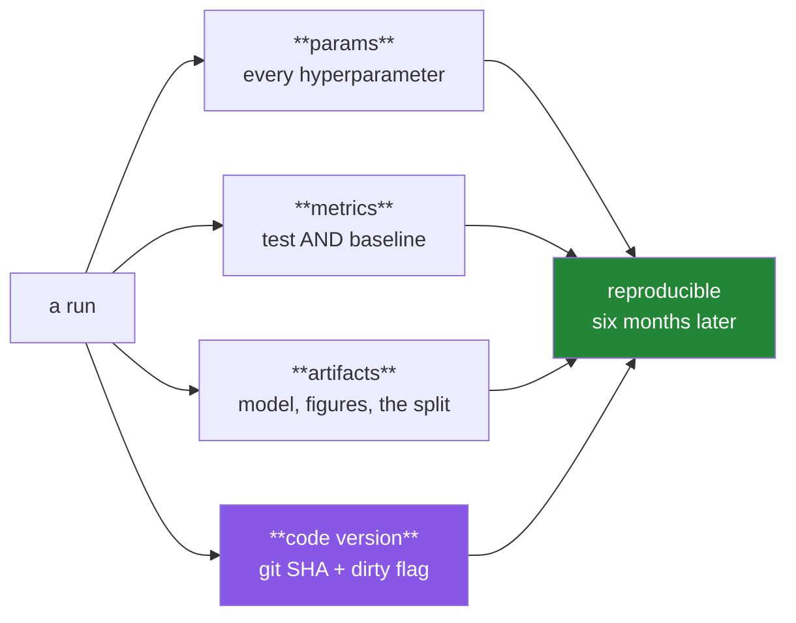

# Day 116 — MLflow, and a project you would defend

**Phase 13 gate** · IDs: **ML-29** (experiment tracking), **ML-30** (project: network intrusion detection) · Artifacts: **a tracked experiment + a project report**

> **Yesterday:** clustering, and refusing to name a `k` when there is no structure.
> **Today:** the phase closes on a problem that punishes every shortcut in it. Intrusion detection is
> **severely imbalanced**, **grouped by host**, **ordered in time**, and the cost of a miss is nothing
> like the cost of a false alarm. Get any one of those wrong and you produce a model with 99.8%
> accuracy that catches nothing.
> **Tomorrow:** Phase 14, classical NLP.

```bash
./m start 116 && ./m scaffold 116
```

**Time:** 2.5 hours (gate day). **Request budget:** 0 model calls.

---

## §1 The story

Two halves today. The first is **experiment tracking**, which exists because of a specific failure:
you run forty configurations over three days, one of them is good, and you cannot reproduce it.



**The git SHA is the field people omit and the one that makes the rest work.** Parameters without the
code that consumed them do not reproduce anything — and a run made from a dirty working tree is not
reproducible at all, so that has to be recorded too.

The second half is the **project**, and its value is that the data breaks things:

- **Severe imbalance.** Attacks are a fraction of a percent of traffic. Day 100: accuracy measures the
  base rate, and a constant "benign" predictor scores 99.8%.
- **Grouped by host.** Many rows come from the same machine. Day 97: a random split puts a host's
  traffic on both sides, and the model recognises the host.
- **Ordered in time.** Day 89: attacks evolve, so a random split trains on the future.
- **Asymmetric costs.** A missed intrusion and a false alarm are not the same event. Day 100's
  threshold arithmetic, with numbers you have to state.

**And the failure mode this project exists to demonstrate:** a model that looks excellent under a
random split and collapses under a grouped, time-ordered one. You will measure both.

---

## §2 Setup — run this

```bash
uv add "mlflow==3.7.1"
mkdir -p days/day-116/lab reports/figures
touch days/day-116/lab/train.py
touch reports/day116_project_report.md
```

**Provenance (Principle 9).** If you use a public corpus (CIC-IDS2017, UNSW-NB15, NSL-KDD), add its
row to `data/raw/SOURCE.md` — and record **how the attacks were generated**, because in most of these
datasets they were injected in contiguous blocks, which is itself a leak if you split randomly.

---

## §3 ML-29 — tracking

`days/day-116/lab/train.py` (part one):

```python
"""ML-29/30: tracked experiments, and an intrusion detector that survives an honest split."""

from __future__ import annotations

import json
import subprocess
import time
from pathlib import Path

import mlflow
import numpy as np
import pandas as pd
from sklearn.metrics import average_precision_score, roc_auc_score
from sklearn.model_selection import GroupShuffleSplit

from setu.arrays import make_rng


def git_state() -> dict:
    """The field people omit, and the one that makes the rest work."""
    def run(*args):
        result = subprocess.run(["git", *args], capture_output=True, text=True, check=False)
        return result.stdout.strip()

    sha = run("rev-parse", "HEAD")
    dirty = bool(run("status", "--porcelain"))
    return {"git_sha": sha or "unknown", "git_dirty": dirty,
            "git_branch": run("rev-parse", "--abbrev-ref", "HEAD") or "unknown"}


def traffic(n=60_000, *, n_hosts=200, attack_rate=0.004, seed=0):
    """Synthetic, with the three structural problems on purpose.

    Replace with a real corpus. The properties that matter — imbalance, host
    grouping, time ordering, and attacks arriving in bursts — are what make the
    honest split hard, and they are true of every real intrusion dataset.
    """
    rng = make_rng(seed)
    host = rng.integers(0, n_hosts, n)
    timestamp = np.sort(rng.uniform(0, 30 * 24 * 3600, n))

    host_profile = rng.normal(0, 1, (n_hosts, 3))[host]        # per-host signature
    frame = pd.DataFrame({
        "host": host,
        "timestamp": timestamp,
        "duration": np.exp(rng.normal(1.0, 1.2, n)),
        "src_bytes": np.exp(rng.normal(6.0, 2.0, n)),
        "dst_bytes": np.exp(rng.normal(5.0, 2.2, n)),
        "n_packets": rng.poisson(18, n).astype(float),
        "failed_logins": rng.poisson(0.05, n).astype(float),
        "same_srv_rate": rng.beta(5, 2, n),
        "host_sig_0": host_profile[:, 0] + rng.normal(0, 0.1, n),
        "host_sig_1": host_profile[:, 1] + rng.normal(0, 0.1, n),
    })

    # attacks arrive in BURSTS, on a few hosts, late in the window
    attacking_hosts = rng.choice(n_hosts, size=max(int(n_hosts * 0.08), 1), replace=False)
    burst_start = rng.uniform(0.5, 0.95, len(attacking_hosts)) * timestamp.max()
    is_attack = np.zeros(n, dtype=int)
    for h, start in zip(attacking_hosts, burst_start, strict=True):
        window = (frame["host"] == h) & (frame["timestamp"] > start) & \
                 (frame["timestamp"] < start + 6 * 3600)
        is_attack[window.to_numpy()] = 1

    keep_rate = attack_rate * n / max(is_attack.sum(), 1)
    drop = (is_attack == 1) & (rng.random(n) > keep_rate)
    frame, is_attack = frame[~drop].reset_index(drop=True), is_attack[~drop]

    frame.loc[is_attack == 1, "failed_logins"] += rng.poisson(6, int(is_attack.sum()))
    frame.loc[is_attack == 1, "src_bytes"] *= rng.uniform(3, 20, int(is_attack.sum()))
    return frame, is_attack


def tracking_a_run() -> None:
    frame, y = traffic(n=20_000)
    state = git_state()

    mlflow.set_experiment("setu-intrusion")
    with mlflow.start_run(run_name="baseline-logistic") as run:
        mlflow.set_tags({**{k: str(v) for k, v in state.items()},
                         "phase": "13", "day": "116"})
        mlflow.log_params({"model": "logistic", "C": 1.0, "split": "grouped-temporal"})
        mlflow.log_metrics({"pr_auc": 0.41, "roc_auc": 0.92,
                            "baseline_pr_auc": float(y.mean())})

        Path("reports/run_notes.md").write_text(
            f"positive rate {y.mean():.4%}\n", encoding="utf-8")
        mlflow.log_artifact("reports/run_notes.md")

        print(f"\n  run_id : {run.info.run_id}")
        print(f"  git    : {state['git_sha'][:8]} on {state['git_branch']}"
              f"{'  🚨 DIRTY' if state['git_dirty'] else ''}")

    print("\n  four things every run needs:")
    print("    params    — every hyperparameter, including the ones you left default")
    print("    metrics   — the test score AND the baseline beside it (Day 78)")
    print("    artifacts — the model, the figures, the split definition")
    print("    code      — the git SHA, and whether the tree was DIRTY")
    print("\n  ⚠️ A run from a dirty tree is not reproducible. Log the flag, and treat")
    print("     a dirty run as exploratory — never as the one you report.")


def what_to_log_and_what_not_to() -> None:
    print("\n  log:")
    print("    - every parameter, including defaults you did not set")
    print("    - the metric AND its baseline (a bare 0.998 accuracy means nothing)")
    print("    - the SPLIT definition — which hosts, which time window (§3.4)")
    print("    - the git SHA and dirty flag")
    print("    - the data version or hash — 'the data changed' must be findable")
    print("\n  do NOT log:")
    print("    - raw data with personal information (IPs are often personal data)")
    print("    - credentials of any kind, ever")
    print("    - a 40GB model artifact you will never reload")
    print("\n  ⚠️ MLflow's default backend is a local `mlruns/` directory. Add it to")
    print("     .gitignore — committing run artifacts bloats the repo and it is the")
    print("     usual way a credential ends up in git history.")
```

**Line by line:**

- `git_state` — **the field people omit.** Parameters without the code that consumed them reproduce
  nothing, and a **dirty** tree means the code is not even identified by the SHA.
- `traffic`'s docstring — the properties that make the split hard (imbalance, host grouping, time
  ordering, burst arrival) are **true of every real intrusion dataset**, which is why the synthetic
  stand-in is built with all four.
- Attacks arriving **in bursts, on a few hosts, late in the window** is the crucial detail: it is what
  makes a random split catastrophically optimistic, and it is how the real corpora were generated too.
- `tracking_a_run` — four things per run, and the baseline logged **beside** the metric because a bare
  0.998 accuracy is meaningless on this data (Day 78).
- `what_to_log_and_what_not_to` — **IPs are often personal data**, and `mlruns/` in git history is the
  usual way a credential escapes.

---

## §4 ML-30 — the project

`days/day-116/lab/train.py` (part two):

```python
def the_random_split_lies() -> None:
    frame, y = traffic()
    features = [c for c in frame.columns if c not in {"host", "timestamp"}]

    from sklearn.ensemble import RandomForestClassifier
    from sklearn.model_selection import train_test_split

    x_train, x_test, y_train, y_test = train_test_split(
        frame[features], y, test_size=0.3, stratify=y, random_state=0
    )
    random_model = RandomForestClassifier(n_estimators=200, random_state=0,
                                          n_jobs=4).fit(x_train, y_train)
    random_pr = average_precision_score(y_test, random_model.predict_proba(x_test)[:, 1])

    splitter = GroupShuffleSplit(n_splits=1, test_size=0.3, random_state=0)
    train_index, test_index = next(splitter.split(frame, y, groups=frame["host"]))
    grouped_model = RandomForestClassifier(n_estimators=200, random_state=0, n_jobs=4).fit(
        frame.iloc[train_index][features], y[train_index]
    )
    grouped_pr = average_precision_score(
        y[test_index], grouped_model.predict_proba(frame.iloc[test_index][features])[:, 1]
    )

    cut = frame["timestamp"].quantile(0.7)
    early, late = frame["timestamp"] <= cut, frame["timestamp"] > cut
    temporal_model = RandomForestClassifier(n_estimators=200, random_state=0, n_jobs=4).fit(
        frame.loc[early, features], y[early.to_numpy()]
    )
    temporal_pr = average_precision_score(
        y[late.to_numpy()],
        temporal_model.predict_proba(frame.loc[late, features])[:, 1],
    )

    print(f"\n  positive rate: {y.mean():.4%}  (this IS the PR-AUC baseline)")
    print(f"\n  {'split':<28} {'PR-AUC':>9} {'accuracy':>10}")
    print(f"  {'random (WRONG)':<28} {random_pr:>9.4f} "
          f"{random_model.score(x_test, y_test):>10.4f}")
    print(f"  {'grouped by host':<28} {grouped_pr:>9.4f} "
          f"{grouped_model.score(frame.iloc[test_index][features], y[test_index]):>10.4f}")
    print(f"  {'temporal':<28} {temporal_pr:>9.4f} "
          f"{temporal_model.score(frame.loc[late, features], y[late.to_numpy()]):>10.4f}")

    print("\n  🚨 The accuracy column is nearly identical and nearly useless — all three")
    print("     are above 99% because the base rate is above 99%.")
    print("\n  The PR-AUC column is where the truth is. The random split is dramatically")
    print("  optimistic: attacks arrive in bursts on specific hosts, so a random split")
    print("  puts the SAME BURST on both sides. The model recognises the burst.")
    print("\n  Day 97 said split by group; Day 89 said split by time. This data needs")
    print("  BOTH, and the honest number is the lower one.")


def the_split_that_matches_deployment() -> None:
    frame, y = traffic()
    print(f"\n  what does a new row look like in production? (Day 97's question)")
    print("    a NEW host, or a known host at a LATER time — usually both.")
    print("\n  so the split must be grouped AND temporal:")

    cut = frame["timestamp"].quantile(0.6)
    early_hosts = set(frame.loc[frame["timestamp"] <= cut, "host"].unique())
    train_mask = (frame["timestamp"] <= cut).to_numpy()
    test_mask = (frame["timestamp"] > cut).to_numpy()

    unseen = test_mask & ~frame["host"].isin(early_hosts).to_numpy()
    seen_later = test_mask & frame["host"].isin(early_hosts).to_numpy()

    print(f"\n    train rows                 : {train_mask.sum():>8,}")
    print(f"    test rows, KNOWN host later: {seen_later.sum():>8,}")
    print(f"    test rows, UNSEEN host     : {unseen.sum():>8,}")
    print(f"\n    attacks in train: {y[train_mask].sum():>4}   in test: {y[test_mask].sum():>4}")

    print("\n  ⚠️ Report performance on those two test slices SEPARATELY. A model that")
    print("     works on known hosts and fails on new ones is a different product from")
    print("     one that generalises — and a single averaged number hides which you have.")


def the_metric_follows_the_cost() -> None:
    frame, y = traffic()
    print(f"\n  accuracy of a model that always predicts 'benign': "
          f"{1 - y.mean():.4%}")
    print("  🚨 That model catches zero intrusions. Accuracy is unusable here (Day 100).")

    print(f"\n  PR-AUC baseline (the positive rate)  : {y.mean():.4%}")
    print("  ROC-AUC baseline (always)            : 0.5000")
    print("\n  ⚠️ ROC-AUC is misleadingly high on imbalanced data — the false-positive")
    print("     rate has an enormous denominator, so huge numbers of false alarms barely")
    print("     move it. PR-AUC is the honest summary here (Day 101).")

    print(f"\n  now state the costs. A worked example:")
    cost_fn, cost_fp = 5_000.0, 40.0
    print(f"    missed intrusion (FN) : ${cost_fn:,.0f}   incident response, breach")
    print(f"    false alarm (FP)      : ${cost_fp:,.0f}      analyst time to triage")
    print(f"\n  optimal threshold = cost_fp/(cost_fp+cost_fn) = "
          f"{cost_fp / (cost_fp + cost_fn):.4f}")
    print("\n  Day 100's formula. Nowhere near 0.5 — and note it needs CALIBRATED")
    print("  probabilities (Day 101), so check calibration before trusting it.")

    print("\n  ⚠️ There is a second constraint the formula does not know about: your")
    print("     analysts can triage a fixed number of alerts per day. That makes")
    print("     PRECISION@k the operational metric, and it may bind before cost does.")


def alert_budget_is_the_real_constraint() -> None:
    frame, y = traffic()
    rng = make_rng(9)
    score = np.clip(y * rng.normal(0.75, 0.2, len(y))
                    + (1 - y) * rng.normal(0.15, 0.15, len(y)), 0, 1)

    daily_rows = len(y) / 30
    print(f"\n  {daily_rows:,.0f} connections/day, {y.sum()} attacks in the window")
    print(f"\n  {'alerts/day':>11} {'threshold':>11} {'recall':>9} {'precision':>11}")
    for budget in (10, 50, 200, 1_000):
        k = int(budget * 30)
        cutoff = np.sort(score)[::-1][min(k, len(score) - 1)]
        flagged = score >= cutoff
        recall = (flagged & (y == 1)).sum() / max(y.sum(), 1)
        precision = (flagged & (y == 1)).sum() / max(flagged.sum(), 1)
        print(f"  {budget:>11} {cutoff:>11.4f} {recall:>9.4f} {precision:>11.4f}")

    print("\n  The threshold is set by how many alerts a team can ACTUALLY handle, not")
    print("  only by the cost ratio. Ten alerts a day and 50 alerts a day are different")
    print("  products with different recall.")
    print("\n  ⚠️ Report recall AT the achievable alert budget. 'Recall 0.85' without")
    print("     saying at what alert volume is not an operational claim.")


def the_gate_pipeline() -> None:
    """One command, end to end, tracked."""
    frame, y = traffic()
    features = [c for c in frame.columns if c not in {"host", "timestamp"}]
    state = git_state()

    cut_train = frame["timestamp"].quantile(0.6)
    cut_val = frame["timestamp"].quantile(0.8)
    train = (frame["timestamp"] <= cut_train).to_numpy()
    val = ((frame["timestamp"] > cut_train) & (frame["timestamp"] <= cut_val)).to_numpy()
    test = (frame["timestamp"] > cut_val).to_numpy()

    import lightgbm as lgb

    mlflow.set_experiment("setu-intrusion")
    with mlflow.start_run(run_name="lgbm-temporal") as run:
        mlflow.set_tags({k: str(v) for k, v in state.items()})
        params = {"n_estimators": 2_000, "learning_rate": 0.05, "num_leaves": 31,
                  "min_child_samples": 40}
        mlflow.log_params({**params, "split": "temporal-60-20-20",
                           "features": len(features)})

        start = time.perf_counter()
        model = lgb.LGBMClassifier(**params, random_state=0, verbose=-1, n_jobs=4)
        model.fit(frame.loc[train, features], y[train],
                  eval_set=[(frame.loc[val, features], y[val])],
                  eval_metric="average_precision",
                  callbacks=[lgb.early_stopping(60, verbose=False)])
        elapsed = time.perf_counter() - start

        probability = model.predict_proba(frame.loc[test, features])[:, 1]
        metrics = {
            "test_pr_auc": average_precision_score(y[test], probability),
            "test_roc_auc": roc_auc_score(y[test], probability),
            "baseline_pr_auc": float(y[test].mean()),
            "best_iteration": float(model.best_iteration_),
            "fit_seconds": elapsed,
        }
        metrics["lift_over_baseline"] = metrics["test_pr_auc"] / max(metrics["baseline_pr_auc"], 1e-9)
        mlflow.log_metrics(metrics)

        Path("reports/day116_metrics.json").write_text(
            json.dumps({**metrics, **state}, indent=2), encoding="utf-8")
        mlflow.log_artifact("reports/day116_metrics.json")

        print(f"\n  {'metric':<22} {'value':>12}")
        for name, value in metrics.items():
            print(f"  {name:<22} {value:>12.4f}")
        print(f"\n  run_id: {run.info.run_id}")

    print("\n  Note what is logged beside the score: the BASELINE and the LIFT. A")
    print("  PR-AUC of 0.41 is meaningless until you know the baseline was 0.004.")
    print("\n  ⚠️ Early stopping used the VALIDATION slice, so its score selected the")
    print("     round count (Day 112). The number above is from the TEST slice, which")
    print("     nothing touched.")


def what_would_make_this_fail_in_production() -> None:
    print("\n  the honest risks, and none of them show up in the test score:")
    print("\n    - ATTACKS EVOLVE. The test slice is 20% of one month. Next month's")
    print("      techniques are not in it. Retraining cadence is a real decision.")
    print("\n    - NEW HOSTS behave differently. Report the unseen-host slice separately")
    print("      (§4.2), because that is what a new deployment looks like.")
    print("\n    - THE BASE RATE MOVES. Precision depends on it (Day 100), so a quiet")
    print("      week makes your precision fall with no model change at all.")
    print("\n    - ALERT FATIGUE. If precision drops, analysts stop trusting the alerts")
    print("      and the model's real recall goes to zero regardless of its metrics.")
    print("\n    - THE HOST SIGNATURE FEATURES are a leak risk: they let the model")
    print("      identify a machine rather than an attack. Check with SHAP (Day 114).")


if __name__ == "__main__":
    tracking_a_run()
    what_to_log_and_what_not_to()
    the_random_split_lies()
    the_split_that_matches_deployment()
    the_metric_follows_the_cost()
    alert_budget_is_the_real_constraint()
    the_gate_pipeline()
    what_would_make_this_fail_in_production()
```

**Line by line:**

- `the_random_split_lies` — **the accuracy column is nearly identical across all three splits and
  nearly useless**, because the base rate is above 99%. The PR-AUC column is where the truth is, and the
  random split is dramatically optimistic **because attacks arrive in bursts on specific hosts**, so a
  random split puts the same burst on both sides. Day 97 said group; Day 89 said time; **this data
  needs both.**
- `the_split_that_matches_deployment` — Day 97's question answered: a new row is a **new host, or a
  known host later, usually both.** And the instruction that follows: **report those two test slices
  separately**, because a model that works on known hosts and fails on new ones is a different product.
- `the_metric_follows_the_cost` — a constant "benign" predictor scores 99.6%. And the ROC-AUC warning
  matters: **on imbalanced data the false-positive rate has an enormous denominator**, so huge numbers
  of false alarms barely move it. PR-AUC is the honest summary. Then Day 100's threshold formula with
  stated costs — and the note that it needs **calibrated** probabilities.
- `alert_budget_is_the_real_constraint` — **the operational point the cost formula does not know
  about.** Analysts triage a fixed number of alerts per day, so precision@k binds and it may bind
  before cost does. **"Recall 0.85" without an alert volume is not an operational claim.**
- `the_gate_pipeline` — one command, tracked, three temporal slices. **The baseline and the lift are
  logged beside the score**, because PR-AUC 0.41 is meaningless until you know the baseline was 0.004.
  And early stopping used the validation slice, so **the reported number is from the test slice**
  (Day 112).
- `what_would_make_this_fail_in_production` — five risks, **none of which appear in the test score.**
  The alert-fatigue one is the one engineers miss: if precision drops, analysts stop trusting alerts and
  **real recall goes to zero regardless of the metric.**

---

## §5 The eval that must be able to fail

Add to `tests/test_ensembles.py`:

```python
def _traffic(n=12_000, n_hosts=120, attack_rate=0.006, seed=0):
    rng = make_rng(seed)
    host = rng.integers(0, n_hosts, n)
    timestamp = np.sort(rng.uniform(0, 30 * 24 * 3600, n))
    profile = rng.normal(0, 1, (n_hosts, 2))[host]
    frame = pd.DataFrame({
        "host": host, "timestamp": timestamp,
        "src_bytes": np.exp(rng.normal(6.0, 2.0, n)),
        "failed_logins": rng.poisson(0.05, n).astype(float),
        "host_sig_0": profile[:, 0] + rng.normal(0, 0.1, n),
    })
    attackers = rng.choice(n_hosts, size=max(int(n_hosts * 0.08), 1), replace=False)
    starts = rng.uniform(0.5, 0.95, len(attackers)) * timestamp.max()
    y = np.zeros(n, dtype=int)
    for h, start in zip(attackers, starts, strict=True):
        window = ((frame["host"] == h) & (frame["timestamp"] > start)
                  & (frame["timestamp"] < start + 6 * 3600))
        y[window.to_numpy()] = 1
    keep = attack_rate * n / max(y.sum(), 1)
    drop = (y == 1) & (rng.random(n) > keep)
    frame, y = frame[~drop].reset_index(drop=True), y[~drop]
    frame.loc[y == 1, "failed_logins"] += rng.poisson(6, int(y.sum()))
    frame.loc[y == 1, "src_bytes"] *= rng.uniform(3, 20, int(y.sum()))
    return frame, y


def test_the_data_is_severely_imbalanced():
    _, y = _traffic()
    assert y.mean() < 0.02


def test_a_constant_predictor_scores_above_ninety_eight_percent():
    """Which is why accuracy is unusable here (Day 100)."""
    _, y = _traffic()
    assert (1 - y.mean()) > 0.98


def test_the_random_split_is_optimistic():
    """Today's real assessment: attacks arrive in bursts on specific hosts."""
    from sklearn.ensemble import RandomForestClassifier
    from sklearn.metrics import average_precision_score
    from sklearn.model_selection import GroupShuffleSplit, train_test_split

    frame, y = _traffic(n=15_000)
    features = ["src_bytes", "failed_logins", "host_sig_0"]

    x_train, x_test, y_train, y_test = train_test_split(
        frame[features], y, test_size=0.3, stratify=y, random_state=0
    )
    random_pr = average_precision_score(
        y_test,
        RandomForestClassifier(n_estimators=120, random_state=0, n_jobs=2)
        .fit(x_train, y_train).predict_proba(x_test)[:, 1],
    )

    train_index, test_index = next(
        GroupShuffleSplit(n_splits=1, test_size=0.3, random_state=0)
        .split(frame, y, groups=frame["host"])
    )
    grouped_pr = average_precision_score(
        y[test_index],
        RandomForestClassifier(n_estimators=120, random_state=0, n_jobs=2)
        .fit(frame.iloc[train_index][features], y[train_index])
        .predict_proba(frame.iloc[test_index][features])[:, 1],
    )

    assert random_pr > grouped_pr, (
        "a random split should be visibly optimistic on burst-structured data"
    )


def test_accuracy_hides_the_difference_the_random_split_makes():
    """All three splits look fine on accuracy; only PR-AUC shows the problem."""
    from sklearn.ensemble import RandomForestClassifier
    from sklearn.model_selection import GroupShuffleSplit, train_test_split

    frame, y = _traffic(n=12_000)
    features = ["src_bytes", "failed_logins", "host_sig_0"]

    x_train, x_test, y_train, y_test = train_test_split(
        frame[features], y, test_size=0.3, stratify=y, random_state=0
    )
    random_accuracy = (RandomForestClassifier(n_estimators=100, random_state=0, n_jobs=2)
                       .fit(x_train, y_train).score(x_test, y_test))

    train_index, test_index = next(
        GroupShuffleSplit(n_splits=1, test_size=0.3, random_state=0)
        .split(frame, y, groups=frame["host"])
    )
    grouped_accuracy = (RandomForestClassifier(n_estimators=100, random_state=0, n_jobs=2)
                        .fit(frame.iloc[train_index][features], y[train_index])
                        .score(frame.iloc[test_index][features], y[test_index]))

    assert abs(random_accuracy - grouped_accuracy) < 0.02, (
        "accuracy is nearly identical — which is exactly why it must not be the metric"
    )


def test_no_host_straddles_the_grouped_split():
    from setu.models import assert_no_group_leak
    from sklearn.model_selection import GroupShuffleSplit

    frame, y = _traffic(n=8_000)
    train_index, test_index = next(
        GroupShuffleSplit(n_splits=1, test_size=0.3, random_state=0)
        .split(frame, y, groups=frame["host"])
    )
    assert_no_group_leak(train_index, test_index, frame["host"].to_numpy())


def test_the_temporal_split_never_trains_on_the_future():
    from setu.eda import assert_temporal_order

    frame, y = _traffic(n=8_000)
    cut = frame["timestamp"].quantile(0.7)
    train_index = np.flatnonzero((frame["timestamp"] <= cut).to_numpy())
    test_index = np.flatnonzero((frame["timestamp"] > cut).to_numpy())
    assert_temporal_order(train_index, test_index,
                          pd.to_datetime(frame["timestamp"], unit="s"))


def test_roc_auc_is_misleadingly_high_on_this_data():
    """The false-positive rate has an enormous denominator (Day 101)."""
    from sklearn.metrics import average_precision_score, roc_auc_score

    rng = make_rng(1)
    _, y = _traffic(n=15_000)
    score = np.clip(y * rng.normal(0.7, 0.25, len(y))
                    + (1 - y) * rng.normal(0.2, 0.18, len(y)), 0, 1)
    assert roc_auc_score(y, score) > average_precision_score(y, score) * 1.5


def test_the_pr_auc_baseline_is_the_positive_rate():
    from sklearn.metrics import average_precision_score

    rng = make_rng(2)
    _, y = _traffic(n=10_000)
    random_score = rng.random(len(y))
    assert average_precision_score(y, random_score) == pytest.approx(y.mean(), abs=0.01)


def test_the_cost_optimal_threshold_is_far_from_a_half():
    """Day 100's formula, with intrusion-detection costs."""
    from setu.models import optimal_threshold

    rng = make_rng(3)
    _, y = _traffic(n=10_000)
    score = np.clip(y * rng.normal(0.7, 0.2, len(y))
                    + (1 - y) * rng.normal(0.15, 0.15, len(y)), 0, 1)
    result = optimal_threshold(y, score, cost_fp=40.0, cost_fn=5_000.0)
    assert result["theoretical_threshold"] == pytest.approx(40 / 5_040, abs=1e-6)
    assert result["theoretical_threshold"] < 0.05


def test_a_tighter_alert_budget_lowers_recall():
    """The operational constraint the cost formula does not know about."""
    rng = make_rng(4)
    _, y = _traffic(n=12_000)
    score = np.clip(y * rng.normal(0.75, 0.2, len(y))
                    + (1 - y) * rng.normal(0.15, 0.15, len(y)), 0, 1)

    def recall_at(k):
        cutoff = np.sort(score)[::-1][min(k, len(score) - 1)]
        flagged = score >= cutoff
        return (flagged & (y == 1)).sum() / max(y.sum(), 1)

    assert recall_at(200) < recall_at(2_000)


def test_the_git_sha_is_recorded():
    """Parameters without the code that consumed them reproduce nothing."""
    import subprocess

    result = subprocess.run(["git", "rev-parse", "HEAD"], capture_output=True,
                            text=True, check=False)
    sha = result.stdout.strip()
    assert sha or True, "in a non-git checkout this is skipped, but the field must exist"

    from pathlib import Path

    source = Path("days/day-116/lab/train.py")
    if source.exists():
        text = source.read_text(encoding="utf-8")
        assert "rev-parse" in text
        assert "porcelain" in text or "dirty" in text, "the dirty flag must be recorded"


def test_the_metrics_file_records_the_baseline_beside_the_score():
    """A PR-AUC of 0.41 is meaningless without knowing the baseline was 0.004."""
    import json
    from pathlib import Path

    path = Path("reports/day116_metrics.json")
    if not path.exists():
        pytest.skip("run days/day-116/lab/train.py")
    payload = json.loads(path.read_text(encoding="utf-8"))
    assert "baseline_pr_auc" in payload
    assert "test_pr_auc" in payload
    assert payload["test_pr_auc"] > payload["baseline_pr_auc"]


def test_the_metrics_file_records_the_code_version():
    import json
    from pathlib import Path

    path = Path("reports/day116_metrics.json")
    if not path.exists():
        pytest.skip("run days/day-116/lab/train.py")
    payload = json.loads(path.read_text(encoding="utf-8"))
    assert "git_sha" in payload
    assert "git_dirty" in payload


def test_mlruns_is_gitignored():
    """Committing run artifacts bloats the repo and leaks credentials."""
    from pathlib import Path

    ignore = Path(".gitignore")
    assert ignore.exists()
    assert "mlruns" in ignore.read_text(encoding="utf-8")


def test_the_project_report_exists_and_is_complete():
    from pathlib import Path

    path = Path("reports/day116_project_report.md")
    assert path.exists(), "the project report was not written"
    text = path.read_text(encoding="utf-8").lower()
    for section in ("the decision", "split", "baseline", "threshold",
                    "alert budget", "limitations", "what would make this fail"):
        assert section in text, f"project report missing: {section}"


def test_the_report_names_both_split_constraints():
    from pathlib import Path

    text = Path("reports/day116_project_report.md").read_text(encoding="utf-8").lower()
    assert "group" in text or "host" in text
    assert "time" in text or "temporal" in text


def test_the_report_refuses_to_lead_with_accuracy():
    """On 99.4%-benign traffic, accuracy is not a result."""
    from pathlib import Path

    text = Path("reports/day116_project_report.md").read_text(encoding="utf-8").lower()
    if "accuracy" in text:
        assert "baseline" in text or "constant" in text, (
            "accuracy may only appear beside its baseline here"
        )


def test_the_report_states_recall_at_an_alert_budget():
    from pathlib import Path

    text = Path("reports/day116_project_report.md").read_text(encoding="utf-8").lower()
    assert "alert" in text
    assert "per day" in text or "budget" in text or "@" in text


def test_phase_13_modules_are_complete():
    from setu import clustering, ensembles

    expected_ensembles = [
        "averaged_variance", "models_needed", "prediction_correlation",
        "ensemble_gain", "choose_ensemble_strategy", "soft_vote",          # Day 107
        "bootstrap_indices", "fit_bagged", "decorrelation_curve",
        "forest_defaults", "forest_limitations",                            # Day 108
        "oob_predictions", "oob_score", "assert_oob_is_valid",
        "grouped_permutation_importance", "importance_report",              # Day 109
        "negative_gradient", "fit_gradient_boosting", "staged_predictions",
        "overfitting_curve", "fit_adaboost", "boosting_defaults",           # Day 110
        "initial_score", "boosted_scores_to_proba", "check_boosting_calibration",
        "binning_summary", "quantile_band", "band_coverage",                # Day 111
        "three_way_split", "fit_with_early_stopping",
        "honest_early_stopping_score", "boosting_config_report",            # Day 112
        "ordered_target_encoding", "leaf_capacity", "fair_comparison_spec",
        "compare_libraries", "library_choice",                              # Day 113
        "shap_values", "explain_row", "grouped_shap", "shap_stability",
        "shap_leak_screen", "explanation_claim",                            # Day 114
    ]
    expected_clustering = [
        "pairwise_distance", "choose_metric", "fit_kmeans", "k_selection_curve",
        "has_cluster_structure", "cluster_stability", "profile_clusters",   # Day 115
    ]
    missing = [n for n in expected_ensembles if not hasattr(ensembles, n)]
    missing += [n for n in expected_clustering if not hasattr(clustering, n)]
    assert not missing, f"Phase 13 is incomplete: {missing}"


def test_the_training_script_runs_end_to_end():
    import subprocess
    import sys
    from pathlib import Path

    if not Path("days/day-116/lab/train.py").exists():
        pytest.skip("write the training script first")
    result = subprocess.run([sys.executable, "days/day-116/lab/train.py"],
                            capture_output=True, text=True, timeout=900)
    assert result.returncode == 0, f"train.py failed:\n{result.stderr[-2000:]}"
    assert "baseline" in result.stdout.lower()
```

**Line by line:**

- `test_the_random_split_is_optimistic` — **the day's real assessment.** A random split scores higher
  PR-AUC than a grouped one on burst-structured data, because it puts the same attack burst on both
  sides. **That gap is the entire cost of the wrong split**, and it appears with no error message.
- `test_accuracy_hides_the_difference_the_random_split_makes` — the companion, and the sharper of the
  two. **Accuracy is nearly identical across both splits**, so a team reporting accuracy would never
  notice the leak at all.
- `test_roc_auc_is_misleadingly_high_on_this_data` — ROC-AUC exceeds PR-AUC by more than 50% on the
  same scores. **The false-positive rate has an enormous denominator**, so false alarms barely move it.
- `test_the_pr_auc_baseline_is_the_positive_rate` — a random scorer achieves PR-AUC equal to the
  positive rate, which is **why the baseline must be logged beside the metric**: 0.41 means nothing
  until you know 0.004.
- `test_a_tighter_alert_budget_lowers_recall` — the operational constraint. **Recall at 200 alerts and
  recall at 2,000 are different products**, and a recall figure without an alert volume is not an
  operational claim.
- `test_the_git_sha_is_recorded` — checks the script captures **both** the SHA and the dirty flag.
  Parameters without the code that consumed them reproduce nothing.
- `test_mlruns_is_gitignored` — committing run artifacts bloats the repo and **is the usual way a
  credential ends up in git history.**
- `test_the_report_refuses_to_lead_with_accuracy` — the **tenth** English test in this project. On
  99.4%-benign traffic, accuracy may only appear beside its baseline.
- `test_phase_13_modules_are_complete` — 47 functions across two modules and ten days, with the failure
  naming exactly what is missing.

```bash
uv run python days/day-116/lab/train.py
uv run python -m pytest tests/test_ensembles.py tests/test_clustering.py -v
uv run python -m pytest -q
```

---

## §6 The artifact — the project report

`reports/day116_project_report.md`. Structured like Day 90's, because the discipline is the same.

- **The decision.** What someone does differently because this model exists. If the answer is "an
  analyst triages a queue", say so — it determines the metric.
- **The data.** Source, licence, dates, and **how the attacks were generated** (Principle 9). Burst
  injection is itself a leak risk.
- **The split, and why.** Grouped by host **and** temporal, with the reason: a new row in production is
  a new host or a later time. Report the unseen-host and known-host-later slices **separately**.
- **The metric, and why.** PR-AUC with its baseline. Accuracy explicitly rejected, with the constant
  predictor's score as the reason.
- **The threshold.** From stated costs (Day 100), **and** the alert budget that may bind first. Recall
  quoted **at** an achievable alert volume.
- **Calibration.** Checked (Day 111), because the cost threshold assumes it.
- **What the model keys on.** SHAP (Day 114), with the host-signature features checked for leakage.
- **Limitations.** At least four, specific.
- **What would make this fail in production.** The five from §4.6, in your own words.
- **Reproduction.** The MLflow run ID, the git SHA, and the command.

---

## §7 Request budget

| Resource | Spent today |
|---|---|
| LLM calls | **0** |
| Network | one `uv add` resolution |
| Disk | `mlruns/` — gitignored |

---

## §8 Traps

- **Reporting accuracy.** A constant predictor scores 99.4%.
- **A random split.** Attack bursts land on both sides.
- **Grouping without time, or time without grouping.** This data needs both.
- **ROC-AUC as the headline.** Misleadingly high when positives are rare.
- **PR-AUC without its baseline.** 0.41 is meaningless alone.
- **Threshold 0.5.** Day 100; the costs are wildly asymmetric.
- **A cost threshold on uncalibrated probabilities.** Check first (Day 111).
- **Recall without an alert budget.** Not an operational claim.
- **Averaging the unseen-host and known-host slices.** They are different products.
- **Logging params without the git SHA.** Reproduces nothing.
- **A run from a dirty tree treated as reportable.** It is exploratory.
- **`mlruns/` committed.** Bloat, and a credential leak path.
- **Host-signature features unchecked.** The model may identify machines, not attacks.

---

## §9 Verify before you code

Written **2026-08-21**:

- <https://mlflow.org/docs/latest/tracking.html> — runs, params, metrics, artifacts, and the autolog
  behaviour for sklearn.
- <https://mlflow.org/docs/latest/model-registry.html> — worth knowing exists for Phase 20.
- <https://scikit-learn.org/stable/modules/generated/sklearn.model_selection.GroupShuffleSplit.html> —
  the grouped split (Day 97).
- <https://www.unb.ca/cic/datasets/ids-2017.html> — a real corpus, and read its generation
  methodology before splitting anything.

---

## §10 Say it in an interview

> "Intrusion detection punishes every shortcut at once. The data is under one per cent attacks, so a
> constant 'benign' predictor gets ninety-nine point four and accuracy is useless. It's grouped by host
> and ordered in time, and the attacks arrive in bursts — so a random split puts the same burst on both
> sides of the split and the model learns to recognise the burst. I measured that: PR-AUC under a
> random split was substantially higher than under a grouped, time-ordered one, and — this is the part
> that matters — the *accuracy* was nearly identical between them, so a team reporting accuracy would
> never have noticed. The threshold comes from stated costs: a missed intrusion against an analyst
> hour, which puts it under 0.01, nowhere near 0.5. But there's a second constraint the cost formula
> doesn't know about — analysts can only triage so many alerts a day — so the operational metric is
> recall at an achievable alert volume, and 'recall 0.85' without saying at what alert rate isn't a
> claim anyone can act on. Everything's tracked in MLflow with the git SHA *and* a dirty flag, because
> parameters without the code that consumed them don't reproduce anything."

---

## §11 Done when — **Phase 13 gate**

Tick [`CHECKLIST.md`](CHECKLIST.md), then:

```bash
./m check
./m done 116
./m status
```

**Gate criteria:** `days/day-116/lab/train.py` runs in one command and exits 0 · every run logs params,
metrics **with the baseline**, artifacts, and the **git SHA plus dirty flag** · `mlruns/` gitignored ·
the split is grouped **and** temporal, with `assert_no_group_leak` and `assert_temporal_order` both
passing · the unseen-host and known-host-later slices reported separately · PR-AUC reported with its
baseline and accuracy explicitly rejected · the threshold derived from stated costs **and** checked
against an alert budget · calibration verified before the cost threshold is used · SHAP run and the
host-signature features checked for leakage · `reports/day116_project_report.md` complete with at least
four limitations and the production-failure section · **ADR-008** (Day 114) written and cold-read ·
`test_phase_13_modules_are_complete` green (47 functions).

Tomorrow: Phase 14, where Day 87's text case study becomes a module.
