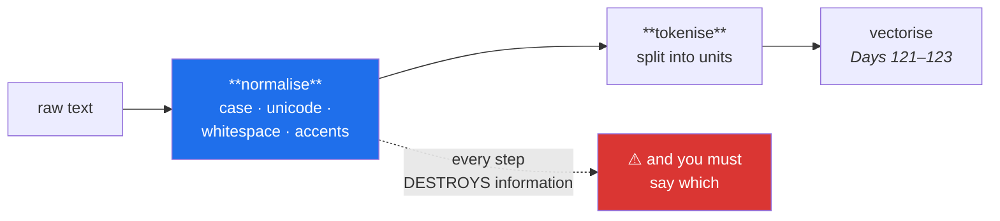

# Day 117 — Normalisation and tokenisation

**Phase 14 · Module 14 · Classical NLP** · IDs: **NLP-01** (what NLP is), **NLP-02** (normalisation and tokenisation)

> **Yesterday:** Phase 13 closed with a tracked intrusion detector and an honest split.
> **Today:** Day 87 met text as a case study and found that every preprocessing choice is a modelling
> decision. This phase makes that a module. Today is the first step of every text pipeline ever
> written — **splitting a string into units** — and it is far less obvious than it looks.
> **Tomorrow:** stemming, lemmatisation, and when stopwords carry meaning.

```bash
./m start 117 && ./m scaffold 117
```

**Time:** 110 minutes. **Request budget:** 0 model calls.

---

## §1 The story

Every model in this project needed numbers. Text is not numbers, and the pipeline that fixes that
starts here:



**Normalisation is deliberate information loss.** Lowercasing merges `US` (the country) with `us` (the
pronoun) and `Apple` with `apple`. Stripping punctuation destroys `U.S.` and turns `don't` into
`dont`. Each of those is a decision about what distinctions matter for *your* task, and the default
answer — do all of it, silently — is how Day 87's negation problem happened.

**Tokenisation is harder than `split()`.** Consider what a "word" is:

- `don't` — one token or two? (`do` + `n't` is what most linguists and most taggers want.)
- `New York` — two tokens that mean one thing.
- `state-of-the-art` — one token, or four?
- `https://example.com/a?b=1` — one token, or a disaster?
- `😊` — a token, and it carries sentiment.
- `東京都` — no spaces at all; whitespace splitting produces one token for a whole sentence.

`text.split()` gets every one of those wrong. And the last is the important one: **whitespace
tokenisation is an assumption about the writing system**, not a neutral default.

Then the thing that makes today's care worth it: **`len(vocabulary)` is decided here.** Your
normalisation choices determine how many distinct tokens exist, which determines your feature count
(Day 121), your sparsity, and how many rare tokens get dropped by `min_df`. A change that looks
cosmetic changes the dataset.

---

## §2 Setup — run this

```bash
uv add "nltk==3.10" "spacy==3.9.2"
python -m spacy download en_core_web_sm
mkdir -p days/day-117/lab
touch days/day-117/lab/tokenise.py
touch src/setu/nlp.py
touch tests/test_nlp.py
```

**Note the model download.** `en_core_web_sm` is ~13 MB and is **not** a pip dependency — it is
downloaded at runtime, which means CI needs it too. Record it in `docs/PINS_DS.md` beside the package
version; a pinned library with an unpinned model is not reproducible.

---

## §3 NLP-01 / NLP-02 — splitting text

`days/day-117/lab/tokenise.py`:

```python
"""NLP-01/02: normalisation and tokenisation — every choice destroys something."""

from __future__ import annotations

import re
import unicodedata

SAMPLES = [
    "Don't split this wrong — it's harder than it looks.",
    "The U.S. GDP rose 3.2% in Q1; see https://bea.gov/data for details.",
    "State-of-the-art results 😊 #NLP @setu_ai",
    "Dr. Smith paid $1,234.56 on 2026-08-21.",
    "Café naïve résumé — accented text matters.",
    "東京都は日本の首都です",
]


def what_nlp_actually_is() -> None:
    print("\n  every model since Day 91 needed a matrix of numbers.")
    print("  Text is a sequence of characters. NLP is the discipline of bridging that,")
    print("  and classical NLP does it in three steps:")
    print("\n    1. NORMALISE  — decide which surface differences do not matter")
    print("    2. TOKENISE   — split into units")
    print("    3. VECTORISE  — map units to numbers (Days 121–123)")
    print("\n  Steps 1 and 2 are where the modelling decisions live, and they happen")
    print("  BEFORE any model exists — which is why Day 87 called them modelling")
    print("  decisions rather than cleaning.")


def naive_split_fails() -> None:
    print("\n  `text.split()` on each sample:")
    for text in SAMPLES:
        tokens = text.split()
        print(f"\n    {text[:52]}")
        print(f"      -> {tokens[:8]}")

    print("\n  🚨 What went wrong, sample by sample:")
    print("    1. \"Don't\"      — punctuation glued to the word; 'looks.' != 'looks'")
    print("    2. \"U.S.\"       — the period is part of the token, and the URL is one blob")
    print("    3. \"#NLP\"       — hashtag kept (good) but the emoji glued to a word")
    print("    4. \"$1,234.56\"  — a number, split or not depending on your luck")
    print("    5. accents      — preserved, which may or may not be what you want")
    print("    6. Japanese     — ONE token for an entire sentence")
    print("\n  The last one is the general lesson: whitespace splitting is an ASSUMPTION")
    print("  about the writing system. Chinese, Japanese and Thai have no word spaces.")


def normalisation_destroys_information() -> None:
    text = "The US Department said Apple's iOS beat MS-DOS. It cost US$5."

    print(f"\n  original : {text}")
    print(f"  lowered  : {text.lower()}")
    print("\n  🚨 what was destroyed:")
    print("    'US' (country)     -> 'us' (pronoun)")
    print("    'Apple' (company)  -> 'apple' (fruit)")
    print("    'MS-DOS'           -> 'ms-dos'")
    print("    'US$'              -> 'us$'")

    print("\n  Lowercasing is usually right — it halves your vocabulary and 'The' and")
    print("  'the' really are the same word. But it is a CHOICE with named costs, and")
    print("  for NER (Day 120) capitalisation is one of the strongest signals there is.")

    print(f"\n  and punctuation:")
    for original in ("U.S.", "don't", "state-of-the-art", "3.2%", "$1,234.56"):
        stripped = re.sub(r"[^\w\s]", "", original)
        print(f"    {original:<20} -> {stripped}")
    print("\n  'U.S.' becomes 'US', 'don't' becomes 'dont', '3.2%' becomes '32'.")
    print("  ⚠️ That last one is not a cosmetic change — it is a different NUMBER.")


def unicode_is_not_optional() -> None:
    composed = "café"                       # é as one code point
    decomposed = "cafe\u0301"               # e + combining acute

    print(f"\n  two strings that LOOK identical:")
    print(f"    composed   : {composed!r}  len={len(composed)}")
    print(f"    decomposed : {decomposed!r}  len={len(decomposed)}")
    print(f"    equal?     : {composed == decomposed}")
    print(f"    after NFC  : {unicodedata.normalize('NFC', composed) == unicodedata.normalize('NFC', decomposed)}")

    print("\n  🚨 Without unicode normalisation those are two different vocabulary")
    print("     entries, and no amount of lowercasing merges them.")
    print("\n  ⚠️ Text from different sources — one export, one scrape, one hand-typed —")
    print("     routinely mixes the two. Always NFC-normalise at the boundary.")

    print(f"\n  and the invisible ones:")
    tricky = "hello\u200bworld\u00a0there\ufeff"
    print(f"    {tricky!r}")
    print(f"    splits into: {tricky.split()}")
    print("    ^ a zero-width space, a non-breaking space, and a BOM.")
    print("    The non-breaking space does NOT split, so 'world there' is one token.")


def regex_tokenisation() -> None:
    pattern = re.compile(r"""
        (?:https?://\S+)              # URLs first — they contain everything else
        | (?:[@#]\w+)                 # mentions and hashtags
        | (?:\d+(?:[.,]\d+)*%?)       # numbers, including 1,234.56 and 3.2%
        | (?:\w+(?:['-]\w+)*)         # words with internal apostrophes or hyphens
        | (?:[^\w\s])                 # any remaining single punctuation
    """, re.VERBOSE | re.UNICODE)

    print("\n  a regex tokeniser — ORDER MATTERS, URLs must be tried first:")
    for text in SAMPLES[:4]:
        print(f"\n    {text[:52]}")
        print(f"      -> {pattern.findall(text)[:10]}")

    print("\n  Better, and still wrong in places: 'Dr.' loses its period, and the")
    print("  hyphenation rule is a guess. But it is EXPLICIT and INSPECTABLE, which a")
    print("  library tokeniser's internal rules are not.")
    print("\n  ⚠️ Write the regex once to understand what a tokeniser does. Then use a")
    print("     library, because the edge cases are endless (Principle 2).")


def library_tokenisers_disagree() -> None:
    text = "Don't visit https://x.com — Dr. Smith's U.S. co-op costs $1,234.56."

    print(f"\n  {text}")
    print(f"\n  {'tokeniser':<18} {'n':>4}  tokens")
    print(f"  {'str.split()':<18} {len(text.split()):>4}  {text.split()[:6]}")

    try:
        import nltk

        try:
            tokens = nltk.word_tokenize(text)
        except LookupError:
            nltk.download("punkt_tab", quiet=True)
            tokens = nltk.word_tokenize(text)
        print(f"  {'nltk.word_tokenize':<18} {len(tokens):>4}  {tokens[:6]}")
    except Exception as error:                                   # noqa: BLE001
        print(f"  nltk unavailable: {type(error).__name__}")

    try:
        import spacy

        nlp = spacy.load("en_core_web_sm", disable=["parser", "ner", "tagger"])
        tokens = [t.text for t in nlp(text)]
        print(f"  {'spacy':<18} {len(tokens):>4}  {tokens[:6]}")
    except Exception as error:                                   # noqa: BLE001
        print(f"  spacy unavailable: {type(error).__name__} — run the model download")

    print("\n  Different token counts from the same string. Note especially:")
    print("    - NLTK splits \"Don't\" into 'Do' + \"n't\"")
    print("    - spaCy keeps the URL as one token; NLTK may not")
    print("    - both keep 'U.S.' intact, which the naive split does not")
    print("\n  🚨 There is no 'correct' tokenisation. There is only one that matches")
    print("     what the next step expects — and if you change tokenisers, your")
    print("     vocabulary and every downstream feature change with it.")


def tokenisation_decides_the_vocabulary() -> None:
    corpus = [
        "The cat sat on the mat.", "THE CAT SAT!", "the cats sat...",
        "Don't sit — the cat's mat.", "A café; a naïve cat.",
    ]

    def vocabulary(tokens_per_document):
        return {token for tokens in tokens_per_document for token in tokens}

    variants = {
        "split() only": [t.split() for t in corpus],
        "+ lowercase": [t.lower().split() for t in corpus],
        "+ strip punctuation": [re.sub(r"[^\w\s]", "", t.lower()).split() for t in corpus],
        "+ NFKD strip accents": [
            re.sub(r"[^\w\s]", "",
                   unicodedata.normalize("NFKD", t.lower())
                   .encode("ascii", "ignore").decode()).split()
            for t in corpus
        ],
    }

    print(f"\n  {'pipeline':<24} {'vocabulary':>11} {'tokens':>8}")
    for label, tokenised in variants.items():
        total = sum(len(t) for t in tokenised)
        print(f"  {label:<24} {len(vocabulary(tokenised)):>11} {total:>8}")

    print("\n  Each step SHRINKS the vocabulary — which is usually the point, because a")
    print("  smaller vocabulary means fewer features and less sparsity (Day 121).")
    print("\n  ⚠️ But 'café' and 'cafe' becoming one token is a decision. So is 'cat's'")
    print("     becoming 'cats' and merging with the plural. Both are defensible; both")
    print("     must be RECORDED, because they change the dataset (Day 87).")


def what_you_must_never_normalise_away() -> None:
    print("\n  task-dependent, and getting this wrong is silent:")
    print(f"\n  {'if the task is…':<26} {'keep':<24} {'because'}")
    rows = [
        ("sentiment", "negation, emoji, CAPS", "'not good' and 😊 carry the signal"),
        ("NER (Day 120)", "capitalisation", "'apple' vs 'Apple' is the whole task"),
        ("code or logs", "punctuation, case", "they are syntax, not decoration"),
        ("author attribution", "everything, nearly", "style IS the signal"),
        ("topic modelling", "little; strip freely", "content words dominate"),
        ("search", "case-fold, keep accents", "users type 'cafe' and 'café'"),
    ]
    for task, keep, because in rows:
        print(f"  {task:<26} {keep:<24} {because}")

    print("\n  🚨 The default pipeline — lowercase, strip punctuation, drop stopwords —")
    print("     is close to WORST-CASE for sentiment and NER, and fine for topics.")
    print("     Day 87 showed the stopword half of that; Day 118 finishes it.")


def sentence_splitting_is_also_hard() -> None:
    text = ("Dr. Smith went to Washington D.C. on Jan. 5. He met Prof. Jones. "
            "The cost was $1.5M. It rose 3.2% vs. last year!")

    naive = [s.strip() for s in text.split(".") if s.strip()]
    print(f"\n  splitting on '.' gives {len(naive)} 'sentences':")
    for sentence in naive[:5]:
        print(f"    {sentence[:46]}")

    print("\n  🚨 'Dr', 'Smith went to Washington D', 'C' — abbreviations break it.")

    try:
        import spacy

        nlp = spacy.load("en_core_web_sm", disable=["ner"])
        sentences = [s.text.strip() for s in nlp(text).sents]
        print(f"\n  spaCy gives {len(sentences)}:")
        for sentence in sentences:
            print(f"    {sentence}")
    except Exception:                                            # noqa: BLE001
        print("\n  spaCy unavailable — run the model download to see the comparison")

    print("\n  Sentence boundaries need to know abbreviations, decimals and titles.")
    print("  ⚠️ It matters whenever your unit of analysis is a sentence: sentiment per")
    print("     sentence, or chunking documents for retrieval (Phase 18).")


if __name__ == "__main__":
    what_nlp_actually_is()
    naive_split_fails()
    normalisation_destroys_information()
    unicode_is_not_optional()
    regex_tokenisation()
    library_tokenisers_disagree()
    tokenisation_decides_the_vocabulary()
    what_you_must_never_normalise_away()
    sentence_splitting_is_also_hard()
```

**Line by line:**

- `naive_split_fails` — **run this first and read all six failures.** The Japanese sample is the
  general lesson: `split()` returns one token for an entire sentence, because **whitespace tokenisation
  is an assumption about the writing system**, not a neutral default.
- `normalisation_destroys_information` — `US` → `us`, `Apple` → `apple`. Lowercasing is usually right
  and it is **a choice with named costs** — for NER (Day 120) capitalisation is one of the strongest
  signals available. And `3.2%` → `32` is not cosmetic; it is a **different number**.
- `unicode_is_not_optional` — two strings that look identical, compare unequal, and become **two
  vocabulary entries** that no amount of lowercasing merges. Text from mixed sources routinely contains
  both forms. And the invisible characters: **a non-breaking space does not split**, so `world there`
  becomes one token.
- `regex_tokenisation` — **order matters**: URLs must be tried first because they contain every other
  pattern. The result is still wrong in places, but it is **explicit and inspectable**, which a library's
  internal rules are not. Write it once to understand; then use a library (Principle 2).
- `library_tokenisers_disagree` — **different token counts from the same string.** NLTK splits `Don't`
  into `Do` + `n't`; spaCy keeps the URL whole. **There is no "correct" tokenisation** — only one that
  matches what the next step expects, and changing tokenisers changes every downstream feature.
- `tokenisation_decides_the_vocabulary` — each normalisation step shrinks the vocabulary, which is
  usually the point (fewer features, less sparsity, Day 121). **But `café` and `cafe` merging is a
  decision**, and so is `cat's` merging with `cats`. Both defensible, both must be recorded.
- `what_you_must_never_normalise_away` — **the default pipeline is close to worst-case for sentiment
  and NER**, and fine for topic modelling. Day 87 showed the stopword half; Day 118 finishes it.
- `sentence_splitting_is_also_hard` — splitting on `.` produces `Dr`, `Smith went to Washington D`, `C`.
  It matters whenever your unit is a sentence — including **chunking documents for retrieval in
  Phase 18.**

---

## §4 Build brief — `src/setu/nlp.py`

New module. Layer 2.

```python
"""Classical NLP for Setu. Layer 2."""

from __future__ import annotations

from dataclasses import dataclass

from setu.errors import DataError

INVISIBLE = "\u200b\u200c\u200d\ufeff\u00ad"      # zero-width and soft hyphen


@dataclass(frozen=True)
class NormaliseSpec:
    """The decisions, as a value that can be stored beside a model (Day 87's TextSpec)."""
    unicode_form: str = "NFC"
    lowercase: bool = True
    strip_accents: bool = False
    collapse_whitespace: bool = True
    remove_invisible: bool = True
    strip_punctuation: bool = False
    keep_emoji: bool = True


def normalise(text: str, spec: NormaliseSpec) -> dict:
    """TODO(me): apply the spec, and REPORT what changed.

    {"text": str, "changed": [...], "original_length", "final_length"}
    - unicode normalisation ALWAYS runs first; a later step on mixed forms is wrong
    - `changed` names each step that actually altered the string, so a caller can see
      that stripping accents did something rather than assuming it did not
    - remove_invisible strips INVISIBLE but must NOT strip a non-breaking space —
      that is a real space and collapse_whitespace handles it
    - raise DataError on an unknown unicode_form, listing NFC/NFD/NFKC/NFKD
    - must not mutate the input (strings are immutable, but the spec must not be either)
    """
    raise NotImplementedError


def validate_spec(spec: NormaliseSpec, *, task: str) -> dict:
    """TODO(me): §3.7 — is this pipeline appropriate for this task? PURE.

    {"spec", "warnings": [...], "blocking": [...]}
    - task='ner' with lowercase=True -> BLOCKING: capitalisation is the signal
    - task='sentiment' with strip_punctuation=True -> warn: '!' and '?' carry signal
    - task='sentiment' with keep_emoji=False -> warn
    - task='code' with lowercase or strip_punctuation -> BLOCKING: that is syntax
    - task='search' with strip_accents=False -> warn that users type both forms
    - the difference between `warnings` and `blocking` matters: blocking means the
      pipeline defeats the task, not merely that it costs something
    - raise DataError on an unknown task, listing the known ones
    """
    raise NotImplementedError


def tokenise(text: str, *, pattern: str = "default") -> list[str]:
    """TODO(me): a regex tokeniser, from scratch (§3.5).

    - pattern='default' handles, IN THIS ORDER: URLs, @mentions and #hashtags,
      numbers with separators and percents, words with internal apostrophes or
      hyphens, then any remaining single punctuation character
    - the ORDER is the correctness detail: a URL contains dots, slashes and words,
      so it must match before any of those patterns get a chance
    - pattern='whitespace' is provided so a test can demonstrate its failures
    - raise DataError on an unknown pattern
    - the docstring must state that this is for UNDERSTANDING and that a library
      tokeniser should be used in production (Principle 2)
    """
    raise NotImplementedError


def vocabulary_impact(documents, specs: dict) -> dict:
    """TODO(me): §3.6 — how much does each normalisation choice shrink the vocabulary?

    {"results": {name: {"vocabulary_size", "total_tokens", "type_token_ratio"}},
     "reductions": {name: float}, "note": str}
    - type_token_ratio is vocabulary_size / total_tokens — a rough diversity measure
    - reductions are relative to the FIRST spec given, so the caller controls the
      baseline rather than the function guessing
    - the note must say that a smaller vocabulary is usually good AND that each
      merge is a decision that must be recorded (§3.6)
    - raise DataError on fewer than 2 specs, or an empty corpus
    """
    raise NotImplementedError


def tokeniser_agreement(text: str, tokenisers: dict) -> dict:
    """TODO(me): §3.5's comparison, as data.

    {"counts": {name: int}, "tokens": {name: [...]}, "shared": [...],
     "disagreements": [(name_a, name_b, jaccard)], "note": str}
    - shared is the set of tokens every tokeniser produced
    - jaccard between each pair, so 'they disagree' becomes a number
    - the note must say there is no CORRECT tokenisation, only one matching what the
      next step expects — and that changing tokenisers changes the vocabulary
    - raise DataError on fewer than 2 tokenisers
    """
    raise NotImplementedError


def assert_normalisation_recorded(spec: NormaliseSpec, *, recorded_in: str | None) -> None:
    """TODO(me): raise DataError if a non-default spec is not written down anywhere.

    - a pipeline that lowercases, strips accents and drops punctuation has produced
      a DIFFERENT DATASET (Day 87); a model trained on it cannot be reproduced from
      the raw text without the spec
    - passes when recorded_in names a file, or when the spec is the documented default
    - the message must say which non-default choices are unrecorded
    """
    raise NotImplementedError
```

- `normalise` running **unicode normalisation first** is a real ordering requirement: lowercasing a
  decomposed `é` and a composed `é` still leaves two different strings.
- `validate_spec` distinguishing **blocking from warning** is the day's design decision. Lowercasing
  for NER does not merely cost something — it **removes the signal the task depends on**, and that is a
  different category of mistake.
- `tokenise`'s **pattern order** is the correctness detail worth testing: a URL contains dots, slashes
  and words, so it must match before any of those.

---

## §5 The eval that must be able to fail

`tests/test_nlp.py`:

```python
import unicodedata

import pytest

from setu.errors import DataError
from setu.nlp import (
    INVISIBLE,
    NormaliseSpec,
    assert_normalisation_recorded,
    normalise,
    tokenise,
    tokeniser_agreement,
    validate_spec,
    vocabulary_impact,
)


def test_composed_and_decomposed_forms_are_merged():
    """Without this they are two vocabulary entries that lowercasing cannot merge."""
    composed = "café"
    decomposed = "cafe\u0301"
    assert composed != decomposed

    spec = NormaliseSpec(unicode_form="NFC", lowercase=False)
    assert normalise(composed, spec)["text"] == normalise(decomposed, spec)["text"]


def test_unicode_normalisation_runs_before_lowercasing():
    """Lowercasing mixed forms still leaves two different strings."""
    spec = NormaliseSpec(unicode_form="NFC", lowercase=True)
    assert normalise("CAFÉ", spec)["text"] == normalise("CAFE\u0301", spec)["text"]


def test_invisible_characters_are_removed():
    spec = NormaliseSpec(remove_invisible=True)
    result = normalise(f"hello{INVISIBLE[0]}world", spec)
    assert INVISIBLE[0] not in result["text"]


def test_a_non_breaking_space_is_not_treated_as_invisible():
    """It is a real space; whitespace collapsing handles it."""
    spec = NormaliseSpec(remove_invisible=True, collapse_whitespace=True)
    result = normalise("world\u00a0there", spec)
    assert "worldthere" not in result["text"], "the words must not be glued together"
    assert len(result["text"].split()) == 2


def test_the_report_names_which_steps_changed_the_string():
    spec = NormaliseSpec(lowercase=True, strip_accents=True)
    result = normalise("CAFÉ", spec)
    assert "lowercase" in result["changed"]
    assert "strip_accents" in result["changed"]


def test_a_step_that_changed_nothing_is_not_reported():
    """So the caller can see that stripping accents actually did something."""
    spec = NormaliseSpec(lowercase=True, strip_accents=True)
    result = normalise("plain text", spec)
    assert "strip_accents" not in result["changed"]


def test_whitespace_is_collapsed():
    spec = NormaliseSpec(collapse_whitespace=True)
    assert normalise("a   b \n\t c", spec)["text"] == "a b c"


def test_an_unknown_unicode_form_lists_the_valid_ones():
    with pytest.raises(DataError) as info:
        normalise("x", NormaliseSpec(unicode_form="NFZ"))
    assert "NFC" in str(info.value)


def test_lowercasing_for_ner_is_blocking():
    """Capitalisation is the strongest signal NER has. Today's real assessment."""
    result = validate_spec(NormaliseSpec(lowercase=True), task="ner")
    assert result["blocking"]
    assert any("capital" in b.lower() or "case" in b.lower() for b in result["blocking"])


def test_case_preserving_ner_is_allowed():
    """A validator that blocks everything is useless."""
    result = validate_spec(NormaliseSpec(lowercase=False), task="ner")
    assert result["blocking"] == []


def test_stripping_punctuation_for_sentiment_warns():
    result = validate_spec(NormaliseSpec(strip_punctuation=True), task="sentiment")
    assert result["warnings"]


def test_dropping_emoji_for_sentiment_warns():
    result = validate_spec(NormaliseSpec(keep_emoji=False), task="sentiment")
    assert result["warnings"]


def test_lowercasing_code_is_blocking():
    """Case and punctuation are syntax there, not decoration."""
    result = validate_spec(NormaliseSpec(lowercase=True), task="code")
    assert result["blocking"]


def test_topic_modelling_tolerates_aggressive_normalisation():
    result = validate_spec(
        NormaliseSpec(lowercase=True, strip_punctuation=True, strip_accents=True),
        task="topic",
    )
    assert result["blocking"] == []


def test_blocking_and_warning_are_different_categories():
    """Blocking means the pipeline defeats the task."""
    ner = validate_spec(NormaliseSpec(lowercase=True), task="ner")
    sentiment = validate_spec(NormaliseSpec(strip_punctuation=True), task="sentiment")
    assert ner["blocking"] and not sentiment["blocking"]
    assert sentiment["warnings"]


def test_an_unknown_task_lists_the_known_ones():
    with pytest.raises(DataError) as info:
        validate_spec(NormaliseSpec(), task="translation")
    assert "ner" in str(info.value).lower() or "sentiment" in str(info.value).lower()


def test_a_url_is_one_token():
    """It contains dots, slashes and words, so it must match first."""
    tokens = tokenise("see https://bea.gov/data?x=1 for details")
    assert "https://bea.gov/data?x=1" in tokens


def test_url_matching_beats_the_word_pattern():
    """The ordering IS the correctness detail."""
    tokens = tokenise("visit http://example.com/a.b now")
    assert not any(t == "example" for t in tokens), (
        "the URL was split — the word pattern matched first"
    )


def test_hashtags_and_mentions_survive():
    tokens = tokenise("great #NLP work @setu_ai")
    assert "#NLP" in tokens
    assert "@setu_ai" in tokens


def test_numbers_keep_their_separators():
    """'3.2%' becoming '32' is a different number."""
    tokens = tokenise("it rose 3.2% to $1,234.56")
    assert "3.2%" in tokens
    assert "1,234.56" in tokens


def test_internal_apostrophes_are_kept():
    tokens = tokenise("don't stop the cat's mat")
    assert "don't" in tokens
    assert "cat's" in tokens


def test_hyphenated_words_stay_together():
    assert "state-of-the-art" in tokenise("state-of-the-art results")


def test_whitespace_tokenisation_fails_on_the_same_input():
    """The contrast that motivates the regex."""
    text = "see https://bea.gov/data for 3.2% growth"
    naive = tokenise(text, pattern="whitespace")
    good = tokenise(text)
    assert "3.2%" not in naive or len(naive) != len(good)


def test_whitespace_tokenisation_fails_entirely_on_japanese():
    """It is an assumption about the writing system."""
    tokens = tokenise("東京都は日本の首都です", pattern="whitespace")
    assert len(tokens) == 1, "a whole sentence as one token"


def test_an_unknown_pattern_raises():
    with pytest.raises(DataError):
        tokenise("text", pattern="magic")


def test_the_docstring_points_at_a_library():
    """Principle 2: build it to understand, then use the library."""
    text = tokenise.__doc__.lower()
    assert "librar" in text


def test_each_normalisation_step_shrinks_the_vocabulary():
    corpus = ["The cat sat.", "THE CAT SAT!", "the cats sat...",
              "A café; a naïve cat.", "Don't sit — the cat's mat."]
    result = vocabulary_impact(corpus, {
        "raw": NormaliseSpec(lowercase=False),
        "lower": NormaliseSpec(lowercase=True),
        "lower+punct": NormaliseSpec(lowercase=True, strip_punctuation=True),
        "lower+punct+accents": NormaliseSpec(lowercase=True, strip_punctuation=True,
                                             strip_accents=True),
    })
    sizes = [result["results"][name]["vocabulary_size"]
             for name in ("raw", "lower", "lower+punct", "lower+punct+accents")]
    assert sizes == sorted(sizes, reverse=True)


def test_reductions_are_relative_to_the_first_spec():
    corpus = ["The Cat", "the cat", "THE CAT"]
    result = vocabulary_impact(corpus, {
        "raw": NormaliseSpec(lowercase=False),
        "lower": NormaliseSpec(lowercase=True),
    })
    assert result["reductions"]["raw"] == pytest.approx(0.0)
    assert result["reductions"]["lower"] > 0


def test_the_note_says_each_merge_is_a_decision():
    corpus = ["a b c", "A B C"]
    note = vocabulary_impact(corpus, {"raw": NormaliseSpec(lowercase=False),
                                      "lower": NormaliseSpec()})["note"].lower()
    assert "decision" in note or "record" in note


def test_vocabulary_impact_needs_something_to_compare():
    with pytest.raises(DataError):
        vocabulary_impact(["a b"], {"only": NormaliseSpec()})


def test_tokenisers_disagree_and_the_gap_is_measured():
    """There is no correct tokenisation."""
    text = "Don't visit https://x.com — Dr. Smith's U.S. co-op."
    result = tokeniser_agreement(text, {
        "whitespace": lambda t: t.split(),
        "regex": lambda t: tokenise(t),
    })
    assert result["counts"]["whitespace"] != result["counts"]["regex"]
    assert result["disagreements"]
    assert 0.0 <= result["disagreements"][0][2] <= 1.0


def test_identical_tokenisers_agree_perfectly():
    """A jaccard of 1.0 when they really are the same."""
    result = tokeniser_agreement("a b c", {
        "one": lambda t: t.split(),
        "two": lambda t: t.split(),
    })
    assert result["disagreements"][0][2] == pytest.approx(1.0)


def test_the_agreement_note_says_there_is_no_correct_answer():
    result = tokeniser_agreement("a b", {"one": lambda t: t.split(),
                                          "two": lambda t: list(t)})
    note = result["note"].lower()
    assert "correct" in note or "no right" in note
    assert "vocabulary" in note or "downstream" in note


def test_agreement_needs_two_tokenisers():
    with pytest.raises(DataError):
        tokeniser_agreement("a b", {"only": lambda t: t.split()})


def test_an_unrecorded_non_default_spec_is_refused():
    """A model trained on normalised text cannot be reproduced without the spec."""
    spec = NormaliseSpec(lowercase=True, strip_accents=True, strip_punctuation=True)
    with pytest.raises(DataError) as info:
        assert_normalisation_recorded(spec, recorded_in=None)
    message = str(info.value).lower()
    assert "accent" in message or "punctuation" in message, (
        "the message must name which non-default choices are unrecorded"
    )


def test_a_recorded_spec_passes():
    spec = NormaliseSpec(lowercase=True, strip_accents=True)
    assert_normalisation_recorded(spec, recorded_in="reports/pipeline.md")


def test_the_documented_default_needs_no_record():
    assert_normalisation_recorded(NormaliseSpec(), recorded_in=None)
```

**Line by line:**

- `test_lowercasing_for_ner_is_blocking` — **the day's real assessment.** Lowercasing before NER does
  not merely cost something; it **removes the signal the task depends on**, so it belongs in `blocking`
  rather than `warnings`. And `test_case_preserving_ner_is_allowed` stops the validator degenerating
  into blocking everything.
- `test_blocking_and_warning_are_different_categories` — asserts both sides of the distinction in one
  test. A validator that collapses them teaches nothing about severity.
- `test_url_matching_beats_the_word_pattern` — the failure message names the bug: **the URL was split
  because the word pattern matched first.** That ordering is the whole correctness content of a regex
  tokeniser.
- `test_composed_and_decomposed_forms_are_merged` with
  `test_unicode_normalisation_runs_before_lowercasing` — the pair pins both the behaviour and the
  **ordering**. Lowercasing first leaves two distinct strings.
- `test_a_non_breaking_space_is_not_treated_as_invisible` — a real trap. It looks like a control
  character and is a genuine space, and stripping it **glues two words together**.
- `test_whitespace_tokenisation_fails_entirely_on_japanese` — one token for a whole sentence, asserted.
  That is the clearest statement that whitespace splitting is an assumption.
- `test_numbers_keep_their_separators` — `3.2%` must survive. Stripping punctuation turns it into `32`,
  **a different number**, and nothing downstream notices.
- `test_an_unrecorded_non_default_spec_is_refused` — the message must **name** the unrecorded choices.
  A model trained on aggressively normalised text cannot be reproduced from the raw corpus without the
  spec (Day 87).

```bash
uv run python -m pytest tests/test_nlp.py -v
```

---

## §6 Request budget

| Resource | Spent today |
|---|---|
| LLM calls | **0** |
| Network | one `uv add`, plus the ~13 MB spaCy model download |

---

## §7 Traps

- **`text.split()` as a tokeniser.** It fails on punctuation, URLs, and every non-spaced script.
- **Lowercasing before NER.** Capitalisation is the signal.
- **Stripping punctuation for sentiment.** `!` and `?` carry it.
- **Stripping punctuation from numbers.** `3.2%` becomes `32`.
- **Skipping unicode normalisation.** `café` and `café` become two tokens.
- **Removing non-breaking spaces as "invisible".** It glues words together.
- **Assuming tokenisers agree.** They give different counts on the same string.
- **Changing tokeniser after training.** The vocabulary changes with it.
- **Splitting sentences on `.`.** Abbreviations, decimals and titles all break it.
- **Not recording the normalisation spec.** The dataset is unreproducible.
- **A pinned library with an unpinned model.** `en_core_web_sm` needs a version too.

---

## §8 Verify before you code

Written **2026-08-21**:

- <https://spacy.io/usage/linguistic-features#tokenization> — spaCy's rules, including why it keeps
  `don't` splittable but URLs whole.
- <https://www.nltk.org/api/nltk.tokenize.html> — the tokeniser family, and the `punkt` data
  requirement.
- <https://unicode.org/reports/tr15/> — the four normalisation forms and when NFKC differs from NFC.
- <https://spacy.io/models/en> — confirm the model version and record it in `PINS_DS.md`.

---

## §9 Say it in an interview

> "Tokenisation looks like `split()` and isn't. Whitespace splitting is an assumption about the writing
> system — on Japanese it returns one token for a whole sentence — and even in English it glues
> punctuation to words, breaks URLs into fragments, and turns 'three point two per cent' into '32' if
> you strip punctuation, which is a different number. The framing I'd use is that every normalisation
> step is deliberate information loss, and which losses are acceptable depends entirely on the task.
> Lowercasing halves your vocabulary and is usually right — but for named entity recognition
> capitalisation is the single strongest signal, so lowercasing there doesn't just cost you something,
> it removes the thing the task depends on. My spec validator treats that as *blocking* rather than a
> warning, because it's a different category of mistake. The other thing I'd flag is unicode: an
> accented character has two encodings that look identical and compare unequal, so without
> normalisation they become two separate vocabulary entries and no amount of lowercasing merges them."

---

## §10 Done when

Tick [`CHECKLIST.md`](CHECKLIST.md), then `./m check && ./m done 117`.
