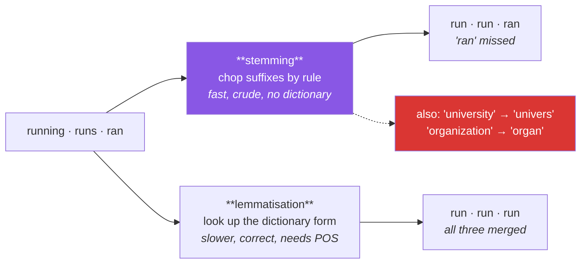

# Day 118 — Stemming, lemmatisation, and stopwords

**Phase 14 · Module 14** · IDs: **NLP-03** (stemming and lemmatisation), **NLP-04** (stopwords)

> **Yesterday:** tokenisation, and the finding that every normalisation step destroys something you
> may need.
> **Today:** the two steps that follow, and the one Day 87 warned about. Stemming and lemmatisation
> both merge word forms — one by chopping, one by knowing — and **the standard stopword list is a
> catastrophe on half the tasks in this project.** Today you measure exactly how bad, and build the
> list you should actually use.
> **Tomorrow:** parts-of-speech tagging.

```bash
./m start 118 && ./m scaffold 118
```

**Time:** 110 minutes. **Request budget:** 0 model calls.

---

## §1 The story

`running`, `runs`, `ran` and `run` are four vocabulary entries for one concept. Two techniques merge
them, and they are not interchangeable:



**Stemming applies suffix-stripping rules.** Porter's algorithm is a handful of rules applied in
order — no dictionary, no context, very fast. It produces **stems that are not words**: `universal`,
`university` and `universe` all become `univers`, which merges three unrelated concepts. That is
called **over-stemming**, and its opposite, **under-stemming**, is `ran` staying separate from `run`.

**Lemmatisation looks up the dictionary form**, so it gets `ran → run` and never produces a non-word.
The cost is that it needs to know the **part of speech**: `saw` is `see` as a verb and `saw` as a
noun, and without a POS tag the lemmatiser guesses — usually "noun", which is wrong about half the
time on verbs. That is why Day 119 comes next.

Then the stopword half, which is where the real damage happens.

Day 87 established that removing stopwords deletes `not`, inverting sentiment. Today goes further:
**stopword lists are not standard.** NLTK's English list has ~180 words, spaCy's has ~325, and
scikit-learn's has ~318 — and sklearn's documentation now carries a warning about its own list. They
disagree on words that matter, so "we removed stopwords" is not a reproducible statement.

And there is a positive case worth knowing: **for authorship attribution, stopwords are the signal.**
Function words are used unconsciously and consistently, which makes them a fingerprint. Strip them and
you have deleted the feature.

---

## §2 Setup — run this

```bash
mkdir -p days/day-118/lab
touch days/day-118/lab/normalise_words.py
```

`src/setu/nlp.py` grows today. NLTK and spaCy came in on Day 117.

---

## §3 NLP-03 / NLP-04 — merging word forms

`days/day-118/lab/normalise_words.py`:

```python
"""NLP-03/04: stemming, lemmatisation, and the stopword list you should actually use."""

from __future__ import annotations

import re

WORDS = ["running", "runs", "ran", "runner", "easily", "fairly",
         "universal", "university", "universe", "organization", "organ",
         "better", "geese", "children", "was", "studies", "studying"]


def porter_by_hand() -> None:
    """A tiny subset of Porter's rules, to show what stemming actually is."""
    def stem(word: str) -> str:
        word = word.lower()
        for suffix, replacement in (("sses", "ss"), ("ies", "i"), ("ss", "ss"), ("s", "")):
            if word.endswith(suffix):
                word = word[: -len(suffix)] + replacement
                break
        if word.endswith("eed") and len(word) > 4:
            word = word[:-1]
        elif word.endswith(("ed", "ing")) and re.search(r"[aeiou]", word[:-2]):
            word = word[:-3] if word.endswith("ing") else word[:-2]
        return word

    print(f"\n  {'word':<16} {'my rules':<14} {'nltk Porter'}")
    try:
        from nltk.stem import PorterStemmer

        porter = PorterStemmer()
        for word in WORDS[:8]:
            print(f"  {word:<16} {stem(word):<14} {porter.stem(word)}")
    except ImportError:
        for word in WORDS[:8]:
            print(f"  {word:<16} {stem(word):<14} (nltk unavailable)")

    print("\n  That is all stemming is: suffix rules, applied in order, no dictionary.")
    print("  It is fast — no lookup, no context — and it is crude by construction.")


def over_and_under_stemming() -> None:
    from nltk.stem import PorterStemmer, SnowballStemmer

    porter = PorterStemmer()
    snowball = SnowballStemmer("english")

    print(f"\n  {'word':<16} {'Porter':<14} {'Snowball':<14} {'problem'}")
    cases = [
        ("universal", "over-stem: 3 unrelated words collapse"),
        ("university", ""),
        ("universe", ""),
        ("organization", "over-stem: merges with 'organ'"),
        ("organ", ""),
        ("ran", "UNDER-stem: stays apart from 'run'"),
        ("run", ""),
        ("better", "under-stem: 'good' is unreachable by rules"),
    ]
    for word, problem in cases:
        print(f"  {word:<16} {porter.stem(word):<14} {snowball.stem(word):<14} {problem}")

    print("\n  🚨 OVER-stemming merges words that should stay apart. Three distinct")
    print("     concepts — universal, university, universe — become one feature.")
    print("\n  🚨 UNDER-stemming leaves forms of one word apart. 'ran' and 'run' are the")
    print("     same verb and no suffix rule connects them, because the change is")
    print("     internal rather than at the end.")
    print("\n  Both are errors. A stemmer trades one against the other, and neither")
    print("  can be eliminated by better rules — you need a dictionary.")


def lemmatisation_needs_the_part_of_speech() -> None:
    from nltk.stem import WordNetLemmatizer

    lemmatiser = WordNetLemmatizer()

    print(f"\n  {'word':<12} {'as noun':<12} {'as verb':<12} {'as adjective'}")
    for word in ("saw", "better", "left", "meeting", "was", "running"):
        print(f"  {word:<12} {lemmatiser.lemmatize(word, 'n'):<12} "
              f"{lemmatiser.lemmatize(word, 'v'):<12} {lemmatiser.lemmatize(word, 'a')}")

    print("\n  🚨 'saw' is 'see' as a verb and 'saw' as a noun. 'better' is 'good' as an")
    print("     adjective and 'better' as a noun.")
    print("\n  ⚠️ NLTK's WordNetLemmatizer DEFAULTS TO NOUN. So `lemmatize('was')`")
    print(f"     returns {lemmatiser.lemmatize('was')!r}, not 'be' — and `lemmatize('running')`")
    print(f"     returns {lemmatiser.lemmatize('running')!r}, not 'run'.")
    print("\n  That default silently does nothing for most verbs, which is the most")
    print("  common lemmatisation bug. Pass the POS tag — Day 119 supplies it.")


def stemming_versus_lemmatisation() -> None:
    import time

    from nltk.stem import PorterStemmer, WordNetLemmatizer

    porter = PorterStemmer()
    lemmatiser = WordNetLemmatizer()

    print(f"\n  {'word':<16} {'stem':<14} {'lemma (verb)':<14} {'is the stem a word?'}")
    for word in ("running", "ran", "studies", "studying", "universal", "better", "geese"):
        stem = porter.stem(word)
        print(f"  {word:<16} {stem:<14} {lemmatiser.lemmatize(word, 'v'):<14} "
              f"{'yes' if stem in {'run', 'study', 'better'} else 'NO'}")

    corpus = ["running studies universal organization"] * 4_000
    start = time.perf_counter()
    for text in corpus:
        [porter.stem(w) for w in text.split()]
    stem_time = time.perf_counter() - start

    start = time.perf_counter()
    for text in corpus:
        [lemmatiser.lemmatize(w, "v") for w in text.split()]
    lemma_time = time.perf_counter() - start

    print(f"\n  16,000 words: stemming {stem_time:.3f}s, lemmatising {lemma_time:.3f}s")

    print("\n  Stemming is faster and produces non-words. Lemmatisation is slower and")
    print("  produces real words — but needs a POS tag to be right.")
    print("\n  Use STEMMING when the output is never shown to a human and speed matters:")
    print("    search indexing, large-scale topic modelling.")
    print("  Use LEMMATISATION when the tokens appear in output, or when precision")
    print("    matters more than throughput.")
    print("\n  ⚠️ And often: use NEITHER. With enough data, 'run' and 'running' can be")
    print("     separate features and the model handles it. Try without first.")


def stopword_lists_disagree() -> None:
    lists = {}
    try:
        from nltk.corpus import stopwords

        try:
            lists["nltk"] = set(stopwords.words("english"))
        except LookupError:
            import nltk

            nltk.download("stopwords", quiet=True)
            lists["nltk"] = set(stopwords.words("english"))
    except Exception:                                            # noqa: BLE001
        pass

    try:
        from sklearn.feature_extraction.text import ENGLISH_STOP_WORDS

        lists["sklearn"] = set(ENGLISH_STOP_WORDS)
    except Exception:                                            # noqa: BLE001
        pass

    try:
        from spacy.lang.en.stop_words import STOP_WORDS

        lists["spacy"] = set(STOP_WORDS)
    except Exception:                                            # noqa: BLE001
        pass

    print(f"\n  {'source':<10} {'size':>6}")
    for name, words in lists.items():
        print(f"  {name:<10} {len(words):>6}")

    if len(lists) >= 2:
        names = list(lists)
        shared = set.intersection(*lists.values())
        union = set.union(*lists.values())
        print(f"\n  in ALL lists  : {len(shared)}")
        print(f"  in ANY list   : {len(union)}")
        print(f"  agreement     : {len(shared) / len(union):.1%}")

        for a, b in [(names[i], names[j]) for i in range(len(names))
                     for j in range(i + 1, len(names))]:
            only_a = sorted(lists[a] - lists[b])[:6]
            print(f"\n  in {a} but not {b}: {only_a}")

    print("\n  🚨 They disagree substantially. 'We removed stopwords' does not identify")
    print("     a dataset — it identifies a family of datasets.")
    print("\n  ⚠️ sklearn's own documentation now carries a warning about its list:")
    print("     it was built for a specific corpus and includes words like 'system',")
    print("     'computer' and 'thin' that are content words in many domains.")


def the_negation_disaster() -> None:
    from sklearn.feature_extraction.text import ENGLISH_STOP_WORDS

    negations = ["not", "no", "never", "none", "nothing", "cannot",
                 "neither", "nor", "hardly", "without"]

    print(f"\n  which negations are in sklearn's stopword list?")
    for word in negations:
        present = word in ENGLISH_STOP_WORDS
        print(f"    {word:<10} {'IN THE LIST 🚨' if present else 'safe'}")

    reviews = ["this film was not good at all", "this film was good"]
    print(f"\n  two reviews with OPPOSITE sentiment:")
    for review in reviews:
        kept = [w for w in review.split() if w not in ENGLISH_STOP_WORDS]
        print(f"    {review!r}")
        print(f"      -> {kept}")

    stripped = [tuple(w for w in r.split() if w not in ENGLISH_STOP_WORDS) for r in reviews]
    print(f"\n  identical after stopword removal? {stripped[0] == stripped[1]}")

    print("\n  🚨 Day 87's finding, quantified. The two reviews become the SAME document.")
    print("     No model can separate them, and no amount of data helps.")
    print("\n  The fix is not 'don't remove stopwords' — it is to remove a list you have")
    print("  INSPECTED, with the negations taken out. §4's safe_stopwords does that.")


def stopwords_are_sometimes_the_signal() -> None:
    from sklearn.feature_extraction.text import ENGLISH_STOP_WORDS

    author_a = [
        "It was of course the case that he would arrive.",
        "Of course, it was rather more difficult than that.",
        "He would, of course, have preferred it otherwise.",
    ]
    author_b = [
        "She arrived. The room was cold. Nobody spoke.",
        "The door closed. She waited. Time passed.",
        "Nobody moved. The clock ticked. She left.",
    ]

    def function_word_profile(texts):
        words = [w.lower().strip(".,") for t in texts for w in t.split()]
        function_words = [w for w in words if w in ENGLISH_STOP_WORDS]
        return len(function_words) / max(len(words), 1)

    print(f"\n  function-word rate:")
    print(f"    author A : {function_word_profile(author_a):.3f}")
    print(f"    author B : {function_word_profile(author_b):.3f}")

    print("\n  ✅ Authorship attribution uses stopwords AS THE FEATURE. Function words")
    print("     are used unconsciously and consistently, so they fingerprint a writer")
    print("     in a way content words do not — content follows the topic, style does not.")
    print("\n  🚨 Strip them and you have deleted the entire signal.")
    print("\n  The same is true of register and formality detection, and of anything")
    print("  where HOW something is said matters more than WHAT is said.")


def measure_the_effect_before_deciding() -> None:
    print("\n  the honest procedure, for any of today's steps:")
    print("\n    1. build the pipeline WITHOUT stemming/lemmatising/stopword removal")
    print("    2. measure on a validation split (Day 97)")
    print("    3. add ONE step, measure again")
    print("    4. keep it only if the gain exceeds the CV noise (Day 106)")
    print("\n  ⚠️ These steps are usually applied because they are traditional, not")
    print("     because they helped. With modern vectorisers and enough data, `min_df`")
    print("     already drops rare forms and the model tolerates the rest.")
    print("\n  And they are not free: each one is an irreversible transformation that")
    print("  must be recorded (Day 117) and reapplied identically at prediction time.")


def what_to_do_by_task() -> None:
    rows = [
        ("sentiment", "no stopword removal", "negation is the signal (§3.6)"),
        ("authorship / style", "no removal, no stemming", "function words ARE the feature"),
        ("topic modelling", "safe list + lemmatise", "content words dominate"),
        ("search indexing", "stem, keep it fast", "output never shown to a human"),
        ("NER (Day 120)", "neither", "you need the surface form"),
        ("classification, plenty of data", "try neither first", "measure before adding"),
    ]
    print(f"\n  {'task':<28} {'do':<26} {'because'}")
    for task, action, because in rows:
        print(f"  {task:<28} {action:<26} {because}")

    print("\n  Read the last row twice. 'Try neither first' is the default this day")
    print("  argues for — these techniques are from an era of small corpora and")
    print("  expensive memory, and both constraints have relaxed.")


if __name__ == "__main__":
    porter_by_hand()
    over_and_under_stemming()
    lemmatisation_needs_the_part_of_speech()
    stemming_versus_lemmatisation()
    stopword_lists_disagree()
    the_negation_disaster()
    stopwords_are_sometimes_the_signal()
    measure_the_effect_before_deciding()
    what_to_do_by_task()
```

**Line by line:**

- `porter_by_hand` — a handful of suffix rules applied in order. **That is all stemming is**: no
  dictionary, no context, which is why it is fast and why it is crude by construction.
- `over_and_under_stemming` — **both directions are errors.** Over-stemming collapses `universal`,
  `university` and `universe` into one feature. Under-stemming leaves `ran` apart from `run`, because
  **the change is internal rather than at the end** and no suffix rule can reach it. Neither is fixable
  by better rules; you need a dictionary.
- `lemmatisation_needs_the_part_of_speech` — **the most common lemmatisation bug.** NLTK's
  `WordNetLemmatizer` **defaults to noun**, so `lemmatize('was')` returns `was` and `lemmatize('running')`
  returns `running`. It silently does nothing for most verbs, and Day 119 supplies the tag it needs.
- `stemming_versus_lemmatisation` — the timing plus the decision rule. Stem when the output is never
  shown to a human; lemmatise when tokens appear in output. **And often: neither** — with enough data,
  `run` and `running` can be separate features.
- `stopword_lists_disagree` — **three lists, substantially different sizes and contents.** "We removed
  stopwords" does not identify a dataset; it identifies a *family* of datasets. And sklearn's own docs
  now warn about its list, which includes `system` and `computer` — content words in many domains.
- `the_negation_disaster` — **Day 87's finding, quantified.** The two opposite reviews become the
  **same document**. No model separates them and no amount of data helps. The fix is not "never remove
  stopwords" — it is to remove a list you have **inspected**.
- `stopwords_are_sometimes_the_signal` — **the positive case.** Function words are used unconsciously
  and consistently, so they fingerprint a writer where content words cannot, because content follows
  the topic and style does not. Strip them and the signal is gone.
- `measure_the_effect_before_deciding` — the four-step procedure, and the honest framing: **these steps
  are usually applied because they are traditional**, from an era of small corpora and expensive
  memory. Both constraints have relaxed.
- `what_to_do_by_task` — **read the last row twice.** "Try neither first" is what this day argues for.

---

## §4 Build brief

Extend `src/setu/nlp.py`:

```python
NEGATIONS = frozenset({"not", "no", "never", "none", "nothing", "nor", "neither",
                       "cannot", "can't", "won't", "don't", "isn't", "aren't",
                       "wasn't", "weren't", "without", "hardly", "barely", "scarcely"})

STOPWORD_SOURCES = {"nltk", "sklearn", "spacy", "union", "intersection"}


def safe_stopwords(*, source: str = "sklearn", keep_negations: bool = True,
                   keep: set[str] | None = None,
                   acknowledged: bool = False) -> frozenset[str]:
    """TODO(me): a stopword list you have inspected. Day 87's rule, generalised.

    - source in STOPWORD_SOURCES; 'intersection' is the CONSERVATIVE choice (only
      words every library agrees on) and 'union' the aggressive one
    - keep_negations=True removes every NEGATIONS member from the list
    - keep_negations=False requires acknowledged=True; raise DataError otherwise,
      naming what it would delete (§3.6) — deleting 'not' must be hard to do by accident
    - `keep` removes additional caller-specified words (domain content words that
      the list wrongly includes, e.g. 'system' for a tech corpus)
    - ASSERT the base list actually contained negations before removing them; if a
      library changes its list this becomes a silent no-op, and that must fail loudly
    - raise DataError on an unknown source, listing STOPWORD_SOURCES
    """
    raise NotImplementedError


def compare_stopword_lists() -> dict:
    """TODO(me): §3.5 — how much do the libraries actually disagree?

    {"sizes": {source: int}, "shared": [...], "agreement": float,
     "unique_to": {source: [...]}, "negations_present": {source: [...]},
     "warnings": [...]}
    - agreement is |intersection| / |union|
    - negations_present names which NEGATIONS members each list contains — that is
      the actionable part, not the raw sizes
    - WARN when any list contains a negation
    - skip a source that is not installed rather than failing, and record which
    - raise DataError if fewer than 2 sources are available to compare
    """
    raise NotImplementedError


def stem(word: str, *, algorithm: str = "porter") -> str:
    """TODO(me): a Porter-subset stemmer, from scratch (§3.1).

    - implement enough rules to show what stemming IS; do not chase completeness
    - the docstring must state that this is for understanding and that NLTK's
      PorterStemmer should be used in production (Principle 2)
    - raise DataError on an unknown algorithm
    - must be idempotent: stem(stem(w)) == stem(w), which a rule set can violate
      if the rules are applied in the wrong order
    """
    raise NotImplementedError


def stemming_errors(words, *, groups: dict) -> dict:
    """TODO(me): §3.2 — measure over- and under-stemming on YOUR vocabulary.

    groups maps a concept name to the word forms that SHOULD merge.
    {"over_stemmed": [(stem, [words])], "under_stemmed": [(concept, [stems])],
     "over_rate": float, "under_rate": float, "verdict": str}
    - over_stemmed: one stem shared by words from DIFFERENT groups
    - under_stemmed: one group producing MORE THAN ONE stem
    - both rates matter and they trade against each other, so the verdict must
      report both rather than a single score
    - raise DataError on an empty groups dict
    """
    raise NotImplementedError


def lemmatise(word: str, *, pos: str | None = None) -> dict:
    """TODO(me): lemmatise, and be honest about the POS problem.

    {"lemma", "pos_used", "pos_was_guessed": bool, "alternatives": {pos: lemma},
     "warning": str | None}
    - pos=None must NOT silently default to noun; set pos_was_guessed=True and
      attach a warning naming the alternatives (§3.3)
    - `alternatives` gives the lemma under each POS, so a caller can see that the
      guess mattered — 'saw' is 'see' or 'saw' depending entirely on it
    - WARN when the alternatives DISAGREE and the pos was guessed; that is exactly
      when the default is dangerous
    - raise DataError on an unknown pos, listing n/v/a/r
    """
    raise NotImplementedError


def measure_step_value(documents, labels, *, steps: dict, cv, scorer,
                       model_fn) -> dict:
    """TODO(me): §3.8 — does this preprocessing step actually help?

    {"baseline": {"mean", "sd"}, "results": {name: {"mean", "sd", "delta"}},
     "worth_keeping": [...], "note": str}
    - baseline is the pipeline with NO step applied
    - worth_keeping are steps whose delta exceeds the baseline's CV standard
      deviation — anything smaller is not distinguishable from noise (Day 106)
    - the note must say these steps are often traditional rather than measured, and
      that each one is an irreversible transformation to be recorded (Day 117)
    - raise DataError on an empty steps dict
    """
    raise NotImplementedError


def word_normalisation_advice(*, task: str, corpus_size: int,
                              output_shown_to_humans: bool = False) -> dict:
    """TODO(me): §3.9's table, as a decision. PURE.

    {"stemming", "lemmatisation", "stopwords", "reason", "warnings": [...]}
    - task='sentiment' -> stopwords: 'none'; the reason must name negation
    - task='authorship' or 'style' -> everything off; stopwords ARE the feature
    - task='ner' -> everything off; the surface form is needed (Day 120)
    - task='search' and not output_shown_to_humans -> stemming
    - corpus_size large -> recommend measuring before adding anything (§3.8)
    - the reason must name the SIGNAL at risk, not just the task
    - raise DataError on an unknown task
    """
    raise NotImplementedError
```

- `safe_stopwords` **requiring `acknowledged=True`** to drop negations is Day 87's rule generalised:
  the dangerous path stays available and becomes impossible to take by accident.
- The **assert that the base list contained negations** is a dependency-drift guard. If sklearn removes
  them, the function silently becomes a no-op and every test still passes — so it must fail loudly
  instead.
- `lemmatise` **refusing to silently default to noun** is the day's design decision. NLTK's default
  does nothing for most verbs, and `alternatives` shows the caller that the guess mattered.

---

## §5 The eval that must be able to fail

Add to `tests/test_nlp.py`:

```python
from setu.nlp import (
    NEGATIONS,
    STOPWORD_SOURCES,
    compare_stopword_lists,
    lemmatise,
    measure_step_value,
    safe_stopwords,
    stem,
    stemming_errors,
    word_normalisation_advice,
)


def test_negations_are_removed_from_the_list():
    """Day 87's rule: 'not good' and 'good' must not become the same document."""
    words = safe_stopwords()
    for negation in ("not", "no", "never"):
        assert negation not in words


def test_the_base_list_actually_contained_negations():
    """A dependency-drift guard: if sklearn changes its list this becomes a no-op."""
    from sklearn.feature_extraction.text import ENGLISH_STOP_WORDS

    assert NEGATIONS & set(ENGLISH_STOP_WORDS), (
        "the base stopword list no longer contains negations — revisit safe_stopwords"
    )


def test_dropping_negations_requires_acknowledgement():
    with pytest.raises(DataError) as info:
        safe_stopwords(keep_negations=False)
    message = str(info.value).lower()
    assert "not" in message or "negation" in message


def test_an_acknowledged_drop_is_allowed():
    """The dangerous path stays available and is hard to take by accident."""
    words = safe_stopwords(keep_negations=False, acknowledged=True)
    assert "not" in words


def test_the_intersection_is_smaller_than_any_single_list():
    """Only words every library agrees on."""
    conservative = safe_stopwords(source="intersection")
    aggressive = safe_stopwords(source="union")
    assert len(conservative) < len(aggressive)


def test_caller_supplied_words_are_kept():
    """Domain content words the list wrongly includes."""
    words = safe_stopwords(keep={"system", "computer"})
    assert "system" not in words
    assert "computer" not in words


def test_an_unknown_source_lists_the_known_ones():
    with pytest.raises(DataError) as info:
        safe_stopwords(source="my-list")
    assert any(name in str(info.value) for name in STOPWORD_SOURCES)


def test_the_lists_disagree_substantially():
    """'We removed stopwords' identifies a family of datasets, not one."""
    result = compare_stopword_lists()
    assert result["agreement"] < 0.75


def test_the_comparison_names_which_lists_contain_negations():
    """That is the actionable part, not the raw sizes."""
    result = compare_stopword_lists()
    assert any(result["negations_present"].values())
    assert result["warnings"]


def test_the_comparison_reports_what_is_unique_to_each():
    result = compare_stopword_lists()
    assert any(result["unique_to"].values())


def test_stemming_is_idempotent():
    """Rules applied in the wrong order can violate this."""
    for word in ("running", "studies", "universal", "organization", "flies"):
        assert stem(stem(word)) == stem(word)


def test_stemming_merges_inflections():
    assert stem("running") == stem("runs")


def test_the_stem_docstring_points_at_nltk():
    assert "nltk" in stem.__doc__.lower() or "librar" in stem.__doc__.lower()


def test_an_unknown_algorithm_raises():
    with pytest.raises(DataError):
        stem("running", algorithm="lancaster-ish")


def test_over_stemming_is_detected():
    """universal, university and universe collapsing into one stem."""
    result = stemming_errors(
        ["universal", "university", "universe", "running", "runs"],
        groups={"universe-concept": ["universe"], "school": ["university"],
                "general": ["universal"], "run": ["running", "runs"]},
    )
    assert result["over_stemmed"]
    assert result["over_rate"] > 0


def test_under_stemming_is_detected():
    """'ran' and 'run' are the same verb; no suffix rule connects them."""
    result = stemming_errors(
        ["run", "ran", "running"],
        groups={"run": ["run", "ran", "running"]},
    )
    assert result["under_stemmed"]
    assert result["under_rate"] > 0


def test_both_error_rates_are_reported():
    """They trade against each other, so a single score would hide it."""
    result = stemming_errors(["running", "runs"], groups={"run": ["running", "runs"]})
    assert "over_rate" in result and "under_rate" in result
    assert "over" in result["verdict"].lower() or "under" in result["verdict"].lower()


def test_a_clean_vocabulary_has_no_errors():
    """A detector that always fires is useless."""
    result = stemming_errors(["running", "runs", "runner"],
                             groups={"run": ["running", "runs", "runner"]})
    assert result["over_stemmed"] == []


def test_stemming_errors_needs_groups():
    with pytest.raises(DataError):
        stemming_errors(["a", "b"], groups={})


def test_a_guessed_pos_is_flagged():
    """NLTK's default-to-noun silently does nothing for most verbs. Today's assessment."""
    result = lemmatise("was")
    assert result["pos_was_guessed"] is True
    assert result["warning"]


def test_an_explicit_pos_is_not_flagged():
    result = lemmatise("was", pos="v")
    assert result["pos_was_guessed"] is False
    assert result["lemma"] == "be"
    assert result["warning"] is None


def test_the_alternatives_show_the_guess_mattered():
    """'saw' is 'see' or 'saw' depending entirely on the POS."""
    result = lemmatise("saw")
    assert result["alternatives"]["v"] == "see"
    assert result["alternatives"]["n"] == "saw"
    assert result["alternatives"]["v"] != result["alternatives"]["n"]


def test_a_word_whose_lemma_is_pos_independent_does_not_warn():
    """Do not cry wolf when the guess could not have mattered."""
    result = lemmatise("cat")
    assert len(set(result["alternatives"].values())) == 1
    assert result["warning"] is None


def test_verbs_are_lemmatised_correctly_with_a_tag():
    for word, expected in (("running", "run"), ("studies", "study"), ("was", "be")):
        assert lemmatise(word, pos="v")["lemma"] == expected


def test_an_unknown_pos_lists_the_valid_ones():
    with pytest.raises(DataError) as info:
        lemmatise("running", pos="verb")
    assert "v" in str(info.value)


def test_the_negation_disaster_is_reproduced():
    """Two opposite reviews become the same document."""
    from sklearn.feature_extraction.text import ENGLISH_STOP_WORDS

    positive = "this film was good"
    negative = "this film was not good"
    strip = lambda t: tuple(w for w in t.split() if w not in ENGLISH_STOP_WORDS)  # noqa: E731
    assert strip(positive) == strip(negative), (
        "sklearn's list contains 'not', so these collapse — that is the problem"
    )


def test_a_safe_list_preserves_the_distinction():
    """The fix: a list you have inspected."""
    words = safe_stopwords()
    strip = lambda t: tuple(w for w in t.split() if w not in words)  # noqa: E731
    assert strip("this film was good") != strip("this film was not good")


def test_a_step_that_does_not_help_is_not_kept():
    """These steps are often traditional rather than measured."""
    from sklearn.feature_extraction.text import CountVectorizer
    from sklearn.linear_model import LogisticRegression
    from sklearn.model_selection import StratifiedKFold
    from sklearn.pipeline import make_pipeline

    rng = make_rng(0)
    positive = ["excellent brilliant moving film"] * 150
    negative = ["dull tedious clumsy film"] * 150
    documents = positive + negative
    labels = [1] * 150 + [0] * 150

    result = measure_step_value(
        documents, labels,
        steps={"uppercase-noop": lambda t: t},
        cv=StratifiedKFold(3, shuffle=True, random_state=0),
        scorer=None,
        model_fn=lambda: make_pipeline(CountVectorizer(), LogisticRegression(max_iter=500)),
    )
    assert "uppercase-noop" not in result["worth_keeping"]


def test_the_measurement_note_says_these_steps_are_traditional():
    from sklearn.feature_extraction.text import CountVectorizer
    from sklearn.linear_model import LogisticRegression
    from sklearn.model_selection import StratifiedKFold
    from sklearn.pipeline import make_pipeline

    result = measure_step_value(
        ["good film"] * 60 + ["bad film"] * 60, [1] * 60 + [0] * 60,
        steps={"noop": lambda t: t},
        cv=StratifiedKFold(3, shuffle=True, random_state=0), scorer=None,
        model_fn=lambda: make_pipeline(CountVectorizer(), LogisticRegression(max_iter=300)),
    )
    note = result["note"].lower()
    assert "tradition" in note or "measure" in note
    assert "record" in note or "irreversib" in note


def test_measurement_needs_steps():
    with pytest.raises(DataError):
        measure_step_value(["a"], [0], steps={}, cv=None, scorer=None,
                           model_fn=lambda: None)


def test_sentiment_never_removes_stopwords():
    result = word_normalisation_advice(task="sentiment", corpus_size=50_000)
    assert result["stopwords"] == "none"
    assert "negat" in result["reason"].lower()


def test_authorship_keeps_everything():
    """Function words ARE the feature."""
    result = word_normalisation_advice(task="authorship", corpus_size=10_000)
    assert result["stopwords"] == "none"
    assert result["stemming"] is False
    assert "function" in result["reason"].lower() or "style" in result["reason"].lower()


def test_ner_keeps_the_surface_form():
    result = word_normalisation_advice(task="ner", corpus_size=10_000)
    assert result["stemming"] is False
    assert result["lemmatisation"] is False


def test_search_indexing_uses_stemming():
    result = word_normalisation_advice(task="search", corpus_size=1_000_000,
                                       output_shown_to_humans=False)
    assert result["stemming"] is True


def test_a_large_corpus_is_told_to_measure_first():
    result = word_normalisation_advice(task="classification", corpus_size=500_000)
    assert result["warnings"]
    assert any("measur" in w.lower() for w in result["warnings"])


def test_the_reason_names_the_signal_at_risk():
    """Not just the task."""
    for task in ("sentiment", "authorship", "ner"):
        reason = word_normalisation_advice(task=task, corpus_size=10_000)["reason"].lower()
        assert len(reason) > 25
        assert task not in reason or len(reason.replace(task, "")) > 20


def test_an_unknown_task_raises():
    with pytest.raises(DataError):
        word_normalisation_advice(task="summarisation", corpus_size=1_000)
```

**Line by line:**

- `test_a_guessed_pos_is_flagged` — **the day's real assessment.** NLTK's `WordNetLemmatizer` defaults
  to noun and therefore **silently does nothing for most verbs**, which is the commonest lemmatisation
  bug. Flagging the guess is what surfaces it.
- `test_a_word_whose_lemma_is_pos_independent_does_not_warn` — the counterweight. **Do not cry wolf
  when the guess could not have mattered**, or the warning gets filtered out and stops working.
- `test_the_negation_disaster_is_reproduced` with `test_a_safe_list_preserves_the_distinction` — the
  pair is the argument. Two opposite reviews become the **same tuple** under sklearn's list, and a
  safe list separates them.
- `test_the_base_list_actually_contained_negations` — a **dependency-drift guard.** If sklearn removes
  negations, `safe_stopwords` becomes a no-op while every other test still passes, so this one has to
  fail loudly.
- `test_stemming_is_idempotent` — `stem(stem(w)) == stem(w)`. A rule set applied in the wrong order
  violates this, and it is a cheap invariant that catches real bugs.
- `test_over_stemming_is_detected` and `test_under_stemming_is_detected` — **both directions**, plus
  `test_both_error_rates_are_reported`, because they trade against each other and a single score hides
  which way your stemmer errs.
- `test_the_alternatives_show_the_guess_mattered` — `saw` → `see` as a verb, `saw` as a noun, asserted
  side by side. That is the concrete reason the POS tag is not optional.
- `test_the_reason_names_the_signal_at_risk` — the reason must be substantive rather than a restatement
  of the task. "Because it is sentiment" helps nobody; "because negation is the signal" does.

```bash
uv run python -m pytest tests/test_nlp.py -v
```

---

## §6 Request budget

| Resource | Spent today |
|---|---|
| LLM calls | **0** |
| Network | NLTK `wordnet` and `stopwords` downloads on first run |

---

## §7 Traps

- **`lemmatize(word)` without a POS.** Defaults to noun; does nothing for verbs.
- **Assuming stopword lists are standard.** Three libraries, three different lists.
- **Removing stopwords for sentiment.** `not` is in every standard list.
- **Removing stopwords for authorship.** They are the feature.
- **Trusting sklearn's list on a technical corpus.** It contains `system` and `computer`.
- **Stemming when tokens are shown to humans.** `univers` is not a word.
- **Ignoring over-stemming.** Three concepts become one feature.
- **Expecting stemming to catch `ran → run`.** The change is internal.
- **Applying these steps because they are traditional.** Measure the gain.
- **Forgetting the step must be reapplied at prediction time.** Identically.
- **Not recording which stemmer or list you used.** The dataset is unreproducible.

---

## §8 Verify before you code

Written **2026-08-21**:

- <https://www.nltk.org/api/nltk.stem.html> — Porter, Snowball and WordNet, and the lemmatiser's
  `pos` parameter default.
- <https://scikit-learn.org/stable/modules/feature_extraction.html#stop-words> — including sklearn's
  own warning about its English list.
- <https://spacy.io/usage/linguistic-features#lemmatization> — spaCy lemmatises using the POS it
  tagged, which is why it does not need the argument.
- <https://tartarus.org/martin/PorterStemmer/> — the original algorithm, worth reading once for how
  small it is.

---

## §9 Say it in an interview

> "Stemming chops suffixes by rule and lemmatisation looks up the dictionary form, and the trade is
> concrete. Stemming is fast and produces non-words — 'universal', 'university' and 'universe' all
> become 'univers', which merges three unrelated concepts — and it misses 'ran' to 'run' entirely,
> because that change is internal rather than at the end. Lemmatisation gets both right but needs a
> part-of-speech tag: 'saw' is 'see' as a verb and 'saw' as a noun. And NLTK's lemmatiser silently
> defaults to noun, so calling it on 'was' returns 'was' — it does nothing for most verbs, which is
> the commonest bug in this area. On stopwords, two things. The lists aren't standard — NLTK, spaCy
> and scikit-learn disagree substantially — so 'we removed stopwords' doesn't identify a dataset. And
> every standard English list contains 'not', so removing them makes 'not good' and 'good' the
> identical document. The honest position is to measure whether any of these steps helps at all before
> adding it; they're from an era of small corpora and expensive memory, and both constraints relaxed."

---

## §10 Done when

Tick [`CHECKLIST.md`](CHECKLIST.md), then `./m check && ./m done 118`.
