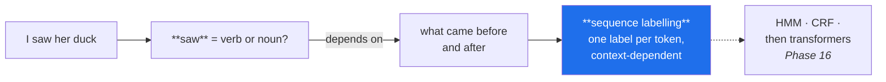

# Day 119 — Parts-of-speech tagging

**Phase 14 · Module 14** · ID: **NLP-05** (POS tagging)

> **Yesterday:** lemmatisation needs a part-of-speech tag, and NLTK silently guesses "noun".
> **Today:** where that tag comes from. POS tagging is also the first **sequence** model in this
> project — the first time a prediction for one token depends on its neighbours — and that structural
> idea runs all the way to Phase 16's transformers.
> **Tomorrow:** named entity recognition.

```bash
./m start 119 && ./m scaffold 119
```

**Time:** 110 minutes. **Request budget:** 0 model calls.

---

## §1 The story

Every model so far predicted **one label per row**, and rows were independent (Day 97 spent a whole
day on what happens when they are not). POS tagging breaks that:



**"I saw her duck" is genuinely ambiguous** — `duck` is a noun (the bird) or a verb (to dodge), and
`saw` is a verb (past of see) or a noun (the tool). No amount of looking at `duck` alone resolves it.
The tag depends on the sequence, which is why POS tagging needs a different kind of model from
everything in Phase 12.

Three things worth getting right today.

**Tagsets are not universal.** The Penn Treebank set has ~36 tags (`NN`, `NNS`, `VB`, `VBD`, `VBZ`…);
the Universal Dependencies set has 17 coarse ones (`NOUN`, `VERB`, `ADJ`…). NLTK gives you Penn by
default; spaCy gives you **both**, as `token.tag_` (fine) and `token.pos_` (coarse). Mixing them is a
silent bug — a lemmatiser expecting `v` will not understand `VBD`.

**The mapping to lemmatiser tags is the practical payoff.** Day 118 left `lemmatise` needing a
`pos` argument. Today supplies it, and the mapping `VBD → v`, `NNS → n`, `JJR → a` is the glue that
makes Day 118's function work correctly instead of defaulting to noun.

**A tagger is a model, so it has a training distribution.** Taggers are trained on newswire, and they
degrade on tweets, code, clinical notes and anything without capitalisation. Day 96's language applies:
**a tagger applied outside its training distribution is not a tool, it is a guess** — and you can
measure the degradation rather than assume it.

---

## §2 Setup — run this

```bash
mkdir -p days/day-119/lab
touch days/day-119/lab/pos.py
```

`src/setu/nlp.py` grows today. NLTK and spaCy came in on Day 117.

---

## §3 NLP-05 — tagging

`days/day-119/lab/pos.py`:

```python
"""NLP-05: POS tagging — the first sequence model, and the tag Day 118 needed."""

from __future__ import annotations

import time
from collections import Counter, defaultdict

AMBIGUOUS = [
    "I saw her duck.",
    "The old man the boats.",
    "Time flies like an arrow; fruit flies like a banana.",
    "Will Will will the will to Will?",
]


def context_decides_the_tag() -> None:
    import nltk

    print("\n  the same word, different tags, decided by context:")
    for sentence in ("I saw a bird.", "I used a saw.",
                     "They duck quickly.", "They cooked a duck."):
        try:
            tags = nltk.pos_tag(nltk.word_tokenize(sentence))
        except LookupError:
            nltk.download("punkt_tab", quiet=True)
            nltk.download("averaged_perceptron_tagger_eng", quiet=True)
            tags = nltk.pos_tag(nltk.word_tokenize(sentence))
        target = [t for t in tags if t[0].lower() in {"saw", "duck"}]
        print(f"    {sentence:<24} -> {target}")

    print("\n  🚨 Every model since Day 91 predicted ONE LABEL PER ROW, with rows")
    print("     independent. This is different: the label for a token depends on its")
    print("     NEIGHBOURS, and no amount of looking at 'duck' alone resolves it.")
    print("\n  That is SEQUENCE LABELLING, and it is the structural idea behind HMMs,")
    print("  CRFs, and eventually the attention mechanism in Phase 16.")


def a_baseline_tagger_from_scratch() -> None:
    """Most-frequent-tag: no context at all. The number to beat."""
    import nltk
    from nltk.corpus import treebank

    try:
        sentences = treebank.tagged_sents()
    except LookupError:
        nltk.download("treebank", quiet=True)
        sentences = treebank.tagged_sents()

    train, test = sentences[:3_000], sentences[3_000:3_500]

    counts = defaultdict(Counter)
    for sentence in train:
        for word, tag in sentence:
            counts[word.lower()][tag] += 1
    most_frequent = {word: tags.most_common(1)[0][0] for word, tags in counts.items()}

    overall_tag = Counter(t for s in train for _, t in s).most_common(1)[0][0]

    correct = total = unseen = 0
    for sentence in test:
        for word, truth in sentence:
            predicted = most_frequent.get(word.lower(), overall_tag)
            unseen += word.lower() not in most_frequent
            correct += predicted == truth
            total += 1

    print(f"\n  most-frequent-tag baseline (NO context):")
    print(f"    accuracy       : {correct / total:.4f}")
    print(f"    unseen words   : {unseen / total:.2%}")
    print(f"    fallback tag   : {overall_tag}")

    print("\n  Around 90% from a lookup table with no context whatsoever. That is the")
    print("  BASELINE (Day 78) — and it means a tagger reporting 93% has added three")
    print("  points, not ninety-three.")
    print("\n  ⚠️ Always compute this before quoting a tagger's accuracy. It is the")
    print("     single most misreported number in classical NLP.")


def ambiguity_is_concentrated() -> None:
    import nltk
    from nltk.corpus import treebank

    try:
        sentences = treebank.tagged_sents()
    except LookupError:
        nltk.download("treebank", quiet=True)
        sentences = treebank.tagged_sents()

    counts = defaultdict(Counter)
    for sentence in sentences:
        for word, tag in sentence:
            counts[word.lower()][tag] += 1

    ambiguous = {w: c for w, c in counts.items() if len(c) > 1}
    total_tokens = sum(sum(c.values()) for c in counts.values())
    ambiguous_tokens = sum(sum(c.values()) for c in ambiguous.values())

    print(f"\n  distinct words        : {len(counts):,}")
    print(f"  words with >1 tag     : {len(ambiguous):,} ({len(ambiguous) / len(counts):.1%})")
    print(f"  TOKENS that are ambiguous: {ambiguous_tokens / total_tokens:.1%}")

    print(f"\n  the most ambiguous frequent words:")
    for word, tags in sorted(ambiguous.items(), key=lambda kv: -sum(kv[1].values()))[:6]:
        print(f"    {word:<10} {dict(tags.most_common(4))}")

    print("\n  Only a small fraction of the VOCABULARY is ambiguous — but those words")
    print("  are the common ones, so a large fraction of TOKENS is.")
    print("  ⚠️ That gap is why context matters: the ambiguity is concentrated in")
    print("     exactly the words you see most often.")


def tagsets_are_not_universal() -> None:
    import nltk

    sentence = "The quick brown foxes were jumping quickly over lazy dogs."
    tokens = nltk.word_tokenize(sentence)
    penn = nltk.pos_tag(tokens)
    universal = nltk.pos_tag(tokens, tagset="universal")

    print(f"\n  {'token':<12} {'Penn':<8} {'Universal'}")
    for (word, fine), (_, coarse) in zip(penn, universal, strict=True):
        print(f"  {word:<12} {fine:<8} {coarse}")

    print(f"\n  Penn Treebank : ~36 tags — NN, NNS, VB, VBD, VBG, VBZ, JJ, JJR…")
    print(f"  Universal     : 17 tags  — NOUN, VERB, ADJ, ADV…")

    print("\n  🚨 Penn distinguishes VBD (past) from VBZ (3rd person singular) from VBG")
    print("     (gerund). Universal calls all three VERB.")
    print("\n  ⚠️ spaCy gives BOTH: `token.tag_` is fine-grained, `token.pos_` is coarse.")
    print("     Mixing them is a silent bug — code expecting 'VERB' gets 'VBD' and")
    print("     matches nothing, with no error.")


def the_tag_day_118_needed() -> None:
    import nltk
    from nltk.stem import WordNetLemmatizer

    lemmatiser = WordNetLemmatizer()
    sentence = "The children were running and studies were better organised."
    tokens = nltk.word_tokenize(sentence)
    tagged = nltk.pos_tag(tokens)

    def to_wordnet(penn_tag: str) -> str:
        return {"J": "a", "V": "v", "N": "n", "R": "r"}.get(penn_tag[0], "n")

    print(f"\n  {'token':<12} {'Penn':<8} {'wordnet':<9} {'no tag':<12} {'with tag'}")
    for word, tag in tagged:
        pos = to_wordnet(tag)
        print(f"  {word:<12} {tag:<8} {pos:<9} "
              f"{lemmatiser.lemmatize(word):<12} {lemmatiser.lemmatize(word, pos)}")

    print("\n  ✅ Compare the last two columns. Without a tag: 'were' stays 'were',")
    print("     'running' stays 'running'. With one: 'be' and 'run'.")
    print("\n  That mapping — Penn's first letter to WordNet's n/v/a/r — is the glue")
    print("  that makes Day 118's lemmatiser work instead of silently defaulting to noun.")
    print("\n  ⚠️ Note the fallback: anything not starting J/V/N/R becomes 'n'. That is a")
    print("     GUESS, and it is right often enough to be useful and wrong often enough")
    print("     to matter. spaCy avoids it by lemmatising with the tag it just assigned.")


def spacy_does_it_in_one_pass() -> None:
    try:
        import spacy
    except ImportError:
        print("\n  spaCy unavailable")
        return

    nlp = spacy.load("en_core_web_sm")
    doc = nlp("The children were running quickly and studies were better organised.")

    print(f"\n  {'token':<12} {'pos_':<8} {'tag_':<8} {'lemma_':<12} {'is_stop'}")
    for token in doc:
        print(f"  {token.text:<12} {token.pos_:<8} {token.tag_:<8} "
              f"{token.lemma_:<12} {token.is_stop}")

    print("\n  spaCy tags, lemmatises and flags stopwords in ONE pass, and its")
    print("  lemmatiser uses the tag it just assigned — so no mapping is needed and")
    print("  no fallback guess happens.")
    print("\n  ⚠️ But note `is_stop`: that is spaCy's list, which Day 118 showed differs")
    print("     from NLTK's and sklearn's. Using it silently adopts a specific list.")


def taggers_disagree_and_cost_differently() -> None:
    import nltk

    text = ("The quick brown foxes were jumping quickly over the lazy dogs "
            "while researchers studied linguistic patterns. ") * 40

    tokens = nltk.word_tokenize(text)
    start = time.perf_counter()
    nltk_tags = nltk.pos_tag(tokens)
    nltk_time = time.perf_counter() - start

    try:
        import spacy

        nlp = spacy.load("en_core_web_sm", disable=["ner", "parser"])
        start = time.perf_counter()
        doc = nlp(text)
        spacy_time = time.perf_counter() - start
        spacy_tags = [(t.text, t.tag_) for t in doc if not t.is_space]
    except Exception:                                            # noqa: BLE001
        print("\n  spaCy unavailable for the comparison")
        return

    print(f"\n  {len(tokens):,} tokens:")
    print(f"    nltk.pos_tag : {nltk_time:.3f}s")
    print(f"    spacy        : {spacy_time:.3f}s  (includes tokenisation)")

    aligned = [(a[1], b[1]) for a, b in zip(nltk_tags, spacy_tags, strict=False)
               if a[0] == b[0]]
    agreement = sum(a == b for a, b in aligned) / max(len(aligned), 1)
    print(f"\n  agreement on aligned tokens: {agreement:.4f}")

    disagreements = Counter((a, b) for a, b in aligned if a != b)
    print(f"  most common disagreements: {disagreements.most_common(4)}")

    print("\n  ⚠️ They disagree on a real fraction of tokens, and the disagreements are")
    print("     systematic rather than random — usually on the same distinctions.")
    print("  Changing tagger changes your features, exactly as changing tokeniser does")
    print("  (Day 117).")


def a_tagger_is_a_model_with_a_training_distribution() -> None:
    import nltk

    domains = {
        "newswire (in-domain)": "The company reported quarterly earnings of $3.2 million.",
        "lowercase": "the company reported quarterly earnings of $3.2 million.",
        "tweet": "omg this is sooo gr8 lol #winning @friend cant even rn",
        "clinical": "Pt c/o SOB x3d, denies CP. Hx of CHF, on lasix 40mg PO qd.",
        "code": "for i in range(10): print(x[i].value)",
    }

    print(f"\n  the same tagger on five domains:")
    for label, text in domains.items():
        tags = nltk.pos_tag(nltk.word_tokenize(text))
        nouns = sum(1 for _, t in tags if t.startswith("NN"))
        print(f"\n    {label}")
        print(f"      {tags[:7]}")
        print(f"      {nouns}/{len(tags)} tagged as nouns")

    print("\n  🚨 Watch the lowercase row: removing capitalisation degrades tagging badly,")
    print("     because capitalisation is a feature the tagger learned to use.")
    print("     Day 117 said not to lowercase before NER; the same applies here.")
    print("\n  🚨 And the tweet and clinical rows: everything unknown becomes NN, so the")
    print("     noun proportion climbs. That climbing proportion IS the degradation")
    print("     signal, and you can measure it without any labelled data.")
    print("\n  Day 96's framing: a tagger outside its training distribution is not a")
    print("  tool, it is a guess. Check before trusting it on your corpus.")


def what_pos_tags_are_actually_for() -> None:
    rows = [
        ("lemmatisation", "supplies the tag Day 118 needs", "the main practical use"),
        ("NER (Day 120)", "proper nouns narrow the search", "a feature, not the answer"),
        ("keyword extraction", "keep nouns and adjectives", "drops function words by role"),
        ("chunking / phrases", "NP patterns like DT JJ NN", "shallow parsing"),
        ("feature engineering", "POS n-grams capture style", "authorship (Day 118)"),
        ("text-to-speech", "'read' present vs past", "pronunciation depends on it"),
    ]
    print(f"\n  {'use':<24} {'how':<36} {'note'}")
    for use, how, note in rows:
        print(f"  {use:<24} {how:<36} {note}")

    print("\n  ⚠️ POS tags are rarely the OUTPUT. They are an intermediate representation,")
    print("     and their errors propagate into whatever consumes them — so a tagger at")
    print("     93% means your downstream feature is wrong on 7% of tokens.")


if __name__ == "__main__":
    context_decides_the_tag()
    a_baseline_tagger_from_scratch()
    ambiguity_is_concentrated()
    tagsets_are_not_universal()
    the_tag_day_118_needed()
    spacy_does_it_in_one_pass()
    taggers_disagree_and_cost_differently()
    a_tagger_is_a_model_with_a_training_distribution()
    what_pos_tags_are_actually_for()
```

**Line by line:**

- `context_decides_the_tag` — **every model since Day 91 predicted one label per row with rows
  independent.** This is different: the label depends on neighbours. That is sequence labelling, and it
  is the structural idea behind HMMs, CRFs and eventually attention (Phase 16).
- `a_baseline_tagger_from_scratch` — **around 90% from a lookup table with no context at all.** So a
  tagger reporting 93% has added three points, not ninety-three. **Always compute this before quoting a
  tagger's accuracy** — it is the single most misreported number in classical NLP (Day 78's rule,
  applied here).
- `ambiguity_is_concentrated` — only a small fraction of the *vocabulary* is ambiguous, but a large
  fraction of *tokens* is, **because the ambiguous words are the common ones.** That gap is precisely
  why context matters.
- `tagsets_are_not_universal` — Penn distinguishes `VBD`, `VBZ` and `VBG`; Universal calls all three
  `VERB`. **spaCy gives both** as `tag_` and `pos_`, and **mixing them is a silent bug** — code
  expecting `VERB` gets `VBD` and matches nothing, with no error.
- `the_tag_day_118_needed` — **compare the last two columns.** Without a tag, `were` stays `were` and
  `running` stays `running`; with one, `be` and `run`. The Penn-first-letter mapping is the glue that
  makes Day 118's lemmatiser work. And the fallback is honest: **anything not starting J/V/N/R becomes
  `n`, which is a guess.**
- `spacy_does_it_in_one_pass` — tagging, lemmatisation and stopword flagging together, with the
  lemmatiser using the tag it just assigned so **no mapping and no fallback guess**. But `is_stop`
  silently adopts spaCy's list, which Day 118 showed differs from the others.
- `taggers_disagree_and_cost_differently` — they disagree on a real fraction of tokens and **the
  disagreements are systematic rather than random.** Changing tagger changes your features, exactly as
  changing tokeniser does.
- `a_tagger_is_a_model_with_a_training_distribution` — **the lowercase row is the one to watch.**
  Removing capitalisation degrades tagging badly, because it is a feature the tagger learned. And for
  tweets and clinical text, **everything unknown becomes `NN`**, so the noun proportion climbs — which
  is a degradation signal you can measure **without any labelled data.**
- `what_pos_tags_are_actually_for` — **POS tags are rarely the output.** They are an intermediate
  representation whose errors propagate, so 93% accuracy means your downstream feature is wrong on 7%
  of tokens.

---

## §4 Build brief

Extend `src/setu/nlp.py`:

```python
PENN_TO_WORDNET = {"J": "a", "V": "v", "N": "n", "R": "r"}
TAGSETS = {"penn", "universal"}


def penn_to_wordnet(tag: str) -> dict:
    """TODO(me): the mapping Day 118's lemmatiser needs. PURE.

    {"wordnet_pos", "was_guessed": bool, "penn_tag"}
    - map on the FIRST LETTER: J->a, V->v, N->n, R->r
    - anything else falls back to 'n' with was_guessed=True — that fallback is a
      guess and the caller must be able to see it (§3.5)
    - raise DataError on an empty tag
    """
    raise NotImplementedError


def tag_and_lemmatise(tokens, *, tagger=None) -> dict:
    """TODO(me): §3.5 — supply the tag, then lemmatise properly.

    {"tokens": [...], "tags": [...], "lemmas": [...], "guessed_pos": [...],
     "n_guessed": int, "warnings": [...]}
    - guessed_pos lists indices where penn_to_wordnet fell back
    - WARN when more than 10% of tokens got a guessed POS — that usually means the
      tagger is out of its distribution (§3.8), not that the text is unusual
    - compare against the no-tag lemma and record how many CHANGED, because that
      number is the value this function adds over Day 118's default
    - raise DataError on an empty token list
    """
    raise NotImplementedError


def most_frequent_tag_baseline(tagged_sentences, *, test_sentences) -> dict:
    """TODO(me): §3.2 — the number a tagger must beat.

    {"accuracy", "unseen_rate", "fallback_tag", "n_test_tokens", "statement"}
    - build word -> most common tag from the training sentences; fall back to the
      globally most common tag for unseen words
    - the statement must present the accuracy AS A BASELINE, so a caller cannot
      quote a tagger's 93% without knowing 90% came free (Day 78)
    - raise DataError on empty training or test data
    """
    raise NotImplementedError


def ambiguity_report(tagged_sentences) -> dict:
    """TODO(me): §3.3 — how much of this corpus actually needs context?

    {"n_types", "n_ambiguous_types", "type_ambiguity_rate",
     "token_ambiguity_rate", "most_ambiguous": [(word, {tag: count})], "note"}
    - the type rate and the TOKEN rate differ a lot, and the note must explain why:
      ambiguity concentrates in frequent words
    - most_ambiguous ranked by frequency, not by number of distinct tags — a rare
      word with four tags matters less than a common word with two
    - raise DataError on an empty corpus
    """
    raise NotImplementedError


def tagset_of(tag: str) -> str:
    """TODO(me): which tagset does this tag belong to? PURE.

    Returns 'penn', 'universal', or raises.
    - universal tags are all-caps words like NOUN, VERB, ADJ, PUNCT
    - penn tags are short codes like NN, VBD, JJR, DT
    - raise DataError when the tag belongs to neither, naming it — this exists so a
      pipeline mixing tag_ and pos_ fails loudly instead of matching nothing (§3.4)
    """
    raise NotImplementedError


def assert_consistent_tagset(tags) -> None:
    """TODO(me): raise DataError if a sequence mixes Penn and Universal tags.

    - the message must name an example of each and explain that code expecting
      'VERB' silently matches nothing when given 'VBD'
    - this is cheap and catches a bug that produces no error at all
    """
    raise NotImplementedError


def tagger_domain_check(texts, *, tagger=None, reference_noun_rate: float = 0.30) -> dict:
    """TODO(me): §3.8 — is this tagger in its training distribution?

    {"noun_rate", "unknown_word_rate", "lowercase_rate", "in_domain": bool,
     "concerns": [...], "recommendation": str}
    - an unknown word is tagged NN by most taggers, so a HIGH NOUN RATE is the
      degradation signal — and it needs no labelled data, which is the point
    - lowercase_rate: a corpus with almost no capitals will tag badly, because
      capitalisation is a learned feature (§3.8, and Day 117's rule)
    - in_domain is False when the noun rate exceeds reference by more than 50%,
      or the lowercase rate exceeds 0.95
    - the recommendation must be actionable: which specific check to run or which
      model to try, not 'consider retraining'
    """
    raise NotImplementedError
```

- `penn_to_wordnet` **reporting `was_guessed`** is the design decision that carries Day 118's honesty
  forward: the `n` fallback is a guess and the caller must be able to see it.
- `assert_consistent_tagset` is small and catches a bug that **produces no error at all** — code
  filtering for `VERB` against Penn tags matches nothing and silently returns an empty list.
- `tagger_domain_check` using the **noun rate** as the signal is the useful part: unknown words become
  `NN`, so degradation is measurable **without labelled data**, which is exactly the situation you are
  in on a new corpus.

---

## §5 The eval that must be able to fail

Add to `tests/test_nlp.py`:

```python
from setu.nlp import (
    PENN_TO_WORDNET,
    ambiguity_report,
    assert_consistent_tagset,
    most_frequent_tag_baseline,
    penn_to_wordnet,
    tag_and_lemmatise,
    tagger_domain_check,
    tagset_of,
)


def test_the_mapping_uses_the_first_letter():
    assert penn_to_wordnet("VBD")["wordnet_pos"] == "v"
    assert penn_to_wordnet("NNS")["wordnet_pos"] == "n"
    assert penn_to_wordnet("JJR")["wordnet_pos"] == "a"
    assert penn_to_wordnet("RBS")["wordnet_pos"] == "r"


def test_a_mapped_tag_is_not_marked_as_guessed():
    assert penn_to_wordnet("VBG")["was_guessed"] is False


def test_an_unmappable_tag_falls_back_and_says_so():
    """The 'n' fallback is a guess, and the caller must see it."""
    result = penn_to_wordnet("DT")
    assert result["wordnet_pos"] == "n"
    assert result["was_guessed"] is True


def test_the_mapping_covers_the_documented_letters():
    for letter, expected in PENN_TO_WORDNET.items():
        assert penn_to_wordnet(letter + "X")["wordnet_pos"] == expected


def test_an_empty_tag_raises():
    with pytest.raises(DataError):
        penn_to_wordnet("")


def test_tagging_fixes_what_day_118_could_not():
    """Today's real assessment: 'were' -> 'be', 'running' -> 'run'."""
    result = tag_and_lemmatise(["The", "children", "were", "running", "quickly"])
    lemmas = dict(zip(result["tokens"], result["lemmas"], strict=True))
    assert lemmas["were"] == "be"
    assert lemmas["running"] == "run"


def test_the_no_tag_default_would_have_failed():
    """The contrast that makes the tag worth computing."""
    from nltk.stem import WordNetLemmatizer

    lemmatiser = WordNetLemmatizer()
    assert lemmatiser.lemmatize("were") == "were"
    assert lemmatiser.lemmatize("running") == "running"


def test_guessed_positions_are_recorded():
    result = tag_and_lemmatise(["The", "cat", "sat", "on", "the", "mat"])
    assert isinstance(result["guessed_pos"], list)
    assert result["n_guessed"] == len(result["guessed_pos"])


def test_many_guessed_tags_are_warned_about():
    """Usually means the tagger is out of its distribution, not that the text is odd."""
    result = tag_and_lemmatise(["#lol", "@you", "brb", "idk", "smh", "tbh", "ngl", "fr"])
    if result["n_guessed"] / len(result["tokens"]) > 0.10:
        assert result["warnings"]


def test_tagging_an_empty_list_raises():
    with pytest.raises(DataError):
        tag_and_lemmatise([])


def test_the_baseline_is_around_ninety_percent():
    """A tagger reporting 93% added three points, not ninety-three."""
    import nltk
    from nltk.corpus import treebank

    try:
        sentences = treebank.tagged_sents()
    except LookupError:
        nltk.download("treebank", quiet=True)
        sentences = treebank.tagged_sents()

    result = most_frequent_tag_baseline(sentences[:2_500],
                                        test_sentences=sentences[2_500:3_000])
    assert 0.80 < result["accuracy"] < 0.96


def test_the_baseline_statement_calls_itself_a_baseline():
    """So nobody quotes a tagger's accuracy without it (Day 78)."""
    import nltk
    from nltk.corpus import treebank

    try:
        sentences = treebank.tagged_sents()
    except LookupError:
        nltk.download("treebank", quiet=True)
        sentences = treebank.tagged_sents()

    statement = most_frequent_tag_baseline(
        sentences[:1_500], test_sentences=sentences[1_500:1_800]
    )["statement"].lower()
    assert "baseline" in statement


def test_the_baseline_reports_its_unseen_rate():
    import nltk
    from nltk.corpus import treebank

    try:
        sentences = treebank.tagged_sents()
    except LookupError:
        nltk.download("treebank", quiet=True)
        sentences = treebank.tagged_sents()

    result = most_frequent_tag_baseline(sentences[:1_000],
                                        test_sentences=sentences[1_000:1_300])
    assert 0.0 < result["unseen_rate"] < 0.5


def test_the_baseline_needs_training_data():
    with pytest.raises(DataError):
        most_frequent_tag_baseline([], test_sentences=[[("a", "DT")]])


def test_token_ambiguity_far_exceeds_type_ambiguity():
    """Ambiguity concentrates in the words you see most often."""
    import nltk
    from nltk.corpus import treebank

    try:
        sentences = treebank.tagged_sents()
    except LookupError:
        nltk.download("treebank", quiet=True)
        sentences = treebank.tagged_sents()

    result = ambiguity_report(sentences[:3_000])
    assert result["token_ambiguity_rate"] > result["type_ambiguity_rate"] * 2


def test_the_ambiguity_note_explains_the_gap():
    import nltk
    from nltk.corpus import treebank

    try:
        sentences = treebank.tagged_sents()
    except LookupError:
        nltk.download("treebank", quiet=True)
        sentences = treebank.tagged_sents()

    note = ambiguity_report(sentences[:1_500])["note"].lower()
    assert "frequent" in note or "common" in note


def test_the_most_ambiguous_are_ranked_by_frequency():
    """A rare word with four tags matters less than a common word with two."""
    corpus = ([[("the", "DT"), ("saw", "VBD")]] * 200
              + [[("the", "DT"), ("saw", "NN")]] * 200
              + [[("obscure", "JJ")]] * 2 + [[("obscure", "NN")]] * 1
              + [[("obscure", "VB")]] * 1)
    result = ambiguity_report(corpus)
    assert result["most_ambiguous"][0][0] == "saw"


def test_ambiguity_needs_a_corpus():
    with pytest.raises(DataError):
        ambiguity_report([])


def test_penn_and_universal_tags_are_distinguished():
    assert tagset_of("VBD") == "penn"
    assert tagset_of("NN") == "penn"
    assert tagset_of("VERB") == "universal"
    assert tagset_of("NOUN") == "universal"


def test_an_unrecognised_tag_is_named():
    with pytest.raises(DataError) as info:
        tagset_of("WOMBAT")
    assert "WOMBAT" in str(info.value)


def test_a_mixed_tag_sequence_is_refused():
    """Code expecting 'VERB' silently matches nothing when given 'VBD'."""
    with pytest.raises(DataError) as info:
        assert_consistent_tagset(["DT", "NN", "VERB", "ADJ"])
    message = str(info.value)
    assert "VERB" in message or "NN" in message
    assert "match" in message.lower() or "silent" in message.lower()


def test_a_consistent_penn_sequence_passes():
    assert_consistent_tagset(["DT", "JJ", "NN", "VBD"])


def test_a_consistent_universal_sequence_passes():
    assert_consistent_tagset(["DET", "ADJ", "NOUN", "VERB"])


def test_in_domain_text_passes_the_domain_check():
    texts = ["The company reported quarterly earnings of $3.2 million.",
             "Analysts expect the index to rise before the close of trading.",
             "Officials said the agreement would take effect next month."]
    result = tagger_domain_check(texts)
    assert result["in_domain"] is True
    assert result["concerns"] == []


def test_a_high_noun_rate_signals_degradation():
    """Unknown words become NN — measurable with no labelled data."""
    texts = ["omg sooo gr8 lol rn tbh ngl fr smh idk brb",
             "wut u doin l8r cuz im bored af",
             "yaaas queen slay periodt no cap fr fr"]
    result = tagger_domain_check(texts)
    assert result["noun_rate"] > 0.30
    assert result["in_domain"] is False


def test_an_all_lowercase_corpus_is_flagged():
    """Capitalisation is a feature the tagger learned (Day 117)."""
    texts = ["the company reported quarterly earnings of three million dollars",
             "analysts expect the index to rise before the close of trading",
             "officials said the agreement would take effect next month"]
    result = tagger_domain_check(texts)
    assert result["lowercase_rate"] > 0.95
    assert any("case" in c.lower() or "capital" in c.lower() for c in result["concerns"])


def test_the_recommendation_is_actionable():
    """'Consider retraining' is not a recommendation."""
    texts = ["omg sooo gr8 lol rn tbh ngl fr smh idk"] * 3
    recommendation = tagger_domain_check(texts)["recommendation"]
    assert len(recommendation) > 25
    assert "consider" not in recommendation.lower() or "model" in recommendation.lower()


def test_the_domain_check_needs_no_labels():
    """Which is the whole point — you have none on a new corpus."""
    import inspect

    source = inspect.signature(tagger_domain_check).parameters
    assert "labels" not in source
    assert "y" not in source
```

**Line by line:**

- `test_tagging_fixes_what_day_118_could_not` with `test_the_no_tag_default_would_have_failed` —
  **the day's real assessment, as a pair.** The second test proves the failure exists (`were` stays
  `were`), and the first proves today's mapping fixes it. Neither is convincing alone.
- `test_an_unmappable_tag_falls_back_and_says_so` — the `n` fallback is a **guess**, and `was_guessed`
  is what carries Day 118's honesty forward.
- `test_the_baseline_is_around_ninety_percent` — **a lookup table with no context gets ~90%.** Bounding
  it in a test is what stops anyone quoting a tagger's accuracy as though it were all earned.
- `test_the_baseline_statement_calls_itself_a_baseline` — the **eleventh** English test in this
  project, and Day 78's rule applied to a new domain.
- `test_a_mixed_tag_sequence_is_refused` — the message must mention **matching silently**, because that
  is the failure: code filtering for `VERB` against Penn tags returns an empty list with no error.
- `test_token_ambiguity_far_exceeds_type_ambiguity` — asserts a **2× gap**, which is the structural
  fact that makes context necessary.
- `test_a_high_noun_rate_signals_degradation` and `test_an_all_lowercase_corpus_is_flagged` — two
  independent degradation signals, both computable **without labels**, paired with
  `test_in_domain_text_passes_the_domain_check` so the check cannot degenerate into always failing.
- `test_the_domain_check_needs_no_labels` — inspects the signature. **On a new corpus you have no
  labels**, which is exactly when you need to know whether the tagger works, so a check requiring them
  would be useless.

```bash
uv run python -m pytest tests/test_nlp.py -v
```

---

## §6 Request budget

| Resource | Spent today |
|---|---|
| LLM calls | **0** |
| Network | NLTK `treebank` and tagger data on first run |

---

## §7 Traps

- **Quoting tagger accuracy without the baseline.** ~90% is free.
- **Mixing Penn and Universal tags.** Matches nothing, raises nothing.
- **Passing a Penn tag to a WordNet lemmatiser.** It expects `n/v/a/r`.
- **Ignoring the `n` fallback.** It is a guess on every unmapped tag.
- **Tagging lowercased text.** Capitalisation is a learned feature.
- **Tagging tweets or clinical notes with a newswire tagger.** Everything becomes `NN`.
- **Assuming taggers agree.** They disagree systematically.
- **Changing tagger mid-project.** Your features change with it.
- **Treating tags as output.** They are intermediate; errors propagate.
- **Using spaCy's `is_stop` without checking the list.** Day 118.
- **Assuming ambiguity is rare because few word types are ambiguous.** Tokens are not types.

---

## §8 Verify before you code

Written **2026-08-21**:

- <https://www.nltk.org/api/nltk.tag.html> — `pos_tag`, the `tagset` parameter, and the data
  downloads it needs.
- <https://spacy.io/usage/linguistic-features#pos-tagging> — the `pos_` versus `tag_` distinction,
  and spaCy's lemmatisation using the assigned tag.
- <https://universaldependencies.org/u/pos/> — the 17 universal tags.
- <https://www.ling.upenn.edu/courses/Fall_2003/ling001/penn_treebank_pos.html> — the Penn tagset,
  worth keeping open while working.

---

## §9 Say it in an interview

> "POS tagging is where sequence labelling starts: 'I saw her duck' is genuinely ambiguous, and no
> amount of looking at 'duck' in isolation resolves it — the tag depends on the neighbours. That's
> structurally different from everything before it, where each row got one independent label. Two
> practical things. First, always compute the baseline: a most-frequent-tag lookup table with no
> context at all gets about ninety per cent, so a tagger reporting ninety-three added three points, not
> ninety-three, and that's the most misreported number in classical NLP. Second, the tag is what
> lemmatisation actually needs — NLTK's lemmatiser defaults to noun, so it silently does nothing for
> verbs, and mapping the Penn tag's first letter to WordNet's n-v-a-r is what fixes it. I'd also flag
> that a tagger is a model with a training distribution: they're trained on newswire, and on tweets or
> clinical notes every unknown word gets tagged as a noun, so a rising noun proportion is a degradation
> signal you can measure with no labelled data at all."

---

## §10 Done when

Tick [`CHECKLIST.md`](CHECKLIST.md), then `./m check && ./m done 119`.
