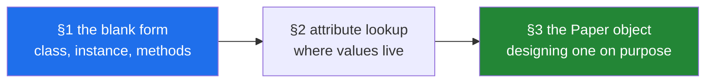

# Day 12 — Classes: building the `Paper` object

**Phase 2 · Advanced Python · Module 2** · `PY-13` — classes, attributes and methods. The plan's
named example for this ID is **`Paper` — the object the capstone's Reader agent will pass around**,
and Phase 2's deliverable is a `Paper` class hierarchy plus custom exceptions plus an async fetcher,
tested. Today writes the root of that hierarchy.

> **Yesterday:** the object that hands out one thing at a time, the keyword that builds one for you,
> and Phase 1's gate — a ten-function `src/setu/textutils.py`, fully tested.
> **Today:** how to make a type of your own: what it holds, where the values actually live, and what
> makes an object worth writing at all.
> **Tomorrow:** inheritance and abstraction — one word, three behaviours, and a base class that
> refuses to be built.

> **Read this hub first**, then work through `parts/` in order. No time estimate here or anywhere — a
> day is a unit of subject, not of hours (Principle 17).

---

## §1 The story

There is a small library above a community centre, and every book in it has a card in a wooden
drawer. Somebody made a blank card once, photocopied it, pinned the original above the drawer, and
that blank is the reason the whole thing works.

Three cards came out of the drawer this morning:

```text
Title:  The Kitchen Table    Title:  Weeknight Bread    Title:  The Kitchen Table
Year:   2019                 Year:   2021               Year:   2019
Source: donated              Source: bought             Source: bought
```

Everything today is somewhere in that room.

- **The pinned-up blank** is a class. It is not a book. It says what every card will say — which
  three things get written down, in which order, for anything that arrives.
- **Each filled-in card** is an instance, with its own words on it. Correcting one card corrects one
  card.
- **The laminated instruction sheet** above the drawer is where the methods live. There is one copy,
  not one per card, and reading it while holding a card is what makes an instruction into an action.
- **The line printed at the bottom of the blank** — *Main Room · Community Centre Library* — is a
  class attribute. Nobody writes it and every card has it, until somebody crosses it out on one copy
  and writes *Annexe*.
- **The single notepad pinned next to the blank, headed TAGS**, is the day's most expensive mistake.
  One notepad, three hundred cards. The first person writes *cooking* on it, and every card ever
  catalogued is now tagged cooking, and neither person did anything wrong.
- **The narrow card index in the sales leaflet** — three printed boxes, nine hundred to a drawer, and
  nowhere at all to write "torn cover" — is `__slots__`, and the leaflet is honest about both halves.
- **Two of the three cards describe the same book.** The drawer counts two, because a drawer has no
  opinion about what its cards mean. Python says the same thing about two of your objects, and it
  says it in silence.

Then there is the meeting nobody wanted, which is the one that mattered. Before the blank was
printed, somebody had to decide what went on it. *Title* was obvious. *Year* took an argument about
books with no year printed anywhere. *Source* took another about donations that arrive with no note.
And somebody proposed *Condition*, which was dropped, because condition changes and a card written
once is the wrong place for something different next month.

Three lines, after an hour. That hour is the difference between an object the rest of this plan can
carry and one it has to work around.



---

## §2 The map

**What the section numbers mean today.** One ID, so the sections follow the plan's `lab` split from
mechanism to production use: **1.x** is what a class *is* — the blank, the filled copy, and the
instructions; **2.x** is where the values actually live, which is the machinery behind every surprise
in section 1; **3.x** is the design work, applied to the one object this plan carries from here to
Day 240.

### Section 1 — the blank form

| Part | What it answers | Level |
|---|---|---|
| [1.1 A class is a blank form, an instance is a filled copy](parts/01-the-blank-form/1.1-a-class-is-a-blank-form.md) | Why is `isinstance(Card, Card)` `False`? | `foundation` |
| [1.2 `__init__` runs on an object that already exists](parts/01-the-blank-form/1.2-init-and-self.md) | If `__init__` does not create the object, what does? | `foundation` |
| [1.3 Methods are functions that found their object](parts/01-the-blank-form/1.3-methods-find-their-object.md) | Why does a method missing `self` say one argument was given? | `working` |
| [1.4 Instance attributes and class attributes](parts/01-the-blank-form/1.4-instance-and-class-attributes.md) | Why does `self.count += 1` leave the class at zero? | `working` |
| [1.5 The class attribute everybody shares](parts/01-the-blank-form/1.5-the-shared-class-attribute.md) | Why does appending to one object's list change every object's? | `production` |

### Section 2 — attribute lookup

| Part | What it answers | Level |
|---|---|---|
| [2.1 `__dict__` — where an attribute actually lives](parts/02-attribute-lookup/2.1-the-instance-dict.md) | Where do you look first when an attribute is wrong? | `working` |
| [2.2 Setting attributes from outside](parts/02-attribute-lookup/2.2-setting-attributes-from-outside.md) | Why is the same typo loud on a read and silent on a write? | `working` |
| [2.3 `__slots__` and a million objects](parts/02-attribute-lookup/2.3-slots-and-a-million-objects.md) | What does the memory saving cost you? | `production` |
| [2.4 Your object and equality](parts/02-attribute-lookup/2.4-your-object-and-equality.md) | Why did `set()` fail to deduplicate two identical records? | `production` |

### Section 3 — the `Paper` object

| Part | What it answers | Level |
|---|---|---|
| [3.1 Designing `Paper` — the fields, and which are optional](parts/03-the-paper-object/3.1-designing-paper.md) | Which absence value does a missing year get, and why not `0`? | `working` |
| [3.2 Validation in `__init__`](parts/03-the-paper-object/3.2-validation-in-init.md) | What happens to the object when the constructor raises? | `production` |
| [3.3 A method, or a function beside it?](parts/03-the-paper-object/3.3-method-or-function-beside-it.md) | Which four questions decide where a behaviour goes? | `production` |
| [3.4 When not to write a class](parts/03-the-paper-object/3.4-when-not-to-write-a-class.md) | Which two things must both be true before a class earns its place? | `production` |

---

## §3 Setup — run this

**No new packages today.** Everything is the language itself plus `tracemalloc` from the standard
library. Module 2 is still the language; the first new dependency is not until Phase 3.

```bash
mkdir -p src/setu tests notebooks
touch src/setu/paper.py tests/test_paper.py

# a scratchpad for today - the notebook is never the deliverable (P6)
touch notebooks/day-12-scratch.ipynb

# yesterday's module must already exist - Paper imports from it, never duplicates it
uv run python -c "from setu.textutils import clean_title, title_key; print('textutils ok')"

# the five facts the day is built on, before any part names them
uv run python -c "
class Card:
    drawer = 'Main Room'
    tags = []
    def __init__(self, title):
        self.title = title
    def summary(self):
        return self.title

a, b = Card('The Kitchen Table'), Card('The Kitchen Table')
print('1 class is not an instance :', isinstance(Card, Card), '<- part 1.1')
print('2 init returns             :', Card.__init__(a, 'x'), '<- part 1.2')
print('3 method is stored once    :', a.summary.__func__ is b.summary.__func__, '<- part 1.3')
a.tags.append('cooking')
print('4 one notepad for everybody:', b.tags, '<- part 1.5')
print('5 equal values, unequal     :', vars(a) == vars(b), a == b, '<- part 2.4')
"

# the measurement section 2 rests on - run it and read YOUR numbers
uv run python -c "
import tracemalloc

class Plain:
    def __init__(self, t, y): self.title, self.year = t, y

class Slotted:
    __slots__ = ('title', 'year')
    def __init__(self, t, y): self.title, self.year = t, y

for cls in (Plain, Slotted):
    tracemalloc.start()
    objs = [cls('The Kitchen Table', 2019) for _ in range(200_000)]
    print(f'{cls.__name__:8} peak MB: {tracemalloc.get_traced_memory()[1] / 1048576:.1f}')
    tracemalloc.stop()
    del objs
"

# the rule that catches today's headline bug, read from the installed linter
uv run ruff rule B006
```

| What | Where it comes from | Part |
|---|---|---|
| `class`, `__init__`, `self`, instantiation | language | [1.1](parts/01-the-blank-form/1.1-a-class-is-a-blank-form.md), [1.2](parts/01-the-blank-form/1.2-init-and-self.md) |
| `__new__`, `type()`, `isinstance` | language, built-ins | [1.1](parts/01-the-blank-form/1.1-a-class-is-a-blank-form.md), [1.2](parts/01-the-blank-form/1.2-init-and-self.md) |
| bound methods, `__self__`, `__func__` | language | [1.3](parts/01-the-blank-form/1.3-methods-find-their-object.md) |
| class attributes, `del obj.attr` | language | [1.4](parts/01-the-blank-form/1.4-instance-and-class-attributes.md) |
| `__dict__`, `vars`, `dir`, `mappingproxy` | language, built-ins | [2.1](parts/02-attribute-lookup/2.1-the-instance-dict.md) |
| `getattr`, `setattr`, `delattr`, `hasattr` | built-ins | [2.2](parts/02-attribute-lookup/2.2-setting-attributes-from-outside.md) |
| `__slots__`, `tracemalloc` | language, standard library | [2.3](parts/02-attribute-lookup/2.3-slots-and-a-million-objects.md) |
| default `==` and identity | language | [2.4](parts/02-attribute-lookup/2.4-your-object-and-equality.md) |
| `clean_title`, `title_key` | already built on [Day 10](../day-10-functions/parts/03-the-module/3.2-designing-clean-title.md) | [3.2](parts/03-the-paper-object/3.2-validation-in-init.md), [3.3](parts/03-the-paper-object/3.3-method-or-function-beside-it.md) |
| the mutable-default rule | already met on [Day 10](../day-10-functions/parts/01-the-signature/1.3-defaults-and-when-they-run.md) | [1.5](parts/01-the-blank-form/1.5-the-shared-class-attribute.md) |
| ruff's `B006` | already selected on [Day 2](../day-02-quality-gate/parts/01-linting/1.2-choosing-rule-families.md) | [1.5](parts/01-the-blank-form/1.5-the-shared-class-attribute.md) |

---

## §4 Build brief

**One new module.** `src/setu/paper.py` holds the type; `src/setu/textutils.py` keeps the text
functions and is imported, never duplicated.

**1. `src/setu/paper.py`** — the type, with every field decided before any body is written
([3.1](parts/03-the-paper-object/3.1-designing-paper.md)) and every rule enforced at construction
([3.2](parts/03-the-paper-object/3.2-validation-in-init.md)).

```python
"""The object the rest of Setu carries around.

Design decisions live in the class docstring on purpose: a reader deciding
whether they may pass a paper with no year should not have to read a body.
"""

from __future__ import annotations

from setu.textutils import clean_title


class Paper:
    """One paper, as this project knows it. A Paper that exists is a valid Paper.

    Required:
        title: cleaned by clean_title, never empty after cleaning.

    Optional, each with a decided absence value (part 3.1):
        year:     int | None. None, never 0 - 0 sorts as data.
        source:   str | None, and must be in SOURCES when given (P9: provenance).
        doi:      str | None. The strongest identity key.
        arxiv_id: str | None. The second-strongest.
        authors:  list[str], always a list, empty when unknown - callers iterate it.

    Identity, by precedence (part 2.4):
        doi -> arxiv_id -> (title_key(title), year)

    Deliberately absent (part 3.1):
        fetched_at, score, cache_key - these belong to a run, not to a paper.
    """

    SOURCES = ("arxiv", "openalex", "manual", "unknown")
    EARLIEST_YEAR = 1600

    def __init__(
        self,
        title: str,
        *,
        year: int | None = None,
        source: str | None = None,
        doi: str | None = None,
        arxiv_id: str | None = None,
        authors: list[str] | None = None,
    ) -> None:
        """Build a Paper, or raise.

        Raises:
            TypeError: title is not a str, or year is not an int or None.
            ValueError: title empty after cleaning, year outside range, or
                source not in SOURCES.
        """
        # TODO(me): clean, THEN check, THEN store - part 3.2 says what each other
        # order gets you. Every raise carries the offending value with !r.
        #
        # Set EVERY field unconditionally, including the ones that stay None:
        # part 2.1's failure section shows what a conditional assignment does to
        # the object's shape.
        #
        # `authors` needs list(authors) if authors else [] - part 1.5. You should
        # be able to say what breaks without the list(...) as well as what breaks
        # without the else [].
        #
        # NOTE the bool trap: isinstance(True, int) is True, so a year check that
        # only tests isinstance(year, int) lets Paper('x', year=True) through.
        raise NotImplementedError

    def citation(self) -> str:
        """Return this paper as a one-line citation string.

        Uses only this paper's own fields (part 3.3, question 1).
        """
        # TODO(me): decide and DOCUMENT what an empty authors list produces.
        # "" and "Unknown" are both defensible; a caller cannot guess.
        raise NotImplementedError

    def is_preprint(self) -> bool:
        """True when this paper has no year, which this project treats as a preprint."""
        # TODO(me): one line. Then say in a comment whether the RULE belongs on
        # the type or should be a parameter - part 3.3 question 3 is that edge.
        raise NotImplementedError
```

**2. `src/setu/dedup.py`** — the functions that take papers and do not belong on `Paper`
([3.3](parts/03-the-paper-object/3.3-method-or-function-beside-it.md)).

```python
"""Functions over Papers. A different module, because the dependency runs one way."""

from __future__ import annotations

from collections.abc import Iterable, Iterator

from setu.paper import Paper
from setu.textutils import title_key


def same_paper(left: Paper, right: Paper) -> bool:
    """True when two papers are the same work. Symmetric: left and right are equal."""
    # TODO(me): use title_key. Include the year, and write a comment saying why
    # two papers with one title and two years are NOT the same work here.
    raise NotImplementedError


def unique_papers(papers: Iterable[Paper]) -> Iterator[Paper]:
    """Yield the first paper seen for each identity key, in input order."""
    # TODO(me): day 11 part 4.2's shape over Papers. Keep a set of KEYS - part 2.4
    # says why a set of Papers cannot deduplicate anything.
    raise NotImplementedError
```

**3. Reproduce the four traps in the notebook, then throw the notebook away.** In
`notebooks/day-12-scratch.ipynb`, in this order:

- Put `tags = []` in a class body, append through one instance, and read it through another
  ([1.5](parts/01-the-blank-form/1.5-the-shared-class-attribute.md)). Then print both instances'
  `__dict__` and say why neither contains `tags`.
- Write `self.count += 1` in `__init__` with `count = 0` on the class, build three, and print
  `Card.count` ([1.4](parts/01-the-blank-form/1.4-instance-and-class-attributes.md)).
- Misspell an attribute on a write and then read the correct name
  ([2.2](parts/02-attribute-lookup/2.2-setting-attributes-from-outside.md)). Then add `__slots__` and
  watch the same write raise.
- Build two identical objects, put them in a set, and print the length
  ([2.4](parts/02-attribute-lookup/2.4-your-object-and-equality.md)).

**The notebook is not committed** (Principle 6); `src/setu/paper.py`, `src/setu/dedup.py` and their
tests are.

**4. Decide, in writing, whether `Paper` gets `__slots__`.** Run
[2.3](parts/02-attribute-lookup/2.3-slots-and-a-million-objects.md)'s measurement on your machine,
then write two sentences in the class docstring: what you decided and why. Either answer is
defensible; an undecided one is not.

---

## §5 The eval that must be able to fail

Create `tests/test_paper.py`. Every one of these runs offline and belongs in `./m check`.

```python
"""Day 12: prove Paper's promises, rather than believing them."""

from __future__ import annotations

import pytest

from setu.dedup import same_paper, unique_papers
from setu.paper import Paper


def test_title_is_cleaned_and_stored_cleaned() -> None:
    """Part 3.2 rule 3: the stored value is the one that was checked."""
    # TODO(me): pass a title with leading spaces, a doubled inner space and a
    # trailing dot. Assert on paper.title, written out in full. A test that
    # asserts clean_title(raw) == paper.title tests nothing - it computes the
    # expectation with the code under test.
    raise NotImplementedError


def test_empty_title_raises_value_error() -> None:
    """The invariant, made executable."""
    # TODO(me): pytest.raises(ValueError) on "" AND on "   ". The second is the
    # one a naive `if not title` check lets through after cleaning.
    raise NotImplementedError


def test_error_messages_carry_the_offending_value() -> None:
    """Part 3.2 rule 2: a message without the value costs an hour at 3am."""
    # TODO(me): use pytest.raises(..., match=...) and assert the repr of the bad
    # value appears in the message. Then delete the !r from one raise and watch
    # this go red.
    raise NotImplementedError


def test_year_none_is_allowed_and_zero_is_not() -> None:
    """Part 3.1: the absence value was chosen, so assert the choice."""
    # TODO(me): Paper("x") has year None; Paper("x", year=0) raises. Add a
    # comment naming what a year of 0 would do to a sort.
    raise NotImplementedError


def test_year_true_is_rejected() -> None:
    """isinstance(True, int) is True - part 3.2's bool trap."""
    # TODO(me): pytest.raises(TypeError) on year=True. This test goes red the
    # moment somebody 'simplifies' the check to isinstance(year, int).
    raise NotImplementedError


def test_every_field_exists_even_when_absent() -> None:
    """Part 2.1: the object's shape must not depend on its data."""
    # TODO(me): build one full Paper and one minimal Paper. Assert
    # set(vars(full)) == set(vars(minimal)). This is the test that catches a
    # conditional assignment in __init__.
    raise NotImplementedError


def test_authors_defaults_to_a_new_empty_list_each_time() -> None:
    """Part 1.5: the headline bug of the day, asserted rather than described."""
    # TODO(me): build two Papers with no authors, append to one, assert the
    # other is still empty. Then assert `a.authors is not b.authors`.
    raise NotImplementedError


def test_authors_copies_the_callers_list() -> None:
    """Part 1.5: list(authors), not authors."""
    # TODO(me): pass a list, append to the PAPER's authors, assert the caller's
    # list is unchanged. Remove the list(...) and watch this go red.
    raise NotImplementedError


def test_two_equal_papers_are_not_equal() -> None:
    """Part 2.4: the default is identity, and today's Paper does not change it."""
    # TODO(me): assert Paper("x") != Paper("x") and add a comment naming the day
    # that fixes it. This test exists so the behaviour is a decision rather than
    # a surprise - delete it on the day __eq__ is written.
    raise NotImplementedError


def test_same_paper_is_symmetric() -> None:
    """Part 3.3 question 2: neither argument is privileged."""
    # TODO(me): assert same_paper(a, b) == same_paper(b, a) for a pair where the
    # two differ in case, spacing and a trailing dot.
    raise NotImplementedError


def test_unique_papers_keeps_input_order_and_is_lazy() -> None:
    """Day 11's rules, over Papers."""
    # TODO(me): three papers with the duplicate in the MIDDLE. Assert the order,
    # then assert type(unique_papers(...)).__name__ == "generator".
    raise NotImplementedError


@pytest.mark.parametrize("bad_source", ["", "a friend", "ARXIV"])
def test_unknown_source_is_rejected(bad_source: str) -> None:
    """Principle 9: provenance is a field with a fixed vocabulary."""
    # TODO(me): pytest.raises(ValueError). Note that "ARXIV" is in the list only
    # if you casefold - decide whether you do, and make the test say so.
    raise NotImplementedError
```

Run them and watch every one fail before you write a line:

```bash
uv run python -m pytest tests/test_paper.py -v
```

Then implement, then **break each one on purpose**:

- Move `tags`-style state onto the class body — put `authors = []` above `__init__` and delete the
  assignment. **Two tests go red**, and they are the two that test different halves of the same bug.
- Delete the `list(...)` around `authors`. **Only the copy test goes red**, which is how you learn
  that the default test and the copy test are not the same test.
- Change the year check to `isinstance(year, int)` alone. The bool test goes red and nothing else
  does.
- Make one field conditional: `if doi: self.doi = doi`. The shape test goes red with a set difference
  in the message; every other test stays green.
- Delete the `!r` from one error message. The message test goes red, and read the diff: it is the
  clearest possible demonstration of what that one character buys.
- **Store the raw title and validate the cleaned one.** Every test still passes except the first, and
  if you wrote the first one as `clean_title(raw) == paper.title` it passes too. Do not restore it
  until you can say why that assertion was worthless.

That last item is the most important line in this section. A test that computes its expectation with
the code under test cannot fail, and a suite full of them is exactly the failure Principle 7 exists to
prevent.

---

## §6 Request budget

| Resource | Today |
|---|---|
| LLM API calls | **0** — no model is called on this day |
| Network requests | **0** — nothing today leaves your machine |
| Free-tier quota | none consumed |
| Cost | **$0** (Principle 5) |

Module 2 is still the language, so the whole day runs offline. `./m check` runs `-m "not live"`, so
today's tests join the free path only
([Day 2, 5.3](../day-02-quality-gate/parts/05-ci/5.3-caching-and-never-spending-a-quota.md)).

---

## §7 Traps

- **`isinstance(Card, Card)` is `False` — the class is not one of its own instances** —
  [1.1](parts/01-the-blank-form/1.1-a-class-is-a-blank-form.md).
- **Printing an object gives a class name and an address, and no data** —
  [1.1](parts/01-the-blank-form/1.1-a-class-is-a-blank-form.md).
- **`__init__` does not create the object and must return `None`** —
  [1.2](parts/01-the-blank-form/1.2-init-and-self.md).
- **A method written without `self` reports "takes 0 positional arguments but 1 was given"** —
  [1.2](parts/01-the-blank-form/1.2-init-and-self.md).
- **An attribute a method uses but `__init__` never set fails only when that method runs** —
  [1.2](parts/01-the-blank-form/1.2-init-and-self.md).
- **A mutable default in `__init__`'s parameter list is shared by every instance** —
  [1.2](parts/01-the-blank-form/1.2-init-and-self.md), [1.5](parts/01-the-blank-form/1.5-the-shared-class-attribute.md).
- **`Card.summary` is a function and `card.summary` is a bound method** —
  [1.3](parts/01-the-blank-form/1.3-methods-find-their-object.md).
- **A method called through the class needs `self` supplied by hand** —
  [1.3](parts/01-the-blank-form/1.3-methods-find-their-object.md).
- **A stored bound method keeps its object alive after `del`** —
  [1.3](parts/01-the-blank-form/1.3-methods-find-their-object.md).
- **Seeing "bound method" in output means somebody forgot the brackets** —
  [1.3](parts/01-the-blank-form/1.3-methods-find-their-object.md).
- **Reading falls back to the class; writing always lands on the instance** —
  [1.4](parts/01-the-blank-form/1.4-instance-and-class-attributes.md).
- **`self.count += 1` leaves the class at zero and gives every instance a `1`** —
  [1.4](parts/01-the-blank-form/1.4-instance-and-class-attributes.md).
- **"type object 'Card' has no attribute" means you asked the class for an instance's field** —
  [1.4](parts/01-the-blank-form/1.4-instance-and-class-attributes.md).
- **An instance attribute can shadow a method and make it uncallable** —
  [1.4](parts/01-the-blank-form/1.4-instance-and-class-attributes.md),
  [2.2](parts/02-attribute-lookup/2.2-setting-attributes-from-outside.md).
- **A mutable class attribute is one object for every instance, and mutating is not writing** —
  [1.5](parts/01-the-blank-form/1.5-the-shared-class-attribute.md).
- **`clear()` plus `extend()` is the same bug as `append()`** —
  [1.5](parts/01-the-blank-form/1.5-the-shared-class-attribute.md).
- **A test that passes alone and fails in the suite is shared state** —
  [1.5](parts/01-the-blank-form/1.5-the-shared-class-attribute.md).
- **Methods are not in an instance's `__dict__`** —
  [2.1](parts/02-attribute-lookup/2.1-the-instance-dict.md).
- **A class's `__dict__` is a read-only `mappingproxy`** —
  [2.1](parts/02-attribute-lookup/2.1-the-instance-dict.md).
- **A conditionally-set attribute makes the object's shape depend on its data** —
  [2.1](parts/02-attribute-lookup/2.1-the-instance-dict.md),
  [3.1](parts/03-the-paper-object/3.1-designing-paper.md).
- **A misspelled attribute is loud on a read and silent on a write** —
  [2.2](parts/02-attribute-lookup/2.2-setting-attributes-from-outside.md).
- **"Did you mean" suggests what exists, so it will suggest an earlier typo** —
  [2.2](parts/02-attribute-lookup/2.2-setting-attributes-from-outside.md).
- **`hasattr` runs the read, so it can execute code and raise something else** —
  [2.2](parts/02-attribute-lookup/2.2-setting-attributes-from-outside.md).
- **`__slots__ = ("title")` is a bare string, not a one-tuple** —
  [2.3](parts/02-attribute-lookup/2.3-slots-and-a-million-objects.md).
- **A parent without `__slots__` gives every instance a `__dict__` back** —
  [2.3](parts/02-attribute-lookup/2.3-slots-and-a-million-objects.md).
- **`vars()` raises `TypeError` on a slotted object** —
  [2.3](parts/02-attribute-lookup/2.3-slots-and-a-million-objects.md).
- **`==` on your own class compares identity, so `in`, `set` and `dict` all miss** —
  [2.4](parts/02-attribute-lookup/2.4-your-object-and-equality.md).
- **`sorted()` on your objects raises rather than guessing** —
  [2.4](parts/02-attribute-lookup/2.4-your-object-and-equality.md).
- **A year of `0` sorts before every real year and looks like data** —
  [3.1](parts/03-the-paper-object/3.1-designing-paper.md).
- **An optional list stored as `None` pushes a guard into every caller** —
  [3.1](parts/03-the-paper-object/3.1-designing-paper.md).
- **`isinstance(True, int)` is `True`, so a year check needs a bool clause** —
  [3.2](parts/03-the-paper-object/3.2-validation-in-init.md).
- **Validating the raw value and storing it means the check and the data disagree** —
  [3.2](parts/03-the-paper-object/3.2-validation-in-init.md).
- **A method that reaches the network makes every test of the class a network test** —
  [3.3](parts/03-the-paper-object/3.3-method-or-function-beside-it.md).
- **A comparison written as a method can disagree with itself when the arguments swap** —
  [3.3](parts/03-the-paper-object/3.3-method-or-function-beside-it.md).
- **A class with one method and no fields is a function** —
  [3.4](parts/03-the-paper-object/3.4-when-not-to-write-a-class.md).
- **A class whose fields are never read together is two types sharing a name** —
  [3.4](parts/03-the-paper-object/3.4-when-not-to-write-a-class.md).

---

## §8 Verify before you code

Fetched **2026-09-01**. Today is the language itself, so the language reference and tutorial are the
authority rather than any library's documentation:

- <https://docs.python.org/3/tutorial/classes.html> — the tutorial's whole treatment of classes,
  including the section on class and instance variables that spells out the shared-mutable trap with
  a `tricks = []` example. That is
  [1.4](parts/01-the-blank-form/1.4-instance-and-class-attributes.md) and
  [1.5](parts/01-the-blank-form/1.5-the-shared-class-attribute.md) in the language's own words.
- <https://docs.python.org/3/reference/datamodel.html#object.__init__> — the rule that `__init__` is
  called after the instance is created and must return `None`, which is
  [1.2](parts/01-the-blank-form/1.2-init-and-self.md).
- <https://docs.python.org/3/reference/datamodel.html#slots> — `__slots__`, including the notes about
  inheritance and about `__dict__` reappearing, which is
  [2.3](parts/02-attribute-lookup/2.3-slots-and-a-million-objects.md).
- <https://docs.python.org/3/reference/datamodel.html#object.__eq__> — the default comparison
  behaviour, and the rule binding `__eq__` to `__hash__`. Day 15 writes these; today only reads the
  default, which is [2.4](parts/02-attribute-lookup/2.4-your-object-and-equality.md).
- <https://docs.python.org/3/library/functions.html#vars> — `vars`, and the fact that it needs a
  `__dict__`, which is why it fails on a slotted object.
- <https://docs.python.org/3/library/tracemalloc.html> — `start`, `get_traced_memory` and the
  current-versus-peak pair that section 2 measures with.
- <https://peps.python.org/pep-0008/> — the naming conventions this project follows for classes and
  attributes, and the reason `self` is never renamed.
- `uv run ruff rule B006` — the mutable-default rule, read from the linter you have installed.

---

## §9 Say it in an interview

> "A class is a description of a kind of thing and an instance is one of them, and the two are
> separate objects — the class is created once at import and each instance has its own attribute
> storage, which is literally a dictionary called `__dict__`. That storage detail is worth knowing
> because it explains the behaviour people find surprising: reading an attribute checks the instance
> and falls back to the class, but *writing* always creates it on the instance — so a mutable value
> defined in the class body is one object shared by everybody, and `self.tags.append(x)` mutates it
> rather than assigning, which means no instance attribute is ever created and every object sees the
> change. Same underlying rule as the mutable default argument, and the fix is the same: build it per
> instance in `__init__`, and copy anything the caller handed you so you are not mutating their data.
> `__init__` itself is worth being precise about — it is not a constructor, the object already exists
> when it runs, which is why it returns `None` and why raising from it is safe: the name never gets
> bound, so there is no half-built object anywhere. That is why I validate there. Every rule about
> the type goes in the constructor with the offending value in the message, and then nothing
> downstream has to check. The trap I always mention is that `isinstance(True, int)` is `True`, so a
> year field validated only with `isinstance(year, int)` accepts `True` and you get a paper from year
> one. On equality: `==` on a class you wrote compares identity unless you define `__eq__`, so two
> identical records are unequal, `in` misses them and `set()` will not deduplicate them — silently,
> which is what makes it expensive. And the judgement I care about more than any of this is when
> *not* to write a class: it needs several values that travel together *and* rules or behaviour about
> them. One method and no fields is a function, and field names that come from a header row are a
> dictionary."

---

## §10 Done when

Every box in [`CHECKLIST.md`](CHECKLIST.md) is ticked, `./m check` is green, `src/setu/paper.py`
builds a `Paper` that cannot exist in an invalid state, and you have **watched a test stay green
through a real defect** — the raw-title storage in §5 — not when a particular amount of time has
passed. Then:

```bash
./m done 12
```

Tomorrow is inheritance, polymorphism, encapsulation and abstraction: one base class, three loaders,
and an abstract class that refuses to be built until `.load()` exists. `Paper` is what all three of
them return.
