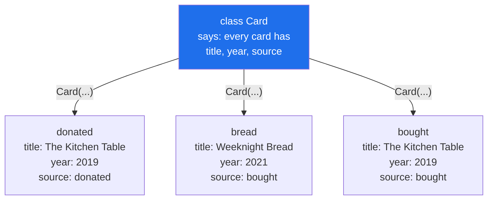

# 1.1 — A class is a blank form, an instance is a filled copy

## One-line answer

A class says what every object of a kind will have and be able to do; an instance is one filled-in
copy of that, with its own values — and the two are different objects, which is the source of both
the power and the confusion.

---

## The story

There is a small library above a community centre, and every book in it has a card in a wooden
drawer. Somebody made a blank card once, photocopied it, and pinned the original above the drawer.
The blank has three lines printed on it:

```text
Title:
Year:
Source:
```

That pinned-up blank is not a book. You cannot look up a book on it, because it says nothing about
any particular book. It says what *every* card will say — which three things get written down, in
which order, for anything that arrives.

Three cards came out of the drawer this morning:

```text
Title:  The Kitchen Table    Title:  Weeknight Bread    Title:  The Kitchen Table
Year:   2019                 Year:   2021               Year:   2019
Source: donated              Source: bought             Source: bought
```

Two of them are the same book. Somebody catalogued the donated copy in March and the bought copy in
August, and neither knew about the other. That is not a mistake anybody made carelessly; it is what
happens when two people fill in the same blank at different times.

Notice what the blank gives you. Every card has the same three lines, in the same order, so anybody
can read any card without being told how. And notice what it does not give you: it has no opinion
about whether two filled-in cards describe the same book.

---

## The idea in plain language

A **class** is a description of a kind of thing: what each one will hold, and what each one can do.
The library's pinned-up blank is a class.

An **instance** is one actual thing made from that description, with its own values. Each card in the
drawer is an instance.

To **instantiate** is to make one. In Python that is written like a function call — `Card(...)` — and
what comes back is a new object with its own storage.

Three words for the parts, and it is worth fixing them now because they are used loosely everywhere
else:

- An **attribute** is a named value stored on an object. `Title:` on the card is an attribute; in
  Python it is written `card.title`.
- A **method** is a function that belongs to the class and is called on an instance. "Read this card
  out loud" is a method.
- **`self`** is the name a method uses for the instance it was called on. It is an ordinary parameter
  and not a keyword, which [1.2](1.2-init-and-self.md) is about.

Day 4 said everything in Python is an object with an identity, a type and a value
([Day 4, 1.1](../../../day-04-objects/parts/01-objects/1.1-identity-type-value.md)). Today you make
your own *type*. A class is the type; the instances are objects of that type. That means `type(card)`
prints your class, and `isinstance(card, Card)` is `True` — the same machinery Python's own types use,
with nothing special about the built-ins.

There is a fourth word that this whole day rests on, and it is the reason classes exist at all:
**state**. A dictionary can hold three values, and a function can do a job. A class is what you reach
for when a set of values and the operations on them belong together and travel together — when
"the title, the year, the source, and the way you decide whether two of these are the same book" is
one idea rather than four.

---

## Why Setu needs it

- **The plan's example for `PY-13` is `Paper`** — *the object the capstone's Reader agent will pass
  around*. Every day from here to Day 240 passes objects between functions, and Day 12's job is to
  make the first one.
- **Day 13 builds `BaseLoader` → `PDFLoader` → `HTMLLoader`.** A class hierarchy needs a class to be
  a hierarchy of, and tomorrow assumes today.
- **Day 19's Pydantic models and Day 23's LangGraph state are both classes.** By then a class has to
  be as ordinary as a function, or those days become about syntax rather than about validation and
  state.
- **You have already used one.** [Day 11, 1.2](../../../day-11-iterators-and-generators/parts/01-iterators/1.2-writing-next-by-hand.md)
  wrote a five-line class with two methods, deliberately borrowing the syntax before it was taught.
  Today is where the borrowing is repaid.

---

## The mechanism

The blank and three filled copies:

```python
"""One class, three instances, each with its own values."""


class Card:
    """One catalogue card: a title, a year, and where the copy came from."""

    def __init__(self, title, year, source):
        self.title = title
        self.year = year
        self.source = source


donated = Card("The Kitchen Table", 2019, "donated")
bread = Card("Weeknight Bread", 2021, "bought")
bought = Card("The Kitchen Table", 2019, "bought")

print("the class    :", Card)
print("one instance :", donated.title, donated.year, donated.source)
print("another      :", bread.title, bread.year, bread.source)
print()
print("type of an instance:", type(donated).__name__)
print("is it a Card?      :", isinstance(donated, Card))
print("is the class a Card?:", isinstance(Card, Card))
```

Run on Python 3.12.12 on 2026-09-01:

```
the class    : <class '__main__.Card'>
one instance : The Kitchen Table 2019 donated
another      : Weeknight Bread 2021 bought

type of an instance: Card
is it a Card?      : True
is the class a Card?: False
```

**Line by line:**

- `class Card:` — the `class` statement, and it **runs when the file is imported**, not when an
  instance is made. It builds one object, the class itself, and binds it to the name `Card`.
- The docstring on the line below — the same convention as a function
  ([Day 10, 1.6](../../../day-10-functions/parts/01-the-signature/1.6-the-signature-is-the-contract.md)),
  and it answers "what is one of these?" rather than "what does this do?".
- `def __init__(self, title, year, source):` — the set-up step, run once per instance.
  [1.2](1.2-init-and-self.md) is entirely about this line; today it is the place the three values get
  stored.
- `self.title = title` — **the left side is on the object, the right side is the parameter.** They are
  spelled the same on purpose and they are two different things: `title` disappears when `__init__`
  ends, and `self.title` stays for the life of the instance.
- `Card("The Kitchen Table", 2019, "donated")` — instantiation. It looks exactly like a function call
  and produces a new object every time.
- `print("the class    :", Card)` prints `<class '__main__.Card'>`. **The class is itself an object**
  and can be printed, passed to a function and stored in a list, which is what Day 13's loaders will
  do.
- `type(donated).__name__` is `Card`, not `object` and not `instance`. Your class is a real type.
- `isinstance(Card, Card)` is `False` — **the blank pinned above the drawer is not one of the cards.**
  That line is here because the confusion it prevents is the most common one on this day.

Three instances, three separate boxes of values:

```python
"""Each instance has its own storage. Changing one changes nothing else."""


class Card:
    def __init__(self, title, year, source):
        self.title = title
        self.year = year
        self.source = source


donated = Card("The Kitchen Table", 2019, "donated")
bought = Card("The Kitchen Table", 2019, "bought")

print("before:", donated.source, "|", bought.source)

bought.source = "bought, replacement copy"

print("after :", donated.source, "|", bought.source)
print("same object?", donated is bought)
print("donated's own values:", donated.__dict__)
print("bought's own values :", bought.__dict__)
```

Run on Python 3.12.12 on 2026-09-01:

```
before: donated | bought
after : donated | bought, replacement copy
same object? False
donated's own values: {'title': 'The Kitchen Table', 'year': 2019, 'source': 'donated'}
bought's own values : {'title': 'The Kitchen Table', 'year': 2019, 'source': 'bought, replacement copy'}
```

**Line by line:**

- `bought.source = "..."` — assigning to an attribute on **one** instance. Nothing about `Card` and
  nothing about `donated` changed.
- `donated is bought` prints `False`. Two instances built from the same class with two of the same
  values are still two objects
  ([Day 4, 3.2](../../../day-04-objects/parts/03-identity-trap/3.2-is-versus-equals.md)).
- `donated.__dict__` — **every instance carries a dictionary of its own attributes**, and printing it
  is the fastest way to see what an object actually holds. [2.1](../02-attribute-lookup/2.1-the-instance-dict.md)
  is about this dictionary; here it is the proof that the storage is per-instance.
- The two dictionaries have the same three keys, because the class decided the keys, and different
  values, because the instances decided the values. **That split is the whole of "a class is a blank
  form".**
- Nothing here prevents the two cards from describing the same book. Python has no opinion about it,
  and neither does the class — deciding that is [2.4](../02-attribute-lookup/2.4-your-object-and-equality.md)'s
  subject.



---

## When it breaks

**Printing an instance:**

```text
>>> class Card:
...     def __init__(self, title):
...         self.title = title
...
>>> print(Card("The Kitchen Table"))
<__main__.Card object at 0x000001C4BF70A4E0>
```

**What it means.** Python has no idea how you would like your object described, so it falls back to
the class name and the memory address. There is no error, and there is also no information: the
address changes every run and tells you nothing about the title. The fix is a `__repr__` method, and
that belongs to Day 15 (`PY-18`), which is where dunder methods are the subject. **Until then, print
`card.__dict__`** when you want to see what an object holds — it is honest, and it needs nothing you
have not met.

**A missing argument at instantiation:**

```text
$ uv run python -c "
class Card:
    def __init__(self, title):
        self.title = title
Card()
"
Traceback (most recent call last):
  File "<string>", line 5, in <module>
TypeError: Card.__init__() missing 1 required positional argument: 'title'
```

**What it means.** `Card()` is a call, and `__init__`'s parameters are its arguments — so every rule
from [Day 10, 1.2](../../../day-10-functions/parts/01-the-signature/1.2-positional-and-keyword.md)
applies unchanged. Note that the error names `Card.__init__` rather than `Card`, which is Python
telling you where the parameter list actually lives.

**A typo in an attribute name:**

```text
$ uv run python -c "
class Card:
    def __init__(self, title):
        self.title = title
c = Card('x')
print(c.titel)
"
Traceback (most recent call last):
  File "<string>", line 6, in <module>
AttributeError: 'Card' object has no attribute 'titel'. Did you mean: 'title'?
```

**What it means.** Reading a name that was never set raises, and since Python 3.10 the message
suggests the closest one it can find. Reading is the safe direction; **writing** a typo is the
dangerous one, because `c.titel = "x"` creates a new attribute and raises nothing at all
([2.2](../02-attribute-lookup/2.2-setting-attributes-from-outside.md)).

---

## In production

**The professional question is never "should this be a class?" on its own — it is "do these values
and these operations travel together?"** Three loose values passed through five functions are a
class waiting to be written; three loose values used once in one function are not. The signal is
repetition in signatures: when `def score(title, year, source)` and `def cite(title, year, source)`
and `def dedupe(title, year, source)` all exist, the parameter list has become a type and nobody has
said so.

**What a senior engineer looks for first is whether the class holds state that is genuinely
connected.** A class whose attributes are never read together — where one method uses only `title`
and another uses only `source` — is two things in a trench coat, and it will grow a third. This is
what [3.4](../03-the-paper-object/3.4-when-not-to-write-a-class.md) is about, and the reason it is a
document rather than an aside is that the mistake is very common and very expensive to undo.

**What changes at scale is the cost per instance.** Every plain instance carries its own dictionary,
which is convenient and not free: half a million small objects cost about 42 MB in this arrangement
and about 27 MB with `__slots__`
([2.3](../02-attribute-lookup/2.3-slots-and-a-million-objects.md) has the measurement). At three cards
this is irrelevant. At the scale Day 155's vector store works on, it is the difference between fitting
and not.

**The review comment a senior engineer leaves.** On a new class with three attributes and no methods:
*"Right now this is a dictionary with worse ergonomics — nothing here does anything with the values.
Either give it the behaviour that made you want a type (the comparison rule, the validation), or use
a `dict` until it earns one. If it is purely a record, wait for the dataclass on Day 19 rather than
hand-writing `__init__`."*

**The interview question.** *"What is the difference between a class and an instance?"* The answer
that lands is not the definition on its own; it is that the class is one object created when the
module is imported, and each instance is a separate object with its own attribute storage, so
`type(instance)` is the class and `isinstance(cls, cls)` is `False`. Adding that the class holds what
every instance *has* while each instance holds *what it is* — and that this is why a mutable value
defined on the class is shared by everybody
([1.5](1.5-the-shared-class-attribute.md)) — turns a definition into an explanation.

---

## Check yourself

```bash
uv run python -c "
class Card:
    def __init__(self, title, year, source):
        self.title = title
        self.year = year
        self.source = source

donated = Card('The Kitchen Table', 2019, 'donated')
bought = Card('The Kitchen Table', 2019, 'bought')
print('type   :', type(donated).__name__)
print('isinst :', isinstance(donated, Card), '| class is a Card?', isinstance(Card, Card))
print('same?  :', donated is bought)
print('values :', donated.__dict__)
print('values :', bought.__dict__)
"
```

Two cards describe the same book and `is` says `False`. Say which line of the class decides whether
they are "the same book", and then find it — it is not there.

**Answer out loud, without scrolling up:**

> Say what a class is and what an instance is, using something other than a computer as the example.
> Then say where each instance's values are actually stored, and how you can look at them.

---

**Next:** [1.2 — `__init__` runs on an object that already exists](1.2-init-and-self.md), which is
the line every class starts with and the one most people describe wrongly.
