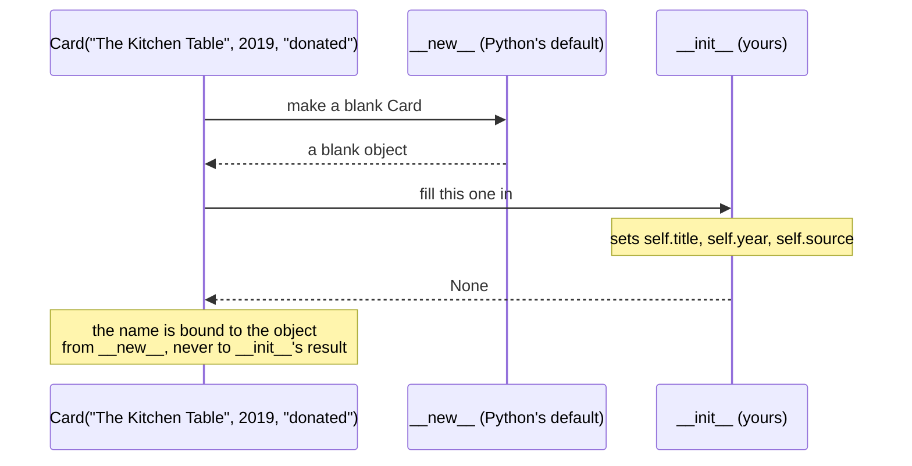

# 1.2 — `__init__` runs on an object that already exists, and `self` is just a parameter

## One-line answer

`__init__` does not create anything: by the time it runs, the object exists and is blank, and
`__init__`'s only job is to fill it in — which is why it returns nothing and why its first parameter
is the object itself.

---

## The story

Somebody new at the library is shown how a card gets made.

They expect to be handed a pen and told to write a card. Instead the person showing them takes a
blank photocopy off the pile, puts it on the desk, and *then* says: "right — title, year, source."

The card already exists. It came out of the pile with its three lines printed on it and nothing
filled in. The job is not to bring a card into being; it is to write on the one that is already
lying there.

So the three cards from this morning were each made in two steps that nobody thinks about separately:

```text
Title:                       Title:  The Kitchen Table
Year:            becomes     Year:   2019
Source:                      Source: donated
```

And when they finish writing, they do not hand the card to anybody. They put it in the drawer. The
card was never theirs to give back — it was on the desk the whole time, and everybody who cared
already knew where it was.

That last detail is the one that catches people. Filling in a form does not produce a form. It
changes the one in front of you.

---

## The idea in plain language

When you write `Card("The Kitchen Table", 2019, "donated")`, two things happen in order:

1. **A new, blank object is created.** This step has a name — `__new__` — and you will almost never
   write it. Python's default does the right thing for every ordinary class.
2. **`__init__` is called on that object**, with the arguments you passed. It fills in the values.

`__init__` is therefore not a constructor in the sense some other languages use the word. Its name is
short for *initialise*, and initialising is what it does: the object is already there, blank, and
`__init__` writes on it. A word for this step is the **initialiser**, and using that word rather than
"constructor" makes the next paragraph obvious instead of surprising.

**`__init__` returns nothing.** It has no `return` statement, and adding one that returns a value is
an error. That follows directly from the two steps above: the object was created in step 1, so there
is nothing for step 2 to hand back. Whoever wrote `card = Card(...)` gets the object from step 1,
not from `__init__`.

**`self` is the first parameter, and it is an ordinary parameter.** It is not a keyword. Python does
not reserve the word, and you could name it anything — the convention is universal and you should
never break it, but knowing that it is a convention rather than a rule explains the error messages in
this document. When you write `card.set_year(2019)`, Python turns that into
`Card.set_year(card, 2019)`, putting the instance in the first parameter slot. That mechanism is
[1.3](1.3-methods-find-their-object.md)'s subject.

One more thing that is easy to get backwards. Inside `__init__`, this line:

```
self.title = title
```

has a parameter on the right and an attribute on the left. The parameter `title` vanishes when
`__init__` finishes, exactly like any other local name
([Day 10, 2.1](../../../day-10-functions/parts/02-scope/2.1-legb-where-a-name-is-found.md)). The
attribute `self.title` is stored on the object and lives as long as the object does. They are spelled
the same because that reads well, and they are two different things.

---

## Why Setu needs it

- **Every class in the rest of this plan has one.** `Paper` on [3.1](../03-the-paper-object/3.1-designing-paper.md),
  the loaders on Day 13, the custom exceptions on Day 18, the Pydantic models on Day 19. Getting the
  mental model right once saves the same confusion twenty times.
- **[3.2](../03-the-paper-object/3.2-validation-in-init.md) puts validation here**, and "the object
  already exists when this runs" is exactly why raising from `__init__` is safe: nothing broken
  escapes, because the name was never bound.
- **Day 13's `super().__init__(...)`** only makes sense once you know that `__init__` is an ordinary
  method being called on an already-existing object, rather than something that makes one.
- **Day 19's dataclasses write `__init__` for you.** You should meet the generated thing after you
  have written it by hand, which is Principle 2 applied to a language feature rather than to a
  library.

---

## The mechanism

The two steps, made visible:

```python
"""Proof that the object exists before __init__ sees it."""


class Card:
    def __new__(cls, *args, **kwargs):
        obj = super().__new__(cls)
        print("  __new__ made :", hex(id(obj)))
        return obj

    def __init__(self, title):
        print("  __init__ got :", hex(id(self)))
        self.title = title


card = Card("The Kitchen Table")
print("the name refers to:", hex(id(card)))
print("__init__ returns  :", Card.__init__(card, "The Kitchen Table"))
```

Run on Python 3.12.12 on 2026-09-01:

```
  __new__ made : 0x217f8b0a630
  __init__ got : 0x217f8b0a630
the name refers to: 0x217f8b0a630
  __init__ got : 0x217f8b0a630
__init__ returns  : None
```

**Line by line:**

- `def __new__(cls, *args, **kwargs):` — the creation step, written out **only for this
  demonstration.** You will not write it in real code; Python's default is correct for every ordinary
  class. Its first parameter is `cls`, the class, because there is no instance yet.
- `super().__new__(cls)` — asks the base class, `object`, to make the blank instance. This is the line
  that actually brings the object into being.
- `hex(id(obj))` — the object's identity as a readable address
  ([Day 4, 1.1](../../../day-04-objects/parts/01-objects/1.1-identity-type-value.md)). It is printed
  three times so the three numbers can be compared.
- **All three addresses are the same.** `__new__` made it, `__init__` was handed it, and the name
  `card` refers to it. There is one object, and `__init__` never made anything.
- `Card.__init__(card, "The Kitchen Table")` — calling the initialiser **by hand**, on an existing
  object, passing the instance explicitly in the `self` slot. It works, it re-runs the setup, and it
  prints `None`. Do not write this in real code; it is here because it is the clearest possible proof
  that `__init__` is an ordinary method with an ordinary first parameter.
- `__init__ returns : None` — the last line of the output, and the reason `return self` at the bottom
  of an `__init__` is an error rather than a redundancy.

`self` is a name, not a keyword:

```python
"""The first parameter can be called anything. It should always be called self."""


class Card:
    def __init__(blank, title, year):
        blank.title = title
        blank.year = year

    def summary(blank):
        return f"{blank.title} ({blank.year})"


card = Card("The Kitchen Table", 2019)
print("it works:", card.summary())
print("stored  :", card.__dict__)
```

Run on Python 3.12.12 on 2026-09-01:

```
it works: The Kitchen Table (2019)
stored  : {'title': 'The Kitchen Table', 'year': 2019}
```

**Line by line:**

- `def __init__(blank, title, year):` — the first parameter is named `blank`, and **Python does not
  care.** It fills the first slot with the instance whatever the parameter is called.
- `blank.title = title` — attributes are set through whatever name the first parameter has. There is
  no magic attached to the word `self`.
- `def summary(blank):` — the same in an ordinary method, which is [1.3](1.3-methods-find-their-object.md)'s
  subject.
- `card.summary()` works with no arguments, because the instance goes into `blank` automatically.
- **Never do this.** The convention is universal, every tool assumes it, and ruff will flag it as
  `N805` if that rule family is enabled. The block exists so that the error messages below are
  readable, not as a suggestion.

The order of the two steps, as a diagram:



---

## When it breaks

**Returning a value from `__init__`:**

```text
$ uv run python -c "
class Card:
    def __init__(self, title):
        self.title = title
        return self
Card('The Kitchen Table')
"
Traceback (most recent call last):
  File "<string>", line 6, in <module>
TypeError: __init__() should return None, not 'Card'
```

**What it means.** Python checks this on purpose, because returning something from `__init__` always
means the author believes the initialiser produces the object. It does not. The fix is to delete the
`return`. A bare `return` with no value is allowed and is occasionally useful as an early exit.

**Forgetting `self` in the parameter list:**

```text
$ uv run python -c "
class Card:
    def show():
        return 'hi'
Card().show()
"
Traceback (most recent call last):
  File "<string>", line 5, in <module>
TypeError: Card.show() takes 0 positional arguments but 1 was given
```

**What it means.** This message reads backwards until you know the mechanism: you called `show()`
with nothing, and Python says one argument was given. The one argument is the instance, put in
automatically. Read `takes 0 but 1 was given` on a method as **"you forgot `self`"**, every time. It
is the same shape as
[Day 10, 1.5](../../../day-10-functions/parts/01-the-signature/1.5-keyword-only-and-positional-only.md)'s
error, where a count in the message does not match the count in the source.

**Using an attribute that `__init__` never set:**

```text
$ uv run python -c "
class Card:
    def __init__(self, title):
        self.title = title
    def summary(self):
        return f'{self.title} ({self.year})'
print(Card('The Kitchen Table').summary())
"
Traceback (most recent call last):
  File "<string>", line 7, in <module>
  File "<string>", line 6, in summary
AttributeError: 'Card' object has no attribute 'year'
```

**What it means.** `__init__` decides which attributes exist, and any method that uses one it did not
set will fail — but **only when that method is called.** The class imports cleanly, the instance is
created cleanly, and the error waits until somebody asks for a summary. This is why setting every
attribute in `__init__`, including the ones that start as `None`, is a habit worth having: it moves
the failure from "sometime later, in a method" to "never, because the attribute is always there".

**Setting a mutable default in the parameter list:**

```text
>>> class Card:
...     def __init__(self, title, tags=[]):
...         self.tags = tags
...
>>> a = Card("The Kitchen Table")
>>> b = Card("Weeknight Bread")
>>> a.tags.append("cooking")
>>> b.tags
['cooking']
```

**What it means.** Day 4 and Day 10 both warned about this
([Day 10, 1.3](../../../day-10-functions/parts/01-the-signature/1.3-defaults-and-when-they-run.md)),
and it is worth meeting once more here because in a class it looks like an attribute problem and is
not. `__init__` is an ordinary function, its default was evaluated once when the `def` ran, and every
instance that accepted the default now shares one list. The fix is the same: `tags=None` and
`self.tags = list(tags) if tags else []` inside. ruff's `B006` catches it.

---

## In production

**The professional habit is that `__init__` sets every attribute the class will ever have and does
as little else as possible.** It stores what it was given, converts and validates
([3.2](../03-the-paper-object/3.2-validation-in-init.md)), and stops. What it does not do is open
files, call networks or run expensive work, because a constructor that does I/O cannot be used in a
test without that I/O, and because an exception half way through leaves nothing to inspect — the name
was never bound, so there is no partly-built object to look at.

**What changes at scale is that `__init__` is on the hot path.** Building a million small objects
means running your initialiser a million times, and anything in it beyond attribute assignment shows
up immediately in a profile. This is where `__slots__` starts to matter
([2.3](../02-attribute-lookup/2.3-slots-and-a-million-objects.md)), and it is also where a validation
that costs a regular expression per instance turns out to cost more than the parsing that produced
the data.

**The failure that only appears with real data is the attribute set conditionally.** Writing
`if source: self.source = source` means the attribute exists on some instances and not others, and
every later `card.source` is a coin flip that raises `AttributeError` on the rows where the field was
blank. It passes every test built from complete records. The rule that prevents it is unconditional:
set it to `None` and let the reader deal with `None`, which is a value, rather than with a missing
attribute, which is a crash.

**The review comment a senior engineer leaves.** On a class whose `__init__` opens a file: *"This
does I/O in the constructor, so every test that builds one needs a real file and every failure to
open leaves the caller with no object and a traceback from inside `__init__`. Take the already-read
text as an argument, or add a separate `from_path` entry point later — Day 15's `classmethod` is the
usual home for that."*

**The interview question.** *"Is `__init__` a constructor?"* The answer that lands is: not really —
`__new__` creates the object and `__init__` initialises the one that already exists, which is why
`__init__` returns `None` and why its first parameter is the instance. If you can add that this is
also why `self` is a plain parameter rather than a keyword, and why a method missing `self` reports
"takes 0 positional arguments but 1 was given", you have explained three things people usually
memorise separately.

---

## Check yourself

```bash
uv run python -c "
class Card:
    def __init__(self, title, year):
        self.title = title
        self.year = year
    def summary(self):
        return f'{self.title} ({self.year})'

c = Card('The Kitchen Table', 2019)
print('bound method call :', c.summary())
print('same, spelled out :', Card.summary(c))
print('init returns      :', Card.__init__(c, 'The Kitchen Table', 2019))
print('stored            :', c.__dict__)
"
```

The second and third lines pass the instance by hand. Say what Python does automatically on the first
line to make it equivalent.

**Answer out loud, without scrolling up:**

> Say what already exists by the time `__init__` runs, and what `__init__` returns. Then explain why
> a method written without `self` reports that one argument was given when you passed none.

---

**Next:** [1.3 — methods are functions that found their object](1.3-methods-find-their-object.md),
which is the mechanism behind the two spelled-out calls you just ran.
