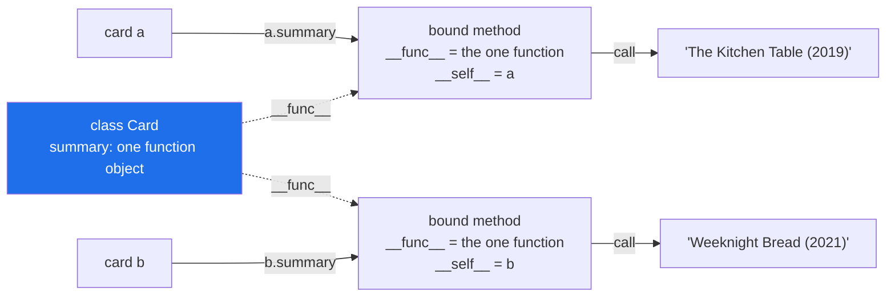

# 1.3 — Methods are functions that found their object

## One-line answer

A method is one function stored once on the class, and `card.summary` hands you that function with
the card already slotted into its first parameter — which is why you never pass `self` and why the
error message counts an argument you did not type.

---

## The story

Above the library's card drawer, next to the pinned blank, there is a laminated sheet of
instructions. One of them reads:

> **To read a card out loud:** say the title, then the year in brackets.

There is one copy of that instruction. There is not a copy taped to the back of every card, and it
would be silly if there were — three hundred identical laminated sheets, all saying the same thing.

But the instruction on its own cannot be carried out. "Say the title" — which title? The sheet says
what to do; it does not say what to do it *to*.

So in practice somebody picks up a card, holds it, and reads the sheet. The pair — the instruction
plus the card in your hand — is the thing that can actually be done. Neither half works alone.

The three cards are still the three cards:

```text
Title:  The Kitchen Table    Title:  Weeknight Bread    Title:  The Kitchen Table
Year:   2019                 Year:   2021               Year:   2019
Source: donated              Source: bought             Source: bought
```

Reading the sheet while holding the first gives *The Kitchen Table (2019)*. Reading the same sheet
while holding the second gives *Weeknight Bread (2021)*. One instruction, three answers, and the
difference is entirely which card is in your hand.

---

## The idea in plain language

A **method** is a function defined inside a `class` block. It is stored **once, on the class**, and
never copied onto the instances — the laminated sheet, not three hundred sheets.

When you write `card.summary`, Python does something specific and worth naming. It finds the function
`summary` on the class and wraps it together with `card`, producing a new small object called a
**bound method**. Bound means "the instance is already attached". Calling that bound method calls the
underlying function with the instance as its first argument.

So these two lines do exactly the same work:

- `card.summary()` — the way you write it.
- `Card.summary(card)` — what it becomes.

That single fact explains three things that otherwise have to be memorised:

1. **You never pass `self`.** It is supplied by the attachment.
2. **A method missing `self` in its parameter list reports "takes 0 positional arguments but 1 was
   given"** ([1.2](1.2-init-and-self.md)). The one argument is the instance.
3. **`Card.summary` is a plain function** and can be called with an explicit first argument, which is
   occasionally useful and mostly a way to understand the machinery.

Two words to keep apart. `Card.summary` is a **function** — reached through the class, nothing
attached. `card.summary` is a **method** — reached through an instance, with that instance attached.
Python's own `type()` says exactly that: `function` for the first, `method` for the second.

There is one more thing worth knowing early, because it explains a surprising error later.
**Attaching happens at lookup time, not at definition time.** Every `card.summary` builds a fresh
bound-method object. That is why methods can be passed around like any other function — `map(str.strip,
lines)` from [Day 11, 3.2](../../../day-11-iterators-and-generators/parts/03-lambda-and-map/3.2-map-and-filter-are-lazy.md)
is exactly this, using the unattached function form.

---

## Why Setu needs it

- **[3.3](../03-the-paper-object/3.3-method-or-function-beside-it.md) has to decide** which of
  `Paper`'s behaviours are methods and which stay as functions in `textutils.py`. That decision needs
  the mechanism first.
- **Day 13's polymorphism is method lookup.** Three loader classes each define `load`, and the one
  that runs depends on which object you are holding — which is the story in this document, with three
  different sheets instead of one.
- **Day 14's decorators wrap functions**, and a decorator applied to a method has to cope with the
  `self` in the first slot. Anybody who has not seen `Card.summary(card)` spelled out finds that
  bewildering.
- **`self.title` inside a method is an attribute lookup on the object you are holding**, which is how
  every method in `Paper` reaches the data. That is the whole of
  [2.1](../02-attribute-lookup/2.1-the-instance-dict.md), and it starts here.

---

## The mechanism

One function, two ways to reach it:

```python
"""The same function, unattached on the class and attached on an instance."""


class Card:
    def __init__(self, title, year):
        self.title = title
        self.year = year

    def summary(self):
        return f"{self.title} ({self.year})"


card = Card("The Kitchen Table", 2019)

print("through the instance:", card.summary)
print("through the class   :", Card.summary)
print()
print("what is attached?   :", card.summary.__self__ is card)
print("same underlying fn? :", card.summary.__func__ is Card.summary)
print()
print("call it the usual way :", card.summary())
print("call it spelled out   :", Card.summary(card))
print()
print("types:", type(card.summary).__name__, "vs", type(Card.summary).__name__)
```

Run on Python 3.12.12 on 2026-09-01:

```
through the instance: <bound method Card.summary of <__main__.Card object at 0x000001423055AA20>>
through the class   : <function Card.summary at 0x000001423051E200>

what is attached?   : True
same underlying fn? : True

call it the usual way : The Kitchen Table (2019)
call it spelled out   : The Kitchen Table (2019)

types: method vs function
```

**Line by line:**

- `card.summary` **without brackets** — this is the lookup, not the call. What it prints is
  `<bound method ... of <Card object ...>>`, and that phrase is Python describing the pairing in
  words: a method, bound, of this object.
- `Card.summary` without brackets prints `<function Card.summary ...>`. **Same code, different
  wrapper.** Reached through the class there is nothing to attach, so you get the plain function.
- `card.summary.__self__ is card` prints `True` — `__self__` is the attached instance, and it is
  the same object, not a copy.
- `card.summary.__func__ is Card.summary` prints `True` — `__func__` is the underlying function, and
  it is **the same one object** the class holds. Three hundred cards do not mean three hundred
  functions.
- `card.summary()` and `Card.summary(card)` print the same string. The first is what you write; the
  second is what it means. Reading the second out loud is the fastest cure for confusion about
  `self`.
- `type(...)` prints `method` and `function`. Those are two different types in Python, and the
  distinction is exactly "is an instance attached".
- The addresses in the first two lines will differ on your machine and between runs. They carry no
  information; what matters is that one line says `bound method` and the other says `function`.

The method that is really just a function, called on anything:

```python
"""Reaching a method through the class means supplying the first argument yourself."""


class Card:
    def __init__(self, title, year):
        self.title = title
        self.year = year

    def summary(self):
        return f"{self.title} ({self.year})"


a = Card("The Kitchen Table", 2019)
b = Card("Weeknight Bread", 2021)

read_out = Card.summary

print("one instruction, two cards:")
print(" ", read_out(a))
print(" ", read_out(b))

summaries = [Card.summary(card) for card in (a, b)]
print("as a list:", summaries)
```

Run on Python 3.12.12 on 2026-09-01:

```
one instruction, two cards:
  The Kitchen Table (2019)
  Weeknight Bread (2021)
as a list: ['The Kitchen Table (2019)', 'Weeknight Bread (2021)']
```

**Line by line:**

- `read_out = Card.summary` — storing the unattached function in a plain variable, exactly as
  [Day 10, 1.1](../../../day-10-functions/parts/01-the-signature/1.1-a-function-is-a-promise.md)
  stored any function. **No instance is involved yet.**
- `read_out(a)` and `read_out(b)` — the same function, the same laminated sheet, two different cards
  in the hand. This is the story's last paragraph, in code.
- `[Card.summary(card) for card in (a, b)]` — the comprehension form
  ([Day 9, 1.1](../../../day-09-comprehensions/parts/01-list-comprehensions/1.1-the-loop-and-the-comprehension.md)).
  In real code you would write `[card.summary() for card in (a, b)]`, which is clearer; this version
  shows what that one is doing underneath.
- `(a, b)` in round brackets is a tuple, and it is the right container for a fixed pair
  ([Day 8, 1.3](../../../day-08-containers/parts/01-sequences/1.3-a-tuple-is-a-record.md)).



---

## When it breaks

**Calling a method through the class with nothing:**

```text
$ uv run python -c "
class Card:
    def summary(self): return self.title
Card.summary()
"
Traceback (most recent call last):
  File "<string>", line 4, in <module>
TypeError: Card.summary() missing 1 required positional argument: 'self'
```

**What it means.** Reached through the class, `summary` is a plain function whose first parameter is
called `self` and which you did not supply. The message names `self` outright, which is Python being
unusually direct. Compare this against
[1.2](1.2-init-and-self.md)'s opposite error — "takes 0 positional arguments but 1 was given" — and
notice they are the same mechanism seen from the two sides.

**Passing something that is not a card at all:**

```text
$ uv run python -c "
class Card:
    def summary(self): return 'x'
print(Card.summary('anything at all'))
"
x
```

**What it means.** No error, and the output is `x`. Python does not check that the first argument is
a `Card` — it checks nothing at all
([Day 10, 1.6](../../../day-10-functions/parts/01-the-signature/1.6-the-signature-is-the-contract.md)
made the same point about annotations). The method only fails if it actually touches an attribute the
object does not have. This is worth knowing because it is the basis of duck typing, which Day 13
covers, and because it explains why a `self` that is secretly the wrong type produces an
`AttributeError` from deep inside a method rather than a clear error at the call.

**Storing a bound method and outliving the object:**

```text
>>> class Card:
...     def __init__(self, title):
...         self.title = title
...     def summary(self):
...         return self.title
...
>>> card = Card("The Kitchen Table")
>>> handler = card.summary
>>> del card
>>> handler()
'The Kitchen Table'
```

**What it means.** `del card` removed the *name*, and the object is still alive because the bound
method holds a reference to it in `__self__`. Nothing is broken here, and it is a real memory
consideration: a list of bound methods used as callbacks keeps every one of their objects alive for
as long as the list exists. On a long-running service, a growing list of handlers is a growing list
of objects that can never be collected.

**Forgetting the brackets:**

```text
>>> class Card:
...     def __init__(self, title):
...         self.title = title
...     def summary(self):
...         return self.title
...
>>> print(f"Card: {Card('The Kitchen Table').summary}")
Card: <bound method Card.summary of <__main__.Card object at 0x0000023A8A1F2B10>>
```

**What it means.** The f-string interpolated the method object instead of calling it, and the output
is a description rather than a title. No error. This is
[Day 10, 1.1](../../../day-10-functions/parts/01-the-signature/1.1-a-function-is-a-promise.md)'s
missing-brackets bug in its most common real form, and the tell is the words **bound method** in
output where you expected data. Seeing that phrase in a log line means somebody forgot `()`.

---

## In production

**The professional habit is to keep methods short and to reach for `self` deliberately.** A method
that never mentions `self` is not using the object at all, which means it is a function that happens
to live inside a class — and Day 15 gives that case its proper name, `@staticmethod`. Until then, the
useful test is: read the method and count how many attributes it touches. Zero means it is in the
wrong place; five means the class may be doing too much.

**What changes at scale is the cost of the lookup.** Every `card.summary` builds a fresh bound-method
object, and in a loop over ten million rows that allocation is measurable. The standard fix is not to
avoid methods; it is to hoist the lookup out of the loop — `summarise = Card.summary` above the loop,
then `summarise(card)` inside — which is exactly the second block above. Do this only where a profile
has told you to; done everywhere it makes the code worse for no gain.

**The failure that only appears with real data is the callback that captured too much.** A dictionary
of `{name: obj.handler}` keeps every one of those objects alive, and if the objects hold parsed
documents you have built a cache nobody intended. The usual answer is to store the data needed rather
than the bound method, or to use `weakref` where the callback genuinely must not extend the object's
life.

**The review comment a senior engineer leaves.** On a method that takes the object's own data as
parameters — `def summary(self, title, year)`: *"The instance already has `title` and `year`, so this
signature lets a caller pass a different title than the one on the object and get a summary that
disagrees with it. Either read them from `self` and drop the parameters, or make it a plain function
outside the class that takes both — but not both at once."*

**The interview question.** *"What actually happens when you write `obj.method()`?"* The answer that
lands names the two steps: the attribute lookup finds the function on the class and produces a bound
method with the instance attached, then the call passes that instance as the first argument. Adding
that `Card.summary` is a plain function you can call with any first argument, and that this is why a
method missing `self` says "takes 0 positional arguments but 1 was given", shows you understand it
rather than remember it.

---

## Check yourself

```bash
uv run python -c "
class Card:
    def __init__(self, title, year):
        self.title = title
        self.year = year
    def summary(self):
        return f'{self.title} ({self.year})'

a = Card('The Kitchen Table', 2019)
b = Card('Weeknight Bread', 2021)
print('bound  :', a.summary)
print('plain  :', Card.summary)
print('same fn:', a.summary.__func__ is b.summary.__func__)
read_out = Card.summary
print(read_out(a), '|', read_out(b))
"
```

`a.summary.__func__ is b.summary.__func__` prints `True`. Say what that proves about where the
function is stored, and how many function objects exist for a thousand cards.

**Answer out loud, without scrolling up:**

> Say what `card.summary` gives you before you put brackets after it. Then rewrite `card.summary()`
> as the equivalent call through the class, and say which parameter the instance lands in.

---

**Next:** [1.4 — instance attributes and class attributes](1.4-instance-and-class-attributes.md), the
two different drawers a name can be stored in, and the one that everybody shares.
