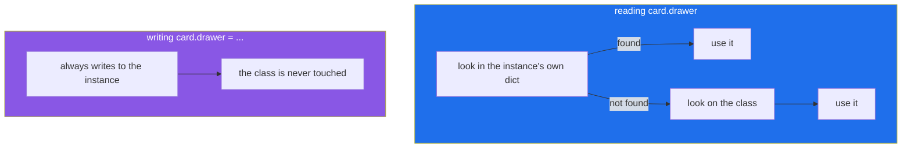

# 1.4 — Instance attributes and class attributes: two different drawers

## One-line answer

A value written inside the `class` block belongs to the class and is seen by every instance; a value
assigned to `self` belongs to one instance — and reading finds either, while writing only ever
creates the second.

---

## The story

The pinned-up blank card above the library drawer has three lines to fill in, and it also has
something printed at the bottom that nobody fills in:

```text
Title:
Year:
Source:
                                    Main Room · Community Centre Library
```

That last line is on the blank, so it is on every photocopy. Nobody writes it, nobody chooses it, and
it is the same on all three hundred cards. It is true of *the drawer*, not of any particular book.

Then the library takes over a second room, and a handful of books move there. Somebody crosses out
the printed line on those cards and writes "Annexe" above it.

Now there are two kinds of card. Most of them say Main Room because the blank said so. A few say
Annexe because somebody wrote on that copy. And if you later take a card out of the annexe pile and
rub out the correction, it goes back to saying Main Room — because the printed line was never gone;
it was underneath the whole time.

The three cards from this morning, with the printed line included:

```text
Title:  The Kitchen Table    Title:  Weeknight Bread    Title:  The Kitchen Table
Year:   2019                 Year:   2021               Year:   2019
Source: donated              Source: bought             Source: bought
        Main Room                    Main Room                  Main Room
```

---

## The idea in plain language

There are two places a value can live.

A **class attribute** is assigned inside the `class` block, at the class's own indentation level. It
belongs to the class, and there is exactly one of it however many instances exist. The printed line
at the bottom of the blank.

An **instance attribute** is assigned to `self` (or to the object from outside), and it belongs to
that one object. The title, the year and the source, written by hand on one card.

Reading and writing are not symmetrical, and that asymmetry is the whole of this document:

- **Reading `card.drawer` looks in two places, in order.** First the instance's own storage; if it is
  not there, the class. That is why every card can say "Main Room" without anybody writing it on any
  card.
- **Writing `card.drawer = "Annexe"` always writes to the instance.** It never touches the class. So
  one card is corrected and the other two hundred and ninety-nine are untouched — which is exactly
  what you want, and is also the source of a surprise, because *reading then writing* the same name
  behaves differently from just reading it.

Two consequences follow, and both come up constantly.

**The class attribute is a default.** Put a value on the class and every instance sees it until one of
them is given its own. That is a genuinely useful pattern for a constant that belongs to the type —
`SOURCES = ("donated", "bought", "loan")` — and it is how a class states facts about itself.

**Deleting the instance attribute reveals the class one again.** `del card.drawer` removes the
instance's copy, and the next read falls through to the class and finds "Main Room". Nothing was
overwritten; it was covered.

There is one shape where all of this becomes a bug rather than a feature, and it is important enough
to have its own document: a class attribute that is **mutable** — a list, a dict, a set — is shared
by every instance, and changing it through one instance changes it for all of them. That is
[1.5](1.5-the-shared-class-attribute.md), and it is the single most common mistake on this day.

---

## Why Setu needs it

- **[3.1](../03-the-paper-object/3.1-designing-paper.md) has to decide** which of `Paper`'s values
  belong to the type and which to the instance. The list of allowed sources belongs to the type; the
  source of one paper does not.
- **Day 13's base class puts shared defaults on the parent**, and every subclass reads them without
  redefining them. That is class attributes doing their proper job across a hierarchy.
- **Day 18's custom exceptions carry class-level defaults** — a default message, a default retryable
  flag — and every raise site either accepts them or overrides one.
- **Principle 4 says pin everything.** A constant that belongs to a class belongs *on* the class, in
  one named place, rather than repeated as a literal in four methods where three of them can drift.

---

## The mechanism

Reading finds either; writing creates only the instance's:

```python
"""One value on the class, and what happens when one instance is given its own."""


class Card:
    drawer = "Main Room"

    def __init__(self, title):
        self.title = title


a = Card("The Kitchen Table")
b = Card("Weeknight Bread")

print("a.drawer   :", a.drawer)
print("b.drawer   :", b.drawer)
print("Card.drawer:", Card.drawer)
print("a's own    :", a.__dict__)

a.drawer = "Annexe"

print()
print("after a.drawer = 'Annexe'")
print("a.drawer   :", a.drawer)
print("b.drawer   :", b.drawer)
print("Card.drawer:", Card.drawer)
print("a's own    :", a.__dict__)
print("b's own    :", b.__dict__)

del a.drawer

print()
print("after del a.drawer")
print("a.drawer   :", a.drawer)
```

Run on Python 3.12.12 on 2026-09-01:

```
a.drawer   : Main Room
b.drawer   : Main Room
Card.drawer: Main Room
a's own    : {'title': 'The Kitchen Table'}

after a.drawer = 'Annexe'
a.drawer   : Annexe
b.drawer   : Main Room
Card.drawer: Main Room
a's own    : {'title': 'The Kitchen Table', 'drawer': 'Annexe'}
b's own    : {'title': 'Weeknight Bread'}

after del a.drawer
a.drawer   : Main Room
```

**Line by line:**

- `drawer = "Main Room"` — inside the `class` block, at the class's indentation, **not** inside any
  method and with no `self`. That placement is the entire difference.
- `a.drawer` and `b.drawer` both print `Main Room` while `a.__dict__` holds only `title`. **The value
  is not on either instance**; the read fell through to the class.
- `a.drawer = "Annexe"` — a write, and it lands on the instance. Look at the next `a.__dict__`: it now
  has two keys where it had one.
- `b.drawer` is still `Main Room` and `Card.drawer` is still `Main Room`. **The class was not
  touched**, which is why `b` and every future card are unaffected.
- `del a.drawer` removes the instance's key, and the very next read prints `Main Room` again. Nothing
  was restored; the class attribute had never gone anywhere.
- If you wanted to change it for everybody, the line is `Card.drawer = "Annexe"` — through the class,
  not through an instance. That distinction is worth saying out loud, because `a.drawer = ...` reads
  as though it might do it.

A counter, and the one place `self` will not do:

```python
"""Counting instances: the class holds the tally, because it is a fact about the type."""


class Card:
    drawer = "Main Room"
    count = 0

    def __init__(self, title):
        self.title = title
        Card.count += 1


a = Card("The Kitchen Table")
b = Card("Weeknight Bread")
c = Card("The Kitchen Table")

print("Card.count:", Card.count)
print("a.count   :", a.count)
print("a's own   :", a.__dict__)
```

Run on Python 3.12.12 on 2026-09-01:

```
Card.count: 3
a.count   : 3
a's own   : {'title': 'The Kitchen Table'}
```

**Line by line:**

- `count = 0` on the class — one tally, shared, which is right because "how many cards exist" is a
  fact about the whole drawer rather than about any card.
- `Card.count += 1` — **written through the class on purpose.** Writing `self.count += 1` would read
  the class value, add one, and then *write the result onto the instance*, leaving the class at `0`
  forever and giving every card its own `count` of `1`. That is the failure below, and it is worth
  trying before reading it.
- `a.count` prints `3` — read through the instance, found on the class. Reading is fine; it is only
  writing that diverges.
- `a.__dict__` still has one key. Nothing was stored on the instance, because nothing was written to
  it.
- A counter on the class is a shared mutable value, which makes it awkward in exactly the way
  [1.5](1.5-the-shared-class-attribute.md) describes — two tests that both build cards will see each
  other's tally. It is used here because it is the honest example of when a class attribute is right,
  and the caveat belongs with it.



---

## When it breaks

**The counter that counted to one, three times:**

```text
>>> class Card:
...     count = 0
...     def __init__(self, title):
...         self.title = title
...         self.count += 1
...
>>> a, b, c = Card("A"), Card("B"), Card("C")
>>> Card.count
0
>>> a.count, b.count, c.count
(1, 1, 1)
>>> a.__dict__
{'title': 'A', 'count': 1}
```

**What it means.** `self.count += 1` is a read and a write
([Day 10, 2.2](../../../day-10-functions/parts/02-scope/2.2-unboundlocalerror.md) made the same point
about `+=` in a function). The read found `0` on the class; the write put `1` on the instance. Every
card did the same thing independently, so the class stayed at `0` and each instance got its own `1`.
No error, three wrong answers, and `a.__dict__` is the evidence. The fix is `Card.count += 1`, or a
`classmethod` on Day 15.

**Reading a class attribute that a method sets:**

```text
$ uv run python -c "
class Card:
    def __init__(self, title):
        self.title = title
print(Card.title)
"
Traceback (most recent call last):
  File "<string>", line 5, in <module>
AttributeError: type object 'Card' has no attribute 'title'
```

**What it means.** `title` is set on instances, inside `__init__`, so it does not exist on the class
at all. Note the wording — **"type object 'Card'"**, not "'Card' object" — which is how you tell this
apart from [1.1](1.1-a-class-is-a-blank-form.md)'s instance-level `AttributeError`. Reading `type
object` in an `AttributeError` means you asked the class for something only an instance has.

**A class attribute that shadows a method:**

```text
>>> class Card:
...     def summary(self):
...         return "the real one"
...
>>> card = Card()
>>> card.summary = "not a function"
>>> card.summary()
Traceback (most recent call last):
  File "<stdin>", line 1, in <module>
TypeError: 'str' object is not callable
```

**What it means.** An instance attribute wins over a class attribute of the same name, and methods
live on the class — so assigning `card.summary = "..."` hides the method for that one object. The
message says `'str' object is not callable`, which points at the string rather than at the shadowing.
This is rare on purpose and common by accident, usually when `__init__` stores a value under a name
that is also a method.

**Mutating a shared class attribute:**

```text
>>> class Card:
...     tags = []
...
>>> a, b = Card(), Card()
>>> a.tags.append("cooking")
>>> b.tags
['cooking']
```

**What it means.** `a.tags` read the *class's* list and appended to it in place — no assignment
happened, so nothing was written to the instance, and there is only one list. This is the headline
bug of the day and it gets its own document,
[1.5](1.5-the-shared-class-attribute.md), because the explanation is longer than the failure.

---

## In production

**The professional rule is that class attributes hold constants and instance attributes hold state.**
A tuple of allowed values, a default encoding, a version string, a compiled regular expression that
is expensive to build and never changes — all correct on the class. Anything that varies per object,
and anything mutable at all, belongs on the instance. Teams that write this down have far fewer of
the failures above, because the rule is checkable by eye: *is this value about the type or about this
one thing?*

**What changes at scale is that the class attribute is genuinely cheaper.** A constant on the class
exists once; the same constant assigned in `__init__` exists once per instance in the instance
dictionary. For a million objects that is a million dictionary entries pointing at the same object,
and the dictionary entries are the cost
([2.3](../02-attribute-lookup/2.3-slots-and-a-million-objects.md) measures it). This is a real reason
to prefer the class for defaults, not merely a stylistic one.

**The failure that only appears in a long-running process is the shared counter.** A class-level
tally works perfectly in a script and is wrong the moment two things use the class at once: two
tests in one pytest session see each other's count, and two requests in one web worker do too. The
symptom is a test that passes alone and fails in the suite — the same shape as
[Day 10, 3.3](../../../day-10-functions/parts/03-the-module/3.3-pure-functions-and-the-seam.md)'s
global-state failure, because a class attribute *is* global state with a nicer address.

**The review comment a senior engineer leaves.** On `self.MAX_RETRIES = 3` inside `__init__`: *"This
is a constant, so put it on the class — `MAX_RETRIES = 3` above `__init__`. One object instead of one
per instance, it shows up in the class's own namespace where somebody looking for the knobs will find
it, and a subclass can override it in one line on Day 13."*

**The interview question.** *"What is the difference between a class attribute and an instance
attribute?"* The answer that lands includes the asymmetry, not only the definitions: reading looks at
the instance and then falls back to the class, but writing always creates an instance attribute — so
`self.count += 1` reads the class's value and writes a new instance one, and the class never changes.
Adding that a mutable class attribute is therefore shared by every instance, because mutating it is
not a write, shows you have debugged it rather than read about it.

---

## Check yourself

```bash
uv run python -c "
class Card:
    drawer = 'Main Room'
    count = 0
    def __init__(self, title):
        self.title = title
        Card.count += 1

a = Card('The Kitchen Table')
b = Card('Weeknight Bread')
print('both read the class :', a.drawer, '|', b.drawer)
a.drawer = 'Annexe'
print('after writing to a  :', a.drawer, '|', b.drawer, '|', Card.drawer)
print('a now owns          :', a.__dict__)
del a.drawer
print('after deleting      :', a.drawer)
print('count               :', Card.count)
"
```

`del a.drawer` did not restore anything. Say what it actually removed, and why the next read printed
`Main Room`.

**Answer out loud, without scrolling up:**

> Say where Python looks when it reads `card.drawer`, in order. Then say where it writes when you
> assign to `card.drawer`, and what that means for `self.count += 1`.

---

**Next:** [1.5 — the class attribute everybody shares](1.5-the-shared-class-attribute.md), where the
asymmetry you just learned turns into the most common bug on this day.
