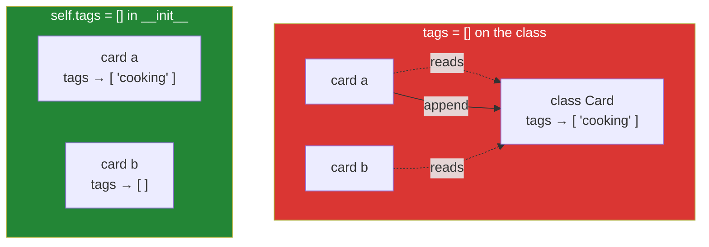

# 1.5 — The class attribute everybody shares

## One-line answer

A list, dict or set written inside the `class` block is one object shared by every instance, and
because changing it in place is not an assignment, nothing ever gets copied onto the instance — so
adding a tag to one card adds it to all of them.

---

## The story

Somebody at the library decides the cards need tags — *cooking*, *reference*, *large print* — and
there is no room on the blank for a tag list. So they pin a small notepad next to the blank, above
the drawer, and write at the top: **TAGS**.

The first card gets catalogued. The person doing it reads the instructions, gets to "add any tags",
walks to the notepad, and writes *cooking*.

The second card gets catalogued a week later, by somebody else. They pick up the card, look for its
tags, and find the notepad — which says *cooking*.

Weeknight Bread is now tagged as cooking, and so is anything else anybody ever catalogues, and
neither person did anything wrong. They both followed the instructions. There is one notepad.

Nobody notices for months, because for months the tags are all roughly right — most of the books are
cookbooks. It surfaces when somebody adds *large print* to one card and every card in the drawer
becomes large print.

The three cards, with the notepad shown for what it is:

```text
Title:  The Kitchen Table    Title:  Weeknight Bread    Title:  The Kitchen Table
Year:   2019                 Year:   2021               Year:   2019
Source: donated              Source: bought             Source: bought

           TAGS (one notepad, on the wall): cooking, large print
```

---

## The idea in plain language

[1.4](1.4-instance-and-class-attributes.md) established two rules:

- Reading an attribute looks at the instance first, then the class.
- **Writing** an attribute always creates it on the instance.

The bug lives in the gap between them, and the gap has a name: **mutating is not writing.**

`card.tags.append("cooking")` is not an assignment. It is a *read* of `card.tags` — which finds the
class's list, because the instance has none — followed by a method call on that list which changes it
in place ([Day 4, 2.2](../../../day-04-objects/parts/02-containers/2.2-what-in-place-means.md)). No
assignment ever happens, so nothing is ever copied to the instance, so there is one list forever.

Compare with `card.tags = ["cooking"]`, which **is** an assignment. That creates an instance
attribute, that card gets its own list, and every other card keeps reading the class's. Confusingly,
this means the safe-looking `append` is the dangerous one and the blunt-looking `=` is the safe one.

The same trap exists for every mutable object: a `list`, a `dict`, a `set`, a `Counter`, and any
object of your own whose methods change it. It does not exist for immutable ones — `drawer = "Main
Room"` and `MAX = 3` are perfectly safe on the class, because there is no way to change a string or
an integer in place ([Day 4, 1.4](../../../day-04-objects/parts/01-objects/1.4-strings-are-immutable.md)).

The fix is one line, and it is the same fix as the mutable default argument:

```
def __init__(self, title, tags=None):
    self.tags = list(tags) if tags else []
```

Every instance gets its **own** list, created during its own `__init__`. This is exactly
[Day 10, 1.3](../../../day-10-functions/parts/01-the-signature/1.3-defaults-and-when-they-run.md)'s
fix in a different costume, and recognising it as the same problem is worth more than memorising two
rules.

One thing to be clear about: **the class attribute is not the villain.** A shared constant on the
class is good design ([1.4](1.4-instance-and-class-attributes.md)). The problem is a shared *mutable*
one, and the reason it is so common is that a list is the obvious way to say "this can have several
of these".

---

## Why Setu needs it

- **`Paper` will have a list of authors, and a list of tags**
  ([3.1](../03-the-paper-object/3.1-designing-paper.md)). If either is declared on the class, every
  paper in the corpus ends up with the union of everybody's authors, and the tests will not catch it
  because the tests build one paper.
- **Day 13's base class is the worst place for this.** A mutable attribute on a parent is shared by
  every subclass and every instance of every subclass, so `PDFLoader` and `HTMLLoader` would share one
  list across two class hierarchies.
- **Day 23 is state and memory for agents**, and a shared mutable default in a state class means two
  conversations writing into one history. That failure is invisible with one user and catastrophic
  with two.
- **Principle 11 is blast radius.** This is a small, boring instance of it: one mutable object,
  reachable from every instance of a type, with nothing announcing that it is shared.

---

## The mechanism

The bug, in nine lines:

```python
"""One notepad on the wall. Every card writes on it."""


class Card:
    tags = []

    def __init__(self, title):
        self.title = title

    def add_tag(self, tag):
        self.tags.append(tag)


a = Card("The Kitchen Table")
b = Card("Weeknight Bread")

a.add_tag("cooking")

print("a.tags     :", a.tags)
print("b.tags     :", b.tags)
print("Card.tags  :", Card.tags)
print("one object?:", a.tags is b.tags is Card.tags)
print("a's own    :", a.__dict__)
```

Run on Python 3.12.12 on 2026-09-01:

```
a.tags     : ['cooking']
b.tags     : ['cooking']
Card.tags  : ['cooking']
one object?: True
a's own    : {'title': 'The Kitchen Table'}
```

**Line by line:**

- `tags = []` — inside the `class` block, so **one list, created once, when the class statement ran at
  import time.** Not one per instance.
- `self.tags.append(tag)` — this is the line that looks safe and is not. `self.tags` reads and finds
  the class's list; `.append` changes it in place. There is no `=` anywhere, so
  [1.4](1.4-instance-and-class-attributes.md)'s "writing creates an instance attribute" never fires.
- `b.tags` prints `['cooking']` even though nothing was ever done to `b`. That line is the bug, and it
  will be reported to you as "the tags are wrong on some records".
- `a.tags is b.tags is Card.tags` prints `True` — chained comparison
  ([Day 5, 1.3](../../../day-05-operators-and-conditionals/parts/01-operators/1.3-comparison-and-chaining.md)),
  and it is the proof: not equal lists, **the same list**.
- `a.__dict__` still holds only `title`. **The instance has no `tags` at all**, which is the piece
  people find hardest to believe until they print it.
- Note where the damage is invisible: a test that builds one card and checks its tags passes. So does
  a test that builds two cards if the second is checked before the first is tagged. Order-dependent
  green is the worst kind.

The fix, and the proof that it is fixed:

```python
"""Each card gets its own list, made during its own __init__."""


class Card:
    def __init__(self, title, tags=None):
        self.title = title
        self.tags = list(tags) if tags else []

    def add_tag(self, tag):
        self.tags.append(tag)


a = Card("The Kitchen Table")
b = Card("Weeknight Bread")

a.add_tag("cooking")

print("a.tags     :", a.tags)
print("b.tags     :", b.tags)
print("one object?:", a.tags is b.tags)
print("a's own    :", a.__dict__)

shared = ["reference"]
c = Card("Bread Science", shared)
c.add_tag("large print")
print()
print("caller's list untouched:", shared)
print("c.tags                 :", c.tags)
```

Run on Python 3.12.12 on 2026-09-01:

```
a.tags     : ['cooking']
b.tags     : []
one object?: False
a's own    : {'title': 'The Kitchen Table', 'tags': ['cooking']}

caller's list untouched: ['reference']
c.tags                 : ['reference', 'large print']
```

**Line by line:**

- `tags=None` — the default is an immutable object, so there is nothing to share. `tags=[]` here would
  be the same bug in the parameter list rather than in the class body, and ruff's `B006` refuses it
  ([Day 10, 1.3](../../../day-10-functions/parts/01-the-signature/1.3-defaults-and-when-they-run.md)).
- `self.tags = list(tags) if tags else []` — **an assignment**, so it creates an instance attribute
  every time. Each card now owns its list.
- `list(tags)` rather than `tags` — a **copy** of whatever the caller passed. Without the copy, the
  caller's list and the card's list would be the same object, and `c.add_tag(...)` would reach back
  out and change the caller's data
  ([Day 4, 2.3](../../../day-04-objects/parts/02-containers/2.3-aliasing-two-names-one-object.md)).
  The last two printed lines are the proof that it does not.
- `if tags else []` rather than `if tags is not None else []` — this is the one place the shorter form
  is fine, because an empty list and `None` should both produce a new empty list here. Where the
  distinction matters, `is None` is the correct test
  ([Day 5, 3.1](../../../day-05-operators-and-conditionals/parts/03-the-or-trap/3.1-the-or-default-and-falsy-zero.md)).
- `a.tags is b.tags` now prints `False`, and `a.__dict__` now has two keys. Both changes are the same
  change seen from two angles.
- This is a **shallow** copy: a list of lists would still share the inner lists
  ([Day 4, 2.4](../../../day-04-objects/parts/02-containers/2.4-shallow-and-deep-copy.md)). For a list
  of strings, which is what tags are, shallow is correct and `copy.deepcopy` would be waste.



---

## When it breaks

**The tag that appeared on everything:**

```text
>>> class Card:
...     tags = []
...
>>> a, b = Card(), Card()
>>> a.tags.append("cooking")
>>> b.tags
['cooking']
>>> b.__dict__
{}
```

**What it means.** There is no traceback and there never will be. `b` has no `tags` of its own — its
dictionary is empty — so reading `b.tags` finds the class's list, which now has an entry in it. The
tell is always the same: **print `instance.__dict__`, and if the attribute is not in it, you are
looking at the class's copy.**

**The assignment that seemed to fix it and did not:**

```text
>>> class Card:
...     tags = []
...     def replace_tags(self, new):
...         self.tags.clear()
...         self.tags.extend(new)
...
>>> a, b = Card(), Card()
>>> a.replace_tags(["cooking"])
>>> b.tags
['cooking']
```

**What it means.** Somebody knew about the bug and "fixed" it by replacing the contents rather than
rebinding the name — and `clear()` plus `extend()` are both in-place operations, so it is the same
bug with more steps. The rule is not "avoid `append`"; it is **"an assignment to `self.x` is what
creates an instance attribute, and nothing else does"**.

**The counter that is shared between tests:**

```text
$ uv run python -m pytest tests/test_cards.py -q
tests/test_cards.py::test_first_card_has_no_tags PASSED
tests/test_cards.py::test_tagging_a_card FAILED

E       AssertionError: assert ['cooking', 'cooking'] == ['cooking']
```

**What it means.** The second test's card started with the first test's tag already on it, and the
assertion sees a doubled list. Run `test_tagging_a_card` on its own and it passes. **A test that
passes alone and fails in the suite is shared mutable state**, every time — the same signature as
[Day 10, 3.3](../../../day-10-functions/parts/03-the-module/3.3-pure-functions-and-the-seam.md)'s
global-state failure, because a class attribute is global state with a nicer address.

**The dictionary version, which is harder to spot:**

```text
>>> class Card:
...     index = {}
...     def __init__(self, title):
...         self.title = title
...         self.index[title] = self
...
>>> a = Card("The Kitchen Table")
>>> b = Card("Weeknight Bread")
>>> len(Card.index)
2
>>> len(a.index)
2
```

**What it means.** The same bug with a dictionary, and this one is worse in two ways. First, it is
easy to mistake for a deliberate registry — sometimes it *is* one, which is why review does not catch
it. Second, `self.index[title] = self` keeps a reference to every card ever created, so nothing is
ever garbage collected: a long-running process building cards will grow until it is killed. If you
genuinely want a registry, say so in a comment and give it a bounded size or a `weakref.WeakValueDictionary`.

---

## In production

**The professional rule is short enough to say in one line: never put a mutable object in a class
body.** Lists, dicts, sets and anything with methods that change it belong in `__init__`. Constants —
strings, numbers, tuples, `frozenset` — are safe and useful on the class. Where a class-level
collection is genuinely wanted, teams use an immutable one: `SOURCES = ("donated", "bought", "loan")`
as a tuple, not a list, so the mistake cannot be made.

**What a senior engineer checks first when a "records have the wrong data" bug arrives** is whether
the field is shared. It is a thirty-second check — read the class body, look for `[]`, `{}` or
`set()` — and it resolves a surprisingly large fraction of "the data is wrong sometimes" reports. The
same check applies to module-level mutable values, which are the same bug one scope out.

**The failure that only appears in a long-running process is unbounded growth.** In a script the
shared list is wrong and small. In a web worker handling requests for a week, every request appends to
the same list, and memory climbs until the process is killed. The graph looks like a memory leak
because it is one, and the cause is one square bracket in a class body. This is why the review habit
matters more than the debugging habit here: the debugging version happens at three in the morning.

**The review comment a senior engineer leaves.** On `class Paper: authors = []`: *"This list is
created once at import and shared by every `Paper`, so `paper.authors.append(...)` writes to all of
them. Move it into `__init__` as `self.authors = list(authors) if authors else []` — and note the
`list(...)`, because without the copy the caller's list becomes the paper's list and we will be
mutating our caller's data."*

**The interview question.** *"Why does appending to a class-level list affect every instance?"* The
answer that lands is the asymmetry: reading falls back to the class, writing creates an instance
attribute, and **mutating is not writing** — so `self.tags.append(...)` reads the class's list and
changes it, and no instance attribute is ever created. Adding that this is the same rule as the
mutable default argument, and that the check is `print(instance.__dict__)` to see whether the
attribute is really there, shows you have fixed it in real code.

---

## Check yourself

```bash
uv run python -c "
class Shared:
    tags = []
    def add(self, t): self.tags.append(t)

class Owned:
    def __init__(self, tags=None):
        self.tags = list(tags) if tags else []
    def add(self, t): self.tags.append(t)

a, b = Shared(), Shared()
a.add('cooking')
print('shared:', a.tags, b.tags, '| a.__dict__:', a.__dict__)

c, d = Owned(), Owned()
c.add('cooking')
print('owned :', c.tags, d.tags, '| c.__dict__:', c.__dict__)
"
```

Look at the two `__dict__` printouts side by side. Say which one contains `tags` and why that single
difference explains both results.

**Answer out loud, without scrolling up:**

> Say why `self.tags.append("x")` does not create an instance attribute but `self.tags = ["x"]` does.
> Then give the one-line rule about what may and may not go in a class body.

---

**Next:** [2.1 — the instance dictionary](../02-attribute-lookup/2.1-the-instance-dict.md), which is
the storage you have been printing all through this section, looked at properly.
