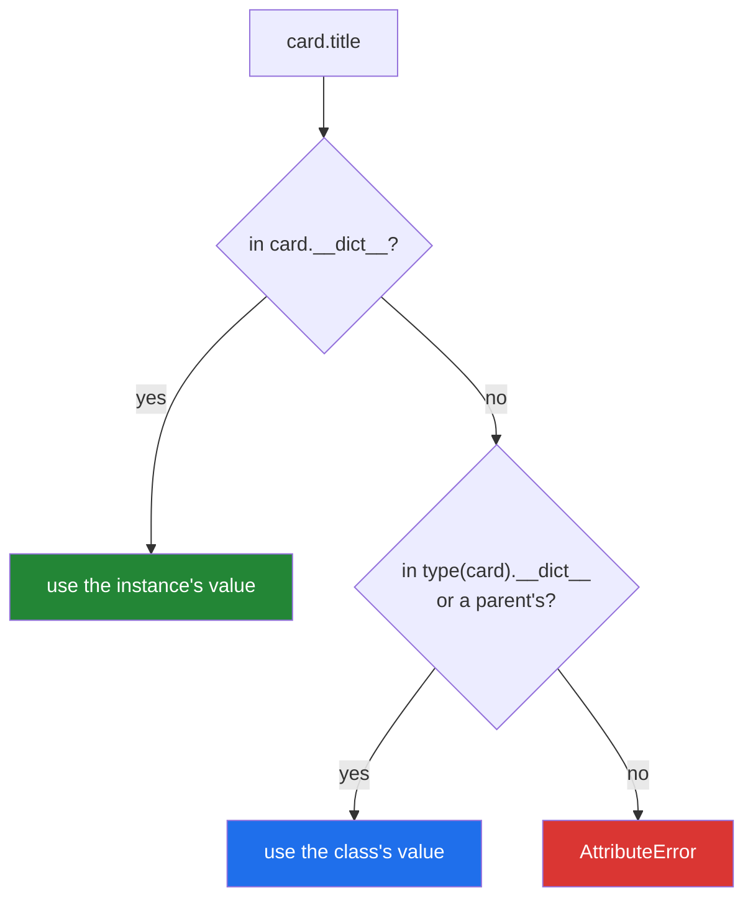

# 2.1 — `__dict__`: where an attribute actually lives

## One-line answer

Nearly every Python object keeps its attributes in an ordinary dictionary called `__dict__`, and the
class keeps its own — so `card.title` is a dictionary lookup with a fallback, and printing those two
dictionaries answers almost every "why is this attribute wrong?" question.

---

## The story

The library's cards are kept in a wooden drawer, and a card is not a magical thing. It is a piece of
paper with words written in fixed places on it. If you want to know what a card says, you take it out
and look at it — all of it, at once.

Somebody who has only ever asked "what is the title of this card?" can go a long time without
realising that. They ask a question, they get an answer, and the card stays in the drawer. It works
until the day an answer is wrong, and then "ask another question" is a very slow way to find out
what happened.

Taking the card out and reading the whole thing takes two seconds and settles it. *Oh. Source is
blank. Nobody filled it in.*

The three cards, and what is actually written on each:

```text
Title:  The Kitchen Table    Title:  Weeknight Bread    Title:  The Kitchen Table
Year:   2019                 Year:   2021               Year:   2019
Source: donated              Source: bought             Source:
```

The third one is missing a source. Asking it for its title would never have told you that.

---

## The idea in plain language

Every ordinary Python object stores its attributes in a plain dictionary, and that dictionary is
available under the name **`__dict__`**. It is not a special structure — it is the same `dict` you met
on Day 8 ([Day 8, 2.3](../../../day-08-containers/parts/02-sets-and-dicts/2.3-a-dict-is-ordered-now.md)),
with attribute names as string keys.

A class has one too. `Card.__dict__` holds the class attributes and the methods, because a method is
a function stored on the class ([1.3](../01-the-blank-form/1.3-methods-find-their-object.md)).

That makes attribute lookup concrete rather than mysterious. When Python evaluates `card.title`, in
the simple case it does this:

1. Look for `"title"` in `type(card).__dict__` and its parents, to see whether the class has anything
   special to say about that name. (This step matters for methods and for Day 15's `property`; for a
   plain value it finds nothing and moves on.)
2. Look for `"title"` in `card.__dict__`. Found — done.
3. Otherwise fall back to what step 1 found on the class.
4. Otherwise raise `AttributeError`.

For everything on this day, the short version is enough: **the instance's dictionary wins over the
class's, and if neither has it you get `AttributeError`.** That is exactly
[1.4](../01-the-blank-form/1.4-instance-and-class-attributes.md)'s rule, now with a place you can go
and look.

Four ways to look, all worth knowing:

- `card.__dict__` — the instance's own storage, as a real dictionary you can read and change.
- `vars(card)` — the same object, spelled as a function. `vars(card) is card.__dict__` is `True`.
- `dir(card)` — **every** name available on the object, including inherited ones and every dunder.
  Long, and useful when you do not know what you are looking for.
- `getattr(card, "title")` and `hasattr(card, "title")` — look up a name given as a *string*, which
  matters whenever the name is computed rather than typed.

One asymmetry to know now, because it explains an error below. An instance's `__dict__` is a real
dictionary and you can write to it. A class's `__dict__` is a **`mappingproxy`** — a read-only view —
so `Card.__dict__["x"] = 1` fails. You change a class attribute with `Card.x = 1`, which goes through
the proper machinery.

---

## Why Setu needs it

- **It is the debugging tool for the whole of Day 12 and Day 13.** Every failure in
  [1.5](../01-the-blank-form/1.5-the-shared-class-attribute.md) was diagnosed by printing
  `instance.__dict__` and finding the attribute missing.
- **Until Day 15 gives `Paper` a `__repr__`**, printing an object shows an address and nothing else
  ([1.1](../01-the-blank-form/1.1-a-class-is-a-blank-form.md)). `print(paper.__dict__)` is the honest
  substitute, and it needs nothing you have not met.
- **Day 19's dataclasses and Pydantic models both build on this.** `dataclasses.asdict` and Pydantic's
  `model_dump` are doing a careful version of what `vars()` does bluntly.
- **[2.3](2.3-slots-and-a-million-objects.md) is entirely about what happens when you take this
  dictionary away**, which only makes sense once you know it is there and what it costs.

---

## The mechanism

The two dictionaries, side by side:

```python
"""Where the values are, and where the methods are."""


class Card:
    drawer = "Main Room"

    def __init__(self, title, year):
        self.title = title
        self.year = year

    def summary(self):
        return f"{self.title} ({self.year})"


card = Card("The Kitchen Table", 2019)

print("instance dict :", card.__dict__)
print("vars() is the same object:", vars(card) is card.__dict__)
print()
print("class keys    :", sorted(k for k in Card.__dict__ if not k.startswith("__")))
print("class dict type:", type(Card.__dict__).__name__)
print()
print("hasattr title :", hasattr(card, "title"))
print("hasattr nope  :", hasattr(card, "nope"))
print("getattr with a default:", getattr(card, "missing", "fallback"))
print("summary in dir:", "summary" in dir(card), "| title in dir:", "title" in dir(card))
```

Run on Python 3.12.12 on 2026-09-01:

```
instance dict : {'title': 'The Kitchen Table', 'year': 2019}
vars() is the same object: True

class keys    : ['drawer', 'summary']
class dict type: mappingproxy

hasattr title : True
hasattr nope  : False
getattr with a default: fallback
summary in dir: True | title in dir: True
```

**Line by line:**

- `card.__dict__` holds **only what `__init__` assigned** — `title` and `year`, and nothing else. Not
  `drawer`, not `summary`. Those live on the class.
- `vars(card) is card.__dict__` prints `True`. `vars` is not a copy or a snapshot; it is the same
  object under a friendlier name.
- `sorted(k for k in Card.__dict__ if not k.startswith("__"))` — the class's own keys with the dunders
  filtered out, because Python adds several automatically and they drown the interesting two. A
  generator expression inside `sorted`
  ([Day 11, 3.2](../../../day-11-iterators-and-generators/parts/03-lambda-and-map/3.2-map-and-filter-are-lazy.md)).
- The class holds `drawer` **and** `summary`. **A method is stored exactly like a value**, which is
  [1.3](../01-the-blank-form/1.3-methods-find-their-object.md)'s point seen from the storage side.
- `type(Card.__dict__).__name__` is `mappingproxy`, not `dict`. It reads like a dictionary and refuses
  to be written to, which the failure section demonstrates.
- `hasattr(card, "nope")` is `False` — it tries the lookup and reports whether it raised. It is the
  polite way to ask, and `getattr(card, "missing", "fallback")` is the polite way to read.
- `dir(card)` contains **both** `summary` and `title`, because `dir` reports everything reachable
  through the object rather than everything stored on it. That is the difference between `dir` and
  `__dict__`, and it is why `__dict__` is the better debugging tool: it shows you what is *there*.

The lookup, done by hand:

```python
"""What card.title does, spelled out as dictionary lookups."""


class Card:
    drawer = "Main Room"

    def __init__(self, title):
        self.title = title


card = Card("The Kitchen Table")


def look_up(obj, name):
    """The simple case of attribute lookup, written out."""
    if name in obj.__dict__:
        return ("instance", obj.__dict__[name])
    if name in type(obj).__dict__:
        return ("class", type(obj).__dict__[name])
    raise AttributeError(f"{type(obj).__name__!r} object has no attribute {name!r}")


print("title :", look_up(card, "title"))
print("drawer:", look_up(card, "drawer"))
try:
    look_up(card, "source")
except AttributeError as error:
    print("source:", error)
```

Run on Python 3.12.12 on 2026-09-01:

```
title : ('instance', 'The Kitchen Table')
drawer: ('class', 'Main Room')
source: 'Card' object has no attribute 'source'
```

**Line by line:**

- `if name in obj.__dict__:` — the instance first, which is why an instance attribute shadows a class
  one ([1.4](../01-the-blank-form/1.4-instance-and-class-attributes.md)).
- `type(obj).__dict__` — the class, reached from the instance rather than by name, so this function
  works for any object of any class.
- `raise AttributeError(...)` with the same wording Python uses, so the printed message matches what
  you see in a real traceback.
- `{name!r}` — the `repr` form, so the message shows quotes around the name
  ([Day 7, 3.3](../../../day-07-strings/parts/03-formatting/3.3-repr-and-the-debugging-f-string.md)).
- **This is the simple case, not the whole truth.** Real lookup checks the class *first* for a
  descriptor — which is what makes a `property` on Day 15 able to intercept a read — then the
  instance, then the class's ordinary attributes, walking every parent class on the way
  ([Day 13, 1.3](../../../day-13-inheritance-and-abstraction/parts/01-inheritance/1.3-the-mro.md) is
  the walking order). For a class with no properties and no inheritance, the two agree exactly.
- `look_up(card, "title")` returns `('instance', ...)` and `look_up(card, "drawer")` returns
  `('class', ...)`. Printing which one it came from is the whole diagnostic value.



---

## When it breaks

**Writing to a class's dictionary:**

```text
$ uv run python -c "
class Card: pass
Card.__dict__['x'] = 1
"
Traceback (most recent call last):
  File "<string>", line 3, in <module>
TypeError: 'mappingproxy' object does not support item assignment
```

**What it means.** A class's `__dict__` is a read-only view, so that Python can keep its internal
caches consistent when a class changes. The message names `mappingproxy`, which is a word most people
meet for the first time in exactly this traceback. The fix is `Card.x = 1`, which goes through the
proper machinery and updates everything that needs updating.

**An attribute set on some instances and not others:**

```text
>>> class Card:
...     def __init__(self, title, source=None):
...         self.title = title
...         if source:
...             self.source = source
...
>>> a = Card("The Kitchen Table", "donated")
>>> b = Card("Weeknight Bread")
>>> a.__dict__
{'title': 'The Kitchen Table', 'source': 'donated'}
>>> b.__dict__
{'title': 'Weeknight Bread'}
>>> b.source
Traceback (most recent call last):
  File "<stdin>", line 1, in <module>
AttributeError: 'Card' object has no attribute 'source'
```

**What it means.** The conditional assignment made the attribute optional, so the object's shape
depends on its data. Every later `card.source` is a coin flip. The two `__dict__` printouts are the
whole diagnosis — one has three keys, the other has two — and the fix is to set it unconditionally
to `None`, because `None` is a value you can handle and a missing attribute is a crash.

**Looking for a method in `__dict__` and not finding it:**

```text
>>> class Card:
...     def summary(self):
...         return "x"
...
>>> card = Card()
>>> "summary" in card.__dict__
False
>>> "summary" in type(card).__dict__
True
```

**What it means.** Not a bug — a reminder that methods are on the class. People writing their own
introspection code hit this constantly: iterating `instance.__dict__` to "find all the methods"
finds none of them. Use `dir(obj)`, or `type(obj).__dict__`, depending on whether you want inherited
ones.

**A name that is in `dir()` and cannot be read:**

```text
>>> class Card:
...     def __init__(self, title):
...         self.title = title
...     def summary(self):
...         return self.year
...
>>> card = Card("The Kitchen Table")
>>> "summary" in dir(card)
True
>>> card.summary()
Traceback (most recent call last):
  File "<stdin>", line 1, in <module>
  File "<stdin>", line 5, in summary
AttributeError: 'Card' object has no attribute 'year'
```

**What it means.** `dir` said the method was there and it was. The `AttributeError` is about `year`,
raised **inside** the method, and the traceback's second frame is what tells you that. Reading which
frame an `AttributeError` comes from is the difference between "this object has no such method" and
"this method touched something that was never set".

---

## In production

**The professional habit is to reach for `vars(obj)` before reaching for a debugger.** One printed
dictionary answers "what does this object actually hold?", which is the question behind most
mysterious behaviour, and it works in a log line, in a test failure message and in a REPL. Teams that
write `logger.debug("card=%r", vars(card))` at the boundary of a pipeline spend far less time
guessing.

**What changes at scale is that the dictionary is the memory.** Each instance's `__dict__` is a real
dictionary object with its own overhead, and for a million small objects that overhead dominates —
half a million two-attribute objects cost about 42 MB in this arrangement, which
[2.3](2.3-slots-and-a-million-objects.md) measures against the alternative. Python does share the
*keys* between instances of the same class, which is why the number is not worse, but the per-object
cost is still real.

**The failure that only appears with real data is the object whose shape varies.** With clean records
every instance has the same keys and `vars()` printouts all look alike. With real data, some rows
lack a field, a conditional assignment fires for some and not others, and now half your objects have
five keys and half have four — so a function that reads `card.source` works for a while and then
raises on row 40 000. The defence is to set every attribute in `__init__` unconditionally, and the
detection is to compare `set(vars(a)) == set(vars(b))` across a sample.

**The review comment a senior engineer leaves.** On code that reads `obj.__dict__` to serialise
something: *"This will silently miss anything defined as a class attribute or a property, and it will
happily include private working state that we do not want in the output. List the fields explicitly,
or wait for the dataclass on Day 19 and use `asdict`. `__dict__` is a debugging tool, not a
serialisation format."*

**The interview question.** *"Where are an object's attributes stored?"* The answer that lands is: in
an ordinary dictionary on the instance, with the class holding its own dictionary for class
attributes and methods — so a lookup checks the instance and falls back to the class, and
`AttributeError` is what happens when neither has it. Adding that the class's `__dict__` is a
read-only `mappingproxy`, and that `vars(obj)` is the same object as `obj.__dict__`, shows you have
been inside it rather than around it.

---

## Check yourself

```bash
uv run python -c "
class Card:
    drawer = 'Main Room'
    def __init__(self, title, year):
        self.title = title
        self.year = year
    def summary(self):
        return f'{self.title} ({self.year})'

c = Card('The Kitchen Table', 2019)
print('instance:', vars(c))
print('class   :', sorted(k for k in Card.__dict__ if not k.startswith('__')))
print('drawer in instance dict?', 'drawer' in c.__dict__)
print('drawer readable?        ', c.drawer)
print('summary in instance dict?', 'summary' in c.__dict__)
"
```

`drawer` is readable and is not in the instance's dictionary. Say in one sentence where the read
found it.

**Answer out loud, without scrolling up:**

> Say what `card.__dict__` contains and what `Card.__dict__` contains, and name one thing that is in
> the second and never the first. Then say what `vars(card)` gives you.

---

**Next:** [2.2 — setting attributes from outside](2.2-setting-attributes-from-outside.md), where the
fact that this dictionary is writable turns from a convenience into a hazard.
