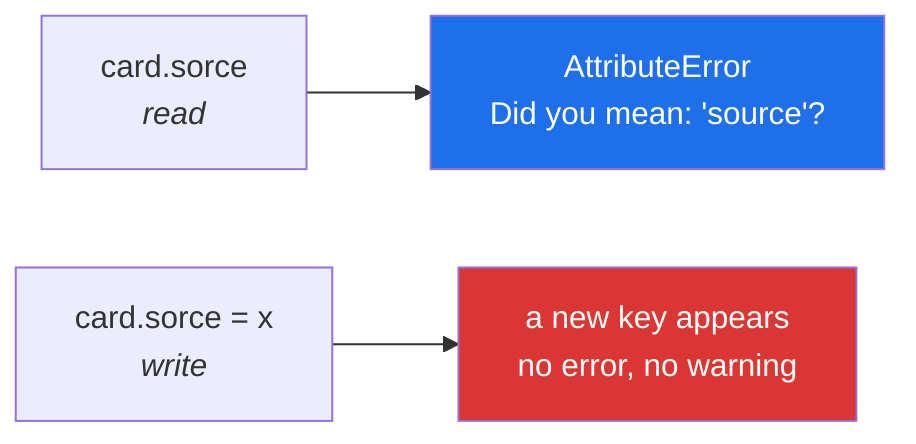

# 2.2 — Setting attributes from outside, and the typo that made a new one

## One-line answer

Any code holding an object can add an attribute to it by assigning one, and Python will not ask
whether that name was meant to exist — so a misspelling creates a new attribute instead of raising,
and the object that was supposed to have three fields quietly has four.

---

## The story

Somebody at the library is cataloguing the third card and cannot remember whether the second line
says *Year* or *Date*. There is no room on the printed card for a wrong answer, so they look at the
blank, see `Year:`, and write the year on that line.

Now imagine the cards were not printed. Imagine they were blank slips, and each person wrote the
line name themselves as well as the value.

One person writes:

```text
Title:  The Kitchen Table
Year:   2019
Source: donated
```

Another, in a hurry, writes:

```text
Title:  Weeknight Bread
Yaer:   2021
Source: bought
```

Both slips look fine. Both are legible. The drawer accepts both, because a drawer is a box and has no
opinion about spelling.

The problem appears months later, when somebody sorts the drawer by year and Weeknight Bread does not
appear anywhere in the results. Not at the top, not at the bottom — absent. The card has a *Yaer*, and
nothing is looking for one.

The printed blank existed to prevent exactly this. Python objects are the unprinted slips.

---

## The idea in plain language

Assigning to an attribute that does not exist **creates it**. There is no declaration step, no list of
allowed names, and no error:

```
card.source = "donated"   # sets the existing one
card.sorce = "donated"    # creates a new one, and says nothing
```

Both lines put a key in `card.__dict__` ([2.1](2.1-the-instance-dict.md)). Python cannot tell which
one you meant, because from its point of view they are identical operations.

This cuts both ways, and it is worth being fair about the useful half first. Being able to add
attributes at runtime is why so much of Python is pleasant: a test can attach a marker to an object,
a framework can annotate one, and a debugging session can stash a value without editing a class. It
is also why `setattr(obj, name, value)` exists — the version that takes the name as a **string**,
which is how you set an attribute whose name is computed rather than typed.

The dangerous half is the asymmetry with reading:

- **Reading a misspelled attribute raises** `AttributeError`, and since Python 3.10 it even suggests
  the name you probably meant.
- **Writing a misspelled attribute succeeds**, creates a new key, and the original keeps its old
  value.

So the same typo is loud in one direction and silent in the other. And the silent direction is the
one that corrupts data, because the object now has a field nobody reads and a field nobody updated.

Three tools for working with attributes by name, all taking strings:

- `getattr(obj, "title")` — read; `getattr(obj, "title", default)` — read with a fallback.
- `setattr(obj, "title", value)` — write.
- `delattr(obj, "title")` — remove, same as `del obj.title`.

These are what you use when the name comes from data — a column heading, a config key, a JSON field.
When the name is a literal you typed, use the dot; `setattr(card, "title", x)` where `card.title = x`
would do is harder to read and hides the name from every tool that greps for it.

There is a real defence against the whole problem, and it is
[2.3](2.3-slots-and-a-million-objects.md): a class with `__slots__` has a fixed set of attribute names
and refuses everything else, turning the silent write into a loud error.

---

## Why Setu needs it

- **`Paper` will be passed between functions for the rest of the plan**, and every one of those
  functions can add a field to it. Knowing that this is possible — and that nothing warns you — is
  what makes [3.2](../03-the-paper-object/3.2-validation-in-init.md)'s "validate in `__init__`"
  argument land.
- **Day 27 reads columns whose names come from a file.** `setattr(row, column_name, value)` in a
  loop is the shape, and a header with a typo in it becomes an attribute with a typo in it.
- **Day 19's Pydantic models reject unknown fields by default**, which is this document's problem
  solved properly. You should meet the problem before the solution.
- **Principle 11 is blast radius.** An object that any code can add anything to has a blast radius of
  "the whole program", and the two ways to shrink it — `__slots__` now, validation on
  [3.2](../03-the-paper-object/3.2-validation-in-init.md) — are both choices you make deliberately.

---

## The mechanism

The typo, in five lines:

```python
"""One assignment sets a field. One creates a field nobody reads."""


class Card:
    def __init__(self, title, year, source):
        self.title = title
        self.year = year
        self.source = source


card = Card("Weeknight Bread", 2021, "bought")

print("before      :", vars(card))

card.source = "donated"
card.sorce = "loan"

print("after       :", vars(card))
print("what a reader of `source` sees:", card.source)
```

Run on Python 3.12.12 on 2026-09-01:

```
before      : {'title': 'Weeknight Bread', 'year': 2021, 'source': 'bought'}
after       : {'title': 'Weeknight Bread', 'year': 2021, 'source': 'donated', 'sorce': 'loan'}
what a reader of `source` sees: donated
```

**Line by line:**

- `card.source = "donated"` — an ordinary update. The existing key changes value.
- `card.sorce = "loan"` — **a fourth key appears**, and nothing at all is reported. In a real program
  this line is usually the *only* update, so `source` keeps a stale value while `sorce` holds the new
  one.
- `vars(card)` before and after — the diagnosis, in one line each
  ([2.1](2.1-the-instance-dict.md)). Four keys where the class defines three is the signature of this
  bug, and comparing key sets across a sample of objects is how you find it in bulk.
- `card.source` still reads `donated`, which is the value from the line *above* the typo. If the typo
  had been the only write, it would still read `bought` — the original — and look like an update that
  did not happen.
- Nothing here is fixable by being careful. It is fixable by a class that refuses unknown names, which
  is [2.3](2.3-slots-and-a-million-objects.md).

Setting attributes by name, which is the legitimate use:

```python
"""When the name comes from data, it has to be a string."""


class Card:
    def __init__(self, title, year, source):
        self.title = title
        self.year = year
        self.source = source


headers = ["title", "year", "source"]
values = ["The Kitchen Table", 2019, "donated"]

card = Card("", 0, "")
for name, value in zip(headers, values, strict=True):
    setattr(card, name, value)

print("built by name:", vars(card))
print("read by name :", getattr(card, "year"))
print("safe read    :", getattr(card, "publisher", "unknown"))
print("does it have?:", hasattr(card, "publisher"))

delattr(card, "source")
print("after delattr:", vars(card))
```

Run on Python 3.12.12 on 2026-09-01:

```
built by name: {'title': 'The Kitchen Table', 'year': 2019, 'source': 'donated'}
read by name : 2019
safe read    : unknown
does it have?: False
after delattr: {'title': 'The Kitchen Table', 'year': 2019}
```

**Line by line:**

- `zip(headers, values, strict=True)` — pairs them up, and **`strict=True` raises if the two lengths
  differ** ([Day 6, 1.3](../../../day-06-loops/parts/01-iteration/1.3-enumerate-and-zip.md)). Without
  it, a missing column would be silently dropped, which is the same class of silence this whole
  document is about.
- `setattr(card, name, value)` — the assignment with the name as a string. This is correct here
  because `name` came from `headers` rather than from your keyboard.
- `getattr(card, "publisher", "unknown")` — the third argument is the fallback, so no exception. Use
  it whenever a field is genuinely optional; use the two-argument form when its absence is a bug you
  want to hear about.
- `hasattr(card, "publisher")` returns `False` by attempting the read and catching the error. It is a
  question, not a promise: an attribute can appear between the `hasattr` and the read.
- `delattr(card, "source")` — removes the key from the instance's dictionary. The printed result has
  two keys where it had three, and a later `card.source` raises `AttributeError`, because there is
  nothing on the class to fall back to. `del card.source` is the same operation written with the dot.
- Nothing in this block is a typo, and that is the difference from the first one. Every name came
  from `headers`, which came from data, so `setattr` is the correct tool. Where the name is a literal
  you typed, `card.title = value` is clearer and greppable.



---

## When it breaks

**The two directions, side by side:**

```text
$ uv run python -c "
class Card:
    def __init__(self, source):
        self.source = source
c = Card('bought')
c.sorce = 'donated'
print('write succeeded:', vars(c))
print(c.sorse)
"
Traceback (most recent call last):
  File "<string>", line 8, in <module>
AttributeError: 'Card' object has no attribute 'sorse'. Did you mean: 'sorce'?
write succeeded: {'source': 'bought', 'sorce': 'donated'}
```

**What it means.** Both lines contain a typo. The write was accepted in silence and the read raised.
Worse, the suggestion is `'sorce'` — the typo from the line above, now a real attribute — rather than
`'source'`, which is what was meant. **Python suggests what exists, not what you intended**, so once a
typo has been written it starts helping the next typo along.

**A method overwritten by an attribute:**

```text
>>> class Card:
...     def summary(self):
...         return "the real one"
...
>>> card = Card()
>>> card.summary = "2019 edition"
>>> card.summary()
Traceback (most recent call last):
  File "<stdin>", line 1, in <module>
TypeError: 'str' object is not callable
```

**What it means.** The instance attribute shadows the class's method
([1.4](../01-the-blank-form/1.4-instance-and-class-attributes.md)), so the object still has the method
but can no longer reach it. The error names the string rather than the shadowing, which is why this
takes a while to see. It happens most often when a field name and a method name collide — a `Paper`
with a `summary` field and a `summary()` method is asking for it.

**`hasattr` runs code, and only hides one kind of failure:**

```text
$ uv run python -c "
class Card:
    @property
    def year(self):
        return int('not a number')
print(hasattr(Card(), 'year'))
"
Traceback (most recent call last):
  File "<string>", line 6, in <module>
  File "<string>", line 5, in year
ValueError: invalid literal for int() with base 10: 'not a number'
```

**What it means.** `hasattr` answers its question by **doing the read**, and reports `False` only when
that read raises `AttributeError`. Here it raised `ValueError`, which comes straight out — so a call
that looks like a harmless question ran code and crashed. The habit worth keeping is to prefer
`getattr(obj, name, default)` over `hasattr` followed by a read: one lookup instead of two, and no gap
between them in which something could change. (`@property` is Day 15's subject; it appears here only
because it is how a read can run code at all.)

**A field added by one function and read by none:**

```text
$ uv run python -m pytest tests/test_cards.py -q
1 passed
```

**What it means.** There is no failure to show, and that is the point. A function that sets
`card.publisher` on every card passes every test, and six months later somebody adds a `publisher`
field to the class properly and now two things write to one name. The only defences are a class that
refuses unknown attributes ([2.3](2.3-slots-and-a-million-objects.md)) and a review habit of asking
where each assignment's name is declared.

---

## In production

**The professional position is that objects crossing a boundary should have a fixed shape, and
objects inside one function need not.** A `Paper` handed between modules gets `__slots__` or a
validating model; a throwaway namespace inside a script does not. The reasoning is blast radius: the
cost of an unexpected attribute is proportional to how many places can create one, and a type used in
one function has exactly one.

**What changes at scale is that the typo becomes undetectable by reading.** In a hundred lines you
can see every assignment. In a service where twelve modules touch the same object, `card.sorce = x`
in one of them is invisible, and the symptom is a field that is stale for a subset of records with no
pattern anybody can find. Teams that have been through this once adopt `__slots__` or a validating
model for their core types, and the argument for it is always this failure rather than the memory
saving.

**The failure that only appears with real data is the computed attribute name.** `setattr(row, header,
value)` over a CSV works perfectly until a header has a trailing space, or an accent, or is empty —
and then you have an attribute called `"year "` that no code can read with a dot, or an attribute
called `""`. Nothing raises. The defence is to normalise and validate the names before the loop, and
to raise on anything that is not a valid identifier: `if not name.isidentifier(): raise ValueError(name)`.

**The review comment a senior engineer leaves.** On a function that sets a new attribute on an object
it did not create: *"This adds `enriched_at` to a `Paper` that was built somewhere else, so anything
downstream sees a field that is present on some papers and absent on others. Either add it to the
class properly, or return a new object with the extra data rather than annotating somebody else's."*

**The interview question.** *"What happens if you assign to an attribute that does not exist?"* The
answer that lands is: it is created, silently, because attribute assignment is a dictionary write —
so a typo is loud on a read and silent on a write, and the object ends up with a field nobody reads
while the real one keeps a stale value. Adding that `__slots__` turns the silent write into an
`AttributeError`, and that Python's "did you mean" suggestion will helpfully suggest a previous typo
once one exists, shows you have hunted one down.

---

## Check yourself

```bash
uv run python -c "
class Card:
    def __init__(self, title, source):
        self.title = title
        self.source = source

c = Card('Weeknight Bread', 'bought')
c.sorce = 'donated'
print('keys now :', sorted(vars(c)))
print('source is:', c.source)
delattr(c, 'source')
print('after del:', sorted(vars(c)))
try:
    c.source
except AttributeError as e:
    print('reading it now:', e)
"
```

Run it and read the last line. Say what `delattr` removed, and what a later read does when nothing on
the class provides a fallback.

**Answer out loud, without scrolling up:**

> Say what happens when you assign to an attribute name that the class never defined, and what
> happens when you read one. Then say why Python's "did you mean" suggestion can point at the wrong
> name.

---

**Next:** [2.3 — `__slots__` and a million objects](2.3-slots-and-a-million-objects.md), which fixes
this problem and costs you something for the fix.
