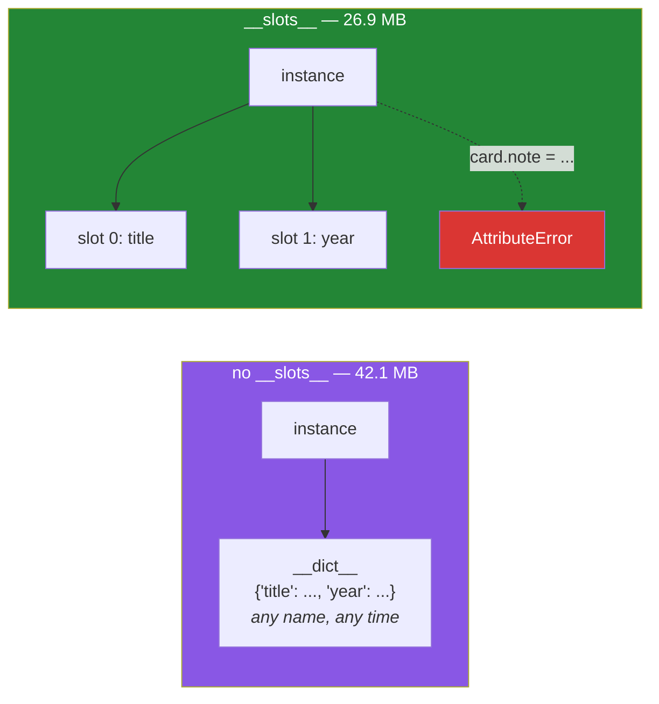

# 2.3 — `__slots__`: the trade you make for a million objects

## One-line answer

`__slots__` replaces each instance's dictionary with a fixed row of named places, which makes objects
smaller and makes an unknown attribute name an error instead of a silent new field — and costs you
the ability to add anything the class did not declare.

---

## The story

The library's drawer fills up, and somebody prices a second wooden cabinet. It is expensive, and the
reason is not the wood. It is the space.

Every card in the drawer is a full sheet with room for whatever anybody might want to add — a note
about a torn cover, a reservation, a scribble. Most of that room is empty on most cards, and the
drawer is sized for the room rather than for the writing.

The alternative on the price list is a card index: pre-cut strips, three narrow boxes each, printed
*Title · Year · Source*. Nine hundred fit in the space that took three hundred cards, because there is
no blank space to store.

The catch is on the second page of the leaflet. There is nowhere to write "torn cover". Not a small
space — none. If a strip needs a fourth thing said about it, the strip cannot say it.

The three records, in the narrow form:

```text
| The Kitchen Table | 2019 | donated |
| Weeknight Bread   | 2021 | bought  |
| The Kitchen Table | 2019 | bought  |
```

That is the whole trade, and it is a real one either way. The librarian has to decide whether "we
might want to note something" is worth three times the cabinet.

---

## The idea in plain language

By default, every instance carries its own dictionary
([2.1](2.1-the-instance-dict.md)). A dictionary is flexible — any name, added at any time — and
flexibility costs memory: the dictionary object itself, its hash table, and room to grow.

Writing `__slots__` in a class body changes that:

```
class Card:
    __slots__ = ("title", "year", "source")
```

Now instances of `Card` have **no `__dict__` at all.** Instead each one has a fixed row of places,
one per name in `__slots__`, and attribute access reads and writes those places directly.

Two things follow, and they are the two halves of the trade.

**You get smaller and faster objects.** No dictionary per instance. The measurement below puts half a
million two-attribute objects at about 42 MB with a dictionary and about 27 MB with slots, on the
machine this was written on — roughly a third less, for two attributes. Attribute access is also
slightly faster, because it is an offset rather than a hash lookup.

**You lose the ability to add anything else.** `card.note = "torn cover"` raises `AttributeError`.
That is the cost, and — for a type that crosses module boundaries — it is often the reason you wanted
slots in the first place, because it turns
[2.2](2.2-setting-attributes-from-outside.md)'s silent typo into a loud failure.

Four details that catch people, all worth knowing before you use it:

- **`__slots__` must be a sequence of strings.** A tuple is conventional, because it cannot be
  changed later. A single string is legal and means one slot, which is a trap: `__slots__ = "title"`
  works, and `__slots__ = ("title")` is that same string in useless brackets.
- **A class attribute and a slot cannot share a name.** Declaring `__slots__ = ("title",)` and also
  writing `title = "default"` in the class body is a `ValueError` at class-creation time.
- **Inheritance dilutes it.** If any parent class lacks `__slots__`, instances get a `__dict__`
  anyway and the saving disappears. Day 13's hierarchies have to declare slots on every level or on
  none.
- **`vars(obj)` stops working**, because there is no dictionary for it to return. Debugging a
  slotted object uses `obj.__slots__` and `getattr`, which is a real inconvenience and shows up in
  the failure section.

The honest summary: **use `__slots__` when you have a lot of one kind of small object, or when you
want the class's field list to be enforced.** For a class you will have five of, it is noise.

---

## Why Setu needs it

- **[3.1](../03-the-paper-object/3.1-designing-paper.md) decides whether `Paper` gets slots.** The
  answer depends on how many papers exist at once and on whether other code should be able to bolt
  fields onto one, which is a design conversation rather than a performance one.
- **Day 155's vector store and Day 162's retriever hold many small records at once.** A corpus of a
  million chunks with five fields each is exactly the case where this measurement decides whether the
  job fits on a free-tier machine (Principle 5).
- **Day 19 introduces dataclasses**, which accept `slots=True` and generate all of this for you. As
  with `__init__` on [1.2](../01-the-blank-form/1.2-init-and-self.md), meeting the hand-written
  version first is Principle 2.
- **Day 20 measures a list of a million floats against a NumPy array.** The lesson there is the same
  as the lesson here — per-object overhead dominates when the objects are small — and meeting it once
  in pure Python makes the NumPy version obvious rather than magical.

---

## The mechanism

The measurement, on this machine:

```python
"""Half a million small objects, with a dictionary and with slots."""

import tracemalloc


class Plain:
    def __init__(self, title, year):
        self.title = title
        self.year = year


class Slotted:
    __slots__ = ("title", "year")

    def __init__(self, title, year):
        self.title = title
        self.year = year


for cls in (Plain, Slotted):
    tracemalloc.start()
    objects = [cls("The Kitchen Table", 2019) for _ in range(500_000)]
    peak = tracemalloc.get_traced_memory()[1]
    tracemalloc.stop()
    print(f"{cls.__name__:8} peak MB: {peak / 1048576:.1f}")
    del objects
```

Run on Python 3.12.12 on 2026-09-01:

```
Plain    peak MB: 42.1
Slotted  peak MB: 26.9
```

**Line by line:**

- `__slots__ = ("title", "year")` — a **tuple** of strings, at the class's own indentation, and that
  one line is the entire change. `__init__` is identical in both classes.
- `[cls(...) for _ in range(500_000)]` — the list is held so the objects stay alive; without holding
  them, they would be collected as fast as they were made and the peak would measure nothing.
- `tracemalloc.start()` and `stop()` **inside** the loop, once per class, so the second measurement
  does not include the first ([Day 11, 2.2](../../../day-11-iterators-and-generators/parts/02-generators/2.2-a-list-against-a-generator.md)
  is where that mistake is explained).
- `del objects` at the end of each iteration — releases them before the next class is measured.
- `f"{peak / 1048576:.1f}"` — bytes to mebibytes with one decimal
  ([Day 7, 3.2](../../../day-07-strings/parts/03-formatting/3.2-the-format-spec.md)).
- **42.1 MB against 26.9 MB** — about 36 per cent less for two attributes. The saving grows with the
  number of objects and shrinks, proportionally, as each object gets more attributes: the dictionary
  overhead is roughly fixed per object, so it matters most when the object is small.
- Your own numbers will differ. Run it; the ratio is the part that transfers, not the absolute
  figures.

What you can no longer do:

```python
"""The saving and the restriction are the same feature."""


class Slotted:
    __slots__ = ("title", "year")

    def __init__(self, title, year):
        self.title = title
        self.year = year


card = Slotted("The Kitchen Table", 2019)

print("reads fine  :", card.title, card.year)
print("the slots   :", Slotted.__slots__)
print("has a dict? :", hasattr(card, "__dict__"))

card.year = 2020
print("writes fine :", card.year)

try:
    card.note = "torn cover"
except AttributeError as error:
    print("new field   :", error)

try:
    print(vars(card))
except TypeError as error:
    print("vars()      :", error)

print("read it back:", {name: getattr(card, name) for name in Slotted.__slots__})
```

Run on Python 3.12.12 on 2026-09-01:

```
reads fine  : The Kitchen Table 2019
the slots   : ('title', 'year')
has a dict? : False
writes fine : 2020
new field   : 'Slotted' object has no attribute 'note'
vars()      : vars() argument must have __dict__ attribute
read it back: {'title': 'The Kitchen Table', 'year': 2020}
```

**Line by line:**

- `card.title` and `card.year` read exactly as before. **Slots change the storage, not the syntax.**
- `Slotted.__slots__` is still readable on the class, and it is the closest thing a slotted class has
  to a field list — which makes it genuinely useful for debugging and for serialisation.
- `hasattr(card, "__dict__")` is `False`. The dictionary is not empty; it does not exist.
- `card.year = 2020` works, because `year` is a declared slot. Slots restrict *which names*, not
  whether you may write.
- `card.note = "torn cover"` raises `AttributeError`. This is the same kind of misspelling that
  [2.2](2.2-setting-attributes-from-outside.md) accepted in silence, now caught at the moment it
  happens — and catching it is often the real reason a team adds slots.
- `vars(card)` raises `TypeError`, not `AttributeError`, because `vars` requires a `__dict__` and is
  telling you about its own argument. Any debugging code that calls `vars` on your objects breaks the
  day you add slots.
- `{name: getattr(card, name) for name in Slotted.__slots__}` — the replacement for `vars`, as a dict
  comprehension ([Day 9, 2.1](../../../day-09-comprehensions/parts/02-dict-set-gen/2.1-dict-comprehensions.md)).
  Worth writing as a small helper if you use slots widely.



---

## When it breaks

**Adding an attribute the class did not declare:**

```text
$ uv run python -c "
class Slotted:
    __slots__ = ('title',)
    def __init__(self, t): self.title = t
s = Slotted('x')
s.year = 2019
"
Traceback (most recent call last):
  File "<string>", line 6, in <module>
AttributeError: 'Slotted' object has no attribute 'year'
```

**What it means.** Exactly what slots are for, and it will happen to you the first week. If the
attribute is a real field, add it to `__slots__`. If it is somebody bolting state onto your object
from outside, this error is the feature working. The message is the ordinary `AttributeError` you
would get for any unknown name, so it does not announce that slots are involved — which is worth
remembering when somebody else's class raises it and you cannot see why a plain assignment failed.

**A slot and a class attribute with the same name:**

```text
$ uv run python -c "
class Card:
    __slots__ = ('title',)
    title = 'default'
"
Traceback (most recent call last):
  File "<string>", line 2, in <module>
ValueError: 'title' in __slots__ conflicts with class variable
```

**What it means.** A slot is implemented as a descriptor stored on the class under that name, so a
class attribute of the same name would overwrite it. Python refuses at class-creation time, which is
the best possible moment. If you wanted a default, set it in `__init__`.

**The string that became one slot per letter — almost:**

```text
>>> class Card:
...     __slots__ = "title"
...
>>> Card.__slots__
'title'
>>> c = Card()
>>> c.title = "The Kitchen Table"
>>> c.year = 2019
Traceback (most recent call last):
  File "<stdin>", line 1, in <module>
AttributeError: 'Card' object has no attribute 'year'
```

**What it means.** A bare string is accepted and treated as a single slot name, so this happens to
work. The trap is the near miss: `__slots__ = ("title")` is the same bare string, because a
parenthesised value without a comma is not a tuple
([Day 8, 1.3](../../../day-08-containers/parts/01-sequences/1.3-a-tuple-is-a-record.md)). Write
`("title",)` with the trailing comma, and prefer a tuple even for one name so the shape never
depends on the count.

**Inheriting from a class without slots:**

```text
>>> class Base:
...     pass
...
>>> class Card(Base):
...     __slots__ = ("title",)
...
>>> c = Card()
>>> c.anything = 1
>>> c.__dict__
{'anything': 1}
```

**What it means.** `Base` has no `__slots__`, so its instances have a `__dict__`, and `Card`
inherits it. The slots are still there and still used for `title`, but the restriction is gone and so
is most of the memory saving. **Slots only work if every class in the chain declares them**, which is
the detail that makes them awkward in a deep hierarchy — and a reason Day 13's loaders will think
twice.

---

## In production

**The professional rule is that `__slots__` is for types you have many of, or types whose field list
you want enforced — and it is not a default.** Adding it to every class is a common over-correction
that buys nothing on the ninety per cent of classes you have five instances of, and costs you the
flexibility that makes testing and debugging pleasant. The signal to add it is a profile or a memory
graph, or a review conversation about a type that crosses many module boundaries.

**What changes at scale is that the saving compounds with the number of objects and shrinks with
their size.** Two attributes gave a third less here. Ten attributes gives much less proportionally,
because the values themselves start to dominate. And the saving is per *object*, so it matters when
you hold millions at once — which is precisely when you should also be asking whether you want
objects at all rather than a NumPy array or a columnar frame (Day 20, Day 26). `__slots__` is the
answer when you genuinely need one object per record; it is not the answer to "my data does not fit".

**The failure that only appears in a mature codebase is the library that assumed a `__dict__`.**
Serialisation helpers, some caching decorators, `copy`, `pickle` and anything calling `vars()` all
behave differently on slotted classes — most work, some need a `__getstate__`, and one or two fail
with a message that never mentions slots. Adding `__slots__` to an existing widely-used class is
therefore a change that needs the full test suite rather than a quick read, which is an argument for
deciding early rather than retrofitting.

**The review comment a senior engineer leaves.** On `__slots__` added to a class with three
instances: *"What is this buying? We have three of these for the life of the process, so the memory
is noise, and now nothing can attach a test marker to one. If the intent is to stop people adding
fields, say that in a comment — that is a legitimate reason and a different one from memory."*

**The interview question.** *"What does `__slots__` do?"* The answer that lands is both halves: it
replaces the per-instance dictionary with a fixed set of named slots, which saves memory on large
numbers of small objects and makes an undeclared attribute an `AttributeError` instead of a silent
new field. The follow-up that separates people is the cost — no dynamic attributes, `vars()` stops
working, and the saving evaporates if any parent class lacks slots. If you can put a rough number on
it from having measured, better still.

---

## Check yourself

```bash
uv run python -c "
import tracemalloc

class Plain:
    def __init__(self, t, y): self.title, self.year = t, y

class Slotted:
    __slots__ = ('title', 'year')
    def __init__(self, t, y): self.title, self.year = t, y

for cls in (Plain, Slotted):
    tracemalloc.start()
    objs = [cls('The Kitchen Table', 2019) for _ in range(200_000)]
    print(f'{cls.__name__:8} peak MB: {tracemalloc.get_traced_memory()[1] / 1048576:.1f}')
    tracemalloc.stop()
    del objs

s = Slotted('x', 1)
print('has __dict__:', hasattr(s, '__dict__'))
try:
    s.note = 'torn cover'
except AttributeError as e:
    print('new field:', e)
"
```

Write down your own two numbers and the ratio between them. Then say what you would lose if you added
`__slots__` to every class in a project.

**Answer out loud, without scrolling up:**

> Say what `__slots__` replaces and name the two things it gives you. Then name the two things it
> takes away, and the one inheritance rule that silently cancels the whole benefit.

---

**Next:** [2.4 — your object and equality](2.4-your-object-and-equality.md), where the two cards for
the same book finally get asked whether they are the same book.
