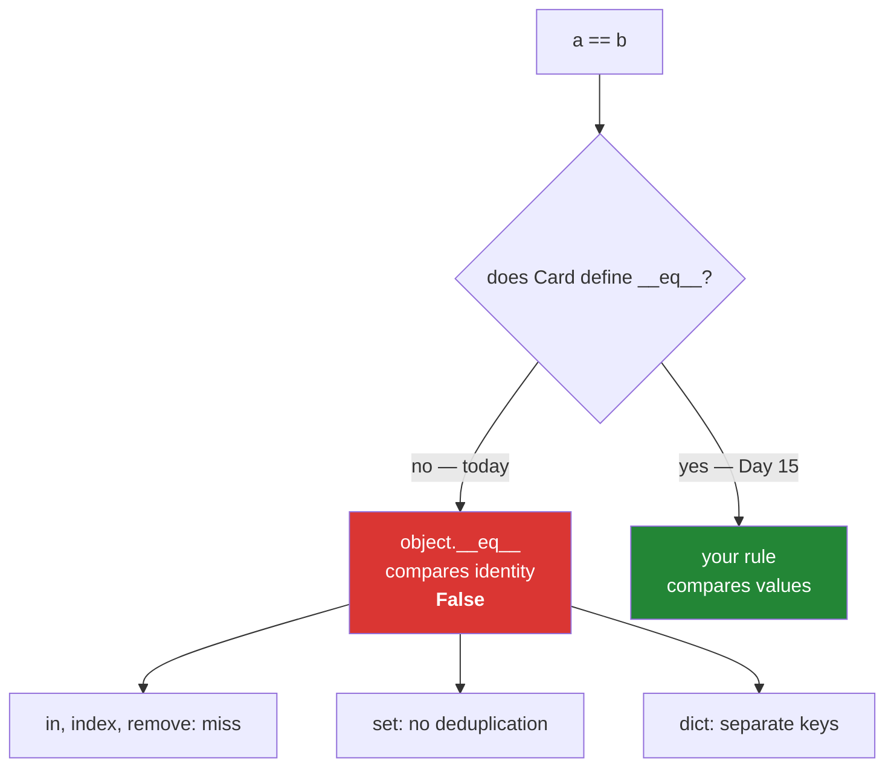

# 2.4 — Your object and equality: two cards, one book

## One-line answer

Two objects of a class you wrote are equal only when they are the same object, whatever their values
say — so two identical records are two different things to `==`, to `in`, to a set and to a
dictionary key, and nothing warns you.

---

## The story

Two cards came out of the drawer this morning with exactly the same words on them:

```text
Title:  The Kitchen Table    Title:  The Kitchen Table
Year:   2019                 Year:   2019
Source: donated              Source: donated
```

Somebody catalogued the book in March. Somebody else, not knowing, catalogued it again in August from
the same donation box. Two cards, one book, identical writing.

Now the librarian asks the drawer a question: *"how many books do we have?"*

The drawer counts cards. It says two.

The drawer is not wrong, exactly. It has two cards. It has no way of knowing that the words on them
describe one object in the world, because a drawer has no opinion about what its cards mean. Deciding
that two cards describe the same book is a judgement somebody has to make and write down, and until
somebody does, the honest answer to "are these the same?" is *"they are two different cards."*

That is precisely what Python says about two instances of your class, and it says it in silence.

---

## The idea in plain language

For a class you wrote, `a == b` is `True` only when `a` and `b` are **the same object**. Values are
not consulted. Two instances with identical attributes are not equal.

The reason is that `==` is a method call
([Day 5, 1.1](../../../day-05-operators-and-conditionals/parts/01-operators/1.1-an-operator-is-a-method-call.md)),
and if your class does not provide one, Python falls back to the default it inherits from `object`,
which compares identity. `a == b` and `a is b` therefore give the same answer, which is the
distinction Day 4 warned about
([Day 4, 3.2](../../../day-04-objects/parts/03-identity-trap/3.2-is-versus-equals.md)) — for your own
classes the warning collapses, because the two really are the same test.

That is not a bug and it is not a temporary state. It is the correct default, because Python cannot
guess your rule. Is `The Kitchen Table (2019, donated)` the same as `The Kitchen Table (2019,
bought)`? Sometimes yes — one book, two copies. Sometimes no — two separate accessions with separate
loan histories. Only you know.

The consequence is that **every operation built on equality inherits identity comparison**, and there
are more of them than people expect:

- `b in [a]` is `False`.
- `list.index`, `list.count` and `list.remove` all use `==`, so they miss.
- `set` deduplication does nothing: `{a, b}` has two elements.
- A dictionary keyed on your objects treats identical records as separate keys.
- `sorted()` fails outright with a `TypeError`, because ordering is a separate question again and
  there is no default at all.

Two more words, because they travel together. An object's **hash** is a number used to find it in a
set or a dictionary; the default one is derived from the object's identity, which is why identical
records land in different buckets. Equality and hashing must agree — objects that are equal must hash
the same — and that is why changing one without the other is a real bug rather than an inconvenience.

**The fix is a `__eq__` method, and it is Day 15's subject** (`PY-18`, magic methods), together with
`__hash__` and the rule that binds them. This document deliberately stops at the problem. What you
need today is to recognise the behaviour, know it is the default rather than a fault, and — where
your code needs a sameness rule right now — use the one you already have.

Because you do already have one. Day 10 built `same_title` and `title_key` in `src/setu/textutils.py`
([Day 10, 3.2](../../../day-10-functions/parts/03-the-module/3.2-designing-clean-title.md)), which
answer "are these the same work?" as a function, in one place, with a test. A function beside the
class is a perfectly professional way to express a sameness rule, and
[3.3](../03-the-paper-object/3.3-method-or-function-beside-it.md) is about when to keep it there.

---

## Why Setu needs it

- **The capstone deduplicates papers.** Two sources returning the same paper is the normal case, not
  the edge case, and a `set` of `Paper` objects will silently keep both.
- **[3.1](../03-the-paper-object/3.1-designing-paper.md) has to decide `Paper`'s identity rule** —
  by DOI, by arXiv identifier, by cleaned title, or by all three with precedence. That decision is a
  design conversation, and it has to happen before anything relies on `==`.
- **Day 155's vector store deduplicates chunks**, and Day 162's retriever merges results from several
  queries. Both are set operations over objects, and both go wrong quietly if equality is identity.
- **Principle 7 asks for tests that can go red.** A test that asserts `result == expected` on two
  freshly-built objects of your class **fails**, and people work around it by comparing attributes one
  at a time. That workaround is the signal that the class needs a rule.

---

## The mechanism

Two identical records, and everything that goes wrong:

```python
"""Same words on both cards. Python says they are two different things."""


class Card:
    def __init__(self, title, year, source):
        self.title = title
        self.year = year
        self.source = source


a = Card("The Kitchen Table", 2019, "donated")
b = Card("The Kitchen Table", 2019, "donated")

print("identical values :", vars(a) == vars(b))
print("a == b           :", a == b)
print("a == a           :", a == a)
print()
print("b in [a]         :", b in [a])
print("len({a, b})      :", len({a, b}))
print("len({a: 1, b: 2}):", len({a: 1, b: 2}))
print()
try:
    sorted([a, b])
except TypeError as error:
    print("sorted           :", error)
```

Run on Python 3.12.12 on 2026-09-01:

```
identical values : True
a == b           : False
a == a           : True

b in [a]         : False
len({a, b})      : 2
len({a: 1, b: 2}): 2

sorted           : '<' not supported between instances of 'Card' and 'Card'
```

**Line by line:**

- `vars(a) == vars(b)` is `True` — **the dictionaries are equal**, because dictionaries compare by
  contents ([2.1](2.1-the-instance-dict.md)). Every value on both objects matches.
- `a == b` is `False` on the very next line. That pair of lines is the whole document: identical
  contents, unequal objects.
- `a == a` is `True`, because it is the same object. The default equality is identity, and identity is
  the only thing it can be sure about.
- `b in [a]` is `False`. `in` uses `==` on each element
  ([Day 5, 3.2](../../../day-05-operators-and-conditionals/parts/03-the-or-trap/3.2-in-is-an-operator.md)),
  so a membership test on your objects is really an identity test.
- `len({a, b})` is `2`. **A set did not deduplicate two identical records**, which is the failure that
  actually reaches production, because "put them in a set" is the standard way to deduplicate
  ([Day 8, 2.1](../../../day-08-containers/parts/02-sets-and-dicts/2.1-a-set-is-a-hash-table.md)).
- `len({a: 1, b: 2})` is `2` for the same reason: a dictionary finds keys by hash and then by `==`,
  and both differ.
- `sorted([a, b])` raises rather than guessing. **Ordering has no default at all**, which is arguably
  friendlier than equality's silent default — at least you find out.

The rule you already have, used where it belongs:

```python
"""Sameness as a function beside the class, which is where it lives until Day 15."""


def title_key(raw):
    """Day 10's comparison key, simplified here to keep this file standalone."""
    return " ".join(raw.split()).removesuffix(".").casefold()


class Card:
    def __init__(self, title, year, source):
        self.title = title
        self.year = year
        self.source = source


def same_book(left, right):
    """True when two cards describe the same work by this library's rule."""
    return (title_key(left.title), left.year) == (title_key(right.title), right.year)


a = Card("The Kitchen Table", 2019, "donated")
b = Card("  the kitchen table.  ", 2019, "bought")
c = Card("Weeknight Bread", 2021, "bought")

print("a == b       :", a == b)
print("same_book a,b:", same_book(a, b))
print("same_book a,c:", same_book(a, c))

seen = []
for card in (a, b, c):
    if not any(same_book(card, kept) for kept in seen):
        seen.append(card)

print("deduplicated :", [card.title for card in seen])
```

Run on Python 3.12.12 on 2026-09-01:

```
a == b       : False
same_book a,b: True
same_book a,c: False
deduplicated : ['The Kitchen Table', 'Weeknight Bread']
```

**Line by line:**

- `title_key` — a local copy of Day 10's function, so this block runs on its own. In your project it
  is imported from `setu.textutils` and has tests
  ([Day 10, 3.2](../../../day-10-functions/parts/03-the-module/3.2-designing-clean-title.md)).
- `" ".join(raw.split())` collapses every run of whitespace to one space, `.removesuffix(".")` drops
  one trailing full stop, `.casefold()` folds case for comparison
  ([Day 7, 2.1](../../../day-07-strings/parts/02-methods/2.1-normalising-strip-and-case.md)).
- `def same_book(left, right):` — **the rule, in one named place, with a docstring.** Anybody arguing
  about what counts as the same book argues with this function, which is the entire value of putting
  it somewhere rather than inlining the comparison at four call sites.
- `(title_key(left.title), left.year) == (...)` — a tuple comparison, which compares element by
  element ([Day 8, 1.3](../../../day-08-containers/parts/01-sequences/1.3-a-tuple-is-a-record.md)).
  Title *and* year, because two different books can share a title and a reissue should not merge with
  the original.
- `a == b` is still `False` — **`same_book` did not change `==`.** That is deliberate here; changing
  `==` is Day 15's job, and it comes with the obligation to define `__hash__` to match.
- `any(same_book(card, kept) for kept in seen)` — the deduplication, using `any` over a generator so
  it stops at the first match
  ([Day 11, 3.4](../../../day-11-iterators-and-generators/parts/03-lambda-and-map/3.4-reduce-any-and-all.md)).
- **This loop is quadratic**: every card is compared against every kept card
  ([Day 6, 4.1](../../../day-06-loops/parts/04-loop-cost/4.1-the-accidental-quadratic.md)). It is
  correct and it is fine for three cards. For a hundred thousand it must become a set of keys, which
  is the production section below.



---

## When it breaks

**The test that cannot pass:**

```text
>>> class Card:
...     def __init__(self, title):
...         self.title = title
...
>>> def parse(line):
...     return Card(line.strip())
...
>>> parse(" The Kitchen Table ") == Card("The Kitchen Table")
False
```

**What it means.** The function is correct and the assertion fails. This is the first place most
people meet the default, and the usual reaction is to write
`assert result.title == expected.title` instead — which works, and quietly means every future field
needs another line, and a field added later is untested by default. The real fix is a rule on the
class (Day 15) or a comparison helper used consistently by the tests.

**The set that deduplicated nothing:**

```text
>>> class Card:
...     def __init__(self, title):
...         self.title = title
...
>>> cards = [Card("The Kitchen Table"), Card("The Kitchen Table")]
>>> len(set(cards))
2
```

**What it means.** No error, no warning, and the count is wrong by exactly the number of duplicates.
This is the failure that reaches production, because `set(...)` is what everybody reaches for and it
looks like it worked. The diagnostic is to check whether the class defines `__eq__` at all —
`"__eq__" in vars(Card)` — and if it does not, `set()` on those objects can only remove *repeats of
the same object*.

**Removing an equal-looking item:**

```text
$ uv run python -c "
class Card:
    def __init__(self, t): self.title = t
a = Card('x'); b = Card('x')
lst = [a, b]
lst.remove(Card('x'))
"
Traceback (most recent call last):
  File "<string>", line 6, in <module>
ValueError: list.remove(x): x not in list
```

**What it means.** The list contains two cards with the title `x`, and `remove` could not find a
third one that is `==` to either. The message says "not in list", which is true and unhelpful. Any
API that takes "the item to remove" rather than "the index to remove" is unusable on objects without
an equality rule.

**Sorting, which at least tells you:**

```text
>>> class Card:
...     def __init__(self, title):
...         self.title = title
...
>>> sorted([Card("b"), Card("a")])
Traceback (most recent call last):
  File "<stdin>", line 1, in <module>
TypeError: '<' not supported between instances of 'Card' and 'Card'
```

**What it means.** There is no default ordering, so this raises instead of returning something
arbitrary. The immediate fix needs no new concepts: `sorted(cards, key=lambda card: card.title)`,
which is [Day 8, 1.5](../../../day-08-containers/parts/01-sequences/1.5-sort-sorted-and-key.md)'s
`key=` and a lambda used exactly as
[Day 11, 3.3](../../../day-11-iterators-and-generators/parts/03-lambda-and-map/3.3-where-a-lambda-hurts.md)
says it should be — an argument, one expression, never named.

---

## In production

**The professional habit is to decide a type's identity rule when the type is designed, not when a
duplicate appears.** For a record that comes from outside, the rule is nearly always a natural key —
a DOI, an ISBN, an arXiv identifier — with a fallback to a normalised title when no identifier
exists. Writing that decision down, in a function or a docstring, is what stops four modules
inventing four slightly different answers.

**What changes at scale is that the pairwise comparison stops being an option.** The deduplication
loop above is quadratic: a hundred thousand cards is five billion comparisons. The production shape
is to compute a **key** for each record — a string — and put the keys in a set or a dictionary, which
is linear ([Day 8, 3.2](../../../day-08-containers/parts/03-dedup/3.2-order-preserving-dedup.md) has
the timing). That is the real reason `title_key` is a separate function from `same_title`: the key is
the thing that scales, and the pairwise predicate is a convenience built on it.

**The failure that only appears with real data is the identity rule that was almost right.** Cleaned
titles merge a paper with its own conference version; DOIs are missing on preprints; arXiv
identifiers change version suffix. Whatever rule you pick will merge something it should not or split
something it should not, so the professional move is not to find the perfect rule but to make the rule
inspectable: log what was merged with what, and keep the merged records rather than dropping them, so
a mistake is recoverable. A deduplication that deletes is a deduplication you cannot audit.

**The review comment a senior engineer leaves.** On a test comparing objects field by field: *"Six
lines asserting six attributes means field seven will be added without a test. Either give `Paper` an
`__eq__` next week when we cover it, or add a `same_paper(a, b)` helper next to the class and use it
in every test — but pick one, because right now each test file has its own idea of what equal means."*

**The interview question.** *"What does `==` do on a class you wrote, if you have not defined
anything?"* The answer that lands is: it compares identity, inherited from `object`, so two instances
with identical attributes are unequal — and everything built on `==` inherits that, so `in` misses,
`set` does not deduplicate, and dictionary keys stay separate. Adding that the fix is `__eq__` **and**
`__hash__` together, because equal objects must hash equally, is the half that shows you have done it
rather than read about it.

---

## Check yourself

```bash
uv run python -c "
class Card:
    def __init__(self, title, year):
        self.title = title
        self.year = year

a = Card('The Kitchen Table', 2019)
b = Card('The Kitchen Table', 2019)
print('same values :', vars(a) == vars(b))
print('a == b      :', a == b)
print('b in [a]    :', b in [a])
print('set size    :', len({a, b}))
print('defines __eq__?', '__eq__' in vars(Card))
print('sorted by key:', [c.title for c in sorted([b, a], key=lambda c: c.title)])
"
```

`vars(a) == vars(b)` is `True` and `a == b` is `False` on the very next line. Say which object is
answering each of those two questions.

**Answer out loud, without scrolling up:**

> Say what `==` compares on a class that defines nothing, and name three operations that silently
> inherit that behaviour. Then say why Python refuses to guess a value-based rule for you.

---

**Next:** [3.1 — designing `Paper`](../03-the-paper-object/3.1-designing-paper.md), where every
decision from sections 1 and 2 gets made on purpose for the object the rest of this plan carries
around.
