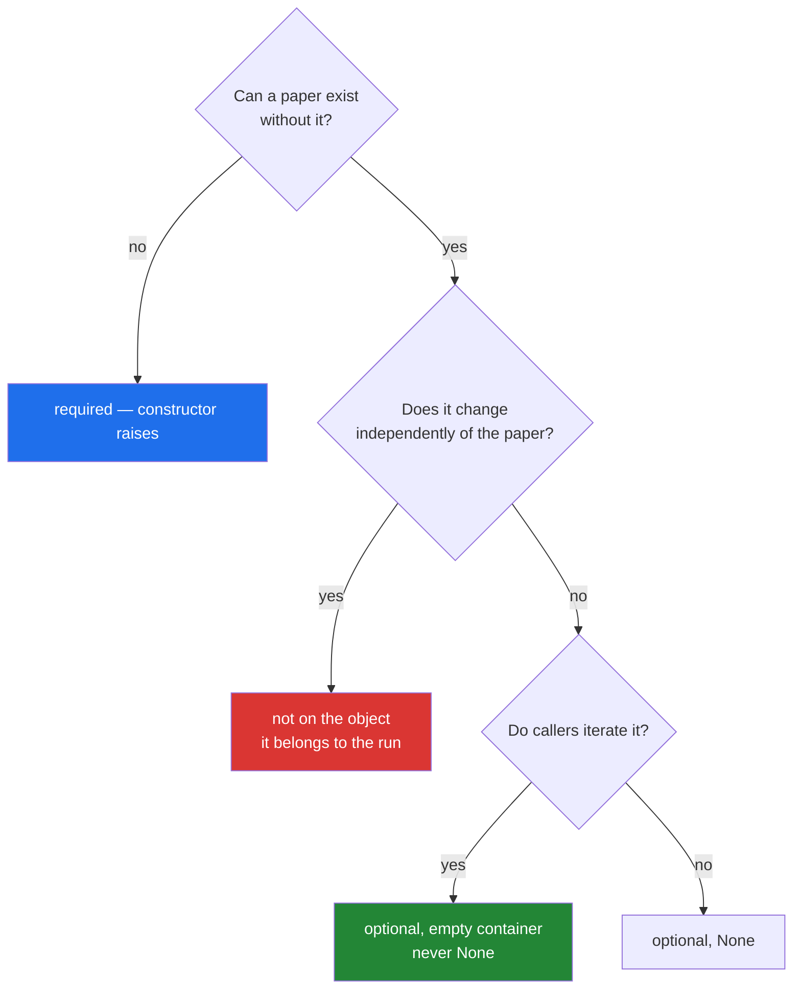

# 3.1 — Designing `Paper`: the fields, and which are optional

## One-line answer

The design work is deciding what a `Paper` **must** have, what it **may** have, and what it must
never carry — and doing that before writing `__init__`, because every one of those choices is a
promise that other days will build on.

---

## The story

Before the library printed its blank card, somebody had to decide what was on it.

That meeting was longer than anybody expected. *Title* was obvious. *Year* was obvious. Then somebody
asked about books with no year printed anywhere, and somebody else said "put a question mark", and a
third person pointed out that a question mark cannot be sorted.

Then came the argument about *Source*. Donated, bought, on loan — three values, everyone agreed. Then
a librarian said that half the donations come in boxes with no note, and the honest answer for those
is that nobody knows. So the field needs a fourth thing, and the fourth thing is not a source. It is
the absence of one.

Then somebody suggested adding *Condition*, because it would be useful. That one was dropped, for a
reason worth remembering: condition changes. A card written once and filed is the wrong place for
something that is different next month, and a card that is wrong is worse than a card that is silent.

The blank they printed has three lines:

```text
Title:
Year:
Source:
```

Three lines, after an hour. That hour is what this document is.

---

## The idea in plain language

`Paper` is the object the rest of this plan carries around — the plan names it as `PY-13`'s example,
*the object the capstone's Reader agent will pass around*. Designing it means answering four
questions, in order, before writing a line of `__init__`.

**1. What must every paper have?** These are the **required** fields, and the test is: can a paper
exist without it, at all, in any pipeline this project will build? A title, yes — a record with no
title cannot be shown, sorted, deduplicated or cited. Everything else, probably not.

**2. What may a paper have?** These are the **optional** fields, and each one needs a decided
absence-value. The choice is almost always `None` rather than `""` or `0`, for a reason worth stating:
`None` means *we do not know*, and `""` means *we know it is empty*. A year of `0` sorts before every
real year and looks like data. A year of `None` cannot be sorted by accident, because it raises.

**3. What must it never carry?** Anything that changes independently of the paper — a fetch
timestamp, a cache entry, a score from one particular ranking run. Those belong to the *process*, not
to the paper, and putting them on the object means every consumer has to wonder whether they are
current. This is the library's *Condition* field, and dropping it is the same decision.

**4. What identifies it?** [2.4](../02-attribute-lookup/2.4-your-object-and-equality.md) established
that Python will not guess. The rule for this project is: a DOI if there is one, otherwise an arXiv
identifier, otherwise the cleaned title plus the year. Writing that down now is what stops four
modules inventing four answers later.

Two words that will come up in every later day. A field is **required** when the object cannot be
built without it; the constructor raises. A field is **optional** when it has a defined value meaning
"absent". A type where everything is optional is a dictionary with extra steps, and a type where
everything is required cannot represent real data — the design is the line between them.

One thing this document does not do: it does not add behaviour. What methods `Paper` should have is
[3.3](3.3-method-or-function-beside-it.md)'s question, and mixing the two conversations is how a class
ends up with eleven fields and four responsibilities.

---

## Why Setu needs it

- **`Paper` is used from here to Day 240.** Day 13's loaders produce them, Day 19's Pydantic model
  validates them, Day 162's retriever ranks them, and the capstone's agents pass them between
  themselves. A field added carelessly today is a field in every one of those.
- **Phase 2's deliverable is a `Paper` class hierarchy plus custom exceptions plus an async fetcher,
  tested.** This class is the root of that, and tomorrow's `BaseLoader` returns them.
- **Day 10's `textutils` already holds the title rules** —
  [Day 10, 3.2](../../../day-10-functions/parts/03-the-module/3.2-designing-clean-title.md). `Paper`
  must **use** them rather than reimplement them, which is the "build on it, never duplicate it" rule
  this project runs on.
- **Principle 9 says data has provenance.** `source` is not decoration; it is where a record came
  from, and every dataset in this repo has to be able to answer that question.

---

## The mechanism

The design, written as a signature with the decisions in the docstring. **The body is yours**
(Principle 6):

```python
"""src/setu/paper.py - the object the rest of the plan carries around."""

from __future__ import annotations


class Paper:
    """One paper, as this project knows it.

    Required:
        title: the paper's title as it arrived. Never empty, never None.

    Optional, each with a decided absence value:
        year:   int, or None when the source did not say. NOT 0 - see part 3.1.
        source: str, or None when unknown. Principle 9: provenance is a field.
        doi:    str, or None. The strongest identity key when present.
        arxiv_id: str, or None. The second-strongest.
        authors: list[str], always a list, empty when unknown. Never None,
            because callers iterate it and None would make every call site
            write a guard (part 1.5 explains why it must be built per instance).

    Identity, by precedence (part 2.4):
        doi -> arxiv_id -> (title_key(title), year)

    Deliberately absent:
        fetched_at, score, cache_key - these belong to a run, not to a paper.
    """

    SOURCES = ("arxiv", "openalex", "manual", "unknown")

    def __init__(
        self,
        title: str,
        *,
        year: int | None = None,
        source: str | None = None,
        doi: str | None = None,
        arxiv_id: str | None = None,
        authors: list[str] | None = None,
    ) -> None:
        # TODO(me): assign every field, unconditionally, including the ones that
        # stay None. Part 2.1's failure section says why a conditional assignment
        # makes the object's shape depend on its data.
        #
        # `authors` needs the copy from part 1.5 - list(authors) if authors else []
        # - and you should be able to say what breaks without the list(...).
        #
        # Validation goes here too, but write it in part 3.2, not now. Get the
        # shape right first.
        raise NotImplementedError
```

**Line by line:**

- `class Paper:` in its own module, `src/setu/paper.py`. Not in `textutils.py`: that module is text
  functions, and a type that imports them is a different concern
  ([Day 10, 3.1](../../../day-10-functions/parts/03-the-module/3.1-from-notebook-to-module.md)).
- The docstring is organised as **required · optional · identity · deliberately absent**, which is the
  four questions in order. A reader who wants to know whether they may pass a paper with no year gets
  the answer without reading the body.
- `SOURCES = ("arxiv", "openalex", "manual", "unknown")` — a **tuple** on the class
  ([1.4](../01-the-blank-form/1.4-instance-and-class-attributes.md)). A tuple rather than a list
  precisely because a class-level mutable is the bug in
  [1.5](../01-the-blank-form/1.5-the-shared-class-attribute.md), and a tuple cannot be appended to by
  accident.
- `title: str` positional, everything else after the bare `*` — **keyword-only**
  ([Day 10, 1.5](../../../day-10-functions/parts/01-the-signature/1.5-keyword-only-and-positional-only.md)).
  With six fields, positional construction would be unreadable and silently swappable:
  `Paper("t", 2019, "arxiv", ...)` invites two strings to trade places.
- `year: int | None = None` — the absence value, chosen. `0` would sort first and look like a year;
  `None` cannot be compared to an integer, so a sort that forgets about it fails loudly rather than
  putting every unknown paper at the top.
- `authors: list[str] | None = None` in the **signature**, and always a list on the **object**. Those
  are different: `None` is a legal thing to pass and an illegal thing to store, because every caller
  iterates `paper.authors` and a `None` there means a guard at every call site.
- `-> None` on `__init__` — it returns nothing
  ([1.2](../01-the-blank-form/1.2-init-and-self.md)), and annotating it says so to a type checker.
- The `TODO(me)` names what to do and refuses to do it. It also names the two parts that explain the
  decisions, so a deferred explanation has an address.

The four questions, applied to three real candidate fields:

```python
"""Three fields somebody will propose. Two belong; one does not."""

CANDIDATES = [
    ("title", "required", "nothing can display, sort or deduplicate without it"),
    ("year", "optional, None", "preprints often have no year; 0 would sort as data"),
    ("fetched_at", "not on the object", "changes per run; belongs to the fetch, not the paper"),
]

for name, verdict, reason in CANDIDATES:
    print(f"{name:12} {verdict:18} {reason}")
```

**Line by line:**

- A list of tuples, each a record of three things
  ([Day 8, 1.3](../../../day-08-containers/parts/01-sequences/1.3-a-tuple-is-a-record.md)). This is
  documentation you can run, and it exists to make the decisions comparable rather than to compute
  anything.
- `("title", "required", ...)` — required, because absence makes the object useless rather than
  incomplete. That is the test for the first question.
- `("year", "optional, None", ...)` — optional, with the absence value chosen and the alternative
  rejected in the same line. **A field's absence value is part of its design**, not an implementation
  detail.
- `("fetched_at", "not on the object", ...)` — the *Condition* field from the story. It changes
  independently of the thing it is attached to, so anybody reading it has to ask how old it is, and
  nobody will.
- `f"{name:12} {verdict:18}"` — column widths so the three lines can be read down rather than across
  ([Day 7, 3.2](../../../day-07-strings/parts/03-formatting/3.2-the-format-spec.md)).



---

## When it breaks

**The year that was zero:**

```text
>>> papers = [("A", 2019), ("B", 0), ("C", 2021)]
>>> sorted(papers, key=lambda p: p[1])
[('B', 0), ('A', 2019), ('C', 2021)]
```

**What it means.** The paper with no year sorted first, ahead of every real one, and looks like the
oldest paper in the corpus. Nothing raised. A "most recent first" list now puts unknown-year papers at
the bottom and a "oldest first" list puts them at the top, and in both cases they are presented as
data. With `None` the same sort raises `TypeError: '<' not supported between instances of 'NoneType'
and 'int'`, which is a message you can act on.

**The optional list that was `None`:**

```text
$ uv run python -c "
class Paper:
    def __init__(self, title, authors=None):
        self.title = title
        self.authors = authors
p = Paper('The Kitchen Table')
print(', '.join(p.authors))
"
Traceback (most recent call last):
  File "<string>", line 7, in <module>
TypeError: can only join an iterable
```

**What it means.** Storing `None` for a collection pushes a guard into every caller — `if
paper.authors:` before every loop and every join — and the one caller that forgets gets this. Storing
`[]` means "no authors known" is iterable and every loop runs zero times, which is exactly right. The
rule generalises: **optional scalars are `None`, optional collections are empty.**

**The field that was set conditionally:**

```text
>>> class Paper:
...     def __init__(self, title, doi=None):
...         self.title = title
...         if doi:
...             self.doi = doi
...
>>> a = Paper("A", "10.1/x")
>>> b = Paper("B")
>>> sorted(vars(a)) == sorted(vars(b))
False
>>> b.doi
Traceback (most recent call last):
  File "<stdin>", line 1, in <module>
AttributeError: 'Paper' object has no attribute 'doi'
```

**What it means.** Two papers with two different shapes, from the same class
([2.1](../02-attribute-lookup/2.1-the-instance-dict.md)). Every `paper.doi` in the codebase is now a
gamble that depends on the data. Set it unconditionally to `None`: `None` is a value you can test,
and a missing attribute is a crash.

**The field that belonged to the run:**

```text
>>> paper.fetched_at
datetime.datetime(2026, 3, 14, 9, 12, 4)
>>> paper.score
0.87
```

**What it means.** No error, and two questions with no answer: fetched by which run, and scored
against which query? A `score` on a paper is meaningless without the query it scored against, so the
next person either guesses or adds `scored_for` as well, and now the object carries a ranking session.
The professional shape is a separate small record — `Ranked(paper, score, query)` — which is a class
of its own and keeps `Paper` a paper.

---

## In production

**The professional habit is that the field list is a contract, and it changes through a decision
rather than a commit.** Adding a field is cheap to write and expensive forever: every serialiser,
every test fixture, every consumer and every storage schema now knows about it. Teams that treat the
core types this way have a short list of them and a long list of process types built around them,
which is exactly the `Paper` / `Ranked` split above.

**What changes at scale is that optional fields dominate.** With ten thousand papers from three
sources, the union of everything any source provides is thirty fields and most are absent most of the
time. The answer is not a thirty-field class; it is a small required core plus a `raw: dict` holding
whatever the source said, so nothing is lost and nothing is promised. That is a real pattern with a
real cost — the `raw` dictionary is untyped and unvalidated — and naming it as a deliberate escape
hatch is better than letting the class grow to thirty attributes.

**The failure that only appears with real data is the field that is required in theory.** `title` is
required, and then a source returns a record whose title is `""` or `"[No title]"` or six spaces. If
the constructor only checks `is None`, all three get through and every downstream deduplication merges
them into one paper. That is [3.2](3.2-validation-in-init.md)'s subject, and the design decision that
makes it possible is here: deciding that `title` is required means deciding what counts as having
one.

**The review comment a senior engineer leaves.** On a `Paper` with a `year: int = 0` default:
*"`0` is a year, so nothing downstream can tell 'we do not know' from 'the year is zero' — and the
sort will put every unknown at one end looking like real data. Make it `int | None = None`. Yes, that
means the sort needs a key that handles `None`; that is the point, because right now the sort is
silently wrong."*

**The interview question.** *"How do you decide what goes on a domain object?"* The answer that lands
is a rule rather than a list: required if the object is meaningless without it, optional with a
chosen absence value if it can genuinely be unknown, and off the object entirely if it changes
independently of the thing — because a field that belongs to a run makes every reader ask how fresh
it is. Adding that optional scalars get `None` and optional collections get an empty container, for
the specific reason that callers iterate the second, shows you have maintained one of these.

---

## Check yourself

```bash
uv run python -c "
papers = [('A', 2019), ('B', 0), ('C', 2021)]
print('year 0 sorts as data:', sorted(papers, key=lambda p: p[1]))

papers_none = [('A', 2019), ('B', None), ('C', 2021)]
try:
    sorted(papers_none, key=lambda p: p[1])
except TypeError as e:
    print('year None raises   :', e)
"
```

One of these silently produces a wrong order and one refuses. Say which absence value you would give
`Paper.year`, and what the caller has to write because of your choice.

**Answer out loud, without scrolling up:**

> Give the four questions to ask about a candidate field, in order. Then say why an optional list is
> stored as `[]` and an optional year as `None`.

---

**Next:** [3.2 — validation in `__init__`](3.2-validation-in-init.md), where "required" stops being a
word in a docstring and becomes something that raises.
