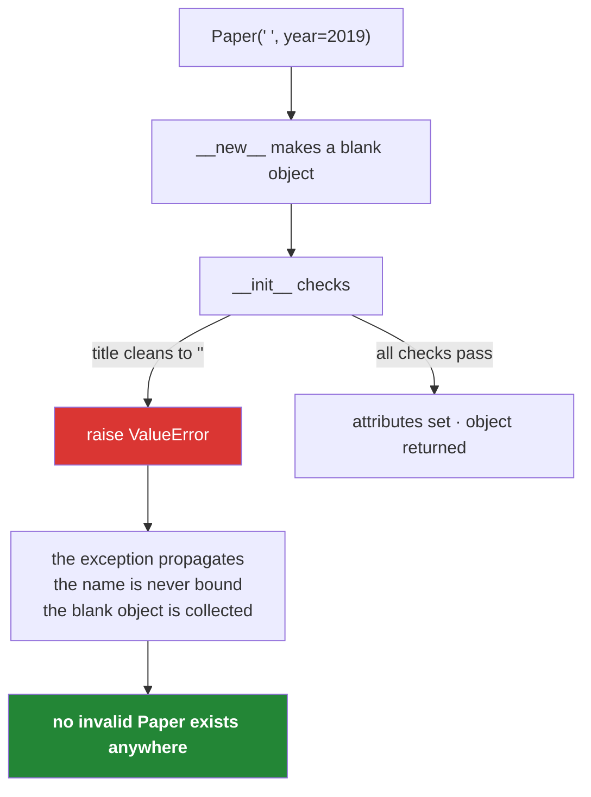

# 3.2 — Validation in `__init__`: an object that cannot exist in a bad state

## One-line answer

Checking the arguments in `__init__` and raising on bad ones means every `Paper` that exists anywhere
in the program is a valid one — so no function downstream has to ask, and the error appears where the
bad data came in rather than four modules later.

---

## The story

The library gets a box of donations with a note that says *"anything useful"*.

The person cataloguing works through it. Most books are fine. Then there is a paperback with the cover
torn off and no title page — no title anywhere on it. They write a card:

```text
Title:
Year:   2019
Source: donated
```

and file it.

Six weeks later, somebody printing the shelf labels finds a label with no words on it. They go back
to the drawer. The card says nothing. They go back to the box; the box is gone. Nobody remembers the
book, nobody can identify it, and there is a blank card in the drawer that will confuse somebody
every few months until it is thrown away.

The thing that would have prevented all of it is a rule at the desk: **a card with no title does not
go in the drawer.** Not "gets a note added later". Does not go in.

That rule costs one awkward conversation at the moment of cataloguing — what do we do with this
book? — and it is exactly the right moment to have it, because that is the only moment when the box
is still there.

---

## The idea in plain language

An **invariant** is something that is true about an object for its whole life. "A paper always has a
non-empty title" is an invariant. So is "the year is either `None` or a plausible four-digit number".

An invariant is only worth stating if it cannot be broken, and there is exactly one place to enforce
it at construction time: `__init__`. Check the arguments, raise on anything that would break the
rule, and the object never comes into existence.

That last part is the piece worth being precise about.
[1.2](../01-the-blank-form/1.2-init-and-self.md) established that the object is created before
`__init__` runs — so what happens when `__init__` raises? The exception propagates out of the call,
so `paper = Paper("")` never binds `paper` to anything. The half-built object is unreachable and gets
collected. **There is no partly-valid `Paper` anywhere in the program**, which is the whole point.

The payoff is that every function downstream can stop asking. `def cite(paper)` does not need
`if not paper.title: return ""`, because a `Paper` with no title cannot be constructed. That guard,
multiplied by every consumer, is what validation at the boundary buys you.

Three rules make the difference between validation that helps and validation that annoys:

1. **Raise the right exception type.** `ValueError` for a value that is the right type and wrong
   content — an empty title, a year of 1200. `TypeError` for the wrong type entirely. Day 18 builds
   custom exception types; today the two built-ins are correct and sufficient.
2. **Put the offending value in the message.** `ValueError("title must not be empty")` tells you the
   rule. `ValueError(f"title must not be empty, got {raw_title!r}")` tells you the rule *and* the
   data, and `!r` shows quotes and whitespace
   ([Day 7, 3.3](../../../day-07-strings/parts/03-formatting/3.3-repr-and-the-debugging-f-string.md)).
   The second one is the difference between a two-minute fix and an hour of guessing.
3. **Normalise before you check, and store what you checked.** If the rule is "non-empty after
   cleaning", then clean first, test the cleaned value, and store the cleaned value. Validating the
   raw form and storing it means the check and the data disagree.

One boundary this document is careful about: **validate what the object is, not what somebody might
do with it.** "The title is not empty" is about the paper. "The title is under 200 characters because
our display truncates" is about a screen, and putting it here means a legitimate long-titled paper
cannot be loaded at all. Invariants are properties of the thing.

---

## Why Setu needs it

- **Every source in this project returns messy records.** Missing titles, blank strings, years as
  strings, whitespace-only fields. Deciding what to do with those once, at the constructor, is what
  keeps the rest of the pipeline readable.
- **Principle 8's habit generalises.** The plan's rule is that the split comes before the scaler; the
  same instinct says the check comes before the object exists. In both cases the alternative is a
  problem that leaks quietly into everything downstream.
- **Day 13's loaders each build `Paper` objects** from three different formats. If the validation is
  in `Paper`, all three get it for free, and a loader cannot accidentally produce a paper that a
  different loader would have rejected.
- **Day 19 replaces this with Pydantic**, which does the same job declaratively. Writing the manual
  version first is Principle 2, and it is also what makes Pydantic's error messages legible when you
  meet them.

---

## The mechanism

The rules, enforced. **The `TODO(me)` blocks stay unsolved** (Principle 6):

```python
"""src/setu/paper.py - the invariants, checked where they can still be enforced."""

from __future__ import annotations

from setu.textutils import clean_title


class Paper:
    """One paper. A Paper that exists is a valid Paper."""

    SOURCES = ("arxiv", "openalex", "manual", "unknown")
    EARLIEST_YEAR = 1600

    def __init__(
        self,
        title: str,
        *,
        year: int | None = None,
        source: str | None = None,
        authors: list[str] | None = None,
    ) -> None:
        """Build a Paper, or raise.

        Raises:
            TypeError: if title is not a str, or year is not an int or None.
            ValueError: if title is empty after cleaning, if year is outside
                EARLIEST_YEAR..2100, or if source is not in SOURCES.
        """
        # TODO(me): clean FIRST, then check the cleaned value, then store the
        # cleaned value. Doing those three in a different order gives you an
        # object whose stored title is not the one you validated.
        #
        # Every raise gets the offending value with !r in the message. Write one
        # of them without it, read the failure, then put it back - that is the
        # fastest way to believe this rule.
        #
        # `year` needs a type check as well as a range check, and the order
        # matters: comparing a str to an int raises TypeError with a message
        # about '<' rather than about the year.
        raise NotImplementedError
```

**Line by line:**

- `from setu.textutils import clean_title` — **the cleaning rule is already written and tested**
  ([Day 10, 3.2](../../../day-10-functions/parts/03-the-module/3.2-designing-clean-title.md)). Writing
  a second version here would be two rules that drift.
- `EARLIEST_YEAR = 1600` — a class attribute, because it is a fact about the type rather than about
  one paper ([1.4](../01-the-blank-form/1.4-instance-and-class-attributes.md)). It is also the kind of
  number that needs a name: a bare `1600` in a comparison is a mystery in six months.
- The `Raises:` section of the docstring — **the exceptions are part of the signature.** A caller
  deciding whether to wrap this in a `try` needs to know which ones can come out, and the docstring is
  where that lives until Day 18 gives them types of their own.
- `TypeError` and `ValueError` used for different things, as rule 1 above says. A caller can catch
  `ValueError` to mean "this record was bad" and let `TypeError` escape, because a `TypeError` here
  means the *code* is wrong rather than the data.
- The `TODO(me)` names the order — clean, check, store — and says what goes wrong in each other
  order, without doing it.
- No validation of `authors` beyond the copy from
  [1.5](../01-the-blank-form/1.5-the-shared-class-attribute.md). "Every author name is non-empty" is a
  rule about a list's contents and is worth having; it is left out here so that the block stays about
  one idea.

What the checks actually look like, written as a standalone function so you can run it without the
class:

```python
"""The three checks, in the right order, with the offending value in each message."""

EARLIEST_YEAR = 1600
SOURCES = ("arxiv", "openalex", "manual", "unknown")


def validate(title, year=None, source=None):
    """Return the cleaned title, or raise. Same rules as Paper.__init__."""
    if not isinstance(title, str):
        raise TypeError(f"title must be a str, got {type(title).__name__}: {title!r}")

    cleaned = " ".join(title.split())
    if not cleaned:
        raise ValueError(f"title must not be empty after cleaning, got {title!r}")

    if year is not None:
        if not isinstance(year, int) or isinstance(year, bool):
            raise TypeError(f"year must be an int or None, got {type(year).__name__}: {year!r}")
        if not EARLIEST_YEAR <= year <= 2100:
            raise ValueError(f"year must be between {EARLIEST_YEAR} and 2100, got {year!r}")

    if source is not None and source not in SOURCES:
        raise ValueError(f"source must be one of {SOURCES}, got {source!r}")

    return cleaned


for args in [
    ("  The   Kitchen Table  ", 2019, "arxiv"),
    ("   ", 2019, "arxiv"),
    ("The Kitchen Table", "2019", None),
    ("The Kitchen Table", 1200, None),
    ("The Kitchen Table", None, "a friend"),
    ("The Kitchen Table", True, None),
]:
    try:
        print("ok  :", repr(validate(*args)))
    except (TypeError, ValueError) as error:
        print(f"{type(error).__name__:9}:", error)
```

Run on Python 3.12.12 on 2026-09-01:

```
ok  : 'The Kitchen Table'
ValueError: title must not be empty after cleaning, got '   '
TypeError: year must be an int or None, got str: '2019'
ValueError: year must be between 1600 and 2100, got 1200
ValueError: source must be one of ('arxiv', 'openalex', 'manual', 'unknown'), got 'a friend'
TypeError: year must be an int or None, got bool: True
```

**Line by line:**

- `if not isinstance(title, str):` — **the type check comes first**, because every check below it
  calls a string method. Checking content on a non-string gives an `AttributeError` from inside your
  own validator, which is confusing rather than helpful.
- `type(title).__name__` in the message — the type's name without `<class '...'>` around it, which is
  the readable form.
- `cleaned = " ".join(title.split())` then `if not cleaned:` — **clean, then check the cleaned
  value.** `"   "` passes a naive `if not title` check in some spellings and fails here, because three
  spaces clean to nothing. This is the rule-3 ordering, and the second output line is it working.
- `if year is not None:` — the optional field is only checked when present. `is not None` rather than
  `if year:`, because `0` is falsy and would skip the range check that is supposed to reject it
  ([Day 5, 3.1](../../../day-05-operators-and-conditionals/parts/03-the-or-trap/3.1-the-or-default-and-falsy-zero.md)).
- `or isinstance(year, bool)` — **`True` is an `int` in Python**
  ([Day 4, 1.3](../../../day-04-objects/parts/01-objects/1.3-numbers-and-bool.md)), so without this
  clause `Paper("x", year=True)` would pass the type check and then fail the range check with a
  message about `1`. The last output line is that clause earning its place.
- `EARLIEST_YEAR <= year <= 2100` — a chained comparison
  ([Day 5, 1.3](../../../day-05-operators-and-conditionals/parts/01-operators/1.3-comparison-and-chaining.md)),
  which reads as the range it is.
- `source not in SOURCES` with the whole tuple in the message — a caller who mistypes a source sees
  the allowed list without opening the source file.
- `except (TypeError, ValueError) as error:` — a tuple of exception types
  ([Day 5, 3.2](../../../day-05-operators-and-conditionals/parts/03-the-or-trap/3.2-in-is-an-operator.md)
  for the tuple; Day 18 for exceptions properly). Both are caught here **only because this block is a
  demonstration**; real code catches `ValueError` and lets `TypeError` through.
- Every message names the rule **and** shows the value with `!r`. Read them as a set: each one could
  be pasted into a bug report and understood by somebody who has not seen the code.



---

## When it breaks

**The object that was never created:**

```text
$ uv run python -c "
class Paper:
    def __init__(self, title):
        if not title.strip():
            raise ValueError(f'title must not be empty, got {title!r}')
        self.title = title
paper = Paper('   ')
print(paper)
"
Traceback (most recent call last):
  File "<string>", line 7, in <module>
  File "<string>", line 5, in __init__
ValueError: title must not be empty, got '   '
```

**What it means.** The traceback has two frames: the call site and `__init__`. `print(paper)` never
ran, because the assignment never happened — **`paper` is not bound to a broken object; it is not
bound at all.** Reading `NameError: name 'paper' is not defined` on the next line of a longer script
is the normal follow-on, and it is correct: there is nothing there.

**Validating the raw value and storing it anyway:**

```text
>>> class Paper:
...     def __init__(self, title):
...         if not title.strip():
...             raise ValueError("empty title")
...         self.title = title
...
>>> p = Paper("  The Kitchen Table  ")
>>> repr(p.title)
"'  The Kitchen Table  '"
```

**What it means.** The check passed and the stored value still has its spaces, so every downstream
comparison, deduplication and display gets the untidied form. The validator and the data disagree,
which is worse than not validating, because everybody now believes the field is clean. Clean first,
check the cleaned value, store the cleaned value.

**The check that let a boolean through:**

```text
>>> class Paper:
...     def __init__(self, title, year=None):
...         if year is not None and not isinstance(year, int):
...             raise TypeError("year must be an int")
...         self.year = year
...
>>> p = Paper("x", year=True)
>>> p.year
True
>>> p.year + 1
2
```

**What it means.** `True` is an `int`, so `isinstance(True, int)` is `True` and the check passes.
Now a paper has a year of `True`, which prints as `True`, sorts as `1`, and adds as `1`. Nothing will
ever raise. The extra clause `or isinstance(year, bool)` is not pedantry — it is the difference
between catching this at the boundary and finding a paper from year 1 in a chart.

**Validation that belongs to the display:**

```text
>>> Paper("A Very Long Title " * 20)
Traceback (most recent call last):
  File "<stdin>", line 1, in <module>
ValueError: title must be under 200 characters
```

**What it means.** A real paper with a long title cannot be loaded at all, and the reason is that
somebody's table column is narrow. This is validation of the wrong thing: the invariant is a property
of the paper, and "fits in a column" is a property of a screen. The fix is to truncate at display
time and let the object hold the truth.

---

## In production

**The professional shape is validation at the edges and trust inside.** Records are checked once,
where they enter the system — the constructor, the parser, the API boundary — and every function
inside can then assume validity. The alternative, checking everywhere, produces code where a third of
the lines are guards and where somebody eventually removes one because "that can never happen here".

**What changes at scale is that raising stops being the whole answer.** One bad record in ten million
should not kill the job. The professional pattern is a constructor that raises plus a loader that
catches, counts and reports: `except ValueError as error: rejected.append((line_number, error))`, and
at the end a summary saying how many rows were rejected and why. **A pipeline that silently drops bad
rows and one that dies on the first are both wrong**; the right one keeps going and can tell you
exactly what it skipped. That is why the value goes in the message — the rejection log is only useful
if each line identifies its own row.

**The failure that only appears with real data is the rule that was too strict.** `year <= 2100` is
obviously safe until a source encodes "in press" as 9999, and `source in SOURCES` is safe until a
fourth source is added and forty thousand records are rejected overnight. Validation is a promise
about the world, and the world changes. The habit that survives it is to make the strict rules the
ones about structure — non-empty, right type — and to be generous about the ones enumerating values,
or to keep the unknown value with a flag rather than refusing the record.

**The review comment a senior engineer leaves.** On `raise ValueError("invalid year")`: *"This message
tells me the field and nothing else. When this fires at three in the morning on row 412 000 of a
nightly load, I need the value — `f'year must be 1600..2100, got {year!r}'` — and ideally the row
number from the caller. Right now I would have to reproduce it to find out what was in there."*

**The interview question.** *"Where do you validate?"* The answer that lands is: at the boundary, in
the constructor or parser, so that an invalid object cannot exist and no downstream function has to
check — and because `__init__` raising means the name is never bound, there is no half-built object to
leak. Adding that the message must carry the offending value, and that a bulk loader catches and
counts rather than dying on row one, turns a principle into something you have operated.

---

## Check yourself

```bash
uv run python -c "
EARLIEST_YEAR = 1600

def validate(title, year=None):
    if not isinstance(title, str):
        raise TypeError(f'title must be a str, got {type(title).__name__}: {title!r}')
    cleaned = ' '.join(title.split())
    if not cleaned:
        raise ValueError(f'title must not be empty after cleaning, got {title!r}')
    if year is not None:
        if not isinstance(year, int) or isinstance(year, bool):
            raise TypeError(f'year must be an int or None, got {type(year).__name__}: {year!r}')
        if not EARLIEST_YEAR <= year <= 2100:
            raise ValueError(f'year must be between {EARLIEST_YEAR} and 2100, got {year!r}')
    return cleaned

for args in [('  The   Kitchen Table ', 2019), ('   ', 2019), ('x', True), ('x', 1200)]:
    try:
        print('ok  :', repr(validate(*args)))
    except (TypeError, ValueError) as e:
        print(f'{type(e).__name__:9}:', e)
"
```

Delete the `or isinstance(year, bool)` clause and run it again. Say what the third line does now, and
why that is worse than an error.

**Answer out loud, without scrolling up:**

> Say what happens to the object when `__init__` raises, and why that means no invalid instance can
> exist. Then give the three-step order for validating a value that also needs cleaning.

---

**Next:** [3.3 — a method, or a function beside it?](3.3-method-or-function-beside-it.md), which is
the last design question `Paper` has to answer today.
