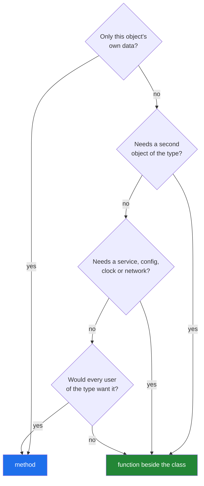

# 3.3 — A method, or a function beside it?

## One-line answer

Behaviour belongs on the object when it is about that one object's own data and every user of the
type wants it; everything else — anything needing a second object, a configuration, or a service —
is a function that takes the object as an argument.

---

## The story

The library's laminated instruction sheet grows.

It starts with one line: *to read a card out loud, say the title then the year in brackets.* That
belongs on the sheet, because it is about one card and everybody who handles a card wants it.

Then somebody adds: *to decide whether two cards are the same book, compare the titles ignoring case
and punctuation.* That one is awkward on a card-handling sheet, because it is not about a card. It is
about a pair of cards, and the sheet is pinned above the drawer where you hold one at a time.

Then somebody adds: *to work out the late fee, take the days overdue and multiply by the rate on the
noticeboard.* This one is worse. It needs the noticeboard, which changes; it needs today's date; and
it has nothing to do with what is written on the card. A card is a card whether or not there is a fee
policy.

By the end the sheet has eleven lines, three of them need something that is not a card, and nobody
reads it.

The three cards have not changed:

```text
Title:  The Kitchen Table    Title:  Weeknight Bread    Title:  The Kitchen Table
Year:   2019                 Year:   2021               Year:   2019
Source: donated              Source: bought             Source: bought
```

---

## The idea in plain language

You have two places to put a piece of behaviour:

- **A method** — `paper.citation()` — defined inside the class, receiving the object as `self`
  ([1.3](../01-the-blank-form/1.3-methods-find-their-object.md)).
- **A function beside the class** — `citation(paper)` — defined in a module, taking the object as an
  ordinary argument.

Both work, and choosing well is one of the things that separates a class people enjoy using from one
they route around. Four questions decide it, in this order:

**1. Is it about this one object's own data, and nothing else?** If yes, it is a method.
`paper.citation()` reads `title`, `year` and `authors` and returns a string. Nothing else is
involved, so putting it anywhere else means the caller has to reach into the object for it.

**2. Does it need a second object of the same type?** Then it is a function.
`same_paper(a, b)` is symmetric — neither argument is more important than the other — and writing it
as `a.same_as(b)` makes it look as though `a` decides, which invites a version where `a.same_as(b)`
and `b.same_as(a)` can disagree.

**3. Does it need something the object should not know about?** A database, a network call, a model,
a configuration file, a clock. Then it is a function, and the thing it needs is a parameter
([Day 10, 3.3](../../../day-10-functions/parts/03-the-module/3.3-pure-functions-and-the-seam.md)).
A `Paper` that can `paper.fetch_citations()` has quietly acquired a network dependency, and now every
test that builds a paper is a test that could hit the network.

**4. Would only some users of the type want it?** Then it is a function, in the module that wants it.
A method is part of the type for everybody, forever; a function is opt-in, and it can live next to the
code that cares.

There is a fifth consideration that is not a question but a habit worth naming: **methods are for the
things that would be strange to do any other way.** Nobody wants to write `title_of(paper)` — the
title is right there. Everybody is happy to write `rank(papers, query)`, because ranking is not
something a paper does.

Two words for the shape this produces. The **core** of a type is a small set of methods about its own
data. The **surface around it** is functions that combine, compare, fetch and transform. Types that
stay small in the middle stay usable, and this is the same argument as
[Day 10, 3.3](../../../day-10-functions/parts/03-the-module/3.3-pure-functions-and-the-seam.md)'s pure
core and thin shell, applied to a type instead of a program.

---

## Why Setu needs it

- **`Paper` is used by every later phase**, so a method added today is a method Day 162's retriever
  and Day 216's agents both inherit. The cost of a wrong method is not a refactor; it is a refactor
  across a hundred and fifty days of code.
- **Day 10's `textutils` already holds the title rules.** `same_title` and `title_key` are functions,
  and they should stay functions — moving them onto `Paper` would mean `textutils` could no longer use
  them on plain strings, which is most of its job.
- **Day 15 adds `classmethod`, `staticmethod` and `property`**, which are three more places to put
  behaviour. Deciding between two places well is the prerequisite for deciding between five.
- **Principle 11 is blast radius.** A method that can reach the network is a network dependency on
  every instance, everywhere, forever. Keeping that outside the type is the smallest possible version
  of the principle.

---

## The mechanism

The four questions, applied to five candidates. **The method bodies are yours** (Principle 6):

```python
"""src/setu/paper.py - the small core, and what stays outside it."""

from __future__ import annotations


class Paper:
    """One paper. Methods here are about THIS paper's own data, and nothing else."""

    def __init__(self, title: str, *, year: int | None = None, authors: list[str] | None = None):
        self.title = title
        self.year = year
        self.authors = list(authors) if authors else []

    def citation(self) -> str:
        """Return this paper as a one-line citation string.

        Uses only this paper's own fields. Question 1: a method.
        """
        # TODO(me): title, year in brackets, authors joined. Decide what an empty
        # authors list produces and write it in this docstring - "" and "Unknown"
        # are both defensible and a caller cannot guess which you chose.
        raise NotImplementedError

    def is_preprint(self) -> bool:
        """True when this paper has no year, which this project treats as a preprint.

        One field, one rule, no arguments. Question 1: a method.
        """
        # TODO(me): one line. Then ask yourself whether the RULE belongs here or
        # whether the method should take the rule as an argument - part 3.3's
        # question 3 is about exactly that boundary.
        raise NotImplementedError
```

**Line by line:**

- `def citation(self) -> str:` — **no arguments beyond `self`**, which is the signature of a question
  1 method. Every value it needs is already on the object.
- The docstring names *which question* made it a method. That is not ceremony: the next person
  wondering whether to add a method reads the two that exist and sees the rule being applied.
- `def is_preprint(self) -> bool:` — one field, one rule. It is on the type because "is this a
  preprint" is a fact about the paper under this project's definition.
- The `TODO(me)` in `is_preprint` deliberately raises the awkward version of the question: the *rule*
  ("no year means preprint") is a project decision, not a property of papers in general. Both answers
  are defensible, and noticing the tension is the skill.
- `self.authors = list(authors) if authors else []` — the copy from
  [1.5](../01-the-blank-form/1.5-the-shared-class-attribute.md), repeated here because this block is
  standalone.

What stays outside, and why:

```python
"""src/setu/dedup.py - functions that take Papers, and do not belong on Paper."""

from __future__ import annotations

from collections.abc import Iterable, Iterator

from setu.paper import Paper
from setu.textutils import title_key


def same_paper(left: Paper, right: Paper) -> bool:
    """True when two papers are the same work.

    Question 2: needs a second paper, and is symmetric. A function.
    """
    # TODO(me): use title_key from day 10. Add the year to the comparison and
    # say in a comment why two papers with the same title and different years
    # are NOT the same work in this project.
    raise NotImplementedError


def unique_papers(papers: Iterable[Paper]) -> Iterator[Paper]:
    """Yield the first paper seen for each identity key, in input order.

    Question 4: only deduplicating callers want this. A function.
    """
    # TODO(me): day 11 part 4.2's shape, over Papers instead of strings. Keep a
    # set of KEYS, not of papers - part 2.4 says why a set of papers cannot work.
    raise NotImplementedError


def rank(papers: Iterable[Paper], query: str) -> list[tuple[Paper, float]]:
    """Return (paper, score) pairs for `query`, best first.

    Question 3: a score is meaningless without the query it scored against, so
    it is not a fact about the paper. A function, and the result is a new pair
    rather than a field on Paper (part 3.1's 'deliberately absent').
    """
    # TODO(me): leave the scoring naive for now - day 162 replaces it. What
    # matters today is that the score comes back BESIDE the paper rather than
    # ON it.
    raise NotImplementedError
```

**Line by line:**

- A **different module**, `dedup.py`, not `paper.py`. That physical separation is the design decision
  made visible: `paper.py` can be imported by anything without pulling in deduplication, and
  `dedup.py` importing `Paper` is a one-way dependency.
- `def same_paper(left: Paper, right: Paper) -> bool:` — two parameters, named `left` and `right`
  rather than `self` and `other`, because **neither one is privileged**. That naming is the whole
  argument for question 2 in two words.
- `from setu.textutils import title_key` — reusing Day 10's tested rule
  ([Day 10, 3.2](../../../day-10-functions/parts/03-the-module/3.2-designing-clean-title.md)) rather
  than writing a second one. `title_key` works on strings, which is why it must not become a method.
- `def unique_papers(...) -> Iterator[Paper]:` — a generator
  ([Day 11, 2.1](../../../day-11-iterators-and-generators/parts/02-generators/2.1-yield-the-function-that-pauses.md)),
  because a corpus is walked once. `Iterable` in, `Iterator` out, which is the annotation that says
  "walk this once".
- `def rank(papers, query) -> list[tuple[Paper, float]]:` — the score comes back **beside** the paper
  in a tuple, never attached to it. That is [3.1](3.1-designing-paper.md)'s "deliberately absent"
  decision, enforced by where the function puts its answer.
- `list[...]` rather than an iterator here, deliberately: ranking has to see everything before it can
  order anything, so the laziness would be a lie
  ([Day 11, 2.5](../../../day-11-iterators-and-generators/parts/02-generators/2.5-when-a-generator-is-wrong.md)).

The decision, run as a table you can read:

```python
"""Five candidates, and the question that decided each."""

DECISIONS = [
    ("paper.citation()", "method", "Q1: only its own fields"),
    ("paper.is_preprint()", "method", "Q1: one field, one rule"),
    ("same_paper(a, b)", "function", "Q2: two papers, symmetric"),
    ("rank(papers, query)", "function", "Q3: needs a query it should not hold"),
    ("unique_papers(papers)", "function", "Q4: only some callers want it"),
]

for call, where, why in DECISIONS:
    print(f"{call:24} {where:9} {why}")
```

**Line by line:**

- Five rows, each a `(call, where, why)` record. Printing the decision table is a way of writing the
  design down where it can be argued with, which is what the docstrings above do one at a time.
- `paper.citation()` and `paper.is_preprint()` are the only two with no arguments, and that is not a
  coincidence: **a method with no arguments beyond `self` is almost always correctly a method.**
- `same_paper(a, b)` reads as a statement about a pair. `a.same_paper(b)` would read as a question
  asked of `a`, which is the asymmetry question 2 warns about.
- `rank(papers, query)` has the query as a parameter, so a test can rank against a fixed query with
  no configuration ([Day 10, 3.3](../../../day-10-functions/parts/03-the-module/3.3-pure-functions-and-the-seam.md)).
- `f"{call:24} {where:9}"` — column widths again, so the table reads down
  ([Day 7, 3.2](../../../day-07-strings/parts/03-formatting/3.2-the-format-spec.md)).



---

## When it breaks

**The method that needed the network:**

```text
>>> paper = Paper("The Kitchen Table")
>>> paper.fetch_citation_count()
Traceback (most recent call last):
  File "<stdin>", line 1, in <module>
  File "paper.py", line 41, in fetch_citation_count
    response = httpx.get(f"https://api.example.org/cites/{self.doi}")
httpx.ConnectError: [Errno -3] Temporary failure in name resolution
```

**What it means.** A test that builds a `Paper` and calls one method has just tried to reach the
internet. Every test of this class now needs either a network or a mock, and `./m check` — which runs
offline by design ([Day 2, 3.3](../../../day-02-quality-gate/parts/03-pytest/3.3-markers-and-exit-code-five.md))
— cannot run it. The fix is `fetch_citation_count(paper, client)` in a different module, where the
client is a parameter and a test passes a fake one.

**The comparison that disagreed with itself:**

```text
>>> a.same_as(b)
True
>>> b.same_as(a)
False
```

**What it means.** Somebody wrote `same_as` as a method and it grew a rule that reads `self`'s fields
differently from `other`'s — usually "if I have a DOI, compare DOIs, otherwise compare titles". With
one paper having a DOI and the other not, the answer depends on which one you asked. **Symmetry is
not something you remember to preserve; it is something the shape of the function makes obvious**, and
`same_paper(left, right)` with two equal-looking parameters is that shape.

**The field that was really a method's leftovers:**

```text
>>> paper = Paper("The Kitchen Table")
>>> rank([paper], "cooking")
>>> paper.score
0.87
>>> rank([paper], "bread")
>>> paper.score
0.12
```

**What it means.** `rank` wrote its answer onto the papers ([2.2](../02-attribute-lookup/2.2-setting-attributes-from-outside.md)
made that possible), so the second call overwrote the first and any code still holding the first
result now reads the second's score. Nothing raised. The fix is the signature above:
`rank` returns `(paper, score)` pairs and touches nothing.

**The class that grew a method per caller:**

```text
$ grep -c "    def " src/setu/paper.py
23
```

**What it means.** Twenty-three methods on a record type, and the way it happened is always the same:
each one was individually reasonable, added by whoever needed it, because a method is easier to find
than a function in a module. The symptom to watch for is a method used by exactly one caller — that
is question 4 answering itself, and it belongs beside its caller.

---

## In production

**The professional shape is a small type with a handful of methods and a wide surface of functions
around it.** The type is imported everywhere, so its methods are a dependency everywhere; the
functions are imported only by the code that needs them. Teams learn this the expensive way, usually
by having a core type that cannot be imported into a test without pulling in a database driver.

**What changes at scale is that methods become an interface other teams depend on.** Removing a
method is a breaking change for everybody; removing a function is a breaking change for its importers,
which you can enumerate. That asymmetry is the strongest practical argument for question 4: put it in
a function until several callers want it, then promote it, because promoting is easy and demoting is
not.

**The failure that only appears in a mature codebase is the method that quietly acquired state.** A
`paper.citation()` that caches its result in `self._citation` is fine until a `Paper` is built,
cached, and then has its title corrected — after which the citation is stale with no way to tell.
Methods that only read are safe to call any number of times; methods that write to `self` make the
object's behaviour depend on its history, which is exactly what a record type should not do.

**The review comment a senior engineer leaves.** On `def matches(self, query, index, top_k=10)`
added to `Paper`: *"This takes an index and a query, so it is not about this paper — it is about a
search. Put it in `search.py` as `matches(paper, query, index)`, or better `search(papers, query,
index)` since callers always want the whole ranked list. Right now every `Paper` in the codebase has
a method that needs an index nobody has."*

**The interview question.** *"How do you decide whether something should be a method?"* The answer
that lands is a rule with a reason: it is a method when it uses only that object's own data and every
user of the type wants it; it is a function when it needs a second object, an outside service, or
only some callers — because a method is a dependency for everybody, forever, and a function is opt-in
and easy to move. Adding that a method with no arguments beyond `self` is usually right, and that a
method used by one caller is usually wrong, is the version that sounds like maintenance rather than
theory.

---

## Check yourself

```bash
uv run python -c "
DECISIONS = [
    ('paper.citation()', 'method', 'Q1: only its own fields'),
    ('paper.is_preprint()', 'method', 'Q1: one field, one rule'),
    ('same_paper(a, b)', 'function', 'Q2: two papers, symmetric'),
    ('rank(papers, query)', 'function', 'Q3: needs a query it should not hold'),
    ('unique_papers(papers)', 'function', 'Q4: only some callers want it'),
]
for call, where, why in DECISIONS:
    print(f'{call:24} {where:9} {why}')
"
```

Add a sixth row for something you would want a `Paper` to do, and write which question decided it.
If two questions disagree, the later one wins — say why that ordering is the right way round.

**Answer out loud, without scrolling up:**

> Give the four questions in order. Then say why `same_paper(a, b)` is safer as a function than as
> `a.same_as(b)`, using the word symmetric.

---

**Next:** [3.4 — when not to write a class](3.4-when-not-to-write-a-class.md), the last document of
the day and the one that argues against most of it.
