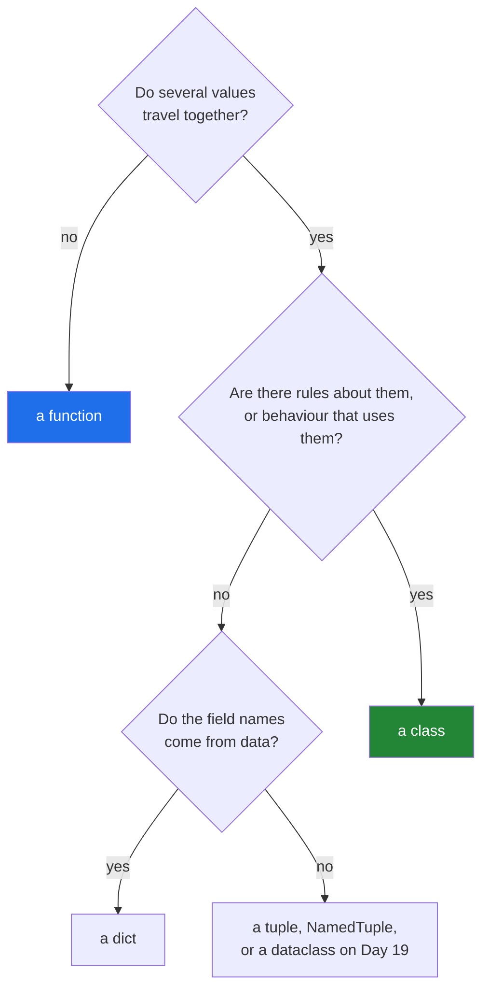

# 3.4 — When not to write a class

## One-line answer

A class earns its place when values and behaviour travel together and there are rules about the
values; without both, a function, a tuple or a dictionary is smaller, faster to read and easier to
throw away.

---

## The story

After the card drawer works, somebody at the library gets enthusiastic.

They propose a card for the coffee machine. It has one line — *last cleaned* — and there is one
machine, so there is one card, and the card lives in a drawer designed for three hundred. To find out
when the machine was cleaned you open a drawer, find the only card in it, and read the one line.
Everybody agrees this is worse than a sticky note on the machine.

Then they propose cards for the opening hours. Nine cards, one per day, each with one line. Somebody
points out that the hours are already on a poster in the window, that the poster is one thing rather
than nine, and that nobody would ever want to look up Tuesday without also seeing Wednesday.

The card system is good. It is good for books, because a book has several facts that belong together
and rules about them — a book without a title cannot be shelved, two cards can describe one book. It
is not good for a machine with one date on it or for a list that is really one list.

The three cards that were always right:

```text
Title:  The Kitchen Table    Title:  Weeknight Bread    Title:  The Kitchen Table
Year:   2019                 Year:   2021               Year:   2019
Source: donated              Source: bought             Source: bought
```

---

## The idea in plain language

Everything in this day has been an argument for classes. This document is the other half, and it is
not a caveat — it is most of the judgement.

**A class earns its place when two things are true at once:**

1. **Several values belong together and travel together.** They are passed to the same functions,
   returned from the same functions, and stored side by side.
2. **There are rules about those values, or behaviour that uses them.** An invariant to enforce
   ([3.2](3.2-validation-in-init.md)), an identity rule
   ([2.4](../02-attribute-lookup/2.4-your-object-and-equality.md)), or a method every user wants
   ([3.3](3.3-method-or-function-beside-it.md)).

With both, a class is clearly right. With neither, it is clearly wrong. With one, it is a judgement,
and the useful tiebreaker is: **will this type be imported by more than one module?** If yes, the type
is a shared vocabulary and worth having. If no, it is scaffolding.

Here is what to reach for instead, in increasing order of ceremony:

| Instead of a class | When |
|---|---|
| a plain function | there is no state at all — the "class" has one method and no fields |
| a tuple | a fixed, small group of values, positional, never named at the call site |
| a `NamedTuple` | the same, but the fields deserve names and nothing may change |
| a `dict` | the keys are data — they came from a file, a header row, an API response |
| a `dataclass` (Day 19) | a record with named fields and no hand-written `__init__` |
| a class | there are invariants, behaviour, or an identity rule |

Three shapes are worth recognising by name, because each one is a class that should not be:

- **The class with one method and no state.** `class Cleaner: def clean(self, text): ...` used as
  `Cleaner().clean(x)`. That is `clean(x)` with extra steps, and Day 10 already taught the function
  version.
- **The class whose fields are never read together.** Half the methods use `title` and half use
  `raw_bytes`, and no method uses both. That is two types sharing a name, and it will grow a third.
- **The class built to hold a function's local variables.** Written to avoid passing four arguments,
  and now the four values have a lifetime nobody intended.

One more thing worth saying plainly, because it is where enthusiasm usually lands: **a class is not
how you organise code in Python.** Modules organise code. A file of related functions is a perfectly
good unit, it is the unit `textutils.py` already is
([Day 10, 3.1](../../../day-10-functions/parts/03-the-module/3.1-from-notebook-to-module.md)), and it
needs no class around it to be respectable.

---

## Why Setu needs it

- **Phase 2 is eight days of advanced Python**, and the risk of eight days on classes, inheritance,
  decorators and dunder methods is a codebase where everything is a class. This document is the
  counterweight, written on the day the enthusiasm starts.
- **Day 19's dataclasses remove most of the reason to hand-write a record class.** Knowing today that
  `Paper` is a class because of its *invariants* rather than because it has fields is what makes that
  day a simplification rather than a rewrite.
- **`textutils.py` is ten functions and no class**
  ([Day 11, 4.1](../../../day-11-iterators-and-generators/parts/04-the-gate/4.1-ten-functions-fully-tested.md)),
  and it is the module the whole of Phase 1 was measured against. It is the counter-example this
  project already contains.
- **Day 23's agent state and Day 192's graph state are both classes with invariants**, and the reason
  they are classes rather than dictionaries is exactly rule 2. Being able to say why is the point.

---

## The mechanism

The class that should be a function:

```python
"""One method, no state. The class is doing nothing."""


class TitleCleaner:
    """A class that holds no values and answers one question."""

    def clean(self, raw):
        return " ".join(raw.split()).removesuffix(".")


def clean_title(raw):
    """The same thing, without the ceremony."""
    return " ".join(raw.split()).removesuffix(".")


raw = "  The   Kitchen Table.  "

print("class   :", repr(TitleCleaner().clean(raw)))
print("function:", repr(clean_title(raw)))
print("class instances needed:", 1, "| function instances needed:", 0)
```

Run on Python 3.12.12 on 2026-09-01:

```
class   : 'The Kitchen Table'
function: 'The Kitchen Table'
class instances needed: 1 | function instances needed: 0
```

**Line by line:**

- `class TitleCleaner:` with no `__init__` — **there is no state.** Nothing is stored, so every
  instance is identical and interchangeable, which means the instance carries no information.
- `TitleCleaner().clean(raw)` — the object is built and thrown away on the same line. Whenever you see
  that pattern, the class is a namespace and the function was the answer.
- `def clean_title(raw):` — the same body, one fewer concept, importable, testable with one line,
  and greppable by name.
- The two printed results are identical, because the code is identical. **The difference is entirely
  in what a reader has to hold in their head.**
- The one legitimate version of this shape is when the object holds *configuration* — a cleaner
  constructed with options and then used many times. If `TitleCleaner(collapse_spaces=False)` is a
  thing you want, the class has state and rule 1 is satisfied.

The three alternatives, measured:

```python
"""Two hundred thousand small records, three ways."""

import tracemalloc


class Point:
    def __init__(self, x, y):
        self.x = x
        self.y = y


for label, build in [
    ("class", lambda: [Point(1, 2) for _ in range(200_000)]),
    ("dict", lambda: [{"x": 1, "y": 2} for _ in range(200_000)]),
    ("tuple", lambda: [(1, 2) for _ in range(200_000)]),
]:
    tracemalloc.start()
    records = build()
    print(f"{label:6} peak MB: {tracemalloc.get_traced_memory()[1] / 1048576:.1f}")
    tracemalloc.stop()
    del records
```

Run on Python 3.12.12 on 2026-09-01:

```
class  peak MB: 16.8
dict   peak MB: 36.6
tuple  peak MB: 1.5
```

**Line by line:**

- `lambda: [...]` in the list of pairs — a lambda as an argument, used once, never named
  ([Day 11, 3.3](../../../day-11-iterators-and-generators/parts/03-lambda-and-map/3.3-where-a-lambda-hurts.md)).
  It defers the building so the measurement can start first.
- **The class is cheaper than the dictionary**, at 16.8 MB against 36.6 MB, which surprises most
  people. Instances of one class share their attribute-name storage; two hundred thousand separate
  dictionaries each carry their own keys. So "use a dict, it is lighter" is simply false at this
  scale.
- **The tuple is an order of magnitude below both**, at 1.5 MB, because `(1, 2)` for small integers
  is nearly free and Python reuses the small-integer objects
  ([Day 4, 3.2](../../../day-04-objects/parts/03-identity-trap/3.2-is-versus-equals.md)). A tuple
  gives up field names, and for two positional numbers that may be an acceptable trade.
- `del records` at the end of each iteration, so the next measurement starts clean
  ([Day 11, 2.2](../../../day-11-iterators-and-generators/parts/02-generators/2.2-a-list-against-a-generator.md)).
- **The point is not that one wins.** It is that the memory argument does not decide this, so the
  decision has to be made on the two rules — values that travel together, and rules about them.

The test that tells you which you have:

```python
"""Two questions, answered honestly, for anything you are about to make a class."""

CANDIDATES = [
    ("Paper", "several fields, passed everywhere", "title must not be empty; identity by DOI"),
    ("TitleCleaner", "no fields at all", "none - it is one function"),
    ("CsvRow", "fields come from the header row", "none - the keys are data, use a dict"),
    ("RetryPolicy", "attempts, delay, jitter", "attempts >= 1; delay > 0"),
]

for name, travel_together, rules in CANDIDATES:
    verdict = (
        "class" if rules != "none - it is one function" and "none" not in rules else "not a class"
    )
    print(f"{name:14} {verdict:12} values: {travel_together:34} rules: {rules}")
```

**Line by line:**

- Four candidates, each with the two rules stated as data: what values travel together, and what rules
  exist about them.
- `Paper` has both, so it is a class — and note that the *rules* column, not the fields column, is
  what settles it.
- `TitleCleaner` has no fields, so rule 1 fails immediately and rule 2 never gets asked.
- `CsvRow` has fields, and they come from a header row — **the keys are data**, so tomorrow's file has
  different ones and a class would need rewriting. A dictionary is correct here, and it is correct for
  a reason rather than out of laziness.
- `RetryPolicy` has three fields and two invariants, so it is a class even though it has no methods at
  all. That is the case people get wrong in the other direction: a small validated record is a
  perfectly good class.
- The `verdict` line is deliberately crude — it is a printed summary, not a decision procedure. **The
  judgement is the two columns**, and if you find yourself writing rules to automate it you have
  proved this document's point about doing too much.



---

## When it breaks

**The class that is a namespace:**

```text
>>> class Utils:
...     def clean(self, s): return s.strip()
...     def key(self, s): return s.strip().casefold()
...
>>> Utils().clean("  x  ")
'x'
```

**What it means.** No state, two unrelated functions, and every call site has to build an object
first. There is no error and nothing to debug — the cost is that `from setu.utils import Utils` then
`Utils().clean(x)` replaced `from setu.textutils import clean_title` then `clean_title(x)`, and every
reader now wonders what a `Utils` is. A module is already a namespace; that is what modules are for.

**The dictionary that should have been a class:**

```text
>>> paper = {"title": "The Kitchen Table", "yaer": 2019}
>>> paper["year"]
Traceback (most recent call last):
  File "<stdin>", line 1, in <module>
KeyError: 'year'
```

**What it means.** The other direction's failure. A dictionary accepts any key, so a typo is a new
entry ([2.2](../02-attribute-lookup/2.2-setting-attributes-from-outside.md)'s problem with a `KeyError`
instead of an `AttributeError`), and nothing enforces that `title` is present at all. When the same
three keys appear in twelve functions, the keys have become a type and the type should be written
down.

**The class built to avoid passing arguments:**

```text
>>> class Pipeline:
...     def step_one(self):
...         self.rows = load()
...     def step_two(self):
...         self.cleaned = [clean(r) for r in self.rows]
...
>>> p = Pipeline()
>>> p.step_two()
Traceback (most recent call last):
  File "<stdin>", line 1, in <module>
  File "<stdin>", line 5, in step_two
AttributeError: 'Pipeline' object has no attribute 'rows'
```

**What it means.** The methods have a required order and nothing enforces it, so calling them out of
sequence gives an `AttributeError` rather than a clear message. The four values that were being
avoided as parameters have become four attributes with an implicit lifecycle. `cleaned =
[clean(r) for r in load()]` has the ordering built into the expression and cannot be got wrong.

**The class with two personalities:**

```text
$ grep -n "self\." src/setu/record.py | grep -c "self.raw_bytes"
7
$ grep -n "self\." src/setu/record.py | grep -c "self.title"
9
$ grep -n "self\." src/setu/record.py | grep -c "self.raw_bytes.*self.title"
0
```

**What it means.** Sixteen uses across two groups of attributes and **not one method uses both**.
That is two types sharing a name — a `RawDownload` and a `Paper` — and they will keep drifting apart
until somebody splits them. The check is mechanical and worth running on any class that has grown
past a handful of methods.

---

## In production

**The professional instinct is to start with the smallest thing that works and let the type emerge.**
A function; then a function taking four arguments; then, when the same four arguments appear in three
signatures, a type. Types created this way have a clear reason to exist and a short field list, and
they are named after something real rather than after a layer.

**What changes at scale is that a type is an interface, and interfaces are expensive to change.** A
class imported by twenty modules cannot have a field renamed without touching twenty modules and
every test. That cost is worth paying for `Paper`, which is a genuine shared vocabulary, and is not
worth paying for a class one module uses. The rule teams settle on is roughly: types that cross
module boundaries are designed and reviewed; types inside one module can be whatever is convenient
and can change freely.

**The failure that only appears in a mature codebase is the god object.** No single commit created
it. Each addition was reasonable, each author had a good reason, and after two years the type has
forty fields, twenty-three methods, and is imported by everything — so it cannot be split without a
migration. The early warnings are all in this document: a method used by one caller, fields never
read together, methods requiring an order. Noticing them at eight methods is cheap; noticing them at
twenty-three is a project.

**The review comment a senior engineer leaves.** On a new class with three fields and no methods:
*"What is this enforcing? If there are rules — non-empty, positive, one of a set — write them in
`__init__` and I am happy. If it is purely a record, wait for the dataclass work rather than
hand-writing `__init__` and `__repr__`; and if only this module uses it, a `NamedTuple` in this file
is honest about its scope."*

**The interview question.** *"When would you not use a class?"* The answer that lands is a rule, not a
preference: when there is no state, when the values do not travel together, or when the field names
come from data rather than from the design — because a class is a promise about shape and there is
nothing to promise. Adding that Python organises code with modules rather than with classes, and that
a class with one method and no fields is a function, shows you have deleted one rather than only
written them.

---

## Check yourself

```bash
uv run python -c "
import tracemalloc

class Point:
    def __init__(self, x, y): self.x, self.y = x, y

for label, build in [
    ('class', lambda: [Point(1, 2) for _ in range(200_000)]),
    ('dict', lambda: [{'x': 1, 'y': 2} for _ in range(200_000)]),
    ('tuple', lambda: [(1, 2) for _ in range(200_000)]),
]:
    tracemalloc.start()
    records = build()
    print(f'{label:6} peak MB: {tracemalloc.get_traced_memory()[1] / 1048576:.1f}')
    tracemalloc.stop()
    del records
"
```

The class uses less memory than the dictionary. Say why that does **not** settle the question of which
to use, and name the two things that do.

**Answer out loud, without scrolling up:**

> Give the two conditions that together make a class the right choice. Then name three shapes that
> look like classes and are not, and say what each should be instead.

---

**Next:** that is the last document of Day 12. Back to the hub —
[`../../LESSON.md`](../../LESSON.md) §4 — to build `src/setu/paper.py` and the tests that hold it to
every promise in [3.1](3.1-designing-paper.md) and [3.2](3.2-validation-in-init.md).
