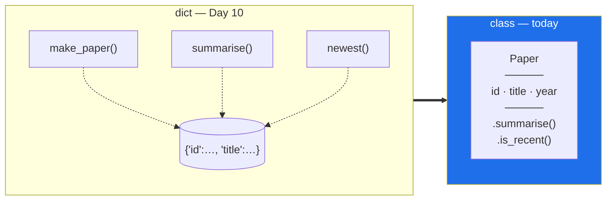

# Day 12 — Classes: building the `Paper` object

**Phase 2 · Module 2 · Advanced Python** · ID: **PY-13** (OOP concepts and class creation)

> **Yesterday:** iterators and generators closed Phase 1. `src/setu/` has nine tested modules.
> **Today:** `Paper` stops being a dict. You will feel exactly what a class buys you, because you
> spent Day 10 living without one.
> **Tomorrow:** inheritance and abstraction — `BaseLoader` → `PDFLoader`, `HTMLLoader`.

```bash
./m start 12 && ./m scaffold 12
```

**Time:** 90 minutes. **Request budget:** 0 model calls.

---

## §1 The story

On Day 10 you built `make_paper()` returning a dict, plus `summarise(paper)` and `newest(papers)`
taking that dict. It works. It is also already showing three cracks:

1. **Nothing stops a bad dict.** `summarise({"foo": 1})` gets a `KeyError` deep inside, at the moment
   of use, far from the moment of the mistake.
2. **The data and the functions that understand it live apart.** Someone reading `papers.py` has to
   read three functions to learn what a paper *is*.
3. **Typos are silent.** `paper["titel"] = "x"` adds a key. No error, no warning, and you find out
   when a title renders empty.

A **class** fixes all three by binding data and behaviour into one named thing:



The vocabulary, once, so the rest of Phase 2 has words to use:

- A **class** is a blueprint. `Paper` is a class.
- An **instance** is a thing built from it. `Paper("p1", "Attention", 2017)` is an instance.
- An **attribute** is data on an instance. `paper.title`.
- A **method** is a function that lives on the class and receives the instance as its first argument.
  That first argument is `self` — by convention, not by rule, but never break the convention.

One warning that matters more here than in most courses: **a class is not automatically better than a
function.** If a thing has no state, it is a function. `slugify` from Day 7 must never become
`Slugifier().slugify()`. Classes earn their place when data and behaviour genuinely belong together —
and `Paper` is a real example, because a paper has a title *and* things it can tell you about itself.

---

## §2 Setup — run this

```bash
mkdir -p days/day-12/lab
touch days/day-12/lab/classes.py
```

`src/setu/papers.py` is rewritten today. **Keep Day 10's functions**; you will delete them at the end
of §5 only after the new tests are green. Never delete working code before its replacement passes.

No new packages.

---

## §3 PY-13 — anatomy of a class

`days/day-12/lab/classes.py`:

```python
"""PY-13: what a class actually is, one piece at a time."""

from __future__ import annotations


class Counter:
    """A minimal class, annotated to death."""

    kind = "counter"                       # CLASS attribute: shared by every instance

    def __init__(self, start: int = 0) -> None:
        self.value = start                 # INSTANCE attribute: one per object
        self._history: list[int] = [start]  # leading _ means "internal, don't touch"

    def bump(self, by: int = 1) -> int:
        """A method: takes self, changes state, returns something useful."""
        self.value += by
        self._history.append(self.value)
        return self.value

    def history(self) -> list[int]:
        return list(self._history)         # a COPY - Day 4


def instances_are_separate() -> None:
    a, b = Counter(), Counter(10)
    a.bump()
    a.bump(5)
    print(f"\n{a.value=} {b.value=}   <- separate instance attributes")
    print(f"{a.kind=} {b.kind=} {Counter.kind=}   <- one shared class attribute")
    print(f"{a.history()=}")


def self_is_just_the_first_argument() -> None:
    c = Counter()
    print(f"\n{c.bump()=}            <- normal call")
    print(f"{Counter.bump(c, 10)=}   <- exactly the same thing, written out")
    print(f"{c.value=}")


def the_class_attribute_trap() -> None:
    class Broken:
        tags: list[str] = []        # shared by EVERY instance - the Day 4 bug, class edition

    class Fixed:
        def __init__(self) -> None:
            self.tags: list[str] = []   # a new list per instance

    x, y = Broken(), Broken()
    x.tags.append("oops")
    print(f"\nBroken: {x.tags=} {y.tags=}   <- y changed and you never touched it")

    p, q = Fixed(), Fixed()
    p.tags.append("fine")
    print(f"Fixed:  {p.tags=} {q.tags=}")


def encapsulation_is_a_convention() -> None:
    c = Counter()
    c.bump()
    print(f"\n{c._history=}   <- Python does not stop you. The underscore is a message.")
    c.value = -999
    print(f"{c.value=}   <- nothing validated this. Day 15 fixes it with @property.")


if __name__ == "__main__":
    instances_are_separate()
    self_is_just_the_first_argument()
    the_class_attribute_trap()
    encapsulation_is_a_convention()
```

**Line by line:**

- `kind = "counter"` at class level — a **class attribute**. One object, shared by every instance and
  by the class itself. Fine for constants.
- `def __init__(self, start: int = 0) -> None:` — the **initialiser**, run after the instance is
  created. It is not a constructor in the C++/Java sense; the object already exists when it runs,
  which is why it returns `None` and not `self`.
- `self.value = start` — an **instance attribute**. Created by assignment; there is no separate
  declaration step. That is why a typo (`self.vlaue`) silently creates a second attribute — Day 19's
  Pydantic model is the eventual fix.
- `self._history` — the leading underscore means *"internal; I may change this without warning."*
  Python does not enforce it. It is a message to a human reader, and it is honoured because breaking
  it is rude, not because it is impossible.
- `return list(self._history)` — hands back a **copy**. Returning `self._history` directly would let a
  caller append to your internals from outside. Day 4's aliasing rule, at object scope.
- `Counter.bump(c, 10)` — identical to `c.bump(10)`. **`self` is not magic**; `c.bump(10)` is sugar
  for "look up `bump` on the class, call it with `c` as the first argument". Once you see that,
  `self` stops being mysterious.
- `class Broken: tags = []` — **the class-attribute trap.** One list, shared by every instance. This
  is the mutable-default bug from Day 4 and Day 10 in its third costume. Mutable state belongs in
  `__init__`, always.
- `c.value = -999` — nothing validated it. Attributes are wide open by default. Day 15's `@property`
  is where that gets a gate.

---

## §4 Build brief — `Paper` becomes a class

Rewrite `src/setu/papers.py`:

```python
"""The Paper record. Day 10 made it a dict; today it is a class; Day 19 makes it a model."""

from __future__ import annotations

from collections.abc import Iterable

from setu.textutils import normalise_whitespace, truncate

MIN_YEAR, MAX_YEAR = 1900, 2100


class InvalidPaper(ValueError):
    """Raised when a Paper is constructed with missing or out-of-range fields."""


class Paper:
    """A single research paper. Validated on construction, never after."""

    def __init__(
        self,
        paper_id: str,
        title: str,
        year: int,
        *,
        authors: Iterable[str] | None = None,
        venue: str | None = None,
    ) -> None:
        """TODO(me): validate, normalise, and store.

        - normalise the title with normalise_whitespace (do NOT reimplement it)
        - raise InvalidPaper if paper_id or the normalised title is blank
        - raise InvalidPaper if year is outside MIN_YEAR..MAX_YEAR
        - self.authors must be a NEW list, never the caller's object
        - store venue as-is (None is allowed)
        """
        raise NotImplementedError

    def summarise(self, width: int = 60) -> str:
        """TODO(me): 'Title (year) - First Author', truncated to `width`. Reuse truncate()."""
        raise NotImplementedError

    def is_recent(self, *, since: int) -> bool:
        """TODO(me): True if self.year >= since."""
        raise NotImplementedError

    def add_author(self, name: str) -> None:
        """TODO(me): append a non-blank author. Raise ValueError on blank. Return None.

        This method MUTATES. Say so here, and never also return self.
        """
        raise NotImplementedError


def newest(papers: Iterable[Paper], n: int = 3) -> list[Paper]:
    """TODO(me): the n most recent by year, ties broken by title A-Z. Must not mutate the input."""
    raise NotImplementedError
```

- `paper_id` rather than `id` — Day 10 used positional-only `id` to hide the builtin shadowing. As a
  keyword-capable parameter, `id` would shadow the builtin at the call site, so the name changes. A
  small rename that removes a whole category of confusion.
- `*` before `authors` — keyword-only, same as Day 10.
- `Iterable[str] | None` — accepts a list, a tuple, a generator. The class stores a list.
- `add_author` mutating and returning `None` — the Day 10 house rule, now as a method contract.

---

## §5 The eval that must be able to fail

Rewrite `tests/test_papers.py`:

```python
import pytest

from setu.papers import InvalidPaper, Paper, newest


def test_title_is_normalised_on_construction():
    assert Paper("p1", "  Attention   Is  All ", 2017).title == "Attention Is All"


@pytest.mark.parametrize(
    ("pid", "title", "year"),
    [("", "T", 2017), ("p1", "   ", 2017), ("p1", "T", 1899), ("p1", "T", 2101)],
)
def test_invalid_construction_raises(pid, title, year):
    with pytest.raises(InvalidPaper):
        Paper(pid, title, year)


def test_authors_default_is_not_shared_between_instances():
    a, b = Paper("p1", "A", 2017), Paper("p2", "B", 2018)
    a.add_author("Vaswani")
    assert b.authors == [], "the default list is shared across instances - see Day 12 §3"


def test_authors_are_copied_from_the_caller():
    mine = ["Vaswani"]
    paper = Paper("p1", "A", 2017, authors=mine)
    mine.append("Someone Else")
    assert paper.authors == ["Vaswani"], "the Paper aliased the caller's list"


def test_authors_accepts_any_iterable():
    paper = Paper("p1", "A", 2017, authors=(n for n in ["X", "Y"]))
    assert paper.authors == ["X", "Y"]


def test_add_author_returns_none_and_mutates():
    paper = Paper("p1", "A", 2017)
    assert paper.add_author("Vaswani") is None, "a mutating method must not also return self"
    assert paper.authors == ["Vaswani"]


def test_add_author_rejects_blank():
    with pytest.raises(ValueError):
        Paper("p1", "A", 2017).add_author("   ")


def test_summarise_respects_width_and_names_the_first_author():
    paper = Paper("p1", "A very long title indeed", 2017, authors=["Vaswani", "Shazeer"])
    out = paper.summarise(width=30)
    assert len(out) <= 30
    assert "Vaswani" in out


def test_summarise_handles_no_authors():
    assert Paper("p1", "A", 2017).summarise()  # must not raise


@pytest.mark.parametrize(("since", "expected"), [(2016, True), (2017, True), (2018, False)])
def test_is_recent_boundary(since, expected):
    assert Paper("p1", "A", 2017).is_recent(since=since) is expected


def test_newest_breaks_ties_alphabetically():
    papers = [Paper("1", "Zebra", 2018), Paper("2", "Alpha", 2018), Paper("3", "Old", 2001)]
    assert [p.title for p in newest(papers, n=2)] == ["Alpha", "Zebra"]


def test_newest_does_not_mutate_the_input():
    papers = [Paper("1", "B", 2018), Paper("2", "A", 2019)]
    order = [p.paper_id for p in papers]
    newest(papers, n=1)
    assert [p.paper_id for p in papers] == order, "did you call .sort() on the caller's list?"
```

**Line by line:**

- `test_authors_default_is_not_shared_between_instances` — the §3 class-attribute trap, as a library
  test. Move `authors` to a class attribute and this goes red immediately.
- `test_authors_accepts_any_iterable` — passes a **generator**. An implementation doing
  `self.authors = authors or []` stores the generator object itself, and the assertion fails with a
  comparison against a generator. Day 11's "consumed once" rule, biting inside a constructor.
- `test_add_author_returns_none_and_mutates` — encodes the mutate-or-return-new rule as an assertion,
  with a message that explains it.
- `test_is_recent_boundary` — three cases around the boundary. `>` instead of `>=` fails the middle
  one. **Every threshold comparison needs its exact-equal case tested.**
- `test_summarise_handles_no_authors` — the empty case that `authors[0]` explodes on.

```bash
uv run python -m pytest tests/test_papers.py -v
```

Twelve tests, all red. Make them green, **then** delete Day 10's `make_paper` and `summarise`
functions and re-run.

---

## §6 Request budget

| Resource | Spent today |
|---|---|
| LLM calls | **0** |

---

## §7 Traps

- **A mutable class attribute** (`tags = []`). Shared by every instance. Put it in `__init__`.
- **Returning an internal container directly.** `return self._history` hands out your insides.
- **Forgetting `self`** on a method parameter list. The error is confusing; the fix is one word.
- **Assuming `_name` is private.** It is a convention. Python will let anyone touch it.
- **Storing an iterable without listing it.** A generator argument works once, then is empty.
- **A method that mutates *and* returns `self`.** The caller cannot tell which contract they got.
- **Making a class for something stateless.** `slugify` is a function. It stays a function.
- **Validating in a method instead of `__init__`.** An object should never exist in an invalid state.
- **Deleting the old implementation before the new tests pass.** Green first, then delete.

---

## §8 Verify before you code

Written **2026-08-21**:

- <https://docs.python.org/3/tutorial/classes.html> — especially the class-vs-instance-variable section.
- <https://docs.python.org/3/reference/datamodel.html#object.__init__> — `__init__` semantics.

---

## §9 Say it in an interview

> "The rule I hold to is that an object should never exist in an invalid state — so all validation is
> in `__init__` and nothing revalidates later. Anything mutable gets built fresh in `__init__` rather
> than sitting as a class attribute, because a class-level list is shared across every instance, which
> is the same shared-default bug as a mutable default argument. And I take iterables in the
> constructor but store a list, because someone passing a generator would otherwise hand me something
> that empties after one read. There's a test for each of those; they're all one-liners and they've
> all caught something."

---

## §10 Done when

Tick [`CHECKLIST.md`](CHECKLIST.md), then `./m check && ./m done 12`.
