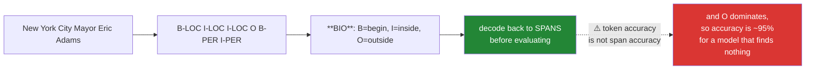

# Day 120 — Named Entity Recognition

**Phase 14 · Module 14** · ID: **NLP-06** (NER, BIO tagging, entity-level evaluation)

> **Yesterday:** POS tagging, and the finding that a lowercased corpus tags badly because
> capitalisation is a learned feature.
> **Today:** the task where that matters most. NER finds people, places and organisations in text —
> and its evaluation is the day's real content, because **token-level accuracy on NER is close to
> meaningless** and almost everyone reports it anyway.
> **Tomorrow:** bag of words and n-grams.

```bash
./m start 120 && ./m scaffold 120
```

**Time:** 110 minutes. **Request budget:** 0 model calls.

---

## §1 The story

NER labels **spans**, not tokens. `New York City` is one entity across three tokens, and getting two
of the three right is not two-thirds correct — it is **wrong**, because the extracted string is not a
place anyone can look up.

The standard encoding turns spans into per-token labels:



**The `O` label dominates.** In typical text, 85–95% of tokens are outside any entity — so a model
predicting `O` for everything scores 90%+ token accuracy while extracting **zero entities**. This is
Day 78's imbalance problem in a new costume, and it is why NER is evaluated at the **entity level**:
precision, recall and F1 over exactly-matching spans.

Three things follow that are specific to this task.

**Capitalisation is the strongest feature and it is fragile.** Day 117 said not to lowercase before
NER; today you measure the cost. And the corollary matters: NER on all-caps headlines, on lowercased
user input, or on transcribed speech performs far worse than the benchmark numbers suggest.

**Entity boundaries are the hard part.** Models rarely confuse a person with a place; they routinely
get `the University of California, Berkeley` off by a token. A **partial match is a miss** under
strict evaluation, and reporting a lenient score without saying so inflates your number.

**NER output is a privacy artifact.** An NER model over customer emails extracts a list of named
people — which is personal data you have now created, in a form far easier to misuse than the original
text. Principle 9 applies, and so does the question of whether you should be running this at all.

---

## §2 Setup — run this

```bash
mkdir -p days/day-120/lab
touch days/day-120/lab/ner.py
```

`src/setu/nlp.py` grows today. spaCy came in on Day 117.

---

## §3 NLP-06 — finding entities

`days/day-120/lab/ner.py`:

```python
"""NLP-06: NER, BIO encoding, and why token accuracy is the wrong metric."""

from __future__ import annotations

from collections import Counter

SENTENCES = [
    "New York City Mayor Eric Adams met Apple CEO Tim Cook on 3 March 2026.",
    "The University of California, Berkeley received $2.5 million from the NSF.",
    "Washington signed the treaty in Washington on behalf of Washington.",
    "apple released ios 26 in cupertino last tuesday.",
]


def what_ner_finds() -> None:
    import spacy

    nlp = spacy.load("en_core_web_sm")

    for sentence in SENTENCES[:3]:
        doc = nlp(sentence)
        print(f"\n  {sentence}")
        for entity in doc.ents:
            print(f"    {entity.text:<32} {entity.label_:<8} "
                  f"chars {entity.start_char}–{entity.end_char}")

    print("\n  Entities are SPANS with a type and a character offset — not tokens.")
    print("  'New York City' is ONE entity across three tokens.")
    print("\n  ⚠️ Note the third sentence: 'Washington' is a person, a place and an")
    print("     organisation in one sentence. The type depends entirely on context,")
    print("     exactly like Day 119's POS ambiguity.")


def bio_encoding() -> None:
    import spacy

    nlp = spacy.load("en_core_web_sm")
    doc = nlp("New York City Mayor Eric Adams met Tim Cook.")

    print(f"\n  {'token':<10} {'BIO':<10} {'entity type'}")
    for token in doc:
        bio = token.ent_iob_ or "O"
        label = f"{bio}-{token.ent_type_}" if token.ent_type_ else "O"
        print(f"  {token.text:<10} {bio:<10} {label}")

    print("\n  B = begin an entity, I = inside one, O = outside any.")
    print("  That encoding turns SPAN labelling into per-token classification, which")
    print("  is what lets a sequence model (Day 119) do the job.")

    print("\n  ⚠️ Two adjacent entities of the same type need the B to separate them:")
    doc = nlp("Tim Cook Satya Nadella spoke.")
    print(f"    {[(t.text, t.ent_iob_, t.ent_type_) for t in doc]}")
    print("     Without the B/I distinction those merge into one entity.")


def o_dominates_and_accuracy_lies() -> None:
    import spacy

    nlp = spacy.load("en_core_web_sm")
    corpus = SENTENCES * 12
    labels = []
    for sentence in corpus:
        for token in nlp(sentence):
            labels.append(f"{token.ent_iob_}-{token.ent_type_}" if token.ent_type_ else "O")

    counts = Counter(labels)
    total = sum(counts.values())
    print(f"\n  label distribution over {total} tokens:")
    for label, count in counts.most_common(6):
        print(f"    {label:<12} {count:>5} ({count / total:.1%})")

    print(f"\n  🚨 a model that predicts 'O' for every token scores "
          f"{counts['O'] / total:.1%} TOKEN ACCURACY")
    print("     and extracts ZERO entities.")

    print("\n  This is Day 78's imbalance problem wearing a new costume, and Day 100's")
    print("  rule applies unchanged: compute the baseline before quoting any metric.")
    print("\n  ⚠️ NER papers report entity-level precision/recall/F1 for this reason.")
    print("     A token-level accuracy on an NER task is a red flag in a write-up.")


def entity_level_evaluation() -> None:
    truth = [
        [("New York City", "LOC"), ("Eric Adams", "PER"), ("Apple", "ORG"),
         ("Tim Cook", "PER")],
        [("University of California, Berkeley", "ORG"), ("NSF", "ORG")],
    ]
    predicted = [
        [("New York City", "LOC"), ("Eric Adams", "PER"), ("Apple", "ORG"),
         ("Cook", "PER")],                                   # boundary error
        [("University of California", "ORG"), ("Berkeley", "LOC"), ("NSF", "ORG")],
    ]

    def score(truth_spans, predicted_spans, *, strict=True):
        tp = fp = fn = 0
        for gold, guess in zip(truth_spans, predicted_spans, strict=True):
            gold_set, guess_set = set(gold), set(guess)
            if strict:
                tp += len(gold_set & guess_set)
                fp += len(guess_set - gold_set)
                fn += len(gold_set - guess_set)
            else:
                matched = set()
                for text, label in guess_set:
                    hit = next((g for g in gold_set if g[1] == label
                                and (text in g[0] or g[0] in text) and g not in matched),
                               None)
                    if hit:
                        tp += 1
                        matched.add(hit)
                    else:
                        fp += 1
                fn += len(gold_set - matched)
        precision = tp / max(tp + fp, 1)
        recall = tp / max(tp + fn, 1)
        f1 = 2 * precision * recall / max(precision + recall, 1e-12)
        return {"tp": tp, "fp": fp, "fn": fn, "precision": precision,
                "recall": recall, "f1": f1}

    print(f"\n  {'scheme':<10} {'TP':>4} {'FP':>4} {'FN':>4} "
          f"{'precision':>11} {'recall':>8} {'F1':>7}")
    for label, strict in (("strict", True), ("lenient", False)):
        result = score(truth, predicted, strict=strict)
        print(f"  {label:<10} {result['tp']:>4} {result['fp']:>4} {result['fn']:>4} "
              f"{result['precision']:>11.4f} {result['recall']:>8.4f} {result['f1']:>7.4f}")

    print("\n  Same predictions, two very different F1 scores.")
    print("\n  STRICT: the span must match EXACTLY. 'Cook' when the truth is 'Tim Cook'")
    print("    is a false positive AND a false negative — it counts twice against you.")
    print("  LENIENT: overlapping spans of the same type count as a match.")
    print("\n  🚨 Neither is wrong; reporting one WITHOUT SAYING WHICH is. A lenient F1")
    print("     quoted as though it were strict is a routine inflation.")


def boundaries_are_the_hard_part() -> None:
    import spacy

    nlp = spacy.load("en_core_web_sm")
    hard = [
        "The University of California, Berkeley won the grant.",
        "Bank of America Merrill Lynch advised the deal.",
        "Dr. Martin Luther King Jr. Boulevard runs north.",
        "The New York Times reported that New York was cold.",
    ]

    print("\n  where models actually fail:")
    for sentence in hard:
        doc = nlp(sentence)
        print(f"\n    {sentence}")
        print(f"      {[(e.text, e.label_) for e in doc.ents]}")

    print("\n  🚨 The errors are almost never 'person tagged as place'. They are")
    print("     BOUNDARY errors — one token too many or too few.")
    print("\n  And under strict evaluation a boundary error is a complete miss, which")
    print("  is why strict F1 is so much lower than intuition suggests.")
    print("\n  ⚠️ Nested and overlapping entities make it worse: 'The New York Times' is")
    print("     an ORG that contains 'New York', a LOC. Most models emit only the")
    print("     outermost, and flat BIO cannot represent both.")


def case_is_the_strongest_feature() -> None:
    import spacy

    nlp = spacy.load("en_core_web_sm")
    original = "Tim Cook visited Apple headquarters in Cupertino last March."

    print(f"\n  {'variant':<14} entities found")
    for label, text in (("original", original),
                        ("lowercased", original.lower()),
                        ("UPPERCASED", original.upper()),
                        ("no periods", original.replace(".", ""))):
        entities = [(e.text, e.label_) for e in nlp(text).ents]
        print(f"  {label:<14} {entities}")

    print("\n  🚨 Lowercasing destroys most of it. Uppercasing does too — the model")
    print("     learned that a capital letter mid-sentence signals an entity, and")
    print("     ALL-CAPS removes that signal just as completely as none.")
    print("\n  Day 117 said do not lowercase before NER, and treated it as BLOCKING")
    print("  rather than a warning. This is the measurement behind that decision.")
    print("\n  ⚠️ Real consequence: NER on chat messages, search queries, transcribed")
    print("     speech or ALL-CAPS headlines performs far below benchmark numbers,")
    print("     and no benchmark warns you.")


def a_gazetteer_baseline() -> None:
    """Dictionary lookup: the baseline a model must beat."""
    gazetteer = {
        "PER": {"Tim Cook", "Eric Adams", "Satya Nadella"},
        "ORG": {"Apple", "Microsoft", "NSF", "Google"},
        "LOC": {"New York City", "Cupertino", "Berkeley", "California"},
    }

    def find(text):
        found = []
        for label, names in gazetteer.items():
            for name in names:
                index = text.find(name)
                if index >= 0:
                    found.append((name, label, index))
        return sorted(found, key=lambda item: item[2])

    print("\n  gazetteer (dictionary) matching:")
    for sentence in SENTENCES[:2]:
        print(f"\n    {sentence}")
        print(f"      {[(t, l) for t, l, _ in find(sentence)]}")

    print("\n  ✅ Perfect precision on names it knows, zero recall on names it does not.")
    print("     For a CLOSED set — your product catalogue, your employee list — a")
    print("     gazetteer beats a model and never hallucinates.")
    print("\n  🚨 But it cannot generalise, it breaks on 'Apple' the fruit, and it needs")
    print("     longest-match handling: 'New York' inside 'New York City'.")
    print("\n  ⚠️ Compute this baseline before training anything. On a closed domain it")
    print("     is often the whole answer (Day 78's rule, applied to NER).")


def ner_output_is_personal_data() -> None:
    print("\n  🚨 the question this day must ask:")
    print("\n  Running NER over customer emails produces a LIST OF NAMED PEOPLE,")
    print("  extracted and structured. You have created personal data in a form far")
    print("  easier to misuse than the original text.")
    print("\n  before running NER over any corpus containing people:")
    print("    - is there a lawful basis, and does extraction change it?")
    print("    - where do the extracted entities go, and who can read them?")
    print("    - is the entity list deleted when the source is?")
    print("    - are you logging entities to MLflow (Day 116) or an error tracker?")
    print("\n  ⚠️ Principle 9: provenance travels with the data — and a derived entity")
    print("     list inherits every restriction the source had, plus new ones.")
    print("\n  Setu's own rule for this project: NER runs on PAPER TEXT (authors,")
    print("  institutions, funders), never on anything a user typed. Record it.")


def when_ner_is_the_wrong_tool() -> None:
    rows = [
        ("a closed, known set", "gazetteer", "perfect precision, no hallucination"),
        ("structured identifiers", "regex", "DOIs, ORCIDs, invoice numbers"),
        ("open-domain people/places", "NER model", "what it is actually for"),
        ("domain-specific types", "fine-tuned NER", "genes, drugs, part numbers"),
        ("relations between entities", "not NER", "that is relation extraction"),
        ("resolving 'Apple' to a company", "not NER", "that is entity LINKING"),
    ]
    print(f"\n  {'if you need…':<30} {'use':<18} {'because'}")
    for need, use, because in rows:
        print(f"  {need:<30} {use:<18} {because}")

    print("\n  ⚠️ The last two are the common confusions. NER tells you 'Apple' is an")
    print("     ORG in this sentence. It does NOT tell you WHICH Apple, and it does")
    print("     not tell you that Tim Cook works there. Both are separate tasks.")


if __name__ == "__main__":
    what_ner_finds()
    bio_encoding()
    o_dominates_and_accuracy_lies()
    entity_level_evaluation()
    boundaries_are_the_hard_part()
    case_is_the_strongest_feature()
    a_gazetteer_baseline()
    ner_output_is_personal_data()
    when_ner_is_the_wrong_tool()
```

**Line by line:**

- `what_ner_finds` — entities are **spans with a type and a character offset**, not tokens. And the
  third sentence is the ambiguity point: `Washington` is a person, a place and an organisation in one
  sentence, decided entirely by context — Day 119's problem in a new task.
- `bio_encoding` — B/I/O turns span labelling into **per-token classification**, which is what lets a
  sequence model do the job. And the adjacent-entity case matters: **without the B/I distinction, two
  consecutive people merge into one entity.**
- `o_dominates_and_accuracy_lies` — **a model predicting `O` everywhere scores 90%+ token accuracy and
  extracts zero entities.** Day 78's imbalance problem in a new costume, and Day 100's rule applies
  unchanged. **A token-level accuracy on an NER task is a red flag in a write-up.**
- `entity_level_evaluation` — **same predictions, two very different F1 scores.** Under strict
  matching, `Cook` when the truth is `Tim Cook` is a false positive *and* a false negative — **it
  counts twice against you.** Neither scheme is wrong; **reporting one without saying which is.**
- `boundaries_are_the_hard_part` — **the errors are almost never "person tagged as place."** They are
  boundary errors, one token too many or too few, and under strict evaluation that is a complete miss.
  And nested entities make it worse: `The New York Times` contains `New York`, and **flat BIO cannot
  represent both.**
- `case_is_the_strongest_feature` — lowercasing destroys most entities, **and so does uppercasing**,
  because the signal is a capital *mid-sentence* and ALL-CAPS removes it just as completely. This is
  the measurement behind Day 117's blocking decision. The real consequence: **chat, search queries and
  transcribed speech all perform far below benchmark, and no benchmark warns you.**
- `a_gazetteer_baseline` — **perfect precision on known names, zero recall on unknown ones.** For a
  closed set — a product catalogue, an employee list — a gazetteer beats a model and never
  hallucinates. Compute it before training anything.
- `ner_output_is_personal_data` — **the question this day must ask.** NER over customer emails creates
  a structured list of named people, easier to misuse than the source text. Four questions, and Setu's
  own recorded rule.
- `when_ner_is_the_wrong_tool` — **the last two rows are the common confusions.** NER says `Apple` is
  an ORG here; it does not say *which* Apple (entity linking) or that Tim Cook works there (relation
  extraction).

---

## §4 Build brief

Extend `src/setu/nlp.py`:

```python
ENTITY_TYPES = {"PER", "ORG", "LOC", "MISC", "DATE", "MONEY"}


def bio_to_spans(tokens, bio_labels) -> dict:
    """TODO(me): decode BIO tags back into spans. PURE.

    {"spans": [(start_index, end_index, text, label)], "invalid": [...]}
    - a B starts a span; an I CONTINUES one of the same type; an O ends it
    - an I-X with no preceding B-X is INVALID BIO — record it in `invalid` and
      treat it as a B, which is what most decoders do; silently dropping it loses
      an entity and silently accepting it can merge two
    - adjacent B-X B-X are TWO spans, not one (§3.2)
    - raise DataError on a length mismatch, naming both
    - raise DataError on a malformed label (not O, not B-/I- prefixed)
    """
    raise NotImplementedError


def spans_to_bio(tokens, spans) -> list[str]:
    """TODO(me): the inverse. PURE.

    - must round-trip: bio_to_spans(spans_to_bio(t, s)) recovers s
    - raise DataError on overlapping spans, naming both — flat BIO cannot represent
      them (§3.5), and silently dropping one is how nested entities disappear
    - raise DataError on a span index outside the token range
    """
    raise NotImplementedError


def entity_scores(truth_spans, predicted_spans, *, scheme: str = "strict") -> dict:
    """TODO(me): §3.4 — entity-level precision, recall and F1.

    {"scheme", "tp", "fp", "fn", "precision", "recall", "f1",
     "by_type": {label: {...}}, "statement"}
    - scheme='strict' requires an EXACT match of text and label
    - scheme='lenient' accepts an overlapping span of the same label, matching each
      gold span at most once — otherwise one prediction can satisfy several
    - a boundary error under 'strict' costs BOTH a false positive and a false
      negative; say so in the docstring, because that is why strict F1 looks low
    - `statement` MUST name the scheme — a lenient F1 quoted as strict is a routine
      inflation (§3.4)
    - raise DataError on an unknown scheme, or a document-count mismatch
    """
    raise NotImplementedError


def token_accuracy_is_misleading(bio_labels) -> dict:
    """TODO(me): §3.3 — the number a model gets for free.

    {"n_tokens", "o_rate", "all_o_accuracy", "entity_token_rate",
     "warning": str}
    - all_o_accuracy is what a model predicting O everywhere would score
    - the warning must say this model extracts ZERO entities, and point at
      entity_scores as the metric to use instead (Day 78's rule)
    - raise DataError on an empty label list
    """
    raise NotImplementedError


def gazetteer_match(text, gazetteer: dict, *, longest_match: bool = True) -> dict:
    """TODO(me): §3.7 — dictionary lookup, the baseline a model must beat.

    {"spans": [(start_char, end_char, text, label)], "n_matched", "warnings": [...]}
    - longest_match=True prefers 'New York City' over 'New York' when both are in
      the gazetteer; without it you emit overlapping nonsense
    - match on WORD BOUNDARIES, or 'Apple' matches inside 'Applecart'
    - WARN when the same surface form appears under two labels — the gazetteer
      cannot disambiguate and will always pick one
    - raise DataError on an unknown label, listing ENTITY_TYPES
    """
    raise NotImplementedError


def case_sensitivity_report(texts, *, extractor) -> dict:
    """TODO(me): §3.6 — how much does this extractor depend on capitalisation?

    {"original_count", "lowercased_count", "uppercased_count",
     "retention_lower", "retention_upper", "is_case_dependent": bool, "warning"}
    - retention is entities found in the variant / entities found in the original
    - is_case_dependent when either retention falls below 0.7
    - the warning must name the deployment risk: chat, search queries and
      transcribed speech (§3.6), not just 'performance may vary'
    - raise DataError on an empty text list
    """
    raise NotImplementedError


def assert_ner_target_is_permitted(*, source: str, contains_people: bool,
                                   destination: str | None) -> None:
    """TODO(me): §3.8 — refuse to extract people from data that should not be mined.

    - contains_people and source in {'user_input', 'customer_email', 'chat'} -> raise
    - contains_people and destination is None -> raise: an extracted entity list
      needs a stated destination with a stated retention (Principle 9)
    - the message must say the derived list inherits the source's restrictions AND
      adds new ones, and must not be phrased as a mere reminder
    - passes for source='paper_text' with a stated destination — Setu's own rule
    """
    raise NotImplementedError
```

- `bio_to_spans` handling **invalid `I-X` without a preceding `B-X`** matters: real taggers emit it,
  and dropping it loses an entity while accepting it can merge two.
- `entity_scores` requiring the **scheme in the statement** is the day's design decision. A lenient F1
  quoted as strict is a routine inflation, and naming it in the output makes that hard to do.
- `assert_ner_target_is_permitted` is the Principle 9 gate. **NER over user text creates personal data
  in a more dangerous form than the source**, and this is a decision that should be deliberate rather
  than incidental.

---

## §5 The eval that must be able to fail

Add to `tests/test_nlp.py`:

```python
from setu.nlp import (
    ENTITY_TYPES,
    assert_ner_target_is_permitted,
    bio_to_spans,
    case_sensitivity_report,
    entity_scores,
    gazetteer_match,
    spans_to_bio,
    token_accuracy_is_misleading,
)


def test_bio_decodes_a_multi_token_entity():
    tokens = ["New", "York", "City", "is", "cold"]
    labels = ["B-LOC", "I-LOC", "I-LOC", "O", "O"]
    result = bio_to_spans(tokens, labels)
    assert result["spans"] == [(0, 3, "New York City", "LOC")]


def test_adjacent_entities_of_the_same_type_stay_separate():
    """Without the B/I distinction they merge into one."""
    tokens = ["Tim", "Cook", "Satya", "Nadella", "spoke"]
    labels = ["B-PER", "I-PER", "B-PER", "I-PER", "O"]
    result = bio_to_spans(tokens, labels)
    assert len(result["spans"]) == 2
    assert result["spans"][0][2] == "Tim Cook"
    assert result["spans"][1][2] == "Satya Nadella"


def test_an_orphan_inside_tag_is_recorded_not_dropped():
    """Real taggers emit invalid BIO; dropping it loses an entity."""
    tokens = ["Mayor", "Adams", "spoke"]
    labels = ["O", "I-PER", "O"]
    result = bio_to_spans(tokens, labels)
    assert result["invalid"]
    assert len(result["spans"]) == 1, "the orphan I should be treated as a B"


def test_a_type_change_mid_entity_starts_a_new_span():
    tokens = ["New", "York", "Times"]
    labels = ["B-LOC", "I-LOC", "I-ORG"]
    result = bio_to_spans(tokens, labels)
    assert len(result["spans"]) == 2


def test_bio_rejects_a_length_mismatch():
    with pytest.raises(DataError) as info:
        bio_to_spans(["a", "b", "c"], ["O", "O"])
    assert "3" in str(info.value) and "2" in str(info.value)


def test_bio_rejects_a_malformed_label():
    with pytest.raises(DataError):
        bio_to_spans(["a"], ["X-PER"])


def test_bio_round_trips():
    tokens = ["New", "York", "Mayor", "Eric", "Adams", "spoke"]
    spans = [(0, 2, "New York", "LOC"), (3, 5, "Eric Adams", "PER")]
    assert bio_to_spans(tokens, spans_to_bio(tokens, spans))["spans"] == spans


def test_overlapping_spans_are_refused():
    """Flat BIO cannot represent them; silently dropping one loses an entity."""
    tokens = ["The", "New", "York", "Times", "reported"]
    with pytest.raises(DataError) as info:
        spans_to_bio(tokens, [(1, 4, "New York Times", "ORG"),
                              (1, 3, "New York", "LOC")])
    assert "New York" in str(info.value)


def test_a_span_outside_the_token_range_raises():
    with pytest.raises(DataError):
        spans_to_bio(["a", "b"], [(0, 5, "a b", "LOC")])


def test_a_boundary_error_costs_twice_under_strict_matching():
    """Today's real assessment: 'Cook' for 'Tim Cook' is FP and FN."""
    truth = [[("Tim Cook", "PER")]]
    predicted = [[("Cook", "PER")]]
    result = entity_scores(truth, predicted, scheme="strict")
    assert result["tp"] == 0
    assert result["fp"] == 1
    assert result["fn"] == 1
    assert result["f1"] == 0.0


def test_lenient_matching_accepts_the_same_boundary_error():
    truth = [[("Tim Cook", "PER")]]
    predicted = [[("Cook", "PER")]]
    result = entity_scores(truth, predicted, scheme="lenient")
    assert result["tp"] == 1
    assert result["f1"] > 0.9


def test_the_two_schemes_give_very_different_scores():
    truth = [[("New York City", "LOC"), ("Tim Cook", "PER")]]
    predicted = [[("New York", "LOC"), ("Cook", "PER")]]
    strict = entity_scores(truth, predicted, scheme="strict")["f1"]
    lenient = entity_scores(truth, predicted, scheme="lenient")["f1"]
    assert lenient > strict + 0.5


def test_the_statement_names_the_scheme():
    """A lenient F1 quoted as strict is a routine inflation."""
    truth = [[("Tim Cook", "PER")]]
    predicted = [[("Tim Cook", "PER")]]
    for scheme in ("strict", "lenient"):
        statement = entity_scores(truth, predicted, scheme=scheme)["statement"].lower()
        assert scheme in statement


def test_lenient_matching_does_not_double_count_a_gold_span():
    """One prediction must not satisfy several gold entities."""
    truth = [[("New York City", "LOC")]]
    predicted = [[("New York", "LOC"), ("York City", "LOC")]]
    result = entity_scores(truth, predicted, scheme="lenient")
    assert result["tp"] == 1
    assert result["fp"] == 1


def test_a_wrong_label_is_never_a_match():
    truth = [[("Apple", "ORG")]]
    predicted = [[("Apple", "LOC")]]
    for scheme in ("strict", "lenient"):
        assert entity_scores(truth, predicted, scheme=scheme)["tp"] == 0


def test_scores_are_broken_down_by_type():
    truth = [[("Tim Cook", "PER"), ("Apple", "ORG")]]
    predicted = [[("Tim Cook", "PER"), ("Google", "ORG")]]
    result = entity_scores(truth, predicted)
    assert result["by_type"]["PER"]["f1"] == pytest.approx(1.0)
    assert result["by_type"]["ORG"]["f1"] == 0.0


def test_a_perfect_prediction_scores_one():
    truth = [[("Tim Cook", "PER")]]
    assert entity_scores(truth, truth)["f1"] == pytest.approx(1.0)


def test_an_unknown_scheme_raises():
    with pytest.raises(DataError):
        entity_scores([[]], [[]], scheme="fuzzy")


def test_predicting_o_everywhere_scores_high_token_accuracy():
    """And extracts zero entities."""
    labels = ["O"] * 92 + ["B-PER", "I-PER", "B-ORG", "O", "B-LOC", "O", "O", "O"]
    result = token_accuracy_is_misleading(labels)
    assert result["all_o_accuracy"] > 0.90
    assert result["warning"]


def test_the_warning_points_at_entity_level_metrics():
    labels = ["O"] * 90 + ["B-PER"] * 10
    warning = token_accuracy_is_misleading(labels)["warning"].lower()
    assert "zero" in warning or "no entit" in warning
    assert "entity" in warning


def test_the_entity_token_rate_is_reported():
    labels = ["O"] * 80 + ["B-PER"] * 20
    result = token_accuracy_is_misleading(labels)
    assert result["entity_token_rate"] == pytest.approx(0.20)


def test_token_accuracy_needs_labels():
    with pytest.raises(DataError):
        token_accuracy_is_misleading([])


def test_the_gazetteer_prefers_the_longest_match():
    """Otherwise you emit overlapping nonsense."""
    gazetteer = {"LOC": {"New York", "New York City"}}
    result = gazetteer_match("I love New York City in June", gazetteer)
    assert any(span[2] == "New York City" for span in result["spans"])
    assert not any(span[2] == "New York" for span in result["spans"])


def test_the_gazetteer_respects_word_boundaries():
    """'Apple' must not match inside 'Applecart'."""
    result = gazetteer_match("the Applecart tipped over", {"ORG": {"Apple"}})
    assert result["n_matched"] == 0


def test_the_gazetteer_has_perfect_precision_on_known_names():
    gazetteer = {"PER": {"Tim Cook"}, "ORG": {"Apple"}}
    result = gazetteer_match("Tim Cook runs Apple", gazetteer)
    assert result["n_matched"] == 2


def test_the_gazetteer_has_zero_recall_on_unknown_names():
    """Which is exactly its limitation."""
    result = gazetteer_match("Satya Nadella runs Microsoft", {"PER": {"Tim Cook"}})
    assert result["n_matched"] == 0


def test_an_ambiguous_gazetteer_entry_is_warned_about():
    gazetteer = {"ORG": {"Washington"}, "LOC": {"Washington"}}
    result = gazetteer_match("Washington is cold", gazetteer)
    assert result["warnings"]


def test_an_unknown_entity_type_lists_the_known_ones():
    with pytest.raises(DataError) as info:
        gazetteer_match("text", {"WOMBAT": {"x"}})
    assert any(name in str(info.value) for name in ENTITY_TYPES)


def test_a_case_dependent_extractor_is_flagged():
    """Day 117's blocking decision, measured."""
    import spacy

    nlp = spacy.load("en_core_web_sm")
    texts = ["Tim Cook visited Apple in Cupertino.",
             "Satya Nadella met Sundar Pichai in Seattle.",
             "Angela Merkel spoke in Berlin last March."]
    result = case_sensitivity_report(
        texts, extractor=lambda t: [(e.text, e.label_) for e in nlp(t).ents]
    )
    assert result["retention_lower"] < 0.7
    assert result["is_case_dependent"] is True


def test_the_case_warning_names_the_deployment_risk():
    """'Performance may vary' is not a warning."""
    import spacy

    nlp = spacy.load("en_core_web_sm")
    result = case_sensitivity_report(
        ["Tim Cook visited Apple in Cupertino."] * 3,
        extractor=lambda t: [(e.text, e.label_) for e in nlp(t).ents],
    )
    if result["warning"]:
        warning = result["warning"].lower()
        assert any(risk in warning for risk in ("chat", "search", "speech", "query"))


def test_a_case_insensitive_extractor_is_not_flagged():
    """A checker that always fires is useless."""
    result = case_sensitivity_report(
        ["anything at all", "another line"],
        extractor=lambda t: [("x", "MISC")],
    )
    assert result["is_case_dependent"] is False


def test_case_report_needs_texts():
    with pytest.raises(DataError):
        case_sensitivity_report([], extractor=lambda t: [])


def test_extracting_people_from_user_input_is_refused():
    """NER output is personal data in a more dangerous form (Principle 9)."""
    with pytest.raises(DataError) as info:
        assert_ner_target_is_permitted(source="customer_email", contains_people=True,
                                       destination="postgres")
    message = str(info.value).lower()
    assert "personal" in message or "restrict" in message


def test_an_extracted_person_list_needs_a_destination():
    with pytest.raises(DataError) as info:
        assert_ner_target_is_permitted(source="paper_text", contains_people=True,
                                       destination=None)
    assert "destination" in str(info.value).lower() or "retention" in str(info.value).lower()


def test_setus_own_rule_passes():
    assert_ner_target_is_permitted(source="paper_text", contains_people=True,
                                   destination="postgres.authors, deleted with source")


def test_non_person_extraction_is_unrestricted():
    assert_ner_target_is_permitted(source="chat", contains_people=False,
                                   destination=None)
```

**Line by line:**

- `test_a_boundary_error_costs_twice_under_strict_matching` — **the day's real assessment.** `Cook` for
  `Tim Cook` gives `tp=0, fp=1, fn=1` and an F1 of exactly zero. **It counts twice against you**, which
  is precisely why strict F1 is so much lower than intuition suggests.
- `test_lenient_matching_accepts_the_same_boundary_error` with
  `test_the_two_schemes_give_very_different_scores` — same predictions, F1 differing by more than 0.5.
  **Neither scheme is wrong; reporting one without saying which is**, which
  `test_the_statement_names_the_scheme` enforces.
- `test_lenient_matching_does_not_double_count_a_gold_span` — two overlapping predictions must not both
  match one gold entity. Without that constraint lenient scoring can exceed 100% recall.
- `test_predicting_o_everywhere_scores_high_token_accuracy` — over 90% accuracy, zero entities. **Day
  78's rule in a new domain**, and the warning must point at entity-level metrics rather than just
  noting the imbalance.
- `test_an_orphan_inside_tag_is_recorded_not_dropped` — real taggers emit invalid BIO. **Dropping it
  loses an entity; accepting it blindly can merge two**, so it must be recorded and treated as a `B`.
- `test_overlapping_spans_are_refused` — **flat BIO cannot represent nested entities**, and silently
  dropping one is how `New York` inside `The New York Times` disappears without trace.
- `test_a_case_dependent_extractor_is_flagged` — retention below 0.7 when lowercased. **This is the
  measurement behind Day 117's blocking decision**, and the paired
  `test_a_case_insensitive_extractor_is_not_flagged` stops it always firing.
- `test_the_case_warning_names_the_deployment_risk` — the warning must name chat, search or speech.
  **"Performance may vary" is not a warning**; naming where it will actually break is.
- `test_extracting_people_from_user_input_is_refused` — Principle 9 as a gate. **NER over customer
  email creates a structured list of named people**, and that should be a deliberate decision.

```bash
uv run python -m pytest tests/test_nlp.py -v
```

---

## §6 Request budget

| Resource | Spent today |
|---|---|
| LLM calls | **0** |
| Network | none beyond Day 117's spaCy model |

---

## §7 Traps

- **Token accuracy on NER.** ~90% for a model that finds nothing.
- **Reporting F1 without the matching scheme.** Lenient quoted as strict inflates it.
- **Forgetting a boundary error counts twice.** FP *and* FN under strict matching.
- **Lowercasing before NER.** Destroys the strongest feature (Day 117).
- **Assuming ALL-CAPS is safe.** It removes the signal just as completely.
- **Flat BIO for nested entities.** It cannot represent them.
- **Dropping orphan `I-` tags.** Real taggers emit them; you lose entities.
- **Merging adjacent same-type entities.** The `B` is what separates them.
- **A gazetteer without longest-match.** `New York` inside `New York City`.
- **A gazetteer without word boundaries.** `Apple` matches `Applecart`.
- **Skipping the gazetteer baseline.** On a closed domain it may be the whole answer.
- **Confusing NER with entity linking or relation extraction.** Different tasks.
- **Extracting people without asking whether you should.** Principle 9.

---

## §8 Verify before you code

Written **2026-08-21**:

- <https://spacy.io/usage/linguistic-features#named-entities> — `doc.ents`, the label set, and
  character offsets.
- <https://spacy.io/api/scorer> — spaCy's own entity scorer and what "exact match" means to it.
- <https://github.com/chakki-works/seqeval> — the standard entity-level scorer, and its strict/lenient
  modes.
- <https://www.nltk.org/book/ch07.html> — chunking and IOB tagging, for the encoding's history.

---

## §9 Say it in an interview

> "The thing people get wrong about NER is the evaluation. It labels *spans*, not tokens, and the O
> label dominates — eighty-five to ninety-five per cent of tokens are outside any entity — so a model
> that predicts O everywhere scores above ninety per cent token accuracy and extracts nothing. That's
> the imbalance problem again, and it's why NER is scored at the entity level with precision, recall
> and F1. Within that there's a second choice that gets hidden: strict matching requires the span to
> match exactly, so predicting 'Cook' when the truth is 'Tim Cook' is a false positive *and* a false
> negative — it counts twice against you — while lenient matching accepts the overlap. The two give
> very different numbers on identical predictions, so quoting one without naming the scheme is a
> routine inflation. And boundary errors are where models actually fail; they almost never confuse a
> person with a place. One more thing I'd raise: running NER over customer text produces a structured
> list of named people, which is personal data in a form far easier to misuse than the original — so
> that should be a deliberate decision with a stated destination, not something that happens
> incidentally."

---

## §10 Done when

Tick [`CHECKLIST.md`](CHECKLIST.md), then `./m check && ./m done 120`.
