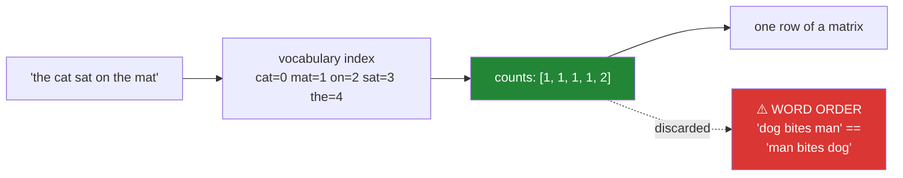

# Day 121 — One-hot, Bag of Words, and n-grams

**Phase 14 · Module 14** · IDs: **NLP-07** (one-hot and bag of words), **NLP-08** (n-grams)

> **Yesterday:** NER, and evaluation at the entity level.
> **Today:** the step Day 117 promised — **text becomes a matrix**. Bag of words is the oldest text
> representation there is, and it works far better than it has any right to. Its one catastrophic
> limitation is that it discards word order entirely, and n-grams are the patch that partly recovers
> it at exponential cost.
> **Tomorrow:** TF-IDF from scratch.

```bash
./m start 121 && ./m scaffold 121
```

**Time:** 110 minutes. **Request budget:** 0 model calls.

---

## §1 The story

A model needs a fixed-length numeric vector per document. Text is a variable-length sequence of
tokens. Bag of words bridges that by **counting**:



**Every document becomes a vector of length `|V|`**, and `|V|` is decided by Day 117's normalisation
choices. That is the connection worth holding: a decision about lowercasing changes your feature
count.

Three properties dominate the practical work.

**The matrix is extremely sparse.** A 20,000-word vocabulary and 80-word documents means about 99.6%
of entries are zero. Storing that densely at 100,000 documents costs 16 GB; sparse storage costs
about 60 MB. **Calling `.toarray()` on a text matrix is the classic way to exhaust memory**, and it
happens because everything looks fine on a 500-document sample.

**Word order is gone, and it matters.** `dog bites man` and `man bites dog` produce **identical**
vectors. So do `not good` and `good not`. Day 87 found the stopword half of the negation problem; this
is the other half, and it survives even with a perfect stopword list.

**N-grams partly fix it, at exponential cost.** Bigrams capture `not good` as one feature — and the
feature count explodes. Unigrams on a modest corpus might give 20,000 features; adding bigrams often
gives 200,000+, most of which appear once. `min_df` is what makes it tractable, and choosing it is a
real decision rather than a default.

And the leak this day must prevent: **the vocabulary is fitted.** `CountVectorizer.fit` learns which
words exist, and fitting it on all your data before splitting leaks test-set vocabulary into training —
Day 83's rule, in the one place people forget it because a vectoriser does not feel like a model.

---

## §2 Setup — run this

```bash
mkdir -p days/day-121/lab
touch days/day-121/lab/bow.py
```

`src/setu/nlp.py` grows today. No new packages.

---

## §3 NLP-07 / NLP-08 — counting

`days/day-121/lab/bow.py`:

```python
"""NLP-07/08: bag of words, sparsity, and what n-grams buy."""

from __future__ import annotations

import sys
from collections import Counter

import numpy as np
from sklearn.feature_extraction.text import CountVectorizer

CORPUS = [
    "the cat sat on the mat",
    "the dog sat on the log",
    "the cat and the dog",
    "a dog bites a man",
    "a man bites a dog",
]


def one_hot_first() -> None:
    vocabulary = sorted({w for d in CORPUS for w in d.split()})
    index = {word: i for i, word in enumerate(vocabulary)}

    print(f"\n  vocabulary ({len(vocabulary)}): {vocabulary}")
    print(f"\n  one-hot vectors for single WORDS:")
    for word in ("cat", "dog", "the"):
        vector = np.zeros(len(vocabulary), dtype=int)
        vector[index[word]] = 1
        print(f"    {word:<6} {vector.tolist()}")

    print("\n  Every word is equidistant from every other: the distance between 'cat'")
    print("  and 'dog' is exactly the distance between 'cat' and 'the'.")
    print("\n  🚨 One-hot encodes IDENTITY and nothing else. There is no notion of")
    print("     similarity — which is precisely the gap Day 123's word vectors fill.")


def bag_of_words_from_scratch() -> None:
    vocabulary = sorted({w for d in CORPUS for w in d.split()})
    index = {word: i for i, word in enumerate(vocabulary)}

    matrix = np.zeros((len(CORPUS), len(vocabulary)), dtype=int)
    for row, document in enumerate(CORPUS):
        for word, count in Counter(document.split()).items():
            matrix[row, index[word]] = count

    print(f"\n  {'':<24} {' '.join(f'{w[:4]:>4}' for w in vocabulary)}")
    for document, row in zip(CORPUS, matrix, strict=True):
        print(f"  {document:<24} {' '.join(f'{v:>4}' for v in row)}")

    library = CountVectorizer(token_pattern=r"\S+").fit_transform(CORPUS)
    print(f"\n  matches sklearn: {np.array_equal(matrix, library.toarray())}")

    print("\n  A document is now a fixed-length vector of counts. That is the whole idea,")
    print("  and it is the oldest text representation there is.")
    print("\n  ⚠️ Note the length: |V| = "
          f"{len(vocabulary)}, decided entirely by Day 117's normalisation choices.")


def word_order_is_gone() -> None:
    vectoriser = CountVectorizer(token_pattern=r"\S+")
    matrix = vectoriser.fit_transform(["a dog bites a man", "a man bites a dog"]).toarray()

    print(f"\n  'a dog bites a man' -> {matrix[0].tolist()}")
    print(f"  'a man bites a dog' -> {matrix[1].tolist()}")
    print(f"  identical? {np.array_equal(matrix[0], matrix[1])}")

    pairs = [("this is not good", "this is good not"),
             ("i never said he stole it", "he never said i stole it")]
    for a, b in pairs:
        rows = CountVectorizer(token_pattern=r"\S+").fit_transform([a, b]).toarray()
        print(f"\n  {a!r}")
        print(f"  {b!r}")
        print(f"    identical vectors? {np.array_equal(rows[0], rows[1])}")

    print("\n  🚨 Bag of words CANNOT distinguish these. No model downstream can either,")
    print("     because the information was destroyed before the model saw anything.")
    print("\n  Day 87 found the stopword half of the negation problem. This is the other")
    print("  half, and it survives even with a perfect stopword list — 'not good' and")
    print("  'good not' are the same bag.")


def sparsity_is_the_practical_fact() -> None:
    rng = np.random.default_rng(0)
    vocabulary_size, n_documents, doc_length = 20_000, 100_000, 80

    nonzero_per_doc = doc_length * 0.7          # repeated words
    density = nonzero_per_doc / vocabulary_size

    dense_bytes = n_documents * vocabulary_size * 8
    sparse_bytes = n_documents * nonzero_per_doc * 12      # value + index overhead

    print(f"\n  {n_documents:,} documents x {vocabulary_size:,} vocabulary:")
    print(f"    density        : {density:.4%}")
    print(f"    zeros          : {1 - density:.2%}")
    print(f"    dense (float64): {dense_bytes / 1e9:>8.1f} GB")
    print(f"    sparse (CSR)   : {sparse_bytes / 1e6:>8.1f} MB")
    print(f"    ratio          : {dense_bytes / sparse_bytes:>8.0f}x")

    small = CountVectorizer().fit_transform(CORPUS)
    print(f"\n  the toy corpus as scipy sparse: {type(small).__name__}, "
          f"{small.nnz} stored values of {small.shape[0] * small.shape[1]}")
    print(f"    sparse object   : {sys.getsizeof(small)} bytes (excluding buffers)")
    print(f"    dense array     : {small.toarray().nbytes} bytes")

    print("\n  🚨 `.toarray()` on a real text matrix is the classic way to exhaust")
    print("     memory — and it happens because everything works fine on a 500-document")
    print("     sample and dies on the full corpus.")
    print("\n  ⚠️ Keep it sparse end to end. LogisticRegression, LinearSVC and the")
    print("     naive Bayes family all accept sparse input directly; tree ensembles")
    print("     mostly do not, which is a real reason to prefer linear models here.")


def n_grams_recover_some_order() -> None:
    documents = ["this movie is not good", "this movie is good",
                 "this movie is not bad", "this movie is bad"]

    print(f"\n  {'ngram_range':<14} {'features':>9}  sample")
    for label, ngram_range in (("(1,1) unigram", (1, 1)), ("(1,2) +bigram", (1, 2)),
                               ("(1,3) +trigram", (1, 3)), ("(2,2) bigram only", (2, 2))):
        vectoriser = CountVectorizer(ngram_range=ngram_range).fit(documents)
        names = vectoriser.get_feature_names_out()
        print(f"  {label:<14} {len(names):>9}  {list(names[:4])}")

    unigram = CountVectorizer(ngram_range=(1, 1)).fit_transform(documents).toarray()
    bigram = CountVectorizer(ngram_range=(1, 2)).fit_transform(documents).toarray()

    print(f"\n  can the representation separate 'not good' from 'good'?")
    print(f"    unigram : rows 0 and 1 differ in {int((unigram[0] != unigram[1]).sum())} position(s)")
    print(f"    bigram  : rows 0 and 1 differ in {int((bigram[0] != bigram[1]).sum())} position(s)")

    features = CountVectorizer(ngram_range=(1, 2)).fit(documents).get_feature_names_out()
    print(f"\n  the bigram that does the work: "
          f"{[f for f in features if f == 'not good']}")

    print("\n  ✅ 'not good' becomes ITS OWN FEATURE. That is the principled fix for")
    print("     Day 87's negation problem — better than any stopword list, because it")
    print("     captures the phrase rather than protecting a word.")


def the_feature_explosion() -> None:
    rng = np.random.default_rng(1)
    vocabulary = [f"w{i}" for i in range(600)]
    documents = [" ".join(rng.choice(vocabulary, 60)) for _ in range(1_500)]

    print(f"\n  {len(documents):,} documents, {len(vocabulary)} word vocabulary:")
    print(f"\n  {'ngram_range':<12} {'min_df=1':>10} {'min_df=2':>10} {'min_df=5':>10}")
    for ngram_range in ((1, 1), (1, 2), (1, 3)):
        row = []
        for min_df in (1, 2, 5):
            n = len(CountVectorizer(ngram_range=ngram_range,
                                    min_df=min_df).fit(documents).get_feature_names_out())
            row.append(n)
        print(f"  {str(ngram_range):<12} {row[0]:>10,} {row[1]:>10,} {row[2]:>10,}")

    print("\n  🚨 Adding bigrams multiplies the feature count by roughly the average")
    print("     document length. Trigrams multiply it again.")
    print("\n  ✅ And look at the min_df columns: most n-grams occur ONCE. `min_df=2`")
    print("     removes them almost for free, because a feature appearing in one")
    print("     document cannot generalise (it is memorisation, Day 96).")
    print("\n  ⚠️ min_df is a real decision, not a default. Too high and you lose rare")
    print("     but decisive terms — a product name, a drug, an error code.")


def binary_counts_and_sublinear_scaling() -> None:
    documents = ["good good good good film", "good film", "bad film"]

    count = CountVectorizer().fit_transform(documents).toarray()
    binary = CountVectorizer(binary=True).fit_transform(documents).toarray()

    print(f"\n  {'representation':<12} {'doc 0 (good x4)':>18} {'doc 1 (good x1)':>18}")
    print(f"  {'count':<12} {str(count[0].tolist()):>18} {str(count[1].tolist()):>18}")
    print(f"  {'binary':<12} {str(binary[0].tolist()):>18} {str(binary[1].tolist()):>18}")

    print("\n  Is a review saying 'good' four times four times as positive?")
    print("  Usually not — the second mention adds far less than the first.")

    print(f"\n  {'count':<10} {'log(1+count)':>14}")
    for value in (1, 2, 4, 10, 100):
        print(f"  {value:<10} {np.log1p(value):>14.4f}")

    print("\n  ✅ BINARY presence often matches or beats raw counts for classification,")
    print("     especially on short documents — and it is what Bernoulli naive Bayes")
    print("     (Day 102) expects.")
    print("\n  ✅ Sublinear scaling — log(1+count) — is the middle ground, and it is")
    print("     exactly what tomorrow's TF-IDF uses for term frequency.")


def the_vocabulary_is_fitted() -> None:
    from sklearn.model_selection import train_test_split

    train_documents = ["good film", "bad film", "great movie", "terrible movie"]
    test_documents = ["excellent film", "awful cinema"]

    wrong = CountVectorizer().fit(train_documents + test_documents)
    right = CountVectorizer().fit(train_documents)

    print(f"\n  fitted on train + test: {sorted(wrong.get_feature_names_out())}")
    print(f"  fitted on train only  : {sorted(right.get_feature_names_out())}")

    print(f"\n  'excellent' in the wrong vocabulary? "
          f"{'excellent' in wrong.get_feature_names_out()}")
    print(f"  'excellent' in the right vocabulary? "
          f"{'excellent' in right.get_feature_names_out()}")

    transformed = right.transform(test_documents).toarray()
    print(f"\n  test documents through the CORRECT vectoriser:")
    for document, row in zip(test_documents, transformed, strict=True):
        print(f"    {document:<20} {row.tolist()}  (unseen words -> dropped)")

    print("\n  🚨 `fit` LEARNS the vocabulary. Fitting on all your data before splitting")
    print("     leaks test-set vocabulary into training — Day 83's rule.")
    print("\n  ⚠️ And this is the place people forget it, because a vectoriser does not")
    print("     feel like a model. It is a fitted transform exactly like a scaler")
    print("     (Day 80) or a PCA (Day 86).")
    print("\n  Note what happens to unseen words: they are silently DROPPED. A test")
    print("  document of entirely new vocabulary becomes an all-zero row.")


def out_of_vocabulary_is_silent() -> None:
    vectoriser = CountVectorizer().fit(["good film", "bad film"])
    documents = ["good film", "excellent cinema", "wonderful superb magnificent"]

    matrix = vectoriser.transform(documents).toarray()
    print(f"\n  vocabulary: {sorted(vectoriser.get_feature_names_out())}")
    print(f"\n  {'document':<34} {'vector':<14} {'nonzero'}")
    for document, row in zip(documents, matrix, strict=True):
        print(f"  {document:<34} {str(row.tolist()):<14} {int(row.sum())}")

    print("\n  🚨 The third document is ALL ZEROS. Every word was out of vocabulary,")
    print("     and nothing raised, warned or logged.")
    print("\n  A model will happily predict something for an all-zero row — usually the")
    print("  majority class — and you will never know the input was unreadable.")
    print("\n  ⚠️ Monitor the OOV rate in production. A rising OOV rate is one of the")
    print("     earliest signals of distribution drift, and it needs no labels (Day 119).")


def when_bag_of_words_is_enough() -> None:
    rows = [
        ("topic classification", "yes", "content words carry it; order barely matters"),
        ("spam detection", "yes", "keyword presence dominates"),
        ("sentiment", "with bigrams", "negation needs 'not good' as a feature"),
        ("authorship", "yes, plus POS n-grams", "function-word rates ARE the signal"),
        ("question answering", "no", "order and structure are the task"),
        ("translation", "no", "obviously"),
        ("named entity recognition", "no", "spans need order (Day 120)"),
    ]
    print(f"\n  {'task':<28} {'BoW enough?':<20} {'because'}")
    for task, enough, because in rows:
        print(f"  {task:<28} {enough:<20} {because}")

    print("\n  ⚠️ Bag of words plus a linear model is a genuinely strong baseline on")
    print("     classification, and Day 124 makes that the number every neural model")
    print("     in Phase 15 has to beat. It is beaten less often than people expect.")


if __name__ == "__main__":
    one_hot_first()
    bag_of_words_from_scratch()
    word_order_is_gone()
    sparsity_is_the_practical_fact()
    n_grams_recover_some_order()
    the_feature_explosion()
    binary_counts_and_sublinear_scaling()
    the_vocabulary_is_fitted()
    out_of_vocabulary_is_silent()
    when_bag_of_words_is_enough()
```

**Line by line:**

- `one_hot_first` — every word is **equidistant from every other**: `cat` to `dog` is exactly `cat` to
  `the`. **One-hot encodes identity and nothing else**, and that missing notion of similarity is
  precisely the gap Day 123's word vectors fill.
- `bag_of_words_from_scratch` — counts into a fixed-length vector, matching sklearn. And **`|V|` is
  decided entirely by Day 117's normalisation choices**, which is the connection worth holding.
- `word_order_is_gone` — `dog bites man` and `man bites dog` produce **identical** vectors. **The
  information was destroyed before the model saw anything**, so no downstream model can recover it.
  Day 87 found the stopword half of the negation problem; **this half survives a perfect stopword
  list.**
- `sparsity_is_the_practical_fact` — 16 GB dense against ~60 MB sparse. **`.toarray()` is the classic
  way to exhaust memory**, and it happens because everything works on a 500-document sample. Keep it
  sparse end to end — and note that **tree ensembles mostly do not accept sparse input**, which is a
  real reason to prefer linear models here.
- `n_grams_recover_some_order` — **`not good` becomes its own feature.** That is the *principled* fix
  for Day 87's negation problem, better than any stopword list because it captures the phrase rather
  than protecting a word.
- `the_feature_explosion` — bigrams multiply the feature count by roughly the average document length.
  **And most n-grams occur once**, so `min_df=2` removes them almost for free — a feature appearing in
  one document is memorisation (Day 96). But **`min_df` is a real decision**: too high and you lose a
  product name or an error code.
- `binary_counts_and_sublinear_scaling` — is a review saying `good` four times four times as positive?
  **Usually not.** Binary presence often matches or beats raw counts, and sublinear `log(1+count)` is
  the middle ground — **exactly what tomorrow's TF-IDF uses.**
- `the_vocabulary_is_fitted` — **`fit` learns the vocabulary**, so fitting before splitting leaks. And
  this is where people forget Day 83's rule, **because a vectoriser does not feel like a model** — but
  it is a fitted transform exactly like a scaler or a PCA.
- `out_of_vocabulary_is_silent` — a document of entirely unseen words becomes **an all-zero row**, and
  nothing raises or warns. The model predicts the majority class and you never learn the input was
  unreadable. **Monitor the OOV rate**: it is an early drift signal needing no labels.
- `when_bag_of_words_is_enough` — and the closing note: **BoW plus a linear model is beaten less often
  than people expect**, which is what Day 124's gate exists to establish.

---

## §4 Build brief

Extend `src/setu/nlp.py`:

```python
def build_vocabulary(documents, *, min_df: int = 1, max_df: float = 1.0,
                     max_features: int | None = None, ngram_range=(1, 1)) -> dict:
    """TODO(me): learn the vocabulary from TRAINING documents only.

    {"vocabulary": {term: index}, "document_frequency": {...}, "n_documents",
     "dropped_by_min_df": int, "dropped_by_max_df": int, "warnings": [...]}
    - min_df is a COUNT of documents; max_df is a FRACTION — that asymmetry is
      sklearn's and it catches people, so document it explicitly
    - dropped counts must be reported: a min_df that removes 90% of your features
      is a decision you should see, not discover later
    - WARN when min_df=1 and the vocabulary exceeds 50,000: most of those terms
      appear once and cannot generalise (§3.6)
    - raise DataError on an empty corpus, or min_df < 1, or max_df outside (0, 1]
    - raise DataError if the resulting vocabulary is empty, naming the filters
    """
    raise NotImplementedError


def to_bag_of_words(documents, vocabulary: dict, *, mode: str = "count",
                    ngram_range=(1, 1)) -> dict:
    """TODO(me): documents to a SPARSE matrix (§3.4).

    {"matrix": scipy sparse, "oov_rate": float, "empty_rows": [...],
     "density": float, "warnings": [...]}
    - mode in {'count', 'binary', 'sublinear'}; sublinear is log(1 + count)
    - MUST return scipy.sparse, never a dense array — the docstring must say why,
      with the memory figures (§3.4)
    - oov_rate is the fraction of tokens not in the vocabulary
    - empty_rows are documents whose every token was OOV; they become all-zero rows
      and a model will silently predict the majority class for them (§3.9)
    - WARN when oov_rate exceeds 0.2, or when any row is empty, naming how many
    - raise DataError on an unknown mode
    """
    raise NotImplementedError


def order_sensitivity(documents, *, ngram_range=(1, 1)) -> dict:
    """TODO(me): §3.3 — can this representation tell these documents apart?

    {"n_pairs", "identical_pairs": [(i, j)], "can_distinguish": bool, "note": str}
    - compare every pair of documents that are token PERMUTATIONS of each other
    - identical_pairs are permutation pairs with identical vectors — under unigrams
      every such pair is identical, which IS the limitation
    - the note must say word order was destroyed BEFORE any model saw the data, so
      no downstream model can recover it
    - raise DataError on fewer than 2 documents
    """
    raise NotImplementedError


def ngram_cost(documents, *, ranges=((1, 1), (1, 2), (1, 3)),
               min_dfs=(1, 2, 5)) -> dict:
    """TODO(me): §3.6 — the feature explosion, as a table.

    {"grid": {(range, min_df): n_features}, "multiplier": {range: float},
     "singleton_rate": {range: float}, "recommendation", "note"}
    - multiplier is features(range) / features((1,1)) at min_df=1
    - singleton_rate is the fraction of terms appearing in exactly one document —
      that number is what justifies min_df=2, and it should be visible
    - the recommendation must name a CONCRETE (range, min_df) pair, not 'tune it'
    - the note must warn that a high min_df loses rare decisive terms (product
      names, error codes), so it is a trade rather than free
    """
    raise NotImplementedError


def assert_vocabulary_fitted_on_train_only(*, fitted_on: str,
                                           split_names: set[str]) -> None:
    """TODO(me): raise DataError if the vocabulary saw anything but training data.

    - fitted_on must be exactly 'train'; 'all', 'train+test' or 'full' raise
    - the message must say the vectoriser IS a fitted transform, like a scaler
      (Day 80) or PCA (Day 86), and that this is where people forget it (§3.8)
    - this is two lines and it catches the most common text-pipeline leak
    """
    raise NotImplementedError


def oov_monitor(train_vocabulary: dict, documents, *, alert_threshold: float = 0.15) -> dict:
    """TODO(me): §3.9 — the drift signal that needs no labels.

    {"oov_rate", "oov_terms": Counter, "empty_documents": int,
     "alert": bool, "top_unseen": [...], "recommendation"}
    - top_unseen are the most frequent OOV terms, which is what tells you WHAT
      changed rather than just that something did
    - alert when oov_rate exceeds alert_threshold OR any document is empty
    - the recommendation must be actionable: refit the vocabulary, or investigate
      the named terms — not 'monitor the situation'
    - the docstring must say this needs no labels, which is why it works in
      production before any ground truth arrives (Day 119's framing)
    """
    raise NotImplementedError
```

- `to_bag_of_words` **returning sparse and never dense** is the day's practical decision, and the
  docstring carries the memory figures so the reason travels with the constraint.
- `empty_rows` being reported explicitly matters: **a model predicts the majority class for an
  all-zero row** and nothing in the pipeline objects.
- `oov_monitor` reporting **`top_unseen`** is what makes it useful — knowing the rate rose tells you
  something changed; knowing which terms are new tells you *what*.

---

## §5 The eval that must be able to fail

Add to `tests/test_nlp.py`:

```python
from setu.nlp import (
    assert_vocabulary_fitted_on_train_only,
    build_vocabulary,
    ngram_cost,
    oov_monitor,
    order_sensitivity,
    to_bag_of_words,
)


CORPUS = ["the cat sat on the mat", "the dog sat on the log",
          "the cat and the dog", "a dog bites a man", "a man bites a dog"]


def test_the_vocabulary_is_sorted_and_indexed():
    result = build_vocabulary(CORPUS)
    assert result["vocabulary"]["a"] == 0
    assert len(set(result["vocabulary"].values())) == len(result["vocabulary"])


def test_min_df_is_a_count_and_max_df_is_a_fraction():
    """sklearn's asymmetry, which catches people."""
    result = build_vocabulary(CORPUS, min_df=2)
    assert "mat" not in result["vocabulary"], "appears in one document"
    assert "the" in result["vocabulary"]

    frequent = build_vocabulary(CORPUS, max_df=0.5)
    assert "the" not in frequent["vocabulary"], "appears in over half the documents"


def test_the_dropped_counts_are_reported():
    """A min_df removing 90% of your features is a decision you should see."""
    result = build_vocabulary(CORPUS, min_df=2)
    assert result["dropped_by_min_df"] > 0


def test_a_huge_singleton_vocabulary_is_warned_about():
    rng = np.random.default_rng(0)
    documents = [" ".join(f"w{rng.integers(0, 200_000)}" for _ in range(40))
                 for _ in range(400)]
    result = build_vocabulary(documents, min_df=1)
    if len(result["vocabulary"]) > 50_000:
        assert result["warnings"]


def test_filters_that_remove_everything_are_named():
    with pytest.raises(DataError) as info:
        build_vocabulary(CORPUS, min_df=99)
    assert "min_df" in str(info.value)


def test_vocabulary_rejects_an_empty_corpus():
    with pytest.raises(DataError):
        build_vocabulary([])


def test_the_matrix_is_sparse():
    """`.toarray()` on a real corpus is how you exhaust memory."""
    import scipy.sparse

    vocabulary = build_vocabulary(CORPUS)["vocabulary"]
    result = to_bag_of_words(CORPUS, vocabulary)
    assert scipy.sparse.issparse(result["matrix"])


def test_the_docstring_explains_why_sparse():
    text = to_bag_of_words.__doc__.lower()
    assert "sparse" in text
    assert "memory" in text or "gb" in text


def test_counts_match_a_hand_computation():
    vocabulary = build_vocabulary(["the cat the mat"])["vocabulary"]
    matrix = to_bag_of_words(["the cat the mat"], vocabulary)["matrix"].toarray()
    assert matrix[0][vocabulary["the"]] == 2
    assert matrix[0][vocabulary["cat"]] == 1


def test_binary_mode_discards_repetition():
    vocabulary = build_vocabulary(["good good good film"])["vocabulary"]
    matrix = to_bag_of_words(["good good good film"], vocabulary,
                             mode="binary")["matrix"].toarray()
    assert matrix[0][vocabulary["good"]] == 1


def test_sublinear_mode_dampens_repetition():
    vocabulary = build_vocabulary(["good good good good film"])["vocabulary"]
    matrix = to_bag_of_words(["good good good good film"], vocabulary,
                             mode="sublinear")["matrix"].toarray()
    assert matrix[0][vocabulary["good"]] == pytest.approx(np.log1p(4))


def test_an_unknown_mode_raises():
    vocabulary = build_vocabulary(CORPUS)["vocabulary"]
    with pytest.raises(DataError):
        to_bag_of_words(CORPUS, vocabulary, mode="tfidf")


def test_an_all_oov_document_becomes_an_empty_row():
    """And a model will silently predict the majority class for it."""
    vocabulary = build_vocabulary(["good film", "bad film"])["vocabulary"]
    result = to_bag_of_words(["wonderful superb magnificent"], vocabulary)
    assert result["empty_rows"] == [0]
    assert result["matrix"].toarray()[0].sum() == 0
    assert result["warnings"]


def test_a_high_oov_rate_is_warned_about():
    vocabulary = build_vocabulary(["good film"])["vocabulary"]
    result = to_bag_of_words(["entirely different words here"], vocabulary)
    assert result["oov_rate"] > 0.2
    assert result["warnings"]


def test_word_order_is_destroyed_under_unigrams():
    """Today's real assessment: the information is gone before any model sees it."""
    result = order_sensitivity(["a dog bites a man", "a man bites a dog"],
                               ngram_range=(1, 1))
    assert result["identical_pairs"] == [(0, 1)]
    assert result["can_distinguish"] is False


def test_bigrams_recover_the_distinction():
    """The principled fix for Day 87's negation problem."""
    result = order_sensitivity(["a dog bites a man", "a man bites a dog"],
                               ngram_range=(1, 2))
    assert result["identical_pairs"] == []
    assert result["can_distinguish"] is True


def test_the_negation_pair_needs_bigrams():
    unigram = order_sensitivity(["this is not good", "this is good not"],
                                ngram_range=(1, 1))
    bigram = order_sensitivity(["this is not good", "this is good not"],
                               ngram_range=(1, 2))
    assert unigram["can_distinguish"] is False
    assert bigram["can_distinguish"] is True


def test_the_note_says_the_information_is_destroyed_early():
    result = order_sensitivity(["a b", "b a"])
    note = result["note"].lower()
    assert "before" in note or "destroy" in note
    assert "model" in note


def test_order_sensitivity_needs_two_documents():
    with pytest.raises(DataError):
        order_sensitivity(["one document"])


def test_bigrams_multiply_the_feature_count():
    rng = np.random.default_rng(1)
    vocabulary = [f"w{i}" for i in range(300)]
    documents = [" ".join(rng.choice(vocabulary, 40)) for _ in range(600)]

    result = ngram_cost(documents, ranges=((1, 1), (1, 2)), min_dfs=(1,))
    assert result["multiplier"][(1, 2)] > 5


def test_most_ngrams_appear_exactly_once():
    """Which is what justifies min_df=2."""
    rng = np.random.default_rng(2)
    vocabulary = [f"w{i}" for i in range(400)]
    documents = [" ".join(rng.choice(vocabulary, 40)) for _ in range(500)]

    result = ngram_cost(documents, ranges=((1, 2),), min_dfs=(1, 2))
    assert result["singleton_rate"][(1, 2)] > 0.5


def test_min_df_two_removes_most_of_the_explosion():
    rng = np.random.default_rng(3)
    vocabulary = [f"w{i}" for i in range(400)]
    documents = [" ".join(rng.choice(vocabulary, 40)) for _ in range(500)]

    result = ngram_cost(documents, ranges=((1, 2),), min_dfs=(1, 2))
    assert result["grid"][((1, 2), 2)] < result["grid"][((1, 2), 1)] / 2


def test_the_recommendation_names_a_concrete_setting():
    """'Tune it' is not a recommendation."""
    rng = np.random.default_rng(4)
    documents = [" ".join(rng.choice([f"w{i}" for i in range(200)], 30))
                 for _ in range(300)]
    recommendation = ngram_cost(documents)["recommendation"]
    assert any(token in recommendation for token in ("min_df", "(1,", "1, 2"))


def test_the_note_warns_that_min_df_loses_rare_terms():
    rng = np.random.default_rng(5)
    documents = [" ".join(rng.choice([f"w{i}" for i in range(100)], 20))
                 for _ in range(200)]
    note = ngram_cost(documents)["note"].lower()
    assert "rare" in note or "lose" in note or "decisive" in note


def test_fitting_on_all_data_is_refused():
    """A vectoriser IS a fitted transform (Day 83)."""
    with pytest.raises(DataError) as info:
        assert_vocabulary_fitted_on_train_only(fitted_on="all",
                                               split_names={"train", "test"})
    message = str(info.value).lower()
    assert "fitted" in message or "transform" in message
    assert "scaler" in message or "80" in message or "83" in message


def test_fitting_on_train_only_passes():
    assert_vocabulary_fitted_on_train_only(fitted_on="train",
                                           split_names={"train", "val", "test"})


def test_fitting_on_train_plus_test_is_refused():
    with pytest.raises(DataError):
        assert_vocabulary_fitted_on_train_only(fitted_on="train+test",
                                               split_names={"train", "test"})


def test_the_oov_monitor_names_the_new_terms():
    """Knowing WHAT changed, not just that something did."""
    vocabulary = build_vocabulary(["good film", "bad film"])["vocabulary"]
    result = oov_monitor(vocabulary, ["excellent cinema excellent cinema"])
    assert result["alert"] is True
    assert "excellent" in dict(result["top_unseen"]) or \
        "excellent" in [t for t, _ in result["top_unseen"]]


def test_a_stable_corpus_does_not_alert():
    """A monitor that always fires is useless."""
    vocabulary = build_vocabulary(["good film", "bad film", "good movie"])["vocabulary"]
    result = oov_monitor(vocabulary, ["good film", "bad movie"])
    assert result["alert"] is False


def test_an_empty_document_always_alerts():
    vocabulary = build_vocabulary(["good film"])["vocabulary"]
    result = oov_monitor(vocabulary, ["completely unrelated vocabulary here"])
    assert result["empty_documents"] >= 1
    assert result["alert"] is True


def test_the_monitor_recommendation_is_actionable():
    vocabulary = build_vocabulary(["good film"])["vocabulary"]
    recommendation = oov_monitor(vocabulary, ["new words entirely"])["recommendation"]
    assert len(recommendation) > 20
    assert "monitor" not in recommendation.lower() or "refit" in recommendation.lower()


def test_the_monitor_docstring_says_it_needs_no_labels():
    """Which is why it works before any ground truth arrives."""
    assert "label" in oov_monitor.__doc__.lower()
```

**Line by line:**

- `test_word_order_is_destroyed_under_unigrams` with `test_bigrams_recover_the_distinction` — **the
  day's real assessment, as a pair.** Under unigrams the two permutations are identical vectors; under
  bigrams they separate. The first establishes the limitation, the second establishes the fix, and
  neither is convincing alone.
- `test_the_negation_pair_needs_bigrams` — the same mechanism applied to `not good` versus `good not`,
  which is **Day 87's problem surviving a perfect stopword list.**
- `test_an_all_oov_document_becomes_an_empty_row` — an all-zero row, reported in `empty_rows`. **A
  model predicts the majority class for it and nothing objects**, which is why the row indices must be
  surfaced rather than inferred.
- `test_the_matrix_is_sparse` with `test_the_docstring_explains_why_sparse` — the type assertion plus
  the requirement that the *reason* travels with it. A future reader who does not know the memory
  arithmetic will call `.toarray()`.
- `test_min_df_is_a_count_and_max_df_is_a_fraction` — **sklearn's asymmetry**, asserted in both
  directions so it cannot be misremembered.
- `test_most_ngrams_appear_exactly_once` — over 50% singletons, which is **what justifies `min_df=2`**
  rather than it being an arbitrary default.
- `test_fitting_on_all_data_is_refused` — the message must reference a scaler or Day 80/83. **The
  vectoriser is a fitted transform**, and naming the analogy is what makes the rule transfer.
- `test_the_oov_monitor_names_the_new_terms` with `test_a_stable_corpus_does_not_alert` — positive and
  negative. Knowing the rate rose says something changed; **`top_unseen` says what**, and the stable
  case stops the monitor firing constantly.

```bash
uv run python -m pytest tests/test_nlp.py -v
```

---

## §6 Request budget

| Resource | Spent today |
|---|---|
| LLM calls | **0** |
| Memory | keep it sparse; the dense equivalent is the point of §3.4 |

---

## §7 Traps

- **`.toarray()` on a text matrix.** 16 GB where 60 MB would do.
- **Feeding a sparse matrix to a tree ensemble.** Most densify it silently.
- **Expecting unigrams to capture negation.** `not good` and `good not` are identical.
- **Adding trigrams without `min_df`.** The feature count explodes.
- **`min_df` too high.** You lose product names, drugs and error codes.
- **Fitting the vectoriser before the split.** Day 83's leak, in its favourite hiding place.
- **Ignoring out-of-vocabulary rows.** All-zero rows predict the majority class silently.
- **Not monitoring the OOV rate.** It is a labelless drift signal.
- **Assuming raw counts beat binary.** On short documents they often do not.
- **Confusing `min_df` (a count) with `max_df` (a fraction).** sklearn's asymmetry.
- **Treating one-hot as encoding similarity.** It encodes identity only.

---

## §8 Verify before you code

Written **2026-08-21**:

- <https://scikit-learn.org/stable/modules/generated/sklearn.feature_extraction.text.CountVectorizer.html> —
  `min_df`, `max_df`, `ngram_range`, `binary`, and the default `token_pattern` (which drops
  single-character tokens).
- <https://docs.scipy.org/doc/scipy/reference/sparse.html> — CSR versus CSC and which operations are
  cheap in each.
- <https://scikit-learn.org/stable/modules/feature_extraction.html#text-feature-extraction> — the
  sparsity discussion and the hashing-vectoriser alternative.
- <https://scikit-learn.org/stable/modules/generated/sklearn.feature_extraction.text.HashingVectorizer.html> —
  for when the vocabulary will not fit in memory.

---

## §9 Say it in an interview

> "Bag of words turns a document into a vector of counts over a fixed vocabulary, and it works
> surprisingly well — a linear model on bag of words is a strong baseline that gets beaten less often
> than people expect. Its one catastrophic limitation is that word order is gone: 'dog bites man' and
> 'man bites dog' produce *identical* vectors, and so do 'not good' and 'good not'. That information
> is destroyed before any model sees the data, so nothing downstream can recover it. Bigrams are the
> principled fix — 'not good' becomes its own feature, which is better than protecting 'not' with a
> stopword list — but the feature count multiplies by roughly the average document length, and most of
> those n-grams appear exactly once, which is what `min_df` is for. Two practical things. Keep the
> matrix sparse: a hundred thousand documents over a twenty-thousand-word vocabulary is sixteen
> gigabytes dense and about sixty megabytes sparse, and `.toarray()` is how people run out of memory
> after everything worked on a sample. And the vectoriser is a *fitted* transform — fitting it before
> the split leaks test vocabulary into training, and it's the place people forget that rule because a
> vectoriser doesn't feel like a model."

---

## §10 Done when

Tick [`CHECKLIST.md`](CHECKLIST.md), then `./m check && ./m done 121`.
