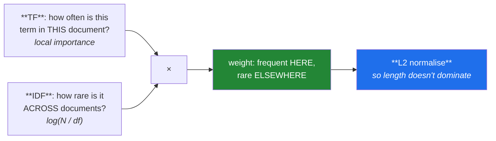

# Day 122 — TF-IDF, from scratch

**Phase 14 · Module 14** · ID: **NLP-09** (term frequency–inverse document frequency)

> **Yesterday:** bag of words, and the finding that raw counts overweight repetition.
> **Today:** the weighting that fixes it, and the most widely used text representation of the last
> thirty years. It is two ideas multiplied — and **sklearn's implementation differs from the textbook
> formula in three specific ways**, each of which will make your from-scratch version disagree until
> you find them.
> **Tomorrow:** word vectors and Word2Vec.

```bash
./m start 122 && ./m scaffold 122
```

**Time:** 110 minutes. **Request budget:** 0 model calls.

---

## §1 The story

Bag of words has a ranking problem: `the` appears in every document and carries nothing, while a rare
technical term appears twice and is decisive. Raw counts rank `the` far above it.

TF-IDF is the correction, and it is two ideas multiplied:



**IDF is the interesting half.** A term in every document has `log(N/N) = 0` and is annihilated — so
**TF-IDF downweights stopwords automatically**, which is a better answer than Day 118's list because
it is learned from your corpus rather than imported from someone else's.

**L2 normalisation is the half people forget**, and it matters more than it looks. Without it a
2,000-word document has vectors roughly ten times longer than a 200-word one, so document length
dominates every similarity computation. After normalisation, cosine similarity is just a dot product
— which is what Day 123 and every retrieval system in Phase 18 rely on.

Then the practical content: **sklearn does not implement the textbook formula.** Three differences,
and each one makes a from-scratch comparison fail:

1. **`smooth_idf=True` by default** — it adds 1 to both `N` and `df`, as if a document containing
   every term existed. Prevents division by zero on unseen terms.
2. **IDF has `+1` added** — `log((1+N)/(1+df)) + 1`, so a term in every document gets weight 1 rather
   than 0. It is *not* annihilated.
3. **L2 normalisation is applied by default**, after weighting.

None of those is wrong. All of them are undocumented in most tutorials, and finding them is the point
of building it yourself first.

---

## §2 Setup — run this

```bash
mkdir -p days/day-122/lab
touch days/day-122/lab/tfidf.py
```

`src/setu/nlp.py` grows today. No new packages.

---

## §3 NLP-09 — weighting

`days/day-122/lab/tfidf.py`:

```python
"""NLP-09: TF-IDF built by hand, then reconciled with sklearn's three differences."""

from __future__ import annotations

import numpy as np
from sklearn.feature_extraction.text import CountVectorizer, TfidfVectorizer

CORPUS = [
    "the cat sat on the mat",
    "the dog sat on the log",
    "the cat and the dog played",
    "quantum entanglement in the cat experiment",
]


def why_raw_counts_rank_badly() -> None:
    vectoriser = CountVectorizer()
    matrix = vectoriser.fit_transform(CORPUS).toarray()
    terms = vectoriser.get_feature_names_out()

    document = 3
    order = np.argsort(matrix[document])[::-1]
    print(f"\n  {CORPUS[document]!r}")
    print(f"\n  ranked by RAW COUNT:")
    for i in order[:5]:
        print(f"    {terms[i]:<16} {matrix[document][i]}")

    print("\n  🚨 'the' ties with 'quantum' and 'entanglement' — the three least and")
    print("     most informative words in the document rank equally.")
    print("\n  Raw counts measure PRESENCE. They say nothing about how much a term")
    print("  distinguishes this document from the rest of the corpus.")


def idf_from_scratch() -> None:
    vectoriser = CountVectorizer()
    counts = vectoriser.fit_transform(CORPUS).toarray()
    terms = vectoriser.get_feature_names_out()

    n_documents = len(CORPUS)
    document_frequency = (counts > 0).sum(axis=0)
    idf = np.log(n_documents / document_frequency)

    print(f"\n  N = {n_documents} documents")
    print(f"\n  {'term':<16} {'df':>4} {'N/df':>7} {'idf = log(N/df)':>17}")
    for term in ("the", "cat", "dog", "quantum", "entanglement"):
        i = list(terms).index(term)
        print(f"  {term:<16} {document_frequency[i]:>4} "
              f"{n_documents / document_frequency[i]:>7.2f} {idf[i]:>17.4f}")

    print("\n  ✅ 'the' is in every document: log(4/4) = 0. It is ANNIHILATED.")
    print("     'quantum' is in one: log(4/1) = 1.386. It dominates.")
    print("\n  🚨 That is why TF-IDF downweights stopwords automatically — and it is a")
    print("     BETTER answer than Day 118's list, because it is learned from YOUR")
    print("     corpus rather than imported from someone else's.")

    print("\n  ⚠️ But note the failure mode: a term in ZERO documents gives log(N/0) =")
    print("     infinity. That is why sklearn smooths, and §3.4 shows how.")


def tfidf_from_scratch() -> None:
    vectoriser = CountVectorizer()
    counts = vectoriser.fit_transform(CORPUS).toarray().astype(float)
    terms = vectoriser.get_feature_names_out()

    tf = counts / counts.sum(axis=1, keepdims=True)          # relative frequency
    document_frequency = (counts > 0).sum(axis=0)
    idf = np.log(len(CORPUS) / document_frequency)
    tfidf = tf * idf

    document = 3
    order = np.argsort(tfidf[document])[::-1]
    print(f"\n  {CORPUS[document]!r}")
    print(f"\n  {'term':<16} {'tf':>8} {'idf':>8} {'tf-idf':>9}")
    for i in order[:5]:
        print(f"  {terms[i]:<16} {tf[document][i]:>8.4f} {idf[i]:>8.4f} "
              f"{tfidf[document][i]:>9.4f}")

    print("\n  ✅ 'quantum' and 'entanglement' now rank at the top; 'the' has weight")
    print("     exactly zero. The ranking finally matches intuition.")
    print("\n  That is the whole idea: frequent HERE, rare ELSEWHERE.")


def sklearn_differs_in_three_ways() -> None:
    vectoriser = CountVectorizer()
    counts = vectoriser.fit_transform(CORPUS).toarray().astype(float)
    terms = list(vectoriser.get_feature_names_out())
    n = len(CORPUS)
    document_frequency = (counts > 0).sum(axis=0)

    textbook = np.log(n / document_frequency)
    smoothed = np.log((1 + n) / (1 + document_frequency)) + 1

    sklearn_idf = TfidfVectorizer().fit(CORPUS).idf_

    print(f"\n  {'term':<16} {'textbook':>10} {'smoothed+1':>12} {'sklearn':>10}")
    for term in ("the", "cat", "quantum"):
        i = terms.index(term)
        print(f"  {term:<16} {textbook[i]:>10.4f} {smoothed[i]:>12.4f} "
              f"{sklearn_idf[i]:>10.4f}")

    print(f"\n  smoothed matches sklearn: "
          f"{np.allclose(smoothed, sklearn_idf)}")

    print("\n  🚨 THREE differences from the textbook formula:")
    print("\n    1. smooth_idf=True — adds 1 to N and to df, as if a document")
    print("       containing every term existed. Prevents log(N/0) on unseen terms.")
    print("\n    2. IDF gets +1 — so a term in EVERY document has weight 1, not 0.")
    print("       It is downweighted but NOT annihilated, which is a real difference:")
    print("       the textbook formula deletes such terms entirely.")
    print("\n    3. L2 normalisation is applied afterwards, by default (§3.5).")
    print("\n  ⚠️ None is wrong. All are undocumented in most tutorials, and each one")
    print("     makes a from-scratch comparison fail until you find it.")


def l2_normalisation_is_not_optional() -> None:
    short = "quantum physics"
    long = " ".join(["quantum physics"] * 20)

    unnormalised = TfidfVectorizer(norm=None).fit_transform([short, long]).toarray()
    normalised = TfidfVectorizer(norm="l2").fit_transform([short, long]).toarray()

    print(f"\n  the same content, 20x the length:")
    print(f"\n  {'':<14} {'vector norm':>13} {'dot product with itself':>26}")
    for label, matrix in (("norm=None", unnormalised), ("norm='l2'", normalised)):
        norms = np.linalg.norm(matrix, axis=1)
        print(f"  {label:<14} {str(np.round(norms, 3).tolist()):>13} "
              f"{matrix[0] @ matrix[1]:>26.4f}")

    print("\n  🚨 Without normalisation the long document's vector is ~20x longer, so")
    print("     it dominates every dot product regardless of content.")
    print("\n  ✅ With L2 normalisation every vector has length 1, so COSINE SIMILARITY")
    print("     IS JUST A DOT PRODUCT — which is what Day 123 and every retrieval")
    print("     system in Phase 18 rely on.")

    print(f"\n  after L2, the two documents are identical: "
          f"{np.allclose(normalised[0], normalised[1])}")
    print("  ^ correct, because they contain the same terms in the same proportions.")


def tf_variants_change_the_answer() -> None:
    document = "good good good good good film"

    print(f"\n  {document!r}")
    print(f"\n  {'tf variant':<22} {'weight for good':>17}")
    counts = 5
    total = 6
    variants = {
        "raw count": counts,
        "relative (count/len)": counts / total,
        "sublinear log(1+tf)": np.log1p(counts),
        "binary presence": 1,
        "augmented (0.5 + …)": 0.5 + 0.5 * counts / counts,
    }
    for label, value in variants.items():
        print(f"  {label:<22} {value:>17.4f}")

    plain = TfidfVectorizer(sublinear_tf=False).fit_transform([document]).toarray()
    sublinear = TfidfVectorizer(sublinear_tf=True).fit_transform([document]).toarray()
    terms = TfidfVectorizer().fit([document]).get_feature_names_out()
    i = list(terms).index("good")

    print(f"\n  sklearn, sublinear_tf=False: good = {plain[0][i]:.4f}")
    print(f"  sklearn, sublinear_tf=True : good = {sublinear[0][i]:.4f}")

    print("\n  ⚠️ `sublinear_tf=True` uses 1 + log(tf), which is usually a small but")
    print("     real improvement on longer documents — the fifth mention of a word")
    print("     adds far less than the first (Day 121's point).")
    print("\n  It is off by default. Try it; it costs nothing.")


def the_idf_is_fitted_and_leaks() -> None:
    train = ["the cat sat", "the dog sat", "the bird flew"]
    test = ["quantum entanglement observed"]

    wrong = TfidfVectorizer().fit(train + test)
    right = TfidfVectorizer().fit(train)

    print(f"\n  fitted on train + test: {len(wrong.get_feature_names_out())} terms")
    print(f"  fitted on train only  : {len(right.get_feature_names_out())} terms")

    print(f"\n  'quantum' known to the wrong vectoriser? "
          f"{'quantum' in wrong.get_feature_names_out()}")

    i = list(wrong.get_feature_names_out()).index("the")
    print(f"\n  IDF of 'the' when test is included : {wrong.idf_[i]:.4f}")
    j = list(right.get_feature_names_out()).index("the")
    print(f"  IDF of 'the' on train only         : {right.idf_[j]:.4f}")

    print("\n  🚨 Two leaks, not one:")
    print("     - the VOCABULARY includes test-only terms (Day 121)")
    print("     - the IDF WEIGHTS are computed from test document frequencies")
    print("\n  The second is subtler and is specific to TF-IDF: every weight in your")
    print("  training matrix was influenced by the test set's term distribution.")
    print("\n  ⚠️ Use a Pipeline (Day 83). The vectoriser is a fitted transform and")
    print("     `fit_transform` on train, `transform` on test is the only correct order.")


def tfidf_is_a_ranking_not_a_meaning() -> None:
    documents = ["the movie was good", "the film was great",
                 "the automobile was red"]
    matrix = TfidfVectorizer().fit_transform(documents)
    similarity = (matrix @ matrix.T).toarray()

    print(f"\n  cosine similarity (L2-normalised, so a dot product):")
    print(f"  {'':<26} {'d0':>7} {'d1':>7} {'d2':>7}")
    for i, document in enumerate(documents):
        print(f"  {document:<26} {similarity[i][0]:>7.4f} {similarity[i][1]:>7.4f} "
              f"{similarity[i][2]:>7.4f}")

    print("\n  🚨 'movie was good' and 'film was great' are near-synonymous and share")
    print("     only 'the' and 'was'. Their similarity is no higher than to the")
    print("     unrelated third document.")
    print("\n  TF-IDF matches STRINGS, not meanings. 'movie' and 'film' are as unrelated")
    print("  to it as 'movie' and 'automobile' — the one-hot problem from Day 121,")
    print("  surviving the weighting.")
    print("\n  ✅ That is exactly the gap Day 123's word vectors fill, and the reason")
    print("     dense embeddings exist at all.")


def what_tfidf_is_still_the_right_answer_for() -> None:
    rows = [
        ("keyword extraction", "yes", "top-weighted terms ARE the keywords"),
        ("search / BM25 baseline", "yes", "exact-match retrieval is its home ground"),
        ("text classification", "yes", "Day 124's baseline; hard to beat"),
        ("near-duplicate detection", "yes", "shared rare terms are decisive"),
        ("semantic similarity", "no", "'movie' and 'film' are unrelated to it"),
        ("short texts (queries, titles)", "weak", "IDF needs document frequencies"),
        ("cross-lingual matching", "no", "no shared vocabulary at all"),
    ]
    print(f"\n  {'task':<32} {'TF-IDF?':<8} {'because'}")
    for task, verdict, because in rows:
        print(f"  {task:<32} {verdict:<8} {because}")

    print("\n  ⚠️ TF-IDF plus a linear model remains a genuinely strong classification")
    print("     baseline. Day 124 makes it the number Phase 15's neural models must")
    print("     beat, and it is beaten by less than people expect.")


if __name__ == "__main__":
    why_raw_counts_rank_badly()
    idf_from_scratch()
    tfidf_from_scratch()
    sklearn_differs_in_three_ways()
    l2_normalisation_is_not_optional()
    tf_variants_change_the_answer()
    the_idf_is_fitted_and_leaks()
    tfidf_is_a_ranking_not_a_meaning()
    what_tfidf_is_still_the_right_answer_for()
```

**Line by line:**

- `why_raw_counts_rank_badly` — **`the` ties with `quantum`.** Raw counts measure presence and say
  nothing about how much a term *distinguishes* this document from the corpus.
- `idf_from_scratch` — **`the` is in every document, so `log(4/4) = 0` and it is annihilated.** That is
  why TF-IDF downweights stopwords automatically, and it is a **better answer than Day 118's list**
  because it is learned from your corpus rather than imported. And the failure mode is flagged: a term
  in zero documents gives `log(N/0) = ∞`.
- `tfidf_from_scratch` — `quantum` and `entanglement` at the top, `the` at exactly zero. **Frequent
  here, rare elsewhere.**
- `sklearn_differs_in_three_ways` — **the day's reconciliation.** `smooth_idf` adds 1 to both `N` and
  `df`; the `+1` on IDF means a universal term gets weight **1 rather than 0**, so it is downweighted
  but *not annihilated* — a real difference from the textbook, which deletes such terms entirely. And
  L2 normalisation is applied by default. **None is wrong; all are undocumented in most tutorials.**
- `l2_normalisation_is_not_optional` — without it a 20× longer document has a ~20× longer vector and
  **dominates every dot product regardless of content**. With it, **cosine similarity is just a dot
  product**, which is what Day 123 and Phase 18's retrieval rely on.
- `tf_variants_change_the_answer` — five TF definitions giving five different weights. **`sublinear_tf`
  is off by default** and is usually a small real improvement on longer documents, because the fifth
  mention adds far less than the first (Day 121).
- `the_idf_is_fitted_and_leaks` — **two leaks, not one.** The vocabulary includes test-only terms
  (Day 121's leak), *and* the IDF weights are computed from test document frequencies. **The second is
  specific to TF-IDF** and subtler: every weight in your training matrix was influenced by the test
  set's term distribution.
- `tfidf_is_a_ranking_not_a_meaning` — `movie was good` and `film was great` are near-synonymous and
  score **no higher than an unrelated document**. **TF-IDF matches strings, not meanings** — Day 121's
  one-hot problem surviving the weighting, and exactly the gap Day 123 fills.
- `what_tfidf_is_still_the_right_answer_for` — and the closing note: **TF-IDF plus a linear model is
  beaten by less than people expect**, which is what Day 124's gate establishes.

---

## §4 Build brief

Extend `src/setu/nlp.py`:

```python
TF_VARIANTS = {"raw", "relative", "sublinear", "binary"}


def inverse_document_frequency(document_frequency, *, n_documents: int,
                               smooth: bool = True, add_one: bool = True) -> dict:
    """TODO(me): IDF, with sklearn's two adjustments made explicit.

    {"idf": ndarray, "formula": str, "n_documents", "smooth", "add_one"}
    - textbook  : log(N / df)
    - smooth    : log((1 + N) / (1 + df))      — as if a document with every term existed
    - add_one   : + 1                          — so a universal term weighs 1, not 0
    - `formula` must be the actual expression used, as a string — that is what makes
      a from-scratch comparison debuggable (§3.4)
    - raise DataError if any df exceeds n_documents, naming the offending index
    - raise DataError on df=0 when smooth=False — log(N/0) is infinite, and that IS
      the reason smoothing exists; the message must say so
    """
    raise NotImplementedError


def term_frequency(counts, *, variant: str = "relative") -> np.ndarray:
    """TODO(me): the TF half. PURE.

    - raw       : the count itself
    - relative  : count / document length
    - sublinear : 1 + log(count) for count > 0, else 0  — note the 1+, and that
      log(0) must not appear
    - binary    : 1 if present
    - raise DataError on an unknown variant, listing TF_VARIANTS
    - raise DataError on a negative count
    - the docstring must say the fifth mention of a word adds far less than the
      first, which is why sublinear usually helps on longer documents (Day 121)
    """
    raise NotImplementedError


def fit_tfidf(documents, *, vocabulary=None, tf_variant: str = "relative",
              smooth: bool = True, add_one: bool = True, norm: str | None = "l2",
              min_df: int = 1) -> dict:
    """TODO(me): fit on TRAINING documents only, and keep the pieces inspectable.

    {"vocabulary", "idf", "formula", "tf_variant", "norm", "n_documents",
     "fitted_on": "train", "warnings": [...]}
    - reuse build_vocabulary (Day 121) rather than reimplementing the filters
    - the returned object must carry EVERYTHING needed to transform new documents,
      because the idf is fitted state and losing it makes the model unusable
    - WARN when norm is None: without L2 the document length dominates every
      similarity (§3.5), and callers reach for norm=None to "keep the raw weights"
    - raise DataError on an empty corpus
    """
    raise NotImplementedError


def transform_tfidf(fit: dict, documents) -> dict:
    """TODO(me): apply a fitted TF-IDF. Sparse output.

    {"matrix": scipy sparse, "oov_rate", "empty_rows": [...], "warnings": [...]}
    - use the FITTED idf; recomputing it from these documents is the leak (§3.7)
    - the docstring must state that recomputing idf here would leak, because that
      is the mistake this function exists to prevent
    - MUST return sparse (Day 121's rule)
    - WARN on empty rows, as Day 121 does
    - raise DataError if the fit dict is missing its idf or vocabulary
    """
    raise NotImplementedError


def matches_sklearn(documents, *, tolerance: float = 1e-8) -> dict:
    """TODO(me): §3.4 — reconcile the from-scratch version with the library.

    {"agrees": bool, "max_difference": float, "settings_used": {...},
     "differences_found": [...]}
    - configure fit_tfidf to match sklearn's defaults (smooth, add_one, l2) and
      compare element-wise
    - differences_found lists which of the THREE adjustments were needed to agree —
      that list IS the learning outcome (§3.4), so it must be reported rather than
      just a boolean
    - raise DataError if the corpora produce different vocabularies, naming the gap
    """
    raise NotImplementedError


def top_terms(fit: dict, matrix, *, document: int, k: int = 5) -> list[tuple[str, float]]:
    """TODO(me): the highest-weighted terms in one document — TF-IDF's best-known use.

    - returns (term, weight) sorted descending
    - raise DataError if document is out of range, naming the row count
    - the docstring must say these are the terms that distinguish this document
      from the CORPUS, not the terms that are important in general — a different
      corpus gives different keywords for the same text
    """
    raise NotImplementedError


def assert_idf_fitted_on_train_only(fit: dict) -> None:
    """TODO(me): raise DataError unless fit['fitted_on'] == 'train'.

    - the message must name BOTH leaks (§3.7): the vocabulary AND the idf weights
    - the idf leak is specific to TF-IDF and subtler than the vocabulary one, so
      the message must distinguish them rather than mentioning leakage generally
    """
    raise NotImplementedError
```

- `inverse_document_frequency` returning the **`formula` as a string** is the debugging affordance that
  makes §3.4 reconcilable — when your numbers disagree with sklearn's, the formula is the first thing
  you compare.
- `matches_sklearn` reporting **`differences_found`** rather than a boolean is deliberate: the *list of
  three adjustments* is the learning outcome, and a passing boolean teaches nothing.
- `assert_idf_fitted_on_train_only` naming **both** leaks matters — the vocabulary leak is Day 121's
  and familiar; the IDF-weight leak is new today and easier to miss.

---

## §5 The eval that must be able to fail

Add to `tests/test_nlp.py`:

```python
from setu.nlp import (
    TF_VARIANTS,
    assert_idf_fitted_on_train_only,
    fit_tfidf,
    inverse_document_frequency,
    matches_sklearn,
    term_frequency,
    top_terms,
    transform_tfidf,
)


TFIDF_CORPUS = ["the cat sat on the mat", "the dog sat on the log",
                "the cat and the dog played",
                "quantum entanglement in the cat experiment"]


def test_a_universal_term_is_annihilated_by_the_textbook_formula():
    """log(N/N) = 0 — which is why TF-IDF downweights stopwords for free."""
    result = inverse_document_frequency(np.array([4]), n_documents=4,
                                        smooth=False, add_one=False)
    assert result["idf"][0] == pytest.approx(0.0)


def test_the_add_one_adjustment_stops_annihilation():
    """sklearn's universal term weighs 1, not 0 — a real difference."""
    plain = inverse_document_frequency(np.array([4]), n_documents=4,
                                       smooth=False, add_one=False)["idf"][0]
    sklearn_style = inverse_document_frequency(np.array([4]), n_documents=4,
                                               smooth=True, add_one=True)["idf"][0]
    assert plain == pytest.approx(0.0)
    assert sklearn_style == pytest.approx(1.0)


def test_a_rare_term_outweighs_a_common_one():
    result = inverse_document_frequency(np.array([1, 4]), n_documents=4)
    assert result["idf"][0] > result["idf"][1]


def test_smoothing_prevents_a_division_by_zero():
    result = inverse_document_frequency(np.array([0]), n_documents=4, smooth=True)
    assert np.isfinite(result["idf"][0])


def test_the_unsmoothed_zero_case_explains_why_smoothing_exists():
    with pytest.raises(DataError) as info:
        inverse_document_frequency(np.array([0]), n_documents=4, smooth=False)
    message = str(info.value).lower()
    assert "smooth" in message or "infinit" in message


def test_the_formula_is_returned_as_a_string():
    """What makes a from-scratch comparison debuggable."""
    result = inverse_document_frequency(np.array([2]), n_documents=4)
    assert "log" in result["formula"]


def test_a_df_above_n_is_refused():
    with pytest.raises(DataError) as info:
        inverse_document_frequency(np.array([1, 9]), n_documents=4)
    assert "1" in str(info.value)


def test_relative_tf_divides_by_length():
    counts = np.array([[2.0, 1.0, 1.0]])
    assert term_frequency(counts, variant="relative")[0][0] == pytest.approx(0.5)


def test_sublinear_tf_dampens_repetition():
    counts = np.array([[1.0, 10.0]])
    result = term_frequency(counts, variant="sublinear")
    assert result[0][1] / result[0][0] < 3, "10x the count is not 10x the weight"


def test_sublinear_tf_handles_zero_without_a_log_error():
    result = term_frequency(np.array([[0.0, 3.0]]), variant="sublinear")
    assert result[0][0] == 0.0
    assert np.all(np.isfinite(result))


def test_binary_tf_discards_the_count():
    result = term_frequency(np.array([[7.0, 1.0]]), variant="binary")
    assert result[0][0] == result[0][1] == 1.0


def test_an_unknown_tf_variant_lists_the_known_ones():
    with pytest.raises(DataError) as info:
        term_frequency(np.array([[1.0]]), variant="augmented")
    assert any(name in str(info.value) for name in TF_VARIANTS)


def test_negative_counts_are_refused():
    with pytest.raises(DataError):
        term_frequency(np.array([[-1.0]]))


def test_the_from_scratch_version_matches_sklearn():
    """Today's real assessment: three adjustments, all needed."""
    result = matches_sklearn(TFIDF_CORPUS)
    assert result["agrees"] is True
    assert result["max_difference"] < 1e-8


def test_the_three_adjustments_are_named():
    """The list IS the learning outcome, not the boolean."""
    result = matches_sklearn(TFIDF_CORPUS)
    found = " ".join(result["differences_found"]).lower()
    assert "smooth" in found
    assert "norm" in found or "l2" in found
    assert "+1" in found or "add" in found


def test_omitting_smoothing_breaks_the_match():
    """Each adjustment is load-bearing."""
    from sklearn.feature_extraction.text import TfidfVectorizer

    naive = fit_tfidf(TFIDF_CORPUS, smooth=False, add_one=False)
    sklearn_idf = TfidfVectorizer().fit(TFIDF_CORPUS).idf_
    mine = np.array([naive["idf"][naive["vocabulary"][t]]
                     for t in sorted(naive["vocabulary"])])
    assert not np.allclose(mine, sklearn_idf)


def test_l2_normalisation_gives_every_document_unit_length():
    """So cosine similarity is just a dot product."""
    fit = fit_tfidf(TFIDF_CORPUS, norm="l2")
    matrix = transform_tfidf(fit, TFIDF_CORPUS)["matrix"].toarray()
    norms = np.linalg.norm(matrix, axis=1)
    assert np.allclose(norms, 1.0)


def test_without_normalisation_length_dominates():
    short = "quantum physics"
    long = " ".join(["quantum physics"] * 20)
    fit = fit_tfidf([short, long], norm=None)
    matrix = transform_tfidf(fit, [short, long])["matrix"].toarray()
    assert np.linalg.norm(matrix[1]) > np.linalg.norm(matrix[0]) * 5


def test_normalisation_makes_proportional_documents_identical():
    short = "quantum physics"
    long = " ".join(["quantum physics"] * 20)
    fit = fit_tfidf([short, long], norm="l2")
    matrix = transform_tfidf(fit, [short, long])["matrix"].toarray()
    assert np.allclose(matrix[0], matrix[1])


def test_dropping_the_norm_is_warned_about():
    """Callers reach for norm=None to 'keep the raw weights'."""
    fit = fit_tfidf(TFIDF_CORPUS, norm=None)
    assert fit["warnings"]
    assert any("length" in w.lower() or "norm" in w.lower() for w in fit["warnings"])


def test_the_matrix_is_sparse():
    """Day 121's rule, unchanged."""
    import scipy.sparse

    fit = fit_tfidf(TFIDF_CORPUS)
    assert scipy.sparse.issparse(transform_tfidf(fit, TFIDF_CORPUS)["matrix"])


def test_transform_uses_the_fitted_idf_not_a_recomputed_one():
    """Recomputing it from the new documents IS the leak."""
    train = ["the cat sat", "the dog sat", "the bird flew"]
    fit = fit_tfidf(train)
    original_idf = fit["idf"].copy()

    transform_tfidf(fit, ["the cat the cat the cat"])
    assert np.array_equal(fit["idf"], original_idf), "the fitted idf was mutated"


def test_the_transform_docstring_names_the_leak():
    text = transform_tfidf.__doc__.lower()
    assert "leak" in text


def test_an_all_oov_document_is_reported():
    fit = fit_tfidf(["the cat sat", "the dog sat"])
    result = transform_tfidf(fit, ["quantum entanglement observed"])
    assert result["empty_rows"] == [0]
    assert result["warnings"]


def test_a_fit_without_an_idf_is_refused():
    with pytest.raises(DataError):
        transform_tfidf({"vocabulary": {"a": 0}}, ["a"])


def test_top_terms_are_the_distinguishing_ones():
    fit = fit_tfidf(TFIDF_CORPUS)
    matrix = transform_tfidf(fit, TFIDF_CORPUS)["matrix"]
    terms = [term for term, _ in top_terms(fit, matrix, document=3, k=3)]
    assert "quantum" in terms or "entanglement" in terms
    assert "the" not in terms


def test_the_docstring_says_keywords_are_corpus_relative():
    """A different corpus gives different keywords for the same text."""
    text = top_terms.__doc__.lower()
    assert "corpus" in text


def test_top_terms_rejects_an_out_of_range_document():
    fit = fit_tfidf(TFIDF_CORPUS)
    matrix = transform_tfidf(fit, TFIDF_CORPUS)["matrix"]
    with pytest.raises(DataError) as info:
        top_terms(fit, matrix, document=99)
    assert "4" in str(info.value)


def test_tfidf_does_not_capture_synonymy():
    """It matches strings, not meanings — the gap Day 123 fills."""
    from sklearn.feature_extraction.text import TfidfVectorizer

    documents = ["the movie was good", "the film was great", "the automobile was red"]
    matrix = TfidfVectorizer().fit_transform(documents)
    similarity = (matrix @ matrix.T).toarray()
    assert similarity[0][1] == pytest.approx(similarity[0][2], abs=0.15), (
        "near-synonyms score no higher than an unrelated document"
    )


def test_fitting_on_all_data_is_refused():
    fit = fit_tfidf(TFIDF_CORPUS)
    fit["fitted_on"] = "all"
    with pytest.raises(DataError):
        assert_idf_fitted_on_train_only(fit)


def test_the_leak_message_names_both_leaks():
    """The vocabulary leak AND the idf-weight leak."""
    fit = fit_tfidf(TFIDF_CORPUS)
    fit["fitted_on"] = "train+test"
    with pytest.raises(DataError) as info:
        assert_idf_fitted_on_train_only(fit)
    message = str(info.value).lower()
    assert "vocabular" in message
    assert "idf" in message or "weight" in message


def test_a_train_only_fit_passes():
    assert_idf_fitted_on_train_only(fit_tfidf(TFIDF_CORPUS))


def test_the_idf_weights_differ_when_test_is_included():
    """The subtler of the two leaks."""
    from sklearn.feature_extraction.text import TfidfVectorizer

    train = ["the cat sat", "the dog sat", "the bird flew"]
    test = ["quantum entanglement observed"]

    right = TfidfVectorizer().fit(train)
    wrong = TfidfVectorizer().fit(train + test)

    i = list(right.get_feature_names_out()).index("the")
    j = list(wrong.get_feature_names_out()).index("the")
    assert right.idf_[i] != pytest.approx(wrong.idf_[j]), (
        "including test documents changed the weight of a training term"
    )
```

**Line by line:**

- `test_the_from_scratch_version_matches_sklearn` with `test_the_three_adjustments_are_named` — **the
  day's real assessment, as a pair.** The boolean says you got there; the **named list of three
  adjustments** is what you actually learned, and reporting it is the difference between a passing test
  and an explanation.
- `test_omitting_smoothing_breaks_the_match` — proves **each adjustment is load-bearing.** Without it,
  a partially-correct implementation could pass by luck.
- `test_the_add_one_adjustment_stops_annihilation` — `0.0` textbook against `1.0` sklearn for a
  universal term. **A real behavioural difference**, not a rounding detail: one formula deletes the
  term, the other keeps it.
- `test_l2_normalisation_gives_every_document_unit_length` with
  `test_without_normalisation_length_dominates` — the pair establishes why the default exists, and
  `test_normalisation_makes_proportional_documents_identical` confirms it does the *right* thing rather
  than merely rescaling.
- `test_transform_uses_the_fitted_idf_not_a_recomputed_one` — asserts the fitted IDF is **not mutated**.
  Recomputing it during transform is the leak, and it would look completely normal.
- `test_the_idf_weights_differ_when_test_is_included` — **the subtler leak, demonstrated.** Including
  test documents changed the weight of a *training* term, which is specific to TF-IDF and invisible in
  a vocabulary comparison.
- `test_the_leak_message_names_both_leaks` — the message must distinguish the vocabulary leak
  (Day 121's, familiar) from the IDF-weight leak (new today, easier to miss).
- `test_tfidf_does_not_capture_synonymy` — near-synonyms score no higher than an unrelated document.
  **TF-IDF matches strings, not meanings**, and this test is what motivates Day 123.
- `test_sublinear_tf_handles_zero_without_a_log_error` — `log(0)` is `-inf`, and a naive `1 + log(tf)`
  produces it on every absent term.

```bash
uv run python -m pytest tests/test_nlp.py -v
```

---

## §6 Request budget

| Resource | Spent today |
|---|---|
| LLM calls | **0** |

---

## §7 Traps

- **Expecting the textbook formula to match sklearn.** Three differences.
- **`log(N/df)` with `df = 0`.** Infinite; that is what smoothing is for.
- **Assuming a universal term is annihilated.** With `+1` it weighs 1.
- **`norm=None` to "keep the raw weights".** Document length then dominates.
- **`1 + log(tf)` without guarding `tf = 0`.** `log(0)` is `-inf`.
- **Recomputing IDF at transform time.** That is the leak.
- **Fitting on train + test.** Two leaks: vocabulary *and* weights.
- **Densifying the matrix.** Day 121's rule.
- **Expecting TF-IDF to capture synonymy.** It matches strings.
- **TF-IDF on very short texts.** IDF needs document frequencies to be meaningful.
- **Quoting keywords as absolute.** They are relative to *this* corpus.
- **Leaving `sublinear_tf=False` without trying it.** It is usually a small free gain.

---

## §8 Verify before you code

Written **2026-08-21**:

- <https://scikit-learn.org/stable/modules/feature_extraction.html#tfidf-term-weighting> — sklearn's
  own derivation, including the smoothing and `+1` it applies.
- <https://scikit-learn.org/stable/modules/generated/sklearn.feature_extraction.text.TfidfVectorizer.html> —
  `smooth_idf`, `sublinear_tf`, `norm`, and their defaults.
- <https://scikit-learn.org/stable/modules/generated/sklearn.feature_extraction.text.TfidfTransformer.html> —
  for when you already have counts.
- <https://en.wikipedia.org/wiki/Okapi_BM25> — the retrieval-oriented successor, worth knowing before
  Phase 18.

---

## §9 Say it in an interview

> "TF-IDF is two ideas multiplied: how often a term appears in this document, times how rare it is
> across the corpus. The inverse document frequency is the interesting half — a term appearing in
> every document has log of N over N, which is zero, so stopwords get downweighted *automatically*,
> learned from your corpus rather than imported from someone else's list. The part worth knowing is
> that scikit-learn doesn't implement the textbook formula: it smooths by adding one to both N and the
> document frequency, it adds one to the IDF so a universal term weighs one rather than zero — so it's
> downweighted but not deleted — and it L2-normalises by default. None of those is wrong and none is
> documented in most tutorials, so a from-scratch version disagrees until you find all three. The
> normalisation matters more than it looks: without it a long document's vector dominates every
> similarity by sheer magnitude, and with it cosine similarity is just a dot product, which is what
> every retrieval system relies on. And the leak specific to TF-IDF is that the IDF *weights* are
> fitted state — fitting on train plus test doesn't only leak vocabulary, it changes the weight of
> every training term."

---

## §10 Done when

Tick [`CHECKLIST.md`](CHECKLIST.md), then `./m check && ./m done 122`.
