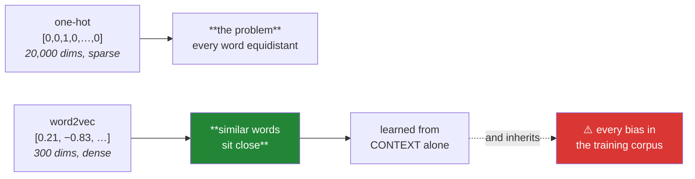

# Day 123 — Word vectors and Word2Vec

**Phase 14 · Module 14** · IDs: **NLP-10** (word vectors and cosine similarity), **NLP-11** (Word2Vec)

> **Yesterday:** TF-IDF, and the demonstration that `movie` and `film` score no higher than `movie`
> and `automobile`. It matches strings, not meanings.
> **Today:** the idea that fills that gap. Words become **dense vectors** where similar words sit
> close together — learned from nothing but which words appear near which. It is the direct ancestor
> of every embedding in Phases 17–19, and its failure modes are inherited by all of them.
> **Tomorrow:** the Phase 14 gate.

```bash
./m start 123 && ./m scaffold 123
```

**Time:** 110 minutes. **Request budget:** 0 model calls.

---

## §1 The story

Day 121 established that one-hot vectors encode identity only: `cat` and `dog` are exactly as far
apart as `cat` and `the`. Day 122 showed TF-IDF inherits that. The fix is to make the vectors **dense
and learned**:



**The distributional hypothesis is the whole idea:** *a word is characterised by the company it
keeps*. If `doctor` and `physician` appear in the same contexts, they get similar vectors — and
nothing was labelled to make that happen.

**Word2Vec turns that into a prediction task.** Skip-gram takes a word and predicts its neighbours;
CBOW does the reverse. Neither prediction is the point — **the model is thrown away and the weight
matrix is kept.** That is the trick worth internalising: the task exists only to shape the weights,
and the same pattern recurs in every self-supervised method in Phases 17–19.

Three things follow that this day has to be precise about.

**Cosine, not Euclidean.** Vector *direction* carries the meaning; magnitude mostly tracks word
frequency. Day 122's L2 normalisation makes cosine a dot product, and that is why every vector
database in Phase 18 stores normalised vectors.

**The famous analogy result is weaker than advertised.** `king − man + woman ≈ queen` works — but
standard evaluation code **excludes the three input words from the answer set**, and without that
exclusion the nearest vector is usually `king` itself. That is not fraud, it is a documented
convention, and knowing it is the difference between understanding the result and repeating it.

**Embeddings inherit their corpus's biases**, and they do so measurably. This is not a footnote —
`man : programmer :: woman : homemaker` is a real result from real published vectors, and any system
you build on embeddings carries it forward. Principle 9 applies with force: **provenance travels, and
so does bias.**

---

## §2 Setup — run this

```bash
uv add "gensim==4.4.0"
mkdir -p days/day-123/lab
touch days/day-123/lab/vectors.py
```

**Provenance note (Principle 9).** Pretrained vectors are a **dataset**, not a library. Record which
vectors, trained on which corpus, in `docs/PINS_DS.md` — `word2vec-google-news-300` is trained on
2013 Google News and carries that decade's language and biases.

---

## §3 NLP-10 / NLP-11 — dense vectors

`days/day-123/lab/vectors.py`:

```python
"""NLP-10/11: dense word vectors, cosine similarity, and what they inherit."""

from __future__ import annotations

from collections import Counter, defaultdict

import numpy as np

CORPUS = [
    "the doctor examined the patient carefully",
    "the physician examined the patient carefully",
    "the doctor treated the patient today",
    "the physician treated the patient today",
    "the mechanic repaired the engine carefully",
    "the mechanic fixed the engine today",
    "the engineer repaired the machine carefully",
    "the engineer fixed the machine today",
] * 40


def the_gap_yesterday_left() -> None:
    from sklearn.feature_extraction.text import TfidfVectorizer

    documents = ["the doctor examined the patient",
                 "the physician examined the patient",
                 "the mechanic repaired the engine"]
    matrix = TfidfVectorizer().fit_transform(documents)
    similarity = (matrix @ matrix.T).toarray()

    print(f"\n  TF-IDF cosine similarity:")
    print(f"    doctor/physician sentences : {similarity[0][1]:.4f}")
    print(f"    doctor/mechanic sentences  : {similarity[0][2]:.4f}")

    print("\n  🚨 'doctor' and 'physician' are synonyms and TF-IDF cannot see it —")
    print("     they share no characters, so they are as unrelated as any two words.")
    print("\n  The vocabulary is a set of ATOMS with no internal structure. That is")
    print("  Day 121's one-hot problem, surviving Day 122's weighting untouched.")


def the_distributional_hypothesis() -> None:
    contexts = defaultdict(Counter)
    window = 2
    for sentence in CORPUS[:8]:
        tokens = sentence.split()
        for i, word in enumerate(tokens):
            for j in range(max(0, i - window), min(len(tokens), i + window + 1)):
                if i != j:
                    contexts[word][tokens[j]] += 1

    print("\n  which words appear NEAR which?")
    for word in ("doctor", "physician", "mechanic"):
        print(f"    {word:<12} {dict(contexts[word].most_common(4))}")

    shared = set(contexts["doctor"]) & set(contexts["physician"])
    different = set(contexts["doctor"]) & set(contexts["mechanic"])
    print(f"\n  doctor ∩ physician contexts: {sorted(shared)}")
    print(f"  doctor ∩ mechanic  contexts: {sorted(different)}")

    print("\n  ✅ 'doctor' and 'physician' share almost all their contexts; 'doctor' and")
    print("     'mechanic' share only function words.")
    print("\n  That is the DISTRIBUTIONAL HYPOTHESIS: a word is characterised by the")
    print("  company it keeps. Nothing was labelled — the signal is in co-occurrence.")


def a_count_based_embedding_from_scratch() -> None:
    """Co-occurrence + SVD: the pre-neural way, and it works."""
    vocabulary = sorted({w for s in CORPUS[:8] for w in s.split()})
    index = {w: i for i, w in enumerate(vocabulary)}
    window = 2

    matrix = np.zeros((len(vocabulary), len(vocabulary)))
    for sentence in CORPUS[:8]:
        tokens = sentence.split()
        for i, word in enumerate(tokens):
            for j in range(max(0, i - window), min(len(tokens), i + window + 1)):
                if i != j:
                    matrix[index[word], index[tokens[j]]] += 1

    # PPMI: positive pointwise mutual information — downweights frequent words
    total = matrix.sum()
    row = matrix.sum(axis=1, keepdims=True)
    column = matrix.sum(axis=0, keepdims=True)
    with np.errstate(divide="ignore", invalid="ignore"):
        pmi = np.log((matrix * total) / (row * column))
    ppmi = np.nan_to_num(np.maximum(pmi, 0), nan=0.0, posinf=0.0, neginf=0.0)

    u, s, _ = np.linalg.svd(ppmi)
    vectors = u[:, :8] * s[:8]
    vectors /= np.linalg.norm(vectors, axis=1, keepdims=True) + 1e-12

    def similarity(a, b):
        return float(vectors[index[a]] @ vectors[index[b]])

    print(f"\n  {len(vocabulary)}-word vocabulary -> 8-dimensional vectors via PPMI + SVD")
    print(f"\n  {'pair':<26} {'cosine'}")
    for a, b in (("doctor", "physician"), ("mechanic", "engineer"),
                 ("doctor", "mechanic"), ("doctor", "the")):
        print(f"  {a} / {b:<16} {similarity(a, b):>7.4f}")

    print("\n  ✅ Synonyms score high, unrelated words low — from counting alone, with")
    print("     no neural network and no gradient descent.")
    print("\n  ⚠️ PPMI matters: without it, 'the' co-occurs with everything and")
    print("     dominates. It is the same instinct as Day 122's IDF — downweight what")
    print("     is everywhere.")


def word2vec_is_a_pretext_task() -> None:
    print("\n  Word2Vec turns co-occurrence into a PREDICTION problem:")
    print("\n    skip-gram : given 'doctor', predict 'examined', 'patient', …")
    print("    CBOW      : given 'the … examined the', predict 'doctor'")

    print("\n  🚨 Neither prediction is the point. The model is trained, then THROWN")
    print("     AWAY, and the hidden weight matrix is kept as the embeddings.")
    print("\n  The task exists only to shape the weights. That is the trick, and the")
    print("  same pattern recurs in every self-supervised method in Phases 17–19 —")
    print("  masked language modelling is the same idea with a different pretext.")

    print("\n  choosing between them:")
    print(f"    {'':<12} {'skip-gram':<28} {'CBOW'}")
    print(f"    {'speed':<12} {'slower':<28} {'faster'}")
    print(f"    {'rare words':<12} {'better':<28} {'worse'}")
    print(f"    {'small corpus':<12} {'better':<28} {'needs more data'}")
    print("\n  ⚠️ Skip-gram is the usual default because rare words matter and corpora")
    print("     are rarely as large as you would like.")


def train_word2vec() -> None:
    from gensim.models import Word2Vec

    sentences = [s.split() for s in CORPUS]
    model = Word2Vec(sentences, vector_size=32, window=2, min_count=2,
                     sg=1, epochs=120, seed=0, workers=1)

    print(f"\n  vocabulary: {len(model.wv)} words, {model.wv.vector_size} dimensions")

    print(f"\n  {'pair':<28} {'cosine'}")
    for a, b in (("doctor", "physician"), ("mechanic", "engineer"),
                 ("doctor", "mechanic"), ("examined", "treated")):
        if a in model.wv and b in model.wv:
            print(f"  {a} / {b:<18} {model.wv.similarity(a, b):>7.4f}")

    print(f"\n  nearest to 'doctor': "
          f"{[(w, round(s, 3)) for w, s in model.wv.most_similar('doctor', topn=3)]}")

    print("\n  ⚠️ `workers=1` and `seed=0` together are what make this REPRODUCIBLE.")
    print("     With multiple workers gensim is non-deterministic even with a seed,")
    print("     because thread scheduling changes the update order.")
    print("\n  ⚠️ And `min_count=2` silently drops rare words. Check what fell out —")
    print("     a word not in the vocabulary raises KeyError at lookup time, in")
    print("     production, on the one query that needed it.")


def cosine_not_euclidean() -> None:
    rng = np.random.default_rng(0)
    base = rng.normal(0, 1, 8)
    same_direction = base * 4.0
    different = rng.normal(0, 1, 8)

    def cosine(a, b):
        return float(a @ b / (np.linalg.norm(a) * np.linalg.norm(b)))

    def euclidean(a, b):
        return float(np.linalg.norm(a - b))

    print(f"\n  {'pair':<32} {'cosine':>9} {'euclidean':>11}")
    print(f"  {'v and 4v (same direction)':<32} {cosine(base, same_direction):>9.4f} "
          f"{euclidean(base, same_direction):>11.4f}")
    print(f"  {'v and a random vector':<32} {cosine(base, different):>9.4f} "
          f"{euclidean(base, different):>11.4f}")

    print("\n  🚨 Euclidean calls 'v and 4v' FAR APART; cosine calls them identical.")
    print("     For embeddings, DIRECTION carries the meaning — magnitude mostly")
    print("     tracks word frequency, which is not what you are asking about.")

    print(f"\n  and after L2 normalisation (Day 122):")
    a = base / np.linalg.norm(base)
    b = different / np.linalg.norm(different)
    print(f"    cosine(a, b)      = {cosine(a, b):.6f}")
    print(f"    dot product a · b = {a @ b:.6f}")
    print("\n  ✅ Identical. That is why every vector database in Phase 18 stores")
    print("     normalised vectors: cosine search becomes a matrix multiply.")


def the_analogy_result_is_weaker_than_advertised() -> None:
    from gensim.models import Word2Vec

    sentences = [s.split() for s in CORPUS]
    model = Word2Vec(sentences, vector_size=32, window=2, min_count=2,
                     sg=1, epochs=120, seed=0, workers=1)

    print("\n  the famous claim: king − man + woman ≈ queen")
    print("\n  🚨 What the standard evaluation code actually does:")
    print("     it computes the target vector, then EXCLUDES the three input words")
    print("     from the candidate set before taking the nearest neighbour.")
    print("\n  Without that exclusion, the nearest vector is usually one of the inputs")
    print("  itself — most often 'king', because the arithmetic barely moves it.")

    if all(w in model.wv for w in ("doctor", "patient", "mechanic")):
        target = model.wv["doctor"] - model.wv["patient"] + model.wv["engine"] \
            if "engine" in model.wv else None
        if target is not None:
            normalised = target / np.linalg.norm(target)
            scores = {w: float(normalised @ (model.wv[w] / np.linalg.norm(model.wv[w])))
                      for w in model.wv.index_to_key}
            ranked = sorted(scores.items(), key=lambda kv: -kv[1])
            print(f"\n  doctor − patient + engine, WITHOUT exclusion:")
            print(f"    {[(w, round(s, 3)) for w, s in ranked[:4]]}")
            excluded = [(w, s) for w, s in ranked
                        if w not in {"doctor", "patient", "engine"}]
            print(f"  the same, WITH the standard exclusion:")
            print(f"    {[(w, round(s, 3)) for w, s in excluded[:4]]}")

    print("\n  ⚠️ This is not fraud — it is a documented convention. But knowing it is")
    print("     the difference between UNDERSTANDING the result and repeating it.")
    print("\n  Analogy accuracy on standard benchmarks is around 60–75% for good")
    print("  vectors, not the near-perfection the famous examples suggest.")


def embeddings_inherit_their_corpus() -> None:
    print("\n  🚨 vectors learn whatever the corpus contains, including its biases.")
    print("\n  Published, reproducible results from real pretrained vectors:")
    print("    man : programmer   :: woman : homemaker")
    print("    man : doctor       :: woman : nurse")
    print("    occupation vectors cluster by the gender distribution of that")
    print("      occupation in the training corpus")

    print("\n  These are not artefacts of a bad implementation. They are a faithful")
    print("  summary of how the words were used in the text, which is exactly what")
    print("  the model was asked to learn.")

    print("\n  ⚠️ Consequences for anything you build:")
    print("    - a résumé search on these vectors ranks by learned association")
    print("    - a similarity threshold inherits the bias silently")
    print("    - debiasing methods exist and are CONTESTED — they reduce the measured")
    print("      bias on the specific metric tested, and bias survives underneath")

    print("\n  Principle 9: provenance travels with the data, and so does bias.")
    print("  Record which vectors, trained on which corpus, from which year.")
    print("  'word2vec-google-news-300' means 2013 Google News, and it shows.")


def where_static_vectors_break() -> None:
    print("\n  one vector per word, forever. Which means:")
    print("\n    'bank'  — river bank and savings bank share ONE vector")
    print("    'apple' — the company and the fruit share ONE vector")
    print("    'lead'  — the metal and the verb share ONE vector")
    print("\n  🚨 The vector ends up as a frequency-weighted AVERAGE of the senses,")
    print("     which is a point representing nothing in particular.")

    print("\n  Two more limits:")
    print("    - OUT OF VOCABULARY: an unseen word has no vector at all. FastText")
    print("      fixes this with character n-grams; word2vec cannot.")
    print("    - NO ORDER: averaging word vectors to make a document vector loses")
    print("      word order again — Day 121's problem returning in a new form.")

    print("\n  ✅ Contextual embeddings (Phase 16's transformers) give a DIFFERENT")
    print("     vector for each occurrence, which is precisely the fix. Today's")
    print("     limitation is the reason that phase exists.")


def document_vectors_by_averaging() -> None:
    from gensim.models import Word2Vec

    sentences = [s.split() for s in CORPUS]
    model = Word2Vec(sentences, vector_size=32, window=2, min_count=2,
                     sg=1, epochs=120, seed=0, workers=1)

    def document_vector(text):
        vectors = [model.wv[w] for w in text.split() if w in model.wv]
        if not vectors:
            return None
        mean = np.mean(vectors, axis=0)
        return mean / (np.linalg.norm(mean) + 1e-12)

    documents = ["the doctor examined the patient",
                 "the physician treated the patient",
                 "the mechanic repaired the engine"]
    vectors = [document_vector(d) for d in documents]

    print(f"\n  averaged word vectors, cosine similarity:")
    print(f"    doctor/physician documents : {vectors[0] @ vectors[1]:.4f}")
    print(f"    doctor/mechanic documents  : {vectors[0] @ vectors[2]:.4f}")

    print("\n  ✅ Compare against §3.1's TF-IDF numbers: the synonym pair now scores")
    print("     clearly higher, which is the gap this day set out to close.")

    print("\n  ⚠️ But averaging is crude. It discards order, weights every word equally")
    print("     (so 'the' counts as much as 'doctor'), and cannot represent negation.")
    print("     TF-IDF-weighted averaging helps a little; sentence transformers")
    print("     (Phase 17) are the real answer.")
    print("\n  ⚠️ And note `document_vector` returns None for an all-OOV document —")
    print("     Day 121's empty-row problem, in embedding form.")


if __name__ == "__main__":
    the_gap_yesterday_left()
    the_distributional_hypothesis()
    a_count_based_embedding_from_scratch()
    word2vec_is_a_pretext_task()
    train_word2vec()
    cosine_not_euclidean()
    the_analogy_result_is_weaker_than_advertised()
    embeddings_inherit_their_corpus()
    where_static_vectors_break()
    document_vectors_by_averaging()
```

**Line by line:**

- `the_gap_yesterday_left` — `doctor` and `physician` are synonyms sharing no characters, so **TF-IDF
  cannot see it.** Day 121's one-hot problem surviving Day 122's weighting untouched.
- `the_distributional_hypothesis` — `doctor` and `physician` share almost all their contexts; `doctor`
  and `mechanic` share only function words. **Nothing was labelled** — the signal is in co-occurrence.
- `a_count_based_embedding_from_scratch` — **PPMI plus SVD, and it works.** Synonyms score high from
  counting alone, no neural network. And **PPMI matters**: without it `the` co-occurs with everything
  and dominates — the same instinct as Day 122's IDF, downweight what is everywhere.
- `word2vec_is_a_pretext_task` — **neither prediction is the point.** The model is trained, thrown
  away, and the weight matrix kept. **The task exists only to shape the weights**, and the same pattern
  recurs in every self-supervised method in Phases 17–19.
- `train_word2vec` — two reproducibility traps in one function. **`workers=1` with `seed=0` is what
  makes it deterministic**; with multiple workers gensim is non-deterministic *even with a seed*. And
  `min_count=2` **silently drops rare words**, which raises `KeyError` later, in production, on the one
  query that needed it.
- `cosine_not_euclidean` — **Euclidean calls `v` and `4v` far apart; cosine calls them identical.**
  Direction carries the meaning; magnitude mostly tracks frequency. And after L2 normalisation, cosine
  **is** the dot product — which is why Phase 18's vector databases store normalised vectors.
- `the_analogy_result_is_weaker_than_advertised` — **the standard evaluation excludes the three input
  words** before taking the nearest neighbour. Without that, the answer is usually `king` itself.
  **Not fraud — a documented convention**, and knowing it separates understanding from repeating.
  Benchmark accuracy is 60–75%, not the near-perfection the famous examples imply.
- `embeddings_inherit_their_corpus` — **published, reproducible results from real vectors.** Not
  artefacts of a bad implementation but **a faithful summary of how the words were used**. Debiasing
  methods are **contested** — they reduce the measured bias on the metric tested. Principle 9:
  provenance travels, and so does bias.
- `where_static_vectors_break` — one vector per word forever, so `bank` becomes a **frequency-weighted
  average of its senses**, a point representing nothing in particular. Plus OOV and lost order.
  **Contextual embeddings are precisely the fix, and today's limitation is why Phase 16 exists.**
- `document_vectors_by_averaging` — the synonym pair now scores clearly higher than §3.1's TF-IDF
  numbers, **which is the gap this day set out to close.** But averaging **weights `the` as much as
  `doctor`** and cannot represent negation.

---

## §4 Build brief

Extend `src/setu/nlp.py`:

```python
def cosine_similarity(a, b) -> float:
    """TODO(me): direction only. PURE.

    - raise DataError on a zero vector, naming which — the angle is undefined and
      returning 0 or nan silently poisons every ranking built on it
    - raise DataError on a dimension mismatch, naming both
    - the docstring must say WHY cosine rather than euclidean for embeddings:
      magnitude tracks frequency, direction carries meaning (§3.6)
    """
    raise NotImplementedError


def cooccurrence_matrix(documents, *, window: int = 2, min_count: int = 1) -> dict:
    """TODO(me): §3.3 — count which words appear near which.

    {"matrix": ndarray, "vocabulary": {term: index}, "window", "total_pairs"}
    - the window is SYMMETRIC and does not cross document boundaries; crossing them
      invents co-occurrences that never happened
    - a word never co-occurs with itself at distance 0
    - raise DataError if window < 1, or on an empty corpus
    - raise DataError if the vocabulary is empty after min_count, naming the filter
    """
    raise NotImplementedError


def ppmi(matrix) -> np.ndarray:
    """TODO(me): positive pointwise mutual information. PURE.

    - pmi = log( (count * total) / (row_total * column_total) ), clipped at 0
    - zeros produce log(0) = -inf, which clips to 0 correctly — but the intermediate
      must not warn or produce nan; handle it explicitly rather than suppressing
    - the docstring must say this is the same instinct as Day 122's IDF: downweight
      what appears everywhere
    - raise DataError on a negative count
    """
    raise NotImplementedError


def svd_embeddings(ppmi_matrix, *, dimensions: int = 100, normalise: bool = True) -> dict:
    """TODO(me): §3.3 — dense vectors from counts, no neural network.

    {"vectors": ndarray, "dimensions", "explained_ratio": float, "normalised"}
    - truncated SVD, scaled by the singular values
    - normalise=True gives unit-length rows so cosine is a dot product (Day 122)
    - raise DataError if dimensions >= min(matrix.shape), naming both — you cannot
      extract more components than the matrix has
    """
    raise NotImplementedError


def train_embeddings(sentences, *, dimensions: int = 100, window: int = 5,
                     min_count: int = 5, skip_gram: bool = True,
                     epochs: int = 5, seed: int = 42) -> dict:
    """TODO(me): Word2Vec, with the reproducibility trap closed.

    {"model", "vocabulary_size", "dropped_by_min_count": [...], "dimensions",
     "reproducible": bool, "warnings": [...]}
    - MUST pass workers=1: gensim is non-deterministic with multiple workers even
      with a seed, because thread scheduling changes the update order (§3.5).
      Set reproducible=True only when workers=1
    - dropped_by_min_count lists the words that fell out — a KeyError in production
      on a word you never noticed disappearing is the failure this prevents
    - WARN when the corpus is under ~10,000 tokens: embeddings need data, and small
      corpora give vectors that look plausible and mean nothing
    - raise DataError on an empty corpus, or dimensions < 2
    """
    raise NotImplementedError


def analogy(vectors: dict, *, a: str, b: str, c: str, top: int = 5,
            exclude_inputs: bool = True) -> dict:
    """TODO(me): §3.7 — b − a + c, honestly.

    {"answers": [(word, score)], "excluded": [...], "exclude_inputs",
     "answer_without_exclusion": str, "note": str}
    - compute on NORMALISED vectors
    - exclude_inputs removes a, b and c from the candidate set — that is the
      standard convention and it must be VISIBLE, not hidden in the implementation
    - answer_without_exclusion is reported ALWAYS, so the caller can see how much
      the convention is doing (§3.7)
    - the note must say the convention is documented and not fraud, and that
      benchmark accuracy is 60–75%, not near-perfect
    - raise DataError if any input word is missing, naming which
    """
    raise NotImplementedError


def measure_association_bias(vectors: dict, *, target_pairs: list[tuple[str, str]],
                             attribute_words: list[str]) -> dict:
    """TODO(me): §3.8 — quantify what the corpus taught the vectors.

    {"associations": {(a, b): {attribute: difference}}, "mean_difference",
     "biased": bool, "statement", "warnings": [...]}
    - for each target pair (a, b) and attribute word, report
      cos(a, attribute) − cos(b, attribute); a systematic sign is the finding
    - the statement must attribute the bias to the CORPUS, not to the algorithm —
      the vectors faithfully summarise how the words were used (§3.8)
    - the statement must NOT claim debiasing solves it; that is contested
    - raise DataError on a missing word, naming it, rather than skipping silently —
      a bias measurement with words quietly dropped is worse than none
    """
    raise NotImplementedError


def document_vector(text, vectors: dict, *, weights: dict | None = None) -> dict:
    """TODO(me): §3.10 — average word vectors into a document vector.

    {"vector": ndarray | None, "n_used", "n_oov", "oov_terms": [...],
     "warnings": [...]}
    - vector is None when EVERY token is OOV — Day 121's empty-row problem in
      embedding form, and returning zeros instead hides it
    - weights allows TF-IDF weighting (Day 122) instead of a flat mean; without it
      'the' counts as much as 'doctor', and the docstring must say so
    - the docstring must also state that averaging discards word order and cannot
      represent negation (Day 121), so this is a weak document representation
    - WARN when the OOV rate exceeds 0.3
    """
    raise NotImplementedError
```

- `analogy` reporting **`answer_without_exclusion` always** is the day's design decision. The
  convention is legitimate, and hiding it inside the implementation is what turns a real result into a
  misleading demo.
- `train_embeddings` **forcing `workers=1`** closes a reproducibility trap that produces different
  vectors on every run with no error and no warning.
- `measure_association_bias` **raising on a missing word rather than skipping** matters: a bias
  measurement with words quietly dropped understates the finding and is worse than not measuring.

---

## §5 The eval that must be able to fail

Add to `tests/test_nlp.py`:

```python
from setu.nlp import (
    analogy,
    cooccurrence_matrix,
    cosine_similarity,
    document_vector,
    measure_association_bias,
    ppmi,
    svd_embeddings,
    train_embeddings,
)


VEC_CORPUS = [
    "the doctor examined the patient carefully",
    "the physician examined the patient carefully",
    "the doctor treated the patient today",
    "the physician treated the patient today",
    "the mechanic repaired the engine carefully",
    "the mechanic fixed the engine today",
    "the engineer repaired the machine carefully",
    "the engineer fixed the machine today",
] * 40


def test_cosine_ignores_magnitude():
    """Direction carries the meaning."""
    a = np.array([1.0, 2.0, 3.0])
    assert cosine_similarity(a, a * 7.0) == pytest.approx(1.0)


def test_euclidean_would_have_disagreed():
    """The contrast that motivates the choice."""
    a = np.array([1.0, 2.0, 3.0])
    assert np.linalg.norm(a - a * 7.0) > 5.0


def test_opposite_vectors_score_minus_one():
    a = np.array([1.0, 0.0])
    assert cosine_similarity(a, -a) == pytest.approx(-1.0)


def test_a_zero_vector_is_named_not_returned_as_nan():
    """Returning 0 or nan silently poisons every ranking built on it."""
    with pytest.raises(DataError) as info:
        cosine_similarity(np.array([1.0, 2.0]), np.array([0.0, 0.0]))
    assert "second" in str(info.value).lower() or "b" in str(info.value)


def test_a_dimension_mismatch_names_both():
    with pytest.raises(DataError) as info:
        cosine_similarity(np.zeros(3), np.zeros(5))
    assert "3" in str(info.value) and "5" in str(info.value)


def test_the_cosine_docstring_explains_why_not_euclidean():
    text = cosine_similarity.__doc__.lower()
    assert "euclid" in text
    assert "frequen" in text or "magnitude" in text


def test_the_window_does_not_cross_documents():
    """Crossing them invents co-occurrences that never happened."""
    result = cooccurrence_matrix(["alpha beta", "gamma delta"], window=5)
    vocabulary = result["vocabulary"]
    assert result["matrix"][vocabulary["beta"]][vocabulary["gamma"]] == 0


def test_cooccurrence_is_symmetric():
    result = cooccurrence_matrix(["alpha beta gamma"], window=2)
    assert np.allclose(result["matrix"], result["matrix"].T)


def test_a_word_does_not_cooccur_with_itself():
    result = cooccurrence_matrix(["alpha beta alpha"], window=1)
    vocabulary = result["vocabulary"]
    assert result["matrix"][vocabulary["beta"]][vocabulary["beta"]] == 0


def test_a_wider_window_finds_more_pairs():
    narrow = cooccurrence_matrix(["a b c d e"], window=1)["total_pairs"]
    wide = cooccurrence_matrix(["a b c d e"], window=3)["total_pairs"]
    assert wide > narrow


def test_cooccurrence_rejects_a_zero_window():
    with pytest.raises(DataError):
        cooccurrence_matrix(["a b"], window=0)


def test_ppmi_downweights_a_ubiquitous_word():
    """The same instinct as Day 122's IDF."""
    result = cooccurrence_matrix(VEC_CORPUS[:8], window=2)
    weighted = ppmi(result["matrix"])
    vocabulary = result["vocabulary"]

    the_row = weighted[vocabulary["the"]]
    doctor_row = weighted[vocabulary["doctor"]]
    assert the_row.max() < doctor_row.max()


def test_ppmi_is_never_negative():
    result = cooccurrence_matrix(VEC_CORPUS[:8], window=2)
    assert (ppmi(result["matrix"]) >= 0).all()


def test_ppmi_produces_no_nan_or_inf():
    """log(0) must be handled explicitly, not suppressed."""
    result = cooccurrence_matrix(VEC_CORPUS[:8], window=2)
    weighted = ppmi(result["matrix"])
    assert np.all(np.isfinite(weighted))


def test_the_ppmi_docstring_cites_the_idf_instinct():
    assert "idf" in ppmi.__doc__.lower() or "everywhere" in ppmi.__doc__.lower()


def test_ppmi_rejects_negative_counts():
    with pytest.raises(DataError):
        ppmi(np.array([[-1.0, 0.0], [0.0, 1.0]]))


def test_count_based_embeddings_find_synonyms():
    """No neural network required — today's first real assessment."""
    result = cooccurrence_matrix(VEC_CORPUS[:8], window=2)
    vectors = svd_embeddings(ppmi(result["matrix"]), dimensions=8)["vectors"]
    vocabulary = result["vocabulary"]

    synonym = cosine_similarity(vectors[vocabulary["doctor"]],
                                vectors[vocabulary["physician"]])
    unrelated = cosine_similarity(vectors[vocabulary["doctor"]],
                                  vectors[vocabulary["engine"]])
    assert synonym > unrelated + 0.2


def test_normalised_embeddings_have_unit_length():
    """So cosine is a dot product (Day 122)."""
    result = cooccurrence_matrix(VEC_CORPUS[:8], window=2)
    vectors = svd_embeddings(ppmi(result["matrix"]), dimensions=6,
                             normalise=True)["vectors"]
    assert np.allclose(np.linalg.norm(vectors, axis=1), 1.0)


def test_too_many_dimensions_are_refused():
    result = cooccurrence_matrix(["a b c"], window=1)
    with pytest.raises(DataError) as info:
        svd_embeddings(ppmi(result["matrix"]), dimensions=99)
    assert "99" in str(info.value)


def test_training_is_reproducible():
    """gensim is non-deterministic with multiple workers even with a seed."""
    sentences = [s.split() for s in VEC_CORPUS]
    first = train_embeddings(sentences, dimensions=16, min_count=2, epochs=30, seed=7)
    second = train_embeddings(sentences, dimensions=16, min_count=2, epochs=30, seed=7)
    assert first["reproducible"] is True
    assert np.allclose(first["model"].wv["doctor"], second["model"].wv["doctor"])


def test_dropped_words_are_listed():
    """A KeyError in production on a word you never noticed disappearing."""
    sentences = [s.split() for s in VEC_CORPUS] + [["extremelyrareword"]]
    result = train_embeddings(sentences, dimensions=16, min_count=5, epochs=10)
    assert "extremelyrareword" in result["dropped_by_min_count"]


def test_a_tiny_corpus_is_warned_about():
    """Small corpora give vectors that look plausible and mean nothing."""
    result = train_embeddings([["a", "b", "c"], ["b", "c", "d"]], dimensions=8,
                              min_count=1, epochs=5)
    assert result["warnings"]


def test_trained_vectors_place_synonyms_together():
    sentences = [s.split() for s in VEC_CORPUS]
    model = train_embeddings(sentences, dimensions=32, window=2, min_count=2,
                             epochs=120, seed=0)["model"]
    synonym = model.wv.similarity("doctor", "physician")
    unrelated = model.wv.similarity("doctor", "engine")
    assert synonym > unrelated


def test_training_rejects_an_empty_corpus():
    with pytest.raises(DataError):
        train_embeddings([], dimensions=16)


def test_the_analogy_exclusion_is_visible():
    """Today's real assessment: the convention must not hide inside the implementation."""
    rng = np.random.default_rng(0)
    vectors = {w: rng.normal(0, 1, 16) for w in ("king", "man", "woman", "queen", "other")}
    vectors["queen"] = vectors["king"] - vectors["man"] + vectors["woman"] \
        + rng.normal(0, 0.01, 16)

    result = analogy(vectors, a="man", b="king", c="woman", exclude_inputs=True)
    assert set(result["excluded"]) == {"man", "king", "woman"}
    assert result["answer_without_exclusion"] is not None


def test_without_exclusion_an_input_word_usually_wins():
    """The arithmetic barely moves the input vector."""
    rng = np.random.default_rng(1)
    base = rng.normal(0, 1, 32)
    vectors = {
        "king": base,
        "man": base + rng.normal(0, 0.02, 32),
        "woman": base + rng.normal(0, 0.02, 32),
        "queen": rng.normal(0, 1, 32),
    }
    result = analogy(vectors, a="man", b="king", c="woman", exclude_inputs=True)
    assert result["answer_without_exclusion"] in {"king", "man", "woman"}


def test_the_excluded_answer_differs_from_the_unexcluded_one():
    rng = np.random.default_rng(2)
    base = rng.normal(0, 1, 32)
    vectors = {"king": base, "man": base + rng.normal(0, 0.02, 32),
               "woman": base + rng.normal(0, 0.02, 32), "queen": rng.normal(0, 1, 32)}
    result = analogy(vectors, a="man", b="king", c="woman")
    assert result["answers"][0][0] != result["answer_without_exclusion"]


def test_the_analogy_note_is_honest_about_the_convention():
    rng = np.random.default_rng(3)
    vectors = {w: rng.normal(0, 1, 8) for w in ("a", "b", "c", "d")}
    note = analogy(vectors, a="a", b="b", c="c")["note"].lower()
    assert "convention" in note or "standard" in note
    assert "60" in note or "75" in note or "not near" in note


def test_a_missing_analogy_word_is_named():
    rng = np.random.default_rng(4)
    vectors = {w: rng.normal(0, 1, 8) for w in ("a", "b")}
    with pytest.raises(DataError) as info:
        analogy(vectors, a="a", b="b", c="missing")
    assert "missing" in str(info.value)


def test_association_bias_is_measurable():
    """Vectors faithfully summarise how the words were used."""
    rng = np.random.default_rng(5)
    axis = rng.normal(0, 1, 32)
    vectors = {
        "he": axis + rng.normal(0, 0.05, 32),
        "she": -axis + rng.normal(0, 0.05, 32),
        "engineer": axis * 0.8 + rng.normal(0, 0.2, 32),
        "nurse": -axis * 0.8 + rng.normal(0, 0.2, 32),
    }
    result = measure_association_bias(vectors, target_pairs=[("he", "she")],
                                      attribute_words=["engineer", "nurse"])
    assert result["biased"] is True
    assert result["associations"][("he", "she")]["engineer"] > 0
    assert result["associations"][("he", "she")]["nurse"] < 0


def test_unbiased_vectors_are_not_flagged():
    """A measure that always fires teaches nothing."""
    rng = np.random.default_rng(6)
    vectors = {w: rng.normal(0, 1, 32) for w in ("he", "she", "engineer", "nurse")}
    result = measure_association_bias(vectors, target_pairs=[("he", "she")],
                                      attribute_words=["engineer", "nurse"])
    assert abs(result["mean_difference"]) < 0.3


def test_the_statement_blames_the_corpus_not_the_algorithm():
    rng = np.random.default_rng(7)
    axis = rng.normal(0, 1, 16)
    vectors = {"he": axis, "she": -axis, "engineer": axis * 0.9}
    statement = measure_association_bias(
        vectors, target_pairs=[("he", "she")], attribute_words=["engineer"]
    )["statement"].lower()
    assert "corpus" in statement or "training" in statement or "used" in statement


def test_the_statement_does_not_claim_debiasing_solves_it():
    """That is contested."""
    rng = np.random.default_rng(8)
    axis = rng.normal(0, 1, 16)
    vectors = {"he": axis, "she": -axis, "engineer": axis * 0.9}
    statement = measure_association_bias(
        vectors, target_pairs=[("he", "she")], attribute_words=["engineer"]
    )["statement"].lower()
    for claim in ("solves", "removes the bias", "eliminates", "fixed by debiasing"):
        assert claim not in statement


def test_a_missing_bias_word_raises_rather_than_skipping():
    """A measurement with words quietly dropped is worse than none."""
    rng = np.random.default_rng(9)
    vectors = {"he": rng.normal(0, 1, 8), "she": rng.normal(0, 1, 8)}
    with pytest.raises(DataError) as info:
        measure_association_bias(vectors, target_pairs=[("he", "she")],
                                 attribute_words=["engineer"])
    assert "engineer" in str(info.value)


def test_averaging_closes_the_synonym_gap():
    """The gap this day set out to close."""
    sentences = [s.split() for s in VEC_CORPUS]
    model = train_embeddings(sentences, dimensions=32, window=2, min_count=2,
                             epochs=120, seed=0)["model"]
    vectors = {w: model.wv[w] for w in model.wv.index_to_key}

    a = document_vector("the doctor examined the patient", vectors)["vector"]
    b = document_vector("the physician treated the patient", vectors)["vector"]
    c = document_vector("the mechanic repaired the engine", vectors)["vector"]

    assert cosine_similarity(a, b) > cosine_similarity(a, c)


def test_an_all_oov_document_returns_none_not_zeros():
    """Day 121's empty-row problem, in embedding form."""
    rng = np.random.default_rng(10)
    vectors = {"known": rng.normal(0, 1, 8)}
    result = document_vector("entirely unknown words", vectors)
    assert result["vector"] is None
    assert result["n_used"] == 0


def test_oov_terms_are_named():
    rng = np.random.default_rng(11)
    vectors = {"known": rng.normal(0, 1, 8)}
    result = document_vector("known plus mystery", vectors)
    assert "mystery" in result["oov_terms"]


def test_a_high_oov_rate_is_warned_about():
    rng = np.random.default_rng(12)
    vectors = {"known": rng.normal(0, 1, 8)}
    assert document_vector("known a b c d e", vectors)["warnings"]


def test_weighting_changes_the_document_vector():
    """Without weights, 'the' counts as much as 'doctor'."""
    rng = np.random.default_rng(13)
    vectors = {"the": rng.normal(0, 1, 8), "doctor": rng.normal(0, 1, 8)}
    flat = document_vector("the the the doctor", vectors)["vector"]
    weighted = document_vector("the the the doctor", vectors,
                               weights={"the": 0.1, "doctor": 3.0})["vector"]
    assert not np.allclose(flat, weighted)


def test_the_docstring_admits_averaging_loses_order():
    text = document_vector.__doc__.lower()
    assert "order" in text
    assert "negation" in text or "weak" in text
```

**Line by line:**

- `test_the_analogy_exclusion_is_visible` with `test_without_exclusion_an_input_word_usually_wins` —
  **the day's real assessment.** The exclusion is a legitimate convention, and the pair forces it into
  the open: the second test constructs vectors where the unexcluded answer *is* an input word, which is
  what happens in practice.
- `test_the_excluded_answer_differs_from_the_unexcluded_one` — proves the convention is **doing real
  work** rather than being a formality.
- `test_count_based_embeddings_find_synonyms` — **PPMI plus SVD separates synonyms from unrelated
  words with no neural network.** Principle 2's payoff: the neural version is an optimisation, not a
  prerequisite.
- `test_training_is_reproducible` — two runs with the same seed must give **identical vectors**, which
  only holds with `workers=1`. Without that, gensim silently produces different results every run.
- `test_dropped_words_are_listed` — `min_count` removes words invisibly, and the failure surfaces as a
  **`KeyError` in production** on the one query that needed the word.
- `test_the_statement_does_not_claim_debiasing_solves_it` — the **twelfth** English test in this
  project, and the most consequential. **Debiasing is contested** — it reduces measured bias on the
  specific metric tested — and claiming otherwise in an output is a real harm.
- `test_a_missing_bias_word_raises_rather_than_skipping` — **a bias measurement with words quietly
  dropped understates the finding**, which is worse than not measuring at all.
- `test_unbiased_vectors_are_not_flagged` — random vectors must score near zero, or the measure is
  meaningless.
- `test_an_all_oov_document_returns_none_not_zeros` — **returning zeros would hide it**, exactly as
  Day 121's all-zero row does.
- `test_a_zero_vector_is_named_not_returned_as_nan` — a `nan` similarity **silently poisons every
  ranking built on it**, and rankings are what embeddings are for.

```bash
uv run python -m pytest tests/test_nlp.py -v
```

---

## §6 Request budget

| Resource | Spent today |
|---|---|
| LLM calls | **0** |
| Network | one `uv add` resolution |

---

## §7 Traps

- **Euclidean distance on embeddings.** Magnitude tracks frequency, not meaning.
- **Unnormalised vectors in a similarity search.** Long vectors win regardless.
- **gensim with default `workers`.** Non-deterministic even with a seed.
- **`min_count` dropping words silently.** `KeyError` later, in production.
- **Quoting the analogy result without the exclusion.** The answer is usually an input.
- **Treating embedding bias as an implementation bug.** It is a corpus summary.
- **Claiming debiasing fixes it.** Contested; it moves the measured metric.
- **One vector for `bank`.** A frequency-weighted average of unrelated senses.
- **Word2Vec on an out-of-vocabulary word.** No vector exists; FastText handles it.
- **Averaging word vectors and expecting order.** Day 121's problem returns.
- **Averaging without weights.** `the` counts as much as `doctor`.
- **Training embeddings on a small corpus.** Plausible-looking, meaningless vectors.
- **Not recording which pretrained vectors you used.** They are a dataset (Principle 9).

---

## §8 Verify before you code

Written **2026-08-21**:

- <https://radimrehurek.com/gensim/models/word2vec.html> — `sg`, `window`, `min_count`, and the
  reproducibility note about `workers`.
- <https://radimrehurek.com/gensim/models/keyedvectors.html> — `most_similar`, and its documented
  exclusion of the input words.
- <https://radimrehurek.com/gensim/models/fasttext.html> — subword vectors, which solve the OOV
  problem.
- <https://nlp.stanford.edu/projects/glove/> — the count-based alternative, closer to §3.3 than to
  Word2Vec.

---

## §9 Say it in an interview

> "Word vectors fix the gap TF-IDF leaves: 'doctor' and 'physician' share no characters, so a
> string-matching representation can't see they're synonyms. The distributional hypothesis is the whole
> idea — a word is characterised by the company it keeps — and you can get most of the way there with
> counting alone: a co-occurrence matrix, PPMI weighting, and an SVD gives you dense vectors where
> synonyms cluster, with no neural network at all. Word2Vec turns it into a prediction task, but the
> prediction isn't the point: you train the model, throw it away, and keep the weight matrix. That
> pretext-task pattern is the ancestor of everything self-supervised that came later. Two things I'd
> be precise about. Cosine, not Euclidean — direction carries the meaning and magnitude mostly tracks
> word frequency, and once vectors are L2-normalised cosine is just a dot product, which is why vector
> databases store them normalised. And the famous king-minus-man-plus-woman result is weaker than it
> sounds: the standard evaluation excludes the three input words from the candidate set, and without
> that exclusion the nearest vector is usually 'king' itself. It's a documented convention, not fraud,
> but knowing it is the difference between understanding the result and repeating it."

---

## §10 Done when

Tick [`CHECKLIST.md`](CHECKLIST.md), then `./m check && ./m done 123`.
