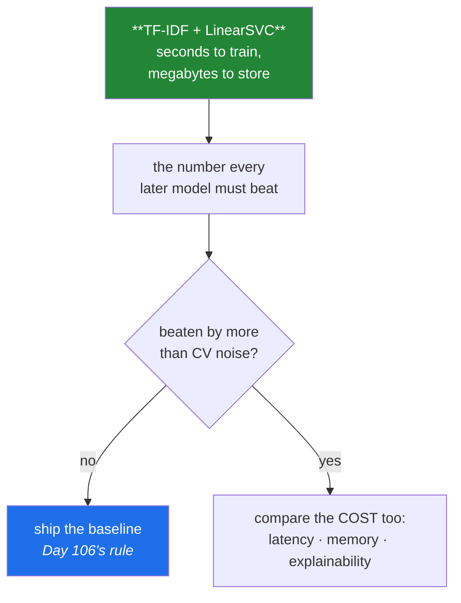

# Day 124 — The baseline to beat

**Phase 14 gate** · ID: **NLP-12** · Artifact: **a baseline card that Phase 15 must beat**

> **Yesterday:** word vectors, and the honest account of what the analogy result shows.
> **Today:** the phase closes by building the number that governs the next four phases. **TF-IDF plus
> a linear model is a genuinely strong text classifier**, and it is beaten by far less than people
> expect. Establishing it properly — with the right split, the right metric, and every preprocessing
> choice recorded — is what makes every later comparison meaningful.
> **Tomorrow:** Phase 15, deep learning foundations.

```bash
./m start 124 && ./m scaffold 124
```

**Time:** 2.5 hours (gate day). **Request budget:** 0 model calls.

---

## §1 The story

Phases 15 through 19 will build increasingly expensive models. Every one of them needs an answer to
*"compared to what?"*, and today produces it.



**A baseline that is not honestly built is worse than no baseline**, because it makes every subsequent
model look better than it is. Three ways it goes wrong, and today's pipeline prevents all three.

**An under-tuned baseline.** Comparing a hand-tuned transformer against `TfidfVectorizer()` with
defaults measures your effort, not the methods — Day 113's first unfairness, in a new setting. The
baseline gets a real search over `min_df`, `ngram_range` and `C`.

**A leaked baseline.** The vectoriser and the IDF are both fitted state (Days 121–122). Fit them
before splitting and the baseline is inflated, which makes the *later* models look worse — an
unfairness in the opposite direction, and rarer precisely because nobody checks it.

**A baseline reported without its cost.** TF-IDF trains in seconds and the model is a few megabytes.
If a transformer beats it by half a point at a hundred times the latency, **the honest artifact records
both numbers** and lets a person decide.

And the thing this project is really for: **a text classifier fails in ways a tabular model does
not.** Vocabulary drifts (Day 121's OOV monitor), classes are imbalanced, and the same document can
belong to two classes. Today's report has to say what happens then.

---

## §2 Setup — run this

```bash
mkdir -p days/day-124/lab reports
touch days/day-124/lab/classify.py
touch reports/day124_baseline_card.md
```

**Provenance (Principle 9).** Add a `data/raw/SOURCE.md` row for the corpus: source, licence, date
range, and **how the labels were produced**. Newsgroup and review corpora often carry structural
artefacts — headers, footers, quoted replies — that leak the label. §3 tests for exactly that.

---

## §3 NLP-12 — the baseline, honestly

`days/day-124/lab/classify.py`:

```python
"""NLP-12: a TF-IDF baseline built so that beating it means something."""

from __future__ import annotations

import json
import time
from pathlib import Path

import numpy as np
from sklearn.calibration import CalibratedClassifierCV
from sklearn.feature_extraction.text import TfidfVectorizer
from sklearn.linear_model import LogisticRegression
from sklearn.metrics import classification_report, f1_score
from sklearn.model_selection import (
    RandomizedSearchCV,
    StratifiedKFold,
    cross_val_score,
    train_test_split,
)
from sklearn.pipeline import Pipeline
from sklearn.svm import LinearSVC

from setu.arrays import make_rng

SEED = 42


def corpus():
    """Replace with a real corpus; record it in SOURCE.md first (Principle 9)."""
    from sklearn.datasets import fetch_20newsgroups

    categories = ["rec.sport.hockey", "sci.med", "comp.graphics", "talk.politics.guns"]
    kwargs = dict(categories=categories, shuffle=True, random_state=SEED,
                  remove=("headers", "footers", "quotes"))
    train = fetch_20newsgroups(subset="train", **kwargs)
    test = fetch_20newsgroups(subset="test", **kwargs)
    return train, test


def the_structural_leak_first() -> None:
    """Before anything: does the corpus leak the label structurally?"""
    from sklearn.datasets import fetch_20newsgroups

    categories = ["rec.sport.hockey", "sci.med"]
    with_metadata = fetch_20newsgroups(subset="train", categories=categories,
                                       random_state=SEED)
    without = fetch_20newsgroups(subset="train", categories=categories,
                                 remove=("headers", "footers", "quotes"),
                                 random_state=SEED)

    cv = StratifiedKFold(4, shuffle=True, random_state=SEED)
    pipeline = Pipeline([("tfidf", TfidfVectorizer(min_df=2)),
                         ("model", LinearSVC(random_state=SEED))])

    leaked = cross_val_score(pipeline, with_metadata.data, with_metadata.target,
                             cv=cv, scoring="f1_macro").mean()
    clean = cross_val_score(pipeline, without.data, without.target,
                            cv=cv, scoring="f1_macro").mean()

    print(f"\n  {'corpus':<34} {'CV macro-F1':>12}")
    print(f"  {'with headers/footers/quotes':<34} {leaked:>12.4f}")
    print(f"  {'metadata removed':<34} {clean:>12.4f}")
    print(f"  {'inflation':<34} {leaked - clean:>+12.4f}")

    print("\n  🚨 The headers contain the newsgroup name. The model reads the LABEL")
    print("     out of the text, and 20 Newsgroups is famous for this.")
    print("\n  Day 87's provenance question, in text form: HOW was this document")
    print("  assembled, and does the assembly encode the answer?")
    print("\n  ⚠️ Every corpus has a version of this — a review site's rating template,")
    print("     a ticket system's category prefix, an email footer. Check FIRST, before")
    print("     any number you produce becomes something you have to retract.")


def the_baseline_baseline() -> None:
    """Before TF-IDF: what does predicting the majority class get?"""
    train, test = corpus()
    counts = np.bincount(train.target)

    print(f"\n  {len(train.data):,} train, {len(test.data):,} test documents")
    print(f"\n  {'class':<24} {'train':>7} {'share':>8}")
    for i, name in enumerate(train.target_names):
        print(f"  {name:<24} {counts[i]:>7} {counts[i] / counts.sum():>8.2%}")

    majority = counts.argmax()
    accuracy = (test.target == majority).mean()
    macro = f1_score(test.target, np.full(len(test.target), majority), average="macro")

    print(f"\n  always predict '{train.target_names[majority]}':")
    print(f"    accuracy  : {accuracy:.4f}")
    print(f"    macro F1  : {macro:.4f}")

    print("\n  ⚠️ Note the gap between the two. Accuracy rewards the majority class;")
    print("     macro F1 averages over classes and punishes ignoring the small ones.")
    print("     On a balanced corpus they agree; on an imbalanced one they do not,")
    print("     and macro F1 is the honest choice (Day 100).")


def the_pipeline_prevents_the_leak() -> None:
    train, _ = corpus()

    wrong = TfidfVectorizer(min_df=2).fit(train.data)
    print(f"\n  ❌ fitting the vectoriser on everything: "
          f"{len(wrong.get_feature_names_out()):,} features")
    print("     — the vocabulary AND the idf weights saw every document (Days 121–122)")

    x_train, x_val, y_train, y_val = train_test_split(
        train.data, train.target, test_size=0.25, stratify=train.target,
        random_state=SEED
    )
    right = TfidfVectorizer(min_df=2).fit(x_train)
    print(f"\n  ✅ fitting on the training split only: "
          f"{len(right.get_feature_names_out()):,} features")

    pipeline = Pipeline([("tfidf", TfidfVectorizer(min_df=2)),
                         ("model", LinearSVC(random_state=SEED))])
    print("\n  The Pipeline is what makes this automatic: cross_val_score refits the")
    print("  vectoriser inside every fold, so no fold ever sees its own validation")
    print("  vocabulary (Day 83).")
    print(f"\n  pipeline steps: {[name for name, _ in pipeline.steps]}")

    print("\n  🚨 The manual version — vectorise, then split — is the single most")
    print("     common text-pipeline leak, and it produces no error at all.")


def tune_the_baseline_properly() -> None:
    """Day 113's first unfairness: an under-tuned baseline measures your effort."""
    train, _ = corpus()

    pipeline = Pipeline([
        ("tfidf", TfidfVectorizer()),
        ("model", LinearSVC(random_state=SEED)),
    ])
    space = {
        "tfidf__min_df": [1, 2, 3, 5],
        "tfidf__max_df": [0.5, 0.7, 0.9, 1.0],
        "tfidf__ngram_range": [(1, 1), (1, 2)],
        "tfidf__sublinear_tf": [False, True],
        "tfidf__stop_words": [None, "english"],
        "model__C": np.logspace(-2, 2, 40),
    }

    search = RandomizedSearchCV(
        pipeline, space, n_iter=30,
        cv=StratifiedKFold(4, shuffle=True, random_state=SEED),
        scoring="f1_macro", random_state=SEED, n_jobs=-1,
    ).fit(train.data, train.target)

    print(f"\n  30 configurations, 4-fold CV:")
    print(f"    best CV macro-F1 : {search.best_score_:.4f}")
    for key, value in sorted(search.best_params_.items()):
        print(f"    {key:<24} {value}")

    scores = search.cv_results_["mean_test_score"]
    print(f"\n    spread across configurations: {scores.min():.4f} – {scores.max():.4f}")
    print(f"    CV sd of the best            : "
          f"{search.cv_results_['std_test_score'][search.best_index_]:.4f}")

    print("\n  ⚠️ That spread is why an untuned baseline is unfair: the gap between the")
    print("     worst and best configuration here may exceed the gap a transformer")
    print("     will later claim over the baseline.")
    print("\n  ⚠️ And remember Day 112: `best_score_` selected these parameters, so it")
    print("     is optimistic. The test number below is the one to report.")
    return search


def compare_the_linear_models() -> None:
    train, _ = corpus()
    cv = StratifiedKFold(4, shuffle=True, random_state=SEED)
    vectoriser = dict(min_df=2, ngram_range=(1, 2), sublinear_tf=True)

    from sklearn.naive_bayes import ComplementNB, MultinomialNB
    from sklearn.linear_model import SGDClassifier

    print(f"\n  {'model':<28} {'CV macro-F1':>12} {'CV sd':>8} {'fit time':>10}")
    results = {}
    for label, model in (
        ("LinearSVC", LinearSVC(random_state=SEED)),
        ("LogisticRegression", LogisticRegression(max_iter=2_000, random_state=SEED)),
        ("SGDClassifier (hinge)", SGDClassifier(random_state=SEED)),
        ("MultinomialNB", MultinomialNB()),
        ("ComplementNB", ComplementNB()),
    ):
        pipeline = Pipeline([("tfidf", TfidfVectorizer(**vectoriser)), ("model", model)])
        start = time.perf_counter()
        scores = cross_val_score(pipeline, train.data, train.target, cv=cv,
                                 scoring="f1_macro", n_jobs=-1)
        elapsed = time.perf_counter() - start
        results[label] = scores
        print(f"  {label:<28} {scores.mean():>12.4f} {scores.std(ddof=1):>8.4f} "
              f"{elapsed:>9.2f}s")

    best = max(results, key=lambda k: results[k].mean())
    sd = results[best].std(ddof=1)
    within = [k for k, v in results.items() if v.mean() >= results[best].mean() - sd]
    print(f"\n  best: {best}")
    print(f"  within one CV sd: {within}")

    print("\n  ⚠️ LinearSVC is usually the strongest and has no `predict_proba`.")
    print("     If you need probabilities, wrap it in CalibratedClassifierCV or use")
    print("     LogisticRegression — Day 101's requirement, not an afterthought.")
    print("\n  ⚠️ ComplementNB is designed for imbalanced text and often beats")
    print("     MultinomialNB there. Both are seconds to train and worth the row.")


def the_final_evaluation(search) -> None:
    """Day 106's order: tune on train, refit, score on test ONCE."""
    train, test = corpus()

    model = search.best_estimator_
    start = time.perf_counter()
    predicted = model.predict(test.data)
    predict_time = time.perf_counter() - start

    macro = f1_score(test.target, predicted, average="macro")
    majority = np.bincount(train.target).argmax()
    baseline_macro = f1_score(test.target,
                              np.full(len(test.target), majority), average="macro")

    print(f"\n  1. tuned on TRAIN folds     : CV macro-F1 = {search.best_score_:.4f}")
    print(f"  2. refit on all of train    : done by RandomizedSearchCV")
    print(f"  3. scored on TEST, once     : macro-F1 = {macro:.4f}")
    print(f"     optimism of the CV number: {search.best_score_ - macro:+.4f}")
    print(f"  4. majority-class baseline  : macro-F1 = {baseline_macro:.4f}")
    print(f"     lift over baseline       : {macro - baseline_macro:+.4f}")

    print(f"\n{classification_report(test.target, predicted, target_names=test.target_names, digits=4)}")

    print(f"  prediction time for {len(test.data):,} documents: {predict_time:.3f}s "
          f"({predict_time / len(test.data) * 1000:.3f} ms/doc)")

    print("\n  ⚠️ Read the per-class column. A good macro-F1 can hide one class that")
    print("     the model cannot do at all, and that class is usually the one someone")
    print("     cares about.")


def what_this_costs_to_run() -> None:
    train, _ = corpus()
    pipeline = Pipeline([
        ("tfidf", TfidfVectorizer(min_df=2, ngram_range=(1, 2), sublinear_tf=True)),
        ("model", LinearSVC(random_state=SEED)),
    ])

    start = time.perf_counter()
    pipeline.fit(train.data, train.target)
    fit_time = time.perf_counter() - start

    matrix = pipeline.named_steps["tfidf"].transform(train.data)
    coefficients = pipeline.named_steps["model"].coef_

    import pickle

    size = len(pickle.dumps(pipeline))

    print(f"\n  {'fit time':<28} {fit_time:>10.2f} s")
    print(f"  {'features':<28} {matrix.shape[1]:>10,}")
    print(f"  {'matrix density':<28} {matrix.nnz / (matrix.shape[0] * matrix.shape[1]):>10.4%}")
    print(f"  {'coefficients':<28} {coefficients.size:>10,}")
    print(f"  {'pickled model size':<28} {size / 1e6:>10.1f} MB")
    print(f"  {'GPU required':<28} {'no':>10}")
    print(f"  {'inference dependencies':<28} {'scikit-learn':>10}")

    print("\n  🚨 THIS is the column a later model must justify against. Beating the")
    print("     macro-F1 by half a point at 100x the latency and a GPU requirement is")
    print("     a trade, not a win — and the artifact must record both sides.")


def what_the_model_learned() -> None:
    train, _ = corpus()
    pipeline = Pipeline([
        ("tfidf", TfidfVectorizer(min_df=2, sublinear_tf=True)),
        ("model", LinearSVC(random_state=SEED)),
    ]).fit(train.data, train.target)

    terms = pipeline.named_steps["tfidf"].get_feature_names_out()
    coefficients = pipeline.named_steps["model"].coef_

    print("\n  strongest features per class:")
    for i, name in enumerate(train.target_names):
        top = np.argsort(coefficients[i])[::-1][:8]
        print(f"\n    {name}")
        print(f"      {[terms[j] for j in top]}")

    print("\n  ✅ A linear model on TF-IDF is INTERPRETABLE for free — the coefficient")
    print("     IS the explanation, no SHAP required (Day 114).")
    print("\n  ⚠️ And read the lists critically. A person's name, a date, or an artefact")
    print("     like 'edu' appearing among the top features is a leak signal, exactly")
    print("     as an ID column was on Day 114.")


def where_this_baseline_fails() -> None:
    print("\n  the honest limitations, none of which the test score shows:")
    print("\n    - VOCABULARY DRIFT. New terms are simply invisible. Monitor the OOV")
    print("      rate (Day 121); it needs no labels and rises before accuracy falls.")
    print("\n    - NO WORD ORDER beyond the n-gram window. 'not recommended' is caught")
    print("      by bigrams; 'I would not say this is good' is not (Day 121).")
    print("\n    - NO SYNONYMY. A document using entirely different words for the same")
    print("      topic scores near zero similarity (Days 122–123).")
    print("\n    - SHORT TEXTS. IDF needs document frequencies; a three-word query")
    print("      carries almost no signal.")
    print("\n    - ONE LABEL PER DOCUMENT. A document spanning two classes is forced")
    print("      into one, and the confusion matrix blames the model.")
    print("\n    - LANGUAGE. The vocabulary is language-specific; nothing transfers.")
    print("\n  ⚠️ Each of these is a genuine reason a later model might win. Naming them")
    print("     is what makes the comparison honest rather than defensive.")


def write_the_baseline_card(search) -> None:
    train, test = corpus()
    predicted = search.best_estimator_.predict(test.data)
    macro = f1_score(test.target, predicted, average="macro")
    majority = np.bincount(train.target).argmax()
    baseline = f1_score(test.target, np.full(len(test.target), majority), average="macro")

    payload = {
        "corpus": "20newsgroups (4 categories, metadata removed)",
        "n_train": len(train.data),
        "n_test": len(test.data),
        "metric": "macro F1",
        "majority_baseline": round(float(baseline), 4),
        "cv_macro_f1": round(float(search.best_score_), 4),
        "test_macro_f1": round(float(macro), 4),
        "optimism": round(float(search.best_score_ - macro), 4),
        "best_params": {k: str(v) for k, v in search.best_params_.items()},
        "n_search_configurations": 30,
        "seed": SEED,
    }
    Path("reports/day124_baseline.json").write_text(json.dumps(payload, indent=2),
                                                     encoding="utf-8")
    print(f"\n  wrote reports/day124_baseline.json")
    for key, value in payload.items():
        if not isinstance(value, dict):
            print(f"    {key:<28} {value}")

    print("\n  🚨 This file is what Phase 15 onwards compares against. It records the")
    print("     search budget too — because a baseline tuned for 30 configurations")
    print("     and a model tuned for 300 is not a fair comparison (Day 113).")


if __name__ == "__main__":
    the_structural_leak_first()
    the_baseline_baseline()
    the_pipeline_prevents_the_leak()
    search = tune_the_baseline_properly()
    compare_the_linear_models()
    the_final_evaluation(search)
    what_this_costs_to_run()
    what_the_model_learned()
    where_this_baseline_fails()
    write_the_baseline_card(search)
```

**Line by line:**

- `the_structural_leak_first` — **run this before anything else.** The headers contain the newsgroup
  name, so the model reads the label out of the text. **Day 87's provenance question in text form:
  how was this document assembled, and does the assembly encode the answer?** Every corpus has a
  version — a rating template, a ticket prefix, an email footer.
- `the_baseline_baseline` — **note the gap between accuracy and macro F1.** Accuracy rewards the
  majority class; macro F1 averages over classes and punishes ignoring small ones. On an imbalanced
  corpus they disagree and **macro F1 is the honest choice** (Day 100).
- `the_pipeline_prevents_the_leak` — the `Pipeline` refits the vectoriser **inside every fold**, so no
  fold sees its own validation vocabulary. **The manual version — vectorise, then split — is the single
  most common text-pipeline leak, and it produces no error.**
- `tune_the_baseline_properly` — **the spread across configurations may exceed the gap a transformer
  later claims.** That is why an untuned baseline is unfair (Day 113's first unfairness). And
  `best_score_` selected the parameters, so it is optimistic (Day 112).
- `compare_the_linear_models` — five models in seconds each. **LinearSVC is usually strongest and has
  no `predict_proba`** — if you need probabilities, calibrate it or use logistic regression, which is
  Day 101's requirement rather than an afterthought. **ComplementNB is designed for imbalanced text.**
- `the_final_evaluation` — Day 106's four-step order, with the optimism reported. And **read the
  per-class column**: a good macro-F1 can hide one class the model cannot do at all, **and that class
  is usually the one someone cares about.**
- `what_this_costs_to_run` — **this is the column a later model must justify against.** Beating the
  macro-F1 by half a point at 100× the latency and a GPU requirement is **a trade, not a win**, and the
  artifact records both sides.
- `what_the_model_learned` — a linear model on TF-IDF is **interpretable for free**; the coefficient
  *is* the explanation, no SHAP required. And **read the lists critically**: a name, a date or `edu`
  among the top features is a leak signal, exactly as an ID column was on Day 114.
- `where_this_baseline_fails` — six limitations, **none of which the test score shows.** Naming them
  is what makes the comparison honest rather than defensive — each one is a genuine reason a later
  model might win.
- `write_the_baseline_card` — **the file Phase 15 onwards compares against**, and it records the
  **search budget**, because 30 configurations against 300 is not a fair comparison.

---

## §4 Build brief

Extend `src/setu/nlp.py`:

```python
def structural_leak_screen(documents, labels, *, patterns: dict | None = None) -> dict:
    """TODO(me): §3.1 — does the corpus encode its own label?

    {"suspicious_terms": {label: [(term, score)]}, "near_perfect_terms": [...],
     "verdict", "questions": [...], "warnings": [...]}
    - a term whose presence predicts one label with precision above ~0.95 AND
      appears in over 5% of that label's documents is a structural leak candidate
    - `patterns` lets a caller name known metadata shapes (header prefixes, footers)
    - `questions` must be things a PERSON answers: where did this text come from,
      was it templated, is this field present at prediction time (Day 87)
    - the verdict must NOT be definite — it is a screen (Day 87's rule)
    - raise DataError on a length mismatch
    """
    raise NotImplementedError


def majority_baseline(labels_train, labels_test) -> dict:
    """TODO(me): §3.2 — the number before any model.

    {"majority_class", "accuracy", "macro_f1", "gap", "recommended_metric",
     "statement"}
    - gap is accuracy − macro_f1; a large gap means the corpus is imbalanced and
      accuracy is measuring the base rate (Day 100)
    - recommended_metric is 'macro f1' when gap > 0.1, else either
    - the statement must present these AS BASELINES, so no later score is quoted
      without them (Day 78)
    - raise DataError on an empty test set
    """
    raise NotImplementedError


def build_text_pipeline(*, model: str = "linear_svc", needs_probabilities: bool = False,
                        **vectoriser_kwargs) -> dict:
    """TODO(me): a Pipeline that cannot leak.

    {"pipeline", "steps": [...], "provides_probabilities": bool, "warnings": [...]}
    - the vectoriser MUST be inside the Pipeline, so it refits per fold (§3.3)
    - needs_probabilities with model='linear_svc' -> wrap in CalibratedClassifierCV
      and say so in warnings; LinearSVC has no predict_proba (§3.5) and discovering
      that after training is a waste of a day
    - provides_probabilities must be accurate — a caller planning a cost-based
      threshold (Day 100) needs to know before they build on it
    - raise DataError on an unknown model, listing the known ones
    """
    raise NotImplementedError


def tune_baseline(documents, labels, *, cv, n_iter: int = 30, scoring: str = "f1_macro",
                  seed: int = 42) -> dict:
    """TODO(me): §3.4 — a baseline tuned enough to be fair.

    {"search", "best_params", "best_cv_score", "score_spread", "n_iter",
     "configurations_tried", "warnings": [...]}
    - the space must cover min_df, max_df, ngram_range, sublinear_tf and C — those
      are the parameters that move the score
    - score_spread is max − min across configurations; report it, because it is the
      evidence that tuning the baseline MATTERED (§3.4)
    - WARN when n_iter < 20: an under-tuned baseline makes every later model look
      better than it is, which is Day 113's first unfairness
    - the docstring must state that best_cv_score is optimistic (Day 112)
    - raise DataError on fewer than 2 classes
    """
    raise NotImplementedError


def baseline_card(*, corpus_description: str, n_train: int, n_test: int,
                  metric: str, majority_baseline: float, cv_score: float,
                  test_score: float, best_params: dict, n_configurations: int,
                  cost: dict, limitations: list[str]) -> str:
    """TODO(me): the gate artifact — the number Phase 15 must beat.

    - must include: the metric AND the majority baseline, the CV optimism, the
      search budget, the cost profile, and at least four limitations
    - `cost` must contain fit_seconds, model_bytes, ms_per_document and
      requires_gpu — a later model beating this must justify its cost too (§3.7)
    - raise DataError if n_configurations < 10: a baseline barely tuned is not a
      baseline, and recording it as one is worse than having none
    - raise DataError if limitations has fewer than 4 entries — the honest reasons
      a later model might win (§3.9)
    - raise DataError if cost is missing any required key, naming which
    """
    raise NotImplementedError


def compare_against_baseline(*, baseline_card_path: str, new_score: float,
                             new_cost: dict, cv_sd: float) -> dict:
    """TODO(me): the function Phase 15 onwards actually calls.

    {"baseline_score", "new_score", "improvement", "beats_baseline": bool,
     "beats_noise": bool, "cost_ratio": {...}, "verdict", "reason"}
    - beats_noise requires the improvement to exceed cv_sd (Day 106's rule)
    - cost_ratio compares each cost key; a 100x latency increase for a 0.005 F1
      gain must be VISIBLE in the output, not buried
    - when beats_noise is False the verdict must recommend the BASELINE, and the
      reason must say the difference is within noise
    - when the search budgets differ by more than 3x, warn that the comparison is
      unfair (Day 113)
    - raise DataError if the card is missing or lacks a test score
    """
    raise NotImplementedError
```

- `baseline_card` **refusing fewer than 10 configurations** encodes §3.4: recording an under-tuned
  model as "the baseline" is worse than having none, because it silently inflates every later
  comparison.
- `compare_against_baseline` **recommending the baseline when the gain is within noise** is the day's
  design decision, and it is Day 106's one-standard-error rule pointed at the next four phases.
- The **`cost_ratio`** being surfaced rather than buried is what makes "beat it by half a point at 100×
  the latency" a visible trade rather than a headline win.

---

## §5 The eval that must be able to fail

Add to `tests/test_nlp.py`:

```python
from setu.nlp import (
    baseline_card,
    build_text_pipeline,
    compare_against_baseline,
    majority_baseline,
    structural_leak_screen,
    tune_baseline,
)


def _labelled_corpus(n=400, seed=0):
    rng = make_rng(seed)
    positive = ["excellent brilliant moving performance film cinema",
                "wonderful superb acting direction beautiful"]
    negative = ["dull tedious clumsy plot film cinema",
                "awful boring predictable acting weak"]
    documents, labels = [], []
    for i in range(n):
        source = positive if i % 2 == 0 else negative
        words = rng.choice(" ".join(source).split(), 12)
        documents.append(" ".join(words))
        labels.append(i % 2)
    return documents, np.array(labels)


def test_a_planted_structural_leak_is_found():
    """The header contains the label — 20 Newsgroups' famous problem."""
    documents, labels = _labelled_corpus()
    leaked = [f"Newsgroup: class{label}\n{text}"
              for text, label in zip(documents, labels, strict=True)]
    result = structural_leak_screen(leaked, labels)
    terms = {t for label_terms in result["suspicious_terms"].values()
             for t, _ in label_terms}
    assert any("class" in t for t in terms)


def test_a_clean_corpus_raises_no_suspicion():
    """A screen that always fires is useless."""
    documents, labels = _labelled_corpus()
    result = structural_leak_screen(documents, labels)
    assert result["near_perfect_terms"] == []


def test_the_leak_screen_asks_human_questions():
    """Where did this text come from; was it templated (Day 87)."""
    documents, labels = _labelled_corpus()
    questions = " ".join(structural_leak_screen(documents, labels)["questions"]).lower()
    assert "template" in questions or "prediction time" in questions or "come from" in questions


def test_the_leak_verdict_is_not_definite():
    documents, labels = _labelled_corpus()
    verdict = structural_leak_screen(documents, labels)["verdict"].lower()
    assert "definitely" not in verdict
    assert "check" in verdict or "review" in verdict or "suspect" in verdict


def test_the_screen_rejects_a_length_mismatch():
    with pytest.raises(DataError):
        structural_leak_screen(["a", "b"], np.array([0]))


def test_accuracy_and_macro_f1_disagree_on_imbalanced_data():
    """Accuracy measures the base rate (Day 100)."""
    train = np.array([0] * 950 + [1] * 50)
    test = np.array([0] * 190 + [1] * 10)
    result = majority_baseline(train, test)
    assert result["accuracy"] > 0.9
    assert result["macro_f1"] < 0.5
    assert result["gap"] > 0.4


def test_macro_f1_is_recommended_when_the_gap_is_large():
    train = np.array([0] * 950 + [1] * 50)
    test = np.array([0] * 190 + [1] * 10)
    assert "macro" in majority_baseline(train, test)["recommended_metric"]


def test_a_balanced_corpus_shows_a_small_gap():
    train = np.array([0] * 500 + [1] * 500)
    test = np.array([0] * 100 + [1] * 100)
    assert majority_baseline(train, test)["gap"] < 0.4


def test_the_baseline_statement_calls_itself_a_baseline():
    """So no later score is quoted without it (Day 78)."""
    train = np.array([0] * 100 + [1] * 100)
    statement = majority_baseline(train, train)["statement"].lower()
    assert "baseline" in statement


def test_majority_baseline_needs_a_test_set():
    with pytest.raises(DataError):
        majority_baseline(np.array([0, 1]), np.array([]))


def test_the_vectoriser_lives_inside_the_pipeline():
    """So it refits per fold and cannot leak (Day 83)."""
    result = build_text_pipeline()
    step_names = [name for name, _ in result["pipeline"].steps]
    assert "tfidf" in step_names or any("tfidf" in n for n in step_names)
    assert len(result["pipeline"].steps) >= 2


def test_the_pipeline_refits_the_vectoriser_per_fold():
    """The actual guarantee, not just the structure."""
    from sklearn.model_selection import StratifiedKFold, cross_val_score

    documents, labels = _labelled_corpus(n=200)
    pipeline = build_text_pipeline(min_df=1)["pipeline"]
    scores = cross_val_score(pipeline, documents, labels,
                             cv=StratifiedKFold(3, shuffle=True, random_state=0),
                             scoring="f1_macro")
    assert len(scores) == 3
    assert scores.mean() > 0.5


def test_linear_svc_provides_no_probabilities():
    """Discovering this after training wastes a day."""
    result = build_text_pipeline(model="linear_svc", needs_probabilities=False)
    assert result["provides_probabilities"] is False


def test_requesting_probabilities_wraps_the_model():
    result = build_text_pipeline(model="linear_svc", needs_probabilities=True)
    assert result["provides_probabilities"] is True
    assert result["warnings"]
    assert any("calibrat" in w.lower() for w in result["warnings"])


def test_logistic_regression_provides_probabilities_directly():
    result = build_text_pipeline(model="logistic", needs_probabilities=True)
    assert result["provides_probabilities"] is True


def test_an_unknown_model_lists_the_known_ones():
    with pytest.raises(DataError) as info:
        build_text_pipeline(model="transformer")
    assert "linear_svc" in str(info.value) or "logistic" in str(info.value)


def test_tuning_moves_the_score_substantially():
    """Today's real assessment: an untuned baseline is unfair."""
    from sklearn.model_selection import StratifiedKFold

    documents, labels = _labelled_corpus(n=400)
    result = tune_baseline(documents, labels,
                           cv=StratifiedKFold(3, shuffle=True, random_state=0),
                           n_iter=20, seed=0)
    assert result["score_spread"] > 0.01, (
        "if tuning changes nothing, the search space is wrong"
    )


def test_the_search_space_covers_the_parameters_that_matter():
    from sklearn.model_selection import StratifiedKFold

    documents, labels = _labelled_corpus(n=200)
    result = tune_baseline(documents, labels,
                           cv=StratifiedKFold(3, shuffle=True, random_state=0),
                           n_iter=12, seed=0)
    searched = " ".join(result["best_params"]).lower()
    assert "min_df" in searched or "ngram" in searched
    assert "c" in searched


def test_a_small_search_budget_is_warned_about():
    """Day 113's first unfairness."""
    from sklearn.model_selection import StratifiedKFold

    documents, labels = _labelled_corpus(n=200)
    result = tune_baseline(documents, labels,
                           cv=StratifiedKFold(3, shuffle=True, random_state=0),
                           n_iter=5, seed=0)
    assert result["warnings"]


def test_the_tuning_docstring_says_the_cv_score_is_optimistic():
    assert "optimistic" in tune_baseline.__doc__.lower()


def test_tuning_needs_two_classes():
    from sklearn.model_selection import StratifiedKFold

    with pytest.raises(DataError):
        tune_baseline(["a b", "c d"], np.array([0, 0]), cv=StratifiedKFold(2))


COST = {"fit_seconds": 3.2, "model_bytes": 4_200_000, "ms_per_document": 0.08,
        "requires_gpu": False}


def test_the_card_records_the_baseline_beside_the_score():
    card = baseline_card(
        corpus_description="20newsgroups, 4 categories, metadata removed",
        n_train=2_000, n_test=1_300, metric="macro F1",
        majority_baseline=0.11, cv_score=0.882, test_score=0.871,
        best_params={"tfidf__min_df": 2}, n_configurations=30, cost=COST,
        limitations=["vocabulary drift", "no synonymy", "no word order",
                     "one label per document"],
    ).lower()
    assert "0.11" in card
    assert "0.871" in card


def test_the_card_records_the_search_budget():
    """30 configurations against 300 is not a fair comparison (Day 113)."""
    card = baseline_card(
        corpus_description="x", n_train=100, n_test=50, metric="macro F1",
        majority_baseline=0.2, cv_score=0.8, test_score=0.78,
        best_params={}, n_configurations=30, cost=COST,
        limitations=["a", "b", "c", "d"],
    )
    assert "30" in card


def test_a_barely_tuned_baseline_is_refused():
    """Recording it as a baseline is worse than having none."""
    with pytest.raises(DataError) as info:
        baseline_card(corpus_description="x", n_train=100, n_test=50,
                      metric="macro F1", majority_baseline=0.2, cv_score=0.8,
                      test_score=0.78, best_params={}, n_configurations=3,
                      cost=COST, limitations=["a", "b", "c", "d"])
    assert "3" in str(info.value) or "configuration" in str(info.value).lower()


def test_too_few_limitations_are_refused():
    with pytest.raises(DataError):
        baseline_card(corpus_description="x", n_train=100, n_test=50,
                      metric="macro F1", majority_baseline=0.2, cv_score=0.8,
                      test_score=0.78, best_params={}, n_configurations=30,
                      cost=COST, limitations=["only one"])


def test_a_missing_cost_key_is_named():
    with pytest.raises(DataError) as info:
        baseline_card(corpus_description="x", n_train=100, n_test=50,
                      metric="macro F1", majority_baseline=0.2, cv_score=0.8,
                      test_score=0.78, best_params={}, n_configurations=30,
                      cost={"fit_seconds": 1.0},
                      limitations=["a", "b", "c", "d"])
    assert "ms_per_document" in str(info.value) or "requires_gpu" in str(info.value)


def test_the_card_reports_the_optimism():
    card = baseline_card(
        corpus_description="x", n_train=100, n_test=50, metric="macro F1",
        majority_baseline=0.2, cv_score=0.900, test_score=0.870,
        best_params={}, n_configurations=30, cost=COST,
        limitations=["a", "b", "c", "d"],
    )
    assert "0.03" in card or "optimism" in card.lower()


def _write_card(tmp_path, test_score=0.871):
    import json

    path = tmp_path / "baseline.json"
    path.write_text(json.dumps({
        "test_macro_f1": test_score, "metric": "macro F1",
        "n_search_configurations": 30,
        "cost": COST,
    }), encoding="utf-8")
    return str(path)


def test_a_gain_within_noise_recommends_the_baseline(tmp_path):
    """Day 106's rule, pointed at the next four phases."""
    result = compare_against_baseline(
        baseline_card_path=_write_card(tmp_path),
        new_score=0.874,
        new_cost={"fit_seconds": 3_600, "model_bytes": 440_000_000,
                  "ms_per_document": 12.0, "requires_gpu": True},
        cv_sd=0.012,
    )
    assert result["beats_noise"] is False
    assert "baseline" in result["verdict"].lower()
    assert "noise" in result["reason"].lower()


def test_a_real_gain_is_recognised(tmp_path):
    """A rule that never lets anything win is not a rule."""
    result = compare_against_baseline(
        baseline_card_path=_write_card(tmp_path),
        new_score=0.940,
        new_cost={"fit_seconds": 3_600, "model_bytes": 440_000_000,
                  "ms_per_document": 12.0, "requires_gpu": True},
        cv_sd=0.012,
    )
    assert result["beats_noise"] is True


def test_the_cost_ratio_is_visible(tmp_path):
    """100x latency for half a point must not be buried."""
    result = compare_against_baseline(
        baseline_card_path=_write_card(tmp_path),
        new_score=0.940,
        new_cost={"fit_seconds": 3_600, "model_bytes": 440_000_000,
                  "ms_per_document": 12.0, "requires_gpu": True},
        cv_sd=0.012,
    )
    assert result["cost_ratio"]["ms_per_document"] > 50
    assert result["cost_ratio"]["requires_gpu"] is True


def test_a_missing_card_raises(tmp_path):
    with pytest.raises(DataError):
        compare_against_baseline(baseline_card_path=str(tmp_path / "nope.json"),
                                 new_score=0.9, new_cost=COST, cv_sd=0.01)


def test_the_baseline_file_exists_and_is_complete():
    import json
    from pathlib import Path

    path = Path("reports/day124_baseline.json")
    if not path.exists():
        pytest.skip("run days/day-124/lab/classify.py")
    payload = json.loads(path.read_text(encoding="utf-8"))
    for key in ("metric", "majority_baseline", "cv_macro_f1", "test_macro_f1",
                "optimism", "n_search_configurations", "seed"):
        assert key in payload, f"baseline file missing: {key}"


def test_the_baseline_beats_the_majority_class():
    import json
    from pathlib import Path

    path = Path("reports/day124_baseline.json")
    if not path.exists():
        pytest.skip("run days/day-124/lab/classify.py")
    payload = json.loads(path.read_text(encoding="utf-8"))
    assert payload["test_macro_f1"] > payload["majority_baseline"] + 0.2


def test_the_baseline_card_report_is_complete():
    from pathlib import Path

    path = Path("reports/day124_baseline_card.md")
    assert path.exists(), "the baseline card was not written"
    text = path.read_text(encoding="utf-8").lower()
    for section in ("corpus", "split", "metric", "baseline", "search budget",
                    "cost", "limitations", "what would beat this"):
        assert section in text, f"baseline card missing: {section}"


def test_the_card_names_the_leak_check():
    from pathlib import Path

    text = Path("reports/day124_baseline_card.md").read_text(encoding="utf-8").lower()
    assert "leak" in text or "header" in text or "metadata" in text


def test_phase_14_nlp_module_is_complete():
    from setu import nlp

    expected = [
        "NormaliseSpec", "normalise", "validate_spec", "tokenise",
        "vocabulary_impact", "tokeniser_agreement",                          # Day 117
        "safe_stopwords", "compare_stopword_lists", "stem", "stemming_errors",
        "lemmatise", "measure_step_value", "word_normalisation_advice",      # Day 118
        "penn_to_wordnet", "tag_and_lemmatise", "most_frequent_tag_baseline",
        "ambiguity_report", "tagset_of", "tagger_domain_check",              # Day 119
        "bio_to_spans", "spans_to_bio", "entity_scores", "gazetteer_match",
        "case_sensitivity_report",                                            # Day 120
        "build_vocabulary", "to_bag_of_words", "order_sensitivity",
        "ngram_cost", "oov_monitor",                                          # Day 121
        "inverse_document_frequency", "term_frequency", "fit_tfidf",
        "transform_tfidf", "matches_sklearn", "top_terms",                   # Day 122
        "cosine_similarity", "cooccurrence_matrix", "ppmi", "svd_embeddings",
        "train_embeddings", "analogy", "measure_association_bias",
        "document_vector",                                                    # Day 123
        "structural_leak_screen", "majority_baseline", "build_text_pipeline",
        "tune_baseline", "baseline_card", "compare_against_baseline",        # Day 124
    ]
    missing = [name for name in expected if not hasattr(nlp, name)]
    assert not missing, f"Phase 14 is incomplete: {missing}"


def test_the_classifier_script_runs_end_to_end():
    import subprocess
    import sys
    from pathlib import Path

    if not Path("days/day-124/lab/classify.py").exists():
        pytest.skip("write the classifier first")
    result = subprocess.run([sys.executable, "days/day-124/lab/classify.py"],
                            capture_output=True, text=True, timeout=1_800)
    assert result.returncode == 0, f"classify.py failed:\n{result.stderr[-2000:]}"
    assert "baseline" in result.stdout.lower()
```

**Line by line:**

- `test_tuning_moves_the_score_substantially` — **the day's real assessment.** If tuning changes
  nothing, the search space is wrong — and an untuned baseline is Day 113's first unfairness, which
  makes **every later model look better than it is.**
- `test_a_gain_within_noise_recommends_the_baseline` with `test_a_real_gain_is_recognised` — the pair
  pins Day 106's rule at the phase boundary. A 0.003 gain at 100× the cost recommends the baseline;
  a genuine gain is recognised. **A rule that never lets anything win is not a rule.**
- `test_the_cost_ratio_is_visible` — asserts the **latency ratio and the GPU flag** are surfaced.
  Beating the score by half a point at 12 ms/document and a GPU requirement is a trade, and burying it
  turns a trade into a headline.
- `test_a_planted_structural_leak_is_found` with `test_a_clean_corpus_raises_no_suspicion` — positive
  and negative. **The header containing the label is 20 Newsgroups' famous problem**, and a screen that
  always fires teaches nothing.
- `test_accuracy_and_macro_f1_disagree_on_imbalanced_data` — accuracy above 0.9, macro F1 below 0.5 on
  the same predictions. **Accuracy measures the base rate**, and the gap is the diagnostic.
- `test_a_barely_tuned_baseline_is_refused` — under 10 configurations raises. **Recording an under-tuned
  model as "the baseline" is worse than having none**, because it silently inflates four phases of
  comparisons.
- `test_linear_svc_provides_no_probabilities` with `test_requesting_probabilities_wraps_the_model` —
  **discovering LinearSVC has no `predict_proba` after training wastes a day**, and Day 100's threshold
  arithmetic needs them.
- `test_the_pipeline_refits_the_vectoriser_per_fold` — not just that the structure is right, but that
  **cross-validation actually runs through it**, which is the guarantee that matters.
- `test_phase_14_nlp_module_is_complete` — 49 functions across eight days, with the failure naming what
  is missing.

```bash
uv run python days/day-124/lab/classify.py
uv run python -m pytest tests/test_nlp.py -v
uv run python -m pytest -q
```

---

## §6 The artifact — the baseline card

`reports/day124_baseline_card.md`. This one governs four phases.

- **The corpus.** Source, licence, dates, and **how the labels were produced** (Principle 9).
- **The leak check.** What `structural_leak_screen` found, and what you did about it. If metadata was
  removed, say what and why.
- **The split.** Train/test, stratified, with the seed. If documents share an author or a thread,
  **group them** (Day 97).
- **The metric, and why.** Macro F1 with the majority baseline beside it. Accuracy explicitly rejected
  if the corpus is imbalanced.
- **The search budget.** How many configurations, over what space. **This is what makes a later
  comparison fair** (Day 113).
- **The result.** CV score, test score, and the **optimism** between them (Day 112). Per-class scores,
  not just the average.
- **The cost.** Fit time, model size, ms per document, GPU required. **The column a later model must
  justify against.**
- **What the model learned.** Top features per class, read critically for leak signals (Day 114).
- **Limitations.** At least four, specific — the honest reasons a later model might win.
- **What would beat this.** Name the mechanisms: word order, synonymy, transfer learning. That is the
  bridge into Phase 15.

---

## §7 Request budget

| Resource | Spent today |
|---|---|
| LLM calls | **0** |
| Compute | ~30 pipeline fits in the search; minutes on a laptop |

---

## §8 Traps

- **Skipping the structural leak check.** The headers may contain the label.
- **Reporting accuracy on an imbalanced corpus.** It measures the base rate.
- **Vectorising before splitting.** Day 121–122's leak, and it raises nothing.
- **An untuned baseline.** Every later model looks better than it is.
- **A baseline tuned for 5 configurations against a model tuned for 300.** Unfair.
- **Reporting the CV score.** It selected the parameters (Day 112).
- **Only the macro average.** One class may be at zero.
- **`LinearSVC` when you need probabilities.** No `predict_proba`.
- **A baseline without its cost.** Then "beating it" means nothing.
- **Fewer than four stated limitations.** Defensive rather than honest.
- **Not monitoring OOV in production.** Vocabulary drift is silent (Day 121).
- **Assuming a transformer will win.** Check against the CV standard deviation.

---

## §9 Verify before you code

Written **2026-08-21**:

- <https://scikit-learn.org/stable/tutorial/text_analytics/working_with_text_data.html> — the
  canonical pipeline, and its own note about the newsgroup metadata leak.
- <https://scikit-learn.org/stable/datasets/real_world.html#the-20-newsgroups-text-dataset> — the
  `remove` parameter and why it exists.
- <https://scikit-learn.org/stable/modules/generated/sklearn.svm.LinearSVC.html> — confirm it has no
  `predict_proba`.
- <https://scikit-learn.org/stable/modules/generated/sklearn.naive_bayes.ComplementNB.html> — designed
  for imbalanced text.

---

## §10 Say it in an interview

> "The point of this project is the number, not the model. TF-IDF with a linear SVM trains in seconds,
> the artifact is a few megabytes, it runs on a CPU, and the coefficients *are* the explanation — and
> it's beaten by far less than people expect. But a baseline only means something if it's built
> honestly, and there are three ways it isn't. It has to be tuned — comparing a hand-tuned transformer
> against `TfidfVectorizer()` with defaults measures your effort, not the methods, and I found the
> spread across thirty configurations was larger than the margin a bigger model would later claim. It
> has to not leak — the vectoriser and the IDF are both fitted state, so it lives inside the Pipeline
> and refits per fold. And it has to be reported with its *cost*, because beating it by half a point at
> a hundred times the latency and a GPU requirement is a trade, not a win. I'd also run a structural
> leak check on the corpus first: 20 Newsgroups is famous for having the newsgroup name in the headers,
> so the model reads the label out of the text, and every corpus has some version of that."

---

## §11 Done when — **Phase 14 gate**

Tick [`CHECKLIST.md`](CHECKLIST.md), then:

```bash
./m check
./m done 124
./m status
```

**Gate criteria:** `days/day-124/lab/classify.py` runs in one command and exits 0 · the structural leak
screen ran **before** any model, and what it found is recorded · the vectoriser lives **inside** the
Pipeline and refits per fold · the baseline was tuned over at least 20 configurations, and the spread
is reported · macro F1 reported with the majority baseline beside it, and accuracy explicitly rejected
if imbalanced · per-class scores reported, not just the average · the test set was scored **once**, with
the CV optimism stated · the cost profile recorded (fit time, model size, ms/document, GPU) ·
`reports/day124_baseline_card.md` complete with at least four limitations and a "what would beat this"
section · `reports/day124_baseline.json` written for Phase 15 to compare against ·
`test_phase_14_nlp_module_is_complete` green (49 functions).

Tomorrow: Phase 15, where the first neural model has a number to beat.
