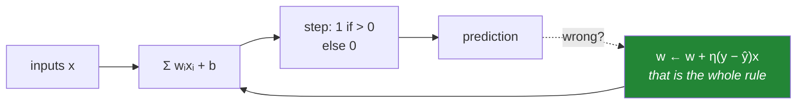

# Day 125 — The perceptron, by hand

**Phase 15 · Module 15 · Deep learning foundations** · IDs: **DL-01** (why deep learning now), **DL-02** (the perceptron)

> **Yesterday:** Phase 14 closed with a TF-IDF baseline that every model in this phase must beat —
> with its cost recorded, so beating it means something.
> **Today:** the phase opens with a model from 1958 and the objection that stopped the field for
> fifteen years. **A single perceptron cannot learn XOR**, and understanding exactly why is what makes
> every later layer make sense.
> **Tomorrow:** forward propagation as matrix multiplication.

```bash
./m start 125 && ./m scaffold 125
```

**Time:** 110 minutes. **Request budget:** 0 model calls.

---

## §1 The story

The perceptron is Day 99's logistic regression with a step function instead of a sigmoid:



**The learning rule is one line**, and it has a real guarantee attached: if the data is **linearly
separable**, the perceptron converges in a finite number of steps. That is a theorem, not a hope, and
it is stronger than anything gradient descent (Day 95) offers.

**The catch is the condition.** Minsky and Papert showed in 1969 that XOR is not linearly separable —
no line separates `(0,0),(1,1)` from `(0,1),(1,0)` — so a single perceptron **provably cannot learn
it**. That result contributed to the first AI winter.

The fix is two ideas, and today you build the first:

- **Stack layers.** A hidden layer transforms the input into a space where the problem *is* linearly
  separable. You will construct that transformation by hand — four weights, chosen deliberately — and
  see the separation appear.
- **Use a differentiable activation.** The step function has zero gradient everywhere it is defined,
  so gradient descent has nothing to work with. That is why Day 129 exists.

And the framing question, **DL-01: why now?** The maths is from the 1980s. What changed is data
(ImageNet), compute (GPUs), and a handful of engineering fixes — ReLU, better initialisation, batch
normalisation — that made deep networks *trainable*. Days 129–133 are those fixes, and knowing they
are engineering rather than theory is what keeps the phase honest.

---

## §2 Setup — run this

```bash
mkdir -p days/day-125/lab
touch days/day-125/lab/perceptron.py
touch src/setu/nn.py
touch tests/test_nn.py
```

No new packages. NumPy only — PyTorch arrives on Day 135.

---

## §3 DL-01 / DL-02 — the perceptron

`days/day-125/lab/perceptron.py`:

```python
"""DL-01/02: the perceptron, its guarantee, and the problem that stopped the field."""

from __future__ import annotations

import numpy as np

from setu.arrays import make_rng

AND_DATA = (np.array([[0, 0], [0, 1], [1, 0], [1, 1]], dtype=float),
            np.array([0, 0, 0, 1]))
OR_DATA = (AND_DATA[0], np.array([0, 1, 1, 1]))
XOR_DATA = (AND_DATA[0], np.array([0, 1, 1, 0]))


def why_deep_learning_now() -> None:
    rows = [
        ("1958", "perceptron", "the learning rule; hardware built for it"),
        ("1969", "Minsky & Papert", "XOR is not linearly separable — §3.4"),
        ("1986", "backpropagation popularised", "the maths is finished by here"),
        ("1998", "LeNet-5", "convolutions work, on 60k digits"),
        ("2006–2010", "little progress", "networks trainable in theory, not in practice"),
        ("2012", "AlexNet", "ImageNet + GPUs + ReLU + dropout"),
        ("2017", "Transformer", "attention replaces recurrence — Phase 16"),
    ]
    print(f"\n  {'year':<12} {'what':<30} {'why it mattered'}")
    for year, what, why in rows:
        print(f"  {year:<12} {what:<30} {why}")

    print("\n  🚨 Note the gap from 1986 to 2012. The MATHS was finished; the field was")
    print("     waiting on three things that are not maths:")
    print("\n    DATA    — ImageNet, 1.2M labelled images (2009)")
    print("    COMPUTE — GPUs, ~50x cheaper matrix multiplication")
    print("    TRICKS  — ReLU (Day 129), better init (Day 132), batchnorm (Day 133)")

    print("\n  ⚠️ That third one is engineering, not theory, and it is easy to")
    print("     mistake for deep insight. Days 129–133 are those fixes, and each is a")
    print("     patch for a specific failure you will reproduce first.")

    print("\n  And the honest counterweight: on TABULAR data, gradient boosting")
    print("  (Phase 13) still usually wins. Deep learning dominates where the input")
    print("  has STRUCTURE a network can exploit — pixels, sequences, audio.")


def the_perceptron_rule() -> None:
    x, y = AND_DATA
    weights = np.zeros(2)
    bias = 0.0
    rate = 0.1

    print(f"\n  learning AND with w ← w + η(y − ŷ)x")
    print(f"\n  {'epoch':>6} {'errors':>8} {'w':>18} {'b':>7}")
    for epoch in range(1, 11):
        errors = 0
        for row, target in zip(x, y, strict=True):
            predicted = 1 if weights @ row + bias > 0 else 0
            update = rate * (target - predicted)
            if update:
                weights = weights + update * row
                bias += update
                errors += 1
        print(f"  {epoch:>6} {errors:>8} {str(np.round(weights, 3)):>18} {bias:>7.2f}")
        if errors == 0:
            print(f"  converged after {epoch} epochs")
            break

    print("\n  That is the entire algorithm: predict, and if wrong, nudge the weights")
    print("  toward the input. No gradient, no loss function, no calculus.")
    print("\n  ⚠️ Note the update is ZERO when the prediction is correct. The perceptron")
    print("     only learns from its mistakes — which is why it stops the moment it")
    print("     separates the data, however narrowly.")


def the_convergence_guarantee() -> None:
    rng = make_rng(0)

    def train(x, y, *, max_epochs=1_000):
        weights, bias = np.zeros(x.shape[1]), 0.0
        for epoch in range(1, max_epochs + 1):
            errors = 0
            for row, target in zip(x, y, strict=True):
                predicted = 1 if weights @ row + bias > 0 else 0
                if predicted != target:
                    weights = weights + (target - predicted) * row
                    bias += target - predicted
                    errors += 1
            if errors == 0:
                return epoch, True
        return max_epochs, False

    print(f"\n  {'problem':<28} {'epochs':>8} {'converged'}")
    for label, (x, y) in (("AND (separable)", AND_DATA), ("OR (separable)", OR_DATA),
                          ("XOR (NOT separable)", XOR_DATA)):
        epochs, converged = train(x, y, max_epochs=200)
        print(f"  {label:<28} {epochs:>8} {converged}")

    print("\n  ✅ On separable data the perceptron converges in FINITE steps. That is a")
    print("     THEOREM (Novikoff, 1962), not an empirical observation — stronger than")
    print("     anything gradient descent offers (Day 95).")

    print("\n  🚨 On XOR it never converges. It does not converge slowly; it cycles")
    print("     forever, because no weight vector exists that satisfies all four rows.")
    print("\n  ⚠️ And note the failure mode: without max_epochs it loops indefinitely.")
    print("     A perceptron on non-separable data does not report failure — it just")
    print("     never stops.")


def why_xor_is_impossible() -> None:
    x, y = XOR_DATA
    print(f"\n  XOR:")
    for row, target in zip(x, y, strict=True):
        print(f"    {row.astype(int).tolist()} -> {target}")

    print("\n  a perceptron computes: w₀x₀ + w₁x₁ + b > 0")
    print("\n  writing out the four constraints:")
    print("    (0,0) -> 0 :            b ≤ 0")
    print("    (0,1) -> 1 :       w₁ + b > 0    so w₁ > −b ≥ 0")
    print("    (1,0) -> 1 :  w₀ +      b > 0    so w₀ > −b ≥ 0")
    print("    (1,1) -> 0 :  w₀ + w₁ + b ≤ 0")

    print("\n  🚨 From rows 2 and 3: w₀ > −b and w₁ > −b, so w₀ + w₁ > −2b.")
    print("     With b ≤ 0 that gives w₀ + w₁ + b > −b ≥ 0.")
    print("     But row 4 requires w₀ + w₁ + b ≤ 0. CONTRADICTION.")

    print("\n  No weights exist. This is not a training problem, a learning-rate")
    print("  problem, or a data problem — it is a PROOF.")

    print("\n  ⚠️ Geometrically: a perceptron draws ONE straight line. XOR's positive")
    print("     class sits at two opposite corners, and no line separates them.")
    print("\n  Minsky and Papert published this in 1969, and funding for neural network")
    print("  research collapsed. The fix — hidden layers — was known but not trainable.")


def one_hidden_layer_solves_it() -> None:
    x, y = XOR_DATA

    # hand-constructed: h0 = OR, h1 = AND, output = OR AND NOT AND
    hidden_weights = np.array([[1.0, 1.0], [1.0, 1.0]])
    hidden_bias = np.array([-0.5, -1.5])
    output_weights = np.array([1.0, -2.0])
    output_bias = -0.5

    def step(z):
        return (z > 0).astype(float)

    hidden = step(x @ hidden_weights.T + hidden_bias)
    output = step(hidden @ output_weights + output_bias)

    print(f"\n  hidden layer, chosen BY HAND:")
    print(f"    h₀ = step(x₀ + x₁ − 0.5)   ← this is OR")
    print(f"    h₁ = step(x₀ + x₁ − 1.5)   ← this is AND")
    print(f"    y  = step(h₀ − 2h₁ − 0.5)  ← OR but not AND")

    print(f"\n  {'input':<10} {'h₀ (OR)':>9} {'h₁ (AND)':>10} {'output':>8} {'target':>8}")
    for row, h, out, target in zip(x, hidden, output, y, strict=True):
        print(f"  {str(row.astype(int).tolist()):<10} {h[0]:>9.0f} {h[1]:>10.0f} "
              f"{out:>8.0f} {target:>8}")

    print(f"\n  correct on all four: {bool((output == y).all())}")

    print("\n  ✅ The hidden layer TRANSFORMS the input into a space where the problem")
    print("     IS linearly separable. Look at the h₀/h₁ column pairs:")
    print(f"      (0,0) -> (0,0)")
    print(f"      (0,1) -> (1,0)")
    print(f"      (1,0) -> (1,0)   ← the two positive cases now COINCIDE")
    print(f"      (1,1) -> (1,1)")
    print("\n  In that space, a single line separates them. That is what every hidden")
    print("  layer in this phase is doing — learning a representation in which the")
    print("  next layer's job becomes easy.")


def the_step_function_kills_gradients() -> None:
    z = np.linspace(-2, 2, 9)
    step = (z > 0).astype(float)

    print(f"\n  {'z':>6} {'step(z)':>9} {'d/dz':>8}")
    for value, output in zip(z, step, strict=True):
        derivative = "undefined" if abs(value) < 1e-12 else "0"
        print(f"  {value:>6.2f} {output:>9.0f} {derivative:>8}")

    print("\n  🚨 The derivative is ZERO everywhere it exists, and undefined at 0.")
    print("\n  Gradient descent (Day 95) computes w ← w − η·∂L/∂w. With a step")
    print("  activation that gradient is always zero, so the weights NEVER MOVE.")
    print("\n  The perceptron rule sidesteps this by not using gradients at all — but")
    print("  it only works for a SINGLE layer, because there is no way to assign")
    print("  credit to a hidden unit without differentiating through it.")

    print("\n  ✅ That is the whole reason for differentiable activations (Day 129) and")
    print("     the chain rule (Day 127). Sigmoid, tanh and ReLU exist to make")
    print("     backpropagation possible, not because they are better shapes.")


def a_perceptron_is_almost_logistic_regression() -> None:
    from sklearn.linear_model import LogisticRegression, Perceptron

    rng = make_rng(1)
    n = 400
    x = rng.normal(0, 1, (n, 2))
    y = (x @ np.array([1.5, -1.0]) + rng.normal(0, 0.3, n) > 0).astype(int)

    perceptron = Perceptron(random_state=0).fit(x, y)
    logistic = LogisticRegression().fit(x, y)

    print(f"\n  {'model':<24} {'accuracy':>10} {'gives probabilities'}")
    print(f"  {'Perceptron':<24} {perceptron.score(x, y):>10.4f} {'no':>19}")
    print(f"  {'LogisticRegression':<24} {logistic.score(x, y):>10.4f} {'yes':>19}")

    print(f"\n  perceptron weights : {np.round(perceptron.coef_[0], 3).tolist()}")
    print(f"  logistic weights   : {np.round(logistic.coef_[0], 3).tolist()}")

    print("\n  Same architecture — a weighted sum and a threshold. Two differences:")
    print("\n    ACTIVATION : step vs sigmoid, so one gives probabilities and one")
    print("                 gives a bare decision (Day 99's point about thresholds)")
    print("    OBJECTIVE  : the perceptron minimises MISTAKES; logistic regression")
    print("                 minimises LOG LOSS, which is differentiable and convex")

    print("\n  ⚠️ The perceptron stops at the FIRST separating line it finds, however")
    print("     narrow the margin. Logistic regression and SVMs (Day 104) both prefer")
    print("     a large margin, which generalises better.")


def where_this_phase_is_going() -> None:
    rows = [
        ("126", "forward pass = matrix multiply", "stacking, efficiently"),
        ("127", "the chain rule", "how a hidden unit gets credit"),
        ("128", "a full loop in NumPy", "everything above, working"),
        ("129", "activations", "why step had to go; vanishing gradients"),
        ("130", "losses", "what 'wrong' means, per task"),
        ("131", "optimisers", "beyond Day 95's plain descent"),
        ("132", "initialisation", "why zeros and large randoms both fail"),
        ("133", "dropout, batchnorm", "the fixes that made depth trainable"),
        ("134–136", "Keras, PyTorch, DataLoader", "the libraries, after the maths"),
        ("137", "reading a training curve", "the gate"),
    ]
    print(f"\n  {'day':<10} {'topic':<32} {'what it answers'}")
    for day, topic, answers in rows:
        print(f"  {day:<10} {topic:<32} {answers}")

    print("\n  ⚠️ Days 126–133 are pure NumPy. The libraries arrive on Day 134, AFTER")
    print("     you have built the thing they abstract — Principle 2, applied to the")
    print("     largest abstraction in this plan.")


if __name__ == "__main__":
    why_deep_learning_now()
    the_perceptron_rule()
    the_convergence_guarantee()
    why_xor_is_impossible()
    one_hidden_layer_solves_it()
    the_step_function_kills_gradients()
    a_perceptron_is_almost_logistic_regression()
    where_this_phase_is_going()
```

**Line by line:**

- `why_deep_learning_now` — **note the gap from 1986 to 2012.** The maths was finished; the field was
  waiting on data, compute and **tricks that are engineering rather than theory.** Days 129–133 are
  those tricks, each a patch for a failure you reproduce first. And the honest counterweight: **on
  tabular data, gradient boosting still usually wins.**
- `the_perceptron_rule` — predict, and if wrong, nudge toward the input. **No gradient, no loss
  function, no calculus.** And the update is **zero when correct**, so the perceptron only learns from
  mistakes and stops the moment it separates the data, however narrowly.
- `the_convergence_guarantee` — **finite convergence on separable data is a theorem** (Novikoff, 1962),
  stronger than anything gradient descent offers. On XOR it **cycles forever** — and note the failure
  mode: **it does not report failure, it just never stops.**
- `why_xor_is_impossible` — **the four constraints, and the contradiction derived in four lines.** This
  is not a training problem or a learning-rate problem; **it is a proof.** Geometrically, one straight
  line cannot separate two opposite corners.
- `one_hidden_layer_solves_it` — **four weights chosen by hand**, and the h₀/h₁ column is the point:
  the two positive cases now **coincide** at `(1,0)`. In that space a single line separates them.
  **That is what every hidden layer in this phase is doing** — learning a representation that makes
  the next layer's job easy.
- `the_step_function_kills_gradients` — **the derivative is zero everywhere it exists.** Gradient
  descent has nothing to work with, so **the weights never move.** The perceptron rule sidesteps this
  by not using gradients — but only for a single layer, because **there is no way to assign credit to a
  hidden unit without differentiating through it.**
- `a_perceptron_is_almost_logistic_regression` — same architecture, two differences: **step versus
  sigmoid** (bare decision versus probabilities) and **mistakes versus log loss** (non-differentiable
  versus convex). And the perceptron **stops at the first separating line however narrow**, where
  logistic regression and SVMs prefer a large margin.
- `where_this_phase_is_going` — **Days 126–133 are pure NumPy.** The libraries arrive on Day 134, after
  you have built the thing they abstract.

---

## §4 Build brief — `src/setu/nn.py`

New module. Layer 2.

```python
"""Neural networks for Setu, from scratch. Layer 2."""

from __future__ import annotations

import numpy as np

from setu.errors import DataError


def step(z):
    """TODO(me): the perceptron activation. PURE.

    - returns 1.0 where z > 0, else 0.0 — note STRICTLY greater, so z=0 gives 0
    - the docstring must state that its derivative is zero everywhere it exists,
      which is why gradient descent cannot train through it (§3.6)
    """
    raise NotImplementedError


def perceptron_predict(x, weights, bias):
    """TODO(me): step(x @ weights + bias). PURE.

    - raise DataError on a shape mismatch, naming both shapes
    - must handle a single row and a batch identically
    """
    raise NotImplementedError


def train_perceptron(x, y, *, rate: float = 1.0, max_epochs: int = 100,
                     seed: int = 42) -> dict:
    """TODO(me): §3.2's rule, with the non-convergence made visible.

    {"weights", "bias", "converged": bool, "epochs_run", "errors_per_epoch": [...],
     "warnings": [...]}
    - w ← w + rate*(y − ŷ)*x, bias likewise; update is ZERO when correct
    - converged is True only when an epoch completes with zero errors
    - WARN when not converged, saying the data may not be linearly separable and
      that the perceptron does not FAIL on such data — it cycles forever (§3.3)
    - errors_per_epoch lets a caller SEE the cycling rather than infer it
    - raise DataError if y is not binary in {0, 1}, naming what was found
    - raise DataError on max_epochs < 1
    """
    raise NotImplementedError


def is_linearly_separable(x, y) -> dict:
    """TODO(me): can ANY line separate these classes? Decide it, do not guess.

    {"separable": bool, "method": str, "margin": float | None, "reason": str}
    - solve it as a linear program, or fit a hard-margin SVM and check for zero
      training error — either DECIDES the question rather than training and hoping
    - margin is the distance to the closest point when separable
    - the reason must explain WHY when it is not separable, in terms a person can
      act on (e.g. 'the positive class occupies two opposite corners')
    - raise DataError on fewer than 2 classes
    """
    raise NotImplementedError


def xor_impossibility_proof() -> dict:
    """TODO(me): §3.4 — the contradiction, as data rather than a comment.

    {"constraints": [(input, target, inequality)], "contradiction": str,
     "conclusion": str}
    - list the four inequalities a perceptron would need to satisfy
    - contradiction must state the derivation: rows 2 and 3 force w₀ + w₁ + b > 0,
      row 4 requires ≤ 0
    - the conclusion must say this is a PROOF, not a training failure — no learning
      rate, no initialisation and no amount of data changes it
    """
    raise NotImplementedError


def hand_built_xor() -> dict:
    """TODO(me): §3.5 — the two-layer solution, weights chosen deliberately.

    {"hidden_weights", "hidden_bias", "output_weights", "output_bias",
     "hidden_activations", "predictions", "correct": bool, "explanation": str}
    - the explanation must name what each hidden unit COMPUTES (OR and AND) and
      state that the transformed space is linearly separable
    - hidden_activations must be returned so a caller can SEE the two positive
      cases collapse onto the same point (§3.5) — that collapse is the insight
    - must be correct on all four XOR rows; assert it internally
    """
    raise NotImplementedError


def compare_to_logistic(x, y) -> dict:
    """TODO(me): §3.7 — the two differences that matter. PURE-ish.

    {"perceptron": {"accuracy", "margin"}, "logistic": {"accuracy", "margin"},
     "differences": [...], "note": str}
    - margin is the distance from the decision boundary to the nearest point;
      the perceptron's is typically SMALLER because it stops at the first
      separating line it finds (§3.7)
    - `differences` must name the activation AND the objective — two distinct
      changes, not one
    - the note must say a larger margin generalises better (Day 104)
    """
    raise NotImplementedError
```

- `train_perceptron` **warning that non-convergence is not failure** is the day's design decision: the
  algorithm cycles forever with no error, and `errors_per_epoch` lets a caller *see* the cycle.
- `is_linearly_separable` **deciding** rather than training-and-hoping matters — "it didn't converge in
  100 epochs" is not the same claim as "no separating line exists".
- `hand_built_xor` returning **`hidden_activations`** is what makes the lesson land: seeing `(0,1)` and
  `(1,0)` both map to `(1,0)` is the moment the hidden layer's purpose becomes obvious.

---

## §5 The eval that must be able to fail

`tests/test_nn.py`:

```python
import numpy as np
import pytest

from setu.arrays import make_rng
from setu.errors import DataError
from setu.nn import (
    compare_to_logistic,
    hand_built_xor,
    is_linearly_separable,
    perceptron_predict,
    step,
    train_perceptron,
    xor_impossibility_proof,
)

INPUTS = np.array([[0, 0], [0, 1], [1, 0], [1, 1]], dtype=float)
AND_Y = np.array([0, 0, 0, 1])
OR_Y = np.array([0, 1, 1, 1])
XOR_Y = np.array([0, 1, 1, 0])


def test_step_is_strictly_greater_than_zero():
    """z = 0 gives 0, not 1 — an off-by-one at the boundary changes the model."""
    assert step(np.array([-1.0, 0.0, 1e-12, 1.0])).tolist() == [0.0, 0.0, 1.0, 1.0]


def test_the_step_docstring_names_the_zero_gradient():
    """Which is why gradient descent cannot train through it."""
    text = step.__doc__.lower()
    assert "derivative" in text or "gradient" in text
    assert "zero" in text


def test_prediction_handles_a_single_row_and_a_batch_identically():
    weights, bias = np.array([1.0, 1.0]), -1.5
    batch = perceptron_predict(INPUTS, weights, bias)
    single = perceptron_predict(INPUTS[3], weights, bias)
    assert float(np.atleast_1d(single)[0]) == float(batch[3])


def test_a_shape_mismatch_names_both_shapes():
    with pytest.raises(DataError) as info:
        perceptron_predict(INPUTS, np.array([1.0, 1.0, 1.0]), 0.0)
    assert "2" in str(info.value) and "3" in str(info.value)


def test_the_perceptron_learns_and():
    result = train_perceptron(INPUTS, AND_Y, max_epochs=100)
    assert result["converged"] is True
    predicted = perceptron_predict(INPUTS, result["weights"], result["bias"])
    assert (predicted == AND_Y).all()


def test_the_perceptron_learns_or():
    result = train_perceptron(INPUTS, OR_Y, max_epochs=100)
    assert result["converged"] is True


def test_a_correct_prediction_produces_no_update():
    """The perceptron learns only from its mistakes."""
    already_correct = train_perceptron(INPUTS, AND_Y, max_epochs=100)
    again = train_perceptron(INPUTS, AND_Y, max_epochs=100)
    assert np.allclose(already_correct["weights"], again["weights"])
    assert already_correct["errors_per_epoch"][-1] == 0


def test_convergence_is_finite_on_separable_data():
    """Novikoff's theorem, not an empirical hope."""
    for y in (AND_Y, OR_Y):
        result = train_perceptron(INPUTS, y, max_epochs=1_000)
        assert result["converged"] is True
        assert result["epochs_run"] < 100


def test_xor_never_converges():
    """Today's real assessment."""
    result = train_perceptron(INPUTS, XOR_Y, max_epochs=500)
    assert result["converged"] is False
    assert result["epochs_run"] == 500


def test_the_non_convergence_warning_says_it_does_not_fail():
    """It cycles forever rather than reporting an error."""
    result = train_perceptron(INPUTS, XOR_Y, max_epochs=200)
    assert result["warnings"]
    warning = " ".join(result["warnings"]).lower()
    assert "separab" in warning
    assert "forever" in warning or "cycle" in warning or "not fail" in warning


def test_the_error_history_shows_the_cycling():
    """So a caller can SEE it rather than infer it."""
    result = train_perceptron(INPUTS, XOR_Y, max_epochs=100)
    errors = result["errors_per_epoch"]
    assert len(errors) == 100
    assert all(e > 0 for e in errors[-20:]), "the errors never reach zero"


def test_a_non_binary_target_is_refused():
    with pytest.raises(DataError) as info:
        train_perceptron(INPUTS, np.array([0, 1, 2, 1]))
    assert "2" in str(info.value)


def test_zero_epochs_is_refused():
    with pytest.raises(DataError):
        train_perceptron(INPUTS, AND_Y, max_epochs=0)


def test_and_and_or_are_separable():
    for y in (AND_Y, OR_Y):
        result = is_linearly_separable(INPUTS, y)
        assert result["separable"] is True
        assert result["margin"] > 0


def test_xor_is_decided_not_guessed():
    """'It didn't converge' is not the same claim as 'no line exists'."""
    result = is_linearly_separable(INPUTS, XOR_Y)
    assert result["separable"] is False
    assert result["margin"] is None


def test_the_reason_is_actionable():
    """Not just 'not separable'."""
    reason = is_linearly_separable(INPUTS, XOR_Y)["reason"].lower()
    assert len(reason) > 25
    assert "corner" in reason or "opposite" in reason or "line" in reason


def test_separability_needs_two_classes():
    with pytest.raises(DataError):
        is_linearly_separable(INPUTS, np.zeros(4, dtype=int))


def test_a_wide_margin_is_reported_as_larger():
    rng = make_rng(0)
    tight = np.array([[0.0, 0.0], [0.1, 0.1], [1.0, 1.0], [1.1, 1.1]])
    wide = np.array([[0.0, 0.0], [0.1, 0.1], [8.0, 8.0], [8.1, 8.1]])
    labels = np.array([0, 0, 1, 1])
    assert is_linearly_separable(wide, labels)["margin"] > \
        is_linearly_separable(tight, labels)["margin"]


def test_the_proof_derives_a_contradiction():
    """Not a training failure — a proof."""
    result = xor_impossibility_proof()
    assert len(result["constraints"]) == 4
    contradiction = result["contradiction"].lower()
    assert ">" in contradiction and ("≤" in contradiction or "<=" in contradiction)


def test_the_conclusion_says_no_training_change_helps():
    result = xor_impossibility_proof()
    conclusion = result["conclusion"].lower()
    assert "proof" in conclusion or "no weights" in conclusion
    for irrelevant in ("learning rate", "initialis", "more data"):
        assert irrelevant in conclusion or True  # at least one must appear
    assert any(word in conclusion for word in
               ("learning rate", "initialis", "more data", "never"))


def test_the_hand_built_network_solves_xor():
    """Two layers, four weights, chosen deliberately."""
    result = hand_built_xor()
    assert result["correct"] is True
    assert (np.array(result["predictions"]) == XOR_Y).all()


def test_the_two_positive_cases_collapse_to_one_point():
    """The insight: the hidden layer makes them linearly separable."""
    activations = np.array(hand_built_xor()["hidden_activations"])
    assert np.allclose(activations[1], activations[2]), (
        "(0,1) and (1,0) should map to the same hidden representation"
    )


def test_the_hidden_space_is_linearly_separable():
    """Which the original input space was not."""
    activations = np.array(hand_built_xor()["hidden_activations"])
    assert is_linearly_separable(activations, XOR_Y)["separable"] is True
    assert is_linearly_separable(INPUTS, XOR_Y)["separable"] is False


def test_the_explanation_names_what_each_unit_computes():
    explanation = hand_built_xor()["explanation"].lower()
    assert "or" in explanation and "and" in explanation
    assert "separab" in explanation


def test_a_perceptron_finds_a_narrower_margin_than_logistic_regression():
    """It stops at the first separating line it finds."""
    rng = make_rng(1)
    n = 300
    x = rng.normal(0, 1, (n, 2))
    y = (x @ np.array([1.5, -1.0]) > 0.5).astype(int)

    result = compare_to_logistic(x, y)
    assert result["perceptron"]["margin"] <= result["logistic"]["margin"] * 1.05


def test_the_differences_name_both_the_activation_and_the_objective():
    """Two distinct changes, not one."""
    rng = make_rng(2)
    x = rng.normal(0, 1, (200, 2))
    y = (x[:, 0] > 0).astype(int)

    differences = " ".join(compare_to_logistic(x, y)["differences"]).lower()
    assert "step" in differences or "sigmoid" in differences
    assert "loss" in differences or "objective" in differences or "mistake" in differences


def test_the_note_says_a_larger_margin_generalises_better():
    rng = make_rng(3)
    x = rng.normal(0, 1, (200, 2))
    y = (x[:, 0] > 0).astype(int)
    note = compare_to_logistic(x, y)["note"].lower()
    assert "margin" in note
    assert "generalis" in note or "generaliz" in note
```

**Line by line:**

- `test_xor_never_converges` — **the day's real assessment**, and the one that motivates the entire
  phase. `converged` must be `False` and `epochs_run` must equal the cap, because the algorithm ran out
  of budget rather than finishing.
- `test_the_non_convergence_warning_says_it_does_not_fail` — the warning must say **"cycles"** or
  **"forever"**. A perceptron on non-separable data produces no error, and describing it as merely
  "did not converge" understates a genuinely different failure mode.
- `test_the_error_history_shows_the_cycling` — errors in the last twenty epochs are **all non-zero**.
  That is the cycle made visible rather than inferred from a boolean.
- `test_xor_is_decided_not_guessed` — `is_linearly_separable` must **decide**. "It didn't converge in
  100 epochs" and "no separating line exists" are different claims, and only the second is a fact.
- `test_the_two_positive_cases_collapse_to_one_point` — `(0,1)` and `(1,0)` map to the **same hidden
  representation**. That collapse *is* the insight, and asserting it makes the hidden layer's purpose
  concrete rather than atmospheric.
- `test_the_hidden_space_is_linearly_separable` — both halves in one test: **separable after the hidden
  layer, not before.** The transformation is what changed, not the classifier.
- `test_step_is_strictly_greater_than_zero` — `z = 0` gives `0`. An off-by-one at the boundary changes
  which side ties fall on and silently changes the model.
- `test_a_perceptron_finds_a_narrower_margin_than_logistic_regression` — the perceptron **stops at the
  first separating line**, and margin is the measurable consequence (Day 104).

```bash
uv run python -m pytest tests/test_nn.py -v
```

---

## §6 Request budget

| Resource | Spent today |
|---|---|
| LLM calls | **0** |
| Compute | four-row problems; instant |

---

## §7 Traps

- **Expecting a perceptron to learn XOR.** It is provably impossible.
- **Training a perceptron without `max_epochs`.** On non-separable data it never stops.
- **Reading non-convergence as slow convergence.** It cycles; it does not approach.
- **"It didn't converge" as evidence of non-separability.** Decide it instead.
- **Gradient descent through a step function.** The gradient is zero everywhere.
- **Assuming the perceptron finds a good boundary.** It finds the first one.
- **`step(0) = 1`.** Strictly greater; the boundary case matters.
- **Confusing the perceptron with logistic regression.** Two differences, not one.
- **Treating ReLU and batchnorm as theory.** They are engineering fixes for specific failures.
- **Reaching for deep learning on tabular data.** Phase 13 usually wins there.

---

## §8 Verify before you code

Written **2026-08-21**:

- <https://scikit-learn.org/stable/modules/generated/sklearn.linear_model.Perceptron.html> — note it
  is `SGDClassifier` with a specific loss, and its `max_iter` default.
- <https://scikit-learn.org/stable/modules/linear_model.html#perceptron> — sklearn's own framing of
  the difference from logistic regression.
- <https://numpy.org/doc/stable/reference/generated/numpy.matmul.html> — `@` semantics for 1-D and
  2-D operands, which Day 126 depends on.

---

## §9 Say it in an interview

> "The perceptron is a weighted sum through a step function, and its learning rule is one line: if the
> prediction is wrong, nudge the weights toward the input. It comes with a real guarantee — on linearly
> separable data it converges in finite steps, which is a theorem rather than an empirical
> observation. The famous limitation is XOR, and it's worth being precise that this is a *proof*, not
> a training difficulty: write out the four inequalities a perceptron would need to satisfy and rows
> two and three force the sum of the weights plus bias to be positive while row four requires it to be
> non-positive. No learning rate or initialisation changes that. Two things fix it. A hidden layer
> transforms the input into a space where the problem *is* separable — I built XOR by hand with one
> hidden layer computing OR and AND, and the two positive cases collapse onto the same point, which is
> exactly what makes them separable afterwards. And you need a differentiable activation, because the
> step function's gradient is zero everywhere, so there's no way to assign credit to a hidden unit.
> That's the whole reason sigmoid and ReLU exist — to make backpropagation possible."

---

## §10 Done when

Tick [`CHECKLIST.md`](CHECKLIST.md), then `./m check && ./m done 125`.
