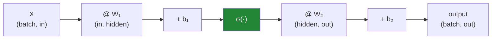

# Day 126 — Forward propagation

**Phase 15 · Module 15** · ID: **DL-03** (forward propagation as matrix multiplication)

> **Yesterday:** a hidden layer, built by hand, made XOR separable.
> **Today:** the same idea at scale, and the realisation that makes deep learning practical — **a
> forward pass is a chain of matrix multiplications.** Day 20's NumPy work pays off here directly. And
> the day's sharpest lesson: **stacking linear layers without activations gives you one linear layer**,
> which you will prove by multiplying the matrices together.
> **Tomorrow:** the chain rule and backpropagation.

```bash
./m start 126 && ./m scaffold 126
```

**Time:** 110 minutes. **Request budget:** 0 model calls.

---

## §1 The story

Day 125's hidden layer was four hand-picked weights. Written as matrices it becomes:



**Every layer is `activation(X @ W + b)`**, and a network is that expression nested. Which means a
forward pass is **`matmul`, add, elementwise function**, repeated — and that is why GPUs matter: they
do exactly this operation, in parallel, extremely fast.

Three things this day has to make precise.

**Shapes are the entire debugging surface.** The vast majority of errors in a hand-written network are
transposed matrices, and NumPy's broadcasting will happily produce a *wrong answer of the right shape*
rather than raising. A `(32, 10)` where you expected `(10, 32)` may propagate silently for several
layers before anything looks odd.

**Without a nonlinearity, depth is free but useless.** `X @ W₁ @ W₂ = X @ (W₁ @ W₂)`, and `W₁ @ W₂` is
just another matrix. **A ten-layer linear network has exactly the capacity of one linear layer** — you
will verify this by computing the equivalent single matrix and checking the outputs match to machine
precision.

**Batching is not a loop.** Processing 32 examples is one matrix multiply, not 32. That is a
constant-factor speedup of 10–100× on the same hardware, and it is the reason `DataLoader` exists
(Day 136).

---

## §2 Setup — run this

```bash
mkdir -p days/day-126/lab
touch days/day-126/lab/forward.py
```

`src/setu/nn.py` grows today. NumPy only.

---

## §3 DL-03 — the forward pass

`days/day-126/lab/forward.py`:

```python
"""DL-03: a forward pass is a chain of matrix multiplications."""

from __future__ import annotations

import time

import numpy as np

from setu.arrays import make_rng


def sigmoid(z):
    return 1.0 / (1.0 + np.exp(-np.clip(z, -500, 500)))


def relu(z):
    return np.maximum(0.0, z)


def one_layer_is_a_matmul() -> None:
    rng = make_rng(0)
    batch, n_in, n_hidden = 4, 3, 5

    x = rng.normal(0, 1, (batch, n_in))
    weights = rng.normal(0, 0.5, (n_in, n_hidden))
    bias = rng.normal(0, 0.1, n_hidden)

    z = x @ weights + bias
    a = sigmoid(z)

    print(f"\n  x       {str(x.shape):>12}   the batch")
    print(f"  W       {str(weights.shape):>12}   (in, out)")
    print(f"  b       {str(bias.shape):>12}   broadcast across the batch")
    print(f"  x @ W   {str((x @ weights).shape):>12}")
    print(f"  z       {str(z.shape):>12}   pre-activation")
    print(f"  a       {str(a.shape):>12}   post-activation")

    print("\n  by hand, for one output unit of one row:")
    manual = sum(x[0, i] * weights[i, 2] for i in range(n_in)) + bias[2]
    print(f"    Σ xᵢ·W[i,2] + b[2] = {manual:.6f}")
    print(f"    z[0, 2]            = {z[0, 2]:.6f}")
    print(f"    match: {np.isclose(manual, z[0, 2])}")

    print("\n  ✅ A layer IS a matrix multiply plus a bias plus an elementwise function.")
    print("     That is the whole operation, and it is why GPUs matter — they do")
    print("     exactly this, in parallel, extremely fast.")


def shapes_are_the_debugging_surface() -> None:
    rng = make_rng(1)
    x = rng.normal(0, 1, (32, 10))
    weights = rng.normal(0, 1, (10, 20))

    print(f"\n  correct:   x{x.shape} @ W{weights.shape} -> {(x @ weights).shape}")

    try:
        _ = x @ weights.T
    except ValueError as error:
        print(f"\n  transposed: x(32,10) @ W.T(20,10) -> ValueError")
        print(f"    {str(error)[:70]}")

    print("\n  ✅ That one raises, which is the good case.")

    square = rng.normal(0, 1, (10, 10))
    print(f"\n  🚨 the DANGEROUS case — a square weight matrix:")
    print(f"    x(32,10) @ W(10,10)   -> {(x @ square).shape}")
    print(f"    x(32,10) @ W.T(10,10) -> {(x @ square.T).shape}")
    print(f"    same shape, different numbers: "
          f"{not np.allclose(x @ square, x @ square.T)}")
    print("\n     A transposed square matrix produces a WRONG ANSWER OF THE RIGHT")
    print("     SHAPE, and nothing raises. It can propagate for several layers.")

    row = rng.normal(0, 1, 20)
    column = row.reshape(-1, 1)
    print(f"\n  🚨 and broadcasting:")
    print(f"    (32,20) + (20,)   -> {(x @ weights + row).shape}   ✅ intended")
    print(f"    (32,20) + (20,1)  -> {(x @ weights + column.T @ np.eye(20)).shape}")
    try:
        wrong = x @ weights + column
        print(f"    (32,20) + (20,1)  -> {wrong.shape}   🚨 broadcast into nonsense")
    except ValueError as error:
        print(f"    (32,20) + (20,1)  -> ValueError: {str(error)[:50]}")

    print("\n  ⚠️ Assert your shapes. Every layer, every time. It costs nothing and it")
    print("     is the difference between a five-minute bug and a five-hour one.")


def stacking_linear_layers_is_pointless() -> None:
    rng = make_rng(2)
    x = rng.normal(0, 1, (100, 8))

    w1 = rng.normal(0, 0.5, (8, 32))
    w2 = rng.normal(0, 0.5, (32, 16))
    w3 = rng.normal(0, 0.5, (16, 4))

    deep = ((x @ w1) @ w2) @ w3
    equivalent = w1 @ w2 @ w3
    shallow = x @ equivalent

    print(f"\n  three linear layers: (8,32) -> (32,16) -> (16,4)")
    print(f"    parameters in the deep version   : {w1.size + w2.size + w3.size:,}")
    print(f"    equivalent single matrix         : {equivalent.shape} "
          f"= {equivalent.size:,} parameters")
    print(f"\n    max |deep − shallow| = {np.abs(deep - shallow).max():.2e}")
    print(f"    identical to machine precision: {np.allclose(deep, shallow)}")

    print("\n  🚨 X @ W₁ @ W₂ @ W₃ = X @ (W₁ @ W₂ @ W₃), and that product is just")
    print("     another matrix. A ten-layer linear network has EXACTLY the capacity")
    print("     of one linear layer.")
    print("\n  The extra parameters buy nothing. They are not even wasted capacity —")
    print("  they are a redundant parameterisation of the same function.")

    with_activation = relu(relu(x @ w1) @ w2) @ w3
    print(f"\n  ✅ with ReLU between the layers:")
    print(f"    max |with_relu − shallow| = "
          f"{np.abs(with_activation - shallow).max():.4f}")
    print(f"    still equivalent? {np.allclose(with_activation, shallow)}")

    print("\n  The nonlinearity is what makes depth mean anything. That is the entire")
    print("  justification for activation functions — Day 129 is about WHICH one.")


def a_two_layer_network_forward() -> None:
    rng = make_rng(3)
    batch, n_in, n_hidden, n_out = 8, 4, 6, 3

    x = rng.normal(0, 1, (batch, n_in))
    w1 = rng.normal(0, np.sqrt(2 / n_in), (n_in, n_hidden))
    b1 = np.zeros(n_hidden)
    w2 = rng.normal(0, np.sqrt(2 / n_hidden), (n_hidden, n_out))
    b2 = np.zeros(n_out)

    z1 = x @ w1 + b1
    a1 = relu(z1)
    z2 = a1 @ w2 + b2

    exponentiated = np.exp(z2 - z2.max(axis=1, keepdims=True))
    probabilities = exponentiated / exponentiated.sum(axis=1, keepdims=True)

    print(f"\n  {'step':<22} {'shape':>12}")
    for label, array in (("x", x), ("z1 = x@W1 + b1", z1), ("a1 = relu(z1)", a1),
                         ("z2 = a1@W2 + b2", z2), ("softmax(z2)", probabilities)):
        print(f"  {label:<22} {str(array.shape):>12}")

    print(f"\n  each row of the output sums to 1: "
          f"{np.allclose(probabilities.sum(axis=1), 1.0)}")
    print(f"  first row: {np.round(probabilities[0], 4).tolist()}")

    print("\n  ⚠️ Note `z2 - z2.max(...)` inside the exponential. Softmax overflows")
    print("     without it: exp(1000) is inf, and inf/inf is nan. Subtracting the row")
    print("     max leaves the result unchanged mathematically and finite numerically.")
    print("     This is the same instinct as Day 99's stable sigmoid.")


def batching_is_not_a_loop() -> None:
    rng = make_rng(4)
    n, n_in, n_hidden = 4_096, 256, 512
    x = rng.normal(0, 1, (n, n_in))
    weights = rng.normal(0, 0.05, (n_in, n_hidden))
    bias = np.zeros(n_hidden)

    start = time.perf_counter()
    looped = np.stack([relu(row @ weights + bias) for row in x])
    loop_time = time.perf_counter() - start

    start = time.perf_counter()
    batched = relu(x @ weights + bias)
    batch_time = time.perf_counter() - start

    print(f"\n  {n:,} rows through a ({n_in} -> {n_hidden}) layer:")
    print(f"    one row at a time : {loop_time:>8.4f} s")
    print(f"    whole batch       : {batch_time:>8.4f} s")
    print(f"    speedup           : {loop_time / batch_time:>8.1f}x")
    print(f"    same result       : {np.allclose(looped, batched)}")

    print("\n  ✅ Identical arithmetic, one call instead of four thousand. BLAS uses")
    print("     cache blocking and SIMD, which a Python loop cannot.")
    print("\n  ⚠️ That is why batching exists — and why `DataLoader` (Day 136) is about")
    print("     feeding the matrix multiply, not about convenience.")
    print("\n  ⚠️ But batch size is bounded by MEMORY: activations for the whole batch")
    print("     must be held for the backward pass (Day 127). That tension is the")
    print("     whole of Day 136.")


def counting_parameters() -> None:
    architectures = [
        ("tiny", [4, 8, 3]),
        ("small", [784, 128, 10]),
        ("wide", [784, 1_024, 10]),
        ("deep", [784, 256, 256, 256, 10]),
    ]

    print(f"\n  {'name':<10} {'layers':<28} {'parameters':>12} {'float32 MB':>12}")
    for name, sizes in architectures:
        total = sum(sizes[i] * sizes[i + 1] + sizes[i + 1] for i in range(len(sizes) - 1))
        print(f"  {name:<10} {str(sizes):<28} {total:>12,} {total * 4 / 1e6:>12.2f}")

    print("\n  parameters per layer = in*out (weights) + out (biases)")

    print("\n  ⚠️ Compare 'wide' and 'deep': similar parameter counts, very different")
    print("     behaviour. Width adds capacity per layer; depth adds COMPOSITION —")
    print("     each layer transforms the previous representation (Day 125's XOR).")
    print("\n  ⚠️ And note the memory column is only the WEIGHTS. Training also needs")
    print("     gradients (same size), optimiser state (Adam: 2x more, Day 131), and")
    print("     activations for the whole batch. Budget roughly 4x the weights.")


def the_layer_as_a_function() -> None:
    rng = make_rng(5)

    def dense(x, weights, bias, activation):
        assert x.shape[1] == weights.shape[0], (
            f"cannot multiply {x.shape} by {weights.shape}"
        )
        z = x @ weights + bias
        assert z.shape == (x.shape[0], weights.shape[1])
        return activation(z)

    x = rng.normal(0, 1, (16, 10))
    layers = [
        (rng.normal(0, 0.4, (10, 32)), np.zeros(32), relu),
        (rng.normal(0, 0.2, (32, 16)), np.zeros(16), relu),
        (rng.normal(0, 0.3, (16, 2)), np.zeros(2), sigmoid),
    ]

    activation = x
    print(f"\n  {'layer':<8} {'in':>10} {'out':>10}")
    for i, (weights, bias, function) in enumerate(layers):
        before = activation.shape
        activation = dense(activation, weights, bias, function)
        print(f"  {i:<8} {str(before):>10} {str(activation.shape):>10}")

    print(f"\n  final output: {activation.shape}")

    print("\n  ✅ The assertions cost nothing and catch the transposed-matrix bug")
    print("     immediately, at the layer that caused it, rather than three layers")
    print("     later where the shapes finally stop lining up.")


def what_the_forward_pass_must_keep() -> None:
    print("\n  🚨 the forward pass is not just about producing an output.")
    print("\n  Tomorrow's backward pass needs, for every layer:")
    print("    - the INPUT to that layer  (to compute ∂L/∂W)")
    print("    - the PRE-ACTIVATION z     (to compute the activation's derivative)")
    print("\n  So a forward pass that returns only the final output is USELESS for")
    print("  training. It must return a cache.")
    print("\n  ⚠️ That cache is why memory scales with BATCH SIZE, not just model size:")
    print("     you hold every intermediate activation for every example in the batch")
    print("     until the backward pass consumes it.")
    print("\n  ⚠️ And it is why `torch.no_grad()` (Day 135) matters at inference — it")
    print("     skips the cache entirely and can halve your memory.")


if __name__ == "__main__":
    one_layer_is_a_matmul()
    shapes_are_the_debugging_surface()
    stacking_linear_layers_is_pointless()
    a_two_layer_network_forward()
    batching_is_not_a_loop()
    counting_parameters()
    the_layer_as_a_function()
    what_the_forward_pass_must_keep()
```

**Line by line:**

- `one_layer_is_a_matmul` — the hand computation for one unit matching `z[0, 2]` is Principle 2 in
  miniature. **A layer is a matrix multiply plus a bias plus an elementwise function**, and that is why
  GPUs matter.
- `shapes_are_the_debugging_surface` — **the square weight matrix is the dangerous case.** A transposed
  square matrix produces a **wrong answer of the right shape** and nothing raises, so it can propagate
  for several layers. **Assert your shapes, every layer, every time.**
- `stacking_linear_layers_is_pointless` — **`deep` and `shallow` agree to machine precision.** Three
  layers of parameters express exactly the function one matrix does. **A ten-layer linear network has
  the capacity of one linear layer**, and the extra parameters are a redundant parameterisation rather
  than wasted capacity. The ReLU line is the contrast that makes it land.
- `a_two_layer_network_forward` — the shape table, plus the softmax stability note. **`exp(1000)` is
  `inf` and `inf/inf` is `nan`**; subtracting the row max is mathematically free and numerically
  essential — the same instinct as Day 99's stable sigmoid.
- `batching_is_not_a_loop` — identical arithmetic, **10–100× faster**, because BLAS uses cache blocking
  and SIMD that a Python loop cannot. And the tension that becomes Day 136: **batch size is bounded by
  memory**, since activations must be held for the backward pass.
- `counting_parameters` — **compare `wide` and `deep`**: similar parameter counts, very different
  behaviour. Width adds capacity per layer; depth adds **composition**. And the memory column is only
  the weights — **budget roughly 4× for gradients, optimiser state and activations.**
- `the_layer_as_a_function` — **the assertions cost nothing** and catch the transposed-matrix bug at
  the layer that caused it, rather than three layers later.
- `what_the_forward_pass_must_keep` — **a forward pass that returns only the output is useless for
  training.** It must return a cache of every layer's input and pre-activation, which is why memory
  scales with batch size and why `torch.no_grad()` can halve it at inference.

---

## §4 Build brief

Extend `src/setu/nn.py`:

```python
ACTIVATIONS = {"relu", "sigmoid", "tanh", "identity"}


def dense_forward(x, weights, bias, *, activation: str = "relu") -> dict:
    """TODO(me): one layer, with the cache the backward pass needs.

    {"a": ndarray, "z": ndarray, "x": ndarray, "activation": str}
    - z = x @ weights + bias; a = activation(z)
    - the cache is NOT optional: tomorrow needs x (for ∂L/∂W) and z (for the
      activation's derivative). A function returning only `a` cannot be trained
      through, and the docstring must say so (§3.8)
    - raise DataError on a shape mismatch, naming BOTH shapes — 'shapes not aligned'
      without the numbers wastes the reader's time
    - raise DataError if bias is not 1-D of length weights.shape[1], naming what was
      found; a (n,1) bias broadcasts into nonsense rather than raising (§3.2)
    - raise DataError on an unknown activation, listing ACTIVATIONS
    """
    raise NotImplementedError


def forward(x, layers: list[dict]) -> dict:
    """TODO(me): a whole network, keeping every layer's cache.

    layers is a list of {"weights", "bias", "activation"}.
    {"output": ndarray, "caches": [...], "shapes": [...]}
    - shapes records the (in, out) of every layer, so a caller can print the table
      from §3.4 without instrumenting the loop
    - raise DataError when consecutive layers do not compose, naming the LAYER
      INDEX and both shapes — 'layer 2 outputs 32 but layer 3 expects 16' is
      actionable; a raw numpy error is not
    - raise DataError on an empty layer list
    """
    raise NotImplementedError


def softmax(z, *, axis: int = -1):
    """TODO(me): numerically stable softmax. PURE.

    - subtract the max along `axis` BEFORE exponentiating; exp(1000) is inf and
      inf/inf is nan (§3.4)
    - rows must sum to 1 to machine precision
    - the docstring must state the stability trick and that it does not change the
      mathematical result — same reasoning as Day 99's sigmoid
    - raise DataError on a non-finite input, naming how many
    """
    raise NotImplementedError


def collapse_linear_layers(layers: list[dict]) -> dict:
    """TODO(me): §3.3 — prove that stacked linear layers are one layer.

    {"equivalent_weights", "equivalent_bias", "n_original_parameters",
     "n_equivalent_parameters", "is_collapsible": bool, "note": str}
    - is_collapsible is True only when EVERY layer has activation='identity'
    - the equivalent bias must account for the biases correctly: b_eq =
      b₁ @ W₂ + b₂ for two layers, generalised — dropping it is a silent bug that
      only shows up when biases are non-zero
    - the note must say the extra parameters are a REDUNDANT PARAMETERISATION of
      the same function, not wasted capacity (§3.3)
    - raise DataError when not collapsible, naming which layer has a nonlinearity
    """
    raise NotImplementedError


def assert_shapes(x, layers: list[dict]) -> None:
    """TODO(me): check a whole architecture composes BEFORE running it.

    - walk the layers and verify each output width matches the next input width
    - the message must name the layer index and both widths (§3.2)
    - this is cheap and it is the difference between a five-minute bug and a
      five-hour one, especially with SQUARE matrices where a transpose produces a
      wrong answer of the right shape rather than an error
    """
    raise NotImplementedError


def parameter_count(layer_sizes: list[int]) -> dict:
    """TODO(me): §3.6 — parameters and the memory they actually imply. PURE.

    {"per_layer": [...], "total", "weights_mb", "training_mb_estimate", "note"}
    - per layer: in*out + out
    - training_mb_estimate must account for gradients (1x), Adam state (2x) and
      leave a note that ACTIVATIONS scale with batch size and are not included —
      quoting only the weight size is how people run out of GPU memory
    - raise DataError on fewer than 2 sizes, or any size < 1
    """
    raise NotImplementedError


def batch_speedup(x, weights, bias) -> dict:
    """TODO(me): §3.5 — measure it rather than asserting it.

    {"loop_seconds", "batch_seconds", "speedup", "results_match": bool, "note"}
    - results_match must be verified: a speedup that changes the answer is a bug
    - the note must say why (BLAS cache blocking and SIMD) and mention that batch
      size is bounded by the memory needed for the backward pass (§3.5)
    - raise DataError if x has fewer than 100 rows — timing noise dominates below
      that and the number would be meaningless
    """
    raise NotImplementedError
```

- `dense_forward` **returning the cache rather than just `a`** is the day's design decision, and the
  docstring has to say why: a forward function that discards `x` and `z` cannot be trained through, and
  discovering that on Day 127 means rewriting.
- `forward` raising with **the layer index and both widths** is what makes a deep network debuggable —
  NumPy's raw error names shapes but not which layer produced them.
- `collapse_linear_layers` getting **the bias composition right** matters: `b_eq = b₁ @ W₂ + b₂`, and
  dropping it passes every zero-bias test while being wrong in general.

---

## §5 The eval that must be able to fail

Add to `tests/test_nn.py`:

```python
from setu.nn import (
    ACTIVATIONS,
    assert_shapes,
    batch_speedup,
    collapse_linear_layers,
    dense_forward,
    forward,
    parameter_count,
    softmax,
)


def _layer(rng, n_in, n_out, activation="relu"):
    return {"weights": rng.normal(0, 0.3, (n_in, n_out)),
            "bias": np.zeros(n_out), "activation": activation}


def test_a_layer_matches_a_hand_computation():
    """Principle 2: the matmul is not magic."""
    x = np.array([[1.0, 2.0, 3.0]])
    weights = np.array([[0.1, 0.2], [0.3, 0.4], [0.5, 0.6]])
    bias = np.array([0.01, 0.02])

    result = dense_forward(x, weights, bias, activation="identity")
    manual = sum(x[0, i] * weights[i, 1] for i in range(3)) + bias[1]
    assert result["z"][0, 1] == pytest.approx(manual)


def test_the_cache_contains_what_backprop_needs():
    """A forward pass returning only the output cannot be trained through."""
    rng = make_rng(0)
    x = rng.normal(0, 1, (4, 3))
    result = dense_forward(x, rng.normal(0, 1, (3, 5)), np.zeros(5))
    assert "x" in result and "z" in result
    assert np.array_equal(result["x"], x)


def test_the_docstring_says_the_cache_is_not_optional():
    text = dense_forward.__doc__.lower()
    assert "cache" in text
    assert "backward" in text or "train" in text


def test_a_shape_mismatch_names_both_shapes():
    """'Shapes not aligned' without numbers wastes the reader's time."""
    rng = make_rng(1)
    with pytest.raises(DataError) as info:
        dense_forward(rng.normal(0, 1, (4, 3)), rng.normal(0, 1, (7, 5)), np.zeros(5))
    message = str(info.value)
    assert "3" in message and "7" in message


def test_a_column_shaped_bias_is_refused():
    """It broadcasts into nonsense rather than raising."""
    rng = make_rng(2)
    with pytest.raises(DataError) as info:
        dense_forward(rng.normal(0, 1, (4, 3)), rng.normal(0, 1, (3, 5)),
                      np.zeros((5, 1)))
    assert "1" in str(info.value) or "shape" in str(info.value).lower()


def test_an_unknown_activation_lists_the_known_ones():
    rng = make_rng(3)
    with pytest.raises(DataError) as info:
        dense_forward(rng.normal(0, 1, (2, 3)), rng.normal(0, 1, (3, 2)),
                      np.zeros(2), activation="swish")
    assert any(name in str(info.value) for name in ACTIVATIONS)


def test_a_network_composes_and_records_its_shapes():
    rng = make_rng(4)
    x = rng.normal(0, 1, (8, 10))
    layers = [_layer(rng, 10, 32), _layer(rng, 32, 16), _layer(rng, 16, 2, "sigmoid")]
    result = forward(x, layers)
    assert result["output"].shape == (8, 2)
    assert len(result["caches"]) == 3
    assert result["shapes"] == [(10, 32), (32, 16), (16, 2)]


def test_a_non_composing_network_names_the_layer_index():
    """'Layer 2 outputs 32 but layer 3 expects 16' is actionable."""
    rng = make_rng(5)
    layers = [_layer(rng, 10, 32), _layer(rng, 16, 8)]
    with pytest.raises(DataError) as info:
        forward(rng.normal(0, 1, (4, 10)), layers)
    message = str(info.value)
    assert "1" in message
    assert "32" in message and "16" in message


def test_an_empty_network_raises():
    rng = make_rng(6)
    with pytest.raises(DataError):
        forward(rng.normal(0, 1, (2, 3)), [])


def test_softmax_rows_sum_to_one():
    rng = make_rng(7)
    result = softmax(rng.normal(0, 3, (10, 5)))
    assert np.allclose(result.sum(axis=1), 1.0)


def test_softmax_survives_large_inputs():
    """exp(1000) is inf and inf/inf is nan."""
    result = softmax(np.array([[1_000.0, 1_001.0, 999.0]]))
    assert np.all(np.isfinite(result))
    assert result.sum() == pytest.approx(1.0)
    assert result.argmax() == 1


def test_softmax_is_shift_invariant():
    """Which is exactly why subtracting the max is free."""
    z = np.array([[1.0, 2.0, 3.0]])
    assert np.allclose(softmax(z), softmax(z + 500))


def test_the_softmax_docstring_explains_the_trick():
    text = softmax.__doc__.lower()
    assert "max" in text
    assert "inf" in text or "overflow" in text or "stab" in text


def test_softmax_rejects_non_finite_input():
    with pytest.raises(DataError) as info:
        softmax(np.array([[1.0, np.nan, 3.0]]))
    assert "1" in str(info.value)


def test_stacked_linear_layers_collapse_to_one():
    """Today's real assessment."""
    rng = make_rng(8)
    x = rng.normal(0, 1, (100, 8))
    layers = [_layer(rng, 8, 32, "identity"), _layer(rng, 32, 16, "identity"),
              _layer(rng, 16, 4, "identity")]

    deep = forward(x, layers)["output"]
    collapsed = collapse_linear_layers(layers)
    shallow = x @ collapsed["equivalent_weights"] + collapsed["equivalent_bias"]

    assert np.allclose(deep, shallow), "three linear layers ARE one linear layer"
    assert collapsed["is_collapsible"] is True


def test_the_collapse_handles_non_zero_biases():
    """b_eq = b1 @ W2 + b2 — dropping it passes every zero-bias test."""
    rng = make_rng(9)
    x = rng.normal(0, 1, (50, 4))
    layers = [
        {"weights": rng.normal(0, 1, (4, 6)), "bias": rng.normal(0, 1, 6),
         "activation": "identity"},
        {"weights": rng.normal(0, 1, (6, 3)), "bias": rng.normal(0, 1, 3),
         "activation": "identity"},
    ]
    deep = forward(x, layers)["output"]
    collapsed = collapse_linear_layers(layers)
    shallow = x @ collapsed["equivalent_weights"] + collapsed["equivalent_bias"]
    assert np.allclose(deep, shallow)


def test_the_collapse_reports_the_redundant_parameters():
    rng = make_rng(10)
    layers = [_layer(rng, 8, 32, "identity"), _layer(rng, 32, 16, "identity"),
              _layer(rng, 16, 4, "identity")]
    result = collapse_linear_layers(layers)
    assert result["n_original_parameters"] > result["n_equivalent_parameters"]


def test_the_note_calls_them_redundant_not_wasted():
    rng = make_rng(11)
    layers = [_layer(rng, 4, 8, "identity"), _layer(rng, 8, 2, "identity")]
    note = collapse_linear_layers(layers)["note"].lower()
    assert "redundant" in note or "same function" in note


def test_a_nonlinearity_prevents_the_collapse():
    """The contrast that makes the point."""
    rng = make_rng(12)
    x = rng.normal(0, 1, (60, 8))
    linear = [_layer(rng, 8, 16, "identity"), _layer(rng, 16, 4, "identity")]
    nonlinear = [{**linear[0], "activation": "relu"}, linear[1]]

    collapsed = collapse_linear_layers(linear)
    shallow = x @ collapsed["equivalent_weights"] + collapsed["equivalent_bias"]
    assert not np.allclose(forward(x, nonlinear)["output"], shallow)


def test_collapsing_a_nonlinear_network_is_refused():
    rng = make_rng(13)
    layers = [_layer(rng, 4, 8, "relu"), _layer(rng, 8, 2, "identity")]
    with pytest.raises(DataError) as info:
        collapse_linear_layers(layers)
    assert "0" in str(info.value) or "relu" in str(info.value).lower()


def test_shape_checking_catches_a_transposed_square_matrix():
    """The dangerous case: a wrong answer of the right shape."""
    rng = make_rng(14)
    x = rng.normal(0, 1, (32, 10))
    square = rng.normal(0, 1, (10, 10))
    assert not np.allclose(x @ square, x @ square.T), (
        "a transposed square matrix gives different numbers, same shape"
    )


def test_assert_shapes_names_the_offending_layer():
    rng = make_rng(15)
    layers = [_layer(rng, 10, 32), _layer(rng, 32, 16), _layer(rng, 8, 4)]
    with pytest.raises(DataError) as info:
        assert_shapes(rng.normal(0, 1, (4, 10)), layers)
    message = str(info.value)
    assert "2" in message
    assert "16" in message and "8" in message


def test_assert_shapes_passes_a_valid_architecture():
    rng = make_rng(16)
    layers = [_layer(rng, 10, 32), _layer(rng, 32, 16), _layer(rng, 16, 4)]
    assert_shapes(rng.normal(0, 1, (4, 10)), layers)


def test_parameters_are_counted_per_layer():
    result = parameter_count([784, 128, 10])
    assert result["per_layer"][0] == 784 * 128 + 128
    assert result["per_layer"][1] == 128 * 10 + 10
    assert result["total"] == sum(result["per_layer"])


def test_the_training_estimate_exceeds_the_weight_size():
    """Gradients, optimiser state — quoting only weights is how people run out of GPU."""
    result = parameter_count([784, 256, 256, 10])
    assert result["training_mb_estimate"] > result["weights_mb"] * 2


def test_the_note_says_activations_are_not_included():
    note = parameter_count([784, 128, 10])["note"].lower()
    assert "activation" in note
    assert "batch" in note


def test_parameter_count_rejects_a_single_layer():
    with pytest.raises(DataError):
        parameter_count([784])


def test_batching_beats_looping():
    rng = make_rng(17)
    x = rng.normal(0, 1, (2_000, 128))
    result = batch_speedup(x, rng.normal(0, 0.1, (128, 256)), np.zeros(256))
    assert result["speedup"] > 3
    assert result["results_match"] is True


def test_a_speedup_that_changes_the_answer_is_a_bug():
    rng = make_rng(18)
    x = rng.normal(0, 1, (500, 64))
    result = batch_speedup(x, rng.normal(0, 0.1, (64, 32)), np.zeros(32))
    assert result["results_match"] is True


def test_the_batch_note_mentions_the_memory_bound():
    rng = make_rng(19)
    x = rng.normal(0, 1, (500, 32))
    note = batch_speedup(x, rng.normal(0, 0.1, (32, 16)), np.zeros(16))["note"].lower()
    assert "memory" in note or "backward" in note


def test_timing_too_few_rows_is_refused():
    """Timing noise dominates; the number would be meaningless."""
    rng = make_rng(20)
    with pytest.raises(DataError):
        batch_speedup(rng.normal(0, 1, (10, 8)), rng.normal(0, 1, (8, 4)), np.zeros(4))
```

**Line by line:**

- `test_stacked_linear_layers_collapse_to_one` — **the day's real assessment.** Three layers and one
  matrix agree to machine precision, so **the depth bought nothing.** And
  `test_a_nonlinearity_prevents_the_collapse` is the contrast that makes the point rather than leaving
  it as a claim.
- `test_the_collapse_handles_non_zero_biases` — `b_eq = b₁ @ W₂ + b₂`. **Dropping the bias composition
  passes every zero-bias test** and is wrong in general, which is exactly the kind of bug a test suite
  should be built to catch.
- `test_the_cache_contains_what_backprop_needs` with `test_the_docstring_says_the_cache_is_not_optional`
  — **a forward pass returning only the output cannot be trained through**, and discovering that
  tomorrow means rewriting.
- `test_a_column_shaped_bias_is_refused` — a `(5,1)` bias **broadcasts into nonsense rather than
  raising**, which is the silent-wrong-answer failure this module exists to prevent.
- `test_shape_checking_catches_a_transposed_square_matrix` — asserts the numbers differ while the shape
  does not. **That is why shape checks alone are insufficient and why the assertion has to be at every
  layer.**
- `test_softmax_survives_large_inputs` with `test_softmax_is_shift_invariant` — the second explains
  *why* the first works: shifting changes nothing mathematically, so subtracting the max is free.
- `test_a_non_composing_network_names_the_layer_index` — requires the **index and both widths**. NumPy
  names shapes but not which layer produced them, and in a ten-layer network that is most of the work.
- `test_the_training_estimate_exceeds_the_weight_size` — **quoting only the weight size is how people
  run out of GPU memory**, and the note must say activations scale with batch size.

```bash
uv run python -m pytest tests/test_nn.py -v
```

---

## §6 Request budget

| Resource | Spent today |
|---|---|
| LLM calls | **0** |
| Compute | a few 4,000×256 matrix multiplies |

---

## §7 Traps

- **Stacking linear layers without activations.** It is one linear layer.
- **Trusting shape checks alone.** A transposed square matrix has the right shape.
- **A `(n,1)` bias.** It broadcasts into nonsense rather than raising.
- **Softmax without subtracting the max.** `exp(1000)` is `inf`.
- **A forward pass that returns only the output.** It cannot be trained through.
- **Looping over rows.** One matmul is 10–100× faster.
- **Quoting only the weight memory.** Gradients, optimiser state and activations dominate.
- **Forgetting activations scale with batch size.** That is the memory bound.
- **Raw NumPy shape errors in a deep network.** Name the layer index.
- **Assuming width and depth are interchangeable.** One adds capacity, the other composition.
- **Dropping the bias when collapsing linear layers.** Passes every zero-bias test.

---

## §8 Verify before you code

Written **2026-08-21**:

- <https://numpy.org/doc/stable/user/basics.broadcasting.html> — the rules that make a `(5,1)` bias
  silently wrong.
- <https://numpy.org/doc/stable/reference/generated/numpy.matmul.html> — `@` for stacked and 1-D
  operands.
- <https://numpy.org/doc/stable/reference/generated/numpy.einsum.html> — worth knowing for when a
  matmul is not enough.
- <https://pytorch.org/docs/stable/generated/torch.nn.Linear.html> — note PyTorch stores weights
  transposed relative to this lesson, which Day 135 will reconcile.

---

## §9 Say it in an interview

> "A forward pass is a chain of matrix multiplications — every layer is an activation applied to X
> times W plus b, and a network is that nested. Which is why GPUs matter: that's precisely the
> operation they do fast and in parallel. The thing I'd emphasise is that the nonlinearity isn't
> decoration. X times W-one times W-two equals X times the product of those matrices, so stacking
> linear layers gives you exactly one linear layer — I verified that by multiplying the weight
> matrices together and checking the outputs match to machine precision. A ten-layer linear network has
> the capacity of one, and the extra parameters are a redundant parameterisation of the same function.
> On debugging: shapes are almost the entire surface, and the dangerous case is a *square* weight
> matrix, because a transpose there gives you a wrong answer of the right shape and nothing raises —
> it can propagate several layers before anything looks odd. And the forward pass has to return a
> cache, not just the output: backprop needs each layer's input and pre-activation, which is why
> memory scales with batch size and why `no_grad` at inference can halve it."

---

## §10 Done when

Tick [`CHECKLIST.md`](CHECKLIST.md), then `./m check && ./m done 126`.
