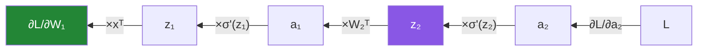

# Day 127 — Backpropagation

**Phase 15 · Module 15** · ID: **DL-04** (the chain rule and backpropagation)

> **Yesterday:** the forward pass, and the cache it must keep.
> **Today:** the algorithm that made deep learning possible, and it is **just the chain rule applied
> in the right order**. Day 95 gave you gradient descent for one layer; the question it could not
> answer was how a *hidden* unit gets credit for the final error. Today answers it — derived on paper,
> implemented in NumPy, and verified against a numerical gradient.
> **Tomorrow:** the full training loop.

```bash
./m start 127 && ./m scaffold 127
```

**Time:** 2 hours. **Request budget:** 0 model calls.

---

## §1 The story

Day 95's gradient descent needed `∂L/∂w`. For the output layer that is direct. For a hidden weight,
the influence travels through everything downstream — and the chain rule is exactly the tool for that:



**Backpropagation is the chain rule with the multiplications ordered to reuse work.** The naive
alternative — computing each `∂L/∂wᵢⱼ` independently — recomputes the same downstream products once per
parameter. Backprop computes each intermediate `∂L/∂z` **once** and reuses it, which turns an
`O(parameters²)` computation into `O(parameters)`.

**That is the entire contribution.** The chain rule was known in the 1700s. What backprop adds is the
observation that a single backward sweep computes every gradient, and that observation is what makes
training a network with a million parameters possible at all.

Three things this day has to nail.

**Every gradient has the same shape as its parameter.** `∂L/∂W₁` is the same shape as `W₁`. That is
not a convention — it follows from the definition — and it is the single most useful check you have,
because a shape mismatch in the backward pass means the derivation is wrong.

**The gradient check is non-negotiable.** A backprop implementation can be wrong by a factor, a
transpose, or a missing term and still *train* — slowly, to a worse optimum, with no error. Comparing
against a central-difference numerical gradient (Day 95's technique) is how you know. **This is the one
day where the test is more valuable than the code.**

**Batching means summing.** With a batch, `∂L/∂b` sums over rows, and whether you sum or average
determines whether your effective learning rate scales with batch size. Getting this wrong is a real
bug that looks like a tuning problem.

---

## §2 Setup — run this

```bash
mkdir -p days/day-127/lab
touch days/day-127/lab/backprop.py
```

`src/setu/nn.py` grows today. NumPy only.

---

## §3 DL-04 — deriving it

`days/day-127/lab/backprop.py`:

```python
"""DL-04: backpropagation, derived on paper and checked numerically."""

from __future__ import annotations

import numpy as np

from setu.arrays import make_rng


def sigmoid(z):
    return 1.0 / (1.0 + np.exp(-np.clip(z, -500, 500)))


def sigmoid_prime(z):
    s = sigmoid(z)
    return s * (1 - s)


def relu(z):
    return np.maximum(0.0, z)


def relu_prime(z):
    return (z > 0).astype(float)


def the_chain_rule_on_one_path() -> None:
    print("\n  the smallest possible network: x -> z = wx + b -> a = σ(z) -> L = (a − y)²")
    print("\n  what is ∂L/∂w?")
    print("\n    ∂L/∂a = 2(a − y)")
    print("    ∂a/∂z = σ'(z) = σ(z)(1 − σ(z))")
    print("    ∂z/∂w = x")
    print("\n    ∂L/∂w = ∂L/∂a · ∂a/∂z · ∂z/∂w = 2(a − y) · σ'(z) · x")

    x, y, w, b = 1.5, 1.0, 0.4, -0.2
    z = w * x + b
    a = sigmoid(z)
    loss = (a - y) ** 2

    analytic = 2 * (a - y) * sigmoid_prime(z) * x

    epsilon = 1e-7
    up = (sigmoid((w + epsilon) * x + b) - y) ** 2
    down = (sigmoid((w - epsilon) * x + b) - y) ** 2
    numeric = (up - down) / (2 * epsilon)

    print(f"\n  with x={x}, y={y}, w={w}, b={b}:")
    print(f"    z = {z:.6f}, a = {a:.6f}, L = {loss:.6f}")
    print(f"    analytic ∂L/∂w = {analytic:.10f}")
    print(f"    numeric  ∂L/∂w = {numeric:.10f}")
    print(f"    difference     = {abs(analytic - numeric):.2e}")

    print("\n  ✅ That is the whole idea. Backpropagation is this, applied layer by")
    print("     layer, with the intermediate products reused.")
    print("\n  ⚠️ Note the CENTRAL difference — (f(w+ε) − f(w−ε))/2ε, not the forward")
    print("     difference. Day 95's reason: the error is O(ε²) rather than O(ε).")


def why_the_order_matters() -> None:
    print("\n  a 3-layer network, and we want ∂L/∂W₁.")
    print("\n  the naive way — for EACH weight in W₁ independently:")
    print("    ∂L/∂w₁ᵢⱼ = ∂L/∂a₃ · ∂a₃/∂z₃ · ∂z₃/∂a₂ · ∂a₂/∂z₂ · ∂z₂/∂a₁ · ∂a₁/∂z₁ · ∂z₁/∂w₁ᵢⱼ")
    print("\n  🚨 Every term except the LAST is the same for every weight in W₁.")
    print("     Computing them per-weight repeats identical work thousands of times.")

    print("\n  backprop instead computes, ONCE per layer, the quantity:")
    print("      δ_l = ∂L/∂z_l")
    print("  and then every weight gradient in that layer is δ_l ⊗ (layer input).")

    sizes = [(784, 256), (256, 128), (128, 10)]
    parameters = sum(a * b + b for a, b in sizes)
    print(f"\n  for a {[s[0] for s in sizes] + [sizes[-1][1]]} network:")
    print(f"    parameters                    : {parameters:,}")
    print(f"    naive: full chain per parameter ≈ {parameters:,} chains")
    print(f"    backprop: one backward sweep    = {len(sizes)} δ computations")

    print("\n  ✅ That reduction from O(parameters²) to O(parameters) is the ENTIRE")
    print("     contribution of backpropagation. The chain rule itself is 18th-century")
    print("     calculus; ordering the multiplications to reuse work is the algorithm.")


def deriving_the_two_layer_case() -> None:
    print("\n  network:  z₁ = xW₁ + b₁ ;  a₁ = σ(z₁) ;  z₂ = a₁W₂ + b₂ ;  L = MSE(z₂, y)")
    print("\n  work BACKWARD, one step at a time:")
    print("\n    δ₂ = ∂L/∂z₂ = 2(z₂ − y)/n            ← the output layer, direct")
    print("    ∂L/∂W₂ = a₁ᵀ δ₂                       ← shape (hidden, out) ✓")
    print("    ∂L/∂b₂ = Σ_rows δ₂                    ← shape (out,) ✓")
    print("\n    ∂L/∂a₁ = δ₂ W₂ᵀ                      ← push the error BACK a layer")
    print("    δ₁ = ∂L/∂z₁ = (δ₂ W₂ᵀ) ⊙ σ'(z₁)      ← through the activation")
    print("    ∂L/∂W₁ = xᵀ δ₁                        ← shape (in, hidden) ✓")
    print("    ∂L/∂b₁ = Σ_rows δ₁                    ← shape (hidden,) ✓")

    print("\n  🚨 Read the shape annotations. EVERY gradient has the same shape as the")
    print("     parameter it belongs to. That is not a convention — it follows from")
    print("     the definition of a derivative with respect to a matrix.")
    print("\n  ✅ It is also the best debugging tool you have: if your ∂L/∂W₁ is not")
    print("     the shape of W₁, the derivation is wrong, and you know it immediately.")

    print("\n  ⚠️ Note where the transposes come from. ∂L/∂W₂ = a₁ᵀδ₂ because you need")
    print("     (hidden, batch) @ (batch, out) to land on (hidden, out). The shape")
    print("     requirement DETERMINES the transpose — you do not have to remember it.")


def implement_and_check() -> None:
    rng = make_rng(0)
    batch, n_in, n_hidden, n_out = 8, 5, 7, 3

    x = rng.normal(0, 1, (batch, n_in))
    y = rng.normal(0, 1, (batch, n_out))
    parameters = {
        "W1": rng.normal(0, 0.5, (n_in, n_hidden)),
        "b1": rng.normal(0, 0.1, n_hidden),
        "W2": rng.normal(0, 0.5, (n_hidden, n_out)),
        "b2": rng.normal(0, 0.1, n_out),
    }

    def forward(p):
        z1 = x @ p["W1"] + p["b1"]
        a1 = sigmoid(z1)
        z2 = a1 @ p["W2"] + p["b2"]
        return z1, a1, z2, ((z2 - y) ** 2).mean()

    def backward(p):
        z1, a1, z2, _ = forward(p)
        n = batch * n_out
        delta2 = 2 * (z2 - y) / n
        gradients = {
            "W2": a1.T @ delta2,
            "b2": delta2.sum(axis=0),
        }
        delta1 = (delta2 @ p["W2"].T) * sigmoid_prime(z1)
        gradients["W1"] = x.T @ delta1
        gradients["b1"] = delta1.sum(axis=0)
        return gradients

    analytic = backward(parameters)

    print(f"\n  {'parameter':<8} {'shape':>12} {'gradient shape':>16} {'match'}")
    for name, value in parameters.items():
        print(f"  {name:<8} {str(value.shape):>12} "
              f"{str(analytic[name].shape):>16} {value.shape == analytic[name].shape}")

    epsilon = 1e-6
    print(f"\n  central-difference check (ε = {epsilon}):")
    print(f"  {'parameter':<8} {'max |analytic − numeric|':>26} {'relative':>12}")
    for name in parameters:
        numeric = np.zeros_like(parameters[name])
        flat = parameters[name].reshape(-1)
        flat_numeric = numeric.reshape(-1)
        for i in range(flat.size):
            original = flat[i]
            flat[i] = original + epsilon
            up = forward(parameters)[3]
            flat[i] = original - epsilon
            down = forward(parameters)[3]
            flat[i] = original
            flat_numeric[i] = (up - down) / (2 * epsilon)

        absolute = np.abs(analytic[name] - numeric).max()
        scale = max(np.abs(analytic[name]).max(), np.abs(numeric).max(), 1e-12)
        print(f"  {name:<8} {absolute:>26.3e} {absolute / scale:>12.3e}")

    print("\n  ✅ Relative differences around 1e-9 or below mean the derivation is")
    print("     correct. Above ~1e-5 something is wrong.")
    print("\n  🚨 THIS CHECK IS NOT OPTIONAL. A backprop implementation can be wrong by")
    print("     a factor of two, a transpose, or a missing term and STILL TRAIN —")
    print("     slower, to a worse optimum, with no error message anywhere.")


def what_a_wrong_gradient_looks_like() -> None:
    rng = make_rng(1)
    batch, n_in, n_hidden, n_out = 6, 4, 5, 2
    x = rng.normal(0, 1, (batch, n_in))
    y = rng.normal(0, 1, (batch, n_out))
    w1 = rng.normal(0, 0.5, (n_in, n_hidden))
    b1 = np.zeros(n_hidden)
    w2 = rng.normal(0, 0.5, (n_hidden, n_out))
    b2 = np.zeros(n_out)

    def loss_of(w1_, w2_):
        a1 = sigmoid(x @ w1_ + b1)
        return ((a1 @ w2_ + b2 - y) ** 2).mean()

    z1 = x @ w1 + b1
    a1 = sigmoid(z1)
    z2 = a1 @ w2 + b2
    n = batch * n_out
    delta2 = 2 * (z2 - y) / n

    correct = x.T @ ((delta2 @ w2.T) * sigmoid_prime(z1))
    bugs = {
        "correct": correct,
        "forgot σ'(z₁)": x.T @ (delta2 @ w2.T),
        "used σ(z₁) not σ'(z₁)": x.T @ ((delta2 @ w2.T) * a1),
        "missed the 2 in the loss": correct / 2,
        "averaged instead of summed": correct / batch,
    }

    epsilon = 1e-6
    numeric = np.zeros_like(w1)
    for i in range(w1.size):
        flat = w1.reshape(-1)
        original = flat[i]
        flat[i] = original + epsilon
        up = loss_of(w1, w2)
        flat[i] = original - epsilon
        down = loss_of(w1, w2)
        flat[i] = original
        numeric.reshape(-1)[i] = (up - down) / (2 * epsilon)

    print(f"\n  {'implementation':<28} {'relative error':>16} {'would it train?'}")
    for label, gradient in bugs.items():
        scale = max(np.abs(gradient).max(), np.abs(numeric).max(), 1e-12)
        error = np.abs(gradient - numeric).max() / scale
        trains = "yes, badly" if error < 0.9 else "yes, wrongly"
        verdict = "—" if label == "correct" else trains
        print(f"  {label:<28} {error:>16.3e} {verdict}")

    print("\n  🚨 Read the last column. Every one of these bugs still produces a")
    print("     DESCENDING loss curve. You would not notice from the training output.")
    print("\n  'Averaged instead of summed' is the subtlest: the gradient direction is")
    print("  correct and only the SCALE is wrong, so it looks exactly like a learning")
    print("  rate that needs tuning.")


def the_batch_dimension() -> None:
    rng = make_rng(2)
    n_in, n_out = 3, 2
    weights = rng.normal(0, 0.5, (n_in, n_out))
    bias = np.zeros(n_out)

    for batch in (1, 4, 16):
        x = rng.normal(0, 1, (batch, n_in))
        y = rng.normal(0, 1, (batch, n_out))
        z = x @ weights + bias

        summed = 2 * (z - y)
        averaged = summed / batch

        print(f"\n  batch = {batch}")
        print(f"    ∂L/∂b summed   : {np.round(summed.sum(axis=0), 4).tolist()}")
        print(f"    ∂L/∂b averaged : {np.round(averaged.sum(axis=0), 4).tolist()}")

    print("\n  🚨 With SUM, the gradient magnitude grows with batch size, so your")
    print("     effective learning rate scales with the batch — doubling the batch")
    print("     doubles the step.")
    print("\n  ✅ With MEAN, the gradient is batch-size independent, which is why every")
    print("     framework averages by default.")
    print("\n  ⚠️ The bias gradient still SUMS over rows even when the loss is a mean —")
    print("     the mean is in the loss, not in the reduction. Applying the division")
    print("     twice is a common and invisible bug.")


def where_gradients_die() -> None:
    rng = make_rng(3)
    depth = 12
    x = rng.normal(0, 1, (16, 20))

    for label, scale, activation, derivative in (
        ("sigmoid, σ=0.5", 0.5, sigmoid, sigmoid_prime),
        ("relu, σ=0.5", 0.5, relu, relu_prime),
        ("relu, He init", None, relu, relu_prime),
    ):
        a = x
        pre_activations = []
        for _ in range(depth):
            std = scale if scale is not None else np.sqrt(2 / a.shape[1])
            weights = rng.normal(0, std, (a.shape[1], 20))
            z = a @ weights
            pre_activations.append((z, weights))
            a = activation(z)

        delta = rng.normal(0, 1, a.shape)
        magnitudes = []
        for z, weights in reversed(pre_activations):
            delta = (delta @ weights.T) * derivative(z)
            magnitudes.append(np.abs(delta).mean())

        print(f"\n  {label}")
        print(f"    |δ| at layers 12, 8, 4, 1: "
              f"{[f'{magnitudes[i]:.2e}' for i in (0, 4, 8, 11)]}")

    print("\n  🚨 With sigmoid, |δ| shrinks by roughly σ'(z) ≤ 0.25 per layer. Twelve")
    print("     layers means a factor of 0.25¹² ≈ 6e-8 — the early layers receive")
    print("     essentially nothing.")
    print("\n  That is the VANISHING GRADIENT problem, and it is why deep networks were")
    print("  untrainable before ReLU and careful initialisation.")
    print("\n  ✅ Days 129 and 132 are the fixes. You have now reproduced the failure")
    print("     they exist to solve, which is the right order.")


def backprop_is_reverse_mode_autodiff() -> None:
    print("\n  two ways to apply the chain rule to a function ℝⁿ -> ℝᵐ:")
    print(f"\n  {'mode':<16} {'sweeps needed':<22} {'good when'}")
    print(f"  {'forward':<16} {'one per INPUT':<22} {'few inputs, many outputs'}")
    print(f"  {'reverse':<16} {'one per OUTPUT':<22} {'many inputs, ONE output'}")

    print("\n  ✅ A neural network has millions of inputs (parameters) and ONE output")
    print("     (the scalar loss). Reverse mode needs a single sweep; forward mode")
    print("     would need one per parameter.")
    print("\n  Backpropagation IS reverse-mode automatic differentiation applied to a")
    print("  network. It is not a special algorithm for neural networks — it is the")
    print("  general technique, in the case where it happens to be optimal.")

    print("\n  ⚠️ That is why PyTorch's `autograd` (Day 135) can differentiate ANY")
    print("     composition of differentiable operations, not just layers. Backprop")
    print("     is a consequence of the framework, not a feature of it.")


if __name__ == "__main__":
    the_chain_rule_on_one_path()
    why_the_order_matters()
    deriving_the_two_layer_case()
    implement_and_check()
    what_a_wrong_gradient_looks_like()
    the_batch_dimension()
    where_gradients_die()
    backprop_is_reverse_mode_autodiff()
```

**Line by line:**

- `the_chain_rule_on_one_path` — the smallest possible case, with analytic and numeric agreeing to
  `1e-10`. **Backpropagation is this, applied layer by layer.** And the **central** difference is
  deliberate: Day 95's reason, `O(ε²)` error rather than `O(ε)`.
- `why_the_order_matters` — **every term except the last is the same for every weight in `W₁`.**
  Computing them per-weight repeats identical work thousands of times. **The reduction from
  `O(parameters²)` to `O(parameters)` is the entire contribution** — the chain rule itself is
  18th-century calculus.
- `deriving_the_two_layer_case` — **read the shape annotations.** Every gradient has the shape of its
  parameter, which follows from the definition rather than being a convention, and it is **the best
  debugging tool you have.** And the transposes are not memorised: **the shape requirement determines
  them.**
- `implement_and_check` — **this check is not optional.** A backprop implementation can be wrong by a
  factor, a transpose or a missing term and **still train** — slower, to a worse optimum, with no error
  anywhere.
- `what_a_wrong_gradient_looks_like` — **read the last column.** Four distinct bugs, and every one
  still produces a descending loss curve. **"Averaged instead of summed" is the subtlest**: the
  direction is right and only the scale is wrong, so it looks exactly like a learning rate needing
  tuning.
- `the_batch_dimension` — with **sum**, the effective learning rate scales with batch size; with
  **mean** it does not, which is why frameworks average. And the trap: **the bias gradient still sums
  over rows even when the loss is a mean** — applying the division twice is common and invisible.
- `where_gradients_die` — **`σ'(z) ≤ 0.25`, so twelve layers gives `0.25¹² ≈ 6e-8`** and the early
  layers receive essentially nothing. **You have now reproduced the failure that Days 129 and 132
  exist to solve**, which is the right order.
- `backprop_is_reverse_mode_autodiff` — a network has millions of inputs and **one** output, so reverse
  mode needs a single sweep. **Backprop is not a special algorithm for neural networks** — it is the
  general technique in the case where it is optimal, which is why `autograd` differentiates anything.

---

## §4 Build brief

Extend `src/setu/nn.py`:

```python
ACTIVATION_DERIVATIVES = {"relu", "sigmoid", "tanh", "identity"}


def activation_derivative(z, *, activation: str):
    """TODO(me): σ'(z) for each activation. PURE.

    - sigmoid  : σ(z)(1 − σ(z)) — compute σ(z) ONCE, not twice
    - tanh     : 1 − tanh(z)²
    - relu     : 1 where z > 0, else 0 (undefined at 0; use 0 and say so)
    - identity : ones
    - the docstring must state that sigmoid's derivative peaks at 0.25, which is
      the vanishing-gradient mechanism (§3.7)
    - raise DataError on an unknown activation, listing ACTIVATION_DERIVATIVES
    """
    raise NotImplementedError


def dense_backward(cache: dict, upstream_gradient) -> dict:
    """TODO(me): one layer's backward pass (§3.3).

    cache is dense_forward's output: {"x", "z", "activation"}.
    {"dW", "db", "dx"}
    - delta = upstream_gradient * activation_derivative(z)
    - dW = x.T @ delta        (shape of the weights)
    - db = delta.sum(axis=0)  (SUM over the batch, even when the loss is a mean)
    - dx = delta @ W.T        (passed to the previous layer)
    - ASSERT each gradient matches its parameter's shape before returning; a
      mismatch means the derivation is wrong and the assert catches it at the layer
      that caused it (§3.3)
    - raise DataError if upstream_gradient's shape does not match z, naming both
    """
    raise NotImplementedError


def backward(caches: list[dict], output_gradient) -> dict:
    """TODO(me): a full backward sweep — ONE pass, all gradients.

    {"gradients": [{"dW", "db"}, ...], "dx": ndarray}
    - walk the caches in REVERSE, threading dx from each layer into the next
    - gradients must come back in FORWARD order, so gradients[i] belongs to
      layers[i]; returning them reversed is a silent bug that trains a network
      backwards
    - raise DataError on an empty cache list
    - the docstring must state that this is O(parameters), not O(parameters²),
      and that reuse of the intermediate δ is the reason (§3.2)
    """
    raise NotImplementedError


def numerical_gradient(loss_fn, parameters: dict, *, epsilon: float = 1e-6) -> dict:
    """TODO(me): central-difference gradients for checking. Day 95's technique.

    - (f(θ+ε) − f(θ−ε)) / 2ε, elementwise; FORWARD difference is not acceptable
      here and the docstring must say why (O(ε²) vs O(ε) error)
    - restore each parameter exactly after perturbing it; a leftover epsilon
      silently corrupts every subsequent entry
    - raise DataError if epsilon <= 0 or >= 1e-3 — too large and truncation error
      dominates, too small and floating-point cancellation does
    - this is O(parameters) loss evaluations, so it is for CHECKING only, never
      for training; say so
    """
    raise NotImplementedError


def gradient_check(analytic: dict, numeric: dict, *, tolerance: float = 1e-6) -> dict:
    """TODO(me): §3.4 — did the derivation come out right?

    {"passed": bool, "relative_errors": {name: float}, "worst": (name, float),
     "verdict", "likely_bug": str | None}
    - relative error = max|a − n| / max(max|a|, max|n|, tiny) — a RELATIVE measure,
      because absolute differences scale with the gradient magnitude
    - likely_bug: when the ratio analytic/numeric is close to a constant, name it —
      a factor of 2 or of the batch size points at a specific mistake (§3.5), and
      that diagnosis saves an hour
    - the verdict must say plainly that a failing check means the gradient is wrong
      even though training will still appear to work
    - raise DataError when the parameter sets differ, naming the missing keys
    """
    raise NotImplementedError


def gradient_magnitudes(caches: list[dict], output_gradient) -> dict:
    """TODO(me): §3.7 — how much signal reaches each layer?

    {"per_layer": [float], "ratio_first_to_last": float,
     "vanishing": bool, "exploding": bool, "note": str}
    - per_layer is the mean |δ| at each layer, in FORWARD order
    - vanishing when ratio_first_to_last < 1e-3; exploding when > 1e3
    - the note must name the mechanism when vanishing: sigmoid's derivative peaks
      at 0.25, so depth multiplies a number below one (§3.7), and must point at
      Days 129 and 132 as the fixes
    - raise DataError on an empty cache list
    """
    raise NotImplementedError


def assert_gradients_checked(*, check_result: dict | None) -> None:
    """TODO(me): raise DataError if a network is about to train unchecked.

    - check_result None, or its 'passed' False -> raise
    - the message must say a wrong gradient STILL TRAINS — the loss descends, no
      error appears, and the model is simply worse (§3.5)
    - this is the cheapest guard in the phase and it prevents the most expensive
      class of bug
    """
    raise NotImplementedError
```

- `backward` returning gradients in **forward order** is a real correctness point: returning them
  reversed trains every layer with another layer's gradient, and the loss still descends.
- `gradient_check` diagnosing a **constant ratio** is the day's most useful affordance — a factor of 2
  or of the batch size points directly at §3.5's specific bugs instead of leaving you to bisect.
- `assert_gradients_checked` exists because **a wrong gradient produces no error**, and the only signal
  is a model that is quietly worse than it should be.

---

## §5 The eval that must be able to fail

Add to `tests/test_nn.py`:

```python
from setu.nn import (
    ACTIVATION_DERIVATIVES,
    activation_derivative,
    assert_gradients_checked,
    backward,
    dense_backward,
    gradient_check,
    gradient_magnitudes,
    numerical_gradient,
)


def _sigmoid(z):
    return 1.0 / (1.0 + np.exp(-np.clip(z, -500, 500)))


def test_the_sigmoid_derivative_peaks_at_a_quarter():
    """The vanishing-gradient mechanism, in one number."""
    z = np.linspace(-6, 6, 201)
    derivative = activation_derivative(z, activation="sigmoid")
    assert derivative.max() == pytest.approx(0.25, abs=1e-4)
    assert derivative[np.abs(z).argmin()] == pytest.approx(0.25, abs=1e-4)


def test_the_derivative_docstring_names_the_quarter():
    text = activation_derivative.__doc__.lower()
    assert "0.25" in text or "quarter" in text
    assert "vanish" in text


def test_relu_derivative_is_a_step():
    z = np.array([-2.0, -1e-9, 0.0, 1e-9, 2.0])
    result = activation_derivative(z, activation="relu")
    assert result.tolist() == [0.0, 0.0, 0.0, 1.0, 1.0]


def test_tanh_derivative_matches_the_identity():
    z = np.linspace(-3, 3, 50)
    assert np.allclose(activation_derivative(z, activation="tanh"), 1 - np.tanh(z) ** 2)


def test_every_derivative_matches_a_numerical_one():
    """Principle 2: verify, do not assert."""
    z = np.array([-1.3, -0.2, 0.7, 2.1])
    epsilon = 1e-6
    functions = {"sigmoid": _sigmoid, "tanh": np.tanh,
                 "identity": lambda v: v}
    for name, function in functions.items():
        numeric = (function(z + epsilon) - function(z - epsilon)) / (2 * epsilon)
        assert np.allclose(activation_derivative(z, activation=name), numeric, atol=1e-6)


def test_an_unknown_derivative_lists_the_known_ones():
    with pytest.raises(DataError) as info:
        activation_derivative(np.array([1.0]), activation="swish")
    assert any(name in str(info.value) for name in ACTIVATION_DERIVATIVES)


def _tiny_network(rng, batch=8, n_in=5, n_hidden=7, n_out=3):
    x = rng.normal(0, 1, (batch, n_in))
    y = rng.normal(0, 1, (batch, n_out))
    parameters = {
        "W1": rng.normal(0, 0.5, (n_in, n_hidden)),
        "b1": rng.normal(0, 0.1, n_hidden),
        "W2": rng.normal(0, 0.5, (n_hidden, n_out)),
        "b2": rng.normal(0, 0.1, n_out),
    }
    return x, y, parameters


def test_every_gradient_has_its_parameter_shape():
    """Not a convention — it follows from the definition."""
    rng = make_rng(0)
    x, y, parameters = _tiny_network(rng)

    cache = {"x": x, "z": x @ parameters["W1"] + parameters["b1"],
             "weights": parameters["W1"], "activation": "sigmoid"}
    upstream = rng.normal(0, 1, cache["z"].shape)
    result = dense_backward(cache, upstream)

    assert result["dW"].shape == parameters["W1"].shape
    assert result["db"].shape == parameters["b1"].shape
    assert result["dx"].shape == x.shape


def test_the_bias_gradient_sums_over_the_batch():
    """Even when the loss is a mean — the mean is in the loss, not the reduction."""
    rng = make_rng(1)
    x = rng.normal(0, 1, (16, 4))
    cache = {"x": x, "z": rng.normal(0, 1, (16, 6)),
             "weights": rng.normal(0, 1, (4, 6)), "activation": "identity"}
    upstream = np.ones((16, 6))
    result = dense_backward(cache, upstream)
    assert np.allclose(result["db"], 16.0)


def test_a_mismatched_upstream_gradient_names_both_shapes():
    rng = make_rng(2)
    cache = {"x": rng.normal(0, 1, (8, 4)), "z": rng.normal(0, 1, (8, 6)),
             "weights": rng.normal(0, 1, (4, 6)), "activation": "relu"}
    with pytest.raises(DataError) as info:
        dense_backward(cache, rng.normal(0, 1, (8, 5)))
    message = str(info.value)
    assert "6" in message and "5" in message


def test_the_analytic_gradient_matches_the_numerical_one():
    """Today's real assessment, and the most important test in the phase."""
    rng = make_rng(3)
    x, y, parameters = _tiny_network(rng)

    def loss_fn(p):
        a1 = _sigmoid(x @ p["W1"] + p["b1"])
        return ((a1 @ p["W2"] + p["b2"] - y) ** 2).mean()

    def analytic_gradients(p):
        z1 = x @ p["W1"] + p["b1"]
        a1 = _sigmoid(z1)
        z2 = a1 @ p["W2"] + p["b2"]
        n = y.size
        delta2 = 2 * (z2 - y) / n
        delta1 = (delta2 @ p["W2"].T) * (a1 * (1 - a1))
        return {"W1": x.T @ delta1, "b1": delta1.sum(axis=0),
                "W2": a1.T @ delta2, "b2": delta2.sum(axis=0)}

    numeric = numerical_gradient(loss_fn, parameters)
    result = gradient_check(analytic_gradients(parameters), numeric)
    assert result["passed"] is True
    assert result["worst"][1] < 1e-6


def test_a_forgotten_activation_derivative_is_caught():
    """A bug that still trains."""
    rng = make_rng(4)
    x, y, parameters = _tiny_network(rng)

    def loss_fn(p):
        a1 = _sigmoid(x @ p["W1"] + p["b1"])
        return ((a1 @ p["W2"] + p["b2"] - y) ** 2).mean()

    z1 = x @ parameters["W1"] + parameters["b1"]
    a1 = _sigmoid(z1)
    z2 = a1 @ parameters["W2"] + parameters["b2"]
    delta2 = 2 * (z2 - y) / y.size

    broken = {
        "W1": x.T @ (delta2 @ parameters["W2"].T),      # forgot sigma'
        "b1": (delta2 @ parameters["W2"].T).sum(axis=0),
        "W2": a1.T @ delta2,
        "b2": delta2.sum(axis=0),
    }
    result = gradient_check(broken, numerical_gradient(loss_fn, parameters))
    assert result["passed"] is False


def test_a_constant_factor_error_is_diagnosed():
    """A factor of 2 points at a specific mistake — that saves an hour."""
    rng = make_rng(5)
    analytic = {"W": rng.normal(0, 1, (4, 3))}
    numeric = {"W": analytic["W"] / 2}
    result = gradient_check(analytic, numeric)
    assert result["passed"] is False
    assert result["likely_bug"] is not None
    assert "2" in result["likely_bug"]


def test_the_verdict_says_a_wrong_gradient_still_trains():
    rng = make_rng(6)
    analytic = {"W": rng.normal(0, 1, (3, 2))}
    verdict = gradient_check(analytic, {"W": analytic["W"] * 3})["verdict"].lower()
    assert "train" in verdict
    assert "wrong" in verdict or "still" in verdict


def test_mismatched_parameter_sets_are_named():
    rng = make_rng(7)
    with pytest.raises(DataError) as info:
        gradient_check({"W1": rng.normal(0, 1, (2, 2))},
                       {"W1": rng.normal(0, 1, (2, 2)), "b1": np.zeros(2)})
    assert "b1" in str(info.value)


def test_the_numerical_gradient_uses_a_central_difference():
    """Forward difference has O(epsilon) error; central has O(epsilon^2)."""
    text = numerical_gradient.__doc__.lower()
    assert "central" in text
    assert "forward" in text


def test_parameters_are_restored_exactly_after_perturbation():
    """A leftover epsilon corrupts every subsequent entry."""
    rng = make_rng(8)
    parameters = {"W": rng.normal(0, 1, (4, 3))}
    original = parameters["W"].copy()
    numerical_gradient(lambda p: (p["W"] ** 2).sum(), parameters)
    assert np.array_equal(parameters["W"], original)


def test_an_out_of_range_epsilon_is_refused():
    """Too large and truncation dominates; too small and cancellation does."""
    for epsilon in (0.0, -1e-6, 1e-2):
        with pytest.raises(DataError):
            numerical_gradient(lambda p: 0.0, {"W": np.ones((2, 2))}, epsilon=epsilon)


def test_the_numerical_docstring_says_it_is_for_checking_only():
    text = numerical_gradient.__doc__.lower()
    assert "check" in text
    assert "never" in text or "not for training" in text


def test_the_backward_sweep_returns_gradients_in_forward_order():
    """Returning them reversed trains each layer with another layer's gradient."""
    rng = make_rng(9)
    x = rng.normal(0, 1, (8, 4))
    caches = [
        {"x": x, "z": rng.normal(0, 1, (8, 6)),
         "weights": rng.normal(0, 1, (4, 6)), "activation": "relu"},
        {"x": rng.normal(0, 1, (8, 6)), "z": rng.normal(0, 1, (8, 3)),
         "weights": rng.normal(0, 1, (6, 3)), "activation": "identity"},
    ]
    result = backward(caches, rng.normal(0, 1, (8, 3)))
    assert result["gradients"][0]["dW"].shape == (4, 6)
    assert result["gradients"][1]["dW"].shape == (6, 3)


def test_the_backward_docstring_states_the_complexity():
    text = backward.__doc__.lower()
    assert "o(parameters)" in text.replace(" ", "") or "parameters²" in text or \
        "squared" in text


def test_an_empty_backward_pass_raises():
    with pytest.raises(DataError):
        backward([], np.zeros((2, 2)))


def test_sigmoid_gradients_vanish_with_depth():
    """0.25 per layer, twelve layers deep."""
    rng = make_rng(10)
    caches = []
    a = rng.normal(0, 1, (16, 20))
    for _ in range(12):
        weights = rng.normal(0, 0.5, (20, 20))
        z = a @ weights
        caches.append({"x": a, "z": z, "weights": weights, "activation": "sigmoid"})
        a = _sigmoid(z)

    result = gradient_magnitudes(caches, rng.normal(0, 1, (16, 20)))
    assert result["vanishing"] is True
    assert result["ratio_first_to_last"] < 1e-3


def test_relu_with_good_init_does_not_vanish():
    """The contrast that makes the diagnosis meaningful."""
    rng = make_rng(11)
    caches = []
    a = rng.normal(0, 1, (16, 20))
    for _ in range(12):
        weights = rng.normal(0, np.sqrt(2 / 20), (20, 20))
        z = a @ weights
        caches.append({"x": a, "z": z, "weights": weights, "activation": "relu"})
        a = np.maximum(0, z)

    result = gradient_magnitudes(caches, rng.normal(0, 1, (16, 20)))
    assert result["vanishing"] is False


def test_the_vanishing_note_names_the_mechanism_and_the_fix():
    rng = make_rng(12)
    caches = []
    a = rng.normal(0, 1, (8, 12))
    for _ in range(10):
        weights = rng.normal(0, 0.5, (12, 12))
        z = a @ weights
        caches.append({"x": a, "z": z, "weights": weights, "activation": "sigmoid"})
        a = _sigmoid(z)

    note = gradient_magnitudes(caches, rng.normal(0, 1, (8, 12)))["note"].lower()
    assert "0.25" in note or "quarter" in note
    assert "129" in note or "132" in note or "relu" in note


def test_exploding_gradients_are_detected():
    rng = make_rng(13)
    caches = []
    a = rng.normal(0, 1, (8, 12))
    for _ in range(10):
        weights = rng.normal(0, 4.0, (12, 12))
        z = a @ weights
        caches.append({"x": a, "z": z, "weights": weights, "activation": "identity"})
        a = z

    result = gradient_magnitudes(caches, rng.normal(0, 1, (8, 12)))
    assert result["exploding"] is True


def test_training_without_a_gradient_check_is_refused():
    """The cheapest guard in the phase."""
    with pytest.raises(DataError) as info:
        assert_gradients_checked(check_result=None)
    message = str(info.value).lower()
    assert "train" in message
    assert "wrong" in message or "no error" in message


def test_a_failed_check_is_refused():
    with pytest.raises(DataError):
        assert_gradients_checked(check_result={"passed": False, "worst": ("W1", 0.3)})


def test_a_passed_check_allows_training():
    assert_gradients_checked(check_result={"passed": True, "worst": ("W1", 1e-9)})
```

**Line by line:**

- `test_the_analytic_gradient_matches_the_numerical_one` — **the day's real assessment, and the most
  important test in the phase.** Everything from Day 128 onward assumes these gradients are correct,
  and this is the only thing that establishes it.
- `test_a_forgotten_activation_derivative_is_caught` — a **specific, realistic bug** planted
  deliberately. The check must catch it, because the training loop will not.
- `test_a_constant_factor_error_is_diagnosed` — a ratio of exactly 2 points at a **specific mistake**,
  and naming it saves an hour of bisecting a derivation.
- `test_the_verdict_says_a_wrong_gradient_still_trains` — the **thirteenth** English test in this
  project. "The check failed" is not alarming enough on its own; **"it will train anyway, just worse"**
  is what makes someone stop and fix it.
- `test_the_bias_gradient_sums_over_the_batch` — asserts exactly `16.0` for a batch of 16. **The mean
  lives in the loss, not the reduction**, and dividing twice is invisible.
- `test_parameters_are_restored_exactly_after_perturbation` — a leftover epsilon **corrupts every
  subsequent entry** of the numerical gradient, making the check itself unreliable.
- `test_the_backward_sweep_returns_gradients_in_forward_order` — reversed gradients train each layer
  with another layer's gradient, **and the loss still descends.**
- `test_sigmoid_gradients_vanish_with_depth` with `test_relu_with_good_init_does_not_vanish` — the pair
  makes the diagnosis meaningful. **A detector that always reports vanishing is useless**, and the
  contrast is what Days 129 and 132 will build on.
- `test_every_derivative_matches_a_numerical_one` — Principle 2 applied to the derivatives themselves.
  A wrong `σ'` poisons every gradient downstream.

```bash
uv run python -m pytest tests/test_nn.py -v
```

---

## §6 Request budget

| Resource | Spent today |
|---|---|
| LLM calls | **0** |
| Compute | numerical gradients are `O(parameters)` loss evaluations — keep the networks tiny |

---

## §7 Traps

- **Skipping the gradient check.** A wrong gradient still trains.
- **Forward differences instead of central.** `O(ε)` error instead of `O(ε²)`.
- **An epsilon that is too small.** Floating-point cancellation dominates.
- **Not restoring a perturbed parameter.** Every later entry is corrupted.
- **Forgetting `σ'(z)` in the hidden delta.** Trains, badly, silently.
- **Averaging the bias gradient when the loss already averages.** Divided twice.
- **Summing instead of averaging over the batch.** The learning rate now scales with batch size.
- **Returning gradients in reverse order.** Each layer gets another layer's gradient.
- **A gradient whose shape differs from its parameter.** The derivation is wrong.
- **Using the numerical gradient to train.** It is `O(parameters)` forward passes.
- **Expecting sigmoid to work at depth.** `0.25` per layer compounds.
- **Treating backprop as neural-network-specific.** It is reverse-mode autodiff.

---

## §8 Verify before you code

Written **2026-08-21**:

- <https://numpy.org/doc/stable/reference/generated/numpy.gradient.html> — note this is for sampled
  data, **not** what §3.4 needs.
- <https://pytorch.org/docs/stable/generated/torch.autograd.gradcheck.html> — the framework version of
  today's check, worth reading for its tolerance defaults.
- <https://pytorch.org/tutorials/beginner/blitz/autograd_tutorial.html> — reverse-mode autodiff, which
  Day 135 uses.
- <https://numpy.org/doc/stable/reference/generated/numpy.einsum.html> — useful when a backward pass
  needs an unusual contraction.

---

## §9 Say it in an interview

> "Backpropagation is the chain rule with the multiplications ordered so work gets reused. If you
> compute the gradient for each weight independently, every term except the last is identical across
> all the weights in that layer — so you'd repeat the same products thousands of times. Backprop
> computes delta, the gradient of the loss with respect to each layer's pre-activation, once per layer,
> and every weight gradient in that layer falls out of it. That takes it from quadratic in the
> parameters to linear, and that reduction is the entire contribution — the chain rule itself is
> eighteenth-century calculus. Two practical things. Every gradient has the same shape as its
> parameter, which follows from the definition and is the fastest way to catch a wrong derivation. And
> the gradient check is not optional: I planted four realistic bugs — a forgotten activation
> derivative, a missing factor of two, an average where a sum belonged — and every one of them still
> produced a descending loss curve. You cannot tell from the training output. The subtlest is summing
> versus averaging over the batch, because the direction is right and only the scale is wrong, so it
> looks exactly like a learning rate that needs tuning."

---

## §10 Done when

Tick [`CHECKLIST.md`](CHECKLIST.md), then `./m check && ./m done 127`.
