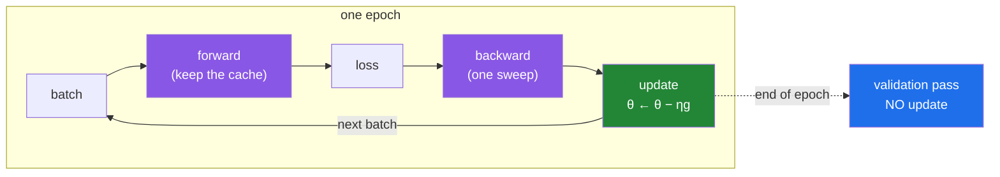

# Day 128 — The training loop

**Phase 15 · Module 15** · ID: **DL-05** (training loop from scratch in NumPy) · 🔁 **ML-06** (Day 95)

> **Yesterday:** backpropagation, derived and gradient-checked. You can compute every gradient in one
> backward sweep, and you have proof that the numbers are right.
> **Today:** the loop that uses them. It is **four lines**, and Day 95 already taught you three of
> them. The hard part was never writing the loop — it is **reading what comes out of it**, and today's
> result is that a descending loss curve is not evidence that anything was learned.
> **Tomorrow:** activation functions, and the vanishing gradient you reproduced yesterday, fixed.

```bash
./m start 128 && ./m scaffold 128
```

**Time:** 2 hours. **Request budget:** 0 model calls.

---

## §1 The story

Day 95 gave you gradient descent for one layer. Day 127 gave you the gradients for all of them.
Today those two facts meet, and the meeting is short:



**Everything a framework gives you is bookkeeping around those four boxes.** `model.fit()` is batching,
shuffling, metric accumulation, callbacks, device placement and a progress bar wrapped around the same
forward → loss → backward → update. Writing it once in NumPy is what makes `fit()` legible instead of
magical, and it is the last day in this phase where nothing is hidden from you.

So the interesting question is not "how do I write the loop". It is **"how do I know the loop worked"**,
and today has three answers that are all uncomfortable.

**A loss curve that goes down means nothing on its own.** At a learning rate of 0.01 this lab produces
a perfectly smooth, monotonically decreasing curve that ends at `0.24894` — against a constant
predictor that scores `0.25`. The curve looks like a textbook illustration of successful training. The
model learned essentially nothing. **The baseline is the only thing that makes a loss curve readable**,
which is Day 124's lesson arriving in a new phase.

**A loss curve that is flat means nothing either.** The same lab, at a learning rate of 0.5, sits at
`0.2500` for nearly **2,900 epochs** and then falls to `0.0145`. If you had stopped at epoch 2,000 —
a perfectly reasonable thing to do after watching a flat line for that long — you would have concluded
the network could not learn XOR. It could. It was on a plateau.

**One run is not a result.** The same architecture, the same hyperparameters, the same code, with
nothing different but the seed: **15 of 20 runs solve XOR and 5 do not.** Reporting the run that
worked is not a mistake you make on purpose; it is what happens by default when you run something once
and it works.

That is the day. The loop is four lines. The discipline around it is everything else.

---

## §2 Setup — run this

```bash
mkdir -p days/day-128/lab
touch days/day-128/lab/training_loop.py
```

No new packages. NumPy only, still — `src/setu/nn.py` grows, and Day 125's XOR problem comes back as
the test case, because a problem you have already **proved** is unlearnable by one layer is the honest
place to watch a network learn.

---

## §3 DL-05 — the loop, and how to read it

`days/day-128/lab/training_loop.py`:

```python
"""DL-05: a full training loop in pure NumPy, and the discipline of reading it."""

from __future__ import annotations

import numpy as np

from setu.arrays import make_rng

XOR_X = np.array([[0.0, 0.0], [0.0, 1.0], [1.0, 0.0], [1.0, 1.0]])
XOR_Y = np.array([[0.0], [1.0], [1.0], [0.0]])


def sigmoid(z):
    return 1.0 / (1.0 + np.exp(-np.clip(z, -500, 500)))


def sigmoid_prime(z):
    s = sigmoid(z)
    return s * (1 - s)


def initialise(rng, sizes, scale=1.0):
    return [{"W": rng.normal(0, scale, (a, b)), "b": np.zeros(b)}
            for a, b in zip(sizes[:-1], sizes[1:], strict=True)]


def forward(x, layers):
    caches, a = [], x
    for layer in layers:
        z = a @ layer["W"] + layer["b"]
        caches.append({"x": a, "z": z})
        a = sigmoid(z)
    return a, caches


def gradients(y, output, caches, layers):
    delta = 2 * (output - y) / y.size * sigmoid_prime(caches[-1]["z"])
    out = [None] * len(layers)
    for i in range(len(layers) - 1, -1, -1):
        out[i] = {"W": caches[i]["x"].T @ delta, "b": delta.sum(axis=0)}
        if i > 0:
            delta = (delta @ layers[i]["W"].T) * sigmoid_prime(caches[i - 1]["z"])
    return out


def fit(x, y, layers, *, epochs, learning_rate):
    history = []
    for _ in range(epochs):
        output, caches = forward(x, layers)            # 1. forward
        history.append(((output - y) ** 2).mean())     # 2. loss
        grads = gradients(y, output, caches, layers)   # 3. backward
        for layer, g in zip(layers, grads, strict=True):
            layer["W"] -= learning_rate * g["W"]       # 4. update
            layer["b"] -= learning_rate * g["b"]
    return history


def the_loop_is_four_lines() -> None:
    print("\n  forward  : output, caches = forward(x, layers)")
    print("  loss     : loss = mean((output − y)²)")
    print("  backward : grads = gradients(y, output, caches, layers)")
    print("  update   : θ ← θ − η·g   for every parameter")

    print("\n  ✅ That is a neural network training loop. All of it.")
    print("\n  What Keras and PyTorch add around these four lines:")
    for added, hidden in (
        ("batching and shuffling", "which rows a step actually saw"),
        ("metric accumulation", "whether a metric is per-batch or per-epoch"),
        ("callbacks / early stopping", "which split the stopping decision read"),
        ("device placement", "where the memory went"),
        ("a progress bar", "the plateau, behind a moving number"),
    ):
        print(f"    {added:<28} hides: {hidden}")

    print("\n  ⚠️ None of that is criticism — you WANT those things by Day 134. But every")
    print("     item in the right-hand column is a bug you cannot see, and today is the")
    print("     one day in this phase where nothing is hidden from you.")


def learning_xor_at_last() -> None:
    print("\n  Day 125 PROVED one layer cannot do this, then you built the solution by")
    print("  hand. Today the network finds it — 2 inputs, 2 hidden units, 1 output.")

    rng = make_rng(0)
    layers = initialise(rng, [2, 2, 1])
    history = fit(XOR_X, XOR_Y, layers, epochs=4000, learning_rate=0.5)
    output, _ = forward(XOR_X, layers)

    print(f"\n  {'epoch':>8} {'loss':>10}")
    for epoch in (0, 500, 1000, 1500, 2000, 3000, 3999):
        print(f"  {epoch:>8} {history[epoch]:>10.4f}")

    stuck = sum(1 for v in history if v > 0.2499)
    escaped = next(i for i, v in enumerate(history) if v < 0.24)
    print(f"\n  epochs spent above 0.2499 : {stuck}")
    print(f"  first epoch below 0.24    : {escaped}")
    print(f"  predictions : {np.round(output.ravel(), 3).tolist()}")
    print(f"  targets     : {XOR_Y.ravel().tolist()}")

    print("\n  🚨 Read the loss column again. It sits at 0.2500 — the constant-predictor")
    print(f"     score — until epoch {escaped}. Stop at epoch 2000 and you would report,")
    print("     honestly and wrongly, that the network cannot learn XOR.")
    print("\n  That is a PLATEAU, not a failure. The gradients are tiny but not zero, and")
    print("  the network is slowly rotating the hidden units into a position from which")
    print("  the loss can fall. There is no way to tell the two apart from the curve.")


def the_same_code_twenty_times() -> None:
    print("\n  identical code, identical hyperparameters, ONLY the seed differs.")

    for sizes in ([2, 2, 1], [2, 4, 1]):
        finals = []
        for seed in range(20):
            rng = make_rng(seed)
            layers = initialise(rng, sizes)
            fit(XOR_X, XOR_Y, layers, epochs=4000, learning_rate=0.5)
            output, _ = forward(XOR_X, layers)
            finals.append(((output - XOR_Y) ** 2).mean())

        solved = sum(1 for v in finals if v < 0.01)
        print(f"\n  {sizes}: solved {solved}/20   "
              f"best {min(finals):.4f}   worst {max(finals):.4f}")
        print(f"    finals: {[f'{v:.3f}' for v in finals]}")

    print("\n  now look at what a FAILED run actually predicts:")
    for seed in (6, 13, 18):
        rng = make_rng(seed)
        layers = initialise(rng, [2, 2, 1])
        fit(XOR_X, XOR_Y, layers, epochs=4000, learning_rate=0.5)
        output, _ = forward(XOR_X, layers)
        loss = ((output - XOR_Y) ** 2).mean()
        print(f"    seed {seed:<3} loss {loss:.4f}  {np.round(output.ravel(), 3).tolist()}")

    print("\n  🚨 Two of the four rows are pinned at 0.50 — the network solved half the")
    print("     problem and gave up. Two rows wrong by 0.5 each is (0.25+0.25)/4 = 0.125,")
    print("     which is exactly the loss you see. The failure has a SHAPE.")
    print("\n  ✅ Widening the hidden layer from 2 to 4 units takes it to 20/20. The extra")
    print("     units are not extra capacity — the hand-built solution needs only two —")
    print("     they are extra CHANCES for a random start to land somewhere workable.")
    print("\n  🚨 A single successful run is not a result. If you report the run that")
    print("     worked, you have reported the seed, not the architecture.")


def a_descending_loss_proves_nothing() -> None:
    print("\n  same network, same data, learning rate 0.01 instead of 0.5.")

    rng = make_rng(1)
    layers = initialise(rng, [2, 4, 1])
    history = fit(XOR_X, XOR_Y, layers, epochs=3000, learning_rate=0.01)

    monotone = all(history[i + 1] <= history[i] + 1e-12 for i in range(len(history) - 1))
    baseline = ((XOR_Y.mean() - XOR_Y) ** 2).mean()

    print(f"\n  {'epoch':>8} {'loss':>10}")
    for epoch in (0, 500, 1500, 2999):
        print(f"  {epoch:>8} {history[epoch]:>10.5f}")

    print(f"\n  monotonically decreasing : {monotone}")
    print(f"  final loss               : {history[-1]:.5f}")
    print(f"  constant-predictor loss  : {baseline:.5f}")
    print(f"  improvement over baseline: {baseline - history[-1]:.5f}")

    print("\n  🚨 That curve is smooth, monotone, and textbook. It is also worthless.")
    print("     The model beat 'always predict 0.5' by 0.001 in 3000 epochs.")
    print("\n  ✅ THE BASELINE IS THE ONLY THING THAT MAKES A LOSS CURVE READABLE. This is")
    print("     Day 124's rule arriving in a new phase: a number with nothing to compare")
    print("     it against is not evidence. Print the baseline on every training run.")


def symmetry_never_breaks_itself() -> None:
    print("\n  what if every weight starts at the same value?")

    for label, start in (("all zeros", 0.0), ("all 0.5", 0.5)):
        layers = [{"W": np.full((2, 4), start), "b": np.zeros(4)},
                  {"W": np.full((4, 1), start), "b": np.zeros(1)}]
        fit(XOR_X, XOR_Y, layers, epochs=2000, learning_rate=0.5)
        output, _ = forward(XOR_X, layers)
        hidden = layers[0]["W"]
        identical = np.allclose(hidden, hidden[:, [0]])
        print(f"\n  {label}")
        print(f"    final loss                    : {((output - XOR_Y) ** 2).mean():.6f}")
        print(f"    all 4 hidden units identical? : {identical}")
        print(f"    hidden weights                : {np.round(hidden, 4).tolist()}")

    print("\n  🚨 The four hidden units stay IDENTICAL forever. They receive identical")
    print("     gradients at every step because they compute identical outputs, so they")
    print("     move together for as long as you train.")
    print("\n  A 4-unit hidden layer initialised to a constant has the representational")
    print("  capacity of ONE unit. With zeros it is worse: the loss sits at exactly")
    print("  0.250000, the constant-predictor score, and never moves at all.")
    print("\n  ✅ Random initialisation is not a heuristic for 'we do not know better'.")
    print("     It is the mechanism that BREAKS SYMMETRY, and without it depth and width")
    print("     buy you nothing. Day 132 asks the next question — what SCALE — and shows")
    print("     that the answer depends on the layer's fan-in.")


def updating_inside_the_backward_pass() -> None:
    print("\n  a bug with no error message: update each layer as you reach it, so the")
    print("  backward pass through layer i−1 uses layer i's ALREADY-UPDATED weights.")

    def run(*, buggy, learning_rate, seed=1, epochs=3000):
        rng = make_rng(seed)
        layers = initialise(rng, [2, 4, 1])
        final = None
        for _ in range(epochs):
            output, caches = forward(XOR_X, layers)
            final = ((output - XOR_Y) ** 2).mean()
            delta = 2 * (output - XOR_Y) / XOR_Y.size * sigmoid_prime(caches[-1]["z"])
            for i in range(len(layers) - 1, -1, -1):
                grad_w = caches[i]["x"].T @ delta
                grad_b = delta.sum(axis=0)
                if buggy:
                    layers[i]["W"] -= learning_rate * grad_w
                    layers[i]["b"] -= learning_rate * grad_b
                    if i > 0:
                        delta = (delta @ layers[i]["W"].T) * sigmoid_prime(caches[i - 1]["z"])
                else:
                    if i > 0:
                        delta = (delta @ layers[i]["W"].T) * sigmoid_prime(caches[i - 1]["z"])
                    layers[i]["W"] -= learning_rate * grad_w
                    layers[i]["b"] -= learning_rate * grad_b
        return final

    print(f"\n  {'learning rate':>14} {'correct':>12} {'buggy':>12} {'ratio':>10}")
    for rate in (0.5, 5.0, 20.0, 50.0):
        good = run(buggy=False, learning_rate=rate)
        bad = run(buggy=True, learning_rate=rate)
        print(f"  {rate:>14} {good:>12.6f} {bad:>12.6f} {bad / good:>10.3f}")

    print("\n  🚨 Read the ratio column top to bottom. At the learning rates you would")
    print("     TEST at, the bug is invisible — a fraction of a percent. At the learning")
    print("     rates you would eventually TUNE UP to, it destroys the run completely.")
    print("\n  ✅ That is the worst possible failure mode: correct-looking in development,")
    print("     catastrophic in the configuration you ship. And yesterday's gradient check")
    print("     does NOT catch it, because each individual gradient is computed correctly —")
    print("     it is the ORDER of update and use that is wrong.")
    print("\n  ⚠️ The fix is structural, not careful: compute ALL gradients first, then")
    print("     apply ALL updates. A pure function that returns new parameters cannot")
    print("     express this bug, which is why §4's sgd_update does not mutate.")


def two_curves_not_one() -> None:
    print("\n  20 noisy points, a 1-64-64-1 network. Far more parameters than data.")

    rng = make_rng(7)
    x_train = np.sort(rng.uniform(-3, 3, (20, 1)), axis=0)
    y_train = np.sin(x_train) * 0.5 + 0.5 + rng.normal(0, 0.25, (20, 1))
    x_validation = rng.uniform(-3, 3, (400, 1))
    y_validation = np.sin(x_validation) * 0.5 + 0.5 + rng.normal(0, 0.25, (400, 1))

    layers = initialise(make_rng(11), [1, 64, 64, 1], scale=1.5)
    train_curve, validation_curve = [], []
    for _ in range(20_000):
        output, caches = forward(x_train, layers)
        train_curve.append(((output - y_train) ** 2).mean())
        held_out, _ = forward(x_validation, layers)
        validation_curve.append(((held_out - y_validation) ** 2).mean())

        grads = gradients(y_train, output, caches, layers)
        for layer, g in zip(layers, grads, strict=True):
            layer["W"] -= 1.0 * g["W"]
            layer["b"] -= 1.0 * g["b"]

    best = int(np.argmin(validation_curve))
    print(f"\n  {'epoch':>8} {'train':>10} {'validation':>12}")
    for epoch in (0, 2000, 5000, 10_000, 19_999):
        print(f"  {epoch:>8} {train_curve[epoch]:>10.4f} {validation_curve[epoch]:>12.4f}")

    print(f"\n  best validation epoch : {best}")
    print(f"  train  from best to end: {train_curve[best]:.5f} -> {train_curve[-1]:.5f}  "
          f"({(train_curve[-1] - train_curve[best]) / train_curve[best]:+.1%})")
    print(f"  valid. from best to end: {validation_curve[best]:.5f} -> {validation_curve[-1]:.5f}  "
          f"({(validation_curve[-1] - validation_curve[best]) / validation_curve[best]:+.1%})")

    print("\n  🚨 The two curves go OPPOSITE WAYS. Training loss keeps improving while")
    print("     validation loss gets worse — the network is memorising the 20 points,")
    print("     noise included. With one curve you would see nothing but success.")
    print("\n  ✅ Early stopping is exactly 'keep the parameters from the validation")
    print("     minimum'. It is the cheapest regulariser there is and it costs one extra")
    print("     forward pass per epoch.")
    print("\n  🚨 PRINCIPLE 8, TODAY'S FORM: early-stop on VALIDATION, never on test. The")
    print("     moment a stopping decision reads the test set, the test score stops being")
    print("     an estimate of unseen performance — you selected the epoch that flattered")
    print("     it. You need three splits the moment you tune anything.")


def where_the_leak_hides() -> None:
    print("\n  Principle 8 again, in the place it hides in a training script.")

    rng = make_rng(5)
    features = rng.normal(0, 1, (60, 4)) * np.array([50.0, 0.2, 7.0, 1.0]) \
        + np.array([100.0, -3.0, 20.0, 0.0])
    weights = np.array([[0.02], [1.5], [-0.1], [0.7]])
    target = sigmoid(features @ weights * 0.1 + rng.normal(0, 0.1, (60, 1)))
    train_rows, validation_rows = np.arange(0, 40), np.arange(40, 60)

    def train_and_score(mean, std, label):
        standardised = (features - mean) / std
        layers = initialise(make_rng(2), [4, 8, 1], scale=0.5)
        fit(standardised[train_rows], target[train_rows], layers,
            epochs=2000, learning_rate=0.5)
        held_out, _ = forward(standardised[validation_rows], layers)
        score = ((held_out - target[validation_rows]) ** 2).mean()
        print(f"  {label:<38} validation MSE = {score:.6f}")
        return score

    leaked = train_and_score(features.mean(axis=0), features.std(axis=0),
                             "standardised on ALL rows  (LEAK)")
    clean = train_and_score(features[train_rows].mean(axis=0),
                            features[train_rows].std(axis=0),
                            "standardised on TRAIN only (correct)")

    print(f"\n  the leak makes validation look {(clean - leaked) / clean:+.1%} better")
    print(f"  train mean : {np.round(features[train_rows].mean(axis=0), 3).tolist()}")
    print(f"  all   mean : {np.round(features.mean(axis=0), 3).tolist()}")

    print("\n  🚨 WHERE THE LEAK WOULD HAVE BEEN TODAY: one line of preprocessing above")
    print("     the split. `(features - features.mean(0)) / features.std(0)` reads all 60")
    print("     rows, so the 40 training rows are centred using information from the 20")
    print("     you are about to score on.")
    print("\n  ✅ Five percent here, on well-behaved synthetic data. It is much larger when")
    print("     the validation rows are few, or drawn from a shifted distribution, or when")
    print("     the scaler is fitted on a column with outliers. THE SPLIT COMES FIRST.")


if __name__ == "__main__":
    the_loop_is_four_lines()
    learning_xor_at_last()
    the_same_code_twenty_times()
    a_descending_loss_proves_nothing()
    symmetry_never_breaks_itself()
    updating_inside_the_backward_pass()
    two_curves_not_one()
    where_the_leak_hides()
```

**Line by line:**

- `zip(sizes[:-1], sizes[1:], strict=True)` — pairs consecutive widths into `(in, out)`, so
  `[2, 4, 1]` becomes `(2, 4)` and `(4, 1)`. Note the `[:-1]`: the obvious `zip(sizes, sizes[1:])`
  gives the same pairs only because `zip` stops at the shorter argument, and **that is exactly the
  silent truncation `strict=True` exists to catch** — so it has to be written as two equal-length
  sequences or `strict=True` raises. Trimming both ends explicitly is the honest version.
- `fit` — the four lines, numbered in the comments. `forward` → loss → `gradients` → update. **Every
  training loop you will ever write is this**, and Days 134–136 add batching and callbacks around it
  without changing the middle.
- `layer["W"] -= learning_rate * g["W"]` — in-place subtraction on the parameter. Note this happens
  **after** all gradients are computed, which is the whole subject of
  `updating_inside_the_backward_pass`.
- `the_loop_is_four_lines` — the right-hand column is the point. **Every convenience a framework adds
  hides a specific fact**, and each of those facts is a bug you cannot see from the outside.
- `learning_xor_at_last` — **the plateau.** The loss holds at `0.2500` for nearly 2,900 epochs before
  falling to `0.0145`. Stop at 2,000 and your conclusion is honest and wrong. **A flat curve and a
  dead network look identical.**
- `the_same_code_twenty_times` — **15/20 at two hidden units, 20/20 at four.** And the failures have a
  shape: two rows pinned at `0.50`, giving `(0.25 + 0.25)/4 = 0.125`, exactly the loss printed. **The
  extra units are extra chances, not extra capacity** — Day 125 proved two units suffice.
- `a_descending_loss_proves_nothing` — **the headline.** A smooth, monotone, textbook-looking curve
  that ends at `0.24894` against a baseline of `0.25`. **Print the baseline on every run**, or the
  curve is unreadable.
- `symmetry_never_breaks_itself` — identical initial weights receive identical gradients forever, so
  four hidden units have the capacity of one. **Random init is the mechanism that breaks symmetry**,
  not a shrug. Day 132 asks about the scale.
- `updating_inside_the_backward_pass` — the ratio column is the lesson: **invisible at the learning
  rates you test at, fatal at the ones you tune up to.** Yesterday's gradient check does not catch it,
  because every individual gradient is correct and only the **order** is wrong. The fix is structural —
  a non-mutating update cannot express the bug.
- `two_curves_not_one` — train and validation move in **opposite directions**; with one curve you see
  only success. And Principle 8's form for today: **early-stop on validation, never on test**, because
  a stopping decision that reads the test set has spent it.
- `where_the_leak_hides` — **one line of preprocessing above the split** makes validation look 5%
  better. The split comes before the scaler. Always.

---

## §4 Build brief

Extend `src/setu/nn.py`:

```python
@dataclass(frozen=True)
class TrainResult:
    """TODO(me): everything needed to JUDGE a run, not just reproduce it.

    layers, train_history, validation_history, baseline, best_epoch,
    stopped_because, seed, epochs_run
    - frozen, like Day 95's DescentResult: a result object that a caller can edit
      is a result you cannot trust
    - baseline is stored ALONGSIDE the history on purpose (§3.4) — a history
      without its baseline is unreadable, and separating them is how they drift
    """


def initialise_network(layer_sizes: list[int], *, seed: int, activation: str = "sigmoid",
                       scale: float = 1.0) -> list[dict]:
    """TODO(me): random layers, and a refusal to break Principle 4.

    - one dict per layer: {"weights", "bias", "activation"}; biases start at ZERO
      (they do not suffer the symmetry problem — say why in the docstring)
    - seed is REQUIRED and keyword-only; an unseeded network is unreproducible and
      §3.3 is the reason this matters more than it looks
    - raise DataError if scale <= 0 — a constant or zero initialisation never
      breaks symmetry, and the message must say that all units would stay
      identical forever (§3.5) rather than just 'invalid scale'
    - raise DataError on fewer than 2 sizes or any size < 1
    - the docstring must point at Day 132 for the question of what scale to use
    """
    raise NotImplementedError


def epoch_batches(n_rows: int, *, batch_size: int, rng, shuffle: bool = True):
    """TODO(me): yield index arrays for one epoch. PURE given rng.

    - yields arrays of row indices, together covering every row EXACTLY once
    - shuffle uses rng.permutation; with shuffle=False the order is 0..n-1, and
      the docstring must say what that does to data sorted by label (batches that
      are single-class, so each step pulls the whole net toward one answer)
    - the LAST batch is smaller when batch_size does not divide n_rows. Do not
      silently drop it — say in the docstring that dropping it loses data and
      keeping it makes the last step noisier, and that Day 133's batch-norm is
      where a size-1 final batch actually breaks
    - raise DataError if batch_size < 1 or n_rows < 1
    """
    raise NotImplementedError


def sgd_update(layers: list[dict], gradients: list[dict], *,
               learning_rate: float) -> list[dict]:
    """TODO(me): θ ← θ − η·g, returning NEW layers. Does not mutate.

    - return a new list of new dicts with new arrays; the input layers must be
      unchanged afterwards, and there is a test for exactly that
    - the docstring must state WHY it is non-mutating: an in-place update invites
      §3.6's bug, where a layer is updated before the backward pass has finished
      using it. A pure function cannot express that bug.
    - raise DataError if len(gradients) != len(layers), naming both counts
    - raise DataError if learning_rate <= 0
    """
    raise NotImplementedError


def baseline_loss(y, *, loss: str = "mse") -> float:
    """TODO(me): what the best CONSTANT predictor scores. PURE.

    - mse -> the mean of y is optimal; bce -> the base rate is
    - this is the number every training curve must be read against (§3.4), and
      the docstring must say that a model failing to beat it has learned nothing
      no matter how the loss curve looks
    - raise DataError on an empty y
    """
    raise NotImplementedError


def train(x, y, layers: list[dict], *, epochs: int, learning_rate: float,
          batch_size: int | None = None, seed: int, validation: tuple | None = None,
          early_stopping_patience: int | None = None) -> TrainResult:
    """TODO(me): §3.1's four lines, with the bookkeeping that makes them readable.

    - forward, loss, backward, update — in that order, with ALL gradients computed
      before ANY update is applied (§3.6)
    - record train loss every epoch; record validation loss too when validation is
      given, and NEVER update parameters on the validation pass — assert it by
      checking the parameters are unchanged across that call
    - baseline_loss(y) goes into the result, always
    - early stopping watches the VALIDATION history and nothing else; raise
      DataError if early_stopping_patience is set with no validation split, and
      make the message say why reading the test set to stop would spend it (§3.7)
    - stopped_because is one of 'epochs', 'early-stopping'
    - batch_size None means full batch; otherwise use epoch_batches with the seeded
      rng so a run is reproducible from `seed` alone
    - raise DataError if x and y disagree on row count, naming both
    """
    raise NotImplementedError


def diagnose_training(result: TrainResult) -> dict:
    """TODO(me): read a run and say what to DO about it. PURE.

    {"verdict", "beats_baseline": bool, "overfitting": bool, "plateaued": bool,
     "action": str}
    - beats_baseline compares the best loss against result.baseline (§3.4)
    - plateaued: the loss changed by less than 1e-4 over the last 20% of epochs
      AND has not beaten the baseline — the docstring must say this cannot be
      distinguished from a slow escape (§3.2) and that the action is 'train
      longer before concluding anything'
    - overfitting: validation rose while train fell
    - every verdict must name an ACTION. 'The loss is high' is not a diagnosis;
      'the loss never beat the baseline, raise the learning rate' is
    - raise DataError if the result has no history
    """
    raise NotImplementedError


def seed_stability(fit_once, *, seeds: range | list[int]) -> dict:
    """TODO(me): §3.3 — run the same configuration N times and report the spread.

    {"finals": [float], "solved": int, "n": int, "success_rate": float,
     "best", "worst", "median", "note": str}
    - fit_once(seed) -> final loss, so the caller decides what 'a run' means
    - the note must state that a single run reports the SEED, not the
      architecture, and that reporting the run that worked is the default
      failure, not a deliberate one
    - raise DataError on fewer than 3 seeds — a spread over two runs is not a
      spread, and the message must say so
    """
    raise NotImplementedError


def assert_beats_baseline(result: TrainResult) -> None:
    """TODO(me): raise DataError unless the run actually learned something.

    - compare the best recorded loss against result.baseline
    - the message must quote BOTH numbers and say that a descending loss curve is
      not evidence of learning (§3.4)
    - this is the training-loop twin of Day 127's assert_gradients_checked, and it
      catches the failure that looks most like success
    """
    raise NotImplementedError
```

- `sgd_update` **returning new layers instead of mutating** is the day's design decision, and the
  docstring has to carry the reason: §3.6's bug is unreachable through a pure function. Structure beats
  care.
- `train` **refusing `early_stopping_patience` without a validation split** is Principle 8 encoded. The
  alternative — silently stopping on the training loss, or on the test set — is exactly how a test
  score stops being an estimate.
- `diagnose_training` insisting that **`plateaued` cannot be distinguished from a slow escape** is the
  honest version. §3.2 spent 2,900 epochs on a plateau; a diagnostic that claims to tell them apart
  would be lying.
- `seed_stability` exists because **one run is not a result**, and the note is what makes someone
  actually run it twenty times instead of nodding at the idea.

---

## §5 The eval that must be able to fail

Add to `tests/test_nn.py`:

```python
from setu.nn import (
    TrainResult,
    assert_beats_baseline,
    baseline_loss,
    diagnose_training,
    epoch_batches,
    initialise_network,
    seed_stability,
    sgd_update,
    train,
)

XOR_X = np.array([[0.0, 0.0], [0.0, 1.0], [1.0, 0.0], [1.0, 1.0]])
XOR_Y = np.array([[0.0], [1.0], [1.0], [0.0]])


def test_a_constant_initialisation_is_refused():
    """Symmetry never breaks itself."""
    with pytest.raises(DataError) as info:
        initialise_network([2, 4, 1], seed=0, scale=0.0)
    message = str(info.value).lower()
    assert "identical" in message or "symmetry" in message


def test_biases_start_at_zero():
    """They do not suffer the symmetry problem — the weights already broke it."""
    layers = initialise_network([2, 4, 1], seed=0)
    assert all(np.array_equal(layer["bias"], np.zeros_like(layer["bias"]))
               for layer in layers)


def test_the_same_seed_gives_the_same_network():
    a = initialise_network([3, 5, 2], seed=7)
    b = initialise_network([3, 5, 2], seed=7)
    assert all(np.array_equal(x["weights"], y["weights"]) for x, y in zip(a, b))


def test_different_seeds_give_different_networks():
    a = initialise_network([3, 5, 2], seed=7)
    b = initialise_network([3, 5, 2], seed=8)
    assert not np.array_equal(a[0]["weights"], b[0]["weights"])


def test_the_init_docstring_points_at_the_scale_question():
    text = initialise_network.__doc__.lower()
    assert "132" in text or "xavier" in text or "he" in text


def test_batches_cover_every_row_exactly_once():
    """A batching bug that drops rows is invisible in the loss."""
    seen = np.concatenate(list(epoch_batches(50, batch_size=16, rng=make_rng(0))))
    assert sorted(seen.tolist()) == list(range(50))


def test_the_last_batch_is_kept_not_dropped():
    sizes = [len(b) for b in epoch_batches(50, batch_size=16, rng=make_rng(0))]
    assert sizes == [16, 16, 16, 2]


def test_the_batch_docstring_names_the_sorted_data_problem():
    text = epoch_batches.__doc__.lower()
    assert "sort" in text or "single-class" in text or "label" in text


def test_shuffling_changes_the_order_but_not_the_contents():
    ordered = np.concatenate(list(epoch_batches(30, batch_size=8, rng=make_rng(0),
                                                shuffle=False)))
    shuffled = np.concatenate(list(epoch_batches(30, batch_size=8, rng=make_rng(0),
                                                 shuffle=True)))
    assert ordered.tolist() == list(range(30))
    assert shuffled.tolist() != ordered.tolist()
    assert sorted(shuffled.tolist()) == sorted(ordered.tolist())


def test_a_zero_batch_size_is_refused():
    with pytest.raises(DataError):
        list(epoch_batches(10, batch_size=0, rng=make_rng(0)))


def test_the_update_does_not_mutate_its_input():
    """A pure update cannot express the order bug from section 3.6."""
    layers = initialise_network([2, 3, 1], seed=0)
    before = [layer["weights"].copy() for layer in layers]
    grads = [{"dW": np.ones_like(layer["weights"]), "db": np.ones_like(layer["bias"])}
             for layer in layers]
    sgd_update(layers, grads, learning_rate=0.1)
    assert all(np.array_equal(layer["weights"], original)
               for layer, original in zip(layers, before))


def test_the_update_moves_against_the_gradient():
    layers = [{"weights": np.ones((2, 2)), "bias": np.zeros(2), "activation": "sigmoid"}]
    grads = [{"dW": np.ones((2, 2)), "db": np.ones(2)}]
    updated = sgd_update(layers, grads, learning_rate=0.25)
    assert np.allclose(updated[0]["weights"], 0.75)


def test_the_update_docstring_explains_why_it_is_pure():
    text = sgd_update.__doc__.lower()
    assert "mutat" in text
    assert "backward" in text or "before" in text


def test_a_gradient_count_mismatch_names_both():
    layers = initialise_network([2, 3, 1], seed=0)
    with pytest.raises(DataError) as info:
        sgd_update(layers, [{"dW": np.zeros((2, 3)), "db": np.zeros(3)}],
                   learning_rate=0.1)
    assert "2" in str(info.value) and "1" in str(info.value)


def test_the_baseline_is_the_mean_for_mse():
    y = np.array([[1.0], [2.0], [3.0], [10.0]])
    assert baseline_loss(y) == pytest.approx(((y.mean() - y) ** 2).mean())


def test_the_xor_baseline_is_a_quarter():
    """The number every curve in this lesson is read against."""
    assert baseline_loss(XOR_Y) == pytest.approx(0.25)


def test_the_baseline_docstring_says_a_curve_needs_it():
    text = baseline_loss.__doc__.lower()
    assert "learned nothing" in text or "no matter how" in text


def test_the_network_learns_xor():
    """Day 125 proved one layer cannot. Today it is learned, not hand-built."""
    layers = initialise_network([2, 4, 1], seed=1)
    result = train(XOR_X, XOR_Y, layers, epochs=4000, learning_rate=0.5, seed=1)
    assert result.train_history[-1] < 0.01


def test_training_is_reproducible_from_the_seed_alone():
    def run():
        layers = initialise_network([2, 4, 1], seed=3)
        return train(XOR_X, XOR_Y, layers, epochs=200, learning_rate=0.5,
                     batch_size=2, seed=3).train_history
    assert run() == pytest.approx(run())


def test_the_result_carries_its_baseline():
    """A history without its baseline is unreadable."""
    layers = initialise_network([2, 4, 1], seed=1)
    result = train(XOR_X, XOR_Y, layers, epochs=50, learning_rate=0.5, seed=1)
    assert result.baseline == pytest.approx(0.25)


def test_the_validation_pass_does_not_update_the_parameters():
    """The single most important property of an evaluation pass."""
    layers = initialise_network([2, 4, 1], seed=1)
    with_validation = train(XOR_X, XOR_Y, layers, epochs=100, learning_rate=0.5,
                            seed=1, validation=(XOR_X, XOR_Y)).train_history

    layers = initialise_network([2, 4, 1], seed=1)
    without = train(XOR_X, XOR_Y, layers, epochs=100, learning_rate=0.5,
                    seed=1).train_history
    assert with_validation == pytest.approx(without)


def test_early_stopping_without_a_validation_split_is_refused():
    """Principle 8: stopping on the test set spends it."""
    layers = initialise_network([2, 4, 1], seed=1)
    with pytest.raises(DataError) as info:
        train(XOR_X, XOR_Y, layers, epochs=100, learning_rate=0.5, seed=1,
              early_stopping_patience=5)
    assert "validation" in str(info.value).lower()


def test_early_stopping_stops_before_the_epoch_cap():
    """20 noisy points and a 64-unit net: validation turns around early."""
    rng = make_rng(9)
    x = rng.uniform(-3, 3, (20, 1))
    y = np.sin(x) * 0.5 + 0.5 + rng.normal(0, 0.25, (20, 1))
    x_validation = rng.uniform(-3, 3, (200, 1))
    y_validation = np.sin(x_validation) * 0.5 + 0.5 + rng.normal(0, 0.25, (200, 1))

    layers = initialise_network([1, 64, 1], seed=4, scale=1.5)
    result = train(x, y, layers, epochs=20_000, learning_rate=1.0, seed=4,
                   validation=(x_validation, y_validation),
                   early_stopping_patience=200)
    assert result.stopped_because == "early-stopping"
    assert result.epochs_run < 20_000
    assert result.best_epoch <= result.epochs_run


def test_a_row_count_mismatch_names_both():
    layers = initialise_network([2, 4, 1], seed=1)
    with pytest.raises(DataError) as info:
        train(XOR_X, XOR_Y[:3], layers, epochs=10, learning_rate=0.5, seed=1)
    assert "4" in str(info.value) and "3" in str(info.value)


def test_a_tiny_learning_rate_descends_and_still_learns_nothing():
    """Today's headline. The curve is textbook; the model is worthless."""
    layers = initialise_network([2, 4, 1], seed=1)
    result = train(XOR_X, XOR_Y, layers, epochs=3000, learning_rate=0.01, seed=1)
    history = result.train_history
    assert all(history[i + 1] <= history[i] + 1e-12 for i in range(len(history) - 1))
    assert history[-1] > 0.24
    assert diagnose_training(result)["beats_baseline"] is False


def test_a_run_that_never_beats_the_baseline_is_refused():
    layers = initialise_network([2, 4, 1], seed=1)
    result = train(XOR_X, XOR_Y, layers, epochs=200, learning_rate=0.001, seed=1)
    with pytest.raises(DataError) as info:
        assert_beats_baseline(result)
    message = str(info.value).lower()
    assert "baseline" in message
    assert "descend" in message or "not evidence" in message


def test_a_real_run_passes_the_baseline_guard():
    layers = initialise_network([2, 4, 1], seed=1)
    result = train(XOR_X, XOR_Y, layers, epochs=4000, learning_rate=0.5, seed=1)
    assert_beats_baseline(result)


def test_a_plateau_is_diagnosed_as_train_longer():
    """Section 3.2 sat at 0.2500 for 2,900 epochs and then succeeded."""
    layers = initialise_network([2, 4, 1], seed=1)
    result = train(XOR_X, XOR_Y, layers, epochs=300, learning_rate=0.005, seed=1)
    diagnosis = diagnose_training(result)
    assert diagnosis["plateaued"] is True
    assert "longer" in diagnosis["action"].lower()


def test_the_plateau_diagnosis_admits_it_cannot_tell():
    text = diagnose_training.__doc__.lower()
    assert "cannot be distinguished" in text or "slow escape" in text


def test_overfitting_is_detected_from_two_curves():
    """One curve shows only success."""
    result = TrainResult(
        layers=[], train_history=[0.5, 0.3, 0.2, 0.15, 0.1],
        validation_history=[0.5, 0.32, 0.30, 0.35, 0.44],
        baseline=0.5, best_epoch=2, stopped_because="epochs", seed=0, epochs_run=5)
    assert diagnose_training(result)["overfitting"] is True


def test_every_diagnosis_names_an_action():
    """'The loss is high' is not a diagnosis."""
    for rate in (0.001, 0.5):
        layers = initialise_network([2, 4, 1], seed=1)
        result = train(XOR_X, XOR_Y, layers, epochs=200, learning_rate=rate, seed=1)
        assert len(diagnose_training(result)["action"]) > 20


def test_the_same_configuration_does_not_always_converge():
    """Today's most uncomfortable test: 15 of 20, same code."""
    def fit_once(seed):
        layers = initialise_network([2, 2, 1], seed=seed)
        return train(XOR_X, XOR_Y, layers, epochs=4000, learning_rate=0.5,
                     seed=seed).train_history[-1]

    spread = seed_stability(fit_once, seeds=range(20))
    assert spread["n"] == 20
    assert 0 < spread["success_rate"] < 1.0
    assert spread["worst"] > 0.1


def test_a_wider_layer_converges_from_every_seed():
    """The contrast that makes the previous test a finding rather than noise."""
    def fit_once(seed):
        layers = initialise_network([2, 4, 1], seed=seed)
        return train(XOR_X, XOR_Y, layers, epochs=4000, learning_rate=0.5,
                     seed=seed).train_history[-1]

    assert seed_stability(fit_once, seeds=range(20))["success_rate"] == 1.0


def test_the_stability_note_says_one_run_reports_the_seed():
    note = seed_stability(lambda s: 0.001, seeds=range(5))["note"].lower()
    assert "seed" in note
    assert "single" in note or "one run" in note


def test_two_seeds_are_not_a_spread():
    with pytest.raises(DataError):
        seed_stability(lambda s: 0.0, seeds=range(2))
```

**Line by line:**

- `test_a_tiny_learning_rate_descends_and_still_learns_nothing` — **today's real assessment.** It
  asserts the curve is monotonically decreasing *and* that the model failed. Those two facts sitting in
  one test is the entire point of the day.
- `test_the_same_configuration_does_not_always_converge` — asserts `0 < success_rate < 1.0`, which is a
  test that **deliberately pins down a failure**. Paired with
  `test_a_wider_layer_converges_from_every_seed`, it is a finding; alone it is noise.
- `test_the_validation_pass_does_not_update_the_parameters` — compares a run with validation against
  one without and demands identical training histories. **An evaluation pass that trains is the
  quietest leak there is.**
- `test_early_stopping_without_a_validation_split_is_refused` — Principle 8 as an exception. Stopping
  on the test set means the test score is no longer an estimate of anything.
- `test_the_update_does_not_mutate_its_input` — makes §3.6's bug **structurally unreachable** rather
  than merely discouraged.
- `test_batches_cover_every_row_exactly_once` and `test_the_last_batch_is_kept_not_dropped` — a
  batching bug that drops rows shows up nowhere in the loss. It just trains on less data than you think.
- `test_a_plateau_is_diagnosed_as_train_longer` with `test_the_plateau_diagnosis_admits_it_cannot_tell`
  — the diagnosis has to be **honest about its own limit.** §3.2's run was flat for 2,900 epochs and
  then worked.
- `test_the_result_carries_its_baseline` — the baseline travels **with** the history, because the two
  drifting apart is how an unreadable curve gets reported as a result.

```bash
uv run python -m pytest tests/test_nn.py -v
```

---

## §6 Request budget

| Resource | Spent today |
|---|---|
| LLM calls | **0** |
| Network | none |
| Compute | `seed_stability` over 20 seeds × 4,000 epochs on a 4-row problem — seconds, but it is the most expensive test in the file. Mark it `@pytest.mark.slow` if `./m check` gets sluggish. |

---

## §7 Traps

- **Reporting a loss curve without a baseline.** The headline failure of the day.
- **Concluding failure from a flat curve.** 2,900 epochs of plateau, then success.
- **Running once.** You have measured the seed, not the architecture.
- **Updating a layer before the backward pass has finished using it.** Invisible at small learning
  rates, fatal at large ones, and the gradient check does not catch it.
- **Initialising to zeros or to a constant.** Every unit in the layer stays identical forever.
- **Forgetting the seed.** An unreproducible run cannot be debugged or reported.
- **Standardising before the split.** Today's leak, worth about 5% of a validation score.
- **Early-stopping on the test set.** The test score stops being an estimate.
- **Updating parameters during the validation pass.** The quietest possible leak.
- **Not shuffling data that is sorted by label.** Every batch pulls toward one class.
- **Silently dropping the last partial batch.** You trained on less data than you think.
- **Watching only the training curve.** Overfitting is invisible in one line.
- **Tuning the learning rate before checking the gradients.** Day 127 exists for a reason.

---

## §8 Verify before you code

Checked **2026-08-22**:

- <https://numpy.org/doc/stable/reference/random/generator.html> — the `Generator` API; `make_rng` wraps
  `default_rng`, and every shuffle in §4 goes through it.
- <https://numpy.org/doc/stable/reference/random/generated/numpy.random.Generator.permutation.html> —
  what `epoch_batches` uses. Note `permutation` returns a copy while `shuffle` works in place.
- <https://numpy.org/doc/stable/reference/generated/numpy.array_split.html> — splits into unequal
  pieces without raising, which is the "keep the last partial batch" behaviour §4 asks for.
- <https://scikit-learn.org/stable/modules/generated/sklearn.model_selection.train_test_split.html> —
  read the `shuffle` and `stratify` arguments against §3.8's leak.
- <https://keras.io/api/models/model_training_apis/> — `fit`, `validation_split`, `callbacks`. Compare
  its argument list to §4's `train` before Day 134.
- <https://pytorch.org/docs/stable/generated/torch.optim.SGD.html> — the same update rule with momentum
  and weight decay bolted on. Day 131 builds those.

---

## §9 Say it in an interview

> "A training loop is four lines: forward, loss, backward, update. Everything a framework adds around
> it — batching, shuffling, callbacks, the progress bar — is bookkeeping, and each convenience hides one
> specific fact you might need. The part worth talking about is how you tell whether a run worked, and
> I'd argue you can't tell from the loss curve. I trained an XOR network at a low learning rate and got
> a perfectly smooth, monotonically decreasing curve that finished at 0.2489 — against a constant
> predictor that scores 0.25. Textbook-looking curve, model learned nothing. So I print the baseline on
> every run. The opposite mistake is just as easy: the same network at a higher learning rate sat at
> exactly 0.2500 for nearly 2,900 epochs and then dropped to 0.014. If I'd stopped at 2,000 I'd have
> reported that it couldn't learn XOR. And one run isn't a result — same code, same hyperparameters,
> only the seed different, and 15 of 20 runs converge. Widening the hidden layer from two units to four
> takes it to 20 out of 20, and that's not extra capacity, because two units provably suffice; it's
> extra chances for the random start to land somewhere workable. The bug I'd warn a team about is
> updating each layer during the backward pass, so the layer below backprops through already-updated
> weights. At the learning rates you test at it changes the answer by a tenth of a percent. At the
> rates you eventually tune up to it destroys the run. A gradient check won't catch it because every
> individual gradient is right — only the order is wrong — so I make the update function return new
> parameters instead of mutating, which makes the bug unwriteable."

---

## §10 Done when

Tick [`CHECKLIST.md`](CHECKLIST.md), then `./m check && ./m done 128`.
