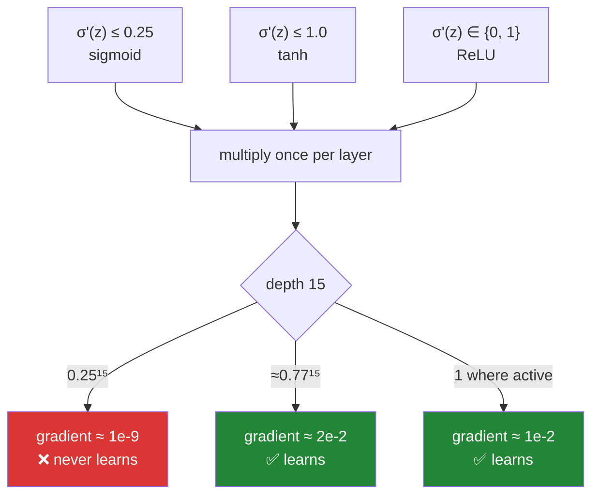

# Day 129 — Activations, and the fix

**Phase 15 · Module 15** · IDs: **DL-06** (sigmoid, tanh, ReLU, LeakyReLU, GELU) · **DL-07** (vanishing
and exploding gradients)

> **Yesterday:** the training loop, and the discipline of reading it against a baseline.
> **Today:** the nonlinearity itself. Day 127 reproduced the vanishing gradient and left it standing —
> `0.25¹² ≈ 6e-8`, the early layers receiving nothing. **Today it gets fixed**, and the fix is measured
> against yesterday's baseline rather than asserted: a 15-layer sigmoid network sits at the baseline
> forever, and the same network with `tanh` or ReLU solves the task.
> **Tomorrow:** loss functions, and what the output layer's activation has to agree with.

```bash
./m start 129 && ./m scaffold 129
```

**Time:** 2 hours. **Request budget:** 0 model calls.

---

## §1 The story

Day 126 established that stacking linear layers is pointless — three of them collapse to one matrix.
The activation function is what stops that collapse, and so it is the only reason depth means anything
at all. That makes it a strange thing to choose casually, which is what everyone does.

The choice is not about the function. **It is about the function's derivative**, because the derivative
is what backpropagation multiplies by, once per layer:



**A number below one, multiplied fifteen times, is a number near zero.** That is the whole vanishing
gradient problem, and it is why deep networks were untrainable for two decades despite backpropagation
being known the entire time. The fix was not a better optimiser or more data. It was replacing a
function whose derivative peaks at `0.25` with one whose derivative is `1`.

Three things today has to establish, all by measurement.

**Saturation is where the gradient dies.** Sigmoid's derivative falls below 1% of its peak once
`|z| > 5.99`, which is **40% of the range `[-10, 10]`**. A unit that lands there stops learning, and
nothing in the loss tells you it happened.

**ReLU's fix has its own failure.** A ReLU unit whose pre-activation is negative for every row of your
data has a gradient of **exactly zero** — not small, zero — so it never updates again. Today builds one
deliberately, runs 10,000 update steps, and shows the weights are bit-for-bit unchanged. In a real
network the count depends on the learning rate: **0.4% of units dead at `lr=0.5`, 39.8% at `lr=200`.**

**Exploding is the same mechanism with the inequality reversed**, and its usual remedy is weaker than
people think. Gradient clipping turns a `NaN`-in-two-steps run into a run that survives 100 steps and
is still useless. **Clipping buys you finiteness, not learning** — Day 132's initialisation is the
actual fix.

---

## §2 Setup — run this

```bash
mkdir -p days/day-129/lab
touch days/day-129/lab/activations.py
```

No new packages. NumPy has no `erf`, so GELU uses `math.erf` through `np.vectorize` — exact, slow, and
fine for arrays this size. `src/setu/nn.py` grows: today extends `ACTIVATIONS` and
`ACTIVATION_DERIVATIVES` from Days 126–127 rather than redefining them.

---

## §3 DL-06 and DL-07 — the five functions and the two failures

`days/day-129/lab/activations.py`:

```python
"""DL-06/DL-07: five activations, their derivatives, and the gradient pathologies."""

from __future__ import annotations

import math

import numpy as np

from setu.arrays import make_rng

ALPHA = 0.01


def sigmoid(z):
    return 1.0 / (1.0 + np.exp(-np.clip(z, -500, 500)))


def sigmoid_prime(z):
    s = sigmoid(z)
    return s * (1 - s)


def tanh_prime(z):
    return 1.0 - np.tanh(z) ** 2


def relu(z):
    return np.maximum(0.0, z)


def relu_prime(z):
    return (z > 0).astype(float)


def leaky_relu(z, alpha=ALPHA):
    return np.where(z > 0, z, alpha * z)


def leaky_relu_prime(z, alpha=ALPHA):
    return np.where(z > 0, 1.0, alpha)


def _normal_cdf(z):
    return 0.5 * (1.0 + np.vectorize(math.erf)(z / np.sqrt(2.0)))


def _normal_pdf(z):
    return np.exp(-(z ** 2) / 2.0) / np.sqrt(2.0 * np.pi)


def gelu(z):
    return z * _normal_cdf(z)


def gelu_prime(z):
    return _normal_cdf(z) + z * _normal_pdf(z)


def five_activations_and_their_derivatives() -> None:
    grid = np.linspace(-10, 10, 200_001)
    print(f"\n  {'activation':<14} {'max a(z)':>10} {'max derivative':>16} "
          f"{'at z':>9} {'min derivative':>16}")
    for name, f, d in (
        ("sigmoid", sigmoid, sigmoid_prime),
        ("tanh", np.tanh, tanh_prime),
        ("relu", relu, relu_prime),
        ("leaky_relu", leaky_relu, leaky_relu_prime),
        ("gelu", gelu, gelu_prime),
    ):
        derivative = d(grid)
        peak = derivative.argmax()
        print(f"  {name:<14} {f(grid).max():>10.4f} {derivative.max():>16.6f} "
              f"{grid[peak]:>+9.4f} {derivative.min():>16.6f}")

    print("\n  🚨 The 'max σ'(z)' column IS the vanishing gradient problem. Backprop")
    print("     multiplies by that number once per layer.")
    print("\n    sigmoid : 0.25 per layer -> 0.25¹⁵ ≈ 9e-10")
    print("    tanh    : 1.00 per layer at the origin, ~0.77 in practice")
    print("    relu    : exactly 1 wherever the unit is active — nothing shrinks")
    print("\n  ✅ That single column is why deep learning waited for ReLU. Backpropagation")
    print("     was published in 1986; what changed was the number in this table.")


def where_the_gradient_goes_to_die() -> None:
    grid = np.linspace(-10, 10, 200_001)
    print("\n  a unit 'saturates' when its derivative is near zero and it stops learning.")
    print(f"\n  {'activation':<10} {'threshold':>10} {'% of [-10,10]':>15} {'starts at |z| >':>17}")
    for name, derivative_fn, peak in (("sigmoid", sigmoid_prime, 0.25),
                                      ("tanh", tanh_prime, 1.0)):
        derivative = derivative_fn(grid)
        for fraction in (0.10, 0.01):
            saturated = derivative < fraction * peak
            edge = grid[(grid > 0) & saturated].min()
            print(f"  {name:<10} {fraction:>9.0%} {saturated.mean():>15.1%} {edge:>17.3f}")

    print("\n  🚨 Sigmoid's derivative is below 1% of its peak on 40% of this range —")
    print("     everything past |z| = 5.99. A unit that drifts there is done learning,")
    print("     and NOTHING in the loss curve tells you it happened.")
    print("\n  ⚠️ Note tanh saturates SOONER in z (past 2.99) but from a peak four times")
    print("     higher. The peak is what compounds with depth; the saturation point is")
    print("     what a single badly-scaled input hits. They are different failures.")


def gelu_is_not_monotonic() -> None:
    grid = np.linspace(-10, 10, 200_001)
    values, derivative = gelu(grid), gelu_prime(grid)
    lowest = values.argmin()
    highest = derivative.argmax()

    print(f"\n  gelu(z) = z·Φ(z), where Φ is the standard normal CDF")
    print(f"\n    minimum value      : {values[lowest]:.6f} at z = {grid[lowest]:+.4f}")
    print(f"    maximum derivative : {derivative[highest]:.6f} at z = {grid[highest]:+.4f}")
    print(f"    minimum derivative : {derivative.min():.6f}")
    print(f"    √2 = {np.sqrt(2):.4f}")

    print("\n  🚨 Two things here contradict what 'an activation function' usually means.")
    print("\n  1. GELU is NOT MONOTONIC. It dips to −0.17 around z = −0.75, so a slightly")
    print("     negative input produces a slightly negative output rather than zero.")
    print("  2. Its derivative EXCEEDS 1 (peak 1.1289) and goes NEGATIVE below −0.13.")
    print("\n  ✅ The peak sits at exactly z = √2, and that is derivable rather than")
    print("     measured: gelu'(z) = Φ(z) + z·φ(z), so gelu''(z) = φ(z)·(2 − z²), which")
    print("     is zero at z = √2. The printout agrees to four decimals.")
    print("\n  ⚠️ A derivative above 1 means GELU can AMPLIFY a gradient rather than only")
    print("     shrink it. That is not a defect — it is why it behaves well at depth —")
    print("     but it does mean 'the derivative is bounded by 1' is not a safe assumption.")


def the_dying_relu() -> None:
    print("\n  a 4-hidden-layer ReLU network, He-initialised, trained at five rates.")
    print("  'dead' = the unit's pre-activation is <= 0 for EVERY row of the data.")

    def run(rate, *, alpha=None, depth=4, width=64, epochs=300):
        rng = make_rng(0)
        x = rng.normal(0, 1, (300, 20))
        y = (x[:, :1] > 0).astype(float)
        sizes = [20] + [width] * depth + [1]
        weights = [rng.normal(0, np.sqrt(2 / a), (a, b))
                   for a, b in zip(sizes[:-1], sizes[1:], strict=True)]
        biases = [np.zeros(b) for b in sizes[1:]]
        act = (lambda v: leaky_relu(v, alpha)) if alpha else relu
        act_prime = (lambda v: leaky_relu_prime(v, alpha)) if alpha else relu_prime

        for _ in range(epochs):
            activations, pre = [x], []
            for i in range(len(weights)):
                z = activations[-1] @ weights[i] + biases[i]
                pre.append(z)
                activations.append(sigmoid(z) if i == len(weights) - 1 else act(z))

            delta = 2 * (activations[-1] - y) / y.size * sigmoid_prime(pre[-1])
            grads = [None] * len(weights)
            for i in range(len(weights) - 1, -1, -1):
                grads[i] = (activations[i].T @ delta, delta.sum(axis=0))
                if i > 0:
                    delta = (delta @ weights[i].T) * act_prime(pre[i - 1])
            for i in range(len(weights)):
                weights[i] -= rate * grads[i][0]
                biases[i] -= rate * grads[i][1]

        activations, pre = [x], []
        for i in range(len(weights)):
            z = activations[-1] @ weights[i] + biases[i]
            pre.append(z)
            activations.append(sigmoid(z) if i == len(weights) - 1 else act(z))
        hidden = pre[:-1]
        silent = sum(int((z <= 0).all(axis=0).sum()) for z in hidden)
        total = sum(z.shape[1] for z in hidden)
        return silent, total, ((activations[-1] - y) ** 2).mean()

    print(f"\n  {'activation':<12} {'rate':>8} {'silent units':>14} {'%':>8} {'loss':>9}")
    for rate in (0.5, 5.0, 20.0, 50.0, 200.0):
        silent, total, loss = run(rate)
        print(f"  {'relu':<12} {rate:>8} {f'{silent}/{total}':>14} "
              f"{silent / total:>8.1%} {loss:>9.4f}")
    for rate in (20.0, 50.0, 200.0):
        silent, total, loss = run(rate, alpha=ALPHA)
        print(f"  {'leaky_relu':<12} {rate:>8} {f'{silent}/{total}':>14} "
              f"{silent / total:>8.1%} {loss:>9.4f}")

    print("\n  🚨 THE LEARNING RATE KILLS THE UNITS. One big step drives the bias so")
    print("     negative that the unit never fires again. 0.4% dead at rate 0.5,")
    print("     39.8% at rate 200 — nearly half the network switched off.")
    print("\n  ⚠️ Read the leaky rows carefully: leaky_relu goes SILENT just as often.")
    print("     The counts are almost identical. What differs is whether silence is")
    print("     PERMANENT, and that is the next function's job to show.")


def a_dead_unit_is_permanently_dead() -> None:
    print("\n  build a silent unit on purpose — bias −20, so z < 0 for every row —")
    print("  then hit it with 10,000 gradient steps and see what moves.")

    rng = make_rng(0)
    x = rng.normal(0, 1, (50, 4))

    for name, derivative_fn in (("relu", relu_prime),
                                ("leaky_relu", leaky_relu_prime)):
        weights = make_rng(1).normal(0, 0.5, (4, 1))
        start = weights.copy()
        bias = np.array([-20.0])
        noise = make_rng(9)
        gradient = None
        for _ in range(10_000):
            z = x @ weights + bias
            upstream = noise.normal(0, 1, z.shape)
            gradient = x.T @ (upstream * derivative_fn(z))
            weights -= 0.5 * gradient

        print(f"\n  {name}")
        print(f"    max z over the data      : {(x @ weights + bias).max():.4f}")
        print(f"    max |gradient| at step 1e4: {np.abs(gradient).max():.6f}")
        print(f"    weights bit-identical     : {np.array_equal(weights, start)}")
        print(f"    max |w − w₀|              : {np.abs(weights - start).max():.4f}")

    print("\n  🚨 ReLU's gradient is EXACTLY 0.0, not merely small. Multiply anything by")
    print("     it and you get zero, so the weights are bit-for-bit unchanged after ten")
    print("     thousand steps. The unit cannot recover, because recovery would require")
    print("     an update, and the update is zero.")
    print("\n  ✅ leaky_relu passes 0.01 instead of 0. The unit is just as silent in the")
    print("     FORWARD pass, but the backward pass still moves it — 3.40 of drift here —")
    print("     so it can come back. That single constant is the entire design.")
    print("\n  ⚠️ This is why 'dead ReLU' is a real named problem and 'dead tanh' is not.")
    print("     A saturated sigmoid has a tiny gradient; a dead ReLU has NO gradient.")


def zero_centred_matters() -> None:
    rng = make_rng(0)
    z = rng.normal(0, 1, (500, 32))
    print("\n  why tanh beats sigmoid for HIDDEN layers, even though both saturate.")
    print(f"\n  {'activation':<10} {'mean output':>13} {'min output':>12} "
          f"{'sign agreement':>16}")
    for name, a in (("sigmoid", sigmoid(z)), ("tanh", np.tanh(z)), ("relu", relu(z))):
        delta = make_rng(3).normal(0, 1, (500, 8))
        gradient = a.T @ delta
        agreement = float(np.mean([
            abs(np.sign(gradient[:, j]).sum()) / gradient.shape[0]
            for j in range(gradient.shape[1])
        ]))
        print(f"  {name:<10} {a.mean():>+13.4f} {a.min():>+12.3f} {agreement:>16.1%}")

    print("\n  ∂L/∂W = aᵀδ, so the SIGN of every weight gradient feeding one unit is set")
    print("  by the sign of that unit's δ — whenever the activations `a` are all positive.")
    print("\n  🚨 Sigmoid never outputs a negative number (min +0.018 here), so the weight")
    print("     gradients feeding a unit are pushed toward a common sign: 78.9% agreement")
    print("     against tanh's 20.3%. The update direction is constrained before the data")
    print("     gets a say, and the optimiser zig-zags instead of going diagonally.")
    print("\n  ✅ tanh is zero-centred — mean output ≈ 0.004 here — which is the whole")
    print("     argument for preferring it to sigmoid in a hidden layer.")
    print("\n  ⚠️ ReLU sits between them at 39.1% and is not zero-centred either. It wins")
    print("     on the derivative, not on this. Day 133's batch normalisation is the")
    print("     part of the stack that re-centres activations directly.")


def vanishing_reproduced_then_fixed() -> None:
    print("\n  ONE task, ONE depth, ONE seed. Only the activation changes.")
    print("  15 hidden layers of width 16; y = 1 when x₀·x₁ + x₂ > 0.")

    def train(mode, *, depth=15, width=16, epochs=1500, rate=0.5):
        data = make_rng(123)
        x = data.normal(0, 1, (300, 10))
        y = ((x[:, 0] * x[:, 1] + x[:, 2]) > 0).astype(float).reshape(-1, 1)

        rng = make_rng(0)
        sizes = [10] + [width] * depth + [1]
        scale = {"sigmoid": lambda a: 0.5,
                 "tanh": lambda a: np.sqrt(1 / a),
                 "relu": lambda a: np.sqrt(2 / a)}[mode]
        weights = [rng.normal(0, scale(a), (a, b))
                   for a, b in zip(sizes[:-1], sizes[1:], strict=True)]
        biases = [np.zeros(b) for b in sizes[1:]]
        act = {"sigmoid": sigmoid, "tanh": np.tanh, "relu": relu}[mode]
        act_prime = {"sigmoid": sigmoid_prime, "tanh": tanh_prime,
                     "relu": relu_prime}[mode]

        first_magnitudes = None
        for epoch in range(epochs):
            activations, pre = [x], []
            for i in range(len(weights)):
                z = activations[-1] @ weights[i] + biases[i]
                pre.append(z)
                activations.append(sigmoid(z) if i == len(weights) - 1 else act(z))

            delta = 2 * (activations[-1] - y) / y.size * sigmoid_prime(pre[-1])
            grads, magnitudes = [None] * len(weights), [None] * len(weights)
            for i in range(len(weights) - 1, -1, -1):
                grads[i] = (activations[i].T @ delta, delta.sum(axis=0))
                magnitudes[i] = float(np.abs(delta).mean())
                if i > 0:
                    delta = (delta @ weights[i].T) * act_prime(pre[i - 1])
            if epoch == 0:
                first_magnitudes = magnitudes
            for i in range(len(weights)):
                weights[i] -= rate * grads[i][0]
                biases[i] -= rate * grads[i][1]

        activations = x
        for i in range(len(weights)):
            z = activations @ weights[i] + biases[i]
            activations = sigmoid(z) if i == len(weights) - 1 else act(z)
        return (((activations - y) ** 2).mean(),
                ((y.mean() - y) ** 2).mean(),
                first_magnitudes)

    print(f"\n  {'activation':<10} {'|δ| layer 1':>14} {'|δ| layer 15':>14} "
          f"{'ratio':>11} {'final loss':>12} {'baseline':>10} {'learned?':>10}")
    for mode in ("sigmoid", "tanh", "relu"):
        loss, baseline, magnitudes = train(mode)
        ratio = magnitudes[0] / magnitudes[-1]
        learned = loss < baseline - 1e-4
        print(f"  {mode:<10} {magnitudes[0]:>14.3e} {magnitudes[-1]:>14.3e} "
              f"{ratio:>11.3e} {loss:>12.4f} {baseline:>10.4f} {str(learned):>10}")

    print("\n  🚨 THIS IS THE DAY. Day 127 reproduced the vanishing gradient and stopped;")
    print("     here is what it COSTS. The sigmoid network's layer-1 gradient is 9e-08 of")
    print("     its layer-15 gradient, and after 1500 epochs it sits at 0.2481 — which is")
    print("     the baseline to four decimals. It learned NOTHING.")
    print("\n  ✅ Same depth, same data, same seed, same learning rate: tanh and ReLU both")
    print("     reach 0.0066. The fix is the activation function and nothing else.")
    print("\n  ⚠️ Yesterday's rule earns its keep here. Without the baseline column, 0.2481")
    print("     is just 'a smallish loss' and you would go tune the learning rate.")


def exploding_and_the_seatbelt() -> None:
    print("\n  the same mechanism with the inequality reversed: multiply by > 1 per layer.")
    print("  12 layers, LINEAR output head so nothing saturates the error away.")

    def run(scale, *, clip=None, depth=12, width=16, epochs=100, rate=0.01):
        data = make_rng(123)
        x = data.normal(0, 1, (200, 10))
        y = x[:, :1] * 2.0 + x[:, 1:2]

        rng = make_rng(1)
        sizes = [10] + [width] * depth + [1]
        weights = [rng.normal(0, scale, (a, b))
                   for a, b in zip(sizes[:-1], sizes[1:], strict=True)]
        biases = [np.zeros(b) for b in sizes[1:]]

        norms, loss = [], np.nan
        for _ in range(epochs):
            activations, pre = [x], []
            for i in range(len(weights)):
                z = activations[-1] @ weights[i] + biases[i]
                pre.append(z)
                activations.append(z if i == len(weights) - 1 else relu(z))
            loss = ((activations[-1] - y) ** 2).mean()
            if not np.isfinite(loss):
                break

            delta = 2 * (activations[-1] - y) / y.size
            grads = [None] * len(weights)
            for i in range(len(weights) - 1, -1, -1):
                grads[i] = (activations[i].T @ delta, delta.sum(axis=0))
                if i > 0:
                    delta = (delta @ weights[i].T) * relu_prime(pre[i - 1])

            norm = np.sqrt(sum((w ** 2).sum() + (b ** 2).sum() for w, b in grads))
            norms.append(norm)
            if clip is not None and norm > clip:
                grads = [(w * clip / norm, b * clip / norm) for w, b in grads]
            for i in range(len(weights)):
                weights[i] -= rate * grads[i][0]
                biases[i] -= rate * grads[i][1]
        return norms, loss

    print(f"\n  {'configuration':<24} {'steps':>7} {'max ‖g‖':>12} "
          f"{'final loss':>13} {'finite':>8}")
    for label, scale, clip in (
        ("He init √(2/16)", np.sqrt(2 / 16), None),
        ("scale 1.5, no clip", 1.5, None),
        ("scale 1.5, clip=1.0", 1.5, 1.0),
    ):
        norms, loss = run(scale, clip=clip)
        peak = max(norms) if norms else float("nan")
        print(f"  {label:<24} {len(norms):>7} {peak:>12.3e} "
              f"{loss:>13.4e} {str(np.isfinite(loss)):>8}")

    print("\n  🚨 Without clipping the run is NaN after two steps — the first gradient norm")
    print("     is already 1.46e+16. There is nothing to debug afterwards, because every")
    print("     parameter is NaN and every subsequent loss is NaN.")
    print("\n  🚨 NOW READ THE CLIPPED ROW HONESTLY. It survives all 100 steps, stays")
    print("     finite, and the loss is 1.95e+13. It did not learn. It merely did not")
    print("     crash.")
    print("\n  ✅ CLIPPING IS A SEATBELT, NOT A FIX. It bounds the step so one bad batch")
    print("     cannot destroy the run — genuinely useful, and standard in RNN training")
    print("     (Day 138). But the He-initialised row reaches loss 1.56 without clipping")
    print("     anything, because it never had the problem. Day 132 is the real fix.")


if __name__ == "__main__":
    five_activations_and_their_derivatives()
    where_the_gradient_goes_to_die()
    gelu_is_not_monotonic()
    the_dying_relu()
    a_dead_unit_is_permanently_dead()
    zero_centred_matters()
    vanishing_reproduced_then_fixed()
    exploding_and_the_seatbelt()
```

**Line by line:**

- `np.vectorize(math.erf)` — NumPy ships no `erf`, so GELU's exact form needs Python's. `np.vectorize`
  is a **loop, not a speed-up**; it is here for correctness on small arrays. The `tanh` approximation
  frameworks historically shipped is a separate function, not a better one.
- `leaky_relu_prime` returning `np.where(z > 0, 1.0, alpha)` — **`alpha`, not `0`.** That one constant
  is the entire difference between a unit that can recover and one that cannot.
- `five_activations_and_their_derivatives` — the `max derivative` column **is** the vanishing gradient
  problem. Backprop multiplies by that number once per layer, so `0.25` compounds to `9e-10` at depth
  15 while `1` compounds to `1`. The `max a(z)` column carries a second fact for free: sigmoid and tanh
  read `1.0000` because they are **bounded**, while relu, leaky_relu and gelu read `10.0000` — the edge
  of the grid — because they are not. An unbounded activation cannot saturate on the positive side,
  which is the other half of why ReLU works at depth.
- `where_the_gradient_goes_to_die` — sigmoid is below 1% of peak on **40% of `[-10, 10]`**. And the
  honest distinction: **tanh saturates sooner in `z` but from a peak four times higher** — the peak is
  what compounds with depth, the saturation point is what one badly-scaled input hits.
- `gelu_is_not_monotonic` — **GELU dips to −0.17 and its derivative reaches 1.1289, above one.** The
  peak is at exactly `z = √2`, which falls out of `gelu''(z) = φ(z)(2 − z²)` rather than being measured.
  "The derivative is bounded by 1" is not a safe assumption.
- `the_dying_relu` — **the learning rate kills the units**: 0.4% dead at `0.5`, 39.8% at `200`. Note
  the leaky rows show **almost identical silence counts** — leaky does not prevent silence, it prevents
  silence from being permanent.
- `a_dead_unit_is_permanently_dead` — 10,000 steps, gradient **exactly `0.0`**, weights bit-for-bit
  unchanged. Recovery would require an update and the update is zero. leaky drifts `3.40` over the same
  run. **This is why "dead ReLU" is a named problem and "dead tanh" is not.**
- `zero_centred_matters` — `∂L/∂W = aᵀδ`, so all-positive activations push the weight gradients feeding
  a unit toward a common sign: **78.9% agreement for sigmoid against 20.3% for tanh.** That is the
  argument for tanh over sigmoid in hidden layers, and it is separate from the derivative argument.
- `vanishing_reproduced_then_fixed` — **the day.** Same task, depth, seed and rate; only the activation
  differs. Sigmoid's layer-1 gradient is `9e-08` of its layer-15 gradient and it finishes at `0.2481`,
  the baseline to four decimals. tanh and ReLU reach `0.0066`. **Yesterday's baseline column is what
  makes `0.2481` legible as failure** rather than as a smallish loss.
- `exploding_and_the_seatbelt` — `NaN` in two steps unclipped; clipped it survives 100 steps at loss
  `1.95e13`. **It did not learn, it merely did not crash.** He init reaches `1.56` without clipping
  anything.

---

## §4 Build brief

Extend `src/setu/nn.py` — today **adds to** the sets from Days 126–127, it does not redefine them:

```python
ACTIVATIONS = {"relu", "sigmoid", "tanh", "identity", "leaky_relu", "gelu"}
ACTIVATION_DERIVATIVES = ACTIVATIONS
LEAKY_ALPHA = 0.01


def apply_activation(z, *, activation: str, alpha: float = LEAKY_ALPHA):
    """TODO(me): the forward half, for all six. PURE.

    - leaky_relu: z where z > 0, else alpha*z
    - gelu: z·Φ(z) with the EXACT normal CDF, not the tanh approximation; the
      docstring must say the two differ and that a paper reporting 'GELU' may mean
      either
    - raise DataError on an unknown activation, listing ACTIVATIONS
    - raise DataError if alpha <= 0 or alpha >= 1 — at alpha=0 this IS relu and the
      message must say so, because silently accepting it hides §3.5's whole point
    """
    raise NotImplementedError


def activation_derivative(z, *, activation: str, alpha: float = LEAKY_ALPHA):
    """TODO(me): EXTEND Day 127's function with leaky_relu and gelu.

    - leaky_relu: 1 where z > 0, else alpha — NOT 0, and the docstring must say
      that this single constant is what makes the unit recoverable (§3.5)
    - gelu: Φ(z) + z·φ(z); the docstring must record that this EXCEEDS 1, peaking
      at 1.1289 at z = √2, so 'derivatives are at most 1' is false here (§3.3)
    - keep Day 127's contract: sigmoid peaks at 0.25, and that is the mechanism
    - every derivative must still match a central-difference check
    """
    raise NotImplementedError


def saturation_range(activation: str, *, fraction: float = 0.01,
                     limit: float = 10.0) -> dict:
    """TODO(me): §3.2 — where does this activation stop learning? PURE.

    {"threshold": float, "starts_at": float, "share_of_range": float, "note": str}
    - starts_at is the smallest |z| where the derivative drops below
      fraction × its peak
    - relu/leaky_relu have no saturation point on the positive side; return
      float('inf') for starts_at rather than raising, and say why in the note
    - the note must distinguish SATURATION (one badly-scaled input) from the
      PEAK (what compounds with depth) — they are different failures (§3.2)
    - raise DataError if fraction is not in (0, 1)
    """
    raise NotImplementedError


def dead_units(caches: list[dict], *, activation: str = "relu") -> dict:
    """TODO(me): §3.4 — which units never fire on ANY row?

    {"per_layer": [int], "total": int, "share": float, "worst_layer": int,
     "recoverable": bool, "note": str}
    - a unit is silent when its pre-activation is <= 0 for every row
    - recoverable is False for 'relu' and True for 'leaky_relu'/'gelu'; the note
      must state that the SILENCE COUNTS are nearly identical between relu and
      leaky_relu (§3.4) and that only recoverability differs
    - the note must name the learning rate as the usual cause
    - raise DataError on an empty cache list
    """
    raise NotImplementedError


def clip_gradients(gradients: list[dict], *, max_norm: float) -> dict:
    """TODO(me): §3.8 — global-norm clipping.

    {"gradients": [...], "norm_before": float, "clipped": bool, "scale": float}
    - compute ONE norm over every parameter together, then rescale all of them by
      max_norm/norm. Per-parameter clipping changes the gradient DIRECTION; global
      clipping preserves it, and the docstring must say which this is and why
    - the docstring must state that clipping is a SEATBELT, NOT A FIX: §3.8's
      clipped run stayed finite for 100 steps and still ended at loss 1.95e13.
      Point at Day 132 for the actual fix.
    - raise DataError if max_norm <= 0
    - a non-finite gradient must raise rather than clip — there is no scale that
      rescues a NaN, and silently continuing hides the real failure
    """
    raise NotImplementedError


def gradient_flow_report(caches: list[dict], output_gradient) -> dict:
    """TODO(me): §3.7 — build on Day 127's gradient_magnitudes, then PRESCRIBE.

    {"per_layer": [float], "ratio_first_to_last": float, "vanishing": bool,
     "exploding": bool, "diagnosis": str, "fix": str}
    - reuse gradient_magnitudes from Day 127; do not reimplement it
    - fix must name a CONCRETE change, not a topic: 'replace sigmoid hidden layers
      with relu or tanh' or 'reduce the initialisation scale (Day 132)'
    - the diagnosis must state that a vanishing network still trains its LAST
      layers, which is why the loss moves a little and the failure looks like
      underfitting rather than a broken gradient (§3.7)
    - raise DataError on an empty cache list
    """
    raise NotImplementedError


def compare_activations(x, y, *, layer_sizes: list[int], activations: list[str],
                        epochs: int, learning_rate: float, seed: int) -> dict:
    """TODO(me): §3.7's table — one task, one depth, one seed, N activations.

    {name: {"final_loss", "baseline", "learned": bool, "ratio_first_to_last"}}
    - baseline comes from Day 128's baseline_loss and MUST be reported per row;
      'learned' is final_loss < baseline, not a raw threshold
    - every activation must get the identical initial data and seed, or the
      comparison measures the seed (Day 128 §3.3)
    - raise DataError if fewer than 2 activations are given — this function exists
      to CONTRAST, and one row is not a contrast
    """
    raise NotImplementedError


def assert_gradients_flow(*, report: dict) -> None:
    """TODO(me): raise DataError when a network cannot train at its depth.

    - raise when report['vanishing'] or report['exploding'] is True
    - the message must quote the ratio and name the fix from the report, because
      'gradients vanished' without 'use relu' is not actionable
    - the twin of Day 127's assert_gradients_checked and Day 128's
      assert_beats_baseline: a cheap guard against an expensive silent failure
    """
    raise NotImplementedError
```

- `clip_gradients` using **one global norm** rather than per-parameter clipping is the correctness
  point: per-parameter clipping changes the gradient's direction, global clipping only its length.
- `clip_gradients` **raising on a non-finite gradient** matters because there is no scale factor that
  rescues a `NaN`, and rescaling one silently is how a run continues for an hour producing nothing.
- `dead_units` reporting `recoverable` is what turns §3.4's near-identical silence counts into a
  decision. The counts are the same; the consequence is not.
- `compare_activations` requiring **two or more** activations encodes §3.7: the sigmoid row is only
  meaningful next to the ReLU row.

---

## §5 The eval that must be able to fail

Add to `tests/test_nn.py`:

```python
from setu.nn import (
    LEAKY_ALPHA,
    apply_activation,
    assert_gradients_flow,
    clip_gradients,
    compare_activations,
    dead_units,
    gradient_flow_report,
    saturation_range,
)


def test_the_sigmoid_peak_is_a_quarter_and_tanh_is_one():
    """The one column that explains twenty years of failure."""
    z = np.linspace(-10, 10, 20_001)
    assert activation_derivative(z, activation="sigmoid").max() == pytest.approx(0.25, abs=1e-6)
    assert activation_derivative(z, activation="tanh").max() == pytest.approx(1.0, abs=1e-6)


def test_leaky_relu_passes_alpha_not_zero():
    """The single constant that makes a unit recoverable."""
    z = np.array([-5.0, -0.1, 0.1, 5.0])
    derivative = activation_derivative(z, activation="leaky_relu")
    assert derivative.tolist() == [LEAKY_ALPHA, LEAKY_ALPHA, 1.0, 1.0]


def test_relu_passes_exactly_zero():
    """Not small. Zero. That is the difference."""
    derivative = activation_derivative(np.array([-5.0, -1e-12]), activation="relu")
    assert derivative.tolist() == [0.0, 0.0]


def test_the_gelu_derivative_exceeds_one():
    """'Derivatives are at most 1' is false, and the peak is at exactly sqrt(2)."""
    z = np.linspace(-10, 10, 200_001)
    derivative = activation_derivative(z, activation="gelu")
    assert derivative.max() > 1.0
    assert derivative.max() == pytest.approx(1.1289, abs=1e-3)
    assert z[derivative.argmax()] == pytest.approx(np.sqrt(2), abs=1e-3)


def test_gelu_is_not_monotonic():
    z = np.linspace(-10, 10, 200_001)
    values = apply_activation(z, activation="gelu")
    assert values.min() < 0
    assert values.min() == pytest.approx(-0.17, abs=0.01)
    assert z[values.argmin()] == pytest.approx(-0.752, abs=0.01)


def test_the_gelu_docstring_warns_about_the_approximation():
    text = apply_activation.__doc__.lower()
    assert "tanh" in text and "approximation" in text


def test_every_new_derivative_matches_a_numerical_one():
    """Principle 2, applied to the two new functions."""
    z = np.array([-2.3, -0.4, 0.6, 1.9])
    epsilon = 1e-6
    for name in ("leaky_relu", "gelu"):
        numeric = (apply_activation(z + epsilon, activation=name)
                   - apply_activation(z - epsilon, activation=name)) / (2 * epsilon)
        assert np.allclose(activation_derivative(z, activation=name), numeric, atol=1e-6)


def test_alpha_zero_is_refused_because_that_is_relu():
    with pytest.raises(DataError) as info:
        apply_activation(np.array([1.0]), activation="leaky_relu", alpha=0.0)
    assert "relu" in str(info.value).lower()


def test_sigmoid_saturates_past_about_six():
    result = saturation_range("sigmoid", fraction=0.01)
    assert result["starts_at"] == pytest.approx(5.99, abs=0.05)
    assert result["share_of_range"] == pytest.approx(0.40, abs=0.02)


def test_tanh_saturates_sooner_than_sigmoid():
    """Sooner in z, but from a peak four times higher. Different failures."""
    assert (saturation_range("tanh", fraction=0.01)["starts_at"]
            < saturation_range("sigmoid", fraction=0.01)["starts_at"])


def test_the_saturation_note_separates_the_two_failures():
    note = saturation_range("sigmoid")["note"].lower()
    assert "depth" in note or "compound" in note


def test_relu_has_no_saturation_point():
    assert saturation_range("relu")["starts_at"] == float("inf")


def test_a_bad_fraction_is_refused():
    for fraction in (0.0, 1.0, -0.1):
        with pytest.raises(DataError):
            saturation_range("sigmoid", fraction=fraction)


def _silent_caches(rng, n_silent, width=8, rows=20):
    z = rng.normal(2.0, 0.5, (rows, width))
    z[:, :n_silent] = -abs(z[:, :n_silent]) - 1.0
    return [{"x": rng.normal(0, 1, (rows, 4)), "z": z,
             "weights": rng.normal(0, 1, (4, width)), "activation": "relu"}]


def test_silent_units_are_counted():
    result = dead_units(_silent_caches(make_rng(0), 3), activation="relu")
    assert result["total"] == 3
    assert result["share"] == pytest.approx(3 / 8)


def test_a_unit_that_fires_once_is_not_dead():
    """Once is enough — the gradient is nonzero on that row."""
    rng = make_rng(1)
    caches = _silent_caches(rng, 2)
    caches[0]["z"][5, 0] = 1.0
    assert dead_units(caches, activation="relu")["total"] == 1


def test_relu_units_are_reported_unrecoverable_and_leaky_ones_are_not():
    caches = _silent_caches(make_rng(2), 2)
    assert dead_units(caches, activation="relu")["recoverable"] is False
    assert dead_units(caches, activation="leaky_relu")["recoverable"] is True


def test_the_dead_note_says_leaky_goes_silent_just_as_often():
    """The counts are the same; only the consequence differs."""
    note = dead_units(_silent_caches(make_rng(3), 2), activation="relu")["note"].lower()
    assert "silent" in note
    assert "rate" in note or "learning rate" in note


def test_clipping_preserves_direction():
    """Per-parameter clipping would not. That is the whole point."""
    grads = [{"dW": np.array([[3.0, 4.0]]), "db": np.array([0.0])}]
    result = clip_gradients(grads, max_norm=1.0)
    original = grads[0]["dW"].ravel()
    clipped = result["gradients"][0]["dW"].ravel()
    assert np.allclose(clipped / np.linalg.norm(clipped),
                       original / np.linalg.norm(original))


def test_the_norm_is_global_not_per_parameter():
    grads = [{"dW": np.array([[3.0]]), "db": np.array([4.0])}]
    assert clip_gradients(grads, max_norm=10.0)["norm_before"] == pytest.approx(5.0)


def test_a_small_gradient_is_left_alone():
    grads = [{"dW": np.array([[0.1]]), "db": np.array([0.1])}]
    result = clip_gradients(grads, max_norm=1.0)
    assert result["clipped"] is False
    assert np.allclose(result["gradients"][0]["dW"], 0.1)


def test_a_nan_gradient_raises_instead_of_being_clipped():
    """No scale factor rescues a NaN."""
    grads = [{"dW": np.array([[np.nan]]), "db": np.array([0.0])}]
    with pytest.raises(DataError):
        clip_gradients(grads, max_norm=1.0)


def test_the_clip_docstring_calls_itself_a_seatbelt():
    text = clip_gradients.__doc__.lower()
    assert "seatbelt" in text or "not a fix" in text
    assert "132" in text


def _deep_caches(rng, activation, scale, depth=15, width=16, rows=32):
    caches, a = [], rng.normal(0, 1, (rows, width))
    for _ in range(depth):
        weights = rng.normal(0, scale, (width, width))
        z = a @ weights
        caches.append({"x": a, "z": z, "weights": weights, "activation": activation})
        a = apply_activation(z, activation=activation)
    return caches


def test_a_deep_sigmoid_network_is_reported_as_vanishing():
    rng = make_rng(0)
    caches = _deep_caches(rng, "sigmoid", 0.5)
    report = gradient_flow_report(caches, rng.normal(0, 1, (32, 16)))
    assert report["vanishing"] is True
    assert report["ratio_first_to_last"] < 1e-3


def test_the_fix_names_a_concrete_change():
    """'Vanishing gradients' is a topic. 'Use relu' is an instruction."""
    rng = make_rng(1)
    report = gradient_flow_report(_deep_caches(rng, "sigmoid", 0.5),
                                  rng.normal(0, 1, (32, 16)))
    fix = report["fix"].lower()
    assert "relu" in fix or "tanh" in fix


def test_the_diagnosis_says_it_looks_like_underfitting():
    rng = make_rng(2)
    report = gradient_flow_report(_deep_caches(rng, "sigmoid", 0.5),
                                  rng.normal(0, 1, (32, 16)))
    assert "underfit" in report["diagnosis"].lower()


def test_a_relu_network_at_the_same_depth_does_not_vanish():
    """The contrast that makes the detection meaningful."""
    rng = make_rng(3)
    caches = _deep_caches(rng, "relu", np.sqrt(2 / 16))
    assert gradient_flow_report(caches, rng.normal(0, 1, (32, 16)))["vanishing"] is False


def test_a_flowing_network_is_allowed_to_train():
    rng = make_rng(4)
    report = gradient_flow_report(_deep_caches(rng, "relu", np.sqrt(2 / 16)),
                                  rng.normal(0, 1, (32, 16)))
    assert_gradients_flow(report=report)


def test_a_vanishing_network_is_refused_with_its_fix():
    rng = make_rng(5)
    report = gradient_flow_report(_deep_caches(rng, "sigmoid", 0.5),
                                  rng.normal(0, 1, (32, 16)))
    with pytest.raises(DataError) as info:
        assert_gradients_flow(report=report)
    message = str(info.value).lower()
    assert "relu" in message or "tanh" in message


def test_only_the_activation_changes_and_only_sigmoid_fails():
    """Today's real assessment: reproduce the failure, then fix it."""
    rng = make_rng(123)
    x = rng.normal(0, 1, (300, 10))
    y = ((x[:, 0] * x[:, 1] + x[:, 2]) > 0).astype(float).reshape(-1, 1)

    results = compare_activations(
        x, y, layer_sizes=[10] + [16] * 15 + [1],
        activations=["sigmoid", "tanh", "relu"],
        epochs=1500, learning_rate=0.5, seed=0)

    assert results["sigmoid"]["learned"] is False
    assert results["tanh"]["learned"] is True
    assert results["relu"]["learned"] is True


def test_the_failing_row_sits_at_the_baseline():
    """Day 128's rule: 0.2481 is only legible next to the baseline."""
    rng = make_rng(123)
    x = rng.normal(0, 1, (300, 10))
    y = ((x[:, 0] * x[:, 1] + x[:, 2]) > 0).astype(float).reshape(-1, 1)
    results = compare_activations(x, y, layer_sizes=[10] + [16] * 15 + [1],
                                  activations=["sigmoid", "relu"],
                                  epochs=1500, learning_rate=0.5, seed=0)
    row = results["sigmoid"]
    assert row["final_loss"] == pytest.approx(row["baseline"], abs=1e-3)


def test_one_activation_is_not_a_comparison():
    with pytest.raises(DataError):
        compare_activations(np.zeros((4, 2)), np.zeros((4, 1)),
                            layer_sizes=[2, 4, 1], activations=["relu"],
                            epochs=10, learning_rate=0.1, seed=0)
```

**Line by line:**

- `test_only_the_activation_changes_and_only_sigmoid_fails` — **today's real assessment.** One task, one
  depth, one seed; the sigmoid row fails and the other two succeed. Anything less than all three
  assertions is a weaker claim than the day makes.
- `test_the_failing_row_sits_at_the_baseline` — asserts the failure equals the baseline to `1e-3`.
  **Day 128's discipline enforced as a test**: `0.2481` is not "a smallish loss", it is "learned
  nothing".
- `test_relu_passes_exactly_zero` with `test_leaky_relu_passes_alpha_not_zero` — the pair is the whole
  dead-ReLU story in six lines. **Exactly zero versus `0.01`.**
- `test_the_gelu_derivative_exceeds_one` — pins the peak at `√2` and the value above `1`, because
  "derivatives are bounded by 1" is a belief people carry into debugging and it is false here.
- `test_a_nan_gradient_raises_instead_of_being_clipped` — **no scale factor rescues a `NaN`**, and
  quietly rescaling one is how a run burns an hour producing nothing.
- `test_clipping_preserves_direction` — the difference between global-norm and per-parameter clipping,
  asserted rather than described.
- `test_a_deep_sigmoid_network_is_reported_as_vanishing` with
  `test_a_relu_network_at_the_same_depth_does_not_vanish` — a detector that always fires is useless;
  the contrast is what makes it a diagnosis.
- `test_the_fix_names_a_concrete_change` — "vanishing gradients" is a topic. **"Use relu" is an
  instruction**, and only one of them ends the debugging session.
- `test_a_unit_that_fires_once_is_not_dead` — one positive row is enough for a nonzero gradient. An
  off-by-one here would report a healthy network as half dead.

```bash
uv run python -m pytest tests/test_nn.py -v
```

---

## §6 Request budget

| Resource | Spent today |
|---|---|
| LLM calls | **0** |
| Network | none |
| Compute | `compare_activations` trains three 15-layer networks for 1,500 epochs. Tens of seconds. Mark it `@pytest.mark.slow` if `./m check` drags. |

---

## §7 Traps

- **Choosing an activation by its shape rather than its derivative.** The derivative is what backprop
  multiplies by.
- **Sigmoid in a hidden layer.** `0.25` per layer, and it is not zero-centred.
- **Assuming a derivative cannot exceed 1.** GELU peaks at `1.1289`.
- **Assuming an activation is monotonic.** GELU dips to `−0.17`.
- **Treating leaky ReLU as a cure for silence.** It goes silent just as often; it recovers.
- **A learning rate large enough to kill units.** 39.8% dead at `lr=200` here.
- **Reading a dead ReLU as a small gradient.** It is exactly zero — no update, ever.
- **Reporting `0.2481` as a loss.** Without the baseline it is meaningless.
- **Mistaking a vanishing network for underfitting.** The last layers still learn, so the loss moves.
- **Clipping per parameter instead of globally.** That changes the gradient's direction.
- **Believing clipping fixes exploding gradients.** It bounds the step; the init is the fix.
- **Clipping a `NaN`.** Nothing rescues it; raise instead.
- **Using the `tanh` approximation of GELU and calling it GELU.** They differ.

---

## §8 Verify before you code

Checked **2026-08-22**:

- <https://numpy.org/doc/stable/reference/generated/numpy.tanh.html> — and note there is no `numpy.erf`,
  which is why §3 reaches for `math.erf`.
- <https://docs.python.org/3/library/math.html#math.erf> — the exact error function GELU needs.
- <https://pytorch.org/docs/stable/generated/torch.nn.GELU.html> — read the `approximate='tanh'`
  argument against §3.3; it is the same name for a different function.
- <https://pytorch.org/docs/stable/generated/torch.nn.LeakyReLU.html> — check the default
  `negative_slope` against this lab's `0.01`.
- <https://pytorch.org/docs/stable/generated/torch.nn.utils.clip_grad_norm_.html> — the global-norm
  clipping §4 builds, including what it returns.
- <https://keras.io/api/layers/activations/> — the full list Keras ships, for Day 134.

---

## §9 Say it in an interview

> "Picking an activation is really picking its derivative, because that's the number backprop
> multiplies by once per layer. Sigmoid's derivative peaks at 0.25, so across fifteen layers you get
> 0.25 to the fifteenth — about 1e-9 — and the early layers receive nothing. I ran exactly that: one
> task, fifteen layers, one seed, and the only thing I changed was the activation. The sigmoid network's
> first-layer gradient was 9e-8 of its last-layer gradient and after 1500 epochs it sat at 0.2481, which
> was the baseline to four decimals — it learned nothing. Same network with tanh or ReLU got to 0.0066.
> The important part of that is the baseline: without it, 0.2481 just looks like a smallish loss and
> you'd go tune the learning rate. ReLU fixes the compounding because its derivative is exactly 1 where
> the unit is active, but it introduces its own failure — if a unit's pre-activation is negative on
> every row, its gradient is exactly zero, not small, so it never updates again. I built one on purpose
> and ran ten thousand steps; the weights were bit-for-bit identical at the end. And the learning rate
> is what causes it: 0.4% of units dead at rate 0.5, nearly 40% at rate 200. Leaky ReLU passes 0.01
> instead of 0, and the interesting measurement is that it goes silent just as often — the silence
> counts are nearly identical — it's the recoverability that differs. The last thing I'd flag is that
> gradient clipping is oversold. Unclipped, my exploding run was NaN after two steps; clipped, it
> survived a hundred steps and ended at 1.95e13. It didn't learn, it just didn't crash. Clipping is a
> seatbelt; the fix is initialisation."

---

## §10 Done when

Tick [`CHECKLIST.md`](CHECKLIST.md), then `./m check && ./m done 129`.
