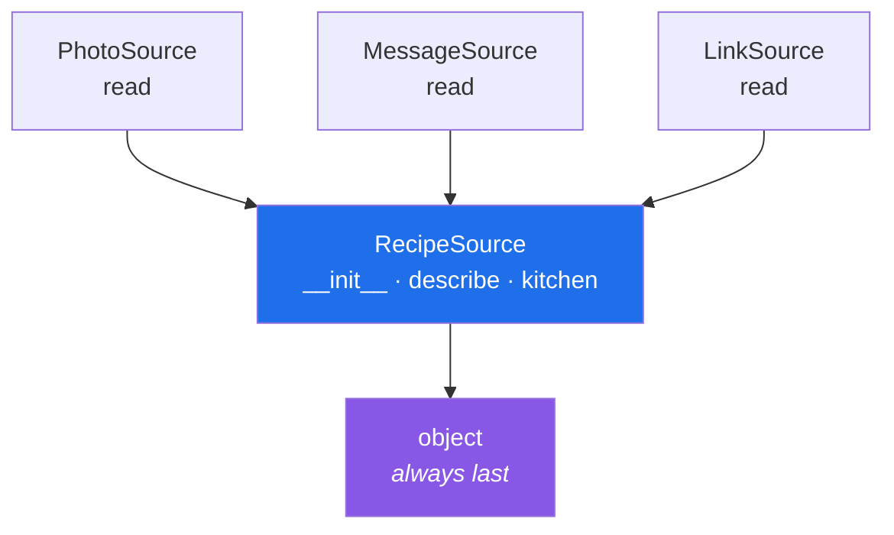

# 1.1 — Inheritance: one form that starts from another

## One-line answer

A class can say "start from that other class and add to it", and every instance then has both classes'
attributes and methods — with the new class's version winning wherever the two disagree.

---

## The story

Somebody sends you a recipe three times, in three different ways, over the course of a week.

On Monday it arrives as a photo of a page from a book, taken slightly crooked, with a thumb in the
corner.

On Wednesday it arrives typed into a message — no photo, just the words, with the quantities on
separate lines.

On Friday it arrives as a link to a website, which you have to open.

All three are the same recipe. All three, when you ask for them, produce the same thing: a list of
ingredients and a list of steps. And in every case you say the same sentence — *"read me the
recipe"* — and somebody works out how.

The three, as they arrived:

```text
Monday    a photo of a page
Wednesday typed into a message
Friday    a link
```

What is shared between them is the *asking*. What differs is entirely the *doing*: the photo needs
somebody to squint at it, the message needs the lines separated, and the link needs opening first.
Nobody writes down "how to read a recipe" three times from scratch, because two thirds of it — what
you are asking for, what comes back, what to do if it is unreadable — is the same every time.

---

## The idea in plain language

**Inheritance** is one class saying "start from that class". You write the shared part once, in a
class everybody starts from, and each specific class adds or replaces only what differs.

The vocabulary, defined once and used for the rest of the day:

- The class being started from is the **base class**, or the **parent**, or the **superclass**. Three
  names for one thing; this day uses **base class** and **parent**.
- The class doing the starting is the **subclass**, or the **child**. Both are used everywhere, so
  both appear here.
- To **inherit** is to get the parent's attributes and methods without writing them again.
- To **override** is to write a method the parent already has, so that the child's version runs
  instead. That is [1.4](1.4-overriding-and-the-broken-promise.md)'s subject.

The syntax is one pair of brackets:

```
class TextLoader(BaseLoader):
    ...
```

That says: a `TextLoader` is a `BaseLoader`, plus whatever this body adds. It changes three things at
once, and it is worth separating them:

1. **Lookup.** When Python cannot find an attribute on the instance or on `TextLoader`, it looks on
   `BaseLoader` — and then on `BaseLoader`'s parent, and so on. That search order is
   [1.3](1.3-the-mro.md).
2. **Type.** `isinstance(loader, BaseLoader)` is `True` for a `TextLoader`, so anything written to
   accept a `BaseLoader` accepts one.
3. **A promise.** Saying "a `TextLoader` **is a** `BaseLoader`" is a claim about behaviour, not only
   about code reuse — and breaking it is the subject of
   [2.3](../02-polymorphism/2.3-liskov-in-plain-words.md).

Every class you have ever written already inherits. `class Card:` is shorthand for
`class Card(object):`, which is why an instance you never gave a `__eq__` still has one
([Day 12, 2.4](../../../day-12-classes/parts/02-attribute-lookup/2.4-your-object-and-equality.md)) and
why `dir()` on your object shows dozens of names you did not write.

One caution, stated now so it colours everything that follows: **inheritance is the strongest coupling
Python offers.** A subclass can see and depend on its parent's internals, so a change to the parent
can break a child written by somebody else two years later. That is why
[1.5](1.5-composition-over-inheritance.md) exists and why it is a `production` part rather than an
appendix.

---

## Why Setu needs it

- **The plan's example for `PY-14` is `BaseLoader` → `PDFLoader`, `HTMLLoader`.** That is exactly the
  recipe arriving three ways, and [4.2](../04-abstraction/4.2-the-loader-family.md) builds it.
- **Phase 2's deliverable is a `Paper` class hierarchy** plus custom exceptions plus an async fetcher.
  A hierarchy needs a base, and today is where the base gets written.
- **Day 18's custom exceptions are a hierarchy.** `class RateLimited(SetuError)` is inheritance, and
  the reason `except SetuError:` catches a `RateLimited` is the type rule above.
- **Day 19's Pydantic models inherit from `BaseModel`**, Day 22's LangGraph nodes inherit from its
  base types, and Day 26's MCP servers subclass a provided class. From here on, "subclass this" is a
  normal instruction in a library's documentation.

---

## The mechanism

The shared part written once, the differences written three times:

```python
"""One base class, three ways a recipe arrives."""


class RecipeSource:
    """Everything every source shares: a name, and how to describe itself."""

    def __init__(self, name):
        self.name = name

    def describe(self):
        return f"{self.name} ({type(self).__name__})"

    def read(self):
        return ["the base class does not know how to read anything"]


class PhotoSource(RecipeSource):
    def read(self):
        return ["squint at the page", "type out what you can see"]


class MessageSource(RecipeSource):
    def read(self):
        return ["split the message into lines"]


class LinkSource(RecipeSource):
    def read(self):
        return ["open the link", "find the recipe on the page"]


for source in [
    PhotoSource("Monday"),
    MessageSource("Wednesday"),
    LinkSource("Friday"),
]:
    print(source.describe(), "->", source.read())
```

Run on Python 3.12.12 on 2026-09-01:

```
Monday (PhotoSource) -> ['squint at the page', 'type out what you can see']
Wednesday (MessageSource) -> ['split the message into lines']
Friday (LinkSource) -> ['open the link', 'find the recipe on the page']
```

**Line by line:**

- `class RecipeSource:` — the base. It holds `__init__` and `describe`, which are identical for all
  three, and a `read` that is a placeholder. [4.1](../04-abstraction/4.1-abc-and-abstractmethod.md)
  replaces that placeholder with something that refuses to be built at all, which is better; today it
  is a stand-in so the mechanism can be seen on its own.
- `class PhotoSource(RecipeSource):` — the brackets are the whole syntax. `PhotoSource` now has
  `__init__` and `describe` without a line being written for them.
- `def read(self):` in each subclass — **overriding**. Three classes each define a method the parent
  already had, and the subclass's version is the one that runs
  ([1.4](1.4-overriding-and-the-broken-promise.md)).
- `type(self).__name__` inside `describe` — **the base class's method, printing the child's name.**
  `self` is whichever object the method was called on
  ([Day 12, 1.3](../../../day-12-classes/parts/01-the-blank-form/1.3-methods-find-their-object.md)),
  so one method written once reports three different types. That single line is the clearest possible
  demonstration that inheritance is about lookup rather than about copying.
- The `for` loop calls `describe()` and `read()` on three different types with no `if` anywhere, which
  is polymorphism and is [2.1](../02-polymorphism/2.1-one-name-three-behaviours.md)'s subject.
- Nothing in the loop knows which class it is holding. Adding a fourth source means adding a class
  and adding it to the list; the loop does not change.

What the subclass actually got:

```python
"""Inheritance is lookup, not copying."""


class RecipeSource:
    kitchen = "the shared kitchen"

    def __init__(self, name):
        self.name = name

    def describe(self):
        return f"{self.name} ({type(self).__name__})"


class PhotoSource(RecipeSource):
    def read(self):
        return ["squint at the page"]


photo = PhotoSource("Monday")

print("its own class defines:", sorted(k for k in PhotoSource.__dict__ if not k.startswith("__")))
print("but it can do        :", photo.describe())
print("and it has           :", photo.kitchen)
print()
print("is a PhotoSource     :", isinstance(photo, PhotoSource))
print("is a RecipeSource    :", isinstance(photo, RecipeSource))
print("subclass check       :", issubclass(PhotoSource, RecipeSource))
print("the search order     :", [cls.__name__ for cls in PhotoSource.__mro__])
```

Run on Python 3.12.12 on 2026-09-01:

```
its own class defines: ['read']
but it can do        : Monday (PhotoSource)
and it has           : the shared kitchen
is a PhotoSource     : True
is a RecipeSource    : True
subclass check       : True
the search order     : ['PhotoSource', 'RecipeSource', 'object']
```

**Line by line:**

- `sorted(k for k in PhotoSource.__dict__ ...)` — **`PhotoSource` defines exactly one name.** Not
  `__init__`, not `describe`, not `kitchen`. Its own dictionary
  ([Day 12, 2.1](../../../day-12-classes/parts/02-attribute-lookup/2.1-the-instance-dict.md)) holds
  only what its body wrote.
- `photo.describe()` works anyway, because the lookup did not stop at `PhotoSource`. **Nothing was
  copied**; the search continued to the parent and found it there.
- `photo.kitchen` finds the parent's class attribute
  ([Day 12, 1.4](../../../day-12-classes/parts/01-the-blank-form/1.4-instance-and-class-attributes.md)),
  by the same search. Inheritance extends the fallback chain by one more link.
- `isinstance(photo, RecipeSource)` is `True` — **this is the type rule**, and it is what makes
  `def process(source: RecipeSource)` accept all three.
- `issubclass(PhotoSource, RecipeSource)` asks the same question about the classes rather than about
  an instance.
- `PhotoSource.__mro__` prints the search order as a tuple of classes, ending at `object`. That order
  is the whole of [1.3](1.3-the-mro.md); today it is enough to see that it exists and that `object` is
  always last.



---

## When it breaks

**Calling a method the base class never had:**

```text
>>> class RecipeSource:
...     def __init__(self, name):
...         self.name = name
...
>>> class PhotoSource(RecipeSource):
...     def read(self):
...         return ["squint"]
...
>>> sources = [PhotoSource("Monday"), RecipeSource("Tuesday")]
>>> for source in sources:
...     print(source.read())
...
['squint']
Traceback (most recent call last):
  File "<stdin>", line 2, in <module>
AttributeError: 'RecipeSource' object has no attribute 'read'
```

**What it means.** The loop worked for the first item and failed on the second, so half the work is
done and the rest is not. The base class was never meant to be used directly, and nothing stopped
somebody building one. This is exactly the hole `abc` closes
([4.1](../04-abstraction/4.1-abc-and-abstractmethod.md)): a base class that cannot be instantiated
cannot end up in that list.

**Inheriting from the wrong thing:**

```text
$ uv run python -c "
class PhotoSource(dict):
    def read(self): return ['squint']
p = PhotoSource(name='Monday')
print(p.read())
print(p.keys())
p.clear()
print(p)
"
['squint']
dict_keys(['name'])
{}
```

**What it means.** Subclassing `dict` to get "a thing with named fields" also inherits `clear`,
`popitem`, `update` and forty other methods, all of which are now part of your type's public surface.
Nothing raises, and the object can be emptied by any code that thinks it has a dictionary. Inherit
from something because your class **is one**, never because it has methods you want —
[1.5](1.5-composition-over-inheritance.md) is that argument in full.

**A subclass that shadows a parent's attribute by accident:**

```text
>>> class RecipeSource:
...     def __init__(self, name):
...         self.name = name
...     def describe(self):
...         return self.name
...
>>> class PhotoSource(RecipeSource):
...     name = "photo"
...
>>> p = PhotoSource("Monday")
>>> p.describe()
'Monday'
>>> PhotoSource.name
'photo'
```

**What it means.** Two `name`s: a class attribute on the child and an instance attribute set by the
parent's `__init__`. The instance one wins on a read
([Day 12, 1.4](../../../day-12-classes/parts/01-the-blank-form/1.4-instance-and-class-attributes.md)),
so `describe()` still gives `Monday` and the class-level `photo` sits there doing nothing until
somebody builds a `PhotoSource` that skips `__init__`. Name collisions between a parent's fields and
a child's are silent, and they are the most common cost of a deep hierarchy.

---

## In production

**The professional test for "should this inherit?" is the sentence, said out loud: *a `PhotoSource`
is a `RecipeSource`*.** If that sentence is true about behaviour — anywhere the program expects a
`RecipeSource`, a `PhotoSource` will do — inheritance is right. If it is only true about
convenience — "it has methods I want" — it is wrong, and the tell is subclassing a container or a
utility class.

**What changes at scale is that the base class becomes an interface with many owners.** Adding a
method to a base class with fifteen subclasses means fifteen classes now have a method their authors
did not write and may not want; renaming one breaks all fifteen. Teams that have felt this keep base
classes small and abstract — mostly `abstractmethod` declarations
([4.1](../04-abstraction/4.1-abc-and-abstractmethod.md)) — and put shared *behaviour* in functions or
in a helper object the subclasses hold, rather than in the parent.

**The failure that only appears in a mature codebase is the fragile base class.** A parent method is
changed in a way that is correct for the parent, and three of the nine subclasses break, because they
were relying on the old behaviour in a way nobody documented. Nothing in the language prevents it;
the only defences are keeping the base small, and having tests on the subclasses that would go red —
which is why the tests for a hierarchy belong to the children rather than to the parent.

**The review comment a senior engineer leaves.** On `class Config(dict):` *"Subclassing `dict` gives
every `Config` a `clear()`, a `popitem()` and an `update()` that we do not want on the public
surface, and it means anything type-checking for `dict` accepts a `Config` where it should not. Hold
a dict instead — `self._values = {}` — and expose the three methods we actually need."*

**The interview question.** *"When would you use inheritance?"* The answer that lands is the "is-a"
test plus its consequence: inherit when a subclass can stand in anywhere the base is expected, not
when you want to reuse code — because inheritance couples you to the parent's internals, so a change
there can break a subclass somebody else wrote. Adding that a base class with many subclasses is an
interface, and that this is why base classes are kept small and abstract, is the part that sounds
like maintenance rather than a tutorial.

---

## Check yourself

```bash
uv run python -c "
class RecipeSource:
    kitchen = 'the shared kitchen'
    def __init__(self, name): self.name = name
    def describe(self): return f'{self.name} ({type(self).__name__})'

class PhotoSource(RecipeSource):
    def read(self): return ['squint at the page']

p = PhotoSource('Monday')
print('PhotoSource defines:', sorted(k for k in PhotoSource.__dict__ if not k.startswith('__')))
print('but it can do      :', p.describe())
print('and it has         :', p.kitchen)
print('isinstance base    :', isinstance(p, RecipeSource))
print('search order       :', [c.__name__ for c in PhotoSource.__mro__])
"
```

`PhotoSource.__dict__` holds one name and the object can do three things. Say where the other two
came from, and what would happen to `describe()` if you added a `describe` to `PhotoSource`.

**Answer out loud, without scrolling up:**

> Give the sentence that decides whether one class should inherit from another. Then say what
> `isinstance(child_instance, Parent)` returns and why that matters to a function's signature.

---

**Next:** [1.2 — `super()`, and the `__init__` that has to run twice](1.2-super-and-the-init-that-runs-twice.md),
which is the first thing a subclass with its own fields needs.
