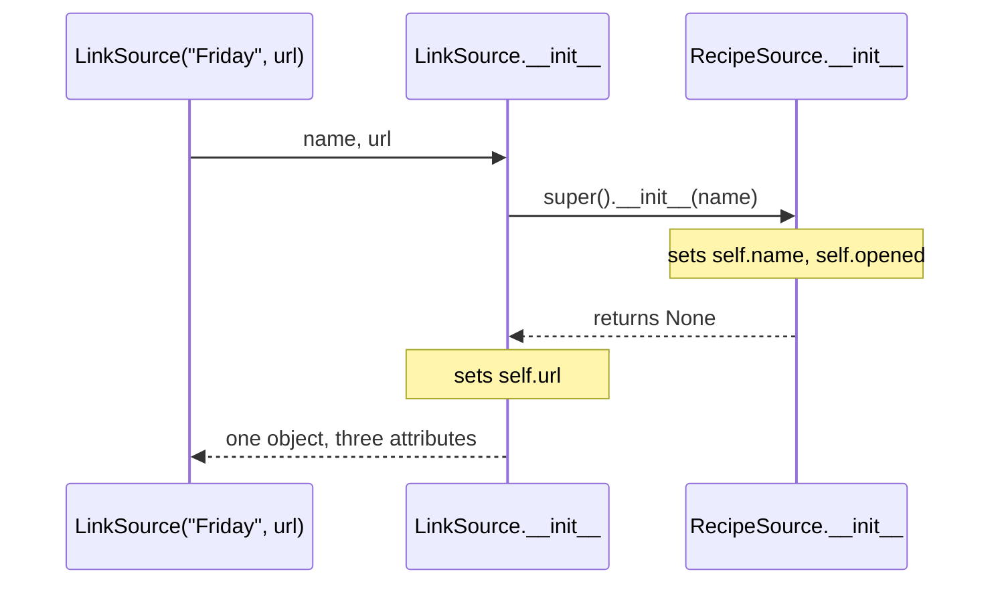

# 1.2 — `super()`, and the `__init__` that has to run twice

## One-line answer

A subclass that writes its own `__init__` replaces the parent's completely, so the parent's set-up
never runs unless the child calls `super().__init__(...)` — and the failure is an `AttributeError`
about a field somebody else was supposed to set.

---

## The story

The Friday link needs one extra thing that the other two do not: somebody has to open it first.

So the person handling links does two things rather than one. They do the ordinary preparation
everybody does — write down where the recipe came from, note the date — and then, on top of that,
they open the link.

The mistake, when it comes, is a small one. Somebody new is told "for links, open it first", so they
open the link, read the recipe, and hand it over. Later, somebody asks where the recipe came from, and
there is no note, because the new person did the extra step **instead of** the ordinary preparation
rather than **as well as** it.

The three, as always:

```text
Monday    a photo of a page
Wednesday typed into a message
Friday    a link
```

The instruction that would have prevented it is: *"do the usual, then open the link."* Two clauses,
in that order, and the first one is the easy one to leave out because nobody thinks of it as part of
the job.

---

## The idea in plain language

When a subclass defines a method the parent also has, the subclass's version **replaces** it
([1.1](1.1-one-form-that-starts-from-another.md)). `__init__` is a method like any other, so a
subclass with its own `__init__` has replaced the parent's set-up entirely — and the parent's set-up
is where the parent's attributes get assigned.

`super()` is how the child reaches the replaced version. `super().__init__(name)` means: run the
parent's `__init__`, on this same object, with these arguments.

Three things make it worth understanding rather than copying.

**`super()` takes no arguments, and that is a modern convenience.** Written inside a class body,
Python fills in the class and the instance for you. The older spelling
`super(LinkSource, self).__init__(name)` is the same thing written out, and you will meet it in older
code. The short form only works inside a class body, which is why it fails in a function.

**`super()` does not mean "my parent".** It means "the next class in the search order after this one",
and with a single parent those are the same thing. With more than one parent they are not, and that
is [1.3](1.3-the-mro.md)'s subject. Reading `super()` as "the next one along" from the start saves
relearning it later.

**The call goes first, almost always.** `super().__init__(...)` at the top of the child's `__init__`
means the parent's fields exist before the child's code runs, so the child can use them. Calling it
last works too and means the child's code runs against a half-built object, which is a trap waiting
for whoever edits it next.

Two more things that follow from "`__init__` is an ordinary method":

- A subclass that does **not** define `__init__` inherits the parent's, and everything works with no
  `super()` anywhere. Only write one when the child has its own fields.
- `super()` works in any method, not only `__init__`. `super().read()` in an overriding `read` runs
  the parent's version, which is how a child extends behaviour rather than replacing it.

---

## Why Setu needs it

- **[4.2](../04-abstraction/4.2-the-loader-family.md)'s loaders each take something extra.** A
  `LinkSource` needs a URL and a `PhotoSource` needs a file path, while both need the shared `name`
  and `source` fields. That is exactly this document's shape.
- **Day 18's custom exceptions all subclass one base.** `class RateLimited(SetuError)` with an extra
  `retry_after` field needs `super().__init__(message)` or the message never reaches the exception.
- **Day 19's Pydantic models and Day 22's LangGraph classes** both expect you to call the base
  `__init__`, and both produce confusing failures when you do not — a model with no validation, a node
  with no graph reference.
- **`Paper` gains subclasses tomorrow onwards.** Every one of them that adds a field will need this
  line, and getting it wrong produces the `AttributeError` below rather than anything that names the
  cause.

---

## The mechanism

The shape, done properly:

```python
"""The child's __init__ does the usual first, then its own extra."""


class RecipeSource:
    def __init__(self, name):
        self.name = name
        self.opened = False

    def describe(self):
        return f"{self.name} ({type(self).__name__})"


class LinkSource(RecipeSource):
    def __init__(self, name, url):
        super().__init__(name)
        self.url = url

    def read(self):
        return [f"open {self.url}", "find the recipe on the page"]


friday = LinkSource("Friday", "https://example.org/kitchen-table")

print("from the parent:", friday.name, friday.opened)
print("from the child :", friday.url)
print("both together  :", friday.describe())
print("what it holds  :", sorted(vars(friday)))
```

Run on Python 3.12.12 on 2026-09-01:

```
from the parent: Friday False
from the child : https://example.org/kitchen-table
both together  : Friday (LinkSource)
what it holds  : ['name', 'opened', 'url']
```

**Line by line:**

- `def __init__(self, name, url):` — the child's parameter list is its own. It takes everything the
  parent needs **plus** what it needs, because a caller only ever calls this one.
- `super().__init__(name)` — **first line of the body**, and it passes on only what the parent asked
  for. `self` is not passed: `super()` already knows which object it is working on.
- `self.url = url` on the line after — the child's own field, set once the parent's are in place.
- `friday.opened` is `False`, and **the child never mentions `opened`.** It exists because the
  parent's `__init__` ran, which is the whole point of the `super()` call.
- `friday.describe()` is inherited and prints `LinkSource`, because `type(self)` is the actual class
  ([1.1](1.1-one-form-that-starts-from-another.md)).
- `sorted(vars(friday))` has all three keys in one dictionary
  ([Day 12, 2.1](../../../day-12-classes/parts/02-attribute-lookup/2.1-the-instance-dict.md)). There
  is **one** object and **one** attribute store; "the parent's fields" and "the child's fields" are
  the same dictionary, filled by two functions.

`super()` in an ordinary method, extending rather than replacing:

```python
"""A child that adds to the parent's answer instead of discarding it."""


class RecipeSource:
    def __init__(self, name):
        self.name = name

    def steps(self):
        return ["write down where it came from", "note the date"]


class LinkSource(RecipeSource):
    def __init__(self, name, url):
        super().__init__(name)
        self.url = url

    def steps(self):
        return super().steps() + [f"open {self.url}"]


class PhotoSource(RecipeSource):
    def steps(self):
        return super().steps() + ["squint at the page"]


for source in [LinkSource("Friday", "https://example.org/x"), PhotoSource("Monday")]:
    for step in source.steps():
        print(f"  {source.name}: {step}")
```

Run on Python 3.12.12 on 2026-09-01:

```
  Friday: write down where it came from
  Friday: note the date
  Friday: open https://example.org/x
  Monday: write down where it came from
  Monday: note the date
  Monday: squint at the page
```

**Line by line:**

- `return super().steps() + [f"open {self.url}"]` — **the parent's answer, then the child's addition.**
  Written the other way round the extra step would come first, which is a different program and a
  legitimate choice; the point is that it is a choice.
- `super().steps()` returns a new list each call, so `+` builds another new list and nothing is
  mutated ([Day 4, 2.2](../../../day-04-objects/parts/02-containers/2.2-what-in-place-means.md)). If
  the parent returned a shared list, `+=` here would be
  [Day 12, 1.5](../../../day-12-classes/parts/01-the-blank-form/1.5-the-shared-class-attribute.md)'s
  bug.
- `class PhotoSource(RecipeSource):` with **no `__init__` at all** — it inherits the parent's, so
  `PhotoSource("Monday")` works with no `super()` anywhere. Only add an `__init__` when the child has
  its own fields.
- The two shared steps appear for both sources, written once. That is the reuse inheritance is for.
- Extending like this is the pattern behind every framework's "call `super()` and then do your bit"
  instruction, from Day 19's Pydantic validators onwards.



---

## When it breaks

**Forgetting the call entirely:**

```text
$ uv run python -c "
class Base:
    def __init__(self, name): self.name = name
class Child(Base):
    def __init__(self, name, extra):
        self.extra = extra
c = Child('x', 'y')
print(c.name)
"
Traceback (most recent call last):
  File "<string>", line 8, in <module>
AttributeError: 'Child' object has no attribute 'name'
```

**What it means.** The child's `__init__` replaced the parent's, so `self.name = name` never ran. The
`name` argument was accepted and thrown away. Note what the traceback does **not** say: it does not
mention `super`, or `Base`, or `__init__` — it points at the line that read the attribute, which may
be in a different module. Read `AttributeError` on a subclass instance as "did somebody forget
`super().__init__()`?" before anything else.

**Calling `super()` last, and using a parent field before it exists:**

```text
$ uv run python -c "
class Base:
    def __init__(self, name): self.name = name
class Child(Base):
    def __init__(self, name):
        self.label = self.name.upper()
        super().__init__(name)
Child('friday')
"
Traceback (most recent call last):
  File "<string>", line 8, in <module>
  File "<string>", line 6, in __init__
AttributeError: 'Child' object has no attribute 'name'
```

**What it means.** The same error message, a completely different cause, and this one is worse
because the `super()` call is right there in the file. The child used `self.name` on the line above
the call that creates it. **`super().__init__()` goes first**, and this traceback is why.

**Passing `self` to `super()`:**

```text
$ uv run python -c "
class Base:
    def __init__(self, name): self.name = name
class Child(Base):
    def __init__(self, name):
        super().__init__(self, name)
Child('friday')
"
Traceback (most recent call last):
  File "<string>", line 7, in <module>
  File "<string>", line 6, in __init__
TypeError: Base.__init__() takes 2 positional arguments but 3 were given
```

**What it means.** `super()` already carries the instance, so passing `self` again supplies it twice.
The count in the message — two expected, three given — is the same shape as
[Day 12, 1.2](../../../day-12-classes/parts/01-the-blank-form/1.2-init-and-self.md)'s missing-`self`
error, seen from the other side: there, one argument was supplied invisibly; here, that invisible one
is being supplied twice.

**Using the no-argument `super()` outside a class body:**

```text
$ uv run python -c "
class Base:
    def hi(self): return 'base'
def helper(obj):
    return super().hi()
helper(Base())
"
Traceback (most recent call last):
  File "<string>", line 6, in <module>
  File "<string>", line 5, in helper
RuntimeError: super(): __class__ cell not found
```

**What it means.** The short `super()` works by reading a hidden reference to the enclosing class,
which a plain function does not have. The message is about that hidden reference and says nothing
about the real cause. The fix is to write the method in the class, or to use the explicit two-argument
form. Meeting this error once explains why the two-argument spelling exists at all.

---

## In production

**The professional habit is that `super().__init__(...)` is the first statement of any subclass
`__init__`, without exception, and reviewers look for it before they look at anything else.** Some
teams enforce it with a linter rule. The reason it is worth being mechanical about is that the failure
is remote: the exception appears wherever somebody reads the missing attribute, which can be a
different module and a different day.

**What changes when a framework is involved is that the base `__init__` may be doing a great deal.**
Pydantic's `BaseModel.__init__` runs validation; a web framework's view class registers routes; a
LangGraph node wires itself into the graph. Skipping it produces an object that looks right and is
inert — no validation, no routes, no wiring — with no error at all. That silent version is far more
expensive than the `AttributeError` above, and it is why library documentation says "always call
super" in bold.

**The failure that only appears with multiple inheritance is a `super()` chain with a break in it.**
If any class in the chain does not call `super().__init__()`, every class after it in the search order
is skipped. With one parent that is easy to see; with a mixin two levels up it is not, and the symptom
is a field that is missing only for some combinations of classes.
[1.3](1.3-the-mro.md) is where that order becomes readable, and the rule that follows is: in a
hierarchy designed for mixing, **every** `__init__` calls `super().__init__()`, including the ones
that appear to have nothing above them.

**The review comment a senior engineer leaves.** On a subclass `__init__` that sets its own field
before calling super: *"Move `super().__init__(name)` to the top. Right now `self.label` is computed
from `self.name` one line before `self.name` exists, so this only works because the attribute happens
to be set on the class as well — and it will break the moment somebody removes that default."*

**The interview question.** *"What does `super()` do?"* The answer that lands is: it gives you the
next class in the method resolution order after this one, bound to the current instance — so
`super().__init__(...)` runs the parent's set-up on the same object, and without it a subclass with
its own `__init__` silently skips every field the parent assigns. Saying *the next class in the MRO*
rather than *the parent* is the phrase that shows you have met multiple inheritance.

---

## Check yourself

```bash
uv run python -c "
class RecipeSource:
    def __init__(self, name):
        self.name = name
        self.opened = False

class Good(RecipeSource):
    def __init__(self, name, url):
        super().__init__(name)
        self.url = url

class Bad(RecipeSource):
    def __init__(self, name, url):
        self.url = url

print('good holds:', sorted(vars(Good('Friday', 'u'))))
print('bad holds :', sorted(vars(Bad('Friday', 'u'))))
try:
    print(Bad('Friday', 'u').name)
except AttributeError as e:
    print('bad fails :', e)
"
```

`Good` has three attributes and `Bad` has one. Say which line is the difference, and why the error
message does not mention it.

**Answer out loud, without scrolling up:**

> Say what happens to the parent's `__init__` when a subclass defines its own, and what
> `super().__init__(...)` is doing about it. Then say why the call goes first.

---

**Next:** [1.3 — the MRO, and what Python actually searches](1.3-the-mro.md), which is what `super()`
really means once there is more than one parent.
