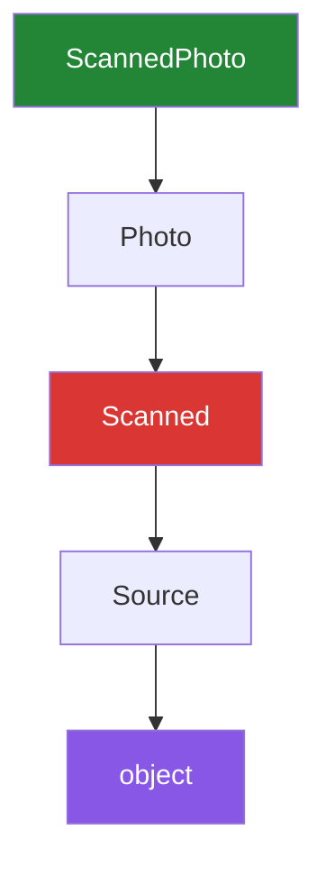

# 1.3 — The MRO: what Python actually searches, in what order

## One-line answer

Every class has one fixed list of classes to search for an attribute — itself first, `object` last —
and `super()` means "the next entry in that list", which is why with two parents it is not
necessarily the one you named first.

---

## The story

You want to know how long to bake the bread, and there are four places the answer might be.

The card in the tin has the times on it, in handwriting, for this loaf. Look there first.

If the card does not say, there is the family book on the shelf, which has a general bread section.

If the book does not say, there is the printed leaflet that came with the tin, which covers all the
tins that manufacturer makes.

And if none of them say, there is the number on the side of the oven, which is the manufacturer's
default for everything.

Nobody has ever written this order down, and everybody in the house follows it, because the order is
obvious: **nearest and most specific first, most general last.** You stop at the first place that has
an answer. You do not check the oven once the card has told you.

The three recipes are still arriving the same three ways:

```text
Monday    a photo of a page
Wednesday typed into a message
Friday    a link
```

Where it stops being obvious is when two people in the house disagree about which book is more
specific. Then you need the order written down, and that is what this document is about.

---

## The idea in plain language

Every class in Python has a **method resolution order** — the MRO — which is a plain list of classes,
in the order Python searches them for any attribute. You can print it: `Child.__mro__`.

For the ordinary case it is exactly what you would guess. `PhotoSource(RecipeSource)` gives
`[PhotoSource, RecipeSource, object]`: itself, its parent, and `object`, which is at the end of every
MRO because everything inherits from it
([1.1](1.1-one-form-that-starts-from-another.md)).

Attribute lookup walks that list and **stops at the first class whose `__dict__` has the name**
([Day 12, 2.1](../../../day-12-classes/parts/02-attribute-lookup/2.1-the-instance-dict.md)). The
instance's own dictionary is checked before the list; after that it is the list, in order.

And `super()` means **"start searching from the entry after the current class"**. That is the precise
definition, and it is why [1.2](1.2-super-and-the-init-that-runs-twice.md) said to read it as "the
next one along" rather than "my parent". With one parent the two are the same. With two they are not.

The interesting case is **multiple inheritance**: a class with more than one parent. Python builds
the MRO with an algorithm called **C3 linearisation**, and you do not need to implement it to use it.
Three rules describe the result, and they are enough:

1. **A class always comes before its parents.**
2. **Parents appear in the order they were written** in the `class` line.
3. **A class appears exactly once**, as late as it can while still satisfying rules 1 and 2.

Rule 3 is the one that produces the surprise. In the classic diamond — `D(B, C)` where both `B` and
`C` inherit from `A` — the MRO is `[D, B, C, A, object]`. `A` sits **after** `C`, not immediately
after `B`, because `A` is a parent of `C` too and rule 1 says `C` must come first.

Sometimes no order can satisfy all three rules, and then Python refuses to create the class at all —
at import time, with a `TypeError`. That is a good failure: it happens once, at the earliest possible
moment, rather than as a strange behaviour later.

The algorithm was introduced to Python in the version 2.3 method-resolution-order note (*The Python
2.3 Method Resolution Order*, 2003, <https://www.python.org/download/releases/2.3/mro/>), which is
still the canonical write-up of why the naive left-to-right depth-first order was replaced.

---

## Why Setu needs it

- **`super()` is used from Day 18 onwards in every hierarchy**, and its behaviour is defined in terms
  of the MRO rather than in terms of parents. Anybody who reads it as "my parent" gets a surprise the
  first time a mixin appears.
- **Day 19's Pydantic models and Day 22's LangGraph classes both use mixins.** `class MyState(BaseModel,
  SomeMixin)` is multiple inheritance, and when a method comes from the wrong one, `__mro__` is the
  first thing to print.
- **`TypeError: Cannot create a consistent method resolution order` is a real error you will meet**
  when combining two libraries' base classes, and it is completely opaque without this document.
- **Day 12's attribute-lookup story was told for one class**
  ([Day 12, 2.1](../../../day-12-classes/parts/02-attribute-lookup/2.1-the-instance-dict.md)). This is
  the full version, and it is the last piece of "where did that attribute come from?".

---

## The mechanism

The simple case, and what `super()` means in it:

```python
"""One parent: the MRO is what you would guess."""


class RecipeSource:
    def steps(self):
        return ["write down where it came from"]


class PhotoSource(RecipeSource):
    def steps(self):
        return super().steps() + ["squint at the page"]


print("mro   :", [cls.__name__ for cls in PhotoSource.__mro__])
print("steps :", PhotoSource().steps())
print("object is last:", PhotoSource.__mro__[-1].__name__)
```

Run on Python 3.12.12 on 2026-09-01:

```
mro   : ['PhotoSource', 'RecipeSource', 'object']
steps : ['write down where it came from', 'squint at the page']
object is last: object
```

**Line by line:**

- `PhotoSource.__mro__` — a tuple of **classes**, so `.__name__` on each gives the readable version.
  `PhotoSource.mro()` is the same information as a list, and both are worth knowing because different
  tools print different ones.
- The order is itself, parent, `object`. **`object` is the last entry in every MRO there is**, which
  is why `dir()` on any object shows dunder methods you never wrote.
- `super().steps()` inside `PhotoSource` starts searching at index 1, finds `RecipeSource.steps`, and
  runs it. That is the definition applied to this list.
- The result concatenates the parent's answer and the child's addition
  ([1.2](1.2-super-and-the-init-that-runs-twice.md)).

The diamond, where guessing stops working:

```python
"""Two parents that share a grandparent. The order is not left-then-up."""


class Source:
    def who(self):
        return "Source"


class Photo(Source):
    def who(self):
        return "Photo"


class Scanned(Source):
    def who(self):
        return "Scanned"


class ScannedPhoto(Photo, Scanned):
    pass


print("mro :", [cls.__name__ for cls in ScannedPhoto.__mro__])
print("who :", ScannedPhoto().who())
```

Run on Python 3.12.12 on 2026-09-01:

```
mro : ['ScannedPhoto', 'Photo', 'Scanned', 'Source', 'object']
who : Photo
```

**Line by line:**

- `class ScannedPhoto(Photo, Scanned):` — two parents, and rule 2 says they appear in that order.
- `pass` as the whole body — **the class adds nothing.** Everything it can do comes from the search.
- The MRO is `ScannedPhoto, Photo, Scanned, Source, object`. Read it against the three rules:
  `ScannedPhoto` before its parents (rule 1); `Photo` before `Scanned` (rule 2); and **`Source` after
  both**, not after `Photo`, because `Source` is a parent of `Scanned` too and rule 1 forbids putting
  a parent before its child.
- A naive "go up from the first parent" order would be `ScannedPhoto, Photo, Source, Scanned` — and
  then `Scanned.who` could never run, because `Source.who` would be found first. **That is the bug C3
  linearisation exists to prevent.**
- `ScannedPhoto().who()` is `Photo`, which is rule 2 doing what you expect. The order only surprises
  you at the *third* entry.

`super()` through a diamond, which is the part worth seeing once:

```python
"""Each class hands on to the NEXT in the MRO, not to its own parent."""


class Source:
    def steps(self):
        return ["note the date"]


class Photo(Source):
    def steps(self):
        return super().steps() + ["squint at the page"]


class Scanned(Source):
    def steps(self):
        return super().steps() + ["straighten the scan"]


class ScannedPhoto(Photo, Scanned):
    pass


print("mro  :", [cls.__name__ for cls in ScannedPhoto.__mro__])
print("steps:", ScannedPhoto().steps())
print()
print("Photo alone:", Photo().steps())
```

Run on Python 3.12.12 on 2026-09-01:

```
mro  : ['ScannedPhoto', 'Photo', 'Scanned', 'Source', 'object']
steps: ['note the date', 'straighten the scan', 'squint at the page']
Photo alone: ['note the date', 'squint at the page']
```

**Line by line:**

- `ScannedPhoto().steps()` finds `Photo.steps` first. Inside it, `super()` means "the next entry after
  `Photo`", which is **`Scanned`, not `Source`** — even though `Scanned` is not `Photo`'s parent and
  `Photo`'s author may never have heard of it.
- `Scanned.steps` then calls `super()`, which from `Scanned` is `Source`, and the chain ends there.
- The result contains **all three** contributions, in reverse MRO order: `Source` first because it is
  deepest, then `Scanned`, then `Photo`. Each class added its bit on the way back out.
- `Photo().steps()` on its own gives two entries, because in `Photo`'s own MRO —
  `[Photo, Source, object]` — the entry after `Photo` really is `Source`.
- **The same line of code, `super().steps()`, reached two different classes depending on what it was
  mixed with.** That is what "the next entry in the MRO" means and why "my parent" is the wrong
  mental model.
- This cooperative pattern only works if **every** class in the chain calls `super()`. One that does
  not silently truncates the chain, and the missing step is the one nobody can find.



The red box is the entry people do not expect: from `Photo`, `super()` reaches `Scanned`.

---

## When it breaks

**An order that cannot exist:**

```text
$ uv run python -c "
class A: pass
class B(A): pass
class C(A, B): pass
"
Traceback (most recent call last):
  File "<string>", line 4, in <module>
TypeError: Cannot create a consistent method resolution
order (MRO) for bases A, B
```

**What it means.** `C(A, B)` says `A` comes before `B` (rule 2), and `B(A)` says `B` comes before `A`
(rule 1). Both cannot hold, so Python refuses to build the class — **at import time**, before
anything runs. The fix is to swap them: `class C(B, A)`, which satisfies both. When this appears with
two libraries' base classes, the answer is nearly always the same: put the more specific one first.

**A method that came from the class you did not expect:**

```text
>>> class Loud:
...     def name(self): return "LOUD"
...
>>> class Quiet:
...     def name(self): return "quiet"
...
>>> class Both(Loud, Quiet):
...     pass
...
>>> Both().name()
'LOUD'
>>> [c.__name__ for c in Both.__mro__]
['Both', 'Loud', 'Quiet', 'object']
```

**What it means.** No error, and the answer came from the first parent listed. That is correct and it
is the source of the "why is this method not being used?" question, which is nearly always answered
by printing `__mro__` and reading down until you find the name. **Printing the MRO should be your
first move**, not your last.

**A broken `super()` chain:**

```text
>>> class Source:
...     def steps(self): return ["note the date"]
...
>>> class Photo(Source):
...     def steps(self): return ["squint at the page"]
...
>>> class Scanned(Source):
...     def steps(self): return super().steps() + ["straighten the scan"]
...
>>> class ScannedPhoto(Photo, Scanned):
...     pass
...
>>> ScannedPhoto().steps()
['squint at the page']
```

**What it means.** `Photo.steps` does not call `super()`, so the chain stops at `Photo` and
`Scanned`'s step never runs — nor does `Source`'s. One list came back, it is not empty, and nothing
raised. In a mixin-based design this is the failure that eats an afternoon, and the rule that
prevents it is: **in any class designed to be mixed, every overriding method calls `super()`.**

**Assuming `super()` is the parent, in a method that will be mixed:**

```text
>>> class Photo(Source):
...     def steps(self):
...         return Source.steps(self) + ["squint at the page"]
...
>>> ScannedPhoto().steps()
['note the date', 'squint at the page']
```

**What it means.** Naming the parent explicitly rather than using `super()` works, and it hard-codes
the chain: `Scanned` is skipped, because `Photo` jumped straight to `Source`. There is no error and
the output is plausible. `super()` exists precisely so that a class does not decide who comes after
it — the MRO does, and it depends on how the class is mixed, which its author cannot know.

---

## In production

**The professional habit is that `__mro__` is the first thing you print when a method comes from the
wrong place.** It takes one line, it is always available, and it answers the question completely.
Teams that know this spend minutes on "why is this override not being used"; teams that do not read
the whole hierarchy by hand.

**What changes at scale is that mixins turn every method into a link in a chain you cannot see.** A
class combining a framework's base with two mixins has an MRO of six or seven entries, contributed by
three authors who never spoke. Everything works as long as every one of them calls `super()` and
accepts `**kwargs` in `__init__`; one that does not truncates the chain for every combination that
includes it. That is why libraries designed for mixing say so explicitly, and why combining base
classes from two libraries that were not is a genuine risk rather than a stylistic one.

**The failure that only appears in a mature codebase is the diamond nobody drew.** Two mixins are
added at different times by different people, each inheriting from a shared base, and the resulting
order puts an old default ahead of a new override. Nothing raises. The defence is not to avoid
multiple inheritance entirely — mixins are genuinely useful — but to keep hierarchies shallow, to
prefer composition ([1.5](1.5-composition-over-inheritance.md)) when the relationship is not "is-a",
and to have a test that asserts the MRO of any class assembled from more than two pieces.

**The review comment a senior engineer leaves.** On a mixin whose method does not call `super()`:
*"This mixin is designed to be combined, so ending the chain here means any class that mixes it in
loses everything after it in the MRO. Add `super().method()` and return your addition on top —
otherwise the behaviour depends on the order somebody writes the bases in, which is not a contract we
can hold anybody to."*

**The interview question.** *"What does `super()` return?"* The answer that lands is: a proxy that
starts the attribute search at the entry **after the current class in the instance's MRO** — not the
parent — which is why in a diamond, `super()` inside the first parent reaches the second parent
rather than the shared grandparent. Adding that this is what makes cooperative multiple inheritance
work, and that it breaks the moment one class in the chain does not call `super()`, is the version
that shows you have debugged one.

---

## Check yourself

```bash
uv run python -c "
class Source:
    def steps(self): return ['note the date']
class Photo(Source):
    def steps(self): return super().steps() + ['squint at the page']
class Scanned(Source):
    def steps(self): return super().steps() + ['straighten the scan']
class ScannedPhoto(Photo, Scanned): pass

print('mro  :', [c.__name__ for c in ScannedPhoto.__mro__])
print('steps:', ScannedPhoto().steps())
print('Photo:', Photo().steps())
"
```

The same `super().steps()` line inside `Photo` reached `Scanned` in one case and `Source` in the
other. Say what decided which, and where you would look first if a step went missing.

**Answer out loud, without scrolling up:**

> Give the three rules that produce an MRO, and say which class is always last. Then say precisely
> what `super()` starts searching from, without using the word "parent".

---

**Next:** [1.4 — overriding, and the method that broke its parent's promise](1.4-overriding-and-the-broken-promise.md),
where replacing a method starts to have consequences beyond the class doing it.
