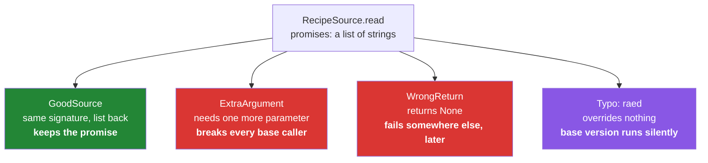

# 1.4 — Overriding, and the method that broke its parent's promise

## One-line answer

Writing a method the parent already has replaces it for that subclass, and Python checks nothing at
all about the replacement — not the parameters, not the return type, not whether it still does what
the parent said it would.

---

## The story

The instruction on the shared sheet says: *read me the recipe, and give me back a list of the
ingredients and a list of the steps.*

The person handling photos does exactly that.

The person handling messages does exactly that.

The person handling links reads the link, finds that the page is behind a sign-up form, and — being
helpful — hands back a note saying *"you'll need to log in."*

Which is genuinely helpful, and it is not a list of ingredients. Everything downstream was written on
the assumption that what comes back can be counted, sorted and printed one per line, and a note
cannot be. So the next person tries to print the ingredients and gets one line of apology, and the
one after that tries to count them and gets the number of characters in the sentence.

Nobody did anything wrong on purpose. The link person answered a different question from the one
that was asked, in a way that looked like an answer.

```text
Monday    a photo of a page   -> a list of ingredients, a list of steps
Wednesday typed into a message -> a list of ingredients, a list of steps
Friday    a link              -> "you'll need to log in"
```

---

## The idea in plain language

**Overriding** is defining, in a subclass, a method the parent already defines. The subclass's version
is found first ([1.3](1.3-the-mro.md)), so it is the one that runs.

That is the whole mechanism, and Python adds nothing to it. There is **no check** that:

- the parameter list matches the parent's;
- the return type matches;
- the new version does anything remotely similar.

An override with a completely different signature is legal, imports cleanly, and fails only when
somebody calls it the way the parent's signature promised.

So the contract is entirely on you, and it has three parts worth naming.

**Accept at least what the parent accepts.** Anything written against the base calls with the base's
arguments, so a child that requires an extra one breaks those callers.

**Return what the parent promises.** If the base's `read` returns a list, every override returns a
list — an empty one when there is nothing, never `None`, never a string, never an error message. This
is the link person's mistake.

**Do not surprise.** An override may do more; it should not do less, and it should not raise where
the parent did not. That last rule has a formal name and is
[2.3](../02-polymorphism/2.3-liskov-in-plain-words.md)'s subject.

Two mechanical points that come up constantly:

- **`super()` lets you extend rather than replace.** `return super().read() + extra` keeps the
  parent's work ([1.2](1.2-super-and-the-init-that-runs-twice.md)). Replacing wholesale is right when
  the parent's version genuinely does not apply, and it is worth being conscious of which you meant.
- **A typo in the method name is not an override.** `def raed(self)` defines a new method and leaves
  the parent's `read` in place, so the base version runs, silently, forever. Python has no
  `@override` keyword that would catch it; `typing.override` exists as a decorator that a type checker
  can check, and Day 19 is where type checking arrives.

---

## Why Setu needs it

- **[4.2](../04-abstraction/4.2-the-loader-family.md)'s three loaders each override `load`**, and the
  whole design depends on all three returning the same shape. One that returns `None` on failure
  breaks every caller.
- **Day 18's custom exceptions override `__str__` and `__init__`**, and an override there that
  forgets `super().__init__(message)` produces an exception whose message is empty — visible only in
  a log, at the worst moment.
- **Day 19's Pydantic validators are overrides** with a required signature; getting the parameters
  wrong produces an error from inside the library rather than from your code.
- **Principle 7 asks for tests that can go red.** The test that catches a bad override is one that
  runs the *same* assertions against every subclass, and writing that test is the practical version
  of everything in this document.

---

## The mechanism

Replacing, and extending, and the difference:

```python
"""Two kinds of override: one replaces the parent's answer, one adds to it."""


class RecipeSource:
    def __init__(self, name):
        self.name = name

    def steps(self):
        return ["write down where it came from", "note the date"]


class PhotoSource(RecipeSource):
    def steps(self):
        return super().steps() + ["squint at the page"]


class LinkSource(RecipeSource):
    def steps(self):
        return ["open the link"]


for source in [RecipeSource("base"), PhotoSource("Monday"), LinkSource("Friday")]:
    print(f"{source.name:8}", source.steps())
```

Run on Python 3.12.12 on 2026-09-01:

```
base     ['write down where it came from', 'note the date']
Monday   ['write down where it came from', 'note the date', 'squint at the page']
Friday   ['open the link']
```

**Line by line:**

- `PhotoSource.steps` calls `super().steps()` and adds to it — **extending.** The two shared steps
  still happen, and they are written once.
- `LinkSource.steps` does not call `super()` — **replacing.** The two shared steps are gone, and
  nothing announced that.
- Look at the third line of output. `Friday` skipped "write down where it came from", which is
  Principle 9's provenance. Whether that is a bug depends on intent, and **the code does not say
  which was intended** — that is the whole hazard of a silent replacement.
- Both are legal, both are sometimes right, and a reviewer cannot tell them apart without asking. The
  habit worth having is a one-line comment on any override that deliberately drops the parent's
  behaviour.
- `f"{source.name:8}"` — a width so the three rows line up
  ([Day 7, 3.2](../../../day-07-strings/parts/03-formatting/3.2-the-format-spec.md)).

Everything Python does not check:

```python
"""Four overrides. All four import cleanly. Three of them are bugs."""


class RecipeSource:
    def read(self, path):
        """Return a list of strings. Always a list, never None."""
        return ["ingredients", "steps"]


class GoodSource(RecipeSource):
    def read(self, path):
        return ["flour", "water"]


class ExtraArgument(RecipeSource):
    def read(self, path, encoding):
        return ["flour"]


class WrongReturn(RecipeSource):
    def read(self, path):
        return None


class Typo(RecipeSource):
    def raed(self, path):
        return ["flour"]


for cls in (GoodSource, ExtraArgument, WrongReturn, Typo):
    source = cls()
    try:
        result = source.read("recipe.txt")
        print(f"{cls.__name__:14} -> {result!r}")
    except TypeError as error:
        print(f"{cls.__name__:14} -> TypeError: {error}")
```

Run on Python 3.12.12 on 2026-09-01:

```
GoodSource     -> ['flour', 'water']
ExtraArgument  -> TypeError: ExtraArgument.read() missing 1 required positional argument: 'encoding'
WrongReturn    -> None
Typo           -> ['ingredients', 'steps']
```

**Line by line:**

- The base's docstring states the promise — *always a list, never None*. **That sentence is the
  contract**, and it is the only place it exists, because Python will not enforce it.
- `GoodSource` keeps the signature and the return shape. Nothing to say about it, which is the point.
- `ExtraArgument` added a required parameter, so every caller written against the base fails. The
  error names the child class, which is helpful, and it happens **only when that subclass is used** —
  so a test suite that never builds an `ExtraArgument` stays green.
- `WrongReturn` returns `None` and **raises nothing at all.** The caller gets `None`, and the failure
  surfaces later as `TypeError: 'NoneType' object is not iterable` in a completely different function.
  This is the link person's note, and it is the worst of the four.
- `Typo` defines `raed`, which overrides nothing, so `read` still finds the base's version and returns
  the base's placeholder. **The output looks reasonable**, which is exactly why this one survives code
  review. A type checker with `typing.override` on the method would catch it; nothing at runtime will.
- `except TypeError` around the call — needed only because one of the four is broken in that
  particular way. In real code you would not wrap a method call in a `try` to find out whether it was
  overridden correctly; the test below is how you actually find out.

The test that catches all three:

```python
"""One test, run against every subclass. This is how a hierarchy is held to its contract."""

import pytest


class RecipeSource:
    def read(self, path):
        return ["ingredients", "steps"]


class GoodSource(RecipeSource):
    def read(self, path):
        return ["flour", "water"]


class WrongReturn(RecipeSource):
    def read(self, path):
        return None


@pytest.mark.parametrize("cls", [GoodSource, WrongReturn])
def test_read_returns_a_list_of_strings(cls):
    """Every source must honour the base's promise, whatever it does internally."""
    result = cls().read("recipe.txt")
    assert isinstance(result, list)
    assert all(isinstance(line, str) for line in result)
```

**Line by line:**

- `@pytest.mark.parametrize("cls", [...])` — **the same assertions against every subclass**, which is
  the shape that catches a broken override. Adding a fourth loader means adding it to this list, and
  the test is what makes that addition safe.
- `assert isinstance(result, list)` — the return-shape half of the contract, and the assertion
  `WrongReturn` fails.
- `all(isinstance(line, str) for line in result)` — the contents, using `all` over a generator so it
  stops at the first bad one
  ([Day 11, 3.4](../../../day-11-iterators-and-generators/parts/03-lambda-and-map/3.4-reduce-any-and-all.md)).
  Note that this also passes for an empty list, which is correct: the promise is "a list of strings",
  and no strings is a list of strings.
- `cls().read("recipe.txt")` — building each class and calling with the **base's** signature, so an
  extra required parameter fails here too.
- This test does not check that the loaders do the right thing; it checks that they all do the same
  *kind* of thing. Both are needed, and this one is the one people leave out.



---

## When it breaks

**The override with an extra required parameter:**

```text
$ uv run python -c "
class Base:
    def load(self, path): return ['x']
class Narrow(Base):
    def load(self, path, encoding): return ['y']
b = Narrow()
b.load('p')
"
Traceback (most recent call last):
  File "<string>", line 7, in <module>
TypeError: Narrow.load() missing 1 required positional argument: 'encoding'
```

**What it means.** Any code written against `Base` calls `load(path)`, and this subclass cannot be
used by it. The error names the subclass, which is the useful part — read it as "somebody narrowed
the signature". If the extra argument is genuinely needed, it belongs in `__init__`, so the object
carries it and `load` keeps the shared signature.

**The override that returns nothing:**

```text
>>> class Base:
...     def load(self, path): return ["x"]
...
>>> class Silent(Base):
...     def load(self, path):
...         if not path:
...             return
...         return ["y"]
...
>>> for line in Silent().load(""):
...     print(line)
...
Traceback (most recent call last):
  File "<stdin>", line 1, in <module>
TypeError: 'NoneType' object is not iterable
```

**What it means.** A bare `return` returns `None`
([Day 10, 1.1](../../../day-10-functions/parts/01-the-signature/1.1-a-function-is-a-promise.md)), and
the failure lands on the caller's `for` line rather than in `load`. The traceback names a file that
did nothing wrong. **The empty case returns an empty list**, always — that one rule removes an entire
class of bug from a hierarchy.

**The override that is not one:**

```text
>>> class Base:
...     def load(self, path): return ["base version"]
...
>>> class Typo(Base):
...     def laod(self, path): return ["my version"]
...
>>> Typo().load("x")
['base version']
```

**What it means.** No error, plausible output, and the subclass's code has never run. This survives
review because the file *looks* right. Two defences: a test that asserts each subclass's distinctive
behaviour rather than only its shape, and `typing.override` on every override once type checking
arrives on Day 19.

**The override that narrowed what it accepts:**

```text
>>> class Base:
...     def load(self, path): return ["x"]
...
>>> class Strict(Base):
...     def load(self, path):
...         if not path.endswith(".txt"):
...             raise ValueError("only .txt")
...         return ["y"]
...
>>> [Strict().load(p) for p in ["a.txt", "b.pdf"]]
Traceback (most recent call last):
  File "<stdin>", line 1, in <module>
  File "<stdin>", line 4, in load
ValueError: only .txt
```

**What it means.** The signature matches and the return type matches, and the subclass still cannot
stand in for the base, because it raises on input the base accepted. This is the subtlest of the four
and it has a name — the substitution principle — which
[2.3](../02-polymorphism/2.3-liskov-in-plain-words.md) covers. The short version: an override may
accept more and return less, never the other way round.

---

## In production

**The professional habit is that the base class's docstring states the contract, and every override
is read against it.** What arguments, what comes back, what is raised, and what the empty case looks
like. That is four sentences on the base method, and it is the only enforcement mechanism the language
offers until a type checker is in the build.

**What changes at scale is that overrides are written by people who never read the base.** With
fifteen subclasses across four modules, most authors copy the nearest existing subclass and change the
body. So the *base* has to be the place the contract is legible, and the parametrised test above has
to exist, because it is the only thing that runs against a subclass somebody added on Tuesday.

**The failure that only appears with real data is the override that is correct for its own inputs.**
A `PDFLoader.load` that returns `None` for an encrypted PDF is perfectly sensible in isolation, and it
breaks the shared pipeline the first time an encrypted PDF appears — which will not be in the test
fixtures. The rule that survives is that the *shape* of the return never depends on the data: an empty
list for nothing found, and an exception for a real failure, decided once on the base and obeyed by
every child.

**The review comment a senior engineer leaves.** On an override returning `None` in one branch:
*"`Base.load` promises a list; this returns `None` when the file is empty, so the caller's `for` loop
raises three frames away with a traceback that blames them. Return `[]`. If empty genuinely means
failure here, raise — but pick one, because `None` is neither."*

**The interview question.** *"What does Python check when you override a method?"* The answer is
short and the follow-up is the real question: nothing at all — not the signature, not the return type,
not the name — so a typo silently keeps the base version and a narrowed signature breaks callers only
when that subclass is used. Adding that the defences are a documented contract on the base, one
parametrised test run against every subclass, and `typing.override` for the typo case, turns "nothing"
into an answer with a plan behind it.

---

## Check yourself

```bash
uv run python -c "
class Base:
    def read(self, path):
        '''Return a list of strings. Always a list, never None.'''
        return ['ingredients', 'steps']

class Good(Base):
    def read(self, path): return ['flour', 'water']

class WrongReturn(Base):
    def read(self, path): return None

class Typo(Base):
    def raed(self, path): return ['flour']

for cls in (Good, WrongReturn, Typo):
    print(f'{cls.__name__:12} -> {cls().read(\"recipe.txt\")!r}')
"
```

Two of the three outputs look fine and only one of those two is actually running the subclass's code.
Say which, and what you would assert in a test to catch it.

**Answer out loud, without scrolling up:**

> Name the three parts of an override's contract, and say which of them Python enforces. Then say what
> a typo in an overridden method's name does, and why it survives review.

---

**Next:** [1.5 — composition over inheritance](1.5-composition-over-inheritance.md), which is the
question to ask before any of this: should these classes be related at all?
