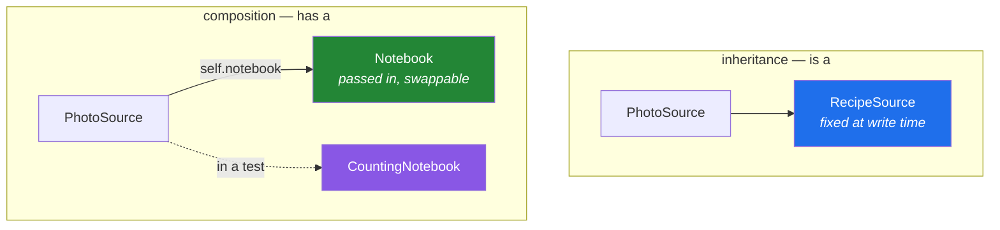

# 1.5 — Composition over inheritance: the question to ask first

## One-line answer

Inheritance says "this **is** that" and gives you everything the parent has, wanted or not;
composition says "this **has** one of those" and gives you only what you ask for — and the second is
the right default because it can be changed later.

---

## The story

The kitchen has one good pair of scissors, and everybody needs them.

The obvious fix, if you think like a class hierarchy, is to attach a pair to every drawer. Every
drawer becomes a drawer-with-scissors. Now the cutlery drawer has scissors, the tea-towel drawer has
scissors, and so does the drawer nobody opens.

That works, and then somebody buys a better pair. Now you have eleven drawers to visit, and two of
them are in a cupboard you have to empty first, and one drawer's scissors have been quietly used for
something else and nobody wants to swap those.

The thing an actual kitchen does is simpler. The scissors live in a pot on the counter, and whoever
needs them reaches for the pot. Buying a better pair is one visit to one pot. A drawer is a drawer,
and it does not *become* something because of what is in it.

The recipes are still arriving three ways, and the question is which parts of "handling a recipe" are
what a source **is** and which are things it **uses**:

```text
Monday    a photo of a page
Wednesday typed into a message
Friday    a link
```

Reading is what it is. Writing a note about where it came from is a thing it uses.

---

## The idea in plain language

Two ways for one class to use another.

**Inheritance — "is a".** `class PhotoSource(RecipeSource)`. The child gets everything the parent
has: every method, every attribute, every one added later. The relationship is fixed when the class
is written and cannot be changed at run time.

**Composition — "has a".** `self.notes = Notebook()`. The object holds another object and calls it.
It gets exactly the methods it chooses to call, the held object can be swapped for a different one at
run time, and a test can hand over a fake.

The default should be composition, and there are four concrete reasons rather than a slogan:

1. **You get only what you asked for.** Inheriting from `dict` to get `[]` access also inherits
   `clear`, `popitem` and forty more, all now on your public surface
   ([1.1](1.1-one-form-that-starts-from-another.md)).
2. **It can be swapped.** The held object is a value, so a test passes a fake, and production passes
   the real one. A base class cannot be swapped without editing the `class` line.
3. **Changes do not propagate.** A method added to a base class appears on fifteen subclasses; a
   method added to a held class appears nowhere until somebody calls it.
4. **There is no diamond.** Two held objects are two attributes with names
   ([1.3](1.3-the-mro.md) has the alternative).

The test for which one you want is the sentence, said out loud, and it is the same test as
[1.1](1.1-one-form-that-starts-from-another.md)'s:

> *A `PhotoSource` **is a** `RecipeSource`.* — true about behaviour, so inheritance.
> *A `PhotoSource` **is a** `Notebook`.* — obviously false, so composition: it *has* one.

The failure mode this prevents has a name people use: **inheriting for reuse.** You wanted three
methods, so you inherited fifty. It reads as economical and it is the most expensive kind of coupling
there is, because you cannot later remove what you did not want.

Inheritance is still right for two things, and this document is not an argument against it:

- **A genuine "is-a" that callers rely on**, so `isinstance` works and one function handles all of
  them — which is [2.1](../02-polymorphism/2.1-one-name-three-behaviours.md).
- **A shared interface that must be enforced**, which is what `abc` is for
  ([4.1](../04-abstraction/4.1-abc-and-abstractmethod.md)).

Notice that both reasons are about the *type*, not about the code. **Inherit for the type; compose for
the behaviour** is the short version, and it is worth memorising.

---

## Why Setu needs it

- **[4.2](../04-abstraction/4.2-the-loader-family.md)'s loaders use both**, on purpose: they inherit
  from `BaseLoader` because a caller genuinely accepts any loader, and they *hold* whatever does the
  fetching, because that has to be swappable in a test.
- **Principle 5 means every test runs offline.** A loader that inherits its HTTP behaviour cannot be
  tested without a network; one that holds a client can be handed a fake
  ([Day 10, 3.3](../../../day-10-functions/parts/03-the-module/3.3-pure-functions-and-the-seam.md)).
- **Day 172's LangChain and Day 185's LangGraph are composition all the way down** — a chain holds a
  prompt, a model and a parser. Recognising that shape here makes those days about the pipeline rather
  than about the syntax.
- **Day 12 already made the smaller version of this argument**
  ([Day 12, 3.4](../../../day-12-classes/parts/03-the-paper-object/3.4-when-not-to-write-a-class.md)):
  do not write a class unless it earns its place. This is the same instinct applied to a
  relationship rather than to a type.

---

## The mechanism

The same job, both ways:

```python
"""Inherited behaviour, and held behaviour."""


class Notebook:
    """Somewhere to write down where a recipe came from."""

    def __init__(self):
        self.entries = []

    def note(self, text):
        self.entries.append(text)
        return text


class InheritingSource(Notebook):
    """A source that IS a notebook. It is not one."""

    def read(self, name):
        self.note(f"read {name}")
        return ["flour", "water"]


class HoldingSource:
    """A source that HAS a notebook."""

    def __init__(self, notebook):
        self.notebook = notebook

    def read(self, name):
        self.notebook.note(f"read {name}")
        return ["flour", "water"]


inherited = InheritingSource()
held = HoldingSource(Notebook())

print("inherited reads:", inherited.read("Monday"))
print("held reads     :", held.read("Monday"))
print()
print("inherited also has:", [n for n in dir(inherited) if not n.startswith("_")])
print("held also has     :", [n for n in dir(held) if not n.startswith("_")])
```

Run on Python 3.12.12 on 2026-09-01:

```
inherited reads: ['flour', 'water']
held reads     : ['flour', 'water']

inherited also has: ['entries', 'note', 'read']
held also has     : ['notebook', 'read']
```

**Line by line:**

- Both classes do the same job and both `read` calls return the same list. **The difference is not in
  behaviour**, which is why this decision gets made carelessly.
- `class InheritingSource(Notebook):` — the sentence "a source is a notebook" is plainly false, and
  the class says it anyway. It was written this way because `note` was wanted.
- `dir(inherited)` shows `entries` and `note` on the public surface. **A caller can now do
  `source.entries.clear()`**, which nobody intended and which will happen.
- `dir(held)` shows `notebook` and `read`. The notebook is reachable, deliberately, through one name —
  and `held.note(...)` does not exist, so nothing outside can mistake a source for a notebook.
- `HoldingSource.__init__(self, notebook)` takes the notebook **as an argument** rather than building
  one. That is the seam
  ([Day 10, 3.3](../../../day-10-functions/parts/03-the-module/3.3-pure-functions-and-the-seam.md)),
  and the next block is what it buys.

What composition buys, in a test:

```python
"""The held object can be replaced. The inherited one cannot."""


class Notebook:
    def __init__(self):
        self.entries = []

    def note(self, text):
        self.entries.append(text)


class CountingNotebook:
    """A stand-in that records calls and writes nothing anywhere."""

    def __init__(self):
        self.calls = 0

    def note(self, text):
        self.calls += 1


class HoldingSource:
    def __init__(self, notebook):
        self.notebook = notebook

    def read(self, name):
        self.notebook.note(f"read {name}")
        return ["flour", "water"]


fake = CountingNotebook()
source = HoldingSource(fake)

source.read("Monday")
source.read("Wednesday")

print("result unchanged:", source.read("Friday"))
print("notes taken     :", fake.calls)
```

Run on Python 3.12.12 on 2026-09-01:

```
result unchanged: ['flour', 'water']
notes taken     : 3
```

**Line by line:**

- `class CountingNotebook:` — **it does not inherit from `Notebook`.** It only needs the one method
  `HoldingSource` calls, which is duck typing and is
  [2.2](../02-polymorphism/2.2-duck-typing-and-isinstance.md)'s subject.
- `HoldingSource(fake)` — the substitution, in one argument, with no patching and no mocking library.
  This is what "it can be swapped" means concretely.
- `fake.calls` is `3`, so the test can assert *that the note was taken* without a file, a database or
  a network. With `InheritingSource` there is nowhere to put the substitution: the behaviour is part
  of the class.
- Replace `CountingNotebook` with a real one at the call site in production, and `HoldingSource` does
  not change. **That is the whole benefit**, and it is why every framework day after this one hands
  you objects rather than base classes to subclass.

When inheritance is the right answer:

```python
"""Inherit for the type; compose for the behaviour."""


class RecipeSource:
    """The type callers accept. Subclasses ARE this."""

    def __init__(self, name, notebook):
        self.name = name
        self.notebook = notebook

    def read(self):
        raise NotImplementedError


class PhotoSource(RecipeSource):
    def read(self):
        self.notebook.note(f"read {self.name}")
        return ["flour", "water"]


class LinkSource(RecipeSource):
    def read(self):
        self.notebook.note(f"opened {self.name}")
        return ["flour", "yeast"]


class Notebook:
    def __init__(self):
        self.entries = []

    def note(self, text):
        self.entries.append(text)


notebook = Notebook()
sources = [PhotoSource("Monday", notebook), LinkSource("Friday", notebook)]

for source in sources:
    print(
        f"{source.name:10}", source.read(), "| is a RecipeSource:", isinstance(source, RecipeSource)
    )

print("notebook   :", notebook.entries)
```

Run on Python 3.12.12 on 2026-09-01:

```
Monday     ['flour', 'water'] | is a RecipeSource: True
Friday     ['flour', 'yeast'] | is a RecipeSource: True
notebook   : ['read Monday', 'opened Friday']
```

**Line by line:**

- **Inheritance for the type**: both are a `RecipeSource`, so `isinstance` is `True` and a function
  taking `RecipeSource` accepts both. That is a real benefit and it is the only reason the base class
  exists.
- **Composition for the behaviour**: the notebook is a constructor argument, shared by both sources,
  and swappable in a test. Neither class *is* a notebook.
- `def read(self): raise NotImplementedError` — a placeholder that at least fails loudly.
  [4.1](../04-abstraction/4.1-abc-and-abstractmethod.md) replaces it with something that fails
  *earlier*, at construction rather than at call.
- One `notebook` object passed to both sources — so both write into the same list, which is visible in
  the last line. That sharing is deliberate and explicit, which is the difference between this and
  [Day 12, 1.5](../../../day-12-classes/parts/01-the-blank-form/1.5-the-shared-class-attribute.md)'s
  accidental sharing.
- This is the shape [4.2](../04-abstraction/4.2-the-loader-family.md) builds, and it is worth reading
  twice: **the hierarchy is one level deep and holds its collaborators.**



---

## When it breaks

**Inheriting a container to get its syntax:**

```text
$ uv run python -c "
class Config(dict):
    def get_model(self): return self['model']
c = Config(model='gemini')
print(c.get_model())
c.clear()
print(c.get_model())
"
Traceback (most recent call last):
  File "<string>", line 7, in <module>
  File "<string>", line 3, in get_model
KeyError: 'model'
gemini
```

**What it means.** `Config` inherited `clear()` along with the subscript syntax, so any code that
believes it holds a dictionary can empty your configuration. The first `get_model()` printed
`gemini` — it appears below the traceback only because the shell flushes the two streams separately —
and the second raised. Something worked and then stopped working, with no change to the config code,
which is the worst possible shape for debugging. Hold a dict instead: `self._values = {}`, and expose
the two or three methods that are actually part of the contract.

**Inheriting to reuse one method:**

```text
>>> class Retry:
...     def with_retry(self, fn):
...         for _ in range(3):
...             try:
...                 return fn()
...             except OSError:
...                 continue
...         raise RuntimeError("gave up")
...
>>> class Loader(Retry):
...     def load(self): return self.with_retry(lambda: ["x"])
...
>>> [n for n in dir(Loader()) if not n.startswith("_")]
['load', 'with_retry']
```

**What it means.** `with_retry` is now part of `Loader`'s public interface, so callers can retry
arbitrary functions through a loader — which is not what a loader is for, and which somebody will
eventually do. Worse, `Loader` cannot be given a different retry policy without a subclass. A held
policy object, or a plain function taking the callable, gives the same behaviour and none of this.

**The hierarchy that grew a level for one method:**

```text
$ find src/setu -name "*.py" | xargs grep -c "^class " | sort
src/setu/loaders/base.py:1
src/setu/loaders/cached.py:1
src/setu/loaders/http.py:1
src/setu/loaders/retrying.py:1
src/setu/loaders/pdf.py:1
```

**What it means.** `PDFLoader(RetryingLoader(CachedLoader(HTTPLoader(BaseLoader))))` — five levels,
each adding one behaviour, and the MRO is now five entries long
([1.3](1.3-the-mro.md)). Changing the caching means touching a class three levels above the one
somebody is reading. Every one of those levels wanted to *add a behaviour*, which is the signal for
composition: one loader holding a cache, a retry policy and a client is flat, and each piece can be
tested and replaced alone.

**The test that needed a network because of a base class:**

```text
$ uv run python -m pytest tests/test_loader.py -q -m "not live"
E   httpx.ConnectError: [Errno -3] Temporary failure in name resolution
1 failed
```

**What it means.** The loader inherited its fetching, so building one in a test builds the fetching
too, and `./m check` — which runs offline by design
([Day 2, 3.3](../../../day-02-quality-gate/parts/03-pytest/3.3-markers-and-exit-code-five.md)) —
cannot pass. There is no way to substitute a base class. This is the most practical argument in the
whole document: **composition is what makes the offline test possible.**

---

## In production

**The professional default is composition, and inheritance is used deliberately for a shared type.**
Most codebases that are pleasant to work in have shallow hierarchies — one abstract base, one level of
concrete classes — and a lot of objects holding other objects. The abstract base exists so that one
function can accept all of them; everything else is passed in.

**What changes at scale is that a deep hierarchy becomes unmodifiable.** With five levels and fifteen
leaf classes, a change to level two has to be reasoned about for fifteen combinations, and the tests
that would catch a regression belong to classes written by four different people. Teams in that
position do not refactor the hierarchy; they add a sixth level, because that is the only cheap move
left. Recognising the shape early — a level added to hold one behaviour — is what prevents it.

**The failure that only appears in a long-lived project is the base class that became a dumping
ground.** Every behaviour two subclasses shared was pushed up, so the base now has twenty methods and
each subclass uses six of them, and nobody can tell which six. The signal is a base class larger than
its children. The cure is composition: a shared behaviour that only two of nine children need is a
held object, not a parent method.

**The review comment a senior engineer leaves.** On a new class inheriting from a utility base:
*"What does `Loader` gain from being a `Retry`? It uses one method, and now every caller can retry
arbitrary callables through a loader. Take a retry policy in `__init__` instead — then the test can
pass one with zero attempts, and we can change the policy per loader without a new subclass."*

**The interview question.** *"Composition or inheritance?"* The answer that lands is not the slogan;
it is the rule with the reason: inherit when a subclass genuinely stands in for the base and callers
depend on that type, compose for everything else — because inheritance gives you the parent's whole
surface, cannot be swapped at run time, and propagates every future change to every subclass. Adding
that the practical test is whether you can substitute a fake in a unit test, and that a hierarchy
growing a level to hold one behaviour is the signal to stop, makes it sound like something you have
undone.

---

## Check yourself

```bash
uv run python -c "
class Notebook:
    def __init__(self): self.entries = []
    def note(self, text): self.entries.append(text)

class Inheriting(Notebook):
    def read(self, name):
        self.note(f'read {name}')
        return ['flour']

class Holding:
    def __init__(self, notebook): self.notebook = notebook
    def read(self, name):
        self.notebook.note(f'read {name}')
        return ['flour']

i, h = Inheriting(), Holding(Notebook())
print('inherited surface:', [n for n in dir(i) if not n.startswith('_')])
print('held surface     :', [n for n in dir(h) if not n.startswith('_')])
"
```

Both classes do the same job. Count the public names on each and say what a caller can do to the
first one that it cannot do to the second.

**Answer out loud, without scrolling up:**

> Give the two sentences that distinguish inheritance from composition, and say which one you reach
> for by default. Then name the one thing composition makes possible in a test that inheritance does
> not.

---

**Next:** [2.1 — one name, three behaviours](../02-polymorphism/2.1-one-name-three-behaviours.md).
Section 1 was the machinery; section 2 is the reason anybody builds a hierarchy at all.
