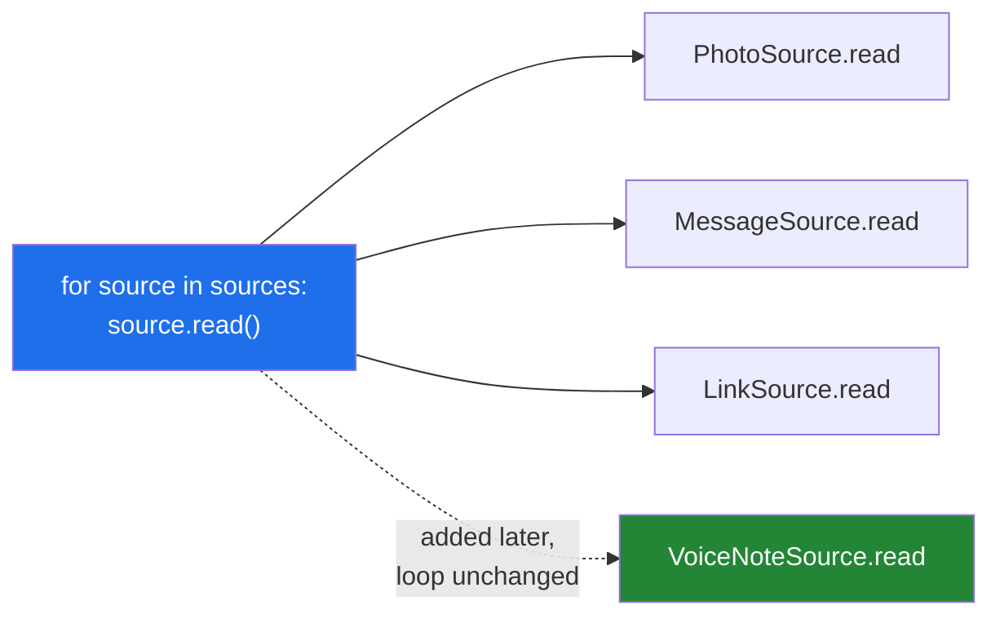

# 2.1 — One name, three behaviours

## One-line answer

Polymorphism is calling the same method on different objects and getting each object's own version —
which lets one loop handle every kind of thing without a single `if` about what it is holding.

---

## The story

You say four words: *"read me the recipe."*

If the recipe is the Monday photo, somebody squints at the page and reads out what they can make out.
If it is the Wednesday message, somebody scrolls and reads the lines. If it is the Friday link,
somebody opens it first and then reads.

You said the same four words each time. You did not say "if it's a photo then squint, else if it's a
message then scroll". You did not need to know which one it was, and — this is the part that matters
— **you did not need to be told when a fourth kind arrived.** When somebody starts sending recipes as
voice notes, you say the same four words and somebody works out how.

```text
Monday    a photo of a page   -> read me the recipe
Wednesday typed into a message -> read me the recipe
Friday    a link              -> read me the recipe
```

Compare that with the version where you have to know. Every time a new kind of recipe appears, *you*
have to learn a new instruction, and so does everybody else who ever asks. The asking side grows
every time the answering side does.

---

## The idea in plain language

**Polymorphism** means "many shapes": one name, several implementations, and the object decides which
one runs.

The mechanism is already familiar. `source.read()` looks the name up on the object's class first, and
each subclass has its own `read` ([1.4](../01-inheritance/1.4-overriding-and-the-broken-promise.md)).
So the call site is one line and there are three answers.

The benefit is not that it saves typing. It is a specific structural property, and it is worth being
precise about: **adding a new kind does not change any existing code.** Write a fourth class, add it
to the list of things to process, and the loop is untouched. That is the difference between a program
that grows by addition and one that grows by editing.

The alternative — the one polymorphism replaces — is a chain of checks:

```
if kind == "photo":
    ...
elif kind == "message":
    ...
elif kind == "link":
    ...
```

That chain works. Its problem is that there is never only one of them. The same chain appears in the
reader, the summariser, the exporter and the logger, and adding a fourth kind means finding all four
and editing each — and the one somebody misses fails at run time with `else: raise ValueError`, or
worse, silently does nothing.

Two words to keep apart, because both get called polymorphism:

- **Overriding** is a subclass replacing a parent's method
  ([1.4](../01-inheritance/1.4-overriding-and-the-broken-promise.md)). Same name, different class,
  chosen by the object's type. This is what this document is about.
- **Overloading** — several versions of one function chosen by the argument *types* — does not exist
  in Python. One name is one function; you write one function and branch inside it, or you use
  `functools.singledispatch`.

There is one requirement that makes all of this work, and it is not enforced by the language: **every
implementation must honour the same contract.** Same call, same shape of answer
([1.4](../01-inheritance/1.4-overriding-and-the-broken-promise.md)). A loop that treats three objects
identically is only safe if the three really are interchangeable, and
[2.3](2.3-liskov-in-plain-words.md) is the rule for that.

---

## Why Setu needs it

- **This is the whole point of [4.2](../04-abstraction/4.2-the-loader-family.md)'s loader family.**
  One `for loader in loaders: papers.extend(loader.load())`, and adding a fifth format is a new file
  rather than an edit to four.
- **Day 18's exception hierarchy is polymorphism on the catching side.** `except SetuError:` catches
  every one of its subclasses, so a new error type is caught by handlers written before it existed.
- **Day 22's LangGraph nodes are all called the same way** by the graph, whatever each one does
  inside. That is this idea with a framework around it.
- **Principle 3 says one concept, one day, one demo.** A loop with a four-branch `if` in it is the
  shape that makes a demo hard to explain, and replacing it with polymorphism is usually what makes
  a design fit on one page.

---

## The mechanism

One loop, three behaviours, no `if`:

```python
"""The same call, three answers, and nothing at the call site knows which."""


class RecipeSource:
    def __init__(self, name):
        self.name = name

    def read(self):
        raise NotImplementedError


class PhotoSource(RecipeSource):
    def read(self):
        return ["flour", "water", "salt"]


class MessageSource(RecipeSource):
    def read(self):
        return ["flour", "water"]


class LinkSource(RecipeSource):
    def read(self):
        return ["flour", "yeast", "salt", "water"]


sources = [PhotoSource("Monday"), MessageSource("Wednesday"), LinkSource("Friday")]

for source in sources:
    print(f"{source.name:10} {type(source).__name__:14} {source.read()}")

everything = sorted({item for source in sources for item in source.read()})
print()
print("all ingredients:", everything)
```

Run on Python 3.12.12 on 2026-09-01:

```
Monday     PhotoSource    ['flour', 'water', 'salt']
Wednesday  MessageSource  ['flour', 'water']
Friday     LinkSource     ['flour', 'yeast', 'salt', 'water']

all ingredients: ['flour', 'salt', 'water', 'yeast']
```

**Line by line:**

- `def read(self): raise NotImplementedError` on the base — a placeholder that fails loudly if
  somebody builds the base directly. [4.1](../04-abstraction/4.1-abc-and-abstractmethod.md) makes it
  fail *earlier*, which is better; this is the version that needs no new import.
- `for source in sources:` — **no `if`, no `isinstance`, no `type` check anywhere in the loop.** The
  loop asks and each object answers.
- `type(source).__name__` — printed only so you can see three different classes going through one
  line of code. It is a demonstration, not something the loop needs.
- `{item for source in sources for item in source.read()}` — a set comprehension with two `for`
  clauses, which flattens
  ([Day 9, 2.2](../../../day-09-comprehensions/parts/02-dict-set-gen/2.2-set-comprehensions.md)). The
  set removes duplicates; `sorted` makes the output reproducible, because a set has no order
  (Principle 4).
- **Adding a `VoiceNoteSource` means writing a class and adding it to `sources`.** Not one line above
  changes. That is the property this whole document is about, and it is worth checking by actually
  doing it.

The version polymorphism replaces:

```python
"""The same job with a branch, and what it costs when a fourth kind arrives."""

recipes = [
    {"name": "Monday", "kind": "photo"},
    {"name": "Wednesday", "kind": "message"},
    {"name": "Friday", "kind": "link"},
    {"name": "Sunday", "kind": "voice note"},
]


def read(recipe):
    if recipe["kind"] == "photo":
        return ["flour", "water", "salt"]
    elif recipe["kind"] == "message":
        return ["flour", "water"]
    elif recipe["kind"] == "link":
        return ["flour", "yeast", "salt", "water"]
    else:
        raise ValueError(f"unknown kind: {recipe['kind']!r}")


for recipe in recipes:
    try:
        print(f"{recipe['name']:10}", read(recipe))
    except ValueError as error:
        print(f"{recipe['name']:10} ValueError: {error}")
```

Run on Python 3.12.12 on 2026-09-01:

```
Monday     ['flour', 'water', 'salt']
Wednesday  ['flour', 'water']
Friday     ['flour', 'yeast', 'salt', 'water']
Sunday     ValueError: unknown kind: 'voice note'
```

**Line by line:**

- `recipe["kind"]` — a string deciding behaviour. That string is now a vocabulary that every function
  touching recipes has to know, and nothing checks that they all agree on it.
- The `elif` chain is readable here because there are three branches in one function. **The cost is
  not this function**; it is the fourth copy of this chain in the exporter, which somebody will
  forget to update.
- `else: raise ValueError(...)` — the honest ending, and it is what turns a missed branch into a
  visible failure. An `else: return []` would be the same bug, silent.
- The `Sunday` line is the fourth kind arriving. In the polymorphic version this is a new class and no
  edits; here it is an edit to this function **and** to every other function with the same chain.
- The message names the value with `!r`
  ([Day 12, 3.2](../../../day-12-classes/parts/03-the-paper-object/3.2-validation-in-init.md)'s rule),
  which is the one thing this version does right.

Adding the fourth kind, both ways:

```python
"""Polymorphism: the new kind is additive. Nothing above it is edited."""


class RecipeSource:
    def __init__(self, name):
        self.name = name

    def read(self):
        raise NotImplementedError


class PhotoSource(RecipeSource):
    def read(self):
        return ["flour", "water", "salt"]


class VoiceNoteSource(RecipeSource):
    """Written after the loop below already existed. The loop does not change."""

    def read(self):
        return ["flour", "olive oil"]


sources = [PhotoSource("Monday"), VoiceNoteSource("Sunday")]

for source in sources:
    print(f"{source.name:10}", source.read())
```

Run on Python 3.12.12 on 2026-09-01:

```
Monday     ['flour', 'water', 'salt']
Sunday     ['flour', 'olive oil']
```

**Line by line:**

- `class VoiceNoteSource(RecipeSource):` — the entire change. One class, one method, one new entry in
  the list of sources.
- The loop is byte-for-byte the loop from the first block. **No existing line was edited**, which is
  the concrete meaning of "extend without modifying".
- The docstring says when it was written relative to the loop, because that is the fact worth
  recording: the loop's author did not know this class would exist.
- In a real project the list of sources comes from configuration or from a registry rather than being
  a literal, and then adding a kind is a one-line configuration change and a new file.
  [4.2](../04-abstraction/4.2-the-loader-family.md) builds that version.



---

## When it breaks

**One implementation that returns a different shape:**

```text
>>> class Base:
...     def read(self): return []
...
>>> class Odd(Base):
...     def read(self): return "flour, water"
...
>>> for source in [Base(), Odd()]:
...     print(len(source.read()))
...
0
12
```

**What it means.** No error. `len` of a string is its character count, so the second source reports
twelve ingredients. Polymorphism only works if every implementation honours the same contract
([1.4](../01-inheritance/1.4-overriding-and-the-broken-promise.md)), and the language checks none of
it. The defence is a parametrised test running the same assertions against every subclass.

**A subclass that forgot to implement the method at all:**

```text
$ uv run python -c "
class Base:
    def read(self): raise NotImplementedError
class Forgot(Base):
    pass
for s in [Forgot()]:
    print(s.read())
"
Traceback (most recent call last):
  File "<string>", line 7, in <module>
  File "<string>", line 3, in read
NotImplementedError
```

**What it means.** The placeholder did its job, and it did it **at call time** rather than at
construction. In a batch job that means half the sources have already been processed. The `abc`
version in [4.1](../04-abstraction/4.1-abc-and-abstractmethod.md) refuses to build the object at all,
which moves the failure to the earliest possible moment.

**The `isinstance` chain that grew back:**

```text
>>> for source in sources:
...     if isinstance(source, PhotoSource):
...         rows = source.read()[:10]
...     elif isinstance(source, LinkSource):
...         rows = source.read()
...     else:
...         rows = []
```

**What it means.** The `elif` chain came back wearing `isinstance`, and it is worse than the string
version because it also names the classes, so the module now imports all three. Whenever this appears,
the behaviour in the branches belongs on the classes: give the base a `limit` attribute or a `read`
that already applies it, and the loop becomes one line again.
[2.2](2.2-duck-typing-and-isinstance.md) is the fuller version of this argument.

**A missing `else`, and a kind that silently did nothing:**

```text
>>> def read(recipe):
...     if recipe["kind"] == "photo":
...         return ["flour"]
...     elif recipe["kind"] == "message":
...         return ["water"]
...
>>> read({"kind": "voice note"})
>>> print(read({"kind": "voice note"}))
None
```

**What it means.** A function with no `else` falls off the end and returns `None`
([Day 10, 1.1](../../../day-10-functions/parts/01-the-signature/1.1-a-function-is-a-promise.md)), so
the new kind produces nothing and reports nothing. In a pipeline that means a whole category of input
is dropped and the run reports success. This is the strongest practical argument for polymorphism:
there is no branch to forget.

---

## In production

**The professional habit is that a type check in a loop is a design smell, and the fix is to push the
difference into the objects.** When you find yourself writing `if isinstance(...)`, ask what method
the objects should have had instead. That refactor — from a branch at the call site to a method on
the class — is one of the few that reliably makes code both shorter and easier to extend.

**What changes at scale is that the branch chain appears in several places.** With three kinds and
one function, a chain is genuinely fine. With three kinds and seven functions, the same three-way
decision is encoded seven times and they drift: the exporter learns about `voice note` and the
summariser does not. Polymorphism puts the decision in one place — the class — and the seven
functions each become one line.

**The failure that only appears with real data is the implementation that is subtly different.** All
four loaders return a list, and one of them returns a list of `dict` where the others return a list
of `Paper`. Every loop over the results works until one touches an attribute, and then the traceback
blames the consumer. The defence is the shared test from
[1.4](../01-inheritance/1.4-overriding-and-the-broken-promise.md): the same assertions run against
every implementation, including the ones added later.

**The review comment a senior engineer leaves.** On a loop with a three-branch `isinstance` chain:
*"This is asking the objects what they are so it can decide what to do. Give the base a method that
does it and let each subclass answer — then this loop is one line, and the next format is a new file
instead of a fourth branch here and in `export.py`."*

**The interview question.** *"What is polymorphism good for?"* The answer that lands is not the
definition; it is the property: adding a new kind requires writing a new class and changing no
existing code, whereas the branch-chain version requires editing every function that branches. Adding
that this only holds if every implementation honours the same contract — same call, same shape of
answer, no new exceptions — and that the language checks none of that, shows you know both halves.

---

## Check yourself

```bash
uv run python -c "
class RecipeSource:
    def __init__(self, name): self.name = name
    def read(self): raise NotImplementedError

class PhotoSource(RecipeSource):
    def read(self): return ['flour', 'water', 'salt']

class MessageSource(RecipeSource):
    def read(self): return ['flour', 'water']

class LinkSource(RecipeSource):
    def read(self): return ['flour', 'yeast', 'salt', 'water']

sources = [PhotoSource('Monday'), MessageSource('Wednesday'), LinkSource('Friday')]
for s in sources:
    print(f'{s.name:10} {type(s).__name__:14} {s.read()}')
print('all:', sorted({i for s in sources for i in s.read()}))
"
```

Now add a fourth class of your own and put it in `sources`. Count how many existing lines you had to
change.

**Answer out loud, without scrolling up:**

> Say what polymorphism lets you do that a chain of `if`s does not, in terms of what changes when a
> new kind arrives. Then name the one requirement that makes it safe, and say who enforces it.

---

**Next:** [2.2 — duck typing, and the `isinstance` check you did not need](2.2-duck-typing-and-isinstance.md),
which is the same idea without the inheritance.
